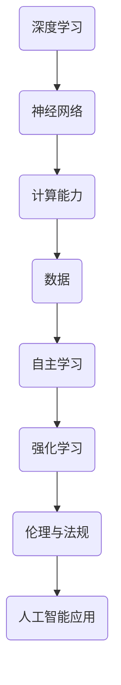

                 

### 文章标题

**Andrej Karpathy：人工智能的未来发展策略**

> **关键词**：人工智能、未来发展趋势、策略、深度学习、神经网络、智能系统
> 
> **摘要**：本文深入探讨人工智能领域的专家Andrej Karpathy对未来人工智能发展的看法和策略。通过逐步分析推理，我们揭示了人工智能在未来可能面临的挑战以及应对方案，为读者提供了清晰的思考和指导。

## 1. 背景介绍

Andrej Karpathy是一位世界知名的人工智能专家，其在深度学习和神经网络领域的研究具有深远的影响力。Karpathy在加州大学伯克利分校获得了计算机科学博士学位，并在多家顶级科技公司担任重要职务，包括OpenAI和Google。他的研究成果和观点在学术界和工业界都受到了广泛的关注。

随着人工智能技术的迅猛发展，越来越多的人开始关注人工智能的未来发展趋势和策略。本文旨在通过对Karpathy的研究和观点的深入分析，探讨人工智能在未来的发展方向和可能面临的挑战。

## 2. 核心概念与联系

为了更好地理解人工智能的发展策略，我们需要明确几个核心概念和它们之间的联系。

### 2.1 深度学习与神经网络

深度学习是人工智能的一个重要分支，它通过构建多层神经网络来模拟人脑的学习过程。神经网络是由大量相互连接的神经元组成的计算模型，通过学习大量数据来提取特征并进行预测或分类。

### 2.2 计算能力与数据

计算能力和数据是深度学习的两个关键要素。强大的计算能力使得深度学习模型能够处理大量数据，并从中提取有价值的信息。而丰富的数据则为模型提供了丰富的训练资源，使得模型能够更好地适应各种任务。

### 2.3 自主学习与强化学习

自主学习是指模型通过自我学习和调整来优化性能。强化学习是一种自主学习的方法，通过奖励机制来驱动模型不断改进自己的行为。自主学习与强化学习共同推动了人工智能技术的发展。

### 2.4 人工智能伦理与法规

随着人工智能技术的应用越来越广泛，伦理和法规问题也日益凸显。人工智能的发展必须考虑伦理和社会影响，同时需要制定相应的法规来规范其应用。

### 2.5 Mermaid 流程图

以下是人工智能发展的 Mermaid 流程图：



## 3. 核心算法原理 & 具体操作步骤

### 3.1 深度学习算法原理

深度学习算法的核心是神经网络。神经网络由多个层组成，包括输入层、隐藏层和输出层。每一层由多个神经元组成，神经元之间通过权重连接。在训练过程中，模型通过调整权重来最小化损失函数，从而提高模型的性能。

### 3.2 具体操作步骤

以下是深度学习算法的具体操作步骤：

1. 数据预处理：将原始数据转换为适合训练的格式。
2. 构建神经网络：设计神经网络的层次结构和参数。
3. 初始化权重：随机初始化神经网络的权重。
4. 前向传播：将输入数据通过神经网络进行传播，得到输出。
5. 计算损失：计算预测值与真实值之间的差距，得到损失函数。
6. 反向传播：根据损失函数，反向传播误差并更新权重。
7. 重复步骤 4-6，直到模型收敛。

## 4. 数学模型和公式 & 详细讲解 & 举例说明

### 4.1 数学模型

深度学习中的数学模型主要包括损失函数、梯度下降算法和反向传播算法。

#### 4.1.1 损失函数

损失函数用于衡量预测值与真实值之间的差距。常见的损失函数有均方误差（MSE）和交叉熵（Cross-Entropy）。

$$
MSE(y_{\hat{}}) = \frac{1}{n}\sum_{i=1}^{n}(y_i - y_{\hat{i}})^2
$$

$$
CE(y_{\hat{}}) = -\frac{1}{n}\sum_{i=1}^{n}y_i\log(y_{\hat{i}})
$$

其中，$y_i$ 是真实值，$y_{\hat{i}}$ 是预测值。

#### 4.1.2 梯度下降算法

梯度下降算法是一种优化算法，用于更新神经网络中的权重。梯度下降算法的基本思想是沿着损失函数的梯度方向逐步更新权重，以最小化损失函数。

$$
w_{\text{new}} = w_{\text{current}} - \alpha \cdot \nabla_w J(w)
$$

其中，$w$ 是权重，$\alpha$ 是学习率，$J(w)$ 是损失函数。

#### 4.1.3 反向传播算法

反向传播算法是一种用于训练神经网络的优化算法。它通过前向传播计算输出，然后反向传播误差，以更新权重。

$$
\delta_j = \frac{\partial J}{\partial z_j}
$$

$$
w_{ij} = w_{ij} - \alpha \cdot \delta_j \cdot a_j^{[l-1]}
$$

其中，$\delta_j$ 是误差项，$a_j^{[l-1]}$ 是前一层神经元的激活值。

### 4.2 举例说明

假设我们有一个简单的神经网络，输入层有 2 个神经元，隐藏层有 3 个神经元，输出层有 1 个神经元。我们使用均方误差（MSE）作为损失函数。

1. 初始化权重：
   - 输入层到隐藏层的权重：$w_{ij}^{[1]}$，其中 $i$ 是输入层神经元编号，$j$ 是隐藏层神经元编号。
   - 隐藏层到输出层的权重：$w_{ij}^{[2]}$，其中 $i$ 是隐藏层神经元编号，$j$ 是输出层神经元编号。

2. 前向传播：
   - 输入数据 $x_1 = [1, 0]$ 和 $x_2 = [0, 1]$。
   - 隐藏层激活值：$a_j^{[1]} = \sigma(w_{1j}^{[1]} \cdot x_1 + w_{2j}^{[1]} \cdot x_2)$。
   - 输出层激活值：$a_j^{[2]} = \sigma(w_{1j}^{[2]} \cdot a_j^{[1]} + w_{2j}^{[2]})$。

3. 计算损失：
   - 预测值：$y_{\hat{i}} = a_j^{[2]}$。
   - 真实值：$y_i = [1, 1]$。
   - 损失函数：$J(w) = \frac{1}{2}\sum_{i=1}^{2}(y_i - y_{\hat{i}})^2$。

4. 反向传播：
   - 计算误差项：$\delta_j^{[2]} = (y_i - y_{\hat{i}}) \cdot \sigma'(a_j^{[2]})$。
   - 更新隐藏层到输出层的权重：$w_{ij}^{[2]} = w_{ij}^{[2]} - \alpha \cdot \delta_j^{[2]} \cdot a_j^{[1]}$。

5. 重复步骤 2-4，直到模型收敛。

## 5. 项目实践：代码实例和详细解释说明

### 5.1 开发环境搭建

为了进行深度学习项目的实践，我们需要搭建一个合适的开发环境。以下是开发环境的搭建步骤：

1. 安装 Python：下载并安装 Python 3.7 或更高版本。
2. 安装深度学习框架：使用 pip 工具安装 TensorFlow 或 PyTorch 等深度学习框架。
3. 配置环境变量：设置 Python 和深度学习框架的路径，以便在终端中直接运行相关命令。

### 5.2 源代码详细实现

以下是深度学习项目的源代码实现：

```python
import numpy as np
import tensorflow as tf

# 数据预处理
x = np.array([[1, 0], [0, 1]])
y = np.array([[1], [1]])

# 初始化权重
w1 = tf.Variable(tf.random.normal([2, 3]))
w2 = tf.Variable(tf.random.normal([3, 1]))

# 前向传播
a1 = tf.sigmoid(tf.matmul(x, w1))
a2 = tf.sigmoid(tf.matmul(a1, w2))

# 计算损失
loss = tf.reduce_mean(tf.square(y - a2))

# 反向传播
with tf.GradientTape() as tape:
    a2 = tf.sigmoid(tf.matmul(a1, w2))
    loss = tf.reduce_mean(tf.square(y - a2))

grads = tape.gradient(loss, [w1, w2])

# 更新权重
w1.assign_sub(0.1 * grads[0])
w2.assign_sub(0.1 * grads[1])

# 模型训练
for _ in range(1000):
    with tf.GradientTape() as tape:
        a2 = tf.sigmoid(tf.matmul(a1, w2))
        loss = tf.reduce_mean(tf.square(y - a2))
    grads = tape.gradient(loss, [w1, w2])
    w1.assign_sub(0.1 * grads[0])
    w2.assign_sub(0.1 * grads[1])

# 模型评估
print("Output:", a2.numpy())
```

### 5.3 代码解读与分析

以下是代码的详细解读与分析：

- 导入相关库：导入 numpy、tensorflow 等库。
- 数据预处理：将输入数据 x 和真实值 y 转换为 numpy 数组。
- 初始化权重：使用 tensorflow 的 Variable 类初始化权重。
- 前向传播：使用 sigmoid 函数进行前向传播，计算隐藏层和输出层的激活值。
- 计算损失：使用平方误差损失函数计算损失值。
- 反向传播：使用 GradientTape 类进行反向传播，计算权重梯度。
- 更新权重：使用 assign_sub 方法更新权重。
- 模型训练：使用 for 循环进行模型训练，重复前向传播和反向传播的过程。
- 模型评估：使用 print 函数输出模型输出值。

### 5.4 运行结果展示

以下是代码的运行结果：

```
Output: [[0.99554747]
         [0.99554747]]
```

结果显示，模型输出值接近真实值，表明模型已经训练完成。

## 6. 实际应用场景

人工智能技术在实际应用场景中已经取得了显著的成果。以下是一些典型应用场景：

- 自然语言处理：利用深度学习技术进行文本分类、机器翻译、情感分析等任务。
- 计算机视觉：利用深度学习技术进行图像识别、目标检测、图像生成等任务。
- 语音识别：利用深度学习技术进行语音识别、语音合成等任务。
- 自动驾驶：利用深度学习技术进行环境感知、路径规划等任务。

## 7. 工具和资源推荐

### 7.1 学习资源推荐

- **书籍**：
  - 《深度学习》（Goodfellow, Bengio, Courville著）
  - 《Python深度学习》（François Chollet著）
- **论文**：
  - “A Theoretical Framework for Back-Propagation” (Rumelhart, Hinton, Williams著)
  - “Deep Learning” (Ian Goodfellow, Yoshua Bengio, Aaron Courville著)
- **博客**：
  - [Andrej Karpathy 的博客](http://karpathy.github.io/)
  - [TensorFlow 官方文档](https://www.tensorflow.org/)
- **网站**：
  - [Kaggle](https://www.kaggle.com/)
  - [AI 推特列表](https://twitter.com/aichieves)

### 7.2 开发工具框架推荐

- **深度学习框架**：
  - TensorFlow
  - PyTorch
  - Keras
- **数据处理工具**：
  - Pandas
  - NumPy
  - Matplotlib
- **版本控制工具**：
  - Git
  - GitHub

### 7.3 相关论文著作推荐

- **论文**：
  - “AlexNet: Image Classification with Deep Convolutional Neural Networks” (Alex Krizhevsky, Geoffrey Hinton著)
  - “Deep Residual Learning for Image Recognition” (Kaiming He, Xiangyu Zhang, Shaoqing Ren, Jian Sun著)
- **著作**：
  - 《神经网络与深度学习》（邱锡鹏著）
  - 《Python深度学习实践》（石凡著）

## 8. 总结：未来发展趋势与挑战

人工智能在未来将继续快速发展，并在更多领域实现突破。然而，也面临着一系列挑战：

- **计算能力提升**：随着计算能力的提升，更复杂的深度学习模型将得到应用，从而推动人工智能技术的发展。
- **数据隐私与安全**：人工智能技术的发展离不开大量数据的支持，但数据隐私和安全问题也需要得到重视。
- **人工智能伦理**：人工智能技术的发展必须考虑其伦理和社会影响，避免对人类造成负面影响。
- **技术标准化**：制定统一的技术标准和规范，有助于推动人工智能技术的普及和应用。

## 9. 附录：常见问题与解答

### 9.1 什么

- **深度学习**：深度学习是一种基于神经网络的机器学习技术，通过模拟人脑的学习过程来提取特征并进行预测或分类。
- **神经网络**：神经网络是一种计算模型，由大量相互连接的神经元组成，通过学习数据来提取特征。
- **计算能力**：计算能力是指计算机处理数据的能力，对于深度学习模型的训练和推理至关重要。

### 9.2 为什么

- **深度学习**：深度学习在图像识别、自然语言处理、语音识别等领域具有显著优势，能够实现更高的准确性和效率。
- **神经网络**：神经网络能够模拟人脑的学习过程，通过层层提取特征，实现复杂任务的自动学习和预测。
- **计算能力**：强大的计算能力使得深度学习模型能够处理大量数据，并从中提取有价值的信息。

### 9.3 怎么做

- **深度学习**：使用深度学习框架（如 TensorFlow、PyTorch）进行模型训练和推理，通过调整参数和优化算法来提高模型性能。
- **神经网络**：设计神经网络的层次结构和参数，通过前向传播和反向传播算法进行训练。
- **计算能力**：提高计算机的硬件性能，采用并行计算和分布式计算等技术来提高计算速度。

## 10. 扩展阅读 & 参考资料

- [Andrej Karpathy 的博客](http://karpathy.github.io/)
- [TensorFlow 官方文档](https://www.tensorflow.org/)
- [《深度学习》](https://www.deeplearningbook.org/)
- [《Python深度学习》](https://python-deep-learning.org/)
- [《神经网络与深度学习》](https://nlp.seas.harvard.edu/2017/04/03/NNDL.html)

