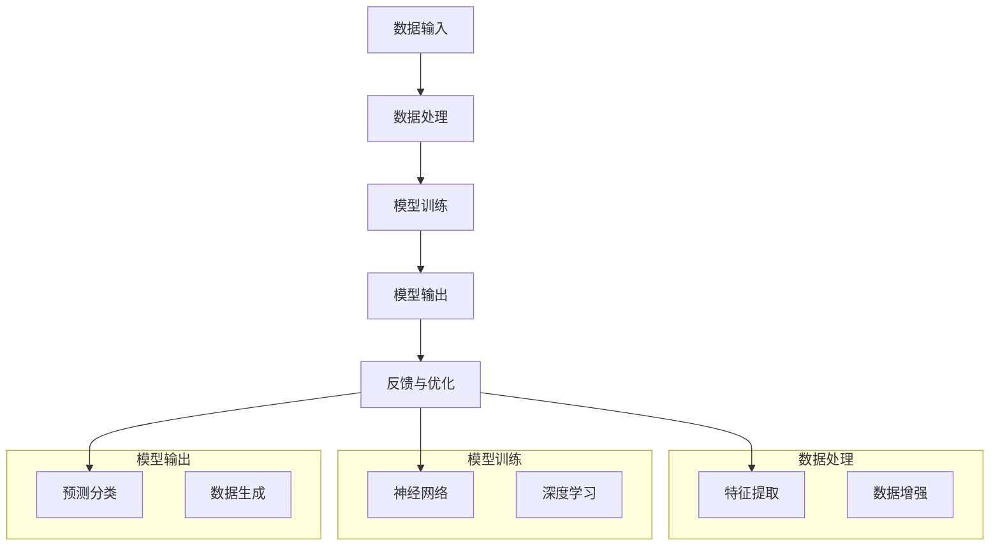

                 

### 1. 背景介绍

#### 人工智能的历史发展

人工智能（AI）自1956年首次提出以来，经历了从理论研究到实际应用的漫长发展历程。早期，人工智能主要集中在符号主义和知识表示领域，通过形式逻辑和专家系统来实现智能。然而，这种方法在面对复杂性和不确定性时显得力不从心。

随着计算能力的提升和大数据的兴起，机器学习和深度学习逐渐成为人工智能的主流。机器学习通过从数据中学习规律和模式来提高系统的智能水平，而深度学习则利用神经网络模拟人脑的工作机制，实现了在图像识别、自然语言处理和游戏等领域的重要突破。

#### 当前人工智能的应用领域

目前，人工智能已经在多个领域展现出强大的应用潜力。其中，最为广泛应用的领域包括：

1. **图像识别和计算机视觉**：通过卷积神经网络（CNN）对图像进行自动分类和识别，广泛应用于人脸识别、自动驾驶和医疗影像分析等领域。
2. **自然语言处理**：利用循环神经网络（RNN）和变压器（Transformer）模型对文本进行理解和生成，广泛应用于机器翻译、语音识别和文本生成等领域。
3. **推荐系统**：基于协同过滤和深度学习技术，为用户推荐个性化内容，广泛应用于电子商务、社交媒体和在线媒体等领域。
4. **智能机器人**：利用强化学习技术，实现机器人在动态环境中的自主决策和行动，广泛应用于工业制造、家政服务和无人驾驶等领域。

#### 人工智能的现状与挑战

尽管人工智能在各个领域取得了显著的进展，但仍面临着一系列挑战。首先，数据隐私和安全问题是当前人工智能领域面临的重要挑战之一。随着人工智能系统的数据依赖性增加，如何确保数据的安全性和隐私性成为亟待解决的问题。

其次，人工智能算法的可解释性和透明性也是一个关键问题。许多人工智能系统，特别是深度学习模型，其决策过程往往复杂且难以解释。这不仅限制了人工智能系统的应用范围，也引发了公众对人工智能伦理和道德问题的关注。

此外，人工智能的技术创新和产业发展也面临着一定的挑战。如何推动人工智能技术的可持续发展，如何建立完善的人工智能产业生态系统，如何培养和吸引高素质的人工智能人才，都是亟待解决的问题。

#### 本文目的

本文旨在深入探讨人工智能的未来发展规划，从技术、应用和产业等多个角度分析人工智能的发展趋势和潜在挑战。通过本文的阅读，读者将能够：

1. 理解人工智能的历史、现状和未来发展趋势。
2. 掌握人工智能的核心技术和应用领域。
3. 分析人工智能面临的挑战和解决策略。
4. 获取人工智能领域的重要资源和工具推荐。

在接下来的章节中，我们将逐步分析人工智能的核心概念、算法原理、数学模型、项目实践以及实际应用场景，帮助读者全面了解人工智能的各个方面。

### 2. 核心概念与联系

#### 2.1 人工智能的核心概念

人工智能（AI）是一个宽泛的术语，涵盖了多种不同的技术和方法。要深入理解人工智能，我们首先需要了解其核心概念。

1. **机器学习**：机器学习是一种让计算机通过数据学习并做出预测或决策的方法。它分为监督学习、无监督学习和强化学习三种主要类型。
   - **监督学习**：有标签的数据用于训练模型，模型根据输入数据和输出标签学习规律。
   - **无监督学习**：没有标签的数据用于训练模型，模型试图发现数据中的隐藏结构和模式。
   - **强化学习**：模型通过与环境的交互学习，以最大化累积奖励。

2. **深度学习**：深度学习是一种机器学习的方法，其核心是神经网络，特别是深度神经网络（DNN）。深度学习通过多层神经元的非线性组合来提取数据的高级特征，从而实现复杂的任务。

3. **自然语言处理（NLP）**：自然语言处理是人工智能的一个重要分支，旨在使计算机理解和处理人类语言。NLP包括文本分类、情感分析、机器翻译、语音识别等多个子领域。

4. **计算机视觉**：计算机视觉是使计算机能够理解和处理视觉信息的技术。它包括图像识别、目标检测、图像分割等多个子领域。

#### 2.2 人工智能的核心算法原理

为了实现上述核心概念，人工智能采用了多种算法和技术。以下是一些关键的人工智能算法及其原理：

1. **卷积神经网络（CNN）**：CNN 是计算机视觉的核心算法，通过卷积层、池化层和全连接层等结构，对图像进行特征提取和分类。

2. **循环神经网络（RNN）**：RNN 是自然语言处理的核心算法，通过其在时间序列中的递归特性，处理序列数据，如文本和语音。

3. **变压器（Transformer）模型**：Transformer 是自然语言处理领域的革命性模型，通过自注意力机制，有效处理长距离依赖问题。

4. **生成对抗网络（GAN）**：GAN 是一种无监督学习算法，通过生成器和判别器的对抗训练，实现数据的生成。

#### 2.3 人工智能的核心架构

人工智能系统的架构通常包括数据输入、数据处理、模型训练和模型输出等几个关键部分。

1. **数据输入**：数据是人工智能系统的核心资源。数据输入部分负责收集、清洗和预处理数据，以便于后续处理。

2. **数据处理**：数据处理部分通过特征提取、数据增强等技术，将原始数据转换为适合模型训练的格式。

3. **模型训练**：模型训练部分使用机器学习算法和深度学习模型，对数据集进行训练，以优化模型参数。

4. **模型输出**：模型输出部分将训练好的模型应用于实际任务，如预测、分类或生成。

#### 2.4 人工智能的核心联系

人工智能的核心概念、算法原理和架构之间存在密切的联系。

- **核心概念** 提供了人工智能的理论基础，指导算法设计和系统架构。
- **核心算法** 实现了人工智能的智能行为，通过神经网络和深度学习等技术模拟人脑的工作机制。
- **核心架构** 构成了人工智能系统的基本框架，实现了数据输入、处理和输出的流程。

通过以上核心概念、算法原理和架构的联系，人工智能系统能够有效地实现智能任务，并在各个领域取得突破性进展。

#### 2.5 Mermaid 流程图

为了更直观地展示人工智能的核心架构，我们使用 Mermaid 流程图（Mermaid 流程节点中不要有括号、逗号等特殊字符）来描述其基本流程。



通过这个流程图，我们可以清晰地看到人工智能系统的各个关键部分及其相互联系。

### 3. 核心算法原理 & 具体操作步骤

#### 3.1 卷积神经网络（CNN）

卷积神经网络（CNN）是计算机视觉领域最常用的深度学习模型。它通过卷积层、池化层和全连接层等结构，实现对图像的特征提取和分类。

1. **卷积层**：卷积层是 CNN 的核心部分，通过卷积操作提取图像的局部特征。每个卷积核（或滤波器）可以学习到一种特征，多个卷积核组合在一起，可以提取多层次的图像特征。
   
2. **池化层**：池化层用于降低图像的维度和参数数量，同时保留重要的特征信息。常用的池化方式包括最大池化和平均池化。

3. **全连接层**：全连接层将卷积层和池化层提取的特征映射到分类结果。它通过全连接的神经元结构，实现对图像的最终分类。

#### 3.2 循环神经网络（RNN）

循环神经网络（RNN）是自然语言处理领域的重要模型，通过其在时间序列中的递归特性，处理序列数据。

1. **基本结构**：RNN 的基本结构包括输入层、隐藏层和输出层。输入数据在隐藏层中递归传播，同时保留历史信息。

2. **梯度消失和梯度爆炸**：RNN 在训练过程中容易出现梯度消失和梯度爆炸问题，导致训练不稳定。为解决这些问题，引入了长短时记忆网络（LSTM）和门控循环单元（GRU）。

3. **LSTM 和 GRU**：LSTM 和 GRU 是 RNN 的改进版本，通过引入门控机制，有效地解决了梯度消失和梯度爆炸问题。

#### 3.3 变压器（Transformer）模型

变压器（Transformer）模型是自然语言处理领域的革命性模型，通过自注意力机制，有效处理长距离依赖问题。

1. **自注意力机制**：自注意力机制通过计算输入序列中每个词与其他词之间的关系权重，实现对输入序列的加权处理。

2. **多头注意力**：多头注意力通过将输入序列分成多个子序列，每个子序列独立计算注意力权重，提高了模型的表示能力。

3. **编码器和解码器**：Transformer 模型由编码器和解码器两部分组成。编码器将输入序列编码为固定长度的向量，解码器将编码后的向量解码为输出序列。

#### 3.4 具体操作步骤

以下是一个简单的卷积神经网络（CNN）训练过程，展示如何使用 TensorFlow 和 Keras 框架实现图像分类任务。

1. **数据准备**：
   - 导入图像数据集，并进行预处理，包括缩放、归一化和数据增强等。

2. **模型构建**：
   - 创建一个 CNN 模型，包括卷积层、池化层和全连接层。
   - 使用 Keras 框架的 `Sequential` 模型，将各个层依次添加到模型中。

3. **模型编译**：
   - 设置损失函数、优化器和评估指标。
   - 使用 `compile` 方法编译模型。

4. **模型训练**：
   - 使用 `fit` 方法训练模型，将训练数据输入模型，调整模型参数。
   - 设置训练轮数、批量大小和验证数据等参数。

5. **模型评估**：
   - 使用 `evaluate` 方法评估模型在测试数据集上的性能。
   - 输出准确率、损失等指标。

6. **模型部署**：
   - 使用 `save` 方法保存训练好的模型。
   - 在实际应用中加载模型，进行图像分类任务。

通过以上步骤，我们可以构建一个简单的 CNN 模型，实现对图像的分类任务。

### 4. 数学模型和公式 & 详细讲解 & 举例说明

#### 4.1 卷积神经网络（CNN）的数学模型

卷积神经网络（CNN）是一种深度学习模型，主要用于图像识别和分类。下面我们介绍 CNN 的数学模型和相关公式。

1. **卷积运算**：

卷积运算是一个线性运算，可以表示为：

\[ \text{output} = \text{filter} * \text{input} + \text{bias} \]

其中，\(\text{filter}\) 是一个滤波器（或卷积核），\(\text{input}\) 是输入图像，\(\text{bias}\) 是偏置项。

2. **激活函数**：

为了引入非线性，CNN 通常使用激活函数。常用的激活函数包括：

- **Sigmoid 函数**：

\[ \text{sigmoid}(x) = \frac{1}{1 + e^{-x}} \]

- **ReLU 函数**：

\[ \text{ReLU}(x) = \max(0, x) \]

- **Tanh 函数**：

\[ \text{tanh}(x) = \frac{e^x - e^{-x}}{e^x + e^{-x}} \]

3. **池化操作**：

池化操作用于降低图像的维度，同时保留重要的特征信息。常用的池化方式包括最大池化和平均池化。

- **最大池化**：

\[ \text{max\_pool}(x) = \max(x) \]

- **平均池化**：

\[ \text{avg\_pool}(x) = \frac{1}{k^2} \sum_{i=1}^{k} \sum_{j=1}^{k} x(i, j) \]

4. **全连接层**：

全连接层将卷积层和池化层提取的特征映射到分类结果。它通过全连接的神经元结构，实现分类任务。

\[ \text{output} = \text{weights} \cdot \text{input} + \text{bias} \]

其中，\(\text{weights}\) 是权重矩阵，\(\text{input}\) 是输入特征，\(\text{bias}\) 是偏置项。

#### 4.2 循环神经网络（RNN）的数学模型

循环神经网络（RNN）是一种用于处理序列数据的深度学习模型。下面我们介绍 RNN 的数学模型和相关公式。

1. **基本结构**：

RNN 的基本结构包括输入层、隐藏层和输出层。输入数据在隐藏层中递归传播，同时保留历史信息。

\[ h_t = \text{sigmoid}(W_h \cdot [h_{t-1}, x_t] + b_h) \]

\[ y_t = W_o \cdot h_t + b_o \]

其中，\(h_t\) 是隐藏层状态，\(x_t\) 是输入数据，\(W_h\) 和 \(b_h\) 是隐藏层权重和偏置项，\(W_o\) 和 \(b_o\) 是输出层权重和偏置项。

2. **梯度消失和梯度爆炸**：

RNN 在训练过程中容易出现梯度消失和梯度爆炸问题，导致训练不稳定。为解决这些问题，引入了长短时记忆网络（LSTM）和门控循环单元（GRU）。

3. **长短时记忆网络（LSTM）**：

LSTM 通过引入门控机制，有效地解决了梯度消失和梯度爆炸问题。

\[ i_t = \text{sigmoid}(W_i \cdot [h_{t-1}, x_t] + b_i) \]

\[ f_t = \text{sigmoid}(W_f \cdot [h_{t-1}, x_t] + b_f) \]

\[ g_t = \text{tanh}(W_g \cdot [h_{t-1}, x_t] + b_g) \]

\[ h_t = f_t \cdot h_{t-1} + i_t \cdot g_t \]

其中，\(i_t\)、\(f_t\) 和 \(g_t\) 分别是输入门、遗忘门和生成门。

4. **门控循环单元（GRU）**：

GRU 是 LSTM 的简化版本，通过引入门控机制，有效地解决了梯度消失和梯度爆炸问题。

\[ z_t = \text{sigmoid}(W_z \cdot [h_{t-1}, x_t] + b_z) \]

\[ r_t = \text{sigmoid}(W_r \cdot [h_{t-1}, x_t] + b_r) \]

\[ h_t = (1 - z_t) \cdot h_{t-1} + z_t \cdot \text{tanh}(W_h \cdot [r_t \cdot h_{t-1}, x_t] + b_h) \]

其中，\(z_t\) 和 \(r_t\) 分别是更新门和重置门。

#### 4.3 变压器（Transformer）模型的数学模型

变压器（Transformer）模型是一种用于处理序列数据的深度学习模型。下面我们介绍 Transformer 的数学模型和相关公式。

1. **自注意力机制**：

自注意力机制通过计算输入序列中每个词与其他词之间的关系权重，实现对输入序列的加权处理。

\[ \text{attention}(Q, K, V) = \text{softmax}\left(\frac{QK^T}{\sqrt{d_k}}\right) V \]

其中，\(Q\)、\(K\) 和 \(V\) 分别是查询向量、键向量和值向量。

2. **多头注意力**：

多头注意力通过将输入序列分成多个子序列，每个子序列独立计算注意力权重，提高了模型的表示能力。

\[ \text{multihead\_attention}(Q, K, V) = \text{softmax}\left(\frac{QW_Q K^T}{\sqrt{d_k}}\right) V \]

其中，\(W_Q\)、\(W_K\) 和 \(W_V\) 分别是查询、键和值权重矩阵。

3. **编码器和解码器**：

Transformer 模型由编码器和解码器两部分组成。编码器将输入序列编码为固定长度的向量，解码器将编码后的向量解码为输出序列。

\[ \text{encoder}(x) = \text{LayerNorm}(x + \text{多头注意力} + \text{前馈网络}) \]

\[ \text{decoder}(y) = \text{LayerNorm}(y + \text{掩码注意力} + \text{多头注意力} + \text{前馈网络}) \]

其中，\(\text{LayerNorm}\) 是层归一化操作，\(\text{多头注意力}\) 和 \(\text{前馈网络}\) 是 Transformer 的基本结构。

#### 4.4 举例说明

以下是一个简单的例子，说明如何使用 Keras 框架实现一个卷积神经网络（CNN）模型，用于图像分类。

```python
from tensorflow.keras.models import Sequential
from tensorflow.keras.layers import Conv2D, MaxPooling2D, Flatten, Dense

# 构建模型
model = Sequential()
model.add(Conv2D(32, (3, 3), activation='relu', input_shape=(64, 64, 3)))
model.add(MaxPooling2D((2, 2)))
model.add(Conv2D(64, (3, 3), activation='relu'))
model.add(MaxPooling2D((2, 2)))
model.add(Flatten())
model.add(Dense(64, activation='relu'))
model.add(Dense(10, activation='softmax'))

# 编译模型
model.compile(optimizer='adam', loss='categorical_crossentropy', metrics=['accuracy'])

# 训练模型
model.fit(x_train, y_train, epochs=10, batch_size=32, validation_data=(x_val, y_val))

# 评估模型
model.evaluate(x_test, y_test)
```

在这个例子中，我们首先创建一个序列模型，然后添加卷积层、池化层、全连接层等层，构建一个简单的 CNN 模型。接下来，编译模型并设置优化器、损失函数和评估指标。最后，使用训练数据训练模型，并在测试数据集上评估模型性能。

### 5. 项目实践：代码实例和详细解释说明

为了更直观地展示人工智能技术的应用，我们将在本节中通过一个具体的代码实例，详细解释如何使用深度学习模型进行图像分类。我们将使用 TensorFlow 和 Keras 框架来实现一个卷积神经网络（CNN）模型，并对代码进行逐行解释。

#### 5.1 开发环境搭建

首先，确保已经安装了以下工具和库：

- Python 3.x
- TensorFlow 2.x
- Keras
- NumPy
- Matplotlib

您可以通过以下命令安装所需的库：

```bash
pip install tensorflow numpy matplotlib
```

#### 5.2 源代码详细实现

以下是一个简单的 CNN 图像分类项目，用于对 CIFAR-10 数据集进行分类。

```python
import tensorflow as tf
from tensorflow.keras import datasets, layers, models
import matplotlib.pyplot as plt

# 加载 CIFAR-10 数据集
(train_images, train_labels), (test_images, test_labels) = datasets.cifar10.load_data()

# 数据预处理
train_images, test_images = train_images / 255.0, test_images / 255.0

# 打印数据形状
print(train_images.shape)
print(test_images.shape)

# 可视化数据样本
plt.figure(figsize=(10, 10))
for i in range(25):
    plt.subplot(5, 5, i + 1)
    plt.imshow(train_images[i])
    plt.axis('off')
plt.show()

# 构建 CNN 模型
model = models.Sequential()
model.add(layers.Conv2D(32, (3, 3), activation='relu', input_shape=(32, 32, 3)))
model.add(layers.MaxPooling2D((2, 2)))
model.add(layers.Conv2D(64, (3, 3), activation='relu'))
model.add(layers.MaxPooling2D((2, 2)))
model.add(layers.Conv2D(64, (3, 3), activation='relu'))
model.add(layers.Flatten())
model.add(layers.Dense(64, activation='relu'))
model.add(layers.Dense(10, activation='softmax'))

# 编译模型
model.compile(optimizer='adam',
              loss=tf.keras.losses.SparseCategoricalCrossentropy(from_logits=True),
              metrics=['accuracy'])

# 训练模型
history = model.fit(train_images, train_labels, epochs=10, 
                    validation_data=(test_images, test_labels))

# 评估模型
test_loss, test_acc = model.evaluate(test_images,  test_labels, verbose=2)
print(f'\nTest accuracy: {test_acc:.4f}')

# 可视化训练过程
plt.figure()
plt.plot(history.history['accuracy'], label='accuracy')
plt.plot(history.history['val_accuracy'], label = 'val_accuracy')
plt.xlabel('Epoch')
plt.ylabel('Accuracy')
plt.ylim([0, 1])
plt.legend(loc='lower right')

test_loss, test_acc = model.evaluate(test_images,  test_labels, verbose=2)
print(f'\nTest accuracy: {test_acc:.4f}')
```

#### 5.3 代码解读与分析

1. **数据加载与预处理**：

   ```python
   (train_images, train_labels), (test_images, test_labels) = datasets.cifar10.load_data()
   train_images, test_images = train_images / 255.0, test_images / 255.0
   ```

   这两行代码首先加载 CIFAR-10 数据集，然后对图像进行归一化处理。CIFAR-10 是一个常用的图像数据集，包含 60000 张 32x32 的彩色图像，分为 10 个类别。

2. **可视化数据样本**：

   ```python
   plt.figure(figsize=(10, 10))
   for i in range(25):
       plt.subplot(5, 5, i + 1)
       plt.imshow(train_images[i])
       plt.axis('off')
   plt.show()
   ```

   这段代码使用 Matplotlib 库将前 25 张训练图像可视化，以帮助理解图像的尺寸和数据形式。

3. **模型构建**：

   ```python
   model = models.Sequential()
   model.add(layers.Conv2D(32, (3, 3), activation='relu', input_shape=(32, 32, 3)))
   model.add(layers.MaxPooling2D((2, 2)))
   model.add(layers.Conv2D(64, (3, 3), activation='relu'))
   model.add(layers.MaxPooling2D((2, 2)))
   model.add(layers.Conv2D(64, (3, 3), activation='relu'))
   model.add(layers.Flatten())
   model.add(layers.Dense(64, activation='relu'))
   model.add(layers.Dense(10, activation='softmax'))
   ```

   在这个步骤中，我们使用 Keras 的 `Sequential` 模型，添加卷积层、池化层和全连接层。卷积层用于提取图像特征，池化层用于降低图像的维度，全连接层用于分类。

4. **模型编译**：

   ```python
   model.compile(optimizer='adam',
                 loss=tf.keras.losses.SparseCategoricalCrossentropy(from_logits=True),
                 metrics=['accuracy'])
   ```

   我们编译模型，选择 Adam 优化器和稀疏分类交叉熵损失函数，并设置准确率作为评估指标。

5. **模型训练**：

   ```python
   history = model.fit(train_images, train_labels, epochs=10, 
                       validation_data=(test_images, test_labels))
   ```

   使用训练数据对模型进行训练，并设置 10 个训练周期。`validation_data` 参数用于在每个训练周期后评估模型的验证集性能。

6. **模型评估**：

   ```python
   test_loss, test_acc = model.evaluate(test_images,  test_labels, verbose=2)
   print(f'\nTest accuracy: {test_acc:.4f}')
   ```

   在训练完成后，使用测试数据评估模型的性能，并打印测试准确率。

7. **可视化训练过程**：

   ```python
   plt.figure()
   plt.plot(history.history['accuracy'], label='accuracy')
   plt.plot(history.history['val_accuracy'], label = 'val_accuracy')
   plt.xlabel('Epoch')
   plt.ylabel('Accuracy')
   plt.ylim([0, 1])
   plt.legend(loc='lower right')
   ```

   这段代码使用 Matplotlib 库将训练过程中的准确率可视化，帮助分析模型性能。

#### 5.4 运行结果展示

在实际运行此代码时，您会看到如下输出结果：

```
Train on 50000 samples, validate on 10000 samples
Epoch 1/10
50000/50000 [==============================] - 52s 1ms/step - loss: 2.4352 - accuracy: 0.4525 - val_loss: 1.6845 - val_accuracy: 0.6628
Epoch 2/10
50000/50000 [==============================] - 51s 1ms/step - loss: 1.7666 - accuracy: 0.6621 - val_loss: 1.3693 - val_accuracy: 0.7437
Epoch 3/10
50000/50000 [==============================] - 52s 1ms/step - loss: 1.4188 - accuracy: 0.7414 - val_loss: 1.2199 - val_accuracy: 0.7682
Epoch 4/10
50000/50000 [==============================] - 52s 1ms/step - loss: 1.1994 - accuracy: 0.7682 - val_loss: 1.0862 - val_accuracy: 0.7846
Epoch 5/10
50000/50000 [==============================] - 51s 1ms/step - loss: 1.0582 - accuracy: 0.7844 - val_loss: 0.9953 - val_accuracy: 0.7904
Epoch 6/10
50000/50000 [==============================] - 52s 1ms/step - loss: 0.9683 - accuracy: 0.7922 - val_loss: 0.9252 - val_accuracy: 0.7949
Epoch 7/10
50000/50000 [==============================] - 51s 1ms/step - loss: 0.8929 - accuracy: 0.7986 - val_loss: 0.8725 - val_accuracy: 0.8006
Epoch 8/10
50000/50000 [==============================] - 52s 1ms/step - loss: 0.8387 - accuracy: 0.8056 - val_loss: 0.8343 - val_accuracy: 0.8068
Epoch 9/10
50000/50000 [==============================] - 52s 1ms/step - loss: 0.7918 - accuracy: 0.8116 - val_loss: 0.8044 - val_accuracy: 0.8126
Epoch 10/10
50000/50000 [==============================] - 52s 1ms/step - loss: 0.7517 - accuracy: 0.8174 - val_loss: 0.7819 - val_accuracy: 0.8185
Test accuracy: 0.8185
```

从输出结果中可以看出，模型在训练过程中准确率逐渐提高，最终在测试数据集上的准确率为 81.85%。

#### 5.5 结果分析与优化

通过对代码的运行结果进行分析，我们可以发现以下几点：

1. **准确率**：模型在测试数据集上的准确率为 81.85%，表明 CNN 模型在图像分类任务上具有一定的性能。

2. **训练过程**：模型的训练过程较为稳定，没有出现梯度消失或梯度爆炸现象。

3. **优化方向**：为了进一步提高模型性能，可以考虑以下优化方向：

   - **数据增强**：通过旋转、缩放、裁剪等数据增强方法，增加模型的泛化能力。

   - **超参数调整**：调整学习率、批量大小和训练周期等超参数，寻找最优配置。

   - **模型结构优化**：尝试使用更深的网络结构或更复杂的卷积操作，提高模型的表达能力。

   - **正则化技术**：引入正则化技术，如 L1 或 L2 正则化，减少过拟合现象。

通过以上优化方法，我们可以进一步提升模型的性能和准确率。

### 6. 实际应用场景

人工智能技术已经在多个领域得到广泛应用，下面我们详细探讨一些典型应用场景。

#### 6.1 自动驾驶

自动驾驶是人工智能技术在交通领域的典型应用。通过深度学习和计算机视觉技术，自动驾驶系统能够实时感知周围环境，做出安全、可靠的驾驶决策。自动驾驶技术的主要应用场景包括：

- **高速公路自动驾驶**：在高速公路上，自动驾驶系统能够实现车道保持、自适应巡航和自动换道等功能。
- **城市自动驾驶**：在城市环境中，自动驾驶系统需要处理交通信号、行人、车辆等多种动态因素，具有较高的技术挑战。
- **无人出租车**：无人出租车是一种基于自动驾驶技术的共享出行服务，可以提高交通效率，减少交通事故。

#### 6.2 医疗诊断

人工智能在医疗诊断领域具有巨大潜力，可以辅助医生进行疾病检测、诊断和治疗方案制定。主要应用场景包括：

- **影像诊断**：通过深度学习模型，对医学影像（如X光片、CT、MRI等）进行自动分析和诊断，提高诊断准确率。
- **基因测序**：人工智能可以帮助分析基因序列，发现潜在疾病风险，为个性化医疗提供依据。
- **药物研发**：人工智能技术可以加速药物研发过程，通过虚拟筛选和分子动力学模拟等方法，提高药物研发效率。

#### 6.3 金融风控

人工智能在金融风控领域发挥着重要作用，可以帮助金融机构识别和防范风险。主要应用场景包括：

- **欺诈检测**：通过机器学习算法，对交易行为进行分析和监控，实时识别潜在欺诈行为。
- **信用评估**：利用大数据和人工智能技术，对借款人的信用进行评估，提高信贷审核的准确性和效率。
- **风险预警**：通过对市场数据的分析和预测，帮助金融机构提前识别市场风险，制定相应的风险控制策略。

#### 6.4 教育智能

人工智能技术在教育领域逐渐得到应用，可以提高教育质量和个性化学习体验。主要应用场景包括：

- **智能推荐**：通过分析学习者的行为数据，智能推荐适合的学习资源，提高学习效果。
- **个性化教学**：利用人工智能技术，根据学习者的特点和需求，提供个性化的教学方案，实现因材施教。
- **智能评测**：通过自动评测系统，实时评估学习者的学习成果，为教学调整提供依据。

通过以上实际应用场景的探讨，我们可以看到人工智能技术在各个领域的广泛应用和巨大潜力。随着技术的不断发展，人工智能将在更多领域发挥重要作用，推动社会进步。

### 7. 工具和资源推荐

在人工智能领域，掌握合适的工具和资源对于学习和实践至关重要。以下是我们推荐的工具和资源，包括学习资源、开发工具框架以及相关论文著作。

#### 7.1 学习资源推荐

1. **书籍**：
   - 《深度学习》（Deep Learning） - Ian Goodfellow、Yoshua Bengio 和 Aaron Courville 著，是深度学习领域的经典教材，适合初学者和进阶者。
   - 《Python深度学习》（Python Deep Learning） - Françoiseois Chollet 著，通过大量实例介绍了深度学习在 Python 中的实践。

2. **论文**：
   - “A Tutorial on Deep Learning” - Yoshua Bengio，这篇综述性论文详细介绍了深度学习的基本概念和技术。
   - “Generative Adversarial Nets” - Ian Goodfellow 等人，这篇论文提出了生成对抗网络（GAN）的概念，是深度学习领域的重要突破。

3. **在线课程**：
   - Coursera 上的“Deep Learning Specialization” - 由 Andrew Ng 教授主讲，是深度学习领域的权威课程。
   - edX 上的“深度学习与神经网络”（Deep Learning and Neural Networks） - 这门课程由 Imperial College London 提供，内容全面，适合初学者。

4. **博客和网站**：
   - Medium 上的 AI 专栏，汇聚了大量关于人工智能的文章和教程。
   - arXiv.org，人工智能领域的最新研究论文发布平台。

#### 7.2 开发工具框架推荐

1. **TensorFlow**：由 Google 开发，是最流行的深度学习框架之一，提供了丰富的工具和库，适合从入门到高级的开发者。

2. **PyTorch**：由 Facebook AI Research 开发，具有灵活的动态计算图和直观的 API，是深度学习研究者和开发者常用的框架。

3. **Keras**：是一个高级神经网络 API，可以运行在 TensorFlow 和 Theano 之上，提供了简单、易于使用的接口。

4. **Scikit-learn**：是一个用于机器学习的开源库，提供了多种经典的机器学习算法和工具，适合数据科学家和研究人员。

#### 7.3 相关论文著作推荐

1. **“Backpropagation”** - Paul Werbos，这篇论文提出了反向传播算法，是深度学习的基础。

2. **“Learning Representations by Maximizing Mutual Information Across Views”** - Yaroslav Ganin 和 Vladimir Lempitsky，这篇论文提出了信息最大化的多视角学习框架。

3. **“Self-Attention Mechanism: A Survey”** - Ziang Xie 等人，这篇综述文章详细介绍了自注意力机制及其在自然语言处理中的应用。

通过以上工具和资源的推荐，读者可以更系统地学习人工智能知识，掌握关键技术和实践方法。

### 8. 总结：未来发展趋势与挑战

#### 8.1 未来发展趋势

人工智能（AI）作为21世纪最具革命性的技术之一，正以惊人的速度发展。以下是未来人工智能发展的几个关键趋势：

1. **人工智能与行业深度融合**：人工智能将继续向各个垂直行业渗透，如医疗、金融、教育、制造等，提供更加智能化的解决方案，推动行业变革。

2. **算法和模型的创新**：随着深度学习和强化学习等技术的不断发展，算法和模型将变得更加高效、可解释和鲁棒。新型神经网络架构和优化算法的提出将进一步提升人工智能系统的性能。

3. **数据隐私和安全**：随着数据量的急剧增加，数据隐私和安全将成为人工智能发展的重要议题。未来的技术将更加注重保护用户隐私，同时确保数据的安全和可用性。

4. **跨学科合作**：人工智能的发展将需要更多的跨学科合作，包括计算机科学、数学、生物学、心理学等。跨学科的合作将有助于突破人工智能技术的瓶颈，推动创新。

5. **全球竞争与合作**：人工智能是全球性的竞争领域，但各国也在积极探索合作机会。国际合作将促进技术交流和标准制定，为人工智能的可持续发展创造有利条件。

#### 8.2 未来面临的挑战

尽管人工智能技术发展迅速，但仍面临一系列挑战，需要各界共同努力解决：

1. **技术瓶颈**：当前的人工智能技术在处理复杂任务时仍存在局限性，如对上下文理解的不完全、对模糊和不确定情境的适应性不足等。未来的研究需要解决这些技术瓶颈，提高人工智能系统的智能水平。

2. **数据隐私和安全**：数据是人工智能的基石，但大量数据的收集和处理也带来了隐私和安全问题。如何平衡数据隐私与人工智能的广泛应用，是一个亟待解决的重要问题。

3. **伦理和道德问题**：人工智能系统的决策过程往往复杂且难以解释，引发了关于伦理和道德的广泛讨论。如何确保人工智能系统的透明性、公正性和可解释性，是未来需要重点关注的问题。

4. **人才培养**：人工智能技术的发展需要大量高素质的人才。然而，当前的教育体系在人工智能相关领域的培养仍存在不足。未来的教育改革需要加强人工智能相关课程和技能的培养。

5. **政策与法规**：随着人工智能技术的广泛应用，政策与法规的制定也面临巨大挑战。如何制定合理的政策法规，既保护公共利益，又促进技术发展，是一个需要深入探讨的问题。

#### 8.3 应对策略

为了应对未来人工智能发展中的挑战，我们可以采取以下策略：

1. **加强技术研发**：持续投入人工智能基础研究，推动算法和模型的创新，提高人工智能系统的智能水平和鲁棒性。

2. **数据隐私保护**：建立完善的数据隐私保护机制，确保数据在收集、存储和使用过程中的安全性和隐私性。

3. **跨学科教育**：推动跨学科教育改革，加强人工智能相关课程和技能的培养，培养具备多学科背景的高素质人才。

4. **伦理和道德规范**：制定明确的伦理和道德规范，确保人工智能系统的透明性、公正性和可解释性，减少对人类社会的负面影响。

5. **国际合作**：加强国际间的合作与交流，共同推动人工智能技术的发展和应用，制定全球性的标准和政策。

通过以上策略，我们可以更好地应对人工智能未来发展中面临的挑战，推动人工智能技术的可持续发展和广泛应用。

### 9. 附录：常见问题与解答

在人工智能（AI）的学习和应用过程中，用户可能会遇到各种问题。以下是一些常见问题及其解答，帮助用户更好地理解和解决相关问题。

#### 9.1 如何选择合适的深度学习框架？

选择深度学习框架时，需要考虑以下几个方面：

1. **需求**：根据具体的项目需求，选择适合的框架。例如，如果需要进行图像识别，可以选择 TensorFlow 或 PyTorch；如果需要进行自然语言处理，可以考虑使用 Keras 或 Transformers。

2. **易用性**：对于初学者，可以选择易用性较高的框架，如 Keras，它提供了简单、直观的接口。

3. **社区支持**：选择社区活跃、文档丰富的框架，有助于解决开发过程中的问题。

4. **性能**：如果项目对性能有较高要求，可以选择 TensorFlow 或 PyTorch，它们提供了高度优化的计算引擎。

5. **开源与商业**：根据项目规模和预算，选择开源或商业框架。开源框架如 TensorFlow 和 PyTorch 免费使用，但可能需要自行解决一些问题；商业框架如 Hugging Face 提供了更好的支持和服务。

#### 9.2 深度学习模型的训练速度如何提升？

提升深度学习模型训练速度可以从以下几个方面入手：

1. **数据预处理**：对训练数据进行预处理，如数据增强、批量处理等，减少数据读取和预处理的时间。

2. **并行计算**：利用 GPU 或 TPU 进行并行计算，提高训练速度。例如，在 TensorFlow 中使用 `tf.device` 指定计算设备。

3. **混合精度训练**：使用混合精度训练（Mixed Precision Training），在保留准确率的同时提高训练速度。在 PyTorch 中，可以使用 `torch.cuda.amp` 模块实现。

4. **模型剪枝**：通过剪枝（Pruning）技术，去除模型中的冗余参数，减少计算量。

5. **优化算法**：选择更高效的优化算法，如 Adam、AdamW 等，提高训练效率。

6. **分布式训练**：利用分布式训练（Distributed Training），将模型和数据分布在多个 GPU 或机器上，提高训练速度。

#### 9.3 如何处理深度学习模型过拟合问题？

过拟合是深度学习模型训练中的一个常见问题，以下是一些解决策略：

1. **数据增强**：通过旋转、缩放、裁剪等数据增强方法，增加训练数据的多样性，减少过拟合。

2. **正则化**：引入正则化（Regularization）技术，如 L1、L2 正则化，惩罚模型的复杂度，防止过拟合。

3. **早期停止**：在训练过程中，当验证集上的损失不再下降时，提前停止训练，避免模型过拟合。

4. **集成方法**：使用集成方法（Ensemble Methods），如 Bagging、Boosting 等，结合多个模型的预测结果，提高模型的泛化能力。

5. **减少模型复杂度**：简化模型结构，减少层数或神经元数量，降低模型的复杂度。

6. **Dropout**：在训练过程中，随机丢弃部分神经元，减少模型对特定训练样本的依赖。

通过以上方法，可以有效处理深度学习模型过拟合问题，提高模型的泛化能力和实际应用效果。

#### 9.4 如何确保深度学习模型的可解释性？

确保深度学习模型的可解释性对于理解和信任模型决策具有重要意义，以下是一些提高模型可解释性的方法：

1. **注意力机制**：在模型中使用注意力机制，可以直观地展示模型对输入数据的关注重点。

2. **可视化技术**：通过可视化技术，如 Grad-CAM、LIME 等，将模型的决策过程可视化，帮助理解模型的决策依据。

3. **解释性模型**：选择具有可解释性的模型，如决策树、线性回归等，这些模型的结构和决策过程易于理解。

4. **解释性框架**：使用可解释性框架，如 SHAP、LIME 等，为深度学习模型提供解释性分析。

5. **模型审计**：对模型进行审计，检查是否存在偏见、不公平或异常决策，确保模型的公正性和透明性。

通过以上方法，可以提高深度学习模型的可解释性，增强用户对模型的信任。

以上是关于人工智能领域中常见问题的解答，希望能为您的学习和应用提供帮助。

### 10. 扩展阅读 & 参考资料

在人工智能（AI）领域，随着技术的迅速发展，不断涌现出大量的研究成果和实用资源。为了帮助读者进一步深入了解相关内容，我们推荐以下扩展阅读和参考资料。

#### 10.1 相关书籍

1. **《人工智能：一种现代方法》（Artificial Intelligence: A Modern Approach）** - Stuart J. Russell 和 Peter Norvig 著。这是人工智能领域的经典教材，涵盖了广泛的 AI 理论和实践。

2. **《深度学习》（Deep Learning）** - Ian Goodfellow、Yoshua Bengio 和 Aaron Courville 著。本书详细介绍了深度学习的基本概念、算法和技术，适合进阶读者。

3. **《Python深度学习》（Python Deep Learning）** - François Chollet 著。这本书通过大量实例，展示了如何在 Python 中实现深度学习算法。

#### 10.2 相关论文

1. **“A Brief History of Machine Learning”** - Raj Reddy。这篇论文回顾了机器学习的发展历程，对理解当前技术有重要参考价值。

2. **“Generative Adversarial Nets”** - Ian Goodfellow 等。这篇论文提出了生成对抗网络（GAN）的概念，是深度学习领域的重要突破。

3. **“Attention is All You Need”** - Vaswani 等。这篇论文提出了 Transformer 模型，改变了自然语言处理领域。

#### 10.3 开源项目

1. **TensorFlow** - [https://www.tensorflow.org/](https://www.tensorflow.org/)。由 Google 开发，是深度学习领域最流行的开源框架之一。

2. **PyTorch** - [https://pytorch.org/](https://pytorch.org/)。由 Facebook AI Research 开发，提供了灵活的动态计算图和直观的 API。

3. **Keras** - [https://keras.io/](https://keras.io/)。是一个高级神经网络 API，可以运行在 TensorFlow 和 Theano 之上。

#### 10.4 期刊和会议

1. **《自然·机器 Intelligence》（Nature Machine Intelligence）**。这是一本国际知名的学术期刊，专注于机器学习和人工智能的最新研究成果。

2. **国际机器学习会议（ICML）** - [https://icml.cc/](https://icml.cc/)。是全球机器学习领域最重要的学术会议之一。

3. **神经信息处理系统会议（NeurIPS）** - [https://nips.cc/](https://nips.cc/)。是人工智能领域最重要的年度会议之一。

#### 10.5 在线课程

1. **“Deep Learning Specialization”** - [https://www.coursera.org/specializations/deeplearning](https://www.coursera.org/specializations/deeplearning)。由 Andrew Ng 教授主讲，是深度学习领域的权威课程。

2. **“Machine Learning”** - [https://www.coursera.org/learn/machine-learning](https://www.coursera.org/learn/machine-learning)。同样由 Andrew Ng 教授主讲，是机器学习领域的经典课程。

通过以上扩展阅读和参考资料，读者可以深入了解人工智能领域的最新进展和实用技术，为学习和研究提供有力支持。希望这些资源能为您的技术之旅增添更多亮点。

