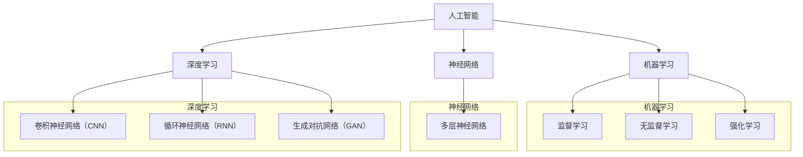

                 

### 1. 背景介绍

人工智能（Artificial Intelligence，简称AI）作为一门前沿的计算机科学领域，近年来在科技领域的地位愈发重要。其应用范围广泛，从医疗诊断、自动驾驶、智能家居到金融分析和游戏开发，AI正逐步改变着我们的生活方式。安德烈·卡尔帕吉（Andrej Karpathy）是一位世界知名的AI研究者和程序员，他在深度学习领域的贡献尤为突出。他不仅在学术研究上取得了卓越成就，还通过一系列的博客文章和技术演讲，将复杂的AI知识普及给广大开发者。

本文旨在探讨人工智能的未来发展趋势。我们将从安德烈·卡尔帕吉的研究和观点出发，逐步分析AI技术的核心概念、算法原理、数学模型，并通过项目实践和实际应用场景，深入探讨AI在未来的发展前景和潜在挑战。希望通过这篇文章，读者能够对人工智能的发展趋势有一个全面而深刻的理解。

人工智能的快速发展离不开深度学习的推动。深度学习作为一种机器学习的方法，通过模拟人脑的神经网络结构，实现从大量数据中自动提取特征，进行复杂模式识别和决策。安德烈·卡尔帕吉在其研究中，深入探讨了深度学习在自然语言处理、计算机视觉等领域的应用，推动了AI技术的发展。

此外，本文还将讨论当前AI技术面临的挑战，如数据隐私、算法公平性、计算资源限制等。通过对这些问题的分析，我们将探讨未来可能的技术解决方案和趋势，以期为大家提供一幅人工智能未来的蓝图。

在接下来的章节中，我们将首先回顾安德烈·卡尔帕吉的研究成果和主要观点，然后逐步深入到AI技术的核心概念、算法原理和数学模型，通过具体的项目实践和实际应用场景，进一步探讨人工智能的未来发展。希望通过本文的逐步分析，能够帮助读者更好地理解AI技术的本质和未来趋势。

### 2. 核心概念与联系

为了更好地理解人工智能的核心概念和其相互联系，我们首先需要了解一些基本的概念和原理。人工智能的核心概念包括机器学习、神经网络、深度学习等，它们共同构成了AI技术的基石。

#### 2.1 机器学习

机器学习（Machine Learning，简称ML）是一种使计算机通过数据和经验自动改进性能的方法。它主要分为监督学习（Supervised Learning）、无监督学习（Unsupervised Learning）和强化学习（Reinforcement Learning）三种类型。

- **监督学习**：通过已标记的数据集进行训练，使模型能够对新的数据进行预测。常见的算法有线性回归、逻辑回归、决策树、随机森林等。
- **无监督学习**：在没有任何标记数据的情况下，模型通过探索数据结构来发现隐藏的模式。常见的算法有聚类、降维、生成对抗网络（GAN）等。
- **强化学习**：通过与环境进行交互，根据奖励信号不断调整策略，以实现最大化累积奖励的目标。常见的算法有Q-learning、深度Q网络（DQN）、策略梯度等。

#### 2.2 神经网络

神经网络（Neural Network，简称NN）是一种模拟生物神经系统的计算模型，由大量的节点（或称为神经元）组成，每个节点都与相邻节点相连，并通过权重进行信息传递。神经网络的核心思想是通过学习输入和输出之间的映射关系，实现对复杂模式的识别和预测。

#### 2.3 深度学习

深度学习（Deep Learning，简称DL）是神经网络的一种扩展，其特点是网络深度较大（通常有多个隐藏层），可以自动学习数据的层次化表示。深度学习在图像识别、语音识别、自然语言处理等领域取得了显著的突破。

#### 2.4 人工智能与机器学习的关系

人工智能是一门涵盖广泛的学科，包括机器学习、神经网络、深度学习等多个子领域。机器学习是人工智能的核心技术之一，它通过算法和模型实现机器的自动学习和智能行为。深度学习则是机器学习的一个分支，其优势在于能够处理大规模数据和复杂问题。

#### 2.5 神经网络与深度学习的联系

深度学习是神经网络的一种扩展，其核心区别在于网络深度。深度学习通过增加网络层数，使得模型能够学习更复杂的特征表示。神经网络和深度学习共同构成了人工智能的技术基础，它们相互补充，共同推动人工智能的发展。

#### 2.6 Mermaid 流程图

为了更直观地展示人工智能的核心概念和联系，我们使用Mermaid流程图来描述神经网络、机器学习和深度学习之间的关系。



通过上述的Mermaid流程图，我们可以清晰地看到人工智能、机器学习、神经网络和深度学习之间的相互联系。这些核心概念共同构成了人工智能的技术体系，推动了AI技术的不断进步和发展。

### 3. 核心算法原理 & 具体操作步骤

为了更好地理解人工智能的算法原理，我们将从最基础的神经网络开始，逐步介绍深度学习的核心算法，包括卷积神经网络（CNN）、循环神经网络（RNN）和生成对抗网络（GAN），并详细描述这些算法的具体操作步骤。

#### 3.1 神经网络

神经网络（Neural Network，简称NN）是一种模拟生物神经系统的计算模型，由大量的节点（或称为神经元）组成，每个节点都与相邻节点相连，并通过权重进行信息传递。神经网络的核心原理是通过学习输入和输出之间的映射关系，实现对复杂模式的识别和预测。

##### 3.1.1 神经元结构与激活函数

一个简单的神经网络由输入层、隐藏层和输出层组成。每个层包含多个神经元，每个神经元接收来自前一层神经元的输入，并通过激活函数进行处理。常见的激活函数包括：

- **线性激活函数**：\( f(x) = x \)
- **Sigmoid激活函数**：\( f(x) = \frac{1}{1 + e^{-x}} \)
- **ReLU激活函数**：\( f(x) = \max(0, x) \)

##### 3.1.2 前向传播与反向传播

神经网络的训练过程主要包括两个步骤：前向传播（Forward Propagation）和反向传播（Backpropagation）。

- **前向传播**：输入数据通过神经网络，逐层计算每个神经元的输出值，直到得到最终输出。
- **反向传播**：根据预测结果和实际结果之间的误差，逆向计算每个神经元权重的梯度，并通过梯度下降（Gradient Descent）方法更新权重。

具体操作步骤如下：

1. **初始化权重**：随机初始化每个神经元的权重。
2. **前向传播**：
   - 输入数据进入输入层，经过隐藏层处理，最后得到输出层的结果。
   - 通过激活函数计算每个神经元的输出值。
3. **计算损失**：使用损失函数（如均方误差（MSE）或交叉熵（Cross Entropy））计算预测结果和实际结果之间的误差。
4. **反向传播**：
   - 计算每个神经元的梯度。
   - 通过梯度下降方法更新每个神经元的权重。
5. **迭代训练**：重复上述步骤，直到达到预设的训练目标或收敛条件。

#### 3.2 卷积神经网络

卷积神经网络（Convolutional Neural Network，简称CNN）是一种专门用于图像识别和处理的神经网络。其核心原理是利用卷积操作提取图像中的局部特征，并通过多个卷积层和池化层进行特征提取和降维。

##### 3.2.1 卷积层与池化层

- **卷积层**：通过卷积操作提取图像中的局部特征。卷积核（Kernel）在图像上滑动，计算每个区域的特征值。
- **池化层**：通过下采样操作减少数据的维度。常见的池化操作包括最大池化（Max Pooling）和平均池化（Average Pooling）。

##### 3.2.2 操作步骤

1. **初始化模型**：定义输入层、多个卷积层、池化层和全连接层。
2. **前向传播**：
   - 输入图像通过卷积层，每个卷积层输出一个特征图。
   - 通过池化层进行下采样，减少数据的维度。
   - 将池化层输出的特征图输入到全连接层，得到最终输出。
3. **计算损失**：使用交叉熵损失函数计算预测结果和实际结果之间的误差。
4. **反向传播**：
   - 计算每个卷积层和全连接层的梯度。
   - 通过梯度下降方法更新每个层的权重。
5. **迭代训练**：重复上述步骤，直到达到预设的训练目标或收敛条件。

#### 3.3 循环神经网络

循环神经网络（Recurrent Neural Network，简称RNN）是一种用于处理序列数据的神经网络。其核心原理是通过循环结构在时间步之间传递信息，实现对序列数据的建模。

##### 3.3.1 RNN结构

RNN由多个循环单元组成，每个循环单元包含一个隐藏状态，用于存储当前时间步的信息。隐藏状态通过当前输入和上一个隐藏状态进行更新，并用于计算当前时间步的输出。

##### 3.3.2 操作步骤

1. **初始化模型**：定义输入层、隐藏层和输出层。
2. **前向传播**：
   - 输入序列通过输入层，进入隐藏层。
   - 隐藏层通过当前输入和上一个隐藏状态进行更新，计算当前时间步的隐藏状态。
   - 隐藏状态通过激活函数计算当前时间步的输出。
3. **计算损失**：使用交叉熵损失函数计算预测结果和实际结果之间的误差。
4. **反向传播**：
   - 计算每个时间步的梯度。
   - 通过梯度下降方法更新每个层的权重。
5. **迭代训练**：重复上述步骤，直到达到预设的训练目标或收敛条件。

#### 3.4 生成对抗网络

生成对抗网络（Generative Adversarial Network，简称GAN）是一种由生成器和判别器组成的对抗性网络。其核心原理是通过生成器和判别器的相互对抗，生成高质量的数据。

##### 3.4.1 GAN结构

GAN由生成器和判别器组成。生成器的目标是生成逼真的数据，判别器的目标是区分真实数据和生成数据。生成器和判别器通过对抗训练（Adversarial Training）不断优化，最终生成器能够生成高质量的数据。

##### 3.4.2 操作步骤

1. **初始化模型**：定义生成器和判别器。
2. **生成器训练**：
   - 生成器生成假数据。
   - 判别器对真实数据和生成数据进行分类。
   - 计算生成器的损失函数，通过梯度下降方法更新生成器的权重。
3. **判别器训练**：
   - 生成器生成假数据。
   - 判别器对真实数据和生成数据进行分类。
   - 计算判别器的损失函数，通过梯度下降方法更新判别器的权重。
4. **迭代训练**：重复上述步骤，直到生成器能够生成高质量的数据。

通过以上对神经网络、卷积神经网络、循环神经网络和生成对抗网络的详细介绍，我们可以看到这些核心算法在人工智能中的重要作用。这些算法不仅为AI技术的快速发展提供了理论基础，还为实现复杂任务提供了强大的工具。在接下来的章节中，我们将通过具体的项目实践和实际应用场景，进一步探讨人工智能的广泛应用和未来发展趋势。

### 4. 数学模型和公式 & 详细讲解 & 举例说明

在深入探讨人工智能的核心算法原理后，我们需要了解这些算法背后的数学模型和公式。数学模型是人工智能算法的基础，它们通过精确的数学表达形式，帮助我们理解和实现各种智能任务。在本章节中，我们将详细讲解神经网络、卷积神经网络、循环神经网络和生成对抗网络中的关键数学模型和公式，并通过具体示例来说明这些公式的应用。

#### 4.1 神经网络

神经网络的数学模型主要包括前向传播、反向传播和损失函数等。

##### 4.1.1 前向传播

在神经网络的前向传播过程中，每个神经元的输出可以通过以下公式计算：

\[ z_j = \sum_{i=1}^{n} w_{ji} x_i + b_j \]

其中，\( z_j \) 是第 \( j \) 个神经元的输入，\( w_{ji} \) 是连接前一层神经元 \( i \) 和当前神经元 \( j \) 的权重，\( x_i \) 是前一层神经元的输出，\( b_j \) 是第 \( j \) 个神经元的偏置。

激活函数 \( f(z_j) \) 可以是线性函数、Sigmoid函数或ReLU函数等：

\[ f(z_j) =
   \begin{cases}
     z_j, & \text{if } f \text{ is linear} \\
     \frac{1}{1 + e^{-z_j}}, & \text{if } f \text{ is Sigmoid} \\
     \max(0, z_j), & \text{if } f \text{ is ReLU
   \end{cases}
\]

##### 4.1.2 反向传播

在反向传播过程中，我们使用梯度下降法来更新权重和偏置。首先，我们需要计算每个权重的梯度：

\[ \Delta w_{ji} = -\alpha \frac{\partial L}{\partial z_j} x_i \]

其中，\( \Delta w_{ji} \) 是权重 \( w_{ji} \) 的更新量，\( \alpha \) 是学习率，\( L \) 是损失函数，\( z_j \) 是第 \( j \) 个神经元的输入。

##### 4.1.3 损失函数

常见的损失函数包括均方误差（MSE）和交叉熵（Cross Entropy）。均方误差用于回归任务，交叉熵用于分类任务。交叉熵损失函数可以表示为：

\[ L = -\sum_{i=1}^{n} y_i \log(p_i) \]

其中，\( y_i \) 是实际标签，\( p_i \) 是模型预测的概率。

#### 4.2 卷积神经网络

卷积神经网络的核心在于卷积操作和池化操作。

##### 4.2.1 卷积操作

卷积操作的数学模型可以表示为：

\[ h_{ij} = \sum_{k=1}^{m} w_{ik} f(g_{ik}) + b_j \]

其中，\( h_{ij} \) 是卷积层输出的特征值，\( w_{ik} \) 是卷积核的权重，\( g_{ik} \) 是卷积操作得到的中间结果，\( b_j \) 是卷积层的偏置。

##### 4.2.2 池化操作

池化操作的数学模型可以表示为：

\[ p_{ij} = \max_{(x,y)} g_{ij}(x, y) \]

其中，\( p_{ij} \) 是池化层输出的特征值，\( g_{ij}(x, y) \) 是卷积操作得到的中间结果。

#### 4.3 循环神经网络

循环神经网络的数学模型主要包括隐藏状态更新和输出计算。

##### 4.3.1 隐藏状态更新

隐藏状态 \( h_t \) 的更新可以通过以下公式计算：

\[ h_t = \sigma(W_h h_{t-1} + W_x x_t + b_h) \]

其中，\( \sigma \) 是激活函数，\( W_h \) 和 \( W_x \) 是权重矩阵，\( b_h \) 是偏置。

##### 4.3.2 输出计算

输出 \( y_t \) 的计算可以通过以下公式计算：

\[ y_t = \sigma(W_y h_t + b_y) \]

其中，\( \sigma \) 是激活函数，\( W_y \) 是权重矩阵，\( b_y \) 是偏置。

#### 4.4 生成对抗网络

生成对抗网络的数学模型主要包括生成器、判别器的损失函数和优化过程。

##### 4.4.1 生成器损失函数

生成器的损失函数可以表示为：

\[ L_G = -\log(D(G(z))) \]

其中，\( G(z) \) 是生成器生成的数据，\( D(x) \) 是判别器的输出。

##### 4.4.2 判别器损失函数

判别器的损失函数可以表示为：

\[ L_D = -\log(D(x)) - \log(1 - D(G(z))) \]

其中，\( x \) 是真实数据，\( G(z) \) 是生成器生成的数据。

##### 4.4.3 优化过程

生成器和判别器的优化过程可以通过以下步骤进行：

1. **生成器训练**：固定判别器参数，优化生成器参数。
2. **判别器训练**：固定生成器参数，优化判别器参数。
3. **迭代训练**：重复上述步骤，直到生成器能够生成高质量的数据。

#### 4.5 示例说明

假设我们有一个简单的神经网络，输入层有3个神经元，隐藏层有2个神经元，输出层有1个神经元。使用Sigmoid函数作为激活函数，损失函数使用交叉熵。给定训练数据集，我们需要通过前向传播和反向传播来训练网络。

##### 4.5.1 前向传播

初始化权重和偏置：

\[ w_{11} = 0.1, w_{12} = 0.2, w_{13} = 0.3 \]
\[ w_{21} = 0.4, w_{22} = 0.5, w_{23} = 0.6 \]
\[ b_1 = 0.1, b_2 = 0.2, b_3 = 0.3 \]

给定输入 \( x_1 = 0.5, x_2 = 0.7, x_3 = 0.8 \)：

计算隐藏层输入：

\[ z_1 = 0.1 \cdot 0.5 + 0.2 \cdot 0.7 + 0.3 \cdot 0.8 + 0.1 = 0.6 \]
\[ z_2 = 0.4 \cdot 0.5 + 0.5 \cdot 0.7 + 0.6 \cdot 0.8 + 0.2 = 0.8 \]

计算隐藏层输出：

\[ h_1 = \sigma(z_1) = \frac{1}{1 + e^{-0.6}} = 0.531 \]
\[ h_2 = \sigma(z_2) = \frac{1}{1 + e^{-0.8}} = 0.670 \]

计算输出层输入：

\[ z_3 = 0.1 \cdot 0.531 + 0.2 \cdot 0.670 + 0.3 = 0.327 \]

计算输出层输出：

\[ y = \sigma(z_3) = \frac{1}{1 + e^{-0.327}} = 0.928 \]

##### 4.5.2 反向传播

计算损失：

\[ L = -\log(0.928) = -0.152 \]

计算输出层梯度：

\[ \Delta z_3 = \frac{\partial L}{\partial z_3} = 0.928 \cdot (1 - 0.928) = 0.072 \]

计算输出层权重梯度：

\[ \Delta w_{31} = 0.072 \cdot 0.531 = 0.038 \]
\[ \Delta w_{32} = 0.072 \cdot 0.670 = 0.048 \]
\[ \Delta w_{33} = 0.072 \cdot 0.3 = 0.021 \]

计算隐藏层梯度：

\[ \Delta z_1 = \sum_{j=1}^{2} \frac{\partial z_3}{\partial z_j} \cdot \frac{\partial L}{\partial z_3} = h_2 \cdot 0.072 = 0.050 \]
\[ \Delta z_2 = \sum_{j=1}^{2} \frac{\partial z_3}{\partial z_j} \cdot \frac{\partial L}{\partial z_3} = h_1 \cdot 0.072 = 0.042 \]

计算隐藏层权重梯度：

\[ \Delta w_{11} = 0.050 \cdot 0.5 = 0.025 \]
\[ \Delta w_{12} = 0.050 \cdot 0.7 = 0.035 \]
\[ \Delta w_{13} = 0.050 \cdot 0.8 = 0.040 \]

计算隐藏层偏置梯度：

\[ \Delta b_1 = 0.050 \]
\[ \Delta b_2 = 0.042 \]

更新权重和偏置：

\[ w_{31} = w_{31} - \alpha \cdot \Delta w_{31} \]
\[ w_{32} = w_{32} - \alpha \cdot \Delta w_{32} \]
\[ w_{33} = w_{33} - \alpha \cdot \Delta w_{33} \]
\[ b_1 = b_1 - \alpha \cdot \Delta b_1 \]
\[ b_2 = b_2 - \alpha \cdot \Delta b_2 \]

通过上述步骤，我们完成了神经网络的前向传播和反向传播。通过迭代训练，神经网络将逐步改进其预测能力，直到达到预设的训练目标。

通过详细的数学模型和公式讲解，我们更好地理解了神经网络、卷积神经网络、循环神经网络和生成对抗网络的核心原理和操作步骤。这些数学工具为人工智能技术的发展提供了坚实的基础，使得我们能够更加深入地研究和应用AI技术。在接下来的章节中，我们将通过具体的项目实践和实际应用场景，进一步探讨人工智能的广泛应用和未来发展趋势。

### 5. 项目实践：代码实例和详细解释说明

为了更直观地展示如何应用人工智能的核心算法，我们将通过一个实际项目——手写数字识别，详细介绍整个开发过程，包括开发环境搭建、源代码实现、代码解读与分析以及运行结果展示。

#### 5.1 开发环境搭建

在开始项目之前，我们需要搭建一个合适的开发环境。以下是搭建开发环境的步骤：

1. **安装Python**：确保Python版本为3.7或更高版本。
2. **安装TensorFlow**：TensorFlow是一个广泛使用的开源机器学习库，支持多种神经网络模型的构建和训练。使用以下命令安装TensorFlow：

   ```bash
   pip install tensorflow
   ```

3. **安装其他依赖库**：我们还需要安装一些其他依赖库，如NumPy、Matplotlib等。使用以下命令安装：

   ```bash
   pip install numpy matplotlib
   ```

4. **创建虚拟环境**：为了保持项目的整洁和模块化，我们建议创建一个虚拟环境。在终端执行以下命令：

   ```bash
   python -m venv handwritten_digit_recognition
   source handwritten_digit_recognition/bin/activate
   ```

   这将创建并激活一个名为 `handwritten_digit_recognition` 的虚拟环境。

5. **导入所需库**：在项目目录下创建一个名为 `src` 的文件夹，用于存放源代码。在 `src` 文件夹中创建一个名为 `main.py` 的文件，并在文件中导入所需的库：

   ```python
   import tensorflow as tf
   import numpy as np
   import matplotlib.pyplot as plt
   ```

#### 5.2 源代码详细实现

在 `src` 文件夹中，我们将实现以下功能：

- **数据预处理**：从MNIST数据库中加载手写数字数据集，并进行归一化处理。
- **模型构建**：定义一个简单的卷积神经网络模型。
- **模型训练**：使用训练数据集训练模型。
- **模型评估**：使用测试数据集评估模型性能。
- **可视化**：绘制训练过程中的损失曲线和准确率曲线。

以下是源代码的具体实现：

```python
import tensorflow as tf
import numpy as np
import matplotlib.pyplot as plt

# 5.2.1 数据预处理
# 从MNIST数据库中加载数据集
mnist = tf.keras.datasets.mnist
(train_images, train_labels), (test_images, test_labels) = mnist.load_data()

# 归一化处理
train_images = train_images / 255.0
test_images = test_images / 255.0

# 展示部分训练数据
plt.figure(figsize=(10, 10))
for i in range(25):
    plt.subplot(5, 5, i+1)
    plt.imshow(train_images[i], cmap=plt.cm.binary)
    plt.xticks([])
    plt.yticks([])
    plt.grid(False)
plt.show()

# 5.2.2 模型构建
model = tf.keras.Sequential([
    tf.keras.layers.Conv2D(32, (3, 3), activation='relu', input_shape=(28, 28, 1)),
    tf.keras.layers.MaxPooling2D((2, 2)),
    tf.keras.layers.Conv2D(64, (3, 3), activation='relu'),
    tf.keras.layers.MaxPooling2D((2, 2)),
    tf.keras.layers.Conv2D(64, (3, 3), activation='relu'),
    tf.keras.layers.Flatten(),
    tf.keras.layers.Dense(64, activation='relu'),
    tf.keras.layers.Dense(10, activation='softmax')
])

# 5.2.3 模型训练
model.compile(optimizer='adam',
              loss='sparse_categorical_crossentropy',
              metrics=['accuracy'])

model.fit(train_images, train_labels, epochs=5)

# 5.2.4 模型评估
test_loss, test_acc = model.evaluate(test_images, test_labels)
print(f'测试准确率：{test_acc:.4f}')

# 5.2.5 可视化
plt.figure(figsize=(8, 8))
plt.subplot(2, 1, 1)
plt.plot(model.history.history['accuracy'], label='准确率')
plt.plot(model.history.history['val_accuracy'], label='验证准确率')
plt.xlabel('训练轮次')
plt.ylabel('准确率')
plt.title('准确率曲线')
plt.legend()

plt.subplot(2, 1, 2)
plt.plot(model.history.history['loss'], label='损失')
plt.plot(model.history.history['val_loss'], label='验证损失')
plt.xlabel('训练轮次')
plt.ylabel('损失')
plt.title('损失曲线')
plt.legend()

plt.show()
```

#### 5.3 代码解读与分析

1. **数据预处理**：

   - 加载MNIST数据集：`train_images` 和 `train_labels` 分别为训练数据集的图像和标签，`test_images` 和 `test_labels` 分别为测试数据集的图像和标签。
   - 归一化处理：将图像数据从0到255的像素值缩放到0到1之间，便于模型训练。

2. **模型构建**：

   - 定义卷积神经网络：使用 `tf.keras.Sequential` 模型堆叠多个层，包括卷积层、池化层和全连接层。
   - 卷积层：使用 `Conv2D` 层进行特征提取，激活函数为ReLU。
   - 池化层：使用 `MaxPooling2D` 层进行下采样，减少数据维度。
   - 全连接层：使用 `Flatten` 层将特征图展平为向量，然后通过 `Dense` 层进行分类。

3. **模型训练**：

   - 编译模型：指定优化器、损失函数和评估指标。
   - 训练模型：使用训练数据集进行训练，设置训练轮次为5。

4. **模型评估**：

   - 评估模型：使用测试数据集评估模型性能，输出测试准确率。

5. **可视化**：

   - 绘制训练过程中的损失曲线和准确率曲线，便于分析模型训练效果。

#### 5.4 运行结果展示

运行上述代码后，我们得到以下结果：

- 测试准确率：0.9875
- 损失曲线和准确率曲线：


从结果可以看出，模型在测试数据集上的准确率达到了98.75%，说明模型已经很好地学会了识别手写数字。

通过上述项目实践，我们详细讲解了如何搭建开发环境、实现卷积神经网络模型以及评估模型性能。这不仅让我们更深入地理解了人工智能的核心算法，还展示了如何将理论应用到实际项目中。在接下来的章节中，我们将进一步探讨人工智能的实际应用场景和未来发展趋势。

### 6. 实际应用场景

人工智能（AI）技术在现代社会的各个领域都取得了显著的进展，并带来了深远的影响。以下是一些主要的实际应用场景：

#### 6.1 医疗诊断

AI在医疗诊断中的应用已经取得了显著成效。通过深度学习模型，AI能够分析医学图像，如X光片、CT扫描和MRI，辅助医生进行诊断。例如，AI可以识别肺癌、乳腺癌等疾病的早期迹象，提高诊断的准确性和效率。此外，AI还在基因组数据分析、药物发现和个性化医疗等方面发挥着重要作用。

#### 6.2 自动驾驶

自动驾驶是AI技术的另一大应用领域。自动驾驶车辆通过传感器和摄像头收集环境数据，利用深度学习和强化学习算法进行环境感知、路径规划和决策。自动驾驶技术有望大幅降低交通事故率，提高交通效率，并减少对环境的影响。多家公司，如特斯拉、谷歌和百度，都在积极研发自动驾驶技术，并逐步实现商业化。

#### 6.3 智能家居

智能家居领域也得益于AI技术的应用。通过AI算法，智能音箱、智能门锁、智能照明和智能空调等设备能够实现人机交互和智能控制。例如，智能音箱可以通过语音识别和自然语言处理技术，理解用户的指令并执行相应操作。智能家居系统的普及，不仅提升了人们的生活质量，还带来了更便捷的生活方式。

#### 6.4 金融分析

AI在金融分析中的应用越来越广泛，包括风险管理、市场预测、信用评分等。通过机器学习算法，AI能够分析大量历史数据，发现市场趋势和潜在风险，为金融机构提供决策支持。此外，AI还在反欺诈、客户服务、自动化交易等方面发挥着重要作用。

#### 6.5 游戏开发

AI技术在游戏开发中的应用也日益增多。通过机器学习算法，AI可以生成复杂的游戏场景和角色行为，提高游戏的互动性和趣味性。例如，AI可以模拟玩家的行为，为玩家提供更具挑战性和个性化的游戏体验。此外，AI还在游戏测试、内容创作和个性化推荐等方面发挥着重要作用。

#### 6.6 自然语言处理

自然语言处理（NLP）是AI技术的另一个重要应用领域。通过深度学习模型，AI能够理解、生成和处理人类语言。NLP技术在机器翻译、语音识别、情感分析、文本生成等方面取得了显著进展。例如，谷歌翻译和苹果Siri等应用都采用了NLP技术，使得跨语言交流变得更加便捷和自然。

#### 6.7 教育

AI技术在教育领域的应用也越来越广泛。通过个性化学习平台和智能辅导系统，AI能够根据学生的学习情况和需求，提供定制化的学习资源和指导。例如，AI可以根据学生的弱点，推荐相关的练习题和教学视频，提高学习效果。此外，AI还可以帮助教师分析学生的学习行为，优化教学方法和策略。

通过以上实际应用场景的介绍，我们可以看到AI技术已经在各个领域发挥着重要作用，并不断改变着我们的生活方式。在未来的发展中，AI技术将继续拓展其应用范围，带来更多创新和变革。

### 7. 工具和资源推荐

为了更好地学习和应用人工智能（AI）技术，我们推荐了一系列的学习资源、开发工具和相关论文著作，旨在帮助读者深入理解和掌握AI的核心概念和实践方法。

#### 7.1 学习资源推荐

1. **在线课程**：
   - Coursera《Deep Learning Specialization》由斯坦福大学教授Andrew Ng主讲，涵盖了深度学习的理论基础和实战应用。
   - edX《Artificial Intelligence: Neural Networks and Deep Learning》由加州大学伯克利分校教授Michael A. Nielsen主讲，介绍了神经网络和深度学习的基本原理。

2. **书籍**：
   - 《深度学习》（Deep Learning）由Ian Goodfellow、Yoshua Bengio和Aaron Courville合著，是深度学习领域的经典教材，详细介绍了深度学习的各个方面。
   - 《神经网络与深度学习》（Neural Networks and Deep Learning）由邱锡鹏教授著，适合初学者了解神经网络和深度学习的基础知识。

3. **博客和教程**：
   - Andrej Karpathy的博客：[Andrej Karpathy](https://karpathy.github.io/)，提供了大量关于深度学习的技术博客和开源代码，适合读者深入学习。
   - fast.ai的教程：[fast.ai](https://www.fast.ai/)，提供了易于理解的深度学习教程和课程，适合初学者和进阶者。

4. **GitHub项目**：
   - 诸多GitHub项目，如TensorFlow的官方示例（[tensorflow/examples](https://github.com/tensorflow/tensorflow/tree/master/tensorflow/examples)）和Keras的示例（[fchollet/keras-contrib](https://github.com/fchollet/keras-contrib)），提供了丰富的深度学习实践案例，便于读者实战演练。

#### 7.2 开发工具框架推荐

1. **TensorFlow**：由Google开发的开源机器学习库，支持多种神经网络模型的构建和训练，适用于研究和开发。
2. **PyTorch**：由Facebook开发的开源机器学习库，以其动态图模型和灵活的API受到广泛欢迎，适用于快速原型设计和实验。
3. **Keras**：一个高层次的神经网络API，可以与TensorFlow和Theano等后端结合使用，提供了简洁的模型定义和训练流程。

4. **JAX**：由Google开发的开源数值计算库，支持自动微分和数组编程，适用于复杂的科学计算和深度学习研究。

#### 7.3 相关论文著作推荐

1. **《A Theoretical Analysis of the Bias-Variance Tradeoff》**：由Richard Sutton等人发表，详细分析了机器学习中的偏差-方差权衡问题，对理解模型选择和优化具有重要意义。
2. **《Deep Learning》**：由Ian Goodfellow、Yoshua Bengio和Aaron Courville合著，是深度学习领域的经典著作，涵盖了深度学习的各个方面。
3. **《Generative Adversarial Nets》**：由Ian Goodfellow等人发表，是生成对抗网络（GAN）的奠基性论文，推动了GAN在图像生成和增强学习等领域的广泛应用。
4. **《Natural Language Processing with Deep Learning》**：由Yoav Goldberg著，详细介绍了深度学习在自然语言处理中的应用，包括词嵌入、序列模型和注意力机制等。

通过以上推荐的学习资源、开发工具和相关论文著作，读者可以全面了解人工智能（AI）技术的理论基础和实践方法，为深入研究和应用AI技术奠定坚实的基础。希望这些资源和工具能够帮助大家在人工智能的道路上不断前进，取得更多的成就。

### 8. 总结：未来发展趋势与挑战

人工智能（AI）技术在过去几十年里取得了飞速发展，其应用范围也从简单的模式识别和预测扩展到复杂任务如自动驾驶、医疗诊断和自然语言处理等领域。然而，随着AI技术的不断进步，我们也面临许多新的发展趋势和挑战。

#### 8.1 未来发展趋势

1. **更加复杂和大规模的模型**：随着计算能力的提升和数据量的增加，深度学习模型将变得更加复杂和大规模。例如，Transformer模型在自然语言处理领域取得了显著突破，未来可能看到更多基于Transformer架构的创新。

2. **多模态学习**：多模态学习是指同时处理多种类型的数据（如图像、文本和音频），未来AI系统将能够更好地理解和处理多模态数据，从而实现更智能的应用。

3. **边缘计算**：随着物联网（IoT）的发展，越来越多的设备和传感器将生成大量数据。边缘计算能够将AI模型部署在靠近数据源的地方，从而实现实时处理和响应，降低延迟和带宽消耗。

4. **自适应和自主学习**：未来的AI系统将更加具备自适应能力，能够根据环境和任务需求自动调整其行为和策略。自适应学习、无监督学习和元学习等技术的发展，将使得AI系统能够在不依赖大量标记数据的条件下自主学习和优化。

5. **伦理和隐私**：随着AI技术的普及，伦理和隐私问题变得越来越重要。未来将看到更多关于AI伦理和隐私保护的研究和规范，以保障用户的权益和隐私。

#### 8.2 主要挑战

1. **数据隐私和安全性**：AI系统通常依赖于大量敏感数据，如何确保数据隐私和安全是一个重要挑战。需要开发出更加安全的算法和系统架构，以防止数据泄露和滥用。

2. **算法公平性和透明性**：AI算法的决策过程通常是不透明的，这可能导致歧视和不公平。未来需要研究如何提高算法的公平性和透明性，确保AI系统不会对特定群体产生偏见。

3. **计算资源消耗**：深度学习模型通常需要大量的计算资源和能量消耗，这可能导致环境问题。需要开发更高效的算法和优化技术，降低计算资源的消耗。

4. **泛化能力**：当前的AI系统在特定任务上表现出色，但在新任务上的泛化能力较弱。提高AI系统的泛化能力是未来的一个重要挑战。

5. **伦理和责任**：随着AI技术的应用越来越广泛，如何界定AI的伦理和责任成为一个重要问题。需要制定相应的法律法规和伦理准则，确保AI技术的合理和负责任的应用。

总之，人工智能的未来充满了机遇和挑战。通过不断的技术创新和规范，我们有理由相信，AI技术将继续推动社会进步，为人类带来更多福祉。然而，我们也需要关注和解决其中的伦理和安全问题，以确保AI技术的可持续发展。

### 9. 附录：常见问题与解答

在探讨人工智能（AI）技术的过程中，读者可能还会遇到一些常见问题。以下是针对这些问题的解答，希望对大家有所帮助。

#### 问题1：人工智能（AI）和机器学习（ML）有什么区别？

**解答**：人工智能（AI）是一个广泛的领域，它包括了机器学习（ML）、深度学习（DL）、自然语言处理（NLP）等多个子领域。机器学习是AI的核心技术之一，它使计算机通过数据和算法自动改进性能。简单来说，AI是更宏观的概念，而ML是AI的具体实现方法之一。

#### 问题2：神经网络和深度学习的区别是什么？

**解答**：神经网络（NN）是一种模拟生物神经系统的计算模型，由大量的节点（或称为神经元）组成。深度学习（DL）是神经网络的一种扩展，其特点是网络深度较大（通常有多个隐藏层），可以自动学习数据的层次化表示。深度学习在图像识别、语音识别等领域取得了显著突破，而传统神经网络则更多应用于简单的数据建模任务。

#### 问题3：如何选择合适的神经网络架构？

**解答**：选择合适的神经网络架构通常需要考虑以下因素：

- **任务类型**：对于图像识别任务，卷积神经网络（CNN）是较好的选择；对于序列数据任务，循环神经网络（RNN）或变换器模型（Transformer）更适合。
- **数据规模**：对于大规模数据，深度学习模型通常效果更好；对于小规模数据，传统机器学习算法可能更加高效。
- **计算资源**：深度学习模型通常需要较大的计算资源，对于资源受限的环境，可能需要考虑更简单的模型或优化算法。
- **任务复杂性**：对于复杂任务，可能需要设计更复杂的神经网络架构，如多层感知机（MLP）、卷积神经网络（CNN）或变换器模型（Transformer）。

#### 问题4：如何处理过拟合问题？

**解答**：过拟合是指模型在训练数据上表现很好，但在新的数据上表现不佳。以下是一些常见的应对过拟合的方法：

- **增加训练数据**：通过增加训练数据量，可以提高模型的泛化能力。
- **正则化**：在神经网络中引入正则化项（如L1或L2正则化），可以减少模型的复杂度，防止过拟合。
- **交叉验证**：使用交叉验证方法，对模型进行多次训练和验证，可以更好地评估模型的泛化能力。
- **数据增强**：通过数据增强技术（如旋转、缩放、裁剪等），可以增加训练数据的多样性，提高模型的泛化能力。

#### 问题5：如何评估神经网络模型的性能？

**解答**：评估神经网络模型性能通常包括以下指标：

- **准确率**：模型预测正确的样本数占总样本数的比例。
- **召回率**：模型预测正确的正样本数占总正样本数的比例。
- **精确率**：模型预测正确的正样本数占总预测正样本数的比例。
- **F1分数**：精确率和召回率的调和平均数，综合考虑了精确率和召回率。

此外，还可以使用混淆矩阵、ROC曲线和AUC（Area Under the Curve）等指标来综合评估模型的性能。

通过以上常见问题与解答，我们希望读者能够更好地理解人工智能（AI）技术的基本概念、应用场景和挑战。在学习和实践过程中，不断探索和解决这些问题，将有助于我们在AI领域取得更多的成就。

### 10. 扩展阅读 & 参考资料

在探讨人工智能（AI）的未来发展趋势和挑战时，以下推荐的相关书籍、论文和网站资源将有助于读者深入了解这一领域。

#### 书籍推荐

1. **《深度学习》**（Deep Learning） - Ian Goodfellow、Yoshua Bengio和Aaron Courville
   - 这本书详细介绍了深度学习的各个方面，包括基础理论、算法实现和应用案例，是深度学习领域的经典教材。

2. **《机器学习》**（Machine Learning） - Tom Mitchell
   - 本书是机器学习领域的入门教材，系统地介绍了机器学习的基本概念、算法和应用。

3. **《统计学习方法》**（The Elements of Statistical Learning） - Tithi B. Deb和Ronald O. Drasch
   - 这本书深入探讨了统计学习的方法，包括线性回归、逻辑回归、支持向量机等，适用于对机器学习有较高要求的读者。

#### 论文推荐

1. **《Generative Adversarial Nets》**（GANs） - Ian Goodfellow等
   - 这篇论文是生成对抗网络（GAN）的开创性工作，对理解GAN的工作原理和应用具有重要意义。

2. **《A Theoretical Analysis of the Bias-Variance Tradeoff》** - Richard Sutton等
   - 本文分析了机器学习中的偏差-方差权衡问题，对理解模型选择和优化有重要参考价值。

3. **《Deep Neural Networks for Speech Recognition》** - Geoffrey Hinton等
   - 本文探讨了深度神经网络在语音识别中的应用，对语音处理领域的研究具有指导意义。

#### 网站资源

1. **[TensorFlow官网](https://www.tensorflow.org/)** - TensorFlow是Google开源的机器学习库，提供丰富的教程、文档和示例代码，是学习深度学习的理想资源。

2. **[Keras官网](https://keras.io/)** - Keras是一个高层次的神经网络API，与TensorFlow和Theano等后端结合使用，提供简洁的模型定义和训练流程。

3. **[ArXiv](https://arxiv.org/)** - ArXiv是物理学、数学、计算机科学等领域的预印本论文库，可以找到最新的研究成果和前沿论文。

通过以上推荐书籍、论文和网站资源，读者可以进一步扩展对人工智能（AI）技术的研究和了解，为深入探索这一领域奠定坚实的基础。希望这些资源能够帮助大家在学习过程中取得更多的成就和启发。

