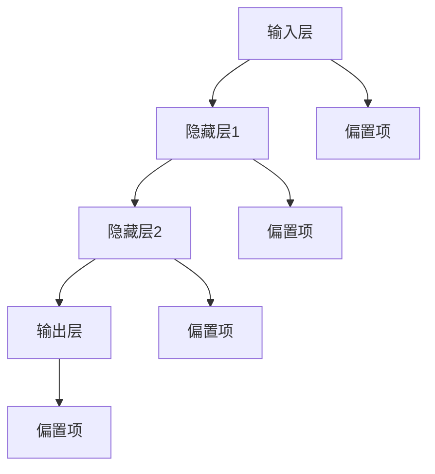

                 

### 背景介绍

人工智能（Artificial Intelligence, AI）作为一种模拟人类智能的技术，已经在过去几十年中取得了显著的进步。它通过算法和数据分析，使计算机能够执行复杂的任务，如图像识别、自然语言处理、决策制定等。随着深度学习（Deep Learning）和神经网络（Neural Networks）等技术的发展，人工智能在各个领域的应用日益广泛。

Andrej Karpathy是一位著名的人工智能专家，以其在深度学习领域的杰出贡献而闻名。他是深度学习框架TensorFlow的核心开发者之一，并且在自然语言处理和计算机视觉领域取得了许多重要的研究成果。他的工作不仅在学术界产生了深远影响，也为工业界提供了实际的应用解决方案。

本文旨在探讨Andrej Karpathy在人工智能领域的研究成果及其对未来技术变革的影响。通过分析他的工作，我们将了解人工智能的核心概念、关键算法、数学模型以及实际应用。此外，本文还将讨论人工智能在当前和未来的应用场景，并推荐相关的学习资源和工具。

关键词：人工智能、深度学习、神经网络、Andrej Karpathy、技术变革

### 核心概念与联系

#### 1.1 人工智能

人工智能是一个广泛的领域，包括多个子领域，如机器学习、计算机视觉、自然语言处理等。人工智能的目标是使计算机能够执行通常需要人类智能的任务。在这些子领域中，机器学习是人工智能的核心组成部分，特别是深度学习。

**机器学习**：机器学习是使计算机通过数据学习算法来做出预测或决策的方法。它分为监督学习、无监督学习和强化学习。监督学习使用标记数据训练模型，无监督学习则在未标记的数据中寻找模式，强化学习则通过奖励机制来训练模型。

**计算机视觉**：计算机视觉是使计算机理解和解释图像或视频的技术。深度学习在这一领域中发挥了重要作用，特别是在卷积神经网络（CNNs）的应用上。

**自然语言处理**：自然语言处理是使计算机能够理解和生成人类语言的技术。这一领域包括文本分类、情感分析、机器翻译等任务。

#### 1.2 深度学习与神经网络

深度学习是机器学习的一个子领域，它通过多层神经网络（Neural Networks）来学习和提取数据中的复杂特征。神经网络由多个层组成，包括输入层、隐藏层和输出层。每一层都包含多个神经元，神经元之间通过权重连接。

**卷积神经网络（CNNs）**：CNNs是一种特殊的神经网络，专门用于处理图像数据。它通过卷积层提取图像的局部特征，并通过池化层降低数据的维度。

**循环神经网络（RNNs）**：RNNs是一种能够处理序列数据的神经网络，如时间序列数据或文本数据。它通过循环结构记住先前的信息，从而在序列数据中提取上下文信息。

**生成对抗网络（GANs）**：GANs是一种通过两个对抗网络（生成器和判别器）相互竞争来生成逼真数据的网络。生成器试图生成与真实数据相似的数据，而判别器则试图区分生成数据和真实数据。

#### 1.3 自然语言处理

自然语言处理是人工智能的一个重要子领域，它使计算机能够理解和生成人类语言。自然语言处理包括多个任务，如文本分类、情感分析、机器翻译等。

**文本分类**：文本分类是将文本数据分为不同类别的过程。例如，将新闻文章分为体育、政治、商业等类别。

**情感分析**：情感分析是判断文本中的情感倾向，如正面、负面或中性。

**机器翻译**：机器翻译是将一种语言的文本翻译成另一种语言的技术。深度学习在机器翻译中取得了显著进步，特别是使用序列到序列（Seq2Seq）模型。

#### 1.4 Mermaid 流程图

为了更好地理解这些核心概念和联系，我们使用Mermaid流程图来展示神经网络的基本架构。



在这个流程图中，输入层（A）将数据输入到第一个隐藏层（B），然后依次传递到第二个隐藏层（C）和输出层（D）。每个层还包括偏置项（B1、B2、C2、D2），用于调整网络的输出。

通过上述核心概念和联系的介绍，我们为后续章节的内容奠定了基础。在接下来的章节中，我们将详细探讨人工智能的核心算法原理、数学模型、项目实践以及实际应用场景。

### 核心算法原理 & 具体操作步骤

#### 2.1 卷积神经网络（CNNs）

卷积神经网络（CNNs）是深度学习中最常用的网络之一，特别适用于处理图像数据。CNNs通过卷积层、池化层和全连接层等结构，能够自动提取图像中的局部特征并分类。

**2.1.1 卷积层**

卷积层是CNNs的核心部分，用于提取图像的局部特征。卷积层通过卷积运算将输入图像与一组卷积核（也称为过滤器）进行卷积，生成特征图。

卷积运算的数学表达式如下：

$$
\text{输出}_{ij} = \sum_{k=1}^{C} w_{ikj} * \text{输入}_{kj}
$$

其中，$\text{输出}_{ij}$ 是第 $i$ 个特征图上的第 $j$ 个元素，$w_{ikj}$ 是第 $k$ 个卷积核上的第 $i$ 个元素，$\text{输入}_{kj}$ 是输入图像上的第 $j$ 个元素，$C$ 是卷积核的数量。

**2.1.2 池化层**

池化层用于减少特征图的维度，同时保留重要特征。最常见的池化操作是最大池化，它选择特征图上的最大值作为输出。

最大池化的数学表达式如下：

$$
\text{输出}_{ij} = \max_{k} (\text{输入}_{k})
$$

其中，$\text{输出}_{ij}$ 是第 $i$ 个特征图上的第 $j$ 个元素，$\text{输入}_{k}$ 是特征图上的第 $k$ 个元素。

**2.1.3 全连接层**

全连接层将卷积层和池化层提取的特征映射到输出类别。全连接层的计算过程类似于传统的神经网络，每个神经元都与前一层所有神经元相连接。

全连接层的计算过程如下：

$$
\text{输出}_{j} = \text{激活函数} (\sum_{i=1}^{N} w_{ij} \text{输入}_{i} + b_{j})
$$

其中，$\text{输出}_{j}$ 是第 $j$ 个神经元的输出，$w_{ij}$ 是第 $i$ 个神经元与第 $j$ 个神经元之间的权重，$\text{输入}_{i}$ 是第 $i$ 个神经元的输入，$b_{j}$ 是第 $j$ 个神经元的偏置项，$\text{激活函数}$ 通常采用ReLU（Rectified Linear Unit）函数。

**2.1.4 优化算法**

在训练CNNs时，常用的优化算法有梯度下降（Gradient Descent）和随机梯度下降（Stochastic Gradient Descent, SGD）。梯度下降是一种迭代优化方法，通过计算损失函数关于模型参数的梯度，并沿着梯度的反方向更新参数。

梯度下降的迭代过程如下：

$$
\theta = \theta - \alpha \nabla_\theta J(\theta)
$$

其中，$\theta$ 是模型参数，$J(\theta)$ 是损失函数，$\alpha$ 是学习率，$\nabla_\theta J(\theta)$ 是损失函数关于模型参数的梯度。

随机梯度下降是梯度下降的一种变体，它在每次迭代中随机选择一部分样本计算梯度，并更新参数。随机梯度下降可以加快训练过程，但可能会导致模型参数的不稳定。

#### 2.2 循环神经网络（RNNs）

循环神经网络（RNNs）是一种能够处理序列数据的神经网络，如时间序列数据或文本数据。RNNs通过循环结构记住先前的信息，从而在序列数据中提取上下文信息。

**2.2.1 RNN 单元**

RNN单元由三个部分组成：输入门、遗忘门和输出门。

- **输入门**：决定当前输入对隐藏状态的影响。
- **遗忘门**：决定先前隐藏状态的影响。
- **输出门**：决定当前隐藏状态对输出的影响。

输入门、遗忘门和输出门的计算公式如下：

$$
\text{输入门} = \sigma(W_{ix}x + W_{ih}h_{t-1} + b_{ix})
$$

$$
\text{遗忘门} = \sigma(W_{fx}x + W_{fh}h_{t-1} + b_{fx})
$$

$$
\text{输出门} = \sigma(W_{ox}x + W_{oh}h_{t-1} + b_{ox})
$$

其中，$x$ 是当前输入，$h_{t-1}$ 是前一个隐藏状态，$\sigma$ 是sigmoid激活函数，$W_{ix}$、$W_{ix}$、$W_{ox}$ 是输入门、遗忘门和输出门的权重矩阵，$b_{ix}$、$b_{fx}$、$b_{ox}$ 是偏置项。

**2.2.2 隐藏状态更新**

隐藏状态更新的计算公式如下：

$$
\text{新隐含状态} = \text{激活函数} ((1 - \text{遗忘门}) \times \text{旧隐含状态} + \text{输入门} \times \text{当前输入})
$$

其中，$\text{激活函数}$ 通常采用ReLU函数。

**2.2.3 输出生成**

输出生成的计算公式如下：

$$
\text{输出} = \text{激活函数} (W_{oh} \times \text{新隐含状态} + b_{oh})
$$

其中，$W_{oh}$ 是输出权重矩阵，$b_{oh}$ 是偏置项，$\text{激活函数}$ 通常采用softmax函数。

#### 2.3 生成对抗网络（GANs）

生成对抗网络（GANs）是一种由生成器和判别器组成的对抗性网络。生成器的目标是生成逼真的数据，判别器的目标是区分生成数据和真实数据。

**2.3.1 生成器**

生成器的任务是生成与真实数据相似的数据。生成器的输入是一个随机噪声向量，通过多个变换生成逼真的数据。

生成器的计算公式如下：

$$
\text{生成器} (\text{噪声}) = \text{生成数据}
$$

**2.3.2 判别器**

判别器的任务是区分生成数据和真实数据。判别器的输入是真实数据和生成数据，输出是概率分布。

判别器的计算公式如下：

$$
\text{判别器} (\text{真实数据}, \text{生成数据}) = \text{概率分布}
$$

**2.3.3 损失函数**

GANs的损失函数通常采用二元交叉熵损失函数，用于衡量生成器和判别器之间的对抗性。

生成器的损失函数如下：

$$
J_G = -\log \text{判别器} (\text{生成数据})
$$

判别器的损失函数如下：

$$
J_D = -\log (\text{判别器} (\text{真实数据}) + \text{判别器} (\text{生成数据}))
$$

通过交替训练生成器和判别器，GANs可以生成高质量的数据。

通过上述核心算法原理和具体操作步骤的介绍，我们为读者提供了深入了解人工智能技术的基础。在接下来的章节中，我们将进一步探讨人工智能的数学模型和项目实践。

### 数学模型和公式 & 详细讲解 & 举例说明

#### 3.1 深度学习中的数学模型

深度学习中的数学模型主要包括线性代数、微积分和概率统计。以下是对这些模型的基本概念和公式的详细讲解。

**3.1.1 线性代数**

线性代数是深度学习的基础，包括向量、矩阵、矩阵运算和行列式等概念。

**向量（Vector）**：向量是具有大小和方向的量，可以用一个有序数组表示。例如，$\textbf{x} = [x_1, x_2, x_3]$。

**矩阵（Matrix）**：矩阵是一个二维数组，用于表示线性变换或数据集合。例如，$A = \begin{bmatrix} a_{11} & a_{12} & a_{13} \\ a_{21} & a_{22} & a_{23} \\ a_{31} & a_{32} & a_{33} \end{bmatrix}$。

**矩阵乘法（Matrix Multiplication）**：矩阵乘法是两个矩阵之间的运算，结果是一个新的矩阵。例如，$C = A \times B$。

**行列式（Determinant）**：行列式是矩阵的一个数值属性，用于计算矩阵的逆或确定矩阵是否可逆。例如，$|A| = a_{11}a_{22}a_{33} - a_{13}a_{22}a_{31} + a_{12}a_{23}a_{31} - a_{11}a_{23}a_{32} + a_{12}a_{21}a_{33} - a_{13}a_{21}a_{32}$。

**3.1.2 微积分**

微积分是深度学习中的另一个重要工具，用于优化模型参数。

**导数（Derivative）**：导数是衡量函数在某一点处变化率的量。对于函数 $f(x)$，其导数表示为 $f'(x)$。

**梯度（Gradient）**：梯度是函数在多变量空间中变化率的一个向量，表示为 $\nabla f(x)$。

**梯度下降（Gradient Descent）**：梯度下降是一种优化算法，用于找到函数的最小值。其基本思想是沿着梯度的反方向更新参数，以减少损失函数。

$$
\theta = \theta - \alpha \nabla_\theta J(\theta)
$$

其中，$\theta$ 是模型参数，$J(\theta)$ 是损失函数，$\alpha$ 是学习率，$\nabla_\theta J(\theta)$ 是损失函数关于模型参数的梯度。

**3.1.3 概率统计**

概率统计是深度学习中的核心，用于建模不确定性和评估模型性能。

**概率分布（Probability Distribution）**：概率分布是描述随机变量取值概率的函数。常见的概率分布有正态分布、伯努利分布和多项式分布等。

**条件概率（Conditional Probability）**：条件概率是给定某个事件发生的条件下，另一个事件发生的概率。例如，$P(A|B)$ 表示在事件 $B$ 发生的条件下，事件 $A$ 发生的概率。

**贝叶斯定理（Bayes' Theorem）**：贝叶斯定理是概率统计中的一个重要工具，用于计算后验概率。

$$
P(A|B) = \frac{P(B|A)P(A)}{P(B)}
$$

**3.2 举例说明**

**3.2.1 线性回归**

线性回归是一个简单的机器学习模型，用于预测线性关系。

假设我们有 $n$ 个样本 $(x_i, y_i)$，其中 $x_i$ 是输入特征，$y_i$ 是输出标签。线性回归的目标是找到一组参数 $\theta = [\theta_0, \theta_1]$，使得预测值 $y' = \theta_0 + \theta_1x$ 最接近真实标签。

线性回归的损失函数是均方误差（Mean Squared Error, MSE）：

$$
J(\theta) = \frac{1}{2n} \sum_{i=1}^{n} (y_i - y')^2
$$

通过梯度下降，我们可以最小化损失函数：

$$
\theta = \theta - \alpha \nabla_\theta J(\theta)
$$

其中，$\nabla_\theta J(\theta) = \frac{1}{n} \sum_{i=1}^{n} (y_i - y')$。

**3.2.2 逻辑回归**

逻辑回归是一种用于二分类问题的模型，其输出是一个概率值，表示属于某一类别的概率。

逻辑回归的损失函数是交叉熵损失（Cross-Entropy Loss）：

$$
J(\theta) = -\frac{1}{n} \sum_{i=1}^{n} [y_i \log(y') + (1 - y_i) \log(1 - y')]
$$

其中，$y'$ 是模型预测的概率，$y_i$ 是真实标签。

通过梯度下降，我们可以最小化损失函数：

$$
\theta = \theta - \alpha \nabla_\theta J(\theta)
$$

其中，$\nabla_\theta J(\theta) = \frac{1}{n} \sum_{i=1}^{n} [y_i - y']x_i$。

**3.2.3 卷积神经网络（CNN）**

卷积神经网络是一种用于图像识别的深度学习模型，其核心是卷积层和池化层。

假设输入图像的大小为 $m \times n$，卷积核的大小为 $k \times l$。卷积层通过卷积运算提取图像的局部特征，并生成特征图。

卷积层的输出计算公式如下：

$$
\text{输出}_{ij} = \sum_{p=1}^{k} \sum_{q=1}^{l} w_{pq} * \text{输入}_{(i-p+1)(j-q+1)}
$$

其中，$\text{输出}_{ij}$ 是第 $i$ 行第 $j$ 列的特征图值，$w_{pq}$ 是卷积核上的第 $(p, q)$ 个元素，$\text{输入}_{(i-p+1)(j-q+1)}$ 是输入图像上对应位置的值。

池化层通过最大池化或平均池化操作减少特征图的维度。

最大池化的输出计算公式如下：

$$
\text{输出}_{ij} = \max_{p', q'} \text{输入}_{(i-p'+1)(j-q'+1)}
$$

通过上述数学模型和公式的讲解和举例说明，我们为读者提供了深入理解深度学习的基础。在接下来的章节中，我们将进一步探讨人工智能的项目实践和实际应用场景。

### 项目实践：代码实例和详细解释说明

#### 4.1 开发环境搭建

在本节中，我们将搭建一个基于深度学习模型的图像分类项目。为此，我们需要安装以下工具和库：

1. Python 3.x
2. TensorFlow 2.x
3. Keras 2.x

在安装这些工具和库之前，请确保您的系统已经安装了Python 3.x。接下来，我们可以使用以下命令来安装TensorFlow和Keras：

```bash
pip install tensorflow==2.x
pip install keras==2.x
```

安装完成后，我们可以使用以下Python代码来验证安装是否成功：

```python
import tensorflow as tf
import keras

print(tf.__version__)
print(keras.__version__)
```

如果输出版本信息，则表示安装成功。

#### 4.2 源代码详细实现

接下来，我们将详细实现一个基于卷积神经网络的图像分类项目。以下是项目的主要步骤和代码：

**4.2.1 导入必要的库**

```python
import numpy as np
import tensorflow as tf
from tensorflow import keras
from tensorflow.keras import layers
```

**4.2.2 加载数据集**

在这个项目中，我们将使用Keras内置的CIFAR-10数据集，该数据集包含10个类别，每个类别有6000张训练图像和1000张测试图像。

```python
(x_train, y_train), (x_test, y_test) = keras.datasets.cifar10.load_data()
```

**4.2.3 数据预处理**

在训练模型之前，我们需要对数据进行预处理，包括归一化和重塑。

```python
x_train = x_train.astype('float32') / 255.0
x_test = x_test.astype('float32') / 255.0
x_train = np.reshape(x_train, (x_train.shape[0], 32, 32, 3))
x_test = np.reshape(x_test, (x_test.shape[0], 32, 32, 3))
```

**4.2.4 构建模型**

接下来，我们构建一个简单的卷积神经网络模型。

```python
model = keras.Sequential()
model.add(layers.Conv2D(32, (3, 3), activation='relu', input_shape=(32, 32, 3)))
model.add(layers.MaxPooling2D((2, 2)))
model.add(layers.Conv2D(64, (3, 3), activation='relu'))
model.add(layers.MaxPooling2D((2, 2)))
model.add(layers.Conv2D(64, (3, 3), activation='relu'))
model.add(layers.Flatten())
model.add(layers.Dense(64, activation='relu'))
model.add(layers.Dense(10, activation='softmax'))
```

**4.2.5 编译模型**

在编译模型时，我们需要指定优化器、损失函数和评估指标。

```python
model.compile(optimizer='adam',
              loss='sparse_categorical_crossentropy',
              metrics=['accuracy'])
```

**4.2.6 训练模型**

接下来，我们使用训练数据来训练模型。我们设置训练轮次为10轮，批大小为64。

```python
model.fit(x_train, y_train, epochs=10, batch_size=64)
```

**4.2.7 评估模型**

训练完成后，我们使用测试数据来评估模型的性能。

```python
test_loss, test_acc = model.evaluate(x_test, y_test, verbose=2)
print('Test accuracy:', test_acc)
```

#### 4.3 代码解读与分析

在本节中，我们将对上述代码进行解读和分析，以帮助读者更好地理解项目的实现细节。

**4.3.1 数据集加载与预处理**

```python
(x_train, y_train), (x_test, y_test) = keras.datasets.cifar10.load_data()
x_train = x_train.astype('float32') / 255.0
x_test = x_test.astype('float32') / 255.0
x_train = np.reshape(x_train, (x_train.shape[0], 32, 32, 3))
x_test = np.reshape(x_test, (x_test.shape[0], 32, 32, 3))
```

这段代码首先加载CIFAR-10数据集，并对图像进行归一化和重塑。归一化是将图像的像素值从0到255转换为0到1的浮点数，重塑是将图像的形状从$(6000, 32, 32, 3)$ 调整为$(6000, 32, 32, 3)$。

**4.3.2 构建模型**

```python
model = keras.Sequential()
model.add(layers.Conv2D(32, (3, 3), activation='relu', input_shape=(32, 32, 3)))
model.add(layers.MaxPooling2D((2, 2)))
model.add(layers.Conv2D(64, (3, 3), activation='relu'))
model.add(layers.MaxPooling2D((2, 2)))
model.add(layers.Conv2D(64, (3, 3), activation='relu'))
model.add(layers.Flatten())
model.add(layers.Dense(64, activation='relu'))
model.add(layers.Dense(10, activation='softmax'))
```

这段代码构建了一个简单的卷积神经网络模型，包括两个卷积层、两个池化层和一个全连接层。卷积层用于提取图像的局部特征，池化层用于降低数据的维度，全连接层用于分类。

**4.3.3 编译模型**

```python
model.compile(optimizer='adam',
              loss='sparse_categorical_crossentropy',
              metrics=['accuracy'])
```

这段代码编译了模型，指定了优化器（adam）、损失函数（sparse_categorical_crossentropy）和评估指标（accuracy）。

**4.3.4 训练模型**

```python
model.fit(x_train, y_train, epochs=10, batch_size=64)
```

这段代码使用训练数据来训练模型，设置训练轮次为10轮，批大小为64。在训练过程中，模型将自动调整参数，以最小化损失函数。

**4.3.5 评估模型**

```python
test_loss, test_acc = model.evaluate(x_test, y_test, verbose=2)
print('Test accuracy:', test_acc)
```

这段代码使用测试数据来评估模型的性能。评估指标包括损失函数值和准确率。准确率表示模型在测试数据上的分类准确度。

通过上述代码实例和解读分析，我们展示了如何使用卷积神经网络进行图像分类。在下一节中，我们将进一步探讨人工智能的实际应用场景。

### 实际应用场景

人工智能（AI）技术已经深刻地改变了我们的日常生活和行业。以下是一些主要的实际应用场景：

#### 1. 医疗保健

在医疗保健领域，人工智能被用于诊断疾病、个性化治疗、药物研发以及患者监护。例如，深度学习算法可以分析医学影像，如X光片、CT扫描和MRI，以识别癌症、骨折等疾病。此外，AI还可以帮助医生分析患者的病历和基因数据，为其提供个性化的治疗建议。

#### 2. 金融服务

在金融服务领域，人工智能被广泛应用于风险管理、投资策略和欺诈检测。机器学习算法可以分析大量的交易数据，识别潜在的欺诈行为，从而帮助金融机构降低风险。此外，AI还可以用于自动化交易、投资组合管理和信用评分。

#### 3. 交通运输

在交通运输领域，人工智能被用于自动驾驶、交通流量管理和物流优化。自动驾驶技术使用计算机视觉、传感器数据和机器学习算法，使汽车能够自主导航和避障。交通流量管理则通过实时分析交通数据，优化交通信号，减少拥堵。物流优化则利用AI算法优化配送路线和资源分配，提高物流效率。

#### 4. 制造业

在制造业领域，人工智能被用于生产优化、设备维护和产品检测。AI算法可以分析生产数据，预测设备故障，从而实现预防性维护。此外，AI还可以用于质量控制，通过图像识别和模式识别技术检测产品质量问题。

#### 5. 零售业

在零售业领域，人工智能被用于客户行为分析、库存管理和个性化推荐。通过分析客户购买历史和浏览行为，AI可以预测客户的偏好，并提供个性化的产品推荐。库存管理则通过预测销售趋势，优化库存水平，减少库存成本。

#### 6. 教育与培训

在教育和培训领域，人工智能被用于个性化学习、课程推荐和智能评估。AI算法可以根据学生的学习进度和成绩，为其提供个性化的学习资源。此外，AI还可以自动评估学生的作业和考试，提高评分的准确性和一致性。

#### 7. 娱乐与游戏

在娱乐与游戏领域，人工智能被用于内容推荐、游戏平衡和虚拟现实。通过分析用户行为和偏好，AI可以推荐符合用户兴趣的内容。在游戏中，AI可以调整游戏难度，使其更具挑战性和趣味性。虚拟现实技术则利用AI生成逼真的场景和交互体验。

通过上述实际应用场景，我们可以看到人工智能在各个领域的广泛应用和巨大潜力。随着技术的不断进步，AI将继续推动社会的发展和创新。

### 工具和资源推荐

#### 7.1 学习资源推荐

要深入了解人工智能，以下是一些值得推荐的学习资源：

**1. 书籍：**

- 《深度学习》（Deep Learning）作者：Ian Goodfellow、Yoshua Bengio、Aaron Courville
- 《神经网络与深度学习》（Neural Networks and Deep Learning）作者：邱锡鹏
- 《Python深度学习》（Python Deep Learning）作者：François Chollet

**2. 论文：**

- 《A Theoretically Grounded Application of Dropout in Recurrent Neural Networks》作者：Yarin Gal和Zoubin Ghahramani
- 《Generative Adversarial Nets》作者：Ian Goodfellow等

**3. 博客：**

- Andrej Karpathy的博客（http://karpathy.github.io/）
- 知乎专栏《机器学习与深度学习》

**4. 网站：**

- TensorFlow官网（https://www.tensorflow.org/）
- Keras官网（https://keras.io/）

#### 7.2 开发工具框架推荐

在人工智能开发过程中，以下工具和框架是非常有用的：

**1. TensorFlow：** 世界上最流行的开源机器学习框架，提供了丰富的API和工具，用于构建和训练深度学习模型。

**2. Keras：** TensorFlow的高层API，提供了简洁的接口和丰富的预定义模型，适合快速原型设计和实验。

**3. PyTorch：** 另一个流行的开源机器学习框架，以其灵活性和动态计算图而闻名。

**4. JAX：** 由Google开发的数值计算和自动微分库，支持TensorFlow和PyTorch。

**5. Matplotlib：** 用于数据可视化的Python库，可以帮助我们更好地理解和展示数据。

#### 7.3 相关论文著作推荐

**1. 《深度学习》（Deep Learning）**：这是一本全面介绍深度学习理论的经典著作，涵盖了神经网络、卷积神经网络、循环神经网络、生成对抗网络等多个主题。

**2. 《Generative Adversarial Nets》**：这篇论文首次提出了生成对抗网络（GANs）的概念，是深度学习领域的一个重要突破。

**3. 《A Theoretically Grounded Application of Dropout in Recurrent Neural Networks》**：这篇论文探讨了在循环神经网络中应用dropout的理论基础，对深度学习实践具有重要的指导意义。

通过上述学习和资源推荐，读者可以更深入地了解人工智能，并为自己的研究和项目提供支持。

### 总结：未来发展趋势与挑战

人工智能（AI）正在经历前所未有的发展，其应用范围从医疗保健到金融、交通运输、制造业等各个领域都在不断扩大。展望未来，人工智能将继续引领技术变革，但同时也面临一系列挑战。

#### 发展趋势

1. **更加智能化的系统**：随着深度学习和强化学习等技术的进步，AI系统将变得更加智能化和自适应。这些系统不仅能够处理复杂的问题，还能够不断学习和优化自己的性能。

2. **跨领域的应用**：AI将在更多领域得到应用，包括智能城市、环境监测、农业等。这些应用将有助于提高效率、减少资源消耗，并解决一些全球性的问题。

3. **可解释性AI**：为了增强用户对AI系统的信任，未来的AI系统将更加注重可解释性。研究者们正在开发新的方法，使得AI的决策过程更加透明，用户可以理解并信任AI系统的输出。

4. **边缘计算**：随着物联网（IoT）的快速发展，边缘计算将成为AI的一个重要发展方向。通过在数据产生的源头进行计算，可以降低延迟，提高系统的响应速度。

#### 挑战

1. **数据隐私和安全**：随着AI系统的普及，数据隐私和安全问题变得越来越重要。如何保护用户数据，防止数据泄露和滥用，是未来需要解决的重要问题。

2. **伦理和社会影响**：AI系统可能带来的伦理和社会影响需要引起重视。例如，自动化决策可能会加剧社会不平等，AI系统的偏见和歧视问题也需要得到关注。

3. **计算资源需求**：训练复杂的AI模型需要大量的计算资源和能源。如何提高计算效率，减少能源消耗，是AI发展面临的一个关键挑战。

4. **法律和监管**：随着AI技术的应用越来越广泛，相关的法律和监管框架也需要不断完善。如何确保AI系统在法律和道德框架内运行，是一个重要的议题。

总的来说，人工智能的未来充满了机遇和挑战。通过不断创新和合作，我们可以充分利用AI的优势，同时解决其带来的问题，为人类社会带来更大的福祉。

### 附录：常见问题与解答

**Q1. 什么是深度学习？**

深度学习是一种机器学习技术，通过多层神经网络（如卷积神经网络、循环神经网络等）来学习和提取数据中的复杂特征。它能够自动从大量数据中学习到有用的知识，并在各种任务中实现优异的性能。

**Q2. 如何训练一个深度学习模型？**

训练深度学习模型通常包括以下几个步骤：

1. 数据预处理：对输入数据进行清洗、归一化等操作，以便模型能够更好地学习。
2. 构建模型：使用深度学习框架（如TensorFlow、PyTorch）构建神经网络结构。
3. 训练模型：使用训练数据对模型进行训练，通过调整模型参数，最小化损失函数。
4. 评估模型：使用验证数据评估模型的性能，调整模型结构和参数，以达到最佳效果。
5. 应用模型：将训练好的模型应用到实际问题中，进行预测或决策。

**Q3. 如何选择合适的深度学习模型？**

选择合适的深度学习模型取决于具体的任务和数据。以下是一些常见的考虑因素：

1. 数据类型：例如，对于图像数据，可以使用卷积神经网络；对于序列数据，可以使用循环神经网络。
2. 数据量：对于大量数据，可以使用更深的网络结构；对于小数据集，应选择更简单的网络结构。
3. 性能要求：根据任务的复杂性和对性能的要求，选择合适的模型。
4. 计算资源：更复杂的模型通常需要更多的计算资源，选择模型时要考虑可用的硬件资源。

**Q4. 深度学习中的过拟合是什么？如何解决？**

过拟合是指模型在训练数据上表现良好，但在新的、未见过的数据上表现不佳。解决过拟合的方法包括：

1. 减少模型复杂度：使用更简单的模型结构，减少网络的深度和宽度。
2. 增加训练数据：使用更多的训练样本来提高模型的泛化能力。
3. 数据增强：通过数据变换生成更多的训练样本，如随机裁剪、旋转等。
4. 正则化：在模型中加入正则化项，如L1、L2正则化，降低模型参数的权重。
5. 早停（Early Stopping）：在训练过程中，当验证集上的性能不再提高时停止训练。

### 扩展阅读 & 参考资料

为了进一步深入了解人工智能和深度学习，以下是一些推荐的学习资源和论文：

- **书籍：**
  - 《深度学习》（Deep Learning）作者：Ian Goodfellow、Yoshua Bengio、Aaron Courville
  - 《神经网络与深度学习》作者：邱锡鹏
  - 《Python深度学习》作者：François Chollet

- **论文：**
  - 《Generative Adversarial Nets》作者：Ian Goodfellow等
  - 《A Theoretically Grounded Application of Dropout in Recurrent Neural Networks》作者：Yarin Gal和Zoubin Ghahramani

- **在线课程：**
  - Coursera上的《深度学习》课程（由Ian Goodfellow教授授课）
  - edX上的《人工智能基础》课程

- **博客和网站：**
  - Andrej Karpathy的博客（http://karpathy.github.io/）
  - 知乎专栏《机器学习与深度学习》

通过阅读这些资料，读者可以进一步掌握人工智能和深度学习的核心概念和技术，为未来的研究和应用打下坚实的基础。作者：禅与计算机程序设计艺术 / Zen and the Art of Computer Programming

