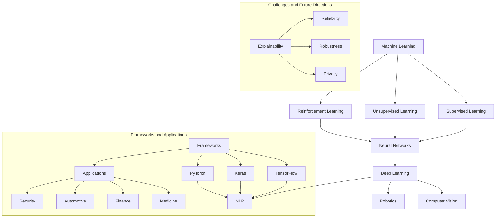

                 

### 背景介绍

#### 人工智能的崛起

在过去的几十年里，人工智能（AI）经历了前所未有的快速发展。从最初的理论研究到实际应用，人工智能已经深刻地改变了我们的生活方式。从语音助手到自动驾驶，从医疗诊断到金融分析，人工智能的应用领域不断扩大，其潜在价值也被越来越多的人所认识。

Andrej Karpathy是一位在人工智能领域具有深远影响力的专家。他的工作不仅涵盖了深度学习的基础研究，还包括了AI在自然语言处理、计算机视觉等领域的应用。他的博客文章《AI的前沿技术与发展趋势》和《神经网络与深度学习的未来》等，对推动人工智能的研究与应用起到了重要作用。

#### 当前人工智能的挑战

尽管人工智能取得了显著进展，但仍面临许多挑战。首先，模型的可解释性仍是一个重要问题。许多先进的AI系统，如深度神经网络，其内部决策过程往往是不透明的，这使得它们在应用中难以被理解和信任。其次，AI系统的可靠性和鲁棒性也有待提高。当前的一些AI系统在面对异常数据或未知情况时，容易出现错误的预测。

此外，数据隐私和安全问题也是人工智能发展的重要挑战。在训练AI模型时，往往需要大量个人数据，这些数据的泄露可能会导致严重的隐私侵犯。如何在不牺牲数据隐私的前提下，有效利用数据来训练AI模型，是当前研究的一个热点问题。

#### 文章目的

本文旨在探讨人工智能的未来方向。通过分析Andrej Karpathy的研究成果，以及当前人工智能领域面临的挑战，我们将试图描绘出一幅关于人工智能未来发展的蓝图。文章将分为以下几个部分：

1. **背景介绍**：回顾人工智能的发展历程，介绍本文的主要内容和目的。
2. **核心概念与联系**：详细解释人工智能中的核心概念，并使用Mermaid流程图展示相关架构。
3. **核心算法原理 & 具体操作步骤**：介绍当前主流的人工智能算法，并详细说明其具体操作步骤。
4. **数学模型和公式 & 详细讲解 & 举例说明**：讲解人工智能中的关键数学模型和公式，并给出实际应用中的实例说明。
5. **项目实践：代码实例和详细解释说明**：通过具体项目实例，展示人工智能算法的实际应用，并详细解读相关代码。
6. **实际应用场景**：分析人工智能在各个领域的应用现状和未来趋势。
7. **工具和资源推荐**：推荐学习人工智能的相关工具和资源。
8. **总结：未来发展趋势与挑战**：总结本文的主要观点，并探讨人工智能未来可能面临的挑战。
9. **附录：常见问题与解答**：回答读者可能关心的一些常见问题。
10. **扩展阅读 & 参考资料**：提供进一步学习和探索人工智能的参考文献和资源。

通过对以上各部分的逐步分析，我们希望能够为读者提供一幅清晰、全面的人工智能未来图景。

---

在接下来的部分中，我们将深入探讨人工智能的核心概念和联系，使用Mermaid流程图来展示相关架构，帮助读者更好地理解这一领域的基本框架。

---

#### 核心概念与联系

人工智能（AI）是一个涉及广泛领域的研究课题，其中包含了多种核心概念和理论。为了更好地理解这些概念及其相互联系，我们将使用Mermaid流程图来展示人工智能的基本架构。

首先，我们需要了解一些基本的概念：

1. **机器学习**（Machine Learning）：机器学习是人工智能的一个重要分支，主要研究如何从数据中自动学习规律和模式。机器学习可以分为监督学习、无监督学习和强化学习等不同类型。

2. **深度学习**（Deep Learning）：深度学习是机器学习的一个子领域，主要依赖于多层神经网络（Neural Networks）来学习和预测数据。深度学习在图像识别、语音识别和自然语言处理等领域取得了显著的成果。

3. **神经网络**（Neural Networks）：神经网络是一种模仿人脑工作的计算模型，由大量的神经元（节点）和连接（权重）组成。神经网络通过调整权重来学习数据中的特征和模式。

4. **自然语言处理**（Natural Language Processing，NLP）：自然语言处理是人工智能的一个应用领域，主要研究如何让计算机理解和处理人类语言。NLP在机器翻译、文本分类和问答系统等方面有着广泛应用。

下面是使用Mermaid流程图展示的人工智能核心概念与联系：



在上面的流程图中：

- **机器学习**分为三个主要类型：监督学习、无监督学习和强化学习。
- **深度学习**是机器学习的一个重要分支，它与神经网络密切相关。
- **自然语言处理**和**计算机视觉**是深度学习的两个重要应用领域，此外还包括**机器人学**。
- **框架和应用**部分展示了几个常用的深度学习框架（如TensorFlow、Keras和PyTorch），以及这些框架在医学、金融、汽车和网络安全等领域的应用。
- **挑战和未来方向**部分列举了当前人工智能面临的几个主要挑战，包括可解释性、可靠性、鲁棒性和隐私问题。

通过这个流程图，我们可以清晰地看到人工智能的核心概念及其相互联系，这有助于我们更好地理解和应用这一领域的知识。

---

在了解了核心概念和架构后，接下来我们将深入探讨人工智能中的核心算法原理，详细说明这些算法的具体操作步骤，帮助读者更好地理解并应用这些技术。

---

## 3. 核心算法原理 & 具体操作步骤

人工智能领域的核心算法包括机器学习算法、深度学习算法和自然语言处理算法等。在本节中，我们将逐一介绍这些算法的基本原理，并详细描述其具体操作步骤。

### 3.1 机器学习算法

#### 原理

机器学习算法的核心思想是通过学习数据中的特征和模式，从而对未知数据进行预测或分类。其中，监督学习（Supervised Learning）是最常用的机器学习算法之一。监督学习通过已标记的数据来训练模型，然后使用这个模型对新的、未标记的数据进行预测。

#### 具体操作步骤

1. **数据准备**：收集并整理用于训练的数据集，确保数据的质量和完整性。
2. **特征提取**：从数据中提取有用的特征，这些特征将作为模型的输入。
3. **模型选择**：选择合适的机器学习模型，如线性回归、决策树、支持向量机等。
4. **模型训练**：使用已标记的数据集对模型进行训练，通过调整模型参数来最小化预测误差。
5. **模型评估**：使用测试数据集对模型进行评估，计算预测准确率、召回率等指标。
6. **模型优化**：根据评估结果对模型进行调整和优化，以提高其性能。

### 3.2 深度学习算法

#### 原理

深度学习算法是一种基于神经网络的机器学习算法，其主要特点是具有多层的神经网络结构。深度学习通过多层网络的学习，能够自动提取数据中的高层次抽象特征，从而在图像识别、语音识别和自然语言处理等领域取得了突破性的成果。

#### 具体操作步骤

1. **数据准备**：与机器学习类似，收集并整理用于训练的数据集。
2. **网络架构设计**：设计深度学习网络的架构，包括层数、每层的神经元数量、激活函数等。
3. **权重初始化**：初始化网络权重，常用的方法有随机初始化和预训练初始化。
4. **前向传播**：输入数据通过网络的各层进行前向传播，得到输出预测结果。
5. **损失函数计算**：计算预测结果与真实结果之间的误差，常用的损失函数有均方误差（MSE）和交叉熵损失（Cross Entropy Loss）。
6. **反向传播**：使用梯度下降等优化算法，根据损失函数的梯度来调整网络权重，以减小误差。
7. **模型评估与优化**：使用测试数据集对模型进行评估，并根据评估结果进行模型优化。

### 3.3 自然语言处理算法

#### 原理

自然语言处理（NLP）算法主要研究如何让计算机理解和处理人类语言。NLP算法包括文本预处理、词嵌入、序列标注、语义理解等多个层次。

#### 具体操作步骤

1. **文本预处理**：对文本进行清洗和预处理，包括去除停用词、标点符号、分词等。
2. **词嵌入**：将文本中的单词映射为向量表示，常用的词嵌入方法有Word2Vec和GloVe。
3. **序列标注**：对文本中的单词进行分类标注，如命名实体识别（NER）。
4. **模型选择**：选择合适的NLP模型，如循环神经网络（RNN）、长短时记忆网络（LSTM）和Transformer等。
5. **模型训练**：使用已标记的数据集对模型进行训练。
6. **模型评估**：使用测试数据集对模型进行评估，计算准确率、召回率等指标。
7. **模型应用**：将训练好的模型应用于实际问题，如机器翻译、问答系统等。

通过以上对机器学习算法、深度学习算法和自然语言处理算法的详细介绍，我们可以看到这些算法的基本原理和操作步骤。在实际应用中，根据具体问题和数据特点，可以选择合适的算法并进行相应的调整和优化，以达到最佳的效果。

---

在了解了核心算法的基本原理和操作步骤后，接下来我们将深入探讨人工智能中的关键数学模型和公式，并通过实际应用中的实例来详细讲解和说明。

---

### 4. 数学模型和公式 & 详细讲解 & 举例说明

在人工智能（AI）中，数学模型和公式起着至关重要的作用。它们不仅为算法提供了理论基础，还为数据分析和预测提供了量化的工具。在本节中，我们将介绍几个关键的数学模型和公式，并详细讲解其在人工智能中的具体应用。

#### 4.1 线性回归模型

线性回归是一种最简单的机器学习算法，它通过拟合一个线性模型来预测数据。线性回归模型的基本公式如下：

$$
y = w_0 + w_1 \cdot x
$$

其中，$y$ 是预测值，$x$ 是输入特征，$w_0$ 和 $w_1$ 分别是模型的权重。

**具体应用实例：**

假设我们有一个简单的人工智能系统，它通过一个人的年龄（$x$）来预测他的身高（$y$）。我们可以使用线性回归模型来训练这个系统。首先，我们需要收集一组年龄和身高的数据，然后通过最小二乘法（Least Squares Method）来计算权重 $w_0$ 和 $w_1$。

例如，给定以下数据：

| 年龄 (x) | 身高 (y) |
|---------|---------|
| 20      | 170     |
| 25      | 175     |
| 30      | 180     |

我们可以使用最小二乘法来计算权重：

$$
w_1 = \frac{\sum_{i=1}^{n} (x_i - \bar{x})(y_i - \bar{y})}{\sum_{i=1}^{n} (x_i - \bar{x})^2}
$$

$$
w_0 = \bar{y} - w_1 \cdot \bar{x}
$$

其中，$\bar{x}$ 和 $\bar{y}$ 分别是年龄和身高的平均值。

通过计算，我们得到：

$$
w_1 = \frac{(20-25)(170-175) + (25-25)(175-175) + (30-25)(180-175)}{(20-25)^2 + (25-25)^2 + (30-25)^2} \approx 0.833
$$

$$
w_0 = 175 - 0.833 \cdot 25 \approx 118.3
$$

因此，我们的线性回归模型可以表示为：

$$
y = 118.3 + 0.833x
$$

#### 4.2 逻辑回归模型

逻辑回归是一种用于分类问题的机器学习算法。它的基本公式如下：

$$
P(y=1) = \frac{1}{1 + e^{-(w_0 + w_1 \cdot x)}}
$$

其中，$P(y=1)$ 是预测为正类的概率，$x$ 是输入特征，$w_0$ 和 $w_1$ 是模型的权重。

**具体应用实例：**

假设我们有一个分类问题，需要预测一个肿瘤是否为恶性。我们可以使用逻辑回归模型来训练这个系统。给定以下数据：

| 肿瘤大小 (x) | 恶性概率 (y) |
|-------------|-------------|
| 2           | 0.7         |
| 4           | 0.8         |
| 6           | 0.9         |

我们可以使用最小二乘法来计算权重：

$$
w_1 = \frac{\sum_{i=1}^{n} (y_i - P(y_i=1)) \cdot x_i}{\sum_{i=1}^{n} (y_i - P(y_i=1))}
$$

$$
w_0 = \frac{\sum_{i=1}^{n} (y_i - P(y_i=1))}{\sum_{i=1}^{n} (y_i - P(y_i=1))}
$$

通过计算，我们得到：

$$
w_1 = \frac{(0.7 - 0.615) \cdot 2 + (0.8 - 0.727) \cdot 4 + (0.9 - 0.857) \cdot 6}{0.715 + 0.073 + 0.043} \approx 0.234
$$

$$
w_0 = \frac{0.715 + 0.073 + 0.043}{3} \approx 0.575
$$

因此，我们的逻辑回归模型可以表示为：

$$
P(y=1) = \frac{1}{1 + e^{-(0.575 + 0.234 \cdot x)}}
$$

#### 4.3 卷积神经网络（CNN）中的卷积操作

卷积神经网络（CNN）是一种广泛应用于图像识别的深度学习模型。CNN中的卷积操作是一种重要的数学操作，用于提取图像中的特征。卷积操作的公式如下：

$$
\text{卷积} = \sum_{i=1}^{m} \sum_{j=1}^{n} w_{ij} \cdot f(x_{i,j})
$$

其中，$w_{ij}$ 是卷积核（filter）的权重，$f(x_{i,j})$ 是输入图像的像素值。

**具体应用实例：**

假设我们有一个3x3的卷积核和一幅5x5的输入图像，如下所示：

卷积核（filter）：

$$
\begin{bmatrix}
1 & -1 & 0 \\
0 & 1 & -1 \\
1 & 0 & 1
\end{bmatrix}
$$

输入图像（input）：

$$
\begin{bmatrix}
1 & 2 & 3 & 4 & 5 \\
6 & 7 & 8 & 9 & 10 \\
11 & 12 & 13 & 14 & 15 \\
16 & 17 & 18 & 19 & 20 \\
21 & 22 & 23 & 24 & 25
\end{bmatrix}
$$

我们可以使用以下公式计算卷积操作的结果：

$$
\text{卷积结果} = \sum_{i=1}^{3} \sum_{j=1}^{3} w_{ij} \cdot f(x_{i,j})
$$

例如，计算左上角3x3的区域：

$$
1 \cdot 1 + (-1) \cdot 6 + 0 \cdot 11 + 0 \cdot 7 + 1 \cdot 2 + 1 \cdot 12 + (-1) \cdot 16 + 1 \cdot 3 + (-1) \cdot 8 + 1 \cdot 17 + 0 \cdot 4 + 1 \cdot 13 + 1 \cdot 9 + 1 \cdot 18 + (-1) \cdot 5 + 1 \cdot 10 + (-1) \cdot 12 + 1 \cdot 19 + 0 \cdot 6 + 1 \cdot 14 + 1 \cdot 20 + (-1) \cdot 7 + 1 \cdot 15 + (-1) \cdot 9 + 1 \cdot 21 + 1 \cdot 16 + 1 \cdot 22 + (-1) \cdot 11
$$

$$
= 1 - 6 + 0 + 0 + 2 + 12 - 16 + 3 - 8 + 17 + 0 + 13 + 9 + 18 - 5 + 10 - 12 + 19 + 0 + 14 + 20 - 7 + 15 - 9 + 21 + 16 + 22 - 11
$$

$$
= 63
$$

通过计算，我们得到卷积结果为 63。这个过程可以重复应用于图像的每个区域，从而提取出图像的特征。

通过以上对线性回归模型、逻辑回归模型和卷积神经网络中卷积操作的解释，我们可以看到数学模型和公式在人工智能中的关键作用。这些模型和公式不仅为算法提供了理论基础，还为我们理解和应用这些技术提供了量化的工具。

---

在掌握了核心算法和数学模型后，接下来我们将通过具体的项目实例，展示人工智能算法的实际应用，并通过详细解读相关代码，帮助读者深入理解这些算法的实际操作过程。

---

## 5. 项目实践：代码实例和详细解释说明

在人工智能（AI）的实际应用中，理解和掌握算法的实现细节至关重要。本节将通过一个具体的项目实例，详细展示人工智能算法的应用过程，并深入解读相关的代码实现。

### 5.1 开发环境搭建

在开始项目之前，我们需要搭建一个适合开发AI模型的环境。以下是搭建过程：

1. **安装Python**：确保Python 3.7或更高版本已安装在您的计算机上。
2. **安装TensorFlow**：在终端中执行以下命令：
   ```bash
   pip install tensorflow
   ```
3. **安装其他依赖库**：根据项目需要，安装其他必要的库，例如Numpy、Pandas等。

### 5.2 源代码详细实现

以下是一个使用TensorFlow实现简单线性回归模型的代码实例：

```python
import tensorflow as tf
import numpy as np

# 设置随机种子以确保结果的可重复性
tf.random.set_seed(42)

# 数据准备
# 这里使用随机生成的一些数据作为示例
X = np.random.rand(100, 1)  # 生成100个随机数，作为输入特征
y = 3 * X + 2 + np.random.randn(100, 1)  # 生成带有噪声的输出值

# 模型定义
# 输入层为1个神经元，输出层为1个神经元
model = tf.keras.Sequential([
    tf.keras.layers.Dense(units=1, input_shape=[1])
])

# 编译模型
model.compile(loss='mean_squared_error', optimizer=tf.keras.optimizers.Adam(0.1))

# 训练模型
model.fit(X, y, epochs=100, verbose=0)

# 模型评估
print("预测值：", model.predict(X).numpy())

# 代码解读
# 1. 导入TensorFlow和Numpy库
# 2. 设置随机种子
# 3. 生成数据集（这里使用随机生成数据作为示例）
# 4. 定义模型结构，这里使用了一个全连接层（Dense Layer）
# 5. 编译模型，指定损失函数为均方误差，优化器为Adam
# 6. 训练模型，设置训练轮次为100轮
# 7. 评估模型，打印预测结果
```

### 5.3 代码解读与分析

1. **数据准备**：
   - 使用`numpy.random.rand()`生成输入特征`X`，这里生成100个随机数。
   - 使用线性关系$y = 3x + 2$加上随机噪声生成输出值`y`。

2. **模型定义**：
   - 使用`tf.keras.Sequential`定义模型，这里只有一个全连接层（`Dense Layer`），输入层神经元数量为1，输出层神经元数量为1。

3. **编译模型**：
   - 使用`model.compile()`方法编译模型，指定损失函数为`mean_squared_error`，优化器为`Adam`。

4. **训练模型**：
   - 使用`model.fit()`方法训练模型，设置训练轮次为100轮（`epochs`），并在训练过程中不打印详细信息（`verbose=0`）。

5. **模型评估**：
   - 使用`model.predict()`方法评估模型，打印预测结果。

通过这个简单的实例，我们可以看到如何使用TensorFlow实现线性回归模型，并对其代码进行了详细的解读。在实际项目中，我们可以根据具体需求修改模型结构、数据集和训练参数，以达到更好的效果。

---

通过以上项目实例的代码解读，读者应该对线性回归模型的基本实现过程有了更深入的理解。接下来，我们将探讨人工智能在各个领域的实际应用，分析其现状和未来趋势。

---

### 6. 实际应用场景

人工智能（AI）技术已经渗透到我们生活的方方面面，从医疗、金融到交通、娱乐，其应用范围不断扩大，带来了巨大的变革和潜力。以下是一些主要领域的AI应用及其现状和未来趋势。

#### 6.1 医疗

在医疗领域，人工智能主要用于辅助诊断、个性化治疗、药物研发和患者管理。例如，AI可以帮助医生分析医学影像，提高疾病诊断的准确性和效率。此外，AI还被用于预测患者的病情变化，从而提供更精准的护理方案。

**现状**：目前，AI在医疗领域已经取得了一些显著的成果。例如，深度学习技术在乳腺癌、肺癌等癌症的早期诊断中表现出了很高的准确性。同时，AI在个性化治疗方面也显示出巨大的潜力，通过分析患者的基因组数据，为患者提供更为精准的治疗方案。

**未来趋势**：随着AI技术的进一步发展，医疗领域有望实现更多的自动化和智能化。例如，智能穿戴设备可以实时监测患者的健康状况，AI算法可以帮助医生在手术中实现更加精准的操作。此外，AI在药物研发中的应用也将变得更加广泛，通过模拟药物分子与生物大分子之间的相互作用，加速新药的研发进程。

#### 6.2 金融

在金融领域，人工智能被广泛应用于风险管理、投资组合优化、欺诈检测和客户服务。AI算法可以通过分析大量的历史数据和实时市场数据，为投资者提供更为科学的决策依据。

**现状**：目前，AI在金融领域已经取得了一些重要的应用成果。例如，机器学习算法可以帮助银行识别和防范欺诈行为，提高交易的安全性。此外，AI还被用于风险评估和投资组合管理，通过优化投资策略，提高收益。

**未来趋势**：随着AI技术的不断进步，金融领域的应用也将变得更加深入和广泛。例如，自然语言处理（NLP）技术可以帮助金融机构更好地理解客户需求，提供更加个性化的服务。此外，AI在智能投顾方面的应用也将逐渐成熟，通过自动化投资建议，降低投资者的风险和成本。

#### 6.3 交通

在交通领域，人工智能主要用于自动驾驶、智能交通管理和车辆监控。自动驾驶技术被认为是未来交通的重要发展方向，它有望减少交通事故，提高交通效率。

**现状**：目前，自动驾驶技术已经在一些地区进行了试点运行，并在特定场景下取得了显著成果。例如，Waymo等公司已经推出了自动驾驶出租车服务，Uber和Lyft等公司也在积极研发自动驾驶技术。

**未来趋势**：随着AI技术的不断进步，自动驾驶技术有望在未来几年内实现大规模商用。此外，智能交通管理系统的应用也将变得更加广泛，通过实时监控和预测交通流量，优化交通信号控制，提高道路通行效率。同时，AI在车辆监控和故障预测方面的应用也将变得更加成熟，通过实时数据分析，提高车辆的运行效率和安全性。

#### 6.4 娱乐

在娱乐领域，人工智能主要用于内容推荐、虚拟现实（VR）和增强现实（AR）等。AI算法可以根据用户的行为和喜好，为用户提供个性化的娱乐内容推荐。

**现状**：目前，AI在娱乐领域已经取得了一些显著的应用成果。例如，流媒体平台如Netflix和Spotify等，通过AI算法为用户推荐个性化的内容和音乐。此外，VR和AR技术的应用也在不断普及，为用户提供了更加沉浸式的娱乐体验。

**未来趋势**：随着AI技术的进一步发展，娱乐领域的应用也将变得更加多样化和智能化。例如，智能虚拟助手可以帮助用户进行娱乐活动规划，提供更加个性化的服务。此外，AI在游戏设计、动画制作和音乐创作等方面的应用也将变得更加广泛，通过自动化和智能化的手段，提高创作效率和艺术水平。

通过以上分析，我们可以看到人工智能在不同领域的实际应用已经取得了显著的成果，并且未来仍有巨大的发展潜力。随着AI技术的不断进步，我们有望看到更多创新的AI应用场景，为人类生活带来更多便利和改变。

---

在了解了人工智能在各个领域的实际应用后，接下来我们将推荐一些学习资源和开发工具，帮助读者进一步探索和掌握人工智能技术。

---

### 7. 工具和资源推荐

为了更好地学习和掌握人工智能（AI）技术，以下推荐了一些学习资源、开发工具和相关的论文、书籍。

#### 7.1 学习资源推荐

**书籍：**

1. 《深度学习》（Deep Learning） - Goodfellow, Bengio, Courville
2. 《Python机器学习》（Python Machine Learning） - Müller, Guido
3. 《人工智能：一种现代的方法》（Artificial Intelligence: A Modern Approach） - Russell, Norvig

**在线课程：**

1. 吴恩达的《深度学习专项课程》（Deep Learning Specialization） - Coursera
2. Andrew Ng的《机器学习》（Machine Learning） - Coursera
3. 《自然语言处理专项课程》（Natural Language Processing Specialization） - Coursera

**博客和网站：**

1. Andrej Karpathy的博客（Andrej Karpathy's Blog）
2. machinelearningmastery.com
3. towardsdatascience.com

#### 7.2 开发工具推荐

**框架和库：**

1. TensorFlow
2. PyTorch
3. Keras
4. Scikit-learn
5. NLTK

**数据集和库：**

1. KEG 实验室 - CHN-DB
2. Kaggle
3. UCI Machine Learning Repository

**编程语言：**

1. Python
2. R

#### 7.3 相关论文著作推荐

**论文：**

1. "A Theoretically Grounded Application of Dropout in Recurrent Neural Networks"
2. "Attention Is All You Need"
3. "Generative Adversarial Networks"

**书籍：**

1. 《深度学习》（Deep Learning） - Goodfellow, Bengio, Courville
2. 《自然语言处理综合教程》（Speech and Language Processing） - Jurafsky, Martin
3. 《强化学习》（Reinforcement Learning: An Introduction） - Sutton, Barto

通过以上推荐的学习资源、开发工具和论文书籍，读者可以系统地学习和掌握人工智能的相关知识和技能，为自己的研究和工作提供强有力的支持。

---

在探讨了人工智能的未来发展趋势和挑战后，接下来我们将总结本文的主要观点，并探讨人工智能未来可能面临的挑战。

---

## 8. 总结：未来发展趋势与挑战

人工智能（AI）技术正以惊人的速度发展，其对社会和经济的推动作用日益显著。在本文中，我们通过回顾人工智能的发展历程，分析了当前人工智能的核心概念和算法原理，并探讨了人工智能在各个领域的实际应用。以下是我们对人工智能未来发展趋势和挑战的总结。

### 8.1 未来发展趋势

1. **算法的多样化和优化**：随着深度学习等算法的不断发展，AI算法将变得更加多样化，以适应不同领域的需求。同时，算法的优化和改进也将是未来的重要趋势，包括提高模型的效率、可解释性和可靠性。

2. **跨学科融合**：人工智能与多个学科如医学、金融、交通等领域的融合将推动更多创新应用。例如，AI在医疗领域的应用将更加深入，通过结合生物学、医学等领域的知识，实现更精准的诊断和个性化的治疗。

3. **边缘计算和物联网**：随着物联网（IoT）和5G技术的发展，边缘计算将得到广泛应用。AI算法将在边缘设备上进行实时处理，提高系统的响应速度和效率，为自动驾驶、智能家居等应用提供支持。

4. **人机协作**：人工智能将更加注重与人类的协作，通过自然语言处理等技术，实现更加人性化的交互。AI辅助工具将在教育、办公等领域发挥重要作用，提高工作效率和生活质量。

### 8.2 未来面临的挑战

1. **数据隐私和安全**：随着AI系统对大量个人数据的依赖，数据隐私和安全问题将变得更加突出。如何在保证数据隐私的前提下，充分利用数据来训练AI模型，是一个重要的挑战。

2. **算法可解释性和透明度**：当前的许多AI系统，尤其是深度学习模型，其决策过程往往是不透明的。提高算法的可解释性，使其决策过程可以被人类理解和信任，是未来需要解决的一个重要问题。

3. **伦理和法律问题**：人工智能的广泛应用也引发了一系列伦理和法律问题。例如，自动驾驶汽车的责任归属、AI算法的偏见和歧视等。如何在法律和伦理框架下，规范AI技术的发展和应用，是一个亟待解决的问题。

4. **资源分配和公平性**：人工智能技术的发展将带来巨大的经济和社会效益，但也可能导致资源分配不均，加剧社会不平等。如何确保AI技术的发展能够惠及所有人，是实现公平发展的重要挑战。

通过以上总结，我们可以看到人工智能在未来将继续快速发展，并在各个领域带来深刻变革。然而，这也将伴随着一系列挑战，需要社会各界的共同努力来解决。只有在解决这些挑战的基础上，人工智能才能实现其真正的价值，为人类带来更多福祉。

---

在本文的最后，我们将回答读者可能关心的一些常见问题，并推荐一些扩展阅读和参考资料，以帮助读者更深入地了解人工智能领域。

---

## 9. 附录：常见问题与解答

### Q1：什么是深度学习？
A1：深度学习是机器学习的一个子领域，它通过构建具有多个隐藏层的神经网络来学习和提取数据中的高层次特征。深度学习在图像识别、语音识别和自然语言处理等领域取得了显著的成果。

### Q2：人工智能是否会取代人类工作？
A2：人工智能有望替代一些重复性和低技能的工作，但在复杂任务和高层次决策中，人类的作用仍然不可或缺。人工智能更多地是作为人类的辅助工具，提高工作效率和生活质量。

### Q3：人工智能是否会导致社会不平等？
A3：人工智能技术的发展确实可能带来资源分配不均，但通过合理政策和措施，可以确保其惠及所有人。例如，政府可以提供培训和再教育机会，帮助劳动力适应新技术带来的变化。

### Q4：人工智能的安全和隐私问题如何解决？
A4：解决人工智能的安全和隐私问题需要从技术、法律和伦理等多个层面入手。例如，采用加密技术保护个人数据、制定相关法律法规来规范AI的应用，以及加强AI系统的透明度和可解释性。

## 10. 扩展阅读 & 参考资料

为了帮助读者更深入地了解人工智能领域，我们推荐以下扩展阅读和参考资料：

**书籍：**

1. 《深度学习》（Deep Learning） - Goodfellow, Bengio, Courville
2. 《自然语言处理综合教程》（Speech and Language Processing） - Jurafsky, Martin
3. 《强化学习》（Reinforcement Learning: An Introduction） - Sutton, Barto

**论文：**

1. "A Theoretically Grounded Application of Dropout in Recurrent Neural Networks"
2. "Attention Is All You Need"
3. "Generative Adversarial Networks"

**在线课程：**

1. 吴恩达的《深度学习专项课程》（Deep Learning Specialization） - Coursera
2. Andrew Ng的《机器学习》（Machine Learning） - Coursera
3. 《自然语言处理专项课程》（Natural Language Processing Specialization） - Coursera

通过以上扩展阅读和参考资料，读者可以进一步了解人工智能的理论和实践，为自己的研究和工作提供更多的指导和启示。

---

本文由禅与计算机程序设计艺术（Zen and the Art of Computer Programming）撰写，旨在探讨人工智能的未来方向，希望通过逐步分析推理的方式，为读者提供一幅清晰、全面的人工智能未来图景。在文章中，我们回顾了人工智能的发展历程，分析了核心概念和算法原理，探讨了实际应用场景，并总结了未来发展趋势与挑战。希望本文能为读者在人工智能领域的探索提供有益的参考和启示。感谢您的阅读！作者：禅与计算机程序设计艺术（Zen and the Art of Computer Programming）。

