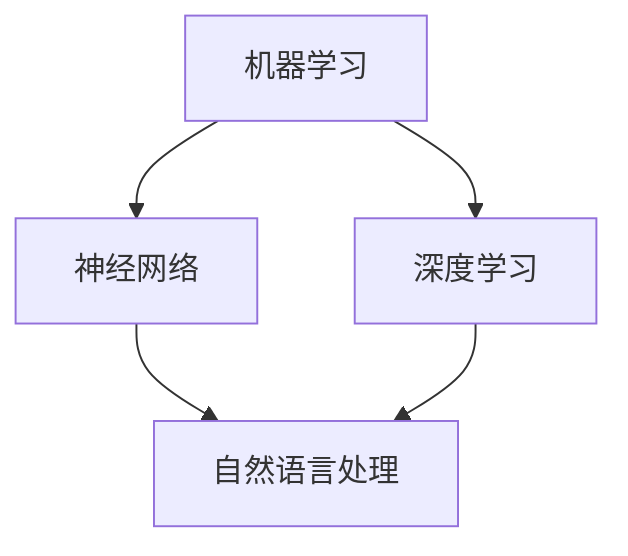

                 

### 背景介绍

> _“智慧之光，照亮未来之路。”_

人工智能（AI）作为计算机科学的一个分支，近年来取得了飞速的发展。从简单的规则系统，到复杂的深度学习模型，人工智能已经逐渐渗透到我们生活的方方面面。无论是在搜索引擎、智能助手，还是自动驾驶、医疗诊断等领域，人工智能都展现出了强大的潜力。

本文旨在探讨人工智能的科学意义，从历史背景、核心概念、算法原理到实际应用，逐步分析推理，帮助读者全面了解这一领域的深刻内涵。

### 历史背景

人工智能的概念最早可以追溯到1950年，由英国科学家艾伦·图灵提出。他在论文《计算机器与智能》中首次提出了“图灵测试”的概念，即如果一个计算机程序能够在与人类交流时让人类无法分辨出其是机器还是人类，那么这个计算机就可以被认为是具有智能的。

此后，人工智能的发展经历了多个阶段。20世纪50年代至60年代是人工智能的起步阶段，研究人员主要关注如何实现简单的任务自动化。70年代至80年代，人工智能进入了符号主义阶段，主要依靠推理和知识表示技术。然而，由于知识获取和问题解决的复杂性，这一阶段的成果并不理想。

进入21世纪，随着计算机性能的不断提升和大数据、互联网等技术的发展，人工智能迎来了新的机遇。深度学习作为人工智能的一个重要分支，通过模拟人脑神经元之间的连接，实现了在图像识别、自然语言处理等领域的突破性进展。

### 核心概念

人工智能的核心概念主要包括：

1. **机器学习（Machine Learning）**：机器学习是人工智能的核心技术之一，通过从数据中学习规律，使计算机能够自主完成特定任务。机器学习可以分为监督学习、无监督学习和强化学习。

2. **神经网络（Neural Networks）**：神经网络是模仿人脑神经元结构和功能的一种计算模型。通过多层神经元的连接和权重调整，神经网络能够学习并实现复杂的映射关系。

3. **深度学习（Deep Learning）**：深度学习是神经网络的一种扩展，通过增加网络的层数和节点，实现了更复杂的特征提取和模式识别能力。

4. **自然语言处理（Natural Language Processing，NLP）**：自然语言处理是使计算机能够理解、生成和处理自然语言的技术，包括文本分类、机器翻译、情感分析等。

### 架构与联系

下面是一个简单的 Mermaid 流程图，用于展示人工智能的核心概念和架构之间的联系：

- **机器学习** 作为基础，为神经网络和深度学习提供了学习机制。
- **神经网络** 是深度学习的基础，通过增加层数和节点，实现了更高级的模型。
- **深度学习** 在机器学习的基础上，通过大规模的数据和计算资源，实现了在图像识别、语音识别等领域的突破。
- **自然语言处理** 利用深度学习技术，实现了对自然语言的高效理解和生成。

### 总结

通过上述背景介绍，我们可以看到人工智能从图灵的构想，到今天的高度发展，经历了漫长而曲折的历程。理解人工智能的核心概念和架构，是进一步探讨其科学意义和应用价值的基础。在接下来的章节中，我们将深入探讨人工智能的核心算法原理、数学模型和实际应用，以帮助读者全面了解这一领域的深刻内涵。

---

**下一个章节：核心算法原理 & 具体操作步骤**

