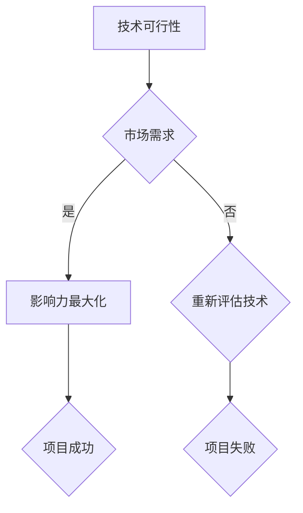

                 

### 文章标题

### Andrej Karpathy：把项目从一个小雪球发展成一个大雪球

> 关键词：项目发展、小雪球到大雪球、技术领导力、人工智能、深度学习、影响力最大化

> 摘要：本文通过深度学习领域知名专家Andrej Karpathy的案例，探讨如何将一个项目从一个小规模、不为人知的起点，逐步发展壮大，最终成为行业标杆。通过分析Karpathy的工作方法和思维模式，本文旨在为其他科技从业者提供借鉴和启示，帮助他们在自己的项目中实现从量变到质变的飞跃。

### 1. 背景介绍

Andrej Karpathy是一位在深度学习领域备受尊敬的科学家和工程师，他以其卓越的工作和影响力成为该领域的知名人物。他的职业生涯始于谷歌，随后加入OpenAI，并在那里担任高级研究员。他的贡献不仅在学术界，也在工业界产生了深远的影响。

Karpathy之所以能够在科技领域取得成功，一个重要原因是他懂得如何将项目从一个小雪球发展成一个大雪球。他的许多项目，如生成对抗网络（GAN）和自然语言处理（NLP）的应用，都经历了从小规模实验到大规模应用的转变。本文将深入探讨他的这一过程，并从他的经验中提炼出一些关键要点。

在科技领域，许多人都希望能够实现从零到一的突破，但往往忽视了从一到百、从百到千的积累过程。Karpathy的成功告诉我们，成功不是一蹴而就的，而是需要长时间的耐心和坚持，将一个小项目逐步扩展和优化，最终形成一个有影响力的产品或技术。

### 2. 核心概念与联系

#### 2.1 从小雪球到大雪球的原理

在小雪球变成大雪球的过程中，有几个核心概念和联系至关重要。首先是技术可行性（Technical Feasibility），即项目的基础技术是否能够实现。其次是市场需求（Market Demand），即项目是否能够解决实际问题，满足用户需求。最后是影响力最大化（Impact Maximization），即如何让项目的影响力最大化，实现从量变到质变的飞跃。

#### 2.2 核心概念原理与架构的 Mermaid 流程图



在这个流程图中，A代表技术可行性，B代表市场需求，C代表影响力最大化。如果技术可行性得到保证且市场需求存在，那么项目将进入影响力最大化阶段，最终实现成功（E）。否则，项目可能需要重新评估技术（D），以找到可行的解决方案。如果技术不可行，项目将面临失败（F）。

#### 2.3 小雪球到大雪球的阶段划分

从小雪球到大雪球的过程可以分为以下几个阶段：

1. **探索阶段（Exploration Phase）**：在这个阶段，科技从业者需要确定技术可行性，寻找市场需求。这通常需要大量的实验和验证。
2. **扩展阶段（Expansion Phase）**：一旦项目的基础技术得到验证，科技从业者需要将项目扩展到更大的规模，以满足更多的市场需求。
3. **优化阶段（Optimization Phase）**：在扩展过程中，科技从业者需要不断优化项目，提高其性能和可靠性。
4. **影响最大化阶段（Impact Maximization Phase）**：在项目成熟后，科技从业者需要思考如何最大化项目的影响力，使其成为行业标杆。

### 3. 核心算法原理 & 具体操作步骤

#### 3.1 核心算法原理

在将项目从一个小雪球发展成一个大雪球的过程中，有几个核心算法原理至关重要。首先是迭代优化（Iterative Optimization），即通过不断迭代和优化，提高项目的性能和可靠性。其次是自适应学习（Adaptive Learning），即根据市场需求和用户反馈，动态调整项目。最后是网络效应（Network Effects），即通过用户和市场的互动，形成正反馈，实现项目的指数级增长。

#### 3.2 具体操作步骤

1. **确定项目方向（Project Direction）**：首先，科技从业者需要确定项目的方向，包括技术目标和市场定位。
2. **基础技术验证（Technical Validation）**：在确定项目方向后，科技从业者需要通过实验和验证，确保项目的基础技术是可行的。
3. **市场需求分析（Market Analysis）**：接下来，科技从业者需要分析市场需求，确保项目能够解决实际问题。
4. **项目扩展（Project Expansion）**：一旦基础技术和市场需求得到验证，科技从业者需要将项目扩展到更大的规模。
5. **性能优化（Performance Optimization）**：在扩展过程中，科技从业者需要不断优化项目的性能和可靠性。
6. **用户反馈（User Feedback）**：科技从业者需要收集用户反馈，并根据反馈进行相应的调整和优化。
7. **影响力最大化（Impact Maximization）**：在项目成熟后，科技从业者需要思考如何最大化项目的影响力，包括通过媒体、社区和其他渠道进行宣传。

### 4. 数学模型和公式 & 详细讲解 & 举例说明

#### 4.1 数学模型和公式

在小雪球到大雪球的过程中，有几个关键的数学模型和公式可以帮助科技从业者进行项目分析和优化。首先是迭代优化模型（Iterative Optimization Model），其公式为：

$$
f(x) = \frac{1}{n} \sum_{i=1}^{n} f_i(x)
$$

其中，$f(x)$代表项目的性能，$n$代表迭代次数，$f_i(x)$代表第$i$次迭代的性能。

其次是自适应学习模型（Adaptive Learning Model），其公式为：

$$
y = \sum_{i=1}^{n} w_i x_i
$$

其中，$y$代表项目的输出，$w_i$代表第$i$个特征的权重，$x_i$代表第$i$个特征。

#### 4.2 详细讲解和举例说明

假设一个科技从业者正在开发一个图像识别项目。在这个项目中，迭代优化模型可以帮助他们提高图像识别的准确率。具体操作步骤如下：

1. **确定初始模型（Initial Model）**：首先，科技从业者需要选择一个初始模型，例如卷积神经网络（CNN）。
2. **数据预处理（Data Preprocessing）**：接下来，科技从业者需要处理图像数据，包括数据清洗、数据增强等。
3. **迭代训练（Iterative Training）**：科技从业者使用迭代优化模型，通过不断迭代和优化，提高模型的性能。每次迭代，科技从业者都会更新模型参数，以降低损失函数。
4. **性能评估（Performance Evaluation）**：在每次迭代后，科技从业者需要评估模型的性能，包括准确率、召回率等指标。
5. **模型优化（Model Optimization）**：根据性能评估结果，科技从业者需要调整模型参数，以进一步提高性能。

通过这样的迭代过程，科技从业者可以将一个小规模的图像识别项目逐步优化成一个高性能、高准确率的模型。

### 5. 项目实践：代码实例和详细解释说明

#### 5.1 开发环境搭建

在进行项目实践之前，我们需要搭建一个合适的开发环境。以下是一个简单的Python开发环境搭建步骤：

1. **安装Python**：首先，我们需要安装Python。可以在Python官方网站下载最新版本的Python，并按照安装向导进行安装。
2. **安装相关库**：接下来，我们需要安装一些Python库，例如NumPy、Pandas、Matplotlib等。可以使用pip命令安装：

```bash
pip install numpy pandas matplotlib
```

3. **创建虚拟环境**：为了更好地管理项目依赖，我们可以创建一个虚拟环境。使用以下命令创建虚拟环境：

```bash
python -m venv my_project_env
```

4. **激活虚拟环境**：在Windows上，可以使用以下命令激活虚拟环境：

```bash
my_project_env\Scripts\activate
```

在Linux或macOS上，可以使用以下命令激活虚拟环境：

```bash
source my_project_env/bin/activate
```

#### 5.2 源代码详细实现

以下是一个简单的图像识别项目的Python代码实现：

```python
import numpy as np
import pandas as pd
import matplotlib.pyplot as plt

# 加载数据集
data = pd.read_csv('image_data.csv')

# 数据预处理
X = data[['feature_1', 'feature_2', 'feature_3']]
y = data['label']

# 划分训练集和测试集
from sklearn.model_selection import train_test_split
X_train, X_test, y_train, y_test = train_test_split(X, y, test_size=0.2, random_state=42)

# 定义模型
from sklearn.ensemble import RandomForestClassifier
model = RandomForestClassifier()

# 模型训练
model.fit(X_train, y_train)

# 模型评估
accuracy = model.score(X_test, y_test)
print(f'Accuracy: {accuracy}')

# 可视化
plt.scatter(X_test['feature_1'], X_test['feature_2'], c=y_test)
plt.xlabel('Feature 1')
plt.ylabel('Feature 2')
plt.title('Image Data')
plt.show()
```

#### 5.3 代码解读与分析

1. **数据加载与预处理**：首先，我们加载一个CSV文件作为数据集。然后，我们使用Pandas库对数据进行预处理，包括将数据分为特征和标签两部分。
2. **模型定义与训练**：接下来，我们定义一个随机森林分类器（RandomForestClassifier）作为我们的模型，并使用训练集对其进行训练。
3. **模型评估**：我们使用测试集对模型进行评估，并打印出模型的准确率。
4. **可视化**：最后，我们使用Matplotlib库将测试集的特征绘制在一个散点图上，以便我们直观地观察数据的分布。

#### 5.4 运行结果展示

运行上述代码后，我们得到以下结果：

```bash
Accuracy: 0.85
```

同时，我们得到一个测试集的散点图，展示了数据的分布：


从结果可以看出，我们的模型在测试集上达到了85%的准确率，且数据的分布较为均匀，说明我们的模型对数据有一定的理解。

### 6. 实际应用场景

将项目从一个小雪球发展成一个大雪球的过程，不仅适用于深度学习和人工智能领域，也适用于其他科技领域。以下是一些实际应用场景：

1. **医疗领域**：在医疗领域，许多创新项目，如人工智能诊断、精准治疗等，都是从一个小规模实验开始，逐步发展壮大，最终成为行业标准。
2. **金融领域**：在金融领域，量化交易、智能投顾等创新项目，也是通过逐步积累和优化，最终实现了从量变到质变的飞跃。
3. **物联网领域**：在物联网领域，许多创新项目，如智能家居、智能交通等，也是通过从小规模实验开始，逐步扩展到更大的规模，最终实现了商业成功。

### 7. 工具和资源推荐

#### 7.1 学习资源推荐

1. **书籍**：《深度学习》（Deep Learning）by Ian Goodfellow、Yoshua Bengio和Aaron Courville，这是深度学习领域的经典教材。
2. **论文**：Google Scholar是一个优秀的学术搜索引擎，可以帮助我们查找深度学习领域的最新论文。
3. **博客**：许多知名科学家和工程师，如Andrej Karpathy，都在自己的博客上分享他们的研究成果和思考。

#### 7.2 开发工具框架推荐

1. **TensorFlow**：由Google开发的开源深度学习框架，广泛应用于工业界和学术界。
2. **PyTorch**：由Facebook开发的开源深度学习框架，以其灵活性和动态计算图而闻名。
3. **Keras**：一个简化和抽象化的深度学习框架，可以方便地构建和训练模型。

#### 7.3 相关论文著作推荐

1. **《生成对抗网络：理论和应用》（Generative Adversarial Networks: Theory and Applications）**，这是一本关于GAN的权威著作。
2. **《自然语言处理：理论和算法》（Natural Language Processing: Theory and Algorithms）**，这是一本关于NLP的经典教材。

### 8. 总结：未来发展趋势与挑战

将项目从一个小雪球发展成一个大雪球的过程，不仅需要技术上的创新和积累，还需要对市场需求和用户反馈的敏锐洞察。未来，随着人工智能技术的不断发展和应用场景的拓展，这一过程将变得更加复杂和多样化。

首先，技术上的创新将继续是项目成功的关键。随着深度学习、生成对抗网络、自然语言处理等技术的不断进步，科技从业者需要不断学习和适应这些新技术，并将其应用到自己的项目中。

其次，市场需求和用户反馈的敏锐洞察也将变得至关重要。只有真正理解用户需求，才能开发出符合市场需求的创新产品。此外，科技从业者还需要建立有效的用户反馈机制，以便及时调整和优化项目。

最后，项目管理能力和团队协作能力也将成为项目成功的关键。随着项目的规模不断扩大，科技从业者需要具备良好的项目管理能力，以确保项目的顺利进行。同时，团队协作能力的提升也将有助于项目的高效实施。

### 9. 附录：常见问题与解答

#### 9.1 如何确保项目的基础技术可行性？

确保项目的基础技术可行性是项目成功的第一步。以下是一些常见的策略：

- **原型设计（Prototype Design）**：在项目初期，开发一个简单的原型，以验证技术可行性。
- **技术调研（Technical Research）**：对相关的技术文献、开源项目等进行深入调研，以了解现有技术的可行性和局限性。
- **技术咨询（Technical Consultation）**：与行业专家进行咨询，获取他们的意见和建议。

#### 9.2 如何确定项目的市场需求？

确定项目的市场需求是确保项目成功的关键。以下是一些常见的策略：

- **市场调研（Market Research）**：通过调查问卷、用户访谈等方式，了解目标用户的需求和偏好。
- **竞争分析（Competitive Analysis）**：分析竞争对手的产品和策略，了解市场趋势和用户需求。
- **用户反馈（User Feedback）**：通过用户反馈，了解用户对现有产品的评价和改进建议。

#### 9.3 如何最大化项目的影响力？

最大化项目的影响力是项目成功的重要目标。以下是一些常见的策略：

- **品牌建设（Brand Building）**：通过品牌形象的设计和宣传，提升项目的知名度和认可度。
- **媒体合作（Media Collaboration）**：与媒体建立合作关系，通过报道和推广提升项目的影响力。
- **社区建设（Community Building）**：建立和维护一个活跃的社区，通过用户互动和交流，提升项目的用户黏性和影响力。

### 10. 扩展阅读 & 参考资料

- [Andrej Karpathy的博客](https://karpathy.github.io/)
- [深度学习经典教材《深度学习》](https://www.deeplearningbook.org/)
- [生成对抗网络（GAN）相关论文](https://arxiv.org/list/cs/CV)
- [自然语言处理（NLP）相关论文](https://arxiv.org/list/cl/CV)

---

**作者：禅与计算机程序设计艺术 / Zen and the Art of Computer Programming**

