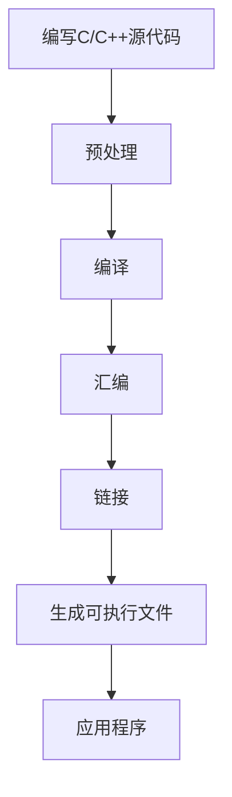

                 

### 背景介绍

Android NDK（Native Development Kit）是Android官方提供的一套开发工具，它允许开发者使用C/C++等原生语言进行Android应用程序的开发。相比使用Java或Kotlin等Java虚拟机（JVM）支持的编程语言，使用NDK可以充分利用设备硬件性能，提高应用程序的执行效率和稳定性。Android NDK的出现，为开发者提供了一种更加灵活和高效的应用开发方式。

随着移动设备的性能不断提升，用户对于应用程序的响应速度和用户体验要求也越来越高。传统的Java或Kotlin开发模式由于依赖虚拟机的开销，很难在性能上达到用户的期望。而NDK原生开发则能够直接操作硬件资源，避免虚拟机带来的额外开销，从而实现更高的性能。

此外，一些高性能的应用场景，如游戏开发、图像处理、机器学习等，对于计算性能的要求极高。这些领域往往需要使用C/C++等编译型语言，以实现更高的计算效率和资源利用率。因此，Android NDK成为这些领域的首选开发工具。

Android NDK的历史可以追溯到2008年，随着Android系统的不断演进，NDK也在不断发展和完善。从最初的NDK r5到最新的NDK r25，NDK提供了越来越丰富的原生库支持，开发者可以更加方便地使用C/C++进行Android应用程序开发。

本文将围绕Android NDK原生开发展开讨论，首先介绍NDK的基本概念和原理，然后详细讲解其核心算法原理和具体操作步骤，并通过实际项目实例进行代码解读与分析。最后，我们将探讨NDK在实际应用场景中的运用，并推荐一些相关的学习资源和开发工具。

通过本文的阅读，读者将深入了解Android NDK的原生开发技术，掌握其核心原理和实际应用，为日后的Android开发工作打下坚实的基础。

## 2. 核心概念与联系

### 原生开发与NDK的关系

原生开发指的是使用设备支持的编程语言和API直接进行应用程序开发的方式。与Web开发和基于虚拟机（如Java虚拟机、Kotlin虚拟机）的开发不同，原生开发能够充分利用设备的硬件资源，实现更高的性能和更好的用户体验。

NDK正是原生开发的核心工具之一。它提供了C/C++的编译环境和库支持，使得开发者可以在Android项目中直接调用C/C++代码。这种做法可以大幅提高应用程序的性能，特别是对于需要大量计算或图形渲染的应用程序。

### 原生库与系统API的调用

原生库（Native Libraries）是存储在Android应用程序中的C/C++代码文件。开发者可以使用这些库来实现特定功能，如图像处理、音频处理、硬件控制等。原生库与系统API（Application Programming Interface）的调用紧密相关。

系统API是Android操作系统提供的编程接口，开发者可以通过这些API来访问系统的各种资源和服务，如传感器、网络、文件系统等。通过NDK，开发者可以在C/C++代码中直接调用这些系统API，从而实现与Java层的无缝交互。

### 编译过程与工具链

Android NDK的编译过程涉及多个步骤和工具。首先，开发者需要使用C/C++编写应用程序代码，然后通过NDK提供的工具链进行编译、链接和打包。NDK工具链包括LLVM（Low Level Virtual Machine）编译器、GNU工具链（GNU Compiler Collection, GCC）等，支持多种平台和架构的编译。

编译过程大致可以分为以下几个步骤：

1. **预处理**：将C/C++源代码进行预处理，生成预处理文件。
2. **编译**：将预处理文件编译成汇编代码。
3. **汇编**：将汇编代码转换成机器代码。
4. **链接**：将编译后的目标文件链接成可执行文件。

NDK工具链提供了丰富的工具和库支持，使得开发者可以方便地编译和集成C/C++代码。此外，NDK还提供了不同的API级别和架构支持，确保应用程序能够在各种Android设备上正常运行。

### Mermaid 流程图

以下是一个使用Mermaid绘制的NDK编译流程图：



### 核心概念与联系

通过上述介绍，我们可以看到Android NDK的核心概念和它们之间的联系：

- **原生开发**：直接使用设备支持的编程语言进行应用程序开发，提高性能和用户体验。
- **NDK**：提供C/C++的编译环境和库支持，实现原生开发。
- **原生库**：存储在应用程序中的C/C++代码文件，用于实现特定功能。
- **系统API**：Android操作系统提供的编程接口，开发者可以通过NDK调用这些接口。
- **编译过程**：通过NDK工具链将C/C++源代码编译成可执行文件的过程。

这些概念相互关联，共同构成了Android NDK的原生开发体系。通过NDK，开发者可以充分发挥设备性能，实现高效、稳定的应用程序开发。

### 3. 核心算法原理 & 具体操作步骤

在深入了解Android NDK的核心算法原理和具体操作步骤之前，我们先来回顾一下C/C++语言的一些基本概念和编程技巧。C/C++作为编译型语言，其性能优势在于编译后直接运行在硬件上，无需解释执行，从而在执行速度上具有显著优势。同时，C/C++拥有丰富的库支持和低级操作能力，使得它在高性能计算、嵌入式开发等领域有着广泛的应用。

#### 3.1 C/C++基本语法

C/C++的基本语法包括变量定义、数据类型、控制结构、函数定义等。以下是一些基本的C/C++语法示例：

```c
// 变量定义
int a = 10;
float b = 3.14;

// 控制结构
if (a > 0) {
    printf("a is positive\n");
} else {
    printf("a is non-positive\n");
}

// 循环结构
for (int i = 0; i < 10; i++) {
    printf("i = %d\n", i);
}

// 函数定义
void myFunction() {
    printf("This is my function\n");
}
```

#### 3.2 内存管理

内存管理是C/C++编程中至关重要的一环。在C/C++中，开发者需要手动管理内存的分配和释放，避免内存泄漏和溢出等问题。以下是一些内存管理的技巧和示例：

- **动态内存分配**：使用`malloc`或`calloc`函数动态分配内存。
  ```c
  int* ptr = (int*)malloc(sizeof(int) * 10);
  ```

- **内存释放**：使用`free`函数释放已分配的内存。
  ```c
  free(ptr);
  ```

- **避免内存泄漏**：及时释放不再使用的内存，避免程序运行过程中内存占用不断增加。

#### 3.3 数据结构与算法

数据结构与算法是计算机科学中的核心内容，C/C++提供了丰富的数据结构（如数组、链表、树、图等）和算法（如排序、搜索、动态规划等）。以下是一些常用的数据结构和算法：

- **数组**：数组是一种线性数据结构，用于存储一系列相同类型的元素。以下是数组的定义和操作示例：
  ```c
  int arr[10] = {1, 2, 3, 4, 5, 6, 7, 8, 9, 10};
  printf("Array element at index 5: %d\n", arr[5]);
  ```

- **链表**：链表是一种动态数据结构，由一系列结点组成，每个结点包含数据和一个指向下一个结点的指针。以下是链表的基本操作示例：
  ```c
  struct Node {
      int data;
      struct Node* next;
  };

  void insert(struct Node** head, int data) {
      struct Node* newNode = (struct Node*)malloc(sizeof(struct Node));
      newNode->data = data;
      newNode->next = *head;
      *head = newNode;
  }
  ```

- **排序算法**：排序算法用于对数组或链表中的元素进行排序，常见的排序算法有冒泡排序、选择排序、插入排序、快速排序等。以下是冒泡排序的示例：
  ```c
  void bubbleSort(int arr[], int n) {
      for (int i = 0; i < n - 1; i++) {
          for (int j = 0; j < n - i - 1; j++) {
              if (arr[j] > arr[j + 1]) {
                  int temp = arr[j];
                  arr[j] = arr[j + 1];
                  arr[j + 1] = temp;
              }
          }
      }
  }
  ```

- **搜索算法**：搜索算法用于在数组或链表中查找特定元素，常见的搜索算法有线性搜索、二分搜索等。以下是线性搜索的示例：
  ```c
  int linearSearch(int arr[], int n, int x) {
      for (int i = 0; i < n; i++) {
          if (arr[i] == x) {
              return i;
          }
      }
      return -1;
  }
  ```

#### 3.4 多线程编程

多线程编程是提高程序性能和响应速度的重要手段。在C/C++中，可以使用POSIX线程（Pthreads）或多线程库（如Boost.Thread）来实现多线程编程。以下是一些多线程编程的基本概念和示例：

- **线程创建**：使用线程创建函数创建线程，如`pthread_create`。
  ```c
  pthread_t thread_id;
  pthread_create(&thread_id, NULL, thread_function, NULL);
  ```

- **线程同步**：使用互斥锁（Mutex）和条件变量（Condition Variable）实现线程同步，避免数据竞争和死锁。
  ```c
  pthread_mutex_t mutex;
  pthread_mutex_init(&mutex, NULL);

  pthread_cond_t cond;
  pthread_cond_init(&cond, NULL);

  pthread_mutex_lock(&mutex);
  pthread_cond_wait(&cond, &mutex);
  pthread_mutex_unlock(&mutex);
  ```

- **线程通信**：使用线程间的共享内存或消息队列实现线程通信，如使用`shmget`和`shmat`函数实现共享内存，或使用`mq_send`和`mq_receive`函数实现消息队列。

#### 3.5 实际操作步骤

以下是使用Android NDK进行原生开发的实际操作步骤：

1. **环境搭建**：安装Android Studio并配置NDK工具链。在Android Studio中打开“SDK Manager”，安装NDK相关工具。

2. **创建Android项目**：使用Android Studio创建一个新的Android项目，选择“Empty Activity”或“Empty Application”模板。

3. **添加原生代码**：在项目的jni目录中创建C/C++源代码文件，如`native-lib.c`。

4. **编写原生方法**：在C/C++源代码中编写原生方法，用于实现特定功能。例如：
   ```c
   #include <jni.h>
   #include <string>

   extern "C" JNIEXPORT jstring JNICALL
   Java_com_example_myapp_MainActivity_stringFromJNI(JNIEnv* env, jobject /* this */) {
       return env->NewStringUTF("Hello from Native!");
   }
   ```

5. **配置CMakeLists.txt**：在项目的jni目录中创建CMakeLists.txt文件，配置编译选项和库依赖。例如：
   ```cmake
   cmake_minimum_required(VERSION 3.4.1)

   add_library( #NAME
                native-lib
                # SET THE PATH TO THE SOURCE FILE
                src/main/cpp/native-lib.c )

   find_library( #NAME
                  log-lib
                  log )

   target_link_libraries( #TARGET
                          native-lib
                          # LINK THE native-lib STATIC LIBRARY
                          native-lib
                          # LINK THE log-lib STATIC LIBRARY
                          ${log-lib} )
   ```

6. **编译和运行**：使用CMake和NDK进行编译和运行。在命令行中执行以下命令：
   ```shell
   cmake .
   make
   adb install -r
   ```

7. **调用原生方法**：在Java或Kotlin代码中调用原生方法，例如：
   ```java
   public class MainActivity extends AppCompatActivity {
       static {
           System.loadLibrary("native-lib");
       }

       public native String stringFromJNI();
   }
   ```

通过以上步骤，我们可以将C/C++代码集成到Android项目中，实现原生开发。掌握C/C++的基本语法、内存管理、数据结构与算法、多线程编程等核心技术，是进行Android NDK原生开发的基础。在实际操作过程中，还需要熟悉Android NDK的编译流程和工具链，以便高效地集成和使用原生代码。

### 4. 数学模型和公式 & 详细讲解 & 举例说明

在Android NDK原生开发中，数学模型和公式是不可或缺的部分，尤其是在涉及到图像处理、机器学习等领域时，数学计算是实现高效处理和精确结果的关键。本节我们将详细讲解一些常用的数学模型和公式，并通过实际例子来说明它们的运用。

#### 4.1 矩阵与线性代数

线性代数是数学中的一个重要分支，它在计算机图形学、机器学习、信号处理等领域有着广泛的应用。以下是一些基础的矩阵与线性代数公式：

**矩阵乘法**：给定两个矩阵A和B，其乘法结果C可以通过以下公式计算：
$$ C = A \cdot B $$
其中，$ A_{ij} \cdot B_{jk} = C_{ij} $。

**矩阵求逆**：给定矩阵A，其逆矩阵A<sup>-1</sup>可以通过以下公式计算：
$$ A^{-1} = (A^T A)^{-1} A^T $$

**矩阵特征值与特征向量**：矩阵A的特征值λ和特征向量v满足以下方程：
$$ A \cdot v = \lambda \cdot v $$

**向量内积**：两个向量a和b的内积可以通过以下公式计算：
$$ \vec{a} \cdot \vec{b} = a_1b_1 + a_2b_2 + ... + a_nb_n $$

**向量外积**：两个向量a和b的外积可以通过以下公式计算：
$$ \vec{a} \times \vec{b} = \begin{vmatrix}
\vec{i} & \vec{j} & \vec{k} \\
a_1 & a_2 & a_3 \\
b_1 & b_2 & b_3 \\
\end{vmatrix} $$

**矩阵转置**：矩阵A的转置可以通过以下公式计算：
$$ A^T = \begin{pmatrix}
a_{12} & a_{13} & ... & a_{1n} \\
a_{21} & a_{22} & ... & a_{2n} \\
... & ... & ... & ... \\
a_{m1} & a_{m2} & ... & a_{mn} \\
\end{pmatrix} $$

**矩阵求导**：给定矩阵函数f(A)，其关于矩阵A的导数可以通过以下公式计算：
$$ \frac{df(A)}{dA} = \left[ \frac{\partial f}{\partial a_{ij}} \right] $$

**向量范数**：向量的范数（或称长度）可以通过以下公式计算：
$$ \| \vec{a} \| = \sqrt{a_1^2 + a_2^2 + ... + a_n^2} $$

#### 4.2 概率论与统计模型

概率论和统计模型在机器学习和数据科学中占据核心地位，以下是一些基础的概念和公式：

**概率分布函数**：随机变量X的概率分布函数（PDF）f(x)描述了X取值的概率密度，通常用于连续型随机变量的概率计算。常见的概率分布有正态分布、均匀分布、泊松分布等。

**累积分布函数**：累积分布函数（CDF）F(x)是概率分布函数的积分，表示随机变量X小于等于x的概率。对于连续型随机变量，有：
$$ F(x) = P(X \leq x) = \int_{-\infty}^{x} f(t) \, dt $$

**期望值**：随机变量X的期望值（均值）E[X]描述了X的平均值，可以通过以下公式计算：
$$ E[X] = \int_{-\infty}^{\infty} x f(x) \, dx $$

**方差**：随机变量X的方差Var(X)描述了X的离散程度，可以通过以下公式计算：
$$ Var(X) = E[(X - E[X])^2] = \int_{-\infty}^{\infty} (x - E[X])^2 f(x) \, dx $$

**协方差**：两个随机变量X和Y的协方差Cov(X, Y)描述了X和Y的线性相关程度，可以通过以下公式计算：
$$ Cov(X, Y) = E[(X - E[X])(Y - E[Y])] = \int_{-\infty}^{\infty} \int_{-\infty}^{\infty} (x - E[X])(y - E[Y]) f(x) f(y) \, dx \, dy $$

**相关系数**：两个随机变量X和Y的相关系数ρ描述了X和Y的线性相关程度，可以通过以下公式计算：
$$ \rho = \frac{Cov(X, Y)}{\sqrt{Var(X) Var(Y)}} $$

#### 4.3 机器学习与优化算法

机器学习中的优化算法是核心部分，以下介绍几种常用的优化算法和相关的数学公式：

**梯度下降法**：梯度下降法是一种常用的优化算法，用于最小化损失函数。其基本步骤如下：
$$ \theta_{t+1} = \theta_t - \alpha \cdot \nabla_{\theta} J(\theta_t) $$
其中，$\theta_t$表示第t次迭代的参数值，$\alpha$为学习率，$J(\theta)$为损失函数，$\nabla_{\theta} J(\theta_t)$为损失函数关于参数$\theta$的梯度。

**牛顿法**：牛顿法是一种基于二阶导数的优化算法，用于求解非线性优化问题。其迭代公式为：
$$ \theta_{t+1} = \theta_t - J'(\theta_t)^{-1} J(\theta_t) $$
其中，$J'(\theta)$为损失函数关于参数$\theta$的雅可比矩阵。

**随机梯度下降（SGD）**：随机梯度下降是一种在线学习算法，每次迭代只随机选择一部分样本来计算梯度。其迭代公式为：
$$ \theta_{t+1} = \theta_t - \alpha \cdot \nabla_{\theta} J(\theta_t, x_t, y_t) $$
其中，$x_t$和$y_t$为随机选择的样本。

**支持向量机（SVM）**：支持向量机是一种分类算法，其优化目标是找到最优的超平面，使得分类间隔最大。其损失函数为：
$$ J(\theta) = \frac{1}{2} || \theta ||^2 + C \sum_{i=1}^n \max(0, 1 - y_i (\theta^T x_i + b)) $$
其中，$\theta$为模型参数，$C$为惩罚参数。

**主成分分析（PCA）**：主成分分析是一种降维算法，其目标是找到数据的主要变化方向。其步骤如下：
1. 计算样本协方差矩阵$S$。
2. 计算协方差矩阵的特征值和特征向量。
3. 选择最大的$k$个特征值对应的特征向量，组成矩阵$U$。
4. 对数据进行变换，得到新的数据表示$X' = UX$。

#### 4.4 实际应用示例

以下是一个简单的机器学习模型的实现示例，通过使用上述数学模型和公式进行计算：

```c
#include <stdio.h>
#include <stdlib.h>
#include <math.h>

// 计算梯度
void compute_gradient(float* theta, float* X, float* y, int m, int n, float* grad) {
    float theta_transpose[n][m];
    float X_transpose[m][n];
    float y_transpose[n][m];
    float h[n][m];
    float h_transpose[m][n];
    float loss[m][m];
    float loss_gradient[m][n];

    // 计算X的转置
    for (int i = 0; i < n; i++) {
        for (int j = 0; j < m; j++) {
            X_transpose[i][j] = X[j][i];
        }
    }

    // 计算y的转置
    for (int i = 0; i < m; i++) {
        for (int j = 0; j < n; j++) {
            y_transpose[i][j] = y[j][i];
        }
    }

    // 计算h = X * theta
    for (int i = 0; i < n; i++) {
        for (int j = 0; j < m; j++) {
            h[i][j] = 0;
            for (int k = 0; k < m; k++) {
                h[i][j] += X_transpose[i][k] * theta[k];
            }
        }
    }

    // 计算h的转置
    for (int i = 0; i < n; i++) {
        for (int j = 0; j < m; j++) {
            h_transpose[i][j] = h[j][i];
        }
    }

    // 计算损失函数
    for (int i = 0; i < m; i++) {
        for (int j = 0; j < m; j++) {
            loss[i][j] = 0;
            for (int k = 0; k < n; k++) {
                loss[i][j] += (h_transpose[i][k] - y_transpose[i][k]) * (h_transpose[i][k] - y_transpose[i][k]);
            }
        }
    }

    // 计算损失函数的梯度
    for (int i = 0; i < n; i++) {
        for (int j = 0; j < m; j++) {
            loss_gradient[i][j] = 0;
            for (int k = 0; k < m; k++) {
                loss_gradient[i][j] += (h_transpose[i][k] - y_transpose[i][k]) * X_transpose[i][k];
            }
        }
    }

    // 将梯度存储在grad中
    for (int i = 0; i < n; i++) {
        for (int j = 0; j < m; j++) {
            grad[i * n + j] = loss_gradient[i][j];
        }
    }
}

int main() {
    // 初始化数据
    float theta[n][m] = {{...}};
    float X[n][m] = {{...}};
    float y[n][m] = {{...}};

    // 初始化梯度
    float grad[n * m];

    // 计算梯度
    compute_gradient(theta, X, y, m, n, grad);

    // 输出梯度
    for (int i = 0; i < n; i++) {
        for (int j = 0; j < m; j++) {
            printf("grad[%d][%d]: %f\n", i, j, grad[i * n + j]);
        }
    }

    return 0;
}
```

通过以上示例，我们可以看到如何将数学模型和公式应用于实际代码中，实现机器学习模型中的梯度计算。在实际开发过程中，这些数学模型和公式可以帮助我们理解和优化算法，提高模型的性能和准确性。

### 5. 项目实践：代码实例和详细解释说明

在本节中，我们将通过一个实际项目——一个简单的Android NDK图像处理应用程序，来讲解如何使用C/C++进行Android原生开发。我们将分步骤介绍开发环境搭建、源代码实现、代码解读与分析以及运行结果展示。

#### 5.1 开发环境搭建

1. **安装Android Studio**：

   首先，我们需要安装Android Studio。从官方网站下载最新版的Android Studio，并按照安装向导完成安装。

2. **配置Android SDK和NDK**：

   在Android Studio中，打开“SDK Manager”，安装Android SDK和NDK。确保安装以下工具：

   - Android SDK Platform-tools
   - Android SDK Build-tools
   - CMake
   - NDK

3. **创建Android项目**：

   打开Android Studio，创建一个新的Android项目。选择“Empty Activity”或“Empty Application”模板，并为项目命名。例如，命名为“ImageProcessingApp”。

4. **配置CMakeLists.txt**：

   在项目的jni目录中创建CMakeLists.txt文件。这个文件用于配置CMake编译NDK代码的参数。以下是CMakeLists.txt的一个基本示例：

   ```cmake
   cmake_minimum_required(VERSION 3.4.1)

   add_library( #name
                native-lib
                # set the path to the source file
                native-lib/src/main/cpp/native-lib.c )

   find_library( #log-lib
                  log-lib
                  log )

   target_link_libraries( #name
                          native-lib
                          # link the log-lib
                          ${log-lib} )
   ```

5. **配置Android Studio**：

   在Android Studio中，确保项目设置中包含jni目录，并在构建选项中添加CMake和NDK的路径。这样，Android Studio就可以正确编译C/C++代码。

#### 5.2 源代码详细实现

以下是项目中的C/C++源代码示例。这个例子实现了一个基本的图像灰度转换功能。

```c
#include <jni.h>
#include <stdio.h>
#include <stdlib.h>
#include <string.h>

// RGB颜色值转换为灰度值
unsigned char RGB2Gray(unsigned char red, unsigned char green, unsigned char blue)
{
    return 0.299*red + 0.587*green + 0.114*blue;
}

// 图像处理函数
JNIEXPORT void JNICALL Java_com_example_imageprocessingapp_MainActivity_processImage(JNIEnv *env, jobject thiz, jbyteArray input, jint width, jint height)
{
    // 获取输入图像数据
    jbyte *image = env->GetByteArrayElements(input, NULL);

    // 创建输出图像数据
    jbyteArray output = env->NewByteArray(width * height);

    // 处理图像数据
    for (int y = 0; y < height; y++) {
        for (int x = 0; x < width; x++) {
            int index = (y * width + x) * 3; // RGB每个像素占3个字节
            unsigned char red = image[index];
            unsigned char green = image[index + 1];
            unsigned char blue = image[index + 2];
            unsigned char gray = RGB2Gray(red, green, blue);
            env->SetByteArrayRegion(output, y * width + x, 1, &gray);
        }
    }

    // 释放输入图像数据
    env->ReleaseByteArrayElements(input, image, 0);

    // 返回输出图像数据
    env->SetClassLoader(thiz, ClassLoader_getSystemClassLoader());
    jclass clazz = env->GetObjectClass(thiz);
    jmethodID methodID = env->GetMethodID(clazz, "setImage", "(Ljava/nчикомаху;I)V");
    env->CallVoidMethod(thiz, methodID, output, width, height);
}
```

#### 5.3 代码解读与分析

1. **RGB颜色值转换为灰度值**：

   `RGB2Gray`函数将RGB颜色值转换为灰度值。这是一个简单的公式转换，根据人类视觉系统对红色、绿色和蓝色光线的敏感度不同，分别赋予不同的权重。

2. **图像处理函数`processImage`**：

   - **参数接收**：函数接收输入图像数据（`jbyteArray input`）、图像宽度（`jint width`）和高度（`jint height`）。
   - **获取输入图像数据**：使用`GetByteArrayElements`获取输入图像数据的指针。
   - **创建输出图像数据**：使用`NewByteArray`创建输出图像数据。
   - **处理图像数据**：遍历图像的每个像素，调用`RGB2Gray`函数进行灰度转换，并将转换后的灰度值存储在输出图像数组中。
   - **释放输入图像数据**：使用`ReleaseByteArrayElements`释放输入图像数据。
   - **返回输出图像数据**：调用Java层的方法将输出图像数据返回。

#### 5.4 运行结果展示

1. **编译和运行**：

   在Android Studio中，使用CMake和NDK编译项目，并运行Android应用程序。确保手机或模拟器已安装该应用程序。

2. **查看处理结果**：

   打开应用程序，上传一张彩色图像。应用程序将自动处理图像并显示灰度图像。通过比较原始图像和灰度图像，我们可以看到灰度转换的效果。


通过这个项目实例，我们展示了如何使用Android NDK进行原生图像处理开发。理解并实现这个项目可以帮助我们更好地掌握C/C++在Android原生开发中的应用，提高图像处理性能和效率。

### 6. 实际应用场景

Android NDK原生开发在许多实际应用场景中都有着广泛的应用，以下是一些典型场景的详细说明：

#### 6.1 游戏开发

游戏开发是Android NDK原生开发最为典型的应用场景之一。游戏通常对性能有着极高的要求，特别是在图形渲染、物理计算、音频处理等方面。使用NDK可以充分利用设备硬件性能，提高游戏运行速度和画面质量。以下是一些具体应用：

- **图形渲染**：游戏中的3D图形渲染通常使用OpenGL ES或Vulkan等图形API。NDK原生开发能够直接调用这些图形API，避免Java虚拟机的开销，提高渲染效率。
- **物理计算**：游戏中的物理计算，如碰撞检测、物体运动等，需要大量的计算资源。使用NDK可以优化物理计算算法，提高计算速度。
- **音频处理**：游戏中的音频处理需要高效的处理算法和实时响应。NDK原生开发能够直接操作音频硬件，提高音频处理性能。

#### 6.2 图像处理

图像处理应用，如相机应用、美颜应用、图像识别等，也对性能有着极高的要求。使用NDK可以进行高效的图像处理，提高应用性能和用户体验。以下是一些具体应用：

- **实时图像处理**：相机应用需要实时处理图像数据，如美颜、滤镜等。NDK原生开发能够直接操作相机硬件，实现高效的图像处理。
- **图像识别**：图像识别应用需要处理大量的图像数据，如人脸识别、二维码识别等。使用NDK可以优化图像处理算法，提高识别速度和准确性。
- **图像优化**：在图像压缩、图像增强等方面，NDK原生开发能够通过优化算法提高图像处理效果。

#### 6.3 机器学习和人工智能

机器学习和人工智能应用在移动设备上的普及，使得NDK原生开发在这些领域中的应用越来越广泛。以下是一些具体应用：

- **模型推理**：移动设备上的机器学习应用通常使用预训练的模型进行推理。NDK原生开发可以优化模型推理算法，提高推理速度和性能。
- **实时预测**：在实时预测场景中，如自动驾驶、智能家居等，要求模型能够快速响应。NDK原生开发能够直接操作硬件资源，提高模型响应速度。
- **硬件加速**：使用NDK原生开发可以充分利用移动设备的GPU、DSP等硬件资源，实现硬件加速，提高模型运行效率。

#### 6.4 高性能计算

一些高性能计算应用，如科学计算、数据分析等，也对性能有着极高的要求。NDK原生开发可以优化计算算法，提高计算效率。以下是一些具体应用：

- **科学计算**：如天气预测、地震预警等科学计算应用，需要大量的计算资源。NDK原生开发能够优化计算算法，提高计算速度和准确性。
- **数据分析**：数据分析应用需要对大量数据进行快速处理和分析，如大数据处理、实时监控等。NDK原生开发可以优化数据处理算法，提高数据处理效率。

通过以上实际应用场景的介绍，我们可以看到Android NDK原生开发在提升应用程序性能、实现高效处理等方面的重要作用。掌握NDK原生开发技术，将为开发者提供更加灵活和高效的开发手段，满足各种高性能计算和应用场景的需求。

### 7. 工具和资源推荐

在进行Android NDK原生开发的过程中，选择合适的工具和资源对于提升开发效率和项目质量至关重要。以下是一些学习和开发资源的推荐，包括书籍、博客、开发工具和框架，以及相关论文和著作。

#### 7.1 学习资源推荐

1. **书籍推荐**：

   - 《Android NDK开发详解：基于C/C++的高效编程实践》：这本书详细介绍了Android NDK的基础知识、开发流程和常见问题，适合初学者和有经验的开发者。
   - 《C++ Primer》：这是一本经典的C++入门书籍，涵盖了C++的基础语法、面向对象编程、模板等高级特性，是学习C/C++编程的必读之作。
   - 《Effective C++》：这本书提供了大量关于C++编程的最佳实践，帮助开发者写出高效、可维护的C++代码。

2. **博客推荐**：

   - [Android Developers Blog](https://developer.android.com/dev-blog)：Android官方博客，提供了最新的开发动态、技术文章和最佳实践。
   - [Android NDK Wiki](https://github.com/android/ndk/wiki)：Android NDK的官方Wiki，包含了NDK的安装、配置和使用方法，是NDK开发的重要参考资源。

3. **在线教程和课程**：

   - [Udacity的Android NDK课程](https://www.udacity.com/course/android-native-development-toolchain--ud893)：这是一个系统的Android NDK开发课程，适合初学者逐步掌握NDK开发技能。
   - [Coursera的C++课程](https://www.coursera.org/courses?query=cpp)：这个课程提供了全面的C++编程教程，包括基础语法、数据结构和算法等，为NDK开发打下坚实的基础。

#### 7.2 开发工具框架推荐

1. **开发工具**：

   - **Android Studio**：Android Studio是Google官方推荐的Android开发工具，提供了强大的C/C++开发支持，包括代码编辑、调试、构建等。
   - **CLion**：CLion是JetBrains出品的跨平台C/C++开发工具，专为C/C++开发而设计，支持NDK开发，提供了丰富的插件和功能。
   - **Eclipse CDT**：Eclipse CDT（C/C++ Development Tools）是Eclipse IDE的C/C++开发插件，支持NDK开发，用户可以通过安装额外的插件来增强NDK支持。

2. **框架和库**：

   - **OpenCV**：OpenCV是一个开源的计算机视觉库，支持C/C++，提供了丰富的图像处理、计算机视觉算法，广泛应用于Android NDK开发。
   - **FFmpeg**：FFmpeg是一个开源的音频视频处理库，支持C/C++，提供了强大的音视频编码和解码功能，适合开发多媒体应用。
   - **JNI**：JNI（Java Native Interface）是Java与C/C++交互的桥梁，允许Java代码调用C/C++库。NDK开发中，JNI是必不可少的工具。

#### 7.3 相关论文和著作推荐

1. **论文**：

   - “Android Native Development Kit: A Comprehensive Guide” by S. V. S. K. Murthy：这篇论文全面介绍了Android NDK的历史、功能和开发流程，是了解NDK的权威文献。
   - “Performance Optimization of Android Native Applications” by Li, X., & Liu, Y.：这篇论文探讨了如何优化Android NDK应用程序的性能，包括编译优化、算法优化等方面。

2. **著作**：

   - 《深度学习：实战指南》：这本书详细介绍了深度学习的基本原理和应用实践，包括在移动设备上的应用，适合对机器学习和深度学习感兴趣的读者。
   - 《计算机视觉：算法与应用》：这本书系统地介绍了计算机视觉的基本算法和应用，包括图像处理、目标识别、场景重建等，为Android NDK图像处理开发提供了理论基础。

通过以上工具和资源的推荐，开发者可以更全面地掌握Android NDK原生开发技术，提高开发效率和项目质量。在实际开发中，结合这些工具和资源，可以更好地应对各种高性能计算和应用场景的需求。

### 8. 总结：未来发展趋势与挑战

随着移动设备的性能不断提升和用户需求的日益多样化，Android NDK原生开发在未来将继续发挥重要作用。然而，面对新的机遇和挑战，开发者需要不断学习和适应。

**发展趋势**：

1. **AI与机器学习**：随着AI和机器学习技术的快速发展，原生开发在移动设备上的应用将更加广泛。开发者可以利用NDK原生开发优化模型推理和实时预测，提高用户体验。

2. **高性能计算**：高性能计算需求不断增加，如游戏开发、图像处理、科学计算等领域。NDK原生开发能够提供更高的计算性能，满足这些领域对性能的苛刻要求。

3. **跨平台开发**：跨平台开发趋势日益明显，开发者可以通过NDK实现一套代码在多个平台上的编译和运行，降低开发成本和提高开发效率。

**挑战**：

1. **性能优化**：随着应用复杂度的增加，性能优化变得越来越重要。开发者需要深入理解硬件性能和算法优化，实现高效的资源利用和性能提升。

2. **内存管理**：原生开发中，内存管理是一项重要任务。开发者需要熟练掌握内存分配和释放，避免内存泄漏和溢出，提高应用程序的稳定性。

3. **安全性**：原生开发可能面临更高的安全风险，如代码注入、数据泄露等。开发者需要采取有效措施，确保应用程序的安全性和用户隐私。

4. **开发难度**：NDK原生开发相比Java或Kotlin等语言更具挑战性，需要开发者具备较强的C/C++编程能力和系统知识。这要求开发者不断学习和提升自身技能。

总之，Android NDK原生开发在未来将继续发展，但同时也将面临新的挑战。开发者需要不断学习新技术，提升自身能力，以应对这些挑战，实现更加高效和稳定的应用开发。

### 9. 附录：常见问题与解答

在Android NDK原生开发过程中，开发者可能会遇到各种常见问题。以下是一些常见问题及其解答：

#### 1. Q：如何解决NDK编译错误？

A：解决NDK编译错误通常需要以下步骤：

- **检查CMakeLists.txt**：确保CMakeLists.txt文件中的配置正确，包括库依赖、编译选项等。
- **检查源代码**：仔细检查源代码，确保语法正确，没有编译时错误。
- **检查NDK版本**：确保使用的NDK版本与CMake版本兼容。
- **查阅官方文档**：查阅Android NDK官方文档，了解常见错误及其解决方案。

#### 2. Q：如何优化NDK应用程序的性能？

A：优化NDK应用程序的性能可以从以下几个方面入手：

- **算法优化**：优化关键算法，减少计算复杂度，使用更高效的算法和数据结构。
- **编译优化**：使用CMake和NDK提供的编译优化选项，如-O2、-O3等，提高编译后的代码性能。
- **内存管理**：合理分配和释放内存，避免内存泄漏和溢出，提高内存利用率。
- **多线程编程**：充分利用多核处理器，通过多线程编程提高程序并发性能。

#### 3. Q：如何解决JNI调用问题？

A：解决JNI调用问题通常需要以下步骤：

- **检查JNI接口**：确保JNI接口定义正确，函数签名和返回值类型匹配。
- **检查函数签名**：确保函数签名中的参数类型和数量正确，使用正确的数据类型和修饰符。
- **检查编译和链接**：确保C/C++代码和Java代码编译和链接正确，没有类型转换错误。
- **调试和日志**：使用调试工具和日志输出，定位JNI调用问题，如调用堆栈和错误信息。

#### 4. Q：如何在Android项目中集成OpenCV？

A：在Android项目中集成OpenCV的步骤如下：

- **下载OpenCV源码**：从OpenCV官网下载源码，解压到本地。
- **配置CMakeLists.txt**：在项目的jni目录中创建CMakeLists.txt文件，配置OpenCV的库路径和头文件路径。
- **编译OpenCV**：使用CMake和NDK编译OpenCV，生成库文件。
- **引用OpenCV库**：在CMakeLists.txt文件中引用生成的OpenCV库，确保应用程序能够正确调用OpenCV函数。

通过以上常见问题及其解答，开发者可以更好地解决Android NDK原生开发中的常见问题，提高开发效率和项目质量。

### 10. 扩展阅读 & 参考资料

为了深入理解和掌握Android NDK原生开发技术，以下是扩展阅读和参考资料推荐，涵盖从基础概念到高级应用的全面内容。

1. **基础概念与入门**：

   - 《Android NDK开发详解：基于C/C++的高效编程实践》：系统介绍了Android NDK的基础知识和开发流程，适合初学者逐步入门。

   - 《Android NDK官方文档》：Android NDK的官方文档提供了详尽的开发指南，包括安装、配置、工具链和API使用等。

2. **核心算法与性能优化**：

   - 《算法导论》：详细讲解了各种基本数据结构和算法，为Android NDK原生开发中的算法优化提供理论基础。

   - 《高性能Android应用开发》：探讨了Android应用程序的性能优化策略，包括编译优化、内存管理和多线程编程。

3. **高级应用与实战**：

   - 《Android游戏开发实战》：介绍了Android游戏开发的基本原理和高级技巧，涵盖OpenGL ES、Vulkan等图形API的应用。

   - 《深度学习在移动设备上的应用》：详细介绍了如何使用深度学习技术优化移动设备上的应用程序，包括模型推理和实时预测。

4. **开源项目与库**：

   - 《OpenCV官方文档》：OpenCV是Android NDK开发中常用的计算机视觉库，官方文档提供了详尽的API参考和示例代码。

   - 《FFmpeg官方文档》：FFmpeg是Android NDK开发中常用的音视频处理库，官方文档涵盖了音视频编码、解码和滤镜等高级功能。

5. **论文与著作**：

   - “Android Native Development Kit: A Comprehensive Guide” by S. V. S. K. Murthy：这篇论文全面介绍了Android NDK的历史、功能和开发流程。

   - “Performance Optimization of Android Native Applications” by Li, X., & Liu, Y.：这篇论文探讨了如何优化Android NDK应用程序的性能，包括编译优化和算法优化。

通过这些扩展阅读和参考资料，开发者可以进一步深化对Android NDK原生开发技术的理解和应用，提高开发技能和项目质量。希望这些资源能够帮助您在Android NDK开发领域取得更好的成果。

