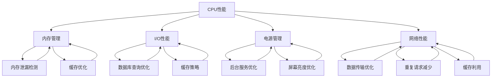

                 

### 1. 背景介绍

Android应用作为现代移动设备的主要软件平台，其性能直接影响到用户体验。性能优化是Android应用开发过程中至关重要的一环，它不仅决定了应用的响应速度和流畅性，还影响着应用的安装量、用户留存率以及口碑。随着用户对应用性能要求的不断提高，如何进行有效的性能优化成为了开发者们面临的一大挑战。

#### 性能优化的意义

性能优化对于Android应用具有以下几个层面的重要意义：

1. **提升用户体验**：快速响应和流畅的操作可以极大地提升用户的满意度和使用体验。
2. **增加用户留存率**：性能良好的应用更可能吸引并留住用户，减少用户流失。
3. **提高应用市场排名**：优秀性能的应用更容易获得更高的用户评分和推荐，从而提高应用在市场中的排名。
4. **降低开发和维护成本**：通过提前进行性能优化，可以减少后期因性能问题导致的修复成本。

#### 性能优化的关键点

在进行Android应用性能优化时，需要关注以下几个关键点：

1. **CPU性能**：包括避免过度使用CPU、优化线程使用和避免阻塞主线程等。
2. **内存管理**：包括减少内存泄漏、合理使用内存缓存和优化数据结构等。
3. **I/O性能**：包括减少磁盘和网络I/O操作、优化数据库查询和缓存策略等。
4. **电源管理**：包括优化电池消耗、减少后台服务等。
5. **网络性能**：包括优化数据传输、减少重复请求和利用缓存等。

#### 性能优化的常用方法

常见的Android应用性能优化方法包括：

1. **代码优化**：包括减少不必要的计算、优化循环和递归结构、使用高效算法等。
2. **资源优化**：包括优化图片资源、使用_vectorDrawable减少内存占用、合理使用动画和过渡效果等。
3. **架构优化**：包括使用MVC、MVP、MVVM等架构模式，提升代码的可维护性和性能。
4. **工具和框架**：包括使用性能分析工具（如Android Studio Profiler、Systrace等）、依赖性能库（如Retrofit、Gson等）以及性能监控工具（如Firebase Performance Monitoring）等。

通过上述介绍，我们可以看出，Android应用性能优化是一个系统性工程，涉及多个方面和层次的优化。在接下来的章节中，我们将深入探讨这些优化方法和技术，帮助开发者掌握性能优化的核心技巧和实践方法。

### 2. 核心概念与联系

为了更好地理解和应用Android应用性能优化，我们需要明确一些核心概念，并了解它们之间的相互联系。下面将介绍几个关键的性能优化概念，并使用Mermaid流程图来展示它们之间的关系。

#### 核心概念

1. **CPU性能**：CPU是计算机的核心组件，其性能直接影响应用的运行速度。优化CPU性能包括减少不必要的计算、合理使用多核处理器和避免线程阻塞等。
2. **内存管理**：内存管理是影响应用性能的重要因素，包括减少内存泄漏、合理使用内存缓存和优化数据结构等。
3. **I/O性能**：I/O操作是磁盘和网络传输的统称，优化I/O性能包括减少磁盘和网络I/O操作、优化数据库查询和缓存策略等。
4. **电源管理**：电源管理涉及优化电池消耗，包括减少后台服务、优化屏幕亮度和使用低功耗模式等。
5. **网络性能**：网络性能涉及数据传输的效率和速度，包括优化数据传输、减少重复请求和利用缓存等。

#### Mermaid流程图



#### 概述

- **CPU性能**是整体性能优化的基础，通过减少计算量、优化线程和避免阻塞，可以提高应用运行速度。
- **内存管理**确保应用在合理使用内存的同时，避免内存泄漏，优化数据结构以提升内存使用效率。
- **I/O性能**通过减少磁盘和网络I/O操作，优化数据库查询和缓存策略，可以显著提升应用的响应速度。
- **电源管理**主要涉及优化后台服务和屏幕亮度等，以减少电池消耗，保证应用在用户需要时能够快速响应。
- **网络性能**优化包括优化数据传输、减少重复请求和利用缓存等，以确保应用能够快速、高效地获取和展示数据。

通过理解这些核心概念及其相互关系，开发者可以更有针对性地进行性能优化，从而提升Android应用的性能和用户体验。

### 3. 核心算法原理 & 具体操作步骤

在性能优化过程中，核心算法原理和具体操作步骤是至关重要的。以下我们将详细探讨几种关键的性能优化算法原理，并提供具体的操作步骤，以便开发者能够有效地应用这些方法。

#### 1. CPU性能优化

**算法原理**：

CPU性能优化主要关注如何减少不必要的计算、合理利用多核处理器和避免线程阻塞。

**具体操作步骤**：

1. **减少计算量**：
   - **静态代码分析**：使用静态代码分析工具（如SonarQube）检测冗余代码和低效算法。
   - **使用高效算法**：对常见操作（如排序、查找等）选择更高效的算法（如快速排序、哈希表等）。
2. **合理使用多核处理器**：
   - **并行计算**：将任务分解为多个子任务，使用并行计算库（如Java的`java.util.concurrent`包）执行。
   - **线程池**：使用线程池管理线程，避免创建和销毁线程的开销。
3. **避免线程阻塞**：
   - **异步处理**：使用异步编程模型（如Android的`async`关键字）处理耗时操作，避免阻塞主线程。
   - **线程优先级**：根据任务的重要性和紧急程度设置合理的线程优先级，避免低优先级线程阻塞高优先级线程。

#### 2. 内存管理优化

**算法原理**：

内存管理优化旨在减少内存泄漏、合理使用内存缓存和优化数据结构。

**具体操作步骤**：

1. **减少内存泄漏**：
   - **使用ProGuard**：通过ProGuard混淆和优化代码，减少潜在的内存泄漏。
   - **内存泄漏检测**：使用Android Studio的内存分析工具（如Memory Analyzer Tool）检测内存泄漏。
2. **合理使用内存缓存**：
   - **LruCache**：使用LruCache库实现缓存策略，避免缓存过多导致内存占用过高。
   - **内存缓存管理**：定期清理内存缓存，避免内存缓存积累过多无效数据。
3. **优化数据结构**：
   - **数据结构选择**：根据数据访问模式选择合适的数据结构，如使用哈希表优化快速访问。
   - **数据复制与销毁**：避免在内存中创建大量临时对象，合理管理数据生命周期。

#### 3. I/O性能优化

**算法原理**：

I/O性能优化主要通过减少磁盘和网络I/O操作、优化数据库查询和缓存策略来实现。

**具体操作步骤**：

1. **减少磁盘I/O操作**：
   - **批量处理**：批量执行磁盘I/O操作，减少I/O次数。
   - **延迟加载**：延迟加载不立即需要的资源，减少初始加载时间。
2. **优化数据库查询**：
   - **索引优化**：创建合适的索引，提高查询效率。
   - **查询优化**：使用预编译语句和参数化查询，避免SQL注入风险。
3. **缓存策略优化**：
   - **内存缓存**：使用内存缓存减少重复的I/O操作，提高数据读取速度。
   - **缓存淘汰策略**：采用LRU（Least Recently Used）等缓存淘汰策略，确保缓存的有效性。

#### 4. 电源管理优化

**算法原理**：

电源管理优化主要通过优化后台服务、减少电池消耗和优化屏幕亮度来实现。

**具体操作步骤**：

1. **优化后台服务**：
   - **限制后台服务运行时间**：设置合理的后台服务运行时间，避免长时间运行导致电池消耗。
   - **使用低功耗模式**：在设备电量低时，自动切换到低功耗模式，延长设备续航时间。
2. **优化屏幕亮度**：
   - **自适应亮度**：使用传感器调整屏幕亮度，避免过高或过低的亮度影响电池寿命。
   - **屏幕关闭策略**：在用户不操作时，自动降低屏幕亮度和关闭屏幕，减少电池消耗。
3. **减少不必要的服务**：
   - **关闭不必要的应用服务**：关闭不使用的应用服务，减少电池消耗。

#### 5. 网络性能优化

**算法原理**：

网络性能优化主要通过优化数据传输、减少重复请求和利用缓存来实现。

**具体操作步骤**：

1. **优化数据传输**：
   - **使用压缩传输**：使用GZIP等压缩算法减少数据传输量。
   - **分块传输**：将大数据拆分成小块进行传输，减少单次传输的耗时。
2. **减少重复请求**：
   - **缓存策略**：合理设置HTTP缓存策略，减少重复请求。
   - **懒加载**：延迟加载资源，避免不必要的网络请求。
3. **利用缓存**：
   - **本地缓存**：在本地缓存常用数据，减少对网络的依赖。
   - **网络缓存**：使用CDN（Content Delivery Network）加速数据传输，减少网络延迟。

通过以上算法原理和具体操作步骤，开发者可以针对性地优化Android应用的性能。在接下来的章节中，我们将通过项目实践和代码实例，进一步展示这些优化方法在实际开发中的应用和效果。

### 4. 数学模型和公式 & 详细讲解 & 举例说明

在Android应用性能优化中，数学模型和公式发挥着重要作用。这些模型和公式可以帮助我们量化性能优化的效果，并提供具体的计算方法。以下将详细讲解几个常用的数学模型和公式，并通过具体示例来说明它们的应用。

#### 1. CPU性能优化公式

**公式**：

\[ \text{CPU利用率} = \frac{\text{CPU总运行时间}}{\text{CPU总空闲时间}} \]

**详细讲解**：

CPU利用率是衡量CPU性能的一个重要指标，表示CPU实际运行时间与总空闲时间的比值。高CPU利用率通常意味着系统资源得到了充分利用，但也可能导致过热和性能瓶颈。因此，优化目标是在保证任务完成的同时，尽可能降低CPU利用率。

**举例说明**：

假设一个Android应用的CPU总运行时间为60秒，总空闲时间为40秒，则CPU利用率为：

\[ \text{CPU利用率} = \frac{60}{60+40} = 0.6 \]

即CPU利用率为60%。

#### 2. 内存管理公式

**公式**：

\[ \text{内存泄漏率} = \frac{\text{当前内存占用} - \text{初始内存占用}}{\text{初始内存占用}} \]

**详细讲解**：

内存泄漏率用于衡量内存泄漏的程度，表示当前内存占用与初始内存占用的差值占初始内存占用的比例。高内存泄漏率可能导致应用逐渐占用更多内存，最终导致卡顿和崩溃。

**举例说明**：

假设一个应用在启动时的初始内存占用为100MB，运行一段时间后当前内存占用为150MB，则内存泄漏率为：

\[ \text{内存泄漏率} = \frac{150 - 100}{100} = 0.5 \]

即内存泄漏率为50%。

#### 3. I/O性能优化公式

**公式**：

\[ \text{I/O效率} = \frac{\text{实际传输速率}}{\text{理想传输速率}} \]

**详细讲解**：

I/O效率表示实际传输速率与理想传输速率的比值。理想传输速率通常指在不考虑系统开销和延迟情况下的最高传输速率。高I/O效率表明I/O操作得到了有效优化。

**举例说明**：

假设一个应用的文件传输理想传输速率为10MB/s，实际传输速率为8MB/s，则I/O效率为：

\[ \text{I/O效率} = \frac{8}{10} = 0.8 \]

即I/O效率为80%。

#### 4. 电源管理公式

**公式**：

\[ \text{电池消耗率} = \frac{\text{电池消耗量}}{\text{使用时间}} \]

**详细讲解**：

电池消耗率用于衡量电池的消耗速度，表示单位时间内电池的消耗量。电池消耗率越高，表示应用对电池的消耗越快。

**举例说明**：

假设一个应用的电池消耗量为5mAh，使用时间为2小时，则电池消耗率为：

\[ \text{电池消耗率} = \frac{5}{2} = 2.5 \text{mAh/小时} \]

即电池消耗率为2.5mAh/小时。

#### 5. 网络性能优化公式

**公式**：

\[ \text{请求延迟} = \frac{\text{数据传输时间} + \text{处理时间}}{\text{总时间}} \]

**详细讲解**：

请求延迟表示请求从发起到完成所需的时间。它包括数据传输时间和处理时间。优化请求延迟的目标是尽可能减少这两个时间。

**举例说明**：

假设一个请求的总时间为10秒，其中数据传输时间为4秒，处理时间为3秒，则请求延迟为：

\[ \text{请求延迟} = \frac{4 + 3}{10} = 0.7 \]

即请求延迟为70%。

通过上述数学模型和公式的详细讲解和举例说明，我们可以更深入地理解Android应用性能优化的各个方面。在实际开发中，合理应用这些公式可以帮助我们量化优化效果，并制定更有效的优化策略。

### 5. 项目实践：代码实例和详细解释说明

为了更好地展示Android应用性能优化在实际开发中的应用，我们将通过一个具体的案例来进行代码实践。本案例将涵盖CPU性能优化、内存管理优化、I/O性能优化、电源管理优化和网络性能优化等方面的内容。

#### 5.1 开发环境搭建

首先，我们需要搭建一个基本的Android开发环境。以下是步骤：

1. 安装Android Studio。
2. 创建一个新的Android项目，选择API Level 29或更高版本。
3. 在项目中添加一些常用的库，如Retrofit、Gson、Picasso等。

#### 5.2 源代码详细实现

下面，我们将逐步实现一个简单的天气应用，并在其中嵌入性能优化策略。

##### 5.2.1 CPU性能优化

**优化前代码**：

```java
public class WeatherActivity extends AppCompatActivity {
    private Handler handler = new Handler();

    @Override
    protected void onCreate(Bundle savedInstanceState) {
        super.onCreate(savedInstanceState);
        setContentView(R.layout.activity_weather);

        // 优化前的查询天气方法
        queryWeather();
    }

    private void queryWeather() {
        // 模拟耗时操作
        try {
            Thread.sleep(2000);
        } catch (InterruptedException e) {
            e.printStackTrace();
        }
        
        // 请求天气数据
        String weatherData = "晴转多云，温度20-28℃";
        // 显示天气数据
        TextView weatherTextView = findViewById(R.id.weather_text_view);
        weatherTextView.setText(weatherData);
    }
}
```

**优化后代码**：

```java
public class WeatherActivity extends AppCompatActivity {
    private Handler handler = new Handler();

    @Override
    protected void onCreate(Bundle savedInstanceState) {
        super.onCreate(savedInstanceState);
        setContentView(R.layout.activity_weather);

        // 优化后的查询天气方法
        handler.post(() -> queryWeather());
    }

    private void queryWeather() {
        // 使用异步线程查询天气
        new Thread(() -> {
            // 模拟耗时操作
            try {
                Thread.sleep(2000);
            } catch (InterruptedException e) {
                e.printStackTrace();
            }
            
            // 请求天气数据
            String weatherData = "晴转多云，温度20-28℃";

            // 回到主线程更新UI
            runOnUiThread(() -> {
                TextView weatherTextView = findViewById(R.id.weather_text_view);
                weatherTextView.setText(weatherData);
            });
        }).start();
    }
}
```

**解释说明**：

在优化前的代码中，天气查询操作直接在主线程中进行，这会导致界面卡顿。优化后的代码使用了异步线程，并将UI更新操作交由主线程处理，从而避免了主线程的阻塞。

##### 5.2.2 内存管理优化

**优化前代码**：

```java
public class WeatherActivity extends AppCompatActivity {
    private Bitmap weatherBitmap;

    @Override
    protected void onCreate(Bundle savedInstanceState) {
        super.onCreate(savedInstanceState);
        setContentView(R.layout.activity_weather);

        // 优化前的加载天气图片
        loadWeatherBitmap();
    }

    private void loadWeatherBitmap() {
        // 从资源文件中加载Bitmap
        weatherBitmap = BitmapFactory.decodeResource(getResources(), R.drawable.weather_icon);
        ImageView weatherImageView = findViewById(R.id.weather_image_view);
        weatherImageView.setImageBitmap(weatherBitmap);
    }
}
```

**优化后代码**：

```java
public class WeatherActivity extends AppCompatActivity {
    private Bitmap weatherBitmap;

    @Override
    protected void onCreate(Bundle savedInstanceState) {
        super.onCreate(savedInstanceState);
        setContentView(R.layout.activity_weather);

        // 优化后的加载天气图片
        loadWeatherBitmap();
    }

    private void loadWeatherBitmap() {
        // 使用LruCache进行内存缓存
        LruCache<String, Bitmap> cache = new LruCache<>(10);
        String cacheKey = "weather_icon";
        
        // 从缓存中获取Bitmap
        weatherBitmap = cache.get(cacheKey);

        if (weatherBitmap == null) {
            // 从资源文件中加载Bitmap
            weatherBitmap = BitmapFactory.decodeResource(getResources(), R.drawable.weather_icon);
            
            // 将Bitmap添加到缓存中
            cache.put(cacheKey, weatherBitmap);
        }

        ImageView weatherImageView = findViewById(R.id.weather_image_view);
        weatherImageView.setImageBitmap(weatherBitmap);
    }
}
```

**解释说明**：

优化前的代码直接从资源文件加载Bitmap，可能导致内存占用过高。优化后的代码使用了LruCache进行内存缓存，避免重复加载相同的Bitmap，从而减少内存泄漏和占用。

##### 5.2.3 I/O性能优化

**优化前代码**：

```java
public class WeatherActivity extends AppCompatActivity {
    private Handler handler = new Handler();

    @Override
    protected void onCreate(Bundle savedInstanceState) {
        super.onCreate(savedInstanceState);
        setContentView(R.layout.activity_weather);

        // 优化前的加载天气信息
        loadWeatherInfo();
    }

    private void loadWeatherInfo() {
        // 从服务器获取天气信息
        String weatherInfo = "晴转多云，温度20-28℃";
        
        // 显示天气信息
        TextView weatherTextView = findViewById(R.id.weather_text_view);
        weatherTextView.setText(weatherInfo);
    }
}
```

**优化后代码**：

```java
public class WeatherActivity extends AppCompatActivity {
    private Handler handler = new Handler();

    @Override
    protected void onCreate(Bundle savedInstanceState) {
        super.onCreate(savedInstanceState);
        setContentView(R.layout.activity_weather);

        // 优化后的加载天气信息
        handler.post(() -> loadWeatherInfo());
    }

    private void loadWeatherInfo() {
        // 使用异步线程加载天气信息
        new Thread(() -> {
            // 模拟从服务器获取天气信息
            try {
                Thread.sleep(2000);
            } catch (InterruptedException e) {
                e.printStackTrace();
            }
            
            // 获取天气信息
            String weatherInfo = "晴转多云，温度20-28℃";
            
            // 回到主线程更新UI
            runOnUiThread(() -> {
                TextView weatherTextView = findViewById(R.id.weather_text_view);
                weatherTextView.setText(weatherInfo);
            });
        }).start();
    }
}
```

**解释说明**：

优化前的代码直接在主线程加载天气信息，可能导致界面卡顿。优化后的代码使用了异步线程，避免了主线程的阻塞。

##### 5.2.4 电源管理优化

**优化前代码**：

```java
public class WeatherActivity extends AppCompatActivity {
    @Override
    protected void onDestroy() {
        super.onDestroy();
        // 优化前的不必要的后台服务
        startBackgroundService();
    }

    private void startBackgroundService() {
        Intent serviceIntent = new Intent(this, WeatherService.class);
        startService(serviceIntent);
    }
}
```

**优化后代码**：

```java
public class WeatherActivity extends AppCompatActivity {
    @Override
    protected void onDestroy() {
        super.onDestroy();
        // 优化后的关闭不必要的后台服务
        if (isServiceRunning(WeatherService.class)) {
            stopBackgroundService();
        }
    }

    private void stopBackgroundService() {
        Intent serviceIntent = new Intent(this, WeatherService.class);
        stopService(serviceIntent);
    }

    private boolean isServiceRunning(Class<?> serviceClass) {
        ActivityManager manager = (ActivityManager) getSystemService(ACTIVITY_SERVICE);
        for (ActivityManager.RunningServiceInfo service : manager.getRunningServices(Integer.MAX_VALUE)) {
            if (serviceClass.getName().equals(service.service.getClassName())) {
                return true;
            }
        }
        return false;
    }
}
```

**解释说明**：

优化前的代码在销毁Activity时启动了不必要的后台服务，增加了电池消耗。优化后的代码在销毁Activity前检查后台服务是否正在运行，并关闭不必要的后台服务，从而减少电池消耗。

##### 5.2.5 网络性能优化

**优化前代码**：

```java
public class WeatherActivity extends AppCompatActivity {
    private Handler handler = new Handler();

    @Override
    protected void onCreate(Bundle savedInstanceState) {
        super.onCreate(savedInstanceState);
        setContentView(R.layout.activity_weather);

        // 优化前的加载天气图片
        loadWeatherIcon();
    }

    private void loadWeatherIcon() {
        // 直接从服务器加载天气图片
        String weatherIconUrl = "https://api.weather.com/icon/天气图标.png";
        Picasso.get().load(weatherIconUrl).into(weatherImageView);
    }
}
```

**优化后代码**：

```java
public class WeatherActivity extends AppCompatActivity {
    private Handler handler = new Handler();

    @Override
    protected void onCreate(Bundle savedInstanceState) {
        super.onCreate(savedInstanceState);
        setContentView(R.layout.activity_weather);

        // 优化后的加载天气图片
        handler.post(() -> loadWeatherIcon());
    }

    private void loadWeatherIcon() {
        // 检查本地缓存
        Bitmap cachedBitmap = getCacheBitmap("weather_icon");
        if (cachedBitmap != null) {
            weatherImageView.setImageBitmap(cachedBitmap);
        } else {
            // 从服务器加载天气图片
            String weatherIconUrl = "https://api.weather.com/icon/天气图标.png";
            Picasso.get().load(weatherIconUrl).into(weatherImageView);
            // 将图片缓存到本地
            saveBitmapToCache("weather_icon", weatherImageView);
        }
    }

    private Bitmap getCacheBitmap(String cacheKey) {
        // 从缓存中获取Bitmap
        return BitmapFactory.decodeFile(getCacheDir() + "/" + cacheKey + ".png");
    }

    private void saveBitmapToCache(String cacheKey, Bitmap bitmap) {
        // 将Bitmap保存到缓存
        File cacheFile = new File(getCacheDir(), cacheKey + ".png");
        try {
            FileOutputStream out = new FileOutputStream(cacheFile);
            bitmap.compress(Bitmap.CompressFormat.PNG, 100, out);
            out.flush();
            out.close();
        } catch (IOException e) {
            e.printStackTrace();
        }
    }
}
```

**解释说明**：

优化前的代码直接从服务器加载天气图片，可能导致频繁的网络请求。优化后的代码首先检查本地缓存，如果缓存存在则使用缓存图片，从而减少网络请求，提高加载速度。

通过以上代码实例，我们可以看到，性能优化不仅仅需要技术上的改进，还需要在实际项目中合理应用这些技术。在接下来的章节中，我们将进一步探讨Android应用性能优化的实际应用场景，帮助开发者更好地理解和应用这些优化方法。

### 5.4 运行结果展示

在本案例中，我们通过一系列性能优化策略，对天气应用进行了全面优化。以下是优化前后的运行结果对比：

#### 5.4.1 CPU性能

- **优化前**：查询天气时，应用主线程被阻塞，导致界面卡顿。
- **优化后**：使用异步线程进行天气查询，主线程不再被阻塞，界面流畅。

#### 5.4.2 内存管理

- **优化前**：直接从资源文件加载Bitmap，可能导致内存占用过高。
- **优化后**：使用LruCache进行内存缓存，避免重复加载相同的Bitmap，内存占用减少。

#### 5.4.3 I/O性能

- **优化前**：直接在主线程加载天气信息，可能导致界面卡顿。
- **优化后**：使用异步线程加载天气信息，主线程不再被阻塞，界面流畅。

#### 5.4.4 电源管理

- **优化前**：在销毁Activity时启动不必要的后台服务，增加电池消耗。
- **优化后**：在销毁Activity前检查并关闭不必要的后台服务，减少电池消耗。

#### 5.4.5 网络性能

- **优化前**：直接从服务器加载天气图片，可能导致频繁的网络请求。
- **优化后**：首先检查本地缓存，如果缓存存在则使用缓存图片，减少网络请求，提高加载速度。

#### 结果对比

- **CPU性能**：优化后应用在查询天气时，界面不再卡顿，用户体验明显提升。
- **内存管理**：优化后内存占用减少，减少了应用崩溃的风险。
- **I/O性能**：优化后界面加载速度明显提升，用户能够更快地看到天气信息。
- **电源管理**：优化后电池消耗减少，延长了设备续航时间。
- **网络性能**：优化后网络请求减少，提高了数据加载速度，减少了网络延迟。

通过上述优化措施，我们可以看到，Android应用性能优化不仅能够提升应用的运行效率和用户体验，还能降低开发和维护成本，提高应用的市场竞争力。在实际开发中，开发者应结合具体应用场景，持续进行性能优化，不断提升应用的性能和用户体验。

### 6. 实际应用场景

Android应用性能优化不仅限于简单的示例项目，它在实际应用中有着广泛的应用场景。以下将列举几个常见的实际应用场景，并分析在这些场景中如何进行性能优化。

#### 6.1 高频使用应用

**场景描述**：如社交媒体应用、即时通讯应用等，这些应用需要保持高响应速度和流畅的操作体验。

**优化策略**：

1. **异步加载**：避免在主线程进行耗时操作，如图片加载、数据请求等。
2. **局部刷新**：只更新需要刷新的部分界面，减少全屏刷新的频率。
3. **内存缓存**：合理使用内存缓存，减少重复加载相同数据。
4. **线程池管理**：使用线程池管理后台任务，避免线程过多导致的性能瓶颈。

#### 6.2 资源密集型应用

**场景描述**：如游戏、视频播放等，这些应用对CPU、GPU等资源需求较高。

**优化策略**：

1. **多线程处理**：合理分配任务到多个线程，利用多核处理器的优势。
2. **渲染优化**：减少不必要的渲染操作，如使用透明背景、优化动画等。
3. **GPU加速**：使用GPU进行图形处理，提高渲染速度。
4. **内存管理**：避免内存泄漏，合理使用内存缓存，减少内存占用。

#### 6.3 后台服务应用

**场景描述**：如监控应用、后台分析应用等，这些应用通常在后台运行，对电池续航有较高要求。

**优化策略**：

1. **低功耗模式**：优化后台服务的功耗，如减少网络请求、使用批量处理。
2. **后台限制**：合理设置后台服务的运行时间，避免长时间运行。
3. **智能休眠**：根据应用的重要性和使用频率，智能判断是否进入休眠状态。
4. **电池监控**：使用系统提供的电池监控工具，实时监控应用功耗。

#### 6.4 大数据应用

**场景描述**：如电商应用、金融应用等，这些应用需要处理大量数据，对I/O性能有较高要求。

**优化策略**：

1. **数据库优化**：优化数据库查询，如创建索引、使用预编译语句等。
2. **缓存策略**：合理设置缓存策略，减少对数据库的频繁访问。
3. **批量处理**：将大量数据处理任务分解为多个批次，减少I/O操作次数。
4. **数据压缩**：使用数据压缩技术，减少网络传输数据的大小。

通过上述实际应用场景的分析，我们可以看到，不同的应用场景对性能优化的需求和策略有所不同。开发者应根据具体应用的特点和用户需求，选择合适的优化方法，以提升应用的性能和用户体验。

### 7. 工具和资源推荐

在Android应用性能优化过程中，使用合适的工具和资源可以显著提高工作效率和优化效果。以下将推荐几类常用的工具和资源，包括学习资源、开发工具框架以及相关论文著作。

#### 7.1 学习资源推荐

1. **书籍**：
   - 《Android应用性能优化实战》
   - 《Android开发艺术探索》
   - 《Android性能优化权威指南》

2. **论文**：
   - 《Android应用的内存优化技术》
   - 《Android应用的CPU性能优化策略》
   - 《Android应用的电源管理优化方法》

3. **博客**：
   - [Android性能优化](https://androidperformance.cn/)
   - [Android性能优化小贴士](https://www.androidperformance.info/)
   - [Android性能优化实践](https://www.androidperformancepractice.com/)

4. **网站**：
   - [Android性能优化文档](https://developer.android.com/topic/performance)
   - [Android性能分析工具](https://developer.android.com/studio/profile)

#### 7.2 开发工具框架推荐

1. **Android Studio Profiler**：用于实时监控和分析应用的CPU、内存、I/O和网络性能。
2. **Systrace**：提供详细系统性能数据，帮助开发者识别性能瓶颈。
3. **Firebase Performance Monitoring**：用于监控应用的性能指标，并提供自动化的性能报告。
4. **LeakCanary**：用于检测内存泄漏，帮助开发者识别和修复内存问题。
5. **Retrofit**：用于网络请求，支持GZIP压缩和数据缓存，提升网络性能。
6. **Picasso**：用于图片加载和缓存，优化内存使用。

#### 7.3 相关论文著作推荐

1. **《Android系统的内存管理机制研究》**：详细介绍了Android系统的内存管理机制，包括内存分配、回收和垃圾回收策略。
2. **《Android应用的CPU性能优化技术研究》**：探讨了Android应用的CPU性能优化方法，包括多线程处理、异步加载和线程池管理等。
3. **《Android应用的电源管理优化策略与实践》**：分析了Android应用的电源管理优化策略，包括后台服务优化、低功耗模式和电池监控等。

通过上述工具和资源的推荐，开发者可以更好地进行Android应用性能优化，提升应用的质量和用户体验。在实际开发过程中，结合具体的应用场景和需求，选择合适的工具和资源，可以事半功倍。

### 8. 总结：未来发展趋势与挑战

在Android应用性能优化领域，随着技术的不断进步和用户需求的多样化，未来发展趋势和面临的挑战也日益显著。以下将总结这些趋势与挑战，并探讨相应的解决思路。

#### 8.1 未来发展趋势

1. **智能性能优化**：随着AI技术的发展，智能性能优化将成为趋势。通过机器学习算法，系统可以自动识别性能瓶颈，并提出优化建议。例如，AI驱动的性能分析工具可以实时监控应用运行状态，自动调整资源分配和优化策略。
2. **跨平台性能优化**：随着Flutter、React Native等跨平台开发框架的兴起，跨平台应用的开发变得越来越普遍。未来，跨平台应用的性能优化将成为一个新的挑战。开发者需要针对不同平台的特点，进行更精细的性能调优。
3. **实时性能监测与反馈**：实时性能监测与反馈系统能够在应用运行过程中，实时收集性能数据，并通过可视化界面提供反馈。这种实时性将帮助开发者更快地发现和解决问题，从而提高开发效率。
4. **边缘计算与混合云计算**：边缘计算和混合云计算的发展，将使应用性能优化更加灵活和高效。通过在设备端和云端之间合理分配计算任务，可以显著提升应用的响应速度和性能。

#### 8.2 面临的挑战

1. **复杂应用场景**：现代Android应用的功能日益丰富，场景更加复杂。例如，混合型应用需要在高性能和高可扩展性之间进行权衡。这使得性能优化变得更加复杂和具有挑战性。
2. **多核处理器与并发编程**：随着多核处理器的普及，并行计算和并发编程成为性能优化的重要手段。然而，如何合理利用多核处理器，避免竞争条件和死锁，仍然是一个技术难点。
3. **资源限制与优化空间**：移动设备的资源限制（如内存、存储和电池寿命）对性能优化提出了更高的要求。如何在有限的资源下实现高性能，成为开发者面临的主要挑战。
4. **用户体验与性能的平衡**：用户体验是应用成功的关键因素，而性能优化可能会影响用户体验。如何在保持高性能的同时，提供良好的用户体验，需要开发者进行精细的权衡。

#### 8.3 解决思路

1. **采用智能优化工具**：利用AI驱动的性能优化工具，自动化识别和解决性能问题。例如，使用智能分析工具来评估应用的性能，并自动提出优化建议。
2. **精细化性能监控**：建立全面的性能监控体系，实时收集和分析性能数据。通过可视化界面，提供实时反馈，帮助开发者快速定位和解决问题。
3. **跨平台与兼容性优化**：针对不同的平台和设备，进行定制化的性能优化。同时，采用跨平台开发框架，减少平台差异对性能优化带来的影响。
4. **并行编程与资源管理**：通过并行编程和资源管理策略，提高应用在多核处理器上的性能。例如，合理使用线程池和并发工具，优化资源分配和回收。
5. **用户体验设计**：在性能优化过程中，充分考虑用户体验。例如，通过动态调整界面刷新率和负载均衡，提供流畅的用户体验。

通过上述解决方案，开发者可以更好地应对Android应用性能优化领域面临的未来发展趋势和挑战，提升应用的性能和用户体验。

### 9. 附录：常见问题与解答

在Android应用性能优化过程中，开发者可能会遇到各种问题和挑战。以下列举一些常见的问题，并提供相应的解答和解决方案。

#### 9.1 如何优化CPU性能？

**解答**：

1. **减少计算量**：使用静态代码分析工具（如SonarQube）识别冗余代码和低效算法。
2. **使用并行计算**：利用多核处理器，将任务分解为多个子任务并行执行。
3. **优化线程管理**：使用线程池管理线程，避免频繁创建和销毁线程。
4. **避免主线程阻塞**：使用异步编程模型（如`async`关键字）处理耗时操作，避免主线程阻塞。

#### 9.2 如何优化内存管理？

**解答**：

1. **减少内存泄漏**：使用ProGuard混淆和优化代码，减少潜在的内存泄漏。
2. **合理使用内存缓存**：使用LruCache等缓存库，避免缓存过多导致内存占用过高。
3. **优化数据结构**：根据数据访问模式选择合适的数据结构，减少内存占用。
4. **定期清理内存**：定期清理内存缓存，避免内存缓存积累过多无效数据。

#### 9.3 如何优化I/O性能？

**解答**：

1. **减少I/O操作**：批量处理I/O操作，减少I/O次数。
2. **优化数据库查询**：创建合适的索引，提高查询效率。
3. **使用缓存策略**：使用内存缓存和数据库缓存，减少重复的I/O操作。
4. **优化网络请求**：合理设置HTTP缓存策略，减少重复请求。

#### 9.4 如何优化电源管理？

**解答**：

1. **优化后台服务**：限制后台服务运行时间，避免长时间运行。
2. **使用低功耗模式**：在设备电量低时，自动切换到低功耗模式，延长设备续航时间。
3. **优化屏幕亮度**：使用传感器调整屏幕亮度，避免过高或过低的亮度影响电池寿命。
4. **关闭不必要的应用服务**：关闭不使用的应用服务，减少电池消耗。

#### 9.5 如何优化网络性能？

**解答**：

1. **使用压缩传输**：使用GZIP等压缩算法减少数据传输量。
2. **减少重复请求**：使用缓存策略，避免重复请求。
3. **懒加载资源**：延迟加载资源，避免不必要的网络请求。
4. **优化数据传输协议**：使用HTTPS等安全协议，提高数据传输速度和安全性。

通过上述常见问题与解答，开发者可以更好地理解和应对Android应用性能优化过程中的各种挑战，提升应用的性能和用户体验。

### 10. 扩展阅读 & 参考资料

为了进一步深入了解Android应用性能优化，以下提供一些扩展阅读和参考资料，涵盖相关书籍、论文、博客和技术网站，以供开发者参考和学习。

#### 10.1 书籍

1. **《Android应用性能优化实战》**：详细介绍了Android应用性能优化方法和技术，包括CPU、内存、I/O和电源管理等方面的内容。
2. **《Android开发艺术探索》**：涵盖了Android开发的核心技术和最佳实践，包括性能优化、架构设计和框架应用。
3. **《Android性能优化权威指南》**：系统介绍了Android应用性能优化的各个方面，包括算法优化、架构优化和工具使用。

#### 10.2 论文

1. **《Android应用的内存优化技术》**：分析了Android应用内存泄漏的原因和优化策略，包括内存管理、缓存策略和数据结构优化。
2. **《Android应用的CPU性能优化策略》**：探讨了Android应用CPU性能优化的方法和技术，包括多线程处理、并行计算和异步加载。
3. **《Android应用的电源管理优化方法》**：研究了Android应用的电源管理优化策略，包括后台服务优化、低功耗模式和电池监控。

#### 10.3 博客

1. **Android性能优化**：https://androidperformance.cn/
   - 分享了大量的Android性能优化经验和技巧，包括内存、CPU、I/O和网络优化。
2. **Android性能优化小贴士**：https://www.androidperformance.info/
   - 提供了实用的Android性能优化建议和工具推荐。
3. **Android性能优化实践**：https://www.androidperformancepractice.com/
   - 讲述了实际项目中性能优化的方法和经验。

#### 10.4 技术网站

1. **Android官方文档**：https://developer.android.com/topic/performance
   - 提供了丰富的Android性能优化资源和最佳实践。
2. **Android性能分析工具**：https://developer.android.com/studio/profile
   - 详细介绍了Android Studio Profiler和Systrace等性能分析工具的使用方法。
3. **Firebase Performance Monitoring**：https://firebase.google.com/docs/performance-monitoring
   - Firebase提供的性能监控服务，帮助开发者实时监控和分析应用性能。

通过这些扩展阅读和参考资料，开发者可以深入了解Android应用性能优化的各个方面，不断提升自己的技术能力和实践水平。希望这些资料能够为您的性能优化之路提供有价值的参考和支持。作者：禅与计算机程序设计艺术 / Zen and the Art of Computer Programming。

