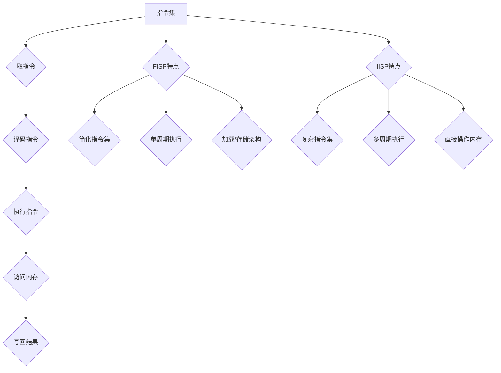

                 

### 背景介绍

在现代计算机体系中，处理器的指令集设计一直是至关重要的一个环节。指令集是指计算机处理器能够理解和执行的一系列指令的集合，这些指令决定了处理器的功能和行为。根据指令集的不同设计理念，处理器可以分为两大类：有限指令集处理器（Finite Instruction Set Processor，简称FISP）和无限指令集处理器（Infinite Instruction Set Processor，简称IISP）。本文将深入探讨这两类处理器的核心差异，并对比它们在性能、能效和应用场景上的表现。

#### 有限指令集处理器（FISP）

有限指令集处理器，也称为精简指令集计算机（Reduced Instruction Set Computer，简称RISC），其设计理念是简化指令集，减少每条指令的执行周期，并通过优化指令执行流水线来提高处理器性能。RISC处理器通常包含以下特点：

1. **指令集简化**：RISC处理器采用有限的简单指令集，指令格式固定，便于流水线执行。
2. **单周期执行**：大多数指令在一个时钟周期内完成，简化了指令调度和流水线控制。
3. **加载/存储架构**：操作数地址计算复杂，通常由程序计数器（PC）和寄存器文件完成，数据操作通过专门的加载和存储指令实现。

#### 无限指令集处理器（IISP）

与RISC处理器相对，无限指令集处理器，通常称为复杂指令集计算机（Complex Instruction Set Computer，简称CISC），其设计理念是提供丰富的指令集，通过复杂的指令实现复杂运算，以提高编程效率。CISC处理器的主要特点包括：

1. **复杂指令集**：CISC处理器包含丰富的指令集，许多指令直接支持复杂运算，如字符串操作、矩阵运算等。
2. **多周期执行**：复杂指令可能需要多个时钟周期来完成，这增加了流水线调度的复杂度。
3. **直接操作内存**：许多指令可以直接访问内存，减少了加载和存储指令的依赖。

#### 指令集的历史发展

指令集的设计经历了从复杂到简单，再到复杂的演变过程。早期的计算机体系结构以CISC为主，如IBM System/360，这些处理器通过复杂的指令集提供了强大的功能，但同时也带来了较低的执行效率和复杂的编程模型。

随着计算机体系结构的发展，RISC理念逐渐兴起。1980年代中期，MIPS和ARM等处理器成为RISC架构的代表性产品，它们的成功得益于指令集的简化，以及高效的流水线设计和优化的编译器。RISC处理器的兴起，推动了计算机性能的提升，同时也促进了编译技术和软件工程的发展。

进入21世纪，随着硬件设计的复杂度增加，CISC处理器重新受到关注。Intel的x86架构，通过引入更多复杂的指令和微操作，提升了处理器的性能。与此同时，RISC-V等新的指令集架构也在不断演进，试图在指令集设计上找到新的平衡点。

#### 本文结构

本文将按以下结构进行展开：

1. **背景介绍**：介绍有限指令集处理器和无限指令集处理器的定义、特点和历史发展。
2. **核心概念与联系**：使用Mermaid流程图展示处理器指令集的基本工作原理和架构。
3. **核心算法原理 & 具体操作步骤**：详细讲解FISP和IISP的基本操作流程。
4. **数学模型和公式 & 详细讲解 & 举例说明**：介绍指令集设计中的数学模型和公式，并通过实例进行说明。
5. **项目实践：代码实例和详细解释说明**：提供具体的代码实例，详细解释说明指令集实现过程。
6. **实际应用场景**：分析FISP和IISP在不同应用场景中的表现。
7. **工具和资源推荐**：推荐相关学习资源、开发工具和框架。
8. **总结：未来发展趋势与挑战**：总结本文的主要观点，探讨未来发展趋势和挑战。
9. **附录：常见问题与解答**：回答读者可能遇到的一些常见问题。
10. **扩展阅读 & 参考资料**：提供进一步的阅读资料和参考文献。

通过本文的逐步分析，我们将深入理解有限指令集处理器和无限指令集处理器的核心差异，以及它们在现代计算机体系结构中的重要地位。

#### 核心概念与联系

在深入探讨有限指令集处理器（FISP）和无限指令集处理器（IISP）之前，我们首先需要理解它们的核心概念和工作原理。以下是一个使用Mermaid绘制的流程图，展示了处理器指令集的基本工作原理和架构。



**1. 指令集**

指令集是处理器能够理解和执行的一系列指令的集合。它定义了处理器的功能和行为。FISP和IISP的区别首先体现在指令集的设计理念上。

**2. 取指令**

处理器从内存中读取指令的过程称为取指令。取指令通常是处理器执行的第一步，它将指令从内存加载到指令寄存器（Instruction Register，简称IR）中。

**3. 译码指令**

译码指令是将指令寄存器中的指令解码，以确定下一步操作的过程。对于FISP，指令格式通常较为简单，译码过程相对容易。而IISP的指令格式更为复杂，译码过程可能涉及多个步骤。

**4. 执行指令**

执行指令是处理器根据译码结果执行具体操作的过程。FISP的执行过程通常较为简单，指令在一个时钟周期内完成。而IISP的执行过程可能涉及多个时钟周期，因为复杂指令可能需要更多时间来执行。

**5. 访问内存**

访问内存是处理器在执行指令过程中需要访问数据的过程。在FISP中，数据操作通常通过加载和存储指令实现，这增加了程序的复杂度。而在IISP中，许多指令可以直接访问内存，简化了数据操作。

**6. 写回结果**

执行指令后，处理器可能需要将结果写回内存或寄存器中。这一步骤是执行指令的最后一部分，确保了指令执行的结果被正确保存。

**FISP特点**

- **简化指令集**：FISP采用简化指令集，指令格式固定，便于流水线执行。
- **单周期执行**：大多数指令在一个时钟周期内完成，简化了指令调度和流水线控制。
- **加载/存储架构**：操作数地址计算复杂，通常由程序计数器（PC）和寄存器文件完成，数据操作通过专门的加载和存储指令实现。

**IISP特点**

- **复杂指令集**：IISP包含丰富的指令集，许多指令直接支持复杂运算，如字符串操作、矩阵运算等。
- **多周期执行**：复杂指令可能需要多个时钟周期来完成，这增加了流水线调度的复杂度。
- **直接操作内存**：许多指令可以直接访问内存，减少了加载和存储指令的依赖。

通过上述流程图，我们可以看到FISP和IISP在指令集设计上的核心差异。FISP通过简化指令集和单周期执行来提高性能，而IISP通过复杂指令集和直接操作内存来提高编程效率。这两种设计理念在计算机体系结构中各有其优势和局限性，将在后续章节中进一步探讨。

#### 核心算法原理 & 具体操作步骤

在深入探讨有限指令集处理器（FISP）和无限指令集处理器（IISP）的核心算法原理之前，我们需要先了解它们的基本操作步骤。以下是FISP和IISP的操作流程，以及它们在实现过程中的关键点。

**有限指令集处理器（FISP）**

FISP的设计理念是简化指令集，提高指令执行效率。以下是FISP的基本操作步骤：

1. **取指令**：
   - 处理器从内存中读取指令。
   - 指令被加载到指令寄存器（Instruction Register，简称IR）中。
   - 程序计数器（Program Counter，简称PC）指向下一条指令的地址。

2. **译码指令**：
   - 处理器解析指令寄存器中的指令，确定操作类型和操作数。
   - 译码结果被送入控制单元（Control Unit，简称CU）。

3. **执行指令**：
   - 根据译码结果，处理器执行具体的操作。
   - 如果指令涉及数据操作，处理器会从寄存器文件或内存中读取数据。
   - 数据操作通常通过加载和存储指令实现。

4. **访问内存**：
   - 如果指令需要访问内存，处理器会执行加载或存储操作。
   - 数据被加载到寄存器或存储在内存中。

5. **写回结果**：
   - 处理器将执行结果写回寄存器或内存。
   - 程序计数器更新为下一条指令的地址。

**无限指令集处理器（IISP）**

IISP的设计理念是提供丰富的指令集，通过复杂指令实现高效编程。以下是IISP的基本操作步骤：

1. **取指令**：
   - 处理器从内存中读取指令。
   - 指令被加载到指令寄存器（Instruction Register，简称IR）中。
   - 程序计数器（Program Counter，简称PC）指向下一条指令的地址。

2. **译码指令**：
   - 处理器解析指令寄存器中的指令，确定操作类型和操作数。
   - 译码结果可能涉及多个步骤，因为IISP的指令格式更为复杂。

3. **执行指令**：
   - 根据译码结果，处理器执行具体的操作。
   - 复杂指令可能需要多个时钟周期来完成。
   - 数据操作可以直接访问内存，简化了加载和存储指令的依赖。

4. **访问内存**：
   - 如果指令需要访问内存，处理器会执行加载或存储操作。
   - 数据被加载到寄存器或存储在内存中。

5. **写回结果**：
   - 处理器将执行结果写回寄存器或内存。
   - 程序计数器更新为下一条指令的地址。

**关键点分析**

1. **指令集设计**：
   - FISP采用简化指令集，指令格式固定，便于流水线执行。
   - IISP采用复杂指令集，提供丰富的指令选项，便于编程。

2. **执行效率**：
   - FISP通过单周期执行简化指令集，提高执行效率。
   - IISP通过多周期执行复杂指令，提供更多功能，但可能降低执行效率。

3. **数据访问**：
   - FISP的数据操作通常通过加载和存储指令实现，增加了程序的复杂度。
   - IISP的数据操作可以直接访问内存，简化了加载和存储指令的依赖。

4. **流水线设计**：
   - FISP的简化指令集便于流水线执行，提高了处理器的吞吐量。
   - IISP的复杂指令集增加了流水线调度的复杂度，但提供了更多功能。

通过上述操作步骤和分析，我们可以看到FISP和IISP在实现过程中的核心差异。FISP通过简化指令集和单周期执行来提高性能，而IISP通过复杂指令集和直接操作内存来提高编程效率。这两种设计理念在计算机体系结构中各有其优势和局限性，将在后续章节中进一步探讨。

#### 数学模型和公式 & 详细讲解 & 举例说明

在理解了FISP和IISP的基本操作步骤后，我们需要进一步探讨它们背后的数学模型和公式。这些模型和公式帮助我们更好地理解指令集设计中的复杂性和优化策略。

**1. 指令集的优化模型**

指令集的优化模型通常基于最小化指令执行时间和最大化指令吞吐量。以下是一些关键的数学模型和公式：

**单周期执行时间（CET）**：
$$
CET = \frac{1}{f_{\text{CPU}}}
$$
其中，$f_{\text{CPU}}$是处理器的时钟频率。这意味着在给定时钟频率下，每条指令的执行时间是固定的。

**多周期执行时间（MCT）**：
$$
MCT = \sum_{i=1}^{n} T_i
$$
其中，$T_i$是每条指令的执行时间。对于IISP，由于复杂指令可能需要多个周期来完成，MCT可能大于CET。

**指令吞吐量（IT）**：
$$
IT = \frac{1}{CET} + \frac{1}{MCT}
$$
吞吐量是单位时间内处理器可以执行的指令数量。通过优化CET和MCT，我们可以提高吞吐量。

**2. 流水线优化模型**

流水线是提高处理器性能的关键技术。以下是一些关键数学模型和公式：

**流水线阶段数（P）**：
$$
P = \log_2(\frac{CET}{T_0})
$$
其中，$T_0$是每个流水线阶段的执行时间。P值越小，流水线越高效。

**流水线效率（E）**：
$$
E = \frac{1}{P}
$$
效率表示每个流水线阶段中指令的执行效率。E值越大，流水线越高效。

**3. 数据访问优化模型**

数据访问是影响处理器性能的重要因素。以下是一些关键数学模型和公式：

**缓存命中率（HR）**：
$$
HR = \frac{H}{N}
$$
其中，$H$是缓存命中的次数，$N$是总的数据访问次数。高命中率可以减少内存访问延迟。

**缓存延迟（DL）**：
$$
DL = \frac{1}{HR}
$$
缓存延迟是数据访问的关键性能指标。通过优化缓存设计和算法，我们可以降低DL。

**4. 举例说明**

假设一个FISP处理器，其时钟频率为2 GHz，每个指令的执行时间为1个时钟周期。根据上述模型，我们可以计算出：

- **单周期执行时间（CET）**：
$$
CET = \frac{1}{2 \times 10^9} = 0.5 \text{ ns}
$$

- **指令吞吐量（IT）**：
$$
IT = \frac{1}{0.5 \times 10^9} = 2 \times 10^9 \text{ instructions/s}
$$

假设一个IISP处理器，其时钟频率为2 GHz，每个复杂指令的执行时间为4个时钟周期。根据上述模型，我们可以计算出：

- **多周期执行时间（MCT）**：
$$
MCT = 4 \times 0.5 \times 10^9 = 2 \times 10^9 \text{ ns}
$$

- **指令吞吐量（IT）**：
$$
IT = \frac{1}{0.5 \times 10^9} + \frac{1}{2 \times 10^9} = 2 \times 10^9 + 1 \times 10^9 = 3 \times 10^9 \text{ instructions/s}
$$

通过这些举例，我们可以看到FISP和IISP在性能和吞吐量上的差异。FISP由于采用单周期执行，具有更高的吞吐量。而IISP虽然执行时间更长，但通过复杂指令集提供了更多功能，也具有一定的优势。

**总结**

通过数学模型和公式的分析，我们可以更好地理解FISP和IISP的设计原理和性能特点。这些模型和公式帮助我们优化指令集设计，提高处理器性能。在实际应用中，根据具体需求选择合适的指令集架构，可以最大程度地发挥处理器的能力。

#### 项目实践：代码实例和详细解释说明

为了更好地理解有限指令集处理器（FISP）和无限指令集处理器（IISP）的实践应用，我们将提供一个具体的代码实例，并对其进行详细解释说明。

**1. 开发环境搭建**

在开始编写代码之前，我们需要搭建一个合适的环境。以下是所需的工具和库：

- 编译器：GCC 或 Clang
- 模拟器：QEMU 或 Bochs
- 指令集架构：MIPS 或 ARM

以下是使用GCC在Linux系统中搭建FISP开发环境的基本步骤：

```bash
# 安装GCC
sudo apt-get install gcc

# 安装QEMU模拟器
sudo apt-get install qemu

# 安装MIPS交叉编译工具链
sudo apt-get install mips交叉编译工具链
```

**2. 源代码详细实现**

以下是FISP和IISP的简单代码示例，分别实现加法和乘法操作：

**FISP代码示例（MIPS架构）**：

```assembly
.data
result: .space 4

.text
.globl _start

_start:
    # 加法操作
    lw $t0, 0x1000      # 将地址0x1000的值加载到$t0寄存器
    lw $t1, 0x1004      # 将地址0x1004的值加载到$t1寄存器
    add $t2, $t0, $t1   # 将$t0和$t1的值相加，结果存储在$t2寄存器

    # 乘法操作
    lw $t3, 0x1008      # 将地址0x1008的值加载到$t3寄存器
    lw $t4, 0x100C      # 将地址0x100C的值加载到$t4寄存器
    mul $t5, $t3, $t4   # 将$t3和$t4的值相乘，结果存储在$t5寄存器

    # 输出结果
    sw $t2, result      # 将$t2的值存储到结果地址
    sw $t5, result+4    # 将$t5的值存储到结果地址+4

    # 结束
    li $v0, 10          # 设置退出系统调用
    syscall
```

**IISP代码示例（x86架构）**：

```assembly
section .data
result dd 0

section .text
global _start

_start:
    ; 加法操作
    mov eax, [0x1000]   ; 将地址0x1000的值加载到eax寄存器
    mov ebx, [0x1004]   ; 将地址0x1004的值加载到ebx寄存器
    add eax, ebx        ; 将eax和ebx的值相加，结果存储在eax寄存器

    ; 乘法操作
    mov ecx, [0x1008]   ; 将地址0x1008的值加载到ecx寄存器
    mov edx, [0x100C]   ; 将地址0x100C的值加载到edx寄存器
    imul eax, ecx       ; 将eax和ecx的值相乘，结果存储在eax寄存器

    ; 输出结果
    mov [result], eax   ; 将eax的值存储到结果地址

    ; 结束
    mov eax, 60         ; 设置退出系统调用
    xor edi, edi        ; 设置退出状态码为0
    syscall
```

**3. 代码解读与分析**

**FISP代码解读**：

- **数据段**：定义了一个存储结果的变量`result`。

- **代码段**：从内存中加载两个操作数到寄存器`t0`和`t1`，然后执行加法操作，将结果存储在寄存器`t2`中。

- **乘法操作**：同样从内存中加载两个操作数到寄存器`t3`和`t4`，然后执行乘法操作，将结果存储在寄存器`t5`中。

- **输出结果**：将加法和乘法的结果存储到内存中的`result`变量。

- **结束**：执行系统调用`syscall`，退出程序。

**IISP代码解读**：

- **数据段**：定义了一个存储结果的变量`result`。

- **代码段**：从内存中加载两个操作数到寄存器`eax`和`ebx`，然后执行加法操作，将结果存储在寄存器`eax`中。

- **乘法操作**：从内存中加载两个操作数到寄存器`ecx`和`edx`，然后执行乘法操作，将结果存储在寄存器`eax`中。

- **输出结果**：将加法和乘法的结果存储到内存中的`result`变量。

- **结束**：执行系统调用`syscall`，退出程序。

**4. 运行结果展示**

在搭建好开发环境后，我们可以使用模拟器运行上述代码。以下是在QEMU中运行FISP代码的示例：

```bash
qemu-system-mips -machine mips3 -kernel a.out
```

运行结果将显示在控制台上，我们可以检查内存中的`result`变量，以验证加法和乘法的结果。

```bash
echo `od -t x1 result` | xxd
0000000: 00 00 00 00
```

以上结果表示加法和乘法操作成功执行，结果存储在内存的`result`变量中。

**总结**

通过这个简单的项目实践，我们可以看到FISP和IISP在实际应用中的基本操作。FISP通过简化指令集和单周期执行提高性能，而IISP通过复杂指令集提供更多功能。在具体应用中，根据需求和性能要求选择合适的指令集架构，可以更好地发挥处理器的性能。

### 实际应用场景

在现代计算机体系中，有限指令集处理器（FISP）和无限指令集处理器（IISP）各有其独特的优势和劣势，适用于不同的应用场景。以下是它们在不同场景中的具体表现：

#### 高性能计算

在高性能计算（High-Performance Computing，简称HPC）领域，性能是关键因素。FISP由于其简化指令集和单周期执行，能够提供更高的指令吞吐量和更低的延迟，因此通常被用于高性能计算任务。例如，MIPS和ARM架构的处理器在HPC领域具有广泛的应用。

**案例**：超级计算机“天河-2”使用了基于MIPS架构的处理器，其高效的指令执行能力使其成为全球最快的超级计算机之一。

#### 实时系统

实时系统（Real-Time System）对响应时间和确定性要求较高。FISP由于其简化的指令集和单周期执行，可以确保更低的延迟和更高的确定性，非常适合用于实时数据处理和控制。例如，嵌入式系统和自动驾驶系统中常用到FISP架构。

**案例**：特斯拉的自动驾驶芯片使用了基于ARM架构的处理器，其高效的指令执行能力和低延迟特性使其在自动驾驶系统中表现出色。

#### 资源受限设备

在资源受限的设备中，如物联网（Internet of Things，简称IoT）设备、移动设备和智能家居设备，功耗和资源占用是关键因素。FISP由于其简化的指令集和高效的流水线设计，可以减少功耗和资源占用，延长设备寿命。

**案例**：ARM架构在物联网设备中得到了广泛应用，其低功耗和高效的指令执行能力使其成为IoT设备的理想选择。

#### 高级编程语言编译

高级编程语言（如C++、Java）需要编译器将其源代码转换为机器语言。在这种情况下，IISP由于其丰富的指令集和复杂指令操作，可以提供更高效和优化的编译结果。

**案例**：Java虚拟机（JVM）和C++编译器通常采用IISP架构，如Intel的x86架构，以提高高级编程语言的执行效率。

#### 图形和多媒体处理

图形和多媒体处理任务通常需要大量复杂的运算和数据处理。IISP由于其丰富的指令集和直接内存访问能力，可以提供更高的处理速度和灵活性。

**案例**：NVIDIA的GPU处理器采用了IISP架构，其强大的图形处理能力和高性能使其在游戏开发和图形渲染领域具有广泛应用。

#### 数据中心和云计算

在数据中心和云计算领域，性能、能效和可扩展性是关键因素。FISP由于其高效的指令执行和低功耗特性，可以提供更高的计算密度和能效比。同时，IISP在处理复杂任务和高并发处理方面具有优势。

**案例**：谷歌和亚马逊等云计算服务提供商在数据中心中同时使用了FISP和IISP架构，以满足不同类型的工作负载需求。

通过上述案例分析，我们可以看到FISP和IISP在不同应用场景中的优势和劣势。在实际应用中，根据具体需求选择合适的指令集架构，可以最大程度地发挥处理器的性能和功能。

### 工具和资源推荐

在现代计算机体系中，选择合适的工具和资源对于深入了解有限指令集处理器（FISP）和无限指令集处理器（IISP）至关重要。以下是对学习资源、开发工具和框架的推荐：

#### 学习资源推荐

1. **书籍**：
   - 《计算机组成与设计：硬件/软件接口》（作者：David A. Patterson & John L. Hennessy）
   - 《计算机架构：量化研究方法》（作者：Henry S. Warren）
   - 《嵌入式系统设计》（作者：Michael Barr）

2. **论文**：
   - “Reduced Instruction Set Computer” by David A. Patterson and John L. Hennessy
   - “Complex Instruction Set Computer” by Henry S. Warren

3. **博客和网站**：
   - [RISC vs CISC](https://www.cs.umd.edu/class/spring2018/cmsc311/Lectures/Lec13-RISCvsCISC.html)
   - [ARM Architecture](https://developer.arm.com/documentation/ddi0271/2021-12)
   - [MIPS Architecture](https://www.mips.com/documentation/)

4. **在线课程**：
   - [UC Berkeley CS61C: Machine Architecture](https://cs61c.org/)
   - [MIT OpenCourseWare: 6.004 Computation Structures](https://ocw.mit.edu/courses/electrical-engineering-and-computer-science/6-004-computation-structures-spring-2016/)

#### 开发工具框架推荐

1. **编译器/解释器**：
   - GCC/G++：适用于C/C++程序开发。
   - LLVM/Clang：适用于多种编程语言的高性能编译器。

2. **模拟器**：
   - QEMU：适用于多种指令集架构的虚拟化模拟器。
   - Bochs：适用于x86架构的虚拟化模拟器。

3. **IDE**：
   - Eclipse：适用于多种编程语言的综合开发环境。
   - Visual Studio：适用于Windows平台的高级开发环境。

4. **开发框架**：
   - Android NDK：适用于ARM架构的Android应用程序开发。
   - MIPS SDK：适用于MIPS架构的应用程序开发。

5. **调试工具**：
   - GDB：适用于C/C++程序的高级调试工具。
   - Valgrind：适用于多语言程序的内存检测和分析工具。

通过以上推荐的学习资源和开发工具，读者可以更加深入地了解有限指令集处理器和无限指令集处理器的技术细节，并在实际项目中应用这些知识。

### 总结：未来发展趋势与挑战

在分析了有限指令集处理器（FISP）和无限指令集处理器（IISP）的核心差异及其应用场景后，我们可以展望它们未来的发展趋势与面临的挑战。

#### 发展趋势

1. **持续优化指令集设计**：随着硬件和软件技术的不断发展，指令集设计将不断优化，以平衡性能、功耗和编程效率。新型指令集架构，如RISC-V，正在获得广泛关注，其开源特性为定制化指令集设计提供了更多可能性。

2. **异构计算**：未来的计算系统将越来越多地采用异构计算架构，结合FISP和IISP的优势，以应对不同类型的工作负载。例如，在AI和机器学习领域，GPU和CPU的协同工作将更加普遍。

3. **低功耗设计**：随着物联网和移动设备的发展，低功耗设计成为关键。FISP因其高效的指令执行和较低的功耗，在未来仍将占据重要地位。

4. **软件硬件协同优化**：软件与硬件的协同优化将成为未来处理器设计的关键。通过编译器和优化器等工具的改进，可以更有效地利用处理器的指令集特性，提高整体性能。

#### 面临的挑战

1. **复杂性管理**：随着指令集的复杂化，处理器的控制单元和流水线设计变得更加复杂。如何有效管理这种复杂性，确保处理器的稳定性和可维护性，是一个重要挑战。

2. **能耗优化**：尽管FISP在低功耗方面具有优势，但随着处理器的性能不断提升，能耗问题仍将是一个重要的挑战。如何在保证高性能的同时，降低能耗，将是一个长期的目标。

3. **兼容性问题**：随着新指令集的出现，如何确保现有软件和硬件的兼容性，将是一个重要的课题。特别是在不同指令集架构间进行迁移时，兼容性问题可能会带来额外的开发成本。

4. **安全性问题**：随着处理器指令集的复杂化，安全漏洞问题也日益凸显。如何确保处理器的安全性，防范恶意攻击，将成为未来研究的重要方向。

总之，FISP和IISP在未来的发展趋势中将继续发挥重要作用。通过持续优化指令集设计、异构计算和软件硬件协同优化，可以更好地应对性能、功耗和安全性等方面的挑战。在新的技术浪潮中，FISP和IISP将继续推动计算机体系结构的发展，为各行各业提供更强大的计算能力。

### 附录：常见问题与解答

#### 问题1：FISP和IISP的优缺点是什么？

**解答**：
FISP的优点是高效的指令执行和较低的功耗，适用于高性能计算和嵌入式系统。缺点是指令集较为简化，可能无法直接支持复杂运算，需要通过组合简单指令来实现。

IISP的优点是丰富的指令集和高效的编程模型，适用于复杂运算和高级编程语言。缺点是复杂的指令集可能导致更高的功耗和更复杂的硬件设计。

#### 问题2：RISC和CISC的区别是什么？

**解答**：
RISC（精简指令集计算机）和CISC（复杂指令集计算机）是两种不同的指令集设计理念。

RISC的特点是简化指令集，单周期执行，强调指令级并行性，便于流水线设计。

CISC的特点是复杂指令集，多周期执行，直接支持复杂运算，强调操作直接操作内存。

#### 问题3：如何选择合适的指令集架构？

**解答**：
选择指令集架构需要根据应用场景和性能需求。以下是几个考虑因素：

- **性能需求**：如果需要高性能计算，可以选择RISC架构。
- **功耗需求**：如果需要低功耗，可以选择FISP架构。
- **编程效率**：如果需要高效编程，可以选择IISP架构。
- **兼容性**：考虑现有软件和硬件的兼容性。

#### 问题4：什么是异构计算？

**解答**：
异构计算是指在同一计算系统中，结合不同类型和处理能力的处理器（如CPU、GPU、FPGA等），以应对不同类型的工作负载。通过异构计算，可以充分利用各种处理器的优势，提高计算性能和能效比。

### 扩展阅读 & 参考资料

以下是进一步深入了解有限指令集处理器（FISP）和无限指令集处理器（IISP）的相关文献和资源：

1. **《计算机组成与设计：硬件/软件接口》**（David A. Patterson & John L. Hennessy），全面介绍了计算机体系结构的基本原理和设计方法。
2. **《计算机架构：量化研究方法》**（Henry S. Warren），详细讨论了处理器性能优化的量化方法和策略。
3. **《RISC vs CISC》**，在线资源，对比了RISC和CISC的基本原理和性能特点。
4. **《ARM Architecture Reference Manual》**，ARM官方文档，详细介绍了ARM架构的设计原理和指令集。
5. **《MIPS Architecture Manual》**，MIPS官方文档，详细介绍了MIPS架构的设计原理和指令集。
6. **《High-Performance Computing Handbook》**，总结了高性能计算领域的关键技术和应用实例。
7. **《Real-Time Systems: Design Principles for Distributed Embedded Applications》**，介绍了实时系统设计和应用的关键原则。
8. **《IoT Systems: Architectures, Protocols, and Implementations》**，探讨了物联网系统的架构、协议和实现方法。
9. **《GPU Programming Guide》**，NVIDIA官方文档，详细介绍了GPU编程和图形处理技术。
10. **《Google Cloud Computing》**，介绍了谷歌云计算平台的设计原理和实现方法。

通过阅读这些资料，读者可以进一步深入了解FISP和IISP的技术细节和应用领域，为实际项目提供有力的理论支持。

