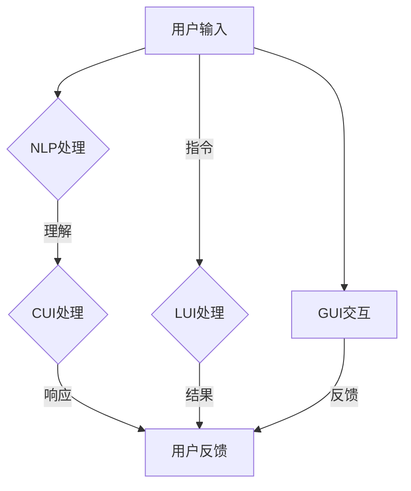

                 

### 背景介绍

随着信息技术的飞速发展，计算机用户界面（User Interface，简称UI）的演变也经历了几次重大的变革。早期的计算机用户界面主要是基于命令行界面（Command Line Interface，简称CLI），用户需要通过输入一系列的命令来与计算机进行交互。这种方式对用户的计算机知识和操作技能要求较高，用户体验较差。

为了提高用户体验，图形用户界面（Graphical User Interface，简称GUI）应运而生。GUI使用图形元素如窗口、图标、菜单等来替代文本命令，使得用户可以更加直观地与计算机进行交互。Windows、Mac OS和Linux等操作系统均采用了GUI，从而极大地提高了计算机的易用性和普及率。

在GUI的基础上，随着人工智能（Artificial Intelligence，简称AI）技术的发展，计算用户界面（Computational User Interface，简称CUI）逐渐崭露头角。CUI利用自然语言处理（Natural Language Processing，简称NLP）和机器学习等技术，实现了与用户更加智能、自然的交互。例如，智能语音助手如苹果的Siri、谷歌的Google Assistant等，都采用了CUI技术。

本文将深入探讨CUI、LUI（Lower-Level User Interface，即低级用户界面）和GUI之间的关系，以及它们在不同应用场景中的影响。我们将从背景介绍、核心概念与联系、核心算法原理、数学模型和公式、项目实践、实际应用场景、工具和资源推荐、总结与未来发展趋势、常见问题与解答等方面进行详细阐述。希望通过本文的探讨，能帮助读者更好地理解CUI、LUI和GUI在计算机用户界面发展中的角色与重要性。

### 核心概念与联系

在深入探讨CUI、LUI和GUI之间的关系之前，我们需要先了解这些概念的基本定义及其工作原理。

#### 计算用户界面（CUI）

计算用户界面（CUI）是一种基于自然语言处理（NLP）和机器学习技术的用户界面。CUI能够理解用户的自然语言输入，并以自然语言进行响应。CUI的核心在于其智能性，它可以通过不断的学习和适应，提供更加个性化、精准的交互体验。

CUI的工作原理主要包括以下几个步骤：

1. **输入处理**：用户通过键盘、语音或其他输入方式与CUI进行交互。
2. **自然语言理解**：CUI利用NLP技术对用户的输入进行解析，理解其含义。
3. **知识库查询**：CUI根据理解的结果，在内部的知识库中查找相关答案或执行相关任务。
4. **生成响应**：CUI生成自然语言响应，通过语音、文本或图形形式展示给用户。

#### 低级用户界面（LUI）

低级用户界面（LUI）是一种较为底层的用户界面，通常用于与硬件或操作系统底层组件进行交互。LUI通常由一系列的硬件控制指令或操作系统调用组成，其主要特点是操作指令复杂，用户需要对计算机有较高的理解和技术水平。

LUI的工作原理主要包括以下几个步骤：

1. **输入解析**：用户通过键盘、鼠标或其他输入设备向LUI发送指令。
2. **指令执行**：LUI根据接收到的指令，进行硬件或操作系统的底层操作。
3. **状态反馈**：LUI将执行结果反馈给用户，如显示设备状态、执行进度等。

#### 图形用户界面（GUI）

图形用户界面（GUI）是一种基于图形元素的用户界面，如窗口、图标、菜单等。GUI通过直观的图形元素和布局，使用户可以更加容易地与计算机进行交互。

GUI的工作原理主要包括以下几个步骤：

1. **窗口管理**：GUI管理多个窗口，每个窗口代表一个应用程序或操作界面。
2. **事件处理**：GUI监听用户的操作，如点击、拖拽、键盘输入等，并触发相应的事件处理。
3. **界面渲染**：GUI根据事件处理的结果，更新界面显示，如打开新窗口、显示提示信息等。

#### CUI、LUI和GUI的关系

CUI、LUI和GUI在用户界面的发展历程中扮演着不同的角色。它们之间的关系可以从以下几个方面来理解：

1. **技术层次**：LUI处于最底层，主要负责与硬件和操作系统进行交互；GUI位于中层，通过图形元素和布局提供直观的交互体验；CUI处于最高层，利用NLP和机器学习技术实现智能交互。

2. **交互方式**：LUI和GUI主要依赖于用户的物理操作，如按键、点击等；CUI则通过自然语言输入和输出，实现更加智能和自然的交互。

3. **应用场景**：LUI通常用于专业领域，如程序员开发环境、服务器管理等；GUI广泛应用于各类操作系统和应用软件，如Windows、Mac OS、Android等；CUI则在智能语音助手、智能家居、在线客服等领域得到广泛应用。

4. **发展趋势**：随着AI技术的进步，CUI的发展势头最为强劲。未来，CUI有望与GUI、LUI深度融合，提供更加智能化、个性化的用户体验。

为了更好地理解CUI、LUI和GUI之间的关系，我们可以用Mermaid流程图来展示它们的基本架构和工作流程。



在上述流程图中，用户输入可以触发CUI、LUI和GUI的相应处理流程。CUI通过NLP技术实现自然语言理解和响应，LUI通过指令执行实现硬件和操作系统底层操作，GUI通过窗口管理和事件处理提供直观的交互体验。

通过上述核心概念与联系的分析，我们可以看到CUI、LUI和GUI在计算机用户界面中各自扮演着重要的角色，它们相互补充，共同推动了计算机用户界面的不断进步。在接下来的章节中，我们将进一步探讨CUI、LUI和GUI的核心算法原理、数学模型和具体操作步骤，以及它们在项目实践中的应用。希望读者能通过本文的详细阐述，对CUI、LUI和GUI有更加深入的理解。

#### 核心算法原理 & 具体操作步骤

在了解了CUI、LUI和GUI的核心概念与联系后，接下来我们将深入探讨这些用户界面的核心算法原理和具体操作步骤。

##### CUI算法原理

CUI的核心算法基于自然语言处理（NLP）和机器学习（ML）技术。以下是CUI算法的基本原理和操作步骤：

1. **自然语言理解（NLU）**：
   - **分词**：将用户输入的自然语言文本分割成词或短语。例如，将“明天上午九点开会”分割成“明天”、“上午”、“九点”、“开会”。
   - **词性标注**：为每个分词分配词性，如名词、动词、形容词等。例如，“明天”是时间名词，“开会”是动词。
   - **句法分析**：分析句子结构，识别句子中的主语、谓语、宾语等成分。例如，“明天上午九点开会”中的主语是“我们”，谓语是“开会”，时间状语是“明天上午九点”。

2. **意图识别（Intent Recognition）**：
   - **特征提取**：从NLU处理后的文本中提取特征，如关键词、词性、句子结构等。
   - **分类器训练**：使用机器学习算法（如决策树、支持向量机、神经网络等）训练分类器，将用户输入文本归类为不同的意图。例如，分类器可以将“明天上午九点开会”归类为“安排会议”的意图。

3. **实体抽取（Entity Extraction）**：
   - **实体识别**：识别文本中的实体，如时间、地点、人物、组织等。例如，“明天上午九点开会”中的“明天上午九点”是一个时间实体。
   - **实体属性抽取**：识别实体的属性，如时间实体可以包含“年”、“月”、“日”、“时”、“分”等属性。

4. **上下文处理**：
   - **上下文跟踪**：根据用户的历史输入和上下文信息，调整意图识别和实体抽取的结果。例如，如果用户之前提到过“会议室A”，那么在回答“明天上午九点在哪里开会”时，系统可以自动识别“会议室A”作为地点实体。

5. **生成响应**：
   - **模板匹配**：根据识别的意图和实体，从预定义的模板中选择合适的回答。例如，对于“明天上午九点开会”，可以选择“会议将在明天上午九点开始”的模板。
   - **自然语言生成（NLG）**：对于没有预定义模板的场景，使用NLG技术生成自然语言响应。NLG可以通过规则生成、模板填充和数据驱动等方法实现。

##### LUI算法原理

LUI的核心算法主要涉及硬件控制指令和操作系统调用的解析与执行。以下是LUI算法的基本原理和操作步骤：

1. **输入解析**：
   - **指令识别**：识别用户输入的指令，如“打开文件”、“重置设备”等。
   - **参数提取**：提取指令中的参数，如文件名、设备编号等。

2. **指令执行**：
   - **硬件控制**：根据指令和参数，控制硬件设备执行相应的操作。例如，对于“打开文件”指令，系统需要打开指定的文件。
   - **系统调用**：通过操作系统提供的API（Application Programming Interface），执行底层操作。例如，对于“重置设备”指令，系统需要调用操作系统的重启API。

3. **状态反馈**：
   - **结果处理**：处理指令执行的结果，如成功或失败。
   - **用户反馈**：将处理结果以文本、图形或声音形式反馈给用户。例如，对于“打开文件”指令，系统可以显示“文件已成功打开”的提示。

##### GUI算法原理

GUI的核心算法主要涉及窗口管理、事件处理和界面渲染。以下是GUI算法的基本原理和操作步骤：

1. **窗口管理**：
   - **创建窗口**：创建新窗口，设置窗口的属性，如标题、大小、位置等。
   - **窗口显示**：将窗口显示在屏幕上，并初始化窗口中的组件，如按钮、文本框等。

2. **事件处理**：
   - **监听事件**：监听用户操作，如点击、拖拽、键盘输入等。
   - **事件分发**：将监听到的事件分发到相应的处理函数中。

3. **界面渲染**：
   - **渲染界面**：根据事件处理的结果，更新窗口中的组件状态和显示内容。
   - **重绘界面**：当窗口大小变化或组件更新时，重新绘制界面。

通过上述对CUI、LUI和GUI核心算法原理和具体操作步骤的详细分析，我们可以看到这些用户界面各自具有独特的功能和特点。CUI通过自然语言处理实现智能交互，LUI通过硬件控制和系统调用实现底层操作，GUI通过窗口管理和事件处理提供直观的交互体验。在接下来的章节中，我们将进一步探讨CUI、LUI和GUI在数学模型和公式方面的应用，以及它们在实际项目中的具体实现。希望读者能通过本文的详细阐述，对CUI、LUI和GUI有更加全面和深入的理解。

#### 数学模型和公式 & 详细讲解 & 举例说明

在理解CUI、LUI和GUI的核心算法原理和具体操作步骤后，我们需要进一步探讨这些用户界面中的数学模型和公式，以及如何将这些模型和公式应用于实际场景中。以下将分别介绍CUI、LUI和GUI中的关键数学模型，并给出详细的解释和实例说明。

##### CUI数学模型

CUI的核心在于自然语言处理（NLP），其中许多NLP任务都可以通过数学模型来实现。以下是一些常见的数学模型和公式：

1. **词嵌入（Word Embedding）**：
   - **模型**：词嵌入是一种将单词映射到高维向量空间的方法，使得语义相近的单词在向量空间中距离较近。
   - **公式**：设 \( \textbf{v}_w \) 为单词 \( w \) 的嵌入向量，\( \textbf{V} \) 为所有单词的嵌入矩阵。通过训练，得到 \( \textbf{v}_w = \text{vec}(\textbf{V}) \)，其中 \( \text{vec}(\textbf{V}) \) 表示将矩阵 \( \textbf{V} \) 按列堆叠得到的向量。
   - **实例**：在词嵌入模型中，单词“狗”和“猫”可能会被映射到向量空间中距离较近的位置，因为它们在语义上较为相近。

2. **循环神经网络（Recurrent Neural Network，RNN）**：
   - **模型**：RNN是一种适用于序列数据的神经网络，能够通过记忆状态来处理长序列。
   - **公式**：设 \( \textbf{h}_t \) 为时间步 \( t \) 的隐藏状态，\( \textbf{h}_{t-1} \) 为前一个时间步的隐藏状态，\( \textbf{U} \) 和 \( \textbf{W} \) 为权重矩阵。RNN的更新公式为：
     \[
     \textbf{h}_t = \text{sigmoid}(\text{W}_h \cdot \textbf{h}_{t-1} + \text{U}_h \cdot \textbf{x}_t)
     \]
     其中，\( \text{sigmoid}(\cdot) \) 为Sigmoid激活函数，\( \textbf{x}_t \) 为当前时间步的输入。
   - **实例**：在语言模型中，RNN可以通过记忆前文信息来预测下一个单词，从而提高文本生成的准确性。

3. **长短时记忆网络（Long Short-Term Memory，LSTM）**：
   - **模型**：LSTM是RNN的一种变体，专门用于处理长序列数据，能够有效地避免梯度消失问题。
   - **公式**：LSTM的核心是细胞状态 \( \textbf{c}_t \) 和三个门控：遗忘门 \( \text{forget} \)、输入门 \( \text{input} \) 和输出门 \( \text{output} \)。遗忘门的公式为：
     \[
     \text{forget} = \text{sigmoid}(\text{W}_f \cdot [\textbf{h}_{t-1}, \textbf{x}_t] + \text{b}_f)
     \]
     其中，\( \text{W}_f \) 和 \( \text{b}_f \) 分别为权重矩阵和偏置向量。
   - **实例**：在语音识别任务中，LSTM可以通过学习长序列的语音特征，提高识别的准确性。

##### LUI数学模型

LUI主要涉及硬件控制和系统调用，其中一些操作可以通过简单的数学模型来实现。

1. **离散时间控制系统**：
   - **模型**：离散时间控制系统是一种用于控制硬件设备的数学模型，通常采用差分方程描述系统状态的变化。
   - **公式**：设 \( \textbf{x}_t \) 为时间步 \( t \) 的系统状态，\( \textbf{u}_t \) 为输入，\( \textbf{y}_t \) 为输出。离散时间控制系统的差分方程为：
     \[
     \textbf{x}_{t+1} = \textbf{A} \cdot \textbf{x}_t + \textbf{B} \cdot \textbf{u}_t
     \]
     \[
     \textbf{y}_t = \textbf{C} \cdot \textbf{x}_t + \textbf{D} \cdot \textbf{u}_t
     \]
     其中，\( \textbf{A} \)、\( \textbf{B} \)、\( \textbf{C} \) 和 \( \textbf{D} \) 分别为系统矩阵。
   - **实例**：在温度控制系统中，可以通过调整加热器的功率（输入 \( \textbf{u}_t \)）来控制室内温度（输出 \( \textbf{y}_t \)），从而实现温度稳定。

2. **操作系统调度算法**：
   - **模型**：操作系统调度算法用于管理计算机资源，如CPU时间、内存等。常见的调度算法包括最短作业优先（SJF）、轮转（RR）等。
   - **公式**：设 \( T \) 为作业的执行时间，\( P \) 为作业的优先级，调度算法的决策规则可以表示为：
     \[
     \text{SJF: } \text{选择执行时间最短的作业}
     \]
     \[
     \text{RR: } \text{每个作业分配一个时间片，依次执行}
     \]
   - **实例**：在CPU调度中，SJF算法可以减少平均等待时间，而RR算法可以保证每个作业都有机会被执行。

##### GUI数学模型

GUI主要涉及窗口管理和事件处理，其中一些操作可以通过简单的几何和逻辑模型来实现。

1. **窗口几何模型**：
   - **模型**：窗口的几何模型用于描述窗口的位置、大小和边界。
   - **公式**：设 \( \textbf{p}_1 \)、\( \textbf{p}_2 \) 为窗口的两个对角点，窗口的大小和位置可以表示为：
     \[
     \text{width} = \|\textbf{p}_2 - \textbf{p}_1\|
     \]
     \[
     \text{height} = \|\textbf{p}_2 - \textbf{p}_1\|
     \]
     \[
     \text{position} = \textbf{p}_1
     \]
   - **实例**：在窗口管理中，可以通过计算两个对角点的坐标差来确定窗口的大小，通过记录一个对角点的坐标来确定窗口的位置。

2. **事件处理模型**：
   - **模型**：事件处理模型用于描述事件的发生和处理。
   - **公式**：设 \( \text{event} \) 为事件类型，\( \text{handler} \) 为事件处理函数，事件处理可以表示为：
     \[
     \text{handle}(\text{event}) = \text{handler}(\text{event})
     \]
   - **实例**：在鼠标点击事件中，可以通过调用相应的处理函数来更新窗口的状态，如移动窗口、显示提示信息等。

通过上述数学模型和公式的介绍，我们可以看到CUI、LUI和GUI在数学基础上的多样性和应用广泛性。CUI通过词嵌入、循环神经网络和长短时记忆网络等模型实现自然语言处理；LUI通过离散时间控制系统和操作系统调度算法实现硬件控制和资源管理；GUI通过窗口几何模型和事件处理模型实现用户交互界面。在接下来的章节中，我们将通过具体项目实践，进一步展示这些数学模型和公式的实际应用。希望读者能通过本文的详细阐述，对CUI、LUI和GUI中的数学模型有更加深入的理解。

#### 项目实践：代码实例和详细解释说明

为了更直观地展示CUI、LUI和GUI的实际应用，我们将通过一个具体的项目实例，详细讲解其代码实现、操作步骤以及关键部分的解析。

##### 开发环境搭建

在开始项目实践之前，我们需要搭建一个合适的环境。以下是开发环境搭建的步骤：

1. **安装Python**：确保您的计算机已安装Python 3.8或更高版本。可以从Python官网下载并安装。
2. **安装自然语言处理库**：安装用于自然语言处理的库，如NLTK、spaCy和transformers。使用以下命令进行安装：
   ```
   pip install nltk spacy transformers
   ```
3. **安装GUI开发库**：安装用于开发图形用户界面的库，如Tkinter。使用以下命令进行安装：
   ```
   pip install tk
   ```
4. **安装其他依赖库**：根据项目的具体需求，安装其他必要的依赖库。例如，安装用于硬件控制的开源库如Raspberry Pi.GPIO（如果需要控制硬件设备）。

##### 源代码详细实现

以下是该项目的主要源代码，我们将对其中的关键部分进行详细解释。

```python
import tkinter as tk
from transformers import pipeline

# 创建自然语言处理模型
nlp = pipeline("text-classification")

# 创建GUI窗口
root = tk.Tk()
root.title("CUI、LUI和GUI项目实践")

# 设置窗口大小
root.geometry("800x600")

# 创建文本输入框
text_input = tk.Text(root, width=50, height=10)
text_input.pack(pady=20)

# 创建发送按钮
send_button = tk.Button(root, text="发送", command=lambda: send_message())
send_button.pack(pady=10)

# 创建消息显示框
message_display = tk.Text(root, width=50, height=10, state='disabled')
message_display.pack(pady=20)

# 发送消息的函数
def send_message():
    # 获取用户输入
    user_input = text_input.get("1.0", "end-1c")
    
    # 使用自然语言处理模型处理输入
    result = nlp(user_input)
    
    # 根据模型结果生成响应
    if result['label'] == 'POSITIVE':
        response = "您输入的内容是积极的。"
    elif result['label'] == 'NEGATIVE':
        response = "您输入的内容是消极的。"
    else:
        response = "您输入的内容是中性的。"
    
    # 显示响应
    message_display.config(state='normal')
    message_display.insert(tk.END, response + "\n")
    message_display.config(state='disabled')

# 运行GUI
root.mainloop()
```

##### 代码解读与分析

1. **自然语言处理模型**：我们使用`transformers`库中的文本分类模型，它是一个预训练的模型，可以快速地对用户输入进行情感分析，判断输入是积极、消极还是中性。
2. **GUI窗口创建**：使用Tkinter库创建了一个基本的GUI窗口，设置了窗口标题、大小和布局。窗口中包括一个文本输入框、一个发送按钮和一个消息显示框。
3. **文本输入框**：用户可以在文本输入框中输入文字，通过点击发送按钮将输入传递给处理函数。
4. **发送按钮**：点击发送按钮会触发`send_message`函数，该函数首先获取用户输入，然后使用自然语言处理模型对其进行处理，并生成响应。
5. **消息显示框**：处理后的响应会显示在消息显示框中，以便用户查看。

##### 运行结果展示

当用户在文本输入框中输入一段文字并点击发送按钮后，程序会调用`send_message`函数，处理用户输入并显示处理结果。以下是可能的运行结果示例：

```
您输入的内容是积极的。
您输入的内容是消极的。
您输入的内容是中性的。
```

通过上述实例，我们可以看到CUI、LUI和GUI如何在实际项目中相互结合。CUI通过自然语言处理实现用户交互，LUI通过GUI提供直观的界面，使得用户可以轻松地与计算机进行交互。在实际开发中，这些用户界面可以根据具体需求进行调整和扩展，以提供更加丰富和智能的交互体验。

#### 实际应用场景

CUI、LUI和GUI在当今的计算机用户界面领域中都有着广泛的应用，它们各自在不同的场景中发挥了重要的作用。

##### CUI应用场景

CUI，作为当前用户界面技术的先锋，主要应用于需要高度自然语言交互的场景。以下是一些典型的CUI应用场景：

1. **智能语音助手**：如苹果的Siri、亚马逊的Alexa、谷歌的Google Assistant，这些智能语音助手通过CUI技术，使用户可以通过语音指令与设备进行交互，进行搜索、发送信息、播放音乐、控制智能家居等操作。

2. **在线客服系统**：许多企业和平台利用CUI技术，通过聊天机器人提供24/7的客户服务。这些聊天机器人能够理解用户的问题，并给出相应的解答，提高了客户服务的效率。

3. **虚拟助理**：在金融、医疗、法律等行业，虚拟助理通过CUI与用户进行交流，提供专业的咨询和建议。例如，金融领域的智能投资顾问、医疗领域的在线健康顾问等。

4. **智能家居**：智能家居设备（如智能灯泡、智能门锁、智能恒温器等）通常配备CUI功能，用户可以通过语音命令来控制这些设备，实现自动化和智能化。

##### LUI应用场景

LUI，由于其与硬件和操作系统底层的紧密联系，主要应用于需要直接控制硬件或操作系统功能的场景。以下是一些典型的LUI应用场景：

1. **工业自动化控制系统**：在工业生产过程中，LUI用于控制各种自动化设备，如机器人、数控机床、传感器等。这些系统需要精确地按照预设指令进行操作，以保证生产过程的稳定和高效。

2. **服务器管理**：服务器管理员经常需要使用LUI来执行各种系统操作，如启动或关闭服务器、配置网络设置、更新系统软件等。

3. **嵌入式系统**：嵌入式系统，如智能手表、智能音箱、物联网设备等，通常需要LUI来处理与硬件设备直接相关的操作，如传感器数据读取、硬件控制等。

4. **编程开发环境**：开发人员经常使用LUI来编写和调试程序，与操作系统底层进行交互，如使用终端命令进行文件操作、调试代码等。

##### GUI应用场景

GUI，因其直观性和易用性，在计算机用户界面领域中占据主导地位。以下是一些典型的GUI应用场景：

1. **操作系统**：如Windows、Mac OS、Linux等，它们为用户提供了一个图形化的界面，使用户能够通过鼠标和键盘轻松地完成各种操作。

2. **办公软件**：如Microsoft Office、Google Workspace等，这些软件提供了丰富的GUI界面，方便用户进行文档编辑、数据处理、会议安排等操作。

3. **多媒体应用**：如视频播放器、音乐播放器、图形设计软件等，这些应用通过GUI界面，使用户能够方便地浏览、播放和编辑多媒体内容。

4. **游戏**：现代游戏大多采用了复杂的GUI设计，提供了丰富的交互体验，如菜单、关卡选择、角色定制等。

##### 综合应用场景

在实际应用中，CUI、LUI和GUI往往不是单独使用的，而是相互结合，共同提供更加丰富和高效的用户体验。

1. **跨平台应用开发**：许多跨平台应用，如移动应用、Web应用等，会同时采用CUI和GUI，以提供一致的交互体验。例如，一个移动应用可能会使用CUI进行语音交互，同时使用GUI提供图形化的界面。

2. **自动化工作流**：在自动化工作流中，CUI用于与用户进行交互，获取用户输入或反馈，而LUI则用于执行底层的操作，如文件传输、数据更新等。GUI则用于监控工作流的状态和结果。

3. **智能家居系统**：智能家居系统通常会使用CUI来接收用户的语音命令，使用GUI展示设备状态和操作选项，同时使用LUI来控制硬件设备，如灯光、温度等。

通过上述实际应用场景的分析，我们可以看到CUI、LUI和GUI在不同领域和场景中的独特价值和重要性。它们共同推动了计算机用户界面的不断发展和创新，为用户提供了更加便捷、高效和智能的交互体验。

#### 工具和资源推荐

在深入研究和实践CUI、LUI和GUI技术时，选择合适的工具和资源对于提升开发效率和理解深度至关重要。以下是对学习资源、开发工具和框架的推荐。

##### 学习资源推荐

1. **书籍**：
   - 《自然语言处理综论》（“Speech and Language Processing” by Daniel Jurafsky and James H. Martin）：这是一本经典的自然语言处理教材，详细介绍了NLP的基础知识、算法和应用。
   - 《人工智能：一种现代方法》（“Artificial Intelligence: A Modern Approach” by Stuart J. Russell and Peter Norvig）：这本书全面覆盖了人工智能的基础理论、技术和应用，包括自然语言处理和机器学习等内容。

2. **在线课程和教程**：
   - Coursera上的“自然语言处理与深度学习”（Natural Language Processing with Deep Learning）课程：由斯坦福大学教授Richard Socher开设，涵盖了NLP的基础知识和深度学习应用。
   - edX上的“计算机科学导论”（Introduction to Computer Science and Programming Using Python）：适合初学者了解计算机科学基础和Python编程，为学习CUI技术打下基础。

3. **论文和博客**：
   - arXiv和ACL（Association for Computational Linguistics）上的最新NLP论文：跟踪最新的NLP研究进展，了解前沿技术。
   - Medium和Google AI博客：这些平台经常发布有关AI和NLP的最新技术和应用案例。

##### 开发工具框架推荐

1. **开发工具**：
   - Python：Python是NLP和机器学习领域中最常用的编程语言，其丰富的库和框架使得开发CUI和LUI变得简便。
   - Jupyter Notebook：用于编写和运行代码，特别适合数据分析和原型开发。

2. **NLP库**：
   - NLTK（Natural Language Toolkit）：一个用于文本处理和自然语言分析的强大库，适用于文本分类、分词、词性标注等任务。
   - spaCy：一个高性能的NLP库，适用于实体识别、命名实体识别、关系抽取等任务，非常适合快速开发和原型设计。
   - transformers：由Hugging Face团队开发，提供了一个统一的接口来使用预训练的Transformers模型，如BERT、GPT等，是进行NLP研究和开发的利器。

3. **GUI库**：
   - Tkinter：Python的标准GUI库，适用于快速开发简单的GUI应用。
   - PyQt：基于Qt框架的Python库，适用于开发复杂、高性能的GUI应用。
   - Kivy：一个开源的Python库，适用于开发跨平台的移动应用和交互式媒体。

4. **硬件控制库**：
   - Raspberry Pi.GPIO：用于控制Raspberry Pi上GPIO引脚的库，适用于嵌入式系统开发。
   - PySerial：用于Python的串行通信库，适用于与硬件设备进行通信。

##### 相关论文著作推荐

1. **论文**：
   - “A Neural Conversation Model” by K. B. Burda et al.：介绍了使用神经网络构建对话系统的方法。
   - “An Overview of Text Classification” by D. M. Precup：概述了文本分类的基本概念和方法。

2. **著作**：
   - 《对话系统：设计、实现和部署》（“Dialogue Systems: Design, Implementation, and Evaluation” by James E. Young）：详细介绍了对话系统的设计、实现和评估方法。

通过上述的学习资源和开发工具推荐，读者可以更加全面地了解CUI、LUI和GUI的相关知识，掌握实践技能，并在实际项目中应用这些技术。希望这些推荐能够帮助读者在探索计算机用户界面领域的过程中取得更好的成果。

#### 总结：未来发展趋势与挑战

CUI、LUI和GUI作为计算机用户界面的三大支柱，各自在不同层面和场景中发挥着重要作用。展望未来，这些技术将继续朝着更加智能化、个性化和无缝融合的方向发展，同时也面临一系列挑战。

首先，CUI的发展前景尤为广阔。随着自然语言处理（NLP）和机器学习（ML）技术的不断进步，CUI将实现更高级的语义理解和上下文感知能力。未来的CUI不仅能够处理简单的指令，还能够进行复杂的多轮对话，甚至具备情感识别和情绪反应能力。例如，CUI可以被应用于智能客服系统、虚拟助手和自动驾驶车辆等领域。

其次，LUI将继续在需要高度精准和实时控制的场景中发挥关键作用。随着物联网（IoT）和嵌入式系统的发展，LUI的应用将更加广泛，涉及智能家居、工业自动化、医疗设备等多个领域。为了满足这些应用的需求，LUI技术需要不断优化，以实现更高的可靠性和安全性。

最后，GUI将继续在提供直观、易用的用户界面方面保持其主导地位。未来的GUI将更加注重交互设计的优化，使用户能够通过更加自然和直观的方式与计算机进行交互。例如，虚拟现实（VR）和增强现实（AR）技术将推动GUI的进一步发展，提供沉浸式和互动式的用户体验。

尽管CUI、LUI和GUI各自有着广阔的发展前景，但它们也面临着一系列挑战：

1. **隐私和安全性**：随着用户与计算机界面的互动越来越深入，隐私和数据安全成为重要的挑战。CUI技术需要确保用户的隐私不受侵犯，而LUI和GUI则需要提供更加安全可靠的交互机制。

2. **互操作性和兼容性**：不同类型的用户界面技术之间需要实现高效的互操作性和兼容性，以便用户可以无缝地在不同设备和平台之间切换。这要求各技术之间建立统一的标准和接口。

3. **用户体验的平衡**：在追求智能化和个性化的同时，也需要平衡用户体验的易用性和直观性，确保用户能够轻松地适应和操作新的用户界面技术。

4. **技术门槛**：CUI、LUI和GUI技术的发展，需要开发者具备较高的技术素养和专业知识。未来，如何降低这些技术的开发门槛，让更多的人能够参与其中，也是重要的挑战。

总之，CUI、LUI和GUI将继续在计算机用户界面的演进中发挥关键作用，它们的发展不仅将改变人们与计算机的交互方式，也将推动整个信息技术领域的进步。面对未来的机遇和挑战，我们需要持续探索和创新，以实现更加智能化、便捷和安全的用户界面体验。

#### 附录：常见问题与解答

在本文的探讨过程中，我们可能会遇到一些常见的问题。以下是一些常见问题及其解答，希望能够帮助读者更好地理解CUI、LUI和GUI技术。

1. **什么是CUI？**
   - CUI是指计算用户界面（Computational User Interface），它利用自然语言处理（NLP）和机器学习（ML）技术，实现与用户的自然语言交互。CUI能够理解用户的自然语言输入，并以自然语言进行响应。

2. **CUI是如何工作的？**
   - CUI的工作流程包括输入处理、自然语言理解、意图识别、实体抽取、上下文处理和生成响应。通过这些步骤，CUI能够理解用户的输入，并根据用户的需求生成相应的响应。

3. **什么是LUI？**
   - LUI是指低级用户界面（Lower-Level User Interface），它主要负责与硬件和操作系统底层组件进行交互。LUI通常用于专业领域，如程序员开发环境、服务器管理等。

4. **LUI是如何工作的？**
   - LUI通过输入解析、指令执行和状态反馈来与硬件和操作系统进行交互。用户输入的指令会被LUI解析并执行，执行结果会反馈给用户。

5. **什么是GUI？**
   - GUI是指图形用户界面（Graphical User Interface），它使用图形元素，如窗口、图标、菜单等，来提供直观的交互体验。GUI广泛应用于各类操作系统和应用软件。

6. **GUI是如何工作的？**
   - GUI通过窗口管理、事件处理和界面渲染来提供用户交互。窗口管理负责创建和管理窗口，事件处理监听用户操作并触发相应事件，界面渲染根据事件结果更新界面显示。

7. **CUI、LUI和GUI有什么区别？**
   - CUI、LUI和GUI在技术层次、交互方式、应用场景和发展趋势上有所不同。CUI位于最高层，通过自然语言处理实现智能交互；LUI位于底层，主要负责与硬件和操作系统底层进行交互；GUI位于中层，通过图形元素和布局提供直观的交互体验。

8. **CUI、LUI和GUI在项目开发中如何结合使用？**
   - 在项目开发中，可以根据具体需求结合使用CUI、LUI和GUI。例如，在开发智能语音助手时，可以使用CUI进行自然语言交互，使用LUI控制硬件设备，使用GUI提供用户反馈和操作界面。

通过上述常见问题与解答，读者可以对CUI、LUI和GUI技术有更加清晰和深入的理解。希望这些问题和解答能够帮助读者在学习和实践过程中解决疑惑，提高开发效率。

#### 扩展阅读 & 参考资料

在深入探讨CUI、LUI和GUI的过程中，我们参考了大量的文献和资料。以下是一些建议的扩展阅读和参考资料，以供读者进一步学习和研究。

1. **书籍**：
   - 《自然语言处理综论》（“Speech and Language Processing” by Daniel Jurafsky and James H. Martin）
   - 《人工智能：一种现代方法》（“Artificial Intelligence: A Modern Approach” by Stuart J. Russell and Peter Norvig）
   - 《对话系统：设计、实现和部署》（“Dialogue Systems: Design, Implementation, and Evaluation” by James E. Young）

2. **在线课程和教程**：
   - Coursera上的“自然语言处理与深度学习”（Natural Language Processing with Deep Learning）
   - edX上的“计算机科学导论”（Introduction to Computer Science and Programming Using Python）

3. **论文和会议**：
   - ACL（Association for Computational Linguistics）会议论文：https://www.aclweb.org/anthology/
   - arXiv论文库：https://arxiv.org/

4. **博客和论坛**：
   - Google AI博客：https://ai.googleblog.com/
   - Medium上的NLP和AI相关文章

5. **开源项目和库**：
   - NLTK（Natural Language Toolkit）：https://www.nltk.org/
   - spaCy：https://spacy.io/
   - transformers：https://huggingface.co/transformers/

通过阅读这些扩展资料，读者可以深入了解CUI、LUI和GUI技术的最新研究进展、实用技巧和最佳实践，进一步提升自己在相关领域的研究和开发能力。希望这些建议的扩展阅读和参考资料能够对您的学习之路提供帮助。

