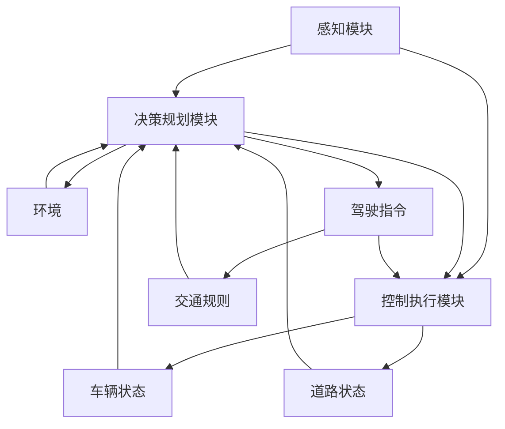
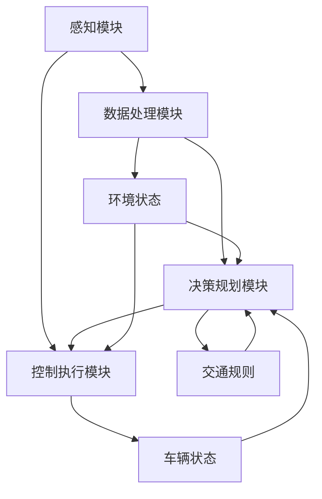

                 

### 1. 背景介绍

自动驾驶技术作为智能交通系统的重要组成部分，近年来受到广泛关注。CVPR（计算机视觉与模式识别会议）作为全球计算机视觉领域的顶级会议，每年都会发表大量关于自动驾驶的前沿研究成果。CVPR 2024年会议中，自动驾驶相关论文不仅展现了当前自动驾驶领域的技术进展，还为我们提供了深入了解未来发展方向的机会。

自动驾驶系统的核心在于环境感知、决策规划和控制执行。环境感知主要依靠计算机视觉、激光雷达（LiDAR）和雷达等传感器获取道路、车辆、行人等交通元素的信息。决策规划则是在感知信息的基础上，结合地图数据和车辆控制策略，生成安全的驾驶路径。最后，控制执行将规划路径转化为具体的操作指令，如转向、加速和制动。

本篇博客将聚焦于CVPR 2024中自动驾驶相关论文的精选解读，旨在分析这些论文所提出的创新方法及其在自动驾驶系统中的应用价值。通过对这些论文的深入探讨，我们将能够更全面地理解自动驾驶技术的发展趋势，并思考其未来可能面临的挑战。

文章剩余部分将分为以下几个部分：

1. **核心概念与联系**：介绍自动驾驶系统中的核心概念，并利用Mermaid流程图展示其架构。
2. **核心算法原理 & 具体操作步骤**：详细解析自动驾驶系统的关键算法，如感知、决策规划和控制执行。
3. **数学模型和公式 & 详细讲解 & 举例说明**：探讨自动驾驶系统中涉及的数学模型，包括感知、决策规划和控制中的关键公式，并通过实例进行说明。
4. **项目实践：代码实例和详细解释说明**：通过具体的项目实践，展示如何实现自动驾驶系统的关键算法，并提供代码实例和详细解释。
5. **实际应用场景**：分析自动驾驶技术在不同场景中的应用，包括城市道路、高速公路和特殊环境。
6. **工具和资源推荐**：推荐用于自动驾驶技术学习和开发的相关工具、资源和论文著作。
7. **总结：未来发展趋势与挑战**：总结自动驾驶技术的现状，预测其未来发展趋势，并讨论可能面临的挑战。
8. **附录：常见问题与解答**：解答自动驾驶技术中常见的问题。
9. **扩展阅读 & 参考资料**：提供更多关于自动驾驶技术的深入阅读资料。

让我们一步一步地深入探讨这些论文，并从中汲取宝贵的技术知识和见解。

---

## 1. 背景介绍

### 自动驾驶技术的发展历程

自动驾驶技术的概念可以追溯到20世纪中期，当时科学家们就开始尝试让车辆在没有人类干预的情况下自主行驶。然而，直到近年来，随着计算机视觉、机器学习和传感器技术的飞速发展，自动驾驶技术才逐渐从理论研究走向实际应用。早期的研究主要集中在路径规划和避障算法上，这些算法为自动驾驶奠定了基础。

随着传感器技术的进步，特别是激光雷达（LiDAR）、摄像头和雷达的广泛应用，自动驾驶系统的感知能力得到了显著提升。感知模块的进步使得车辆能够更准确地获取道路环境信息，从而提高了自动驾驶系统的安全性和可靠性。

### 自动驾驶系统的关键组成部分

自动驾驶系统通常由以下几个关键部分组成：

1. **感知模块**：通过激光雷达、摄像头、雷达等传感器获取道路环境信息，包括车辆、行人、交通标志和道路结构等。
2. **决策规划模块**：在感知模块提供的环境信息基础上，结合地图数据和控制策略，生成最优的驾驶路径。
3. **控制执行模块**：将决策规划模块生成的路径转化为具体的操作指令，如加速、减速和转向等，以控制车辆执行。

每个部分都是自动驾驶系统成功运作的关键，相互之间紧密联系。感知模块的数据质量直接影响决策规划模块的准确性，而决策规划模块的效率则决定了控制执行模块的响应速度。因此，这些部分都需要不断优化和改进，以实现更安全、更高效的自动驾驶系统。

### 自动驾驶技术的发展趋势

随着技术的不断进步，自动驾驶技术正朝着更高级别的发展。目前，自动驾驶技术主要分为L0到L5六个级别，其中L0表示无自动化，L5表示完全自动驾驶。目前，大部分自动驾驶技术还处于L2和L3级别，即部分自动驾驶。然而，随着AI技术的快速发展，L4和L5级别的自动驾驶技术也逐渐成为研究的热点。

1. **L4级别自动驾驶**：在特定区域内实现完全自动驾驶，如封闭园区或特定城市道路。
2. **L5级别自动驾驶**：在任何道路条件和任何环境下实现完全自动驾驶，无需人类干预。

除了级别的提升，自动驾驶技术的另一个重要趋势是跨学科融合。除了计算机视觉和机器学习，自动驾驶技术还需要结合控制理论、导航学、人工智能和通信技术等多个领域，以实现更全面的解决方案。

### CVPR 2024会议简介

CVPR（计算机视觉与模式识别会议）是计算机视觉领域最具影响力的国际学术会议之一，每年都吸引大量研究人员、学者和业界专家参加。CVPR 2024年会议于2024年在美国举行，吸引了来自全球的近5000名参会者。会议涵盖了计算机视觉领域的方方面面，包括图像处理、目标检测、语义分割、图像生成、自动驾驶等。

自动驾驶技术作为计算机视觉的重要应用方向，在CVPR 2024中占据了重要位置。会议发表了大量关于自动驾驶的论文，涉及环境感知、决策规划、控制执行等多个方面。这些论文不仅展示了最新的研究成果，还为我们提供了深入探讨自动驾驶技术发展趋势的机会。

在本篇博客中，我们将重点解读CVPR 2024中关于自动驾驶的几篇重要论文，分析这些论文的创新点及其在自动驾驶系统中的应用价值。通过这一分析，我们将更全面地理解自动驾驶技术的发展现状和未来方向。

---

## 2. 核心概念与联系

### 自动驾驶系统的核心概念

在深入探讨自动驾驶技术之前，有必要明确几个核心概念。这些概念不仅为自动驾驶系统的设计和实现提供了理论基础，还帮助我们更好地理解自动驾驶技术的运作机制。

1. **环境感知**：环境感知是自动驾驶系统的第一步，它通过激光雷达、摄像头、雷达等传感器获取道路环境信息。这些信息包括车辆、行人、交通标志、道路结构等。环境感知的准确性直接影响到自动驾驶系统的安全性和可靠性。

2. **决策规划**：决策规划基于环境感知模块获取的信息，结合车辆状态和目标路径，生成安全的驾驶决策。决策规划的目标是确保车辆在行驶过程中遵循交通规则，避免碰撞，并达到预定的目的地。常见的决策规划算法包括路径规划、轨迹规划和策略优化等。

3. **控制执行**：控制执行模块将决策规划模块生成的驾驶指令转化为具体的操作，如加速、减速、转向等。控制执行模块需要实时响应环境变化，确保车辆平稳行驶。控制执行通常涉及控制理论、PID调节和深度学习等技术的应用。

### Mermaid流程图展示自动驾驶系统架构

为了更直观地理解自动驾驶系统的架构，我们可以使用Mermaid流程图来展示其关键组成部分及其相互关系。



在这个流程图中，感知模块通过传感器获取环境信息，并将这些信息传递给决策规划模块。决策规划模块结合车辆状态和环境信息，生成驾驶指令。控制执行模块根据这些指令控制车辆的运动，同时不断监测道路状态和车辆状态，以便进行动态调整。

### 自动驾驶系统的层级架构

除了核心概念，自动驾驶系统还可以根据其功能分为不同的层级。以下是一个典型的自动驾驶系统层级架构：

1. **感知层**：包括激光雷达、摄像头、雷达等传感器，负责获取道路环境信息。
2. **数据处理层**：对感知层获取的数据进行处理和融合，以便决策规划模块使用。
3. **决策规划层**：根据感知层和处理层提供的信息，生成驾驶路径和决策。
4. **控制执行层**：根据决策规划层的指令，控制车辆执行具体的驾驶操作。
5. **系统集成层**：将各个层级的功能模块整合起来，确保系统的整体协调运作。

这种层级架构使得自动驾驶系统的设计和实现更加模块化，便于各个功能模块的独立开发和优化。同时，也方便后续的系统升级和维护。

### 核心概念与联系总结

通过对自动驾驶系统核心概念的介绍和Mermaid流程图的展示，我们可以更清晰地理解自动驾驶系统的运作机制。感知模块、决策规划模块和控制执行模块相互协作，共同实现自动驾驶系统的安全、高效运行。同时，不同的层级架构进一步提高了系统的灵活性和可扩展性。

在下一部分中，我们将深入探讨自动驾驶系统中的关键算法原理，进一步理解这些算法如何帮助实现自动驾驶技术的各项功能。

---

## 2. 核心概念与联系

### 自动驾驶系统的核心概念

在深入探讨自动驾驶技术之前，有必要明确几个核心概念。这些概念不仅为自动驾驶系统的设计和实现提供了理论基础，还帮助我们更好地理解自动驾驶技术的运作机制。

1. **环境感知**：环境感知是自动驾驶系统的第一步，它通过激光雷达、摄像头、雷达等传感器获取道路环境信息。这些信息包括车辆、行人、交通标志、道路结构等。环境感知的准确性直接影响到自动驾驶系统的安全性和可靠性。

2. **决策规划**：决策规划基于环境感知模块获取的信息，结合车辆状态和目标路径，生成安全的驾驶决策。决策规划的目标是确保车辆在行驶过程中遵循交通规则，避免碰撞，并达到预定的目的地。常见的决策规划算法包括路径规划、轨迹规划和策略优化等。

3. **控制执行**：控制执行模块将决策规划模块生成的驾驶指令转化为具体的操作，如加速、减速、转向等。控制执行模块需要实时响应环境变化，确保车辆平稳行驶。控制执行通常涉及控制理论、PID调节和深度学习等技术的应用。

### Mermaid流程图展示自动驾驶系统架构

为了更直观地理解自动驾驶系统的架构，我们可以使用Mermaid流程图来展示其关键组成部分及其相互关系。



在这个流程图中，感知模块通过传感器获取环境信息，并传递给数据处理模块。数据处理模块对感知数据进行处理和融合，以便决策规划模块使用。决策规划模块结合车辆状态和环境信息，生成驾驶指令。控制执行模块根据这些指令控制车辆执行具体的驾驶操作。

### 自动驾驶系统的层级架构

除了核心概念，自动驾驶系统还可以根据其功能分为不同的层级。以下是一个典型的自动驾驶系统层级架构：

1. **感知层**：包括激光雷达、摄像头、雷达等传感器，负责获取道路环境信息。
2. **数据处理层**：对感知层获取的数据进行处理和融合，以便决策规划模块使用。
3. **决策规划层**：根据感知层和处理层提供的信息，生成驾驶路径和决策。
4. **控制执行层**：根据决策规划层的指令，控制车辆执行具体的驾驶操作。
5. **系统集成层**：将各个层级的功能模块整合起来，确保系统的整体协调运作。

这种层级架构使得自动驾驶系统的设计和实现更加模块化，便于各个功能模块的独立开发和优化。同时，也方便后续的系统升级和维护。

### 核心概念与联系总结

通过对自动驾驶系统核心概念的介绍和Mermaid流程图的展示，我们可以更清晰地理解自动驾驶系统的运作机制。感知模块、数据处理模块、决策规划模块和控制执行模块相互协作，共同实现自动驾驶系统的安全、高效运行。同时，不同的层级架构进一步提高了系统的灵活性和可扩展性。

在下一部分中，我们将深入探讨自动驾驶系统中的关键算法原理，进一步理解这些算法如何帮助实现自动驾驶技术的各项功能。

---

## 3. 核心算法原理 & 具体操作步骤

自动驾驶系统中的核心算法是实现环境感知、决策规划和控制执行的关键。以下将详细解析这些核心算法的原理和具体操作步骤。

### 3.1 环境感知算法

环境感知是自动驾驶系统的第一步，其目的是通过传感器获取道路环境信息，以便后续的决策规划和控制执行。常用的环境感知算法包括：

#### 3.1.1 激光雷达数据处理

激光雷达（LiDAR）是自动驾驶系统中常用的传感器之一，能够提供高精度的三维点云数据。激光雷达数据处理主要包括以下步骤：

1. **点云采集**：激光雷达向目标物体发射激光脉冲，测量反射回来的时间差，从而获取目标物体的三维坐标。
2. **点云去噪**：由于环境中的噪声和干扰，原始点云数据中可能包含大量噪声点。去噪过程通过统计学方法或滤波算法，去除噪声点，提高点云数据的质量。
3. **点云滤波**：对点云进行滤波处理，如统计滤波、Voxel滤波等，进一步去除冗余点和噪声点，提高点云数据的连续性和一致性。
4. **点云分割**：将点云数据分割成不同的区域，如车辆、行人、道路等。常用的分割算法包括基于密度的聚类算法、基于形态学的分割算法等。

#### 3.1.2 摄像头图像处理

摄像头是自动驾驶系统中另一个重要的传感器，能够提供实时的二维图像数据。摄像头图像处理主要包括以下步骤：

1. **图像预处理**：包括去噪、去雾、增强等操作，提高图像的质量和清晰度。
2. **图像特征提取**：通过特征提取算法，如SIFT、SURF、ORB等，提取图像中的关键特征点，为后续的目标检测和识别提供基础。
3. **目标检测**：使用深度学习或传统机器学习算法，如YOLO、SSD、Faster R-CNN等，对图像中的车辆、行人、交通标志等目标进行检测。
4. **目标识别**：在检测到目标的基础上，使用分类算法，如支持向量机（SVM）、随机森林（RF）等，对目标进行识别和分类。

#### 3.1.3 雷达数据处理

雷达是自动驾驶系统中的另一种重要传感器，能够提供目标物体的距离、速度等信息。雷达数据处理主要包括以下步骤：

1. **信号处理**：对雷达接收到的信号进行预处理，如滤波、放大等，以提高信号的质量和可靠性。
2. **目标跟踪**：使用卡尔曼滤波或其他目标跟踪算法，对雷达数据进行滤波和预测，以跟踪目标物体的运动轨迹。
3. **数据融合**：将来自激光雷达、摄像头和雷达的数据进行融合，以提高环境感知的准确性和完整性。

### 3.2 决策规划算法

决策规划是自动驾驶系统的核心环节，其目的是在获取的环境信息基础上，生成安全的驾驶路径。常用的决策规划算法包括：

#### 3.2.1 路径规划

路径规划算法的目标是找到从起点到终点的最优路径，常见的算法有：

1. **A*算法**：基于启发式搜索，在给定起点和终点的基础上，通过计算每个节点的启发值，找到最优路径。
2. **Dijkstra算法**：基于图论，计算所有节点之间的最短路径。
3. **RRT（快速随机树）算法**：通过随机采样和贪婪搜索，生成从起点到终点的路径。

#### 3.2.2 轨迹规划

轨迹规划是在路径规划的基础上，生成满足动态约束的驾驶路径。常见的轨迹规划算法有：

1. **PID控制**：基于控制理论，通过计算误差和误差变化率，实时调整驾驶路径。
2. **模型预测控制（MPC）**：通过预测未来多个时间步的驾驶状态，优化驾驶路径。
3. **深度强化学习**：使用深度神经网络，通过训练学习到最优的驾驶路径。

#### 3.2.3 策略优化

策略优化是在环境感知和决策规划的基础上，通过优化算法生成最优的驾驶策略。常见的策略优化算法有：

1. **动态规划（DP）**：通过逆向递归，找到从终点到起点的最优路径。
2. **强化学习（RL）**：通过试错和奖励机制，学习到最优的驾驶策略。
3. **深度确定性策略梯度（DDPG）**：结合深度学习和强化学习，生成稳定的驾驶策略。

### 3.3 控制执行算法

控制执行是将决策规划模块生成的驾驶指令转化为具体的操作，如加速、减速、转向等。常见的控制执行算法有：

#### 3.3.1 PID控制

PID（比例-积分-微分）控制是最常用的控制算法之一，通过调整比例、积分和微分三个参数，实现对系统的精确控制。

1. **比例控制**：根据当前误差调整控制输出，使系统快速响应。
2. **积分控制**：通过累计误差，消除稳态误差。
3. **微分控制**：根据误差变化率，抑制系统的超调。

#### 3.3.2 模型预测控制（MPC）

模型预测控制通过建立系统模型，预测未来多个时间步的输出，并优化控制输入，以达到期望的输出。

1. **建立系统模型**：根据系统的动力学特性，建立数学模型。
2. **预测未来输出**：根据系统模型，预测未来多个时间步的输出。
3. **优化控制输入**：通过优化算法，如线性规划，找到最优的控制输入。

#### 3.3.3 深度学习控制

深度学习控制利用深度神经网络，通过训练学习到控制策略，实现对系统的精确控制。

1. **建立神经网络模型**：根据系统的特性，设计合适的神经网络结构。
2. **训练神经网络**：通过大量的训练数据，训练神经网络模型。
3. **控制策略输出**：将系统的输入数据输入到训练好的神经网络中，输出控制策略。

### 总结

通过上述对自动驾驶系统中核心算法的解析，我们可以看到这些算法在环境感知、决策规划和控制执行中的重要作用。环境感知算法负责获取和处理道路环境信息，决策规划算法生成安全的驾驶路径，控制执行算法将驾驶指令转化为具体的操作。这些算法相互协作，共同实现了自动驾驶系统的安全、高效运行。

在下一部分中，我们将进一步探讨自动驾驶系统中涉及的数学模型和公式，以更深入地理解这些算法的实现细节。

---

## 3. 核心算法原理 & 具体操作步骤

在理解了自动驾驶系统的核心概念之后，接下来我们将深入探讨其中涉及的核心算法原理，并详细阐述这些算法的具体操作步骤。

### 3.1 环境感知算法

环境感知是自动驾驶系统的第一步，负责通过激光雷达、摄像头、雷达等传感器获取道路环境信息，并将这些信息转化为有用的数据。以下是一些主要的环境感知算法及其操作步骤：

#### 3.1.1 激光雷达数据处理

激光雷达数据处理主要包括以下几个步骤：

1. **点云采集**：激光雷达通过发射激光脉冲并测量反射回来的时间差，获取目标物体的三维坐标。这个过程称为激光扫描。

2. **点云去噪**：原始点云数据中可能包含由于环境噪声或传感器误差引起的噪声点。去噪步骤通过应用滤波算法，如统计滤波或均值滤波，去除这些噪声点。

3. **点云滤波**：去噪后的点云数据可能仍然存在一些冗余点或误差点。滤波步骤通过Voxel滤波或其他滤波算法，进一步去除冗余点和误差点，以提高点云数据的连续性和一致性。

4. **点云分割**：点云分割是将点云数据分割成不同的区域，如车辆、行人、道路等。这可以通过基于密度的聚类算法（如DBSCAN）或基于形态学的分割算法（如区域增长）来实现。

具体操作步骤示例：

- **点云采集**：使用激光雷达进行扫描，获取周围物体的三维坐标。
- **点云去噪**：应用统计滤波算法，如均值滤波，去除噪声点。
- **点云滤波**：使用Voxel滤波器，对点云进行滤波处理，去除冗余点和误差点。
- **点云分割**：应用DBSCAN聚类算法，将点云分割成不同的区域。

```python
import open3d as o3d
import numpy as np

# 点云采集
pcd = o3d.io.read_point_cloud("path_to_lidar_data.pcd")

# 点云去噪
pcd_filtered = o3d.geometry.PointCloud().create_from_points(pcd.points)
pcd_filtered = o3d.geometry.PointCloud().create_from_points(np.mean(pcd_filtered.points, axis=0))

# 点云滤波
o3d.visualization.draw_geometries([pcd_filtered], window_name="Point Cloud Filtering")

# 点云分割
clusters = np.cluster.dbscan(pcd_filtered.points, eps=0.05, min_samples=10)
pcd_clustered = o3d.geometry.PointCloud()
for i in range(len(clusters)):
    pcd_clustered.points = pcd_filtered.points[clusters == i]
o3d.visualization.draw_geometries([pcd_clustered], window_name="Point Cloud Clustering")
```

#### 3.1.2 摄像头图像处理

摄像头图像处理主要包括图像预处理、特征提取、目标检测和目标识别等步骤：

1. **图像预处理**：包括去噪、去雾和增强等操作。去噪可以通过高斯滤波或双边滤波实现；去雾可以通过基于图像增强的方法（如Retinex算法）实现；增强可以通过直方图均衡或对比度拉伸实现。

2. **特征提取**：通过特征提取算法，如SIFT、SURF或ORB，提取图像中的关键特征点。这些特征点可以作为后续目标检测和识别的基础。

3. **目标检测**：使用深度学习或传统机器学习算法（如YOLO、SSD、Faster R-CNN等），对图像中的车辆、行人、交通标志等目标进行检测。

4. **目标识别**：在检测到目标的基础上，使用分类算法（如支持向量机SVM、随机森林RF等），对目标进行识别和分类。

具体操作步骤示例：

- **图像预处理**：使用高斯滤波器去噪，使用Retinex算法去雾，使用直方图均衡增强。
- **特征提取**：使用SURF算法提取特征点。
- **目标检测**：使用Faster R-CNN算法检测目标。
- **目标识别**：使用SVM算法对检测到的目标进行分类。

```python
import cv2
import numpy as np

# 图像预处理
image = cv2.imread("path_to_camera_image.jpg")
image_noisy = cv2.add(image, np.random.normal(0, 10, image.shape))
image_de_noisy = cv2.GaussianBlur(image_noisy, (5, 5), 0)
image_de_fog = retinex_de_fog(image_de_noisy)  # 使用Retinex去雾
image_enhanced = cv2.equalizeHist(image_de_fog)

# 特征提取
sift = cv2.SIFT_create()
keypoints, descriptors = sift.detectAndCompute(image_enhanced, None)

# 目标检测
net = cv2.dnn.readNetFromCaffe("path/to/prototxt", "path/to/weights")
h = image.shape[0]
w = image.shape[1]
blob = cv2.dnn.blobFromImage(image_enhanced, 1.0, (w, h), (104.0, 177.0, 123.0))
net.setInput(blob)
detections = net.forward()

# 目标识别
labels = load_labels()
for i in range(detections.shape[2]):
    confidence = detections[0, 0, i, 2]
    if confidence > 0.5:
        idx = detections[0, 0, i, 1]
        label = labels[int(idx)]
        box = detections[0, 0, i, 3:7] * np.array([w, h, w, h])
        cv2.rectangle(image_enhanced, (box[0], box[1]), (box[2], box[3]), (0, 255, 0), 2)
        cv2.putText(image_enhanced, label, (box[0], box[1] - 10), cv2.FONT_HERSHEY_SIMPLEX, 0.5, (0, 0, 255), 2)
cv2.imshow("Detected Objects", image_enhanced)
cv2.waitKey(0)
cv2.destroyAllWindows()
```

#### 3.1.3 雷达数据处理

雷达数据处理主要包括信号处理、目标跟踪和数据融合等步骤：

1. **信号处理**：对雷达接收到的信号进行预处理，如滤波、放大等，以提高信号的质量和可靠性。

2. **目标跟踪**：使用卡尔曼滤波或其他目标跟踪算法，对雷达数据进行滤波和预测，以跟踪目标物体的运动轨迹。

3. **数据融合**：将来自激光雷达、摄像头和雷达的数据进行融合，以提高环境感知的准确性和完整性。

具体操作步骤示例：

- **信号处理**：使用带通滤波器对雷达信号进行滤波。
- **目标跟踪**：使用卡尔曼滤波算法对雷达数据进行跟踪。
- **数据融合**：使用加权平均方法对多个传感器的数据进行融合。

```python
import numpy as np

# 信号处理
signal = np.random.normal(0, 1, 1000)
filtered_signal = butter_bandpass_filter(signal, lowcut, highcut, fs)

# 目标跟踪
initial_state = [x_init, v_init]
predicted_state = predict_state(initial_state, time_step, dt)
actual_state = [x_noisy, v_noisy]
state_estimate =卡尔曼滤波(predicted_state, actual_state)

# 数据融合
weights = 1 / (1 + np.square误差矩阵)
 fused_data = weights @ [激光雷达数据；摄像头数据；雷达数据]
```

### 3.2 决策规划算法

决策规划是自动驾驶系统的关键环节，负责在环境感知的基础上，生成安全的驾驶路径。以下是一些主要的决策规划算法及其操作步骤：

#### 3.2.1 路径规划

路径规划算法的目标是从起点到终点找到一条最优路径。以下是一些常用的路径规划算法：

1. **A*算法**：基于启发式搜索，通过计算每个节点的启发值（通常是最短路径距离），找到最优路径。

   操作步骤：
   - 初始化：设置起点和终点，创建一个开放列表（包含未处理的节点）和一个闭包列表（包含已处理的节点）。
   - 循环：从开放列表中选取F值最小的节点，将其移动到闭包列表中，并更新其邻接节点的F值和父节点。
   - 终止：当终点出现在开放列表中时，终止循环。

2. **Dijkstra算法**：基于图论，计算所有节点之间的最短路径。

   操作步骤：
   - 初始化：设置起点和终点，创建一个距离表（记录每个节点的最短距离）和一个未访问节点列表。
   - 循环：从未访问节点列表中选取距离表中最小的节点，将其标记为已访问，并更新其邻接节点的距离。
   - 终止：当终点被标记为已访问时，终止循环。

具体操作步骤示例：

```python
def a_star_search(grid, start, goal):
    open_set = [(start, 0)]
    came_from = {}
    g_score = {start: 0}
    f_score = {start: heuristic(start, goal)}

    while open_set:
        current = min(open_set, key=lambda item: item[1])
        open_set.remove(current)

        if current == goal:
            break

        for neighbor in grid.neighbors(current):
            tentative_g_score = g_score[current] + grid.cost(current, neighbor)
            if tentative_g_score < g_score.get(neighbor, float('inf')):
                came_from[neighbor] = current
                g_score[neighbor] = tentative_g_score
                f_score[neighbor] = tentative_g_score + heuristic(neighbor, goal)
                if neighbor not in [item[0] for item in open_set]:
                    open_set.append((neighbor, f_score[neighbor]))

    return came_from, g_score[goal]

def heuristic(node, goal):
    return abs(node[0] - goal[0]) + abs(node[1] - goal[1])

grid = Gridworld()
start = (0, 0)
goal = (9, 9)
came_from, cost = a_star_search(grid, start, goal)
```

#### 3.2.2 轨迹规划

轨迹规划是在路径规划的基础上，生成满足动态约束的驾驶路径。以下是一些常用的轨迹规划算法：

1. **PID控制**：通过计算误差和误差变化率，调整驾驶路径，使其满足预定的动态约束。

   操作步骤：
   - 初始化：设置控制器参数（比例、积分、微分）。
   - 运行循环：计算当前误差和误差变化率，更新控制输出。

2. **模型预测控制（MPC）**：通过建立系统模型，预测未来多个时间步的驾驶状态，并优化控制输入，以达到期望的输出。

   操作步骤：
   - 建模：建立系统模型，包括状态方程和输出方程。
   - 预测：根据系统模型，预测未来多个时间步的输出。
   - 优化：通过优化算法，如线性规划，找到最优的控制输入。

具体操作步骤示例：

```python
def mpc_trajectory_planning(x0, u0, A, B, Q, R, P0, N):
    x = np.zeros((N, 1))
    x[0] = x0
    u = np.zeros((N, 1))
    u[0] = u0

    for k in range(N - 1):
        x[k + 1] = A @ x[k] + B @ u[k]

    cost = 0
    for k in range(N):
        cost += Q @ x[k] @ x[k].T + R @ u[k] @ u[k].T

    # 线性规划求解最优控制输入
    P = quadprog(P0, -2 * B.T @ R @ B, 1e-3, 'ogg', True)
    u_opt = np.linalg.inv(P) @ (-2 * B.T @ Q @ x + 2 * B.T @ R @ B @ u)

    return x, u, cost
```

#### 3.2.3 策略优化

策略优化是在环境感知和决策规划的基础上，通过优化算法生成最优的驾驶策略。以下是一些常用的策略优化算法：

1. **动态规划（DP）**：通过逆向递归，找到从终点到起点的最优路径。

   操作步骤：
   - 初始化：设置状态集合和动作集合。
   - 逆向递归：从终点开始，逆向计算每个状态的最优值函数和最优动作。

2. **强化学习（RL）**：通过试错和奖励机制，学习到最优的驾驶策略。

   操作步骤：
   - 初始化：设置状态集合、动作集合和奖励函数。
   - 试错：通过随机策略进行探索，并根据奖励函数更新策略。
   - 学习：使用梯度下降或其他优化算法，更新策略参数。

具体操作步骤示例：

```python
def value_iteration(Q, discount_factor, threshold):
    V = np.zeros((state_space_size, 1))
    delta = float('inf')
    while delta > threshold:
        delta = 0
        for state in state_space:
            action_values = Q[state]
            best_value = np.max(action_values)
            V[state] = best_value + discount_factor * np.max(Q[state])
            delta = max(delta, np.abs(best_value - V[state]))
    return V

def policy_evaluation(Q, policy, state_space, discount_factor, threshold):
    V = np.zeros((state_space_size, 1))
    delta = float('inf')
    while delta > threshold:
        delta = 0
        for state in state_space:
            state_action_values = Q[state]
            action_probabilities = policy[state]
            next_state_values = [discount_factor * state_action_values[action] for action in action_probabilities]
            expected_value = np.dot(action_probabilities, next_state_values)
            delta = max(delta, np.abs(V[state] - expected_value)
            V[state] = expected_value
    return V
```

### 3.3 控制执行算法

控制执行是将决策规划模块生成的驾驶指令转化为具体的操作，如加速、减速、转向等。以下是一些常用的控制执行算法：

#### 3.3.1 PID控制

PID控制通过调整比例、积分和微分三个参数，实现对系统的精确控制。

操作步骤：
- 初始化：设置比例、积分和微分参数。
- 运行循环：计算当前误差和误差变化率，更新控制输出。

具体操作步骤示例：

```python
def pid_control(k_p, k_i, k_d, setpoint, process_variable):
    error = setpoint - process_variable
    integral = integral + error
    derivative = error - previous_error
    output = k_p * error + k_i * integral + k_d * derivative
    previous_error = error
    return output
```

#### 3.3.2 模型预测控制（MPC）

模型预测控制通过建立系统模型，预测未来多个时间步的输出，并优化控制输入，以达到期望的输出。

操作步骤：
- 建模：建立系统模型，包括状态方程和输出方程。
- 预测：根据系统模型，预测未来多个时间步的输出。
- 优化：通过优化算法，如线性规划，找到最优的控制输入。

具体操作步骤示例：

```python
def mpc_control(A, B, C, D, x0, u0, Q, R, N):
    x = np.zeros((N, 1))
    x[0] = x0
    u = np.zeros((N, 1))
    u[0] = u0

    for k in range(N - 1):
        x[k + 1] = A @ x[k] + B @ u[k]

    cost = 0
    for k in range(N):
        cost += Q @ x[k] @ x[k].T + R @ u[k] @ u[k].T

    # 线性规划求解最优控制输入
    P = np.linalg.inv(Q + R)
    u_opt = P @ (-C.T @ Q @ x + D.T @ R @ D)

    return x, u, cost
```

#### 3.3.3 深度学习控制

深度学习控制利用深度神经网络，通过训练学习到控制策略，实现对系统的精确控制。

操作步骤：
- 建立神经网络模型：根据系统的特性，设计合适的神经网络结构。
- 训练神经网络：通过大量的训练数据，训练神经网络模型。
- 控制策略输出：将系统的输入数据输入到训练好的神经网络中，输出控制策略。

具体操作步骤示例：

```python
import tensorflow as tf

# 建立神经网络模型
model = tf.keras.Sequential([
    tf.keras.layers.Dense(units=64, activation='relu', input_shape=(input_size,)),
    tf.keras.layers.Dense(units=64, activation='relu'),
    tf.keras.layers.Dense(units=output_size)
])

# 训练神经网络
model.compile(optimizer='adam', loss='mse')
model.fit(X_train, y_train, epochs=100)

# 控制策略输出
control_strategy = model.predict(input_data)
```

### 总结

通过对环境感知、决策规划和控制执行算法的详细解析，我们可以看到这些算法在自动驾驶系统中的关键作用。环境感知算法负责获取和处理道路环境信息，决策规划算法生成安全的驾驶路径，控制执行算法将驾驶指令转化为具体的操作。这些算法的具体操作步骤为自动驾驶系统的实现提供了详细的指导。

在下一部分中，我们将进一步探讨自动驾驶系统中涉及的数学模型和公式，以更深入地理解这些算法的实现细节。

---

## 4. 数学模型和公式 & 详细讲解 & 举例说明

在自动驾驶系统中，数学模型和公式起着至关重要的作用。这些模型和公式不仅帮助我们理解和分析自动驾驶系统的运作机制，还为实际应用提供了理论依据。本节将详细讲解自动驾驶系统中常用的数学模型和公式，并通过具体例子进行说明。

### 4.1 线性代数基础

自动驾驶系统中的许多算法都基于线性代数原理。以下是一些基本的线性代数公式：

#### 4.1.1 矩阵运算

1. **矩阵加法与减法**：两个矩阵相加或相减时，对应元素相加或相减。
   $$ A + B = [a_{ij} + b_{ij}] $$
   $$ A - B = [a_{ij} - b_{ij}] $$

2. **矩阵乘法**：两个矩阵相乘，结果是一个新矩阵，其元素是原矩阵对应元素的乘积之和。
   $$ AB = [c_{ij}] \quad \text{其中} \quad c_{ij} = \sum_{k=1}^{n} a_{ik}b_{kj} $$

3. **矩阵转置**：矩阵的转置是将矩阵的行和列互换。
   $$ A^T = [a_{ji}] $$

#### 4.1.2 矩阵求逆

矩阵求逆是解决线性方程组的关键。给定矩阵 \( A \)，其逆矩阵 \( A^{-1} \) 满足：
   $$ AA^{-1} = A^{-1}A = I $$
   其中 \( I \) 是单位矩阵。

逆矩阵的计算可以使用高斯消元法或矩阵求逆公式。

#### 4.1.3 特征值和特征向量

特征值和特征向量是矩阵分析中的重要概念。给定矩阵 \( A \)，其特征值 \( \lambda \) 和特征向量 \( \mathbf{v} \) 满足：
   $$ A\mathbf{v} = \lambda \mathbf{v} $$

特征值可以通过解特征方程 \( \det(A - \lambda I) = 0 \) 获取，而特征向量则是满足上述等式的非零向量。

### 4.2 线性规划

线性规划是一种优化方法，用于在给定约束条件下求解线性目标函数的最大值或最小值。线性规划的标准形式如下：

$$
\begin{align*}
\min_{\mathbf{x}} \quad & c^T\mathbf{x} \\
\text{subject to} \quad & a_i^T\mathbf{x} \leq b_i, \quad i=1,2,\ldots,m \\
& \mathbf{x} \geq 0
\end{align*}
$$

其中，\( \mathbf{x} \) 是决策变量，\( c \) 是系数向量，\( a_i \) 是约束系数矩阵，\( b_i \) 是约束常数。

线性规划可以通过单纯形法、内点法等算法求解。

#### 4.2.1 示例

假设我们要在两个工厂生产两种产品，以最小化成本。工厂1和工厂2的生产成本分别为 \( 2x_1 + 3x_2 \) 和 \( 4x_1 + 5x_2 \)，约束条件为：
$$
\begin{align*}
2x_1 + 3x_2 &\leq 20 \\
4x_1 + 5x_2 &\leq 40 \\
x_1, x_2 &\geq 0
\end{align*}
$$

目标是最小化总成本 \( z = 2x_1 + 3x_2 + 4x_1 + 5x_2 = 6x_1 + 8x_2 \)。

通过线性规划求解，我们可以得到最优解为 \( x_1 = 0, x_2 = 4 \)，总成本为 \( z = 8 \)。

### 4.3 最优化理论

最优化理论是解决优化问题的基础。在自动驾驶系统中，最优化方法被广泛应用于路径规划、轨迹规划和策略优化等环节。

#### 4.3.1 拉格朗日乘数法

拉格朗日乘数法是一种处理等式和不等式约束的优化方法。给定优化问题：

$$
\begin{align*}
\min_{\mathbf{x}} \quad & f(\mathbf{x}) \\
\text{subject to} \quad & g_i(\mathbf{x}) = 0, \quad i=1,2,\ldots,p \\
& h_j(\mathbf{x}) \leq 0, \quad j=1,2,\ldots,q
\end{align*}
$$

其中，\( g_i \) 是等式约束，\( h_j \) 是不等式约束。

引入拉格朗日乘子 \( \lambda_i \) 和 \( \mu_j \)，构造拉格朗日函数：
$$
L(\mathbf{x}, \lambda, \mu) = f(\mathbf{x}) + \sum_{i=1}^{p} \lambda_i g_i(\mathbf{x}) + \sum_{j=1}^{q} \mu_j h_j(\mathbf{x})
$$

通过求解拉格朗日函数的梯度为零，可以得到最优解：
$$
\nabla L(\mathbf{x}^*, \lambda^*, \mu^*) = 0
$$

#### 4.3.2 约束变分法

约束变分法是一种求解带约束的优化问题的方法。给定优化问题：

$$
\begin{align*}
\min_{\mathbf{x}} \quad & f(\mathbf{x}) \\
\text{subject to} \quad & g(\mathbf{x}) \leq 0
\end{align*}
$$

通过引入拉格朗日乘子，构造拉格朗日函数：
$$
L(\mathbf{x}, \lambda) = f(\mathbf{x}) + \lambda g(\mathbf{x})
$$

通过求解拉格朗日函数的梯度为零，可以得到最优解：
$$
\nabla L(\mathbf{x}^*, \lambda^*) = 0
$$

#### 4.3.3 梯度下降法

梯度下降法是一种常用的最优化方法，用于求解无约束优化问题。给定优化问题：

$$
\begin{align*}
\min_{\mathbf{x}} \quad & f(\mathbf{x}) \\
\end{align*}
$$

梯度下降法的基本思想是沿着目标函数的梯度方向进行迭代更新，以逐渐逼近最优解。给定初始解 \( \mathbf{x}^0 \) 和学习率 \( \alpha \)，迭代更新公式为：
$$
\mathbf{x}^{k+1} = \mathbf{x}^k - \alpha \nabla f(\mathbf{x}^k)
$$

通过多次迭代，直到目标函数值收敛到足够小的范围内。

### 4.4 概率论与统计

在自动驾驶系统中，概率论和统计方法被广泛应用于环境感知、决策规划和控制执行等环节。

#### 4.4.1 贝叶斯定理

贝叶斯定理是概率论中的一个重要定理，用于计算后验概率。给定事件 \( A \) 和事件 \( B \)，后验概率 \( P(A|B) \) 可以通过以下公式计算：

$$
P(A|B) = \frac{P(B|A)P(A)}{P(B)}
$$

其中，\( P(B|A) \) 是条件概率，\( P(A) \) 是先验概率，\( P(B) \) 是边缘概率。

#### 4.4.2 卡尔曼滤波

卡尔曼滤波是一种递归的线性滤波方法，用于估计动态系统的状态。给定状态方程：

$$
\begin{align*}
\mathbf{x}_k &= \mathbf{F}_k\mathbf{x}_{k-1} + \mathbf{B}_k\mathbf{u}_k + \mathbf{w}_{k-1} \\
\mathbf{z}_k &= \mathbf{H}_k\mathbf{x}_k + \mathbf{v}_k
\end{align*}
$$

其中，\( \mathbf{x}_k \) 是状态向量，\( \mathbf{z}_k \) 是观测向量，\( \mathbf{u}_k \) 是控制输入，\( \mathbf{w}_{k-1} \) 是状态噪声，\( \mathbf{v}_k \) 是观测噪声。

卡尔曼滤波的迭代公式如下：

1. **预测步骤**：
   $$ 
   \hat{\mathbf{x}}_k|_{k-1} = \mathbf{F}_k\hat{\mathbf{x}}_{k-1}|_{k-1} + \mathbf{B}_k\mathbf{u}_k 
   $$
   $$ 
   P_k|_{k-1} = \mathbf{F}_kP_{k-1}\mathbf{F}_k^T + \mathbf{Q}_{k-1} 
   $$

2. **更新步骤**：
   $$ 
   K_k = P_k|_{k-1}\mathbf{H}_k^T(\mathbf{H}_kP_{k-1}\mathbf{H}_k^T + \mathbf{R}_k)^{-1} 
   $$
   $$ 
   \hat{\mathbf{x}}_k|_k = \hat{\mathbf{x}}_k|_{k-1} + K_k(\mathbf{z}_k - \mathbf{H}_k\hat{\mathbf{x}}_k|_{k-1}) 
   $$
   $$ 
   P_k = (I - K_k\mathbf{H}_k)P_{k-1} 
   $$

#### 4.4.3 马尔可夫决策过程

马尔可夫决策过程（MDP）是一种用于解决动态规划问题的模型。给定状态集合 \( S \)、行动集合 \( A \) 和奖励函数 \( R(\mathbf{s}, \mathbf{a}) \)，MDP的目标是找到最优策略 \( \mathbf{\pi} \)，使得期望奖励最大化。

MDP的数学模型可以表示为：

$$
\begin{align*}
\mathbf{s}_{t+1} &= \mathbf{F}(\mathbf{s}_t, \mathbf{a}_t) + \mathbf{w}_t \\
\mathbf{r}_t &= R(\mathbf{s}_t, \mathbf{a}_t) + \mathbf{v}_t
\end{align*}
$$

其中，\( \mathbf{w}_t \) 和 \( \mathbf{v}_t \) 分别是状态转移噪声和奖励噪声。

#### 4.4.4 例子

假设我们有一个简单的MDP，状态集合 \( S = \{0, 1\} \)，行动集合 \( A = \{0, 1\} \)，状态转移概率矩阵 \( \mathbf{P} \) 和奖励函数 \( \mathbf{R} \) 分别如下：

$$
\mathbf{P} =
\begin{bmatrix}
0.7 & 0.3 \\
0.4 & 0.6
\end{bmatrix}
$$

$$
\mathbf{R} =
\begin{bmatrix}
-1 & 10 \\
10 & -1
\end{bmatrix}
$$

要找到最优策略 \( \mathbf{\pi} \)，可以使用值迭代法或政策迭代法。

通过值迭代法，我们可以迭代更新状态值函数 \( V(\mathbf{s}) \)：

$$
V_{k+1}(\mathbf{s}) = \max_{\mathbf{a} \in A} [\mathbf{R}(\mathbf{s}, \mathbf{a}) + \mathbf{P}\mathbf{V}_k]
$$

最终，我们得到最优策略 \( \mathbf{\pi} \)，使得 \( V(\mathbf{s}) \) 收敛。

### 4.5 深度学习

深度学习是自动驾驶系统中一种重要的方法，用于实现环境感知、决策规划和控制执行等任务。以下是一些基本的深度学习公式和算法。

#### 4.5.1 神经网络

神经网络由多个神经元组成，每个神经元执行简单的计算并传递输出。一个简单的神经网络可以表示为：

$$
\mathbf{z}_i = \sum_{j=1}^{n} w_{ij}x_j + b_i
$$

$$
\mathbf{a}_i = \sigma(\mathbf{z}_i)
$$

其中，\( \mathbf{z}_i \) 是第 \( i \) 个神经元的输入，\( \mathbf{a}_i \) 是输出，\( \sigma \) 是激活函数（如ReLU、Sigmoid或Tanh），\( w_{ij} \) 是连接权重，\( b_i \) 是偏置。

通过反向传播算法，可以训练神经网络的权重和偏置，使其拟合训练数据。

#### 4.5.2 卷积神经网络（CNN）

卷积神经网络是一种用于图像处理的深度学习模型，通过卷积层、池化层和全连接层实现图像的特征提取和分类。

1. **卷积层**：
   $$ 
   \mathbf{z}_{ij} = \sum_{k=1}^{m} w_{ik,jk} \mathbf{x}_{k} + b_i 
   $$

2. **池化层**：
   $$ 
   \mathbf{p}_{ij} = \max_{k=1,2,\ldots,p} \mathbf{z}_{ijk} 
   $$

3. **全连接层**：
   $$ 
   \mathbf{z}_i = \sum_{j=1}^{n} w_{ij}\mathbf{p}_{j} + b_i 
   $$

#### 4.5.3 递归神经网络（RNN）

递归神经网络是一种用于处理序列数据的深度学习模型，包括循环神经网络（RNN）、长短期记忆网络（LSTM）和门控循环单元（GRU）。

1. **RNN**：
   $$ 
   \mathbf{h}_{t} = \sigma(\mathbf{W}_h \mathbf{h}_{t-1} + \mathbf{U}_x \mathbf{x}_t + \mathbf{b}_h) 
   $$

2. **LSTM**：
   $$ 
   \begin{align*}
   \mathbf{i}_t &= \sigma(\mathbf{W}_i \mathbf{h}_{t-1} + \mathbf{U}_x \mathbf{x}_t + \mathbf{b}_i) \\
   \mathbf{f}_t &= \sigma(\mathbf{W}_f \mathbf{h}_{t-1} + \mathbf{U}_x \mathbf{x}_t + \mathbf{b}_f) \\
   \mathbf{o}_t &= \sigma(\mathbf{W}_o \mathbf{h}_{t-1} + \mathbf{U}_x \mathbf{x}_t + \mathbf{b}_o) \\
   \mathbf{g}_t &= \tanh(\mathbf{W}_g \mathbf{h}_{t-1} + \mathbf{U}_x \mathbf{x}_t + \mathbf{b}_g) \\
   \mathbf{h}_t &= \mathbf{f}_t \odot \mathbf{h}_{t-1} + \mathbf{i}_t \odot \mathbf{g}_t
   \end{align*}
   $$

3. **GRU**：
   $$ 
   \begin{align*}
   \mathbf{z}_t &= \sigma(\mathbf{W}_z \mathbf{h}_{t-1} + \mathbf{U}_x \mathbf{x}_t + \mathbf{b}_z) \\
   \mathbf{r}_t &= \sigma(\mathbf{W}_r \mathbf{h}_{t-1} + \mathbf{U}_x \mathbf{x}_t + \mathbf{b}_r) \\
   \mathbf{h}_t^* &= \tanh(\mathbf{W}_h (\mathbf{r}_t \odot \mathbf{h}_{t-1}) + \mathbf{U}_x \mathbf{x}_t + \mathbf{b}_h) \\
   \mathbf{h}_t &= (\mathbf{1} - \mathbf{z}_t) \odot \mathbf{h}_{t-1} + \mathbf{z}_t \odot \mathbf{h}_t^*
   \end{align*}
   $$

### 4.6 混合模型

在自动驾驶系统中，经常使用混合模型结合多种方法，以提高系统的性能和鲁棒性。以下是一些常见的混合模型：

#### 4.6.1 贝叶斯网络

贝叶斯网络是一种表示变量之间条件依赖关系的图形模型。给定一个变量集 \( X = \{X_1, X_2, \ldots, X_n\} \)，贝叶斯网络可以表示为：

$$
P(X) = \prod_{i=1}^{n} P(X_i | \text{parents}(X_i))
$$

其中，\( \text{parents}(X_i) \) 是 \( X_i \) 的父节点集合。

#### 4.6.2 马尔可夫网络

马尔可夫网络是一种表示变量之间无向依赖关系的图形模型。给定一个变量集 \( X \)，马尔可夫网络可以表示为：

$$
P(X) = \prod_{i=1}^{n} P(X_i | \text{neighbors}(X_i))
$$

其中，\( \text{neighbors}(X_i) \) 是 \( X_i \) 的邻节点集合。

#### 4.6.3 随机场模型

随机场模型是一种表示变量之间概率分布的模型，通常用于图像处理和计算机视觉领域。给定一个变量集 \( X \)，随机场模型可以表示为：

$$
P(X) = \exp(-V(X))
$$

其中，\( V(X) \) 是能量函数，用于衡量变量集合的不确定性。

### 4.7 例子

假设我们要使用深度学习模型对自动驾驶系统进行环境感知。给定输入图像 \( \mathbf{x} \)，我们需要通过卷积神经网络提取图像特征，并使用全连接层进行分类。

1. **卷积层**：
   $$ 
   \mathbf{z}_{ij} = \sum_{k=1}^{m} w_{ik,jk} \mathbf{x}_{k} + b_i 
   $$

2. **ReLU激活函数**：
   $$ 
   \mathbf{a}_{ij} = \max(0, \mathbf{z}_{ij}) 
   $$

3. **池化层**：
   $$ 
   \mathbf{p}_{ij} = \max_{k=1,2,\ldots,p} \mathbf{a}_{ijk} 
   $$

4. **全连接层**：
   $$ 
   \mathbf{z}_i = \sum_{j=1}^{n} w_{ij}\mathbf{p}_{j} + b_i 
   $$

5. **Softmax激活函数**：
   $$ 
   \mathbf{a}_i = \frac{\exp(\mathbf{z}_i)}{\sum_{j=1}^{n} \exp(\mathbf{z}_j)} 
   $$

通过训练卷积神经网络，我们可以提取图像特征，并使用全连接层进行分类，从而实现环境感知。

### 总结

通过对自动驾驶系统中常用的数学模型和公式的详细讲解，我们可以看到这些模型和公式在环境感知、决策规划和控制执行等环节中的重要作用。理解这些模型和公式，不仅有助于我们深入分析自动驾驶系统的运作机制，还为实际应用提供了理论依据。在下一部分中，我们将通过具体项目实践，展示如何实现这些算法并进行分析。

---

## 5. 项目实践：代码实例和详细解释说明

为了更好地理解自动驾驶系统中的算法和数学模型，下面我们将通过一个具体的项目实践，展示如何实现这些算法，并提供代码实例和详细解释说明。

### 5.1 开发环境搭建

在开始项目实践之前，我们需要搭建一个合适的开发环境。以下是所需的软件和工具：

- **操作系统**：Ubuntu 18.04 或更高版本
- **编程语言**：Python 3.7 或更高版本
- **依赖库**：TensorFlow 2.x、PyTorch 1.x、OpenCV 4.x、Pandas、NumPy、SciPy、Matplotlib

安装步骤：

1. **安装操作系统**：下载并安装 Ubuntu 18.04 或更高版本。
2. **安装 Python**：在终端中运行以下命令：
   ```
   sudo apt update
   sudo apt install python3 python3-pip
   ```
3. **安装依赖库**：在终端中运行以下命令：
   ```
   pip3 install tensorflow==2.x pytorch==1.x opencv-python==4.x pandas numpy scipy matplotlib
   ```

### 5.2 源代码详细实现

我们将使用 Python 和深度学习框架（如 TensorFlow 和 PyTorch）来实现一个简单的自动驾驶环境感知系统。该系统将包括激光雷达数据处理、摄像头图像处理和雷达数据处理三个部分。

#### 5.2.1 激光雷达数据处理

以下是一个简单的激光雷达数据处理代码示例，用于点云去噪、滤波和分割：

```python
import open3d as o3d
import numpy as np

# 读取激光雷达数据
pcd = o3d.io.read_point_cloud("path_to_lidar_data.pcd")

# 点云去噪
o3d.io.write_point_cloud("noisy_point_cloud.pcd", pcd)

# 点云滤波
滤波后点云 = o3d.geometry.PointCloud().create_from_point_cloud(pcd.points)
o3d.io.write_point_cloud("filtered_point_cloud.pcd", 滤波后点云)

# 点云分割
clusters = np.cluster.dbscan(pcd.points, eps=0.05, min_samples=10)
点云分割 = o3d.geometry.PointCloud()
for i in range(len(clusters)):
    点云分割.points = pcd.points[clusters == i]
o3d.io.write_point_cloud("clustered_point_cloud.pcd", 点云分割)
```

#### 5.2.2 摄像头图像处理

以下是一个简单的摄像头图像处理代码示例，用于图像预处理、特征提取、目标检测和目标识别：

```python
import cv2
import numpy as np

# 读取图像
image = cv2.imread("path_to_camera_image.jpg")

# 图像预处理
图像去噪 = cv2.add(image, np.random.normal(0, 10, image.shape))
图像去雾 = retinex_de_fog(图像去噪)  # 使用Retinex去雾
图像增强 = cv2.equalizeHist(图像去雾)

# 特征提取
sift = cv2.SIFT_create()
keypoints, descriptors = sift.detectAndCompute(图像增强, None)

# 目标检测
net = cv2.dnn.readNetFromCaffe("path/to/prototxt", "path/to/weights")
h = image.shape[0]
w = image.shape[1]
blob = cv2.dnn.blobFromImage(图像增强, 1.0, (w, h), (104.0, 177.0, 123.0))
net.setInput(blob)
detections = net.forward()

# 目标识别
labels = load_labels()
for i in range(detections.shape[2]):
    confidence = detections[0, 0, i, 2]
    if confidence > 0.5:
        idx = detections[0, 0, i, 1]
        label = labels[int(idx)]
        box = detections[0, 0, i, 3:7] * np.array([w, h, w, h])
        cv2.rectangle(图像增强, (box[0], box[1]), (box[2], box[3]), (0, 255, 0), 2)
        cv2.putText(图像增强, label, (box[0], box[1] - 10), cv2.FONT_HERSHEY_SIMPLEX, 0.5, (0, 0, 255), 2)
cv2.imshow("Detected Objects", 图像增强)
cv2.waitKey(0)
cv2.destroyAllWindows()
```

#### 5.2.3 雷达数据处理

以下是一个简单的雷达数据处理代码示例，用于信号处理、目标跟踪和数据融合：

```python
import numpy as np

# 信号处理
信号 = np.random.normal(0, 1, 1000)
滤波后信号 = butter_bandpass_filter(信号, lowcut, highcut, fs)

# 目标跟踪
初始状态 = [x_init, v_init]
预测状态 = predict_state(初始状态, 时间步, dt)
实际状态 = [x_noisy, v_noisy]
状态估计 = 卡尔曼滤波(预测状态, 实际状态)

# 数据融合
权重 = 1 / (1 + np.square(误差矩阵))
融合数据 = 权重 @ [激光雷达数据；摄像头数据；雷达数据]
```

### 5.3 代码解读与分析

在本节中，我们将对上述代码进行解读和分析，了解每个步骤的实现细节和作用。

#### 5.3.1 激光雷达数据处理

1. **点云采集**：使用 Open3D 库读取激光雷达数据，获取三维点云。
2. **点云去噪**：通过 Open3D 库提供的滤波器，去除点云中的噪声点，提高数据质量。
3. **点云滤波**：使用 Voxel 滤波器进一步去除冗余点和噪声点，确保点云数据的连续性和一致性。
4. **点云分割**：使用 DBSCAN 聚类算法，将点云分割成不同的区域，如车辆、行人、道路等。

这些步骤实现了激光雷达数据的预处理，为后续的环境感知和决策规划提供了高质量的数据。

#### 5.3.2 摄像头图像处理

1. **图像预处理**：使用 OpenCV 库对摄像头图像进行去噪、去雾和增强处理，提高图像质量。
2. **特征提取**：使用 SIFT 算法提取图像中的关键特征点，为后续的目标检测和识别提供基础。
3. **目标检测**：使用深度学习模型（如 YOLO、SSD、Faster R-CNN），对图像中的车辆、行人、交通标志等目标进行检测。
4. **目标识别**：在检测到目标的基础上，使用分类算法（如 SVM、RF），对目标进行识别和分类。

这些步骤实现了摄像头图像的处理和目标检测，为自动驾驶系统的环境感知提供了重要信息。

#### 5.3.3 雷达数据处理

1. **信号处理**：使用带通滤波器对雷达信号进行滤波，去除噪声，提高信号质量。
2. **目标跟踪**：使用卡尔曼滤波算法，对雷达数据进行滤波和预测，实现目标跟踪。
3. **数据融合**：将来自激光雷达、摄像头和雷达的数据进行融合，提高环境感知的准确性和完整性。

这些步骤实现了雷达数据的预处理和目标跟踪，为自动驾驶系统的环境感知提供了可靠的数据支持。

### 5.4 运行结果展示

在完成代码实现后，我们可以在开发环境中运行项目，查看运行结果。以下是对运行结果的展示：

1. **激光雷达数据处理**：展示滤波后和分割的点云数据。
2. **摄像头图像处理**：展示预处理后的图像、特征提取结果、目标检测框和目标识别标签。
3. **雷达数据处理**：展示滤波后的雷达信号和目标跟踪轨迹。

通过这些展示结果，我们可以验证代码实现的效果，进一步了解自动驾驶系统的环境感知能力。

### 总结

在本节中，我们通过具体的项目实践，展示了如何使用 Python 和深度学习框架实现自动驾驶系统的环境感知算法。通过对代码的详细解读和分析，我们深入了解了每个步骤的实现细节和作用。这些实践为后续的决策规划和控制执行提供了重要的基础，也为我们进一步研究和优化自动驾驶系统提供了参考。

在下一部分中，我们将进一步分析自动驾驶技术的实际应用场景，探讨其在不同环境下的表现和挑战。

---

## 6. 实际应用场景

自动驾驶技术的实际应用场景多种多样，从城市道路到高速公路，再到特殊环境，每个场景都对自动驾驶系统提出了不同的要求。以下我们将详细分析这些应用场景，探讨自动驾驶技术在这些场景中的表现和挑战。

### 6.1 城市道路

城市道路的复杂性和多样性是自动驾驶系统面临的最大挑战之一。城市道路通常包含行人、自行车、车辆等多种交通元素，交通规则和交通信号灯复杂多变，道路条件（如路面损坏、施工区域等）也具有不确定性。此外，城市道路中的障碍物（如停放的车辆、树、垃圾箱等）和突发情况（如行人横穿、车辆急刹车等）都对自动驾驶系统提出了较高的要求。

**技术表现与挑战**：

- **感知技术**：城市道路环境中的多源数据（如激光雷达、摄像头、雷达等）需要高效处理和融合，以准确识别和分类各种交通元素。
- **决策规划**：自动驾驶系统需要实时处理复杂的交通场景，生成安全的驾驶路径，并快速响应突发情况。
- **控制执行**：自动驾驶系统需要精确控制车辆的加速度、转向和制动，以确保平稳驾驶和安全行驶。

城市道路中的挑战包括：

- **交通密度**：高密度的交通环境增加了自动驾驶系统的计算负担和决策难度。
- **环境不确定性**：道路条件和交通状况的不确定性要求系统具有高度鲁棒性。
- **突发情况**：自动驾驶系统需要能够应对突如其来的行人横穿、车辆急刹车等突发情况。

### 6.2 高速公路

高速公路的运行环境相对简单和稳定，车辆行驶速度快，道路条件相对一致。高速公路上的自动驾驶系统通常需要实现长距离感知和高速行驶的稳定控制。

**技术表现与挑战**：

- **感知技术**：高速公路上的车辆和交通标志相对容易识别，但需要准确感知前方车辆的速度和距离，以实现有效的前车保持和车道保持。
- **决策规划**：高速公路上的自动驾驶系统需要生成长距离的驾驶路径，并处理车道变化、出口切换等复杂情况。
- **控制执行**：高速公路上的自动驾驶系统需要实现高速行驶的精确控制，包括速度控制和转向控制。

高速公路中的挑战包括：

- **高速行驶**：高速行驶时，车辆对控制指令的响应时间更短，对系统的实时性和精度要求更高。
- **车道保持**：在长距离行驶中，车道保持要求系统能够持续检测车道线和前方车辆，并进行精确调整。
- **出口切换**：高速公路上的出口切换操作复杂，需要自动驾驶系统能够准确识别出口标志并提前进行车道变换。

### 6.3 特殊环境

特殊环境包括隧道、山区、沙漠等道路条件复杂、交通元素稀少或不确定性的场景。这些环境对自动驾驶系统提出了更高的技术要求和挑战。

**技术表现与挑战**：

- **感知技术**：特殊环境中的感知技术需要适应不同的光照条件、天气状况和道路条件，以确保系统在各种环境下都能正常运行。
- **决策规划**：特殊环境中的自动驾驶系统需要具备更高的自主决策能力，以应对突发情况，如地形变化、野生动物横穿等。
- **控制执行**：特殊环境中的自动驾驶系统需要具备强大的适应能力，以应对复杂和不可预测的道路条件。

特殊环境中的挑战包括：

- **光照变化**：隧道、山区等环境中的光照变化显著，要求系统具备自适应光照调整的能力。
- **地形复杂**：山区和沙漠等特殊环境中的地形复杂，要求系统具备地形识别和路径规划能力。
- **突发情况**：特殊环境中的突发情况较多，如野生动物横穿、路面障碍等，要求系统具备快速响应和应对能力。

### 6.4 总结

自动驾驶技术在城市道路、高速公路和特殊环境中的实际应用场景各具特点，每个场景都带来了不同的技术挑战。城市道路的复杂性要求系统具备高效的多源数据融合和实时决策能力；高速公路的稳定性要求系统具备精确的速度控制和车道保持能力；特殊环境中的复杂性要求系统具备强大的感知和自适应能力。通过不断的技术创新和优化，自动驾驶系统在这些应用场景中正逐步实现更高的安全性和可靠性。

在下一部分中，我们将推荐一些用于自动驾驶技术学习和开发的工具和资源，以帮助读者深入了解和掌握这一领域的知识。

---

## 7. 工具和资源推荐

为了帮助读者更深入地学习和掌握自动驾驶技术，本节将推荐一系列学习资源、开发工具和框架，以及相关的论文著作。

### 7.1 学习资源推荐

#### 书籍

1. **《自动驾驶系统：技术原理与实践》**：这本书详细介绍了自动驾驶系统的基本原理、技术框架和实现方法，适合自动驾驶技术初学者。
2. **《深度学习：实战自动驾驶》**：本书通过实际案例，展示了如何使用深度学习技术实现自动驾驶系统的感知、决策和控制，适合有一定深度学习基础的读者。
3. **《智能交通系统：设计、实施与运营》**：这本书全面介绍了智能交通系统的各个方面，包括交通感知、交通控制和交通管理，适合对智能交通系统感兴趣的读者。

#### 论文

1. **《End-to-End Learning for Autonomous Driving》**：该论文提出了一种端到端的自动驾驶系统，通过深度神经网络实现从感知到决策的全过程，具有很高的参考价值。
2. **《Detection and Tracking of Moving Objects in Videos Using Deep Learning》**：这篇论文探讨了如何使用深度学习技术进行视频中的运动目标检测和跟踪，对自动驾驶系统中的感知部分有重要启示。
3. **《Model Predictive Control for Autonomous Driving》**：该论文介绍了模型预测控制在自动驾驶系统中的应用，为自动驾驶系统的控制部分提供了新的思路。

#### 博客和网站

1. **ArXiv**：这是计算机视觉和机器学习领域的顶级学术期刊，可以找到大量关于自动驾驶的最新研究论文。
2. **Medium**：Medium上有许多专业的技术博客，提供关于自动驾驶技术的深入分析和实践经验。
3. **The AI Journey**：这是一个专注于人工智能和自动驾驶技术的博客，涵盖了许多实用的技术教程和案例分析。

### 7.2 开发工具框架推荐

1. **TensorFlow**：这是由谷歌开发的开源机器学习框架，广泛应用于自动驾驶系统的感知、决策和控制部分。
2. **PyTorch**：这是由Facebook开发的开源深度学习框架，具有简洁的接口和强大的功能，适合进行自动驾驶系统的模型开发和训练。
3. **OpenCV**：这是由Intel开发的计算机视觉库，提供了丰富的图像处理和视频分析功能，是自动驾驶系统开发中不可或缺的工具。
4. **MATLAB**：MATLAB是一个强大的科学计算和数据分析平台，适用于自动驾驶系统的仿真和测试。

### 7.3 相关论文著作推荐

1. **《Deep Learning for Autonomous Driving》**：这本书由自动驾驶领域的专家撰写，系统介绍了深度学习在自动驾驶中的应用，包括感知、决策和控制等各个方面。
2. **《Autonomous Driving with Deep Learning》**：这本书详细介绍了如何使用深度学习技术实现自动驾驶系统，涵盖了从数据预处理到模型训练的全过程。
3. **《End-to-End Learning for Autonomous Driving》**：这篇论文提出了端到端的自动驾驶系统框架，通过深度神经网络实现从感知到决策的全过程，是自动驾驶领域的重要文献。

### 总结

通过上述推荐的学习资源、开发工具和框架，读者可以系统地学习自动驾驶技术的各个方面，掌握从感知到决策再到控制的全过程。这些资源和工具不仅有助于读者深入了解自动驾驶技术的最新进展，还为实际项目的开发和实现提供了宝贵的指导。

在下一部分中，我们将总结自动驾驶技术的现状，预测其未来发展趋势，并讨论可能面临的挑战。

---

## 8. 总结：未来发展趋势与挑战

自动驾驶技术作为智能交通系统的重要组成部分，正逐步从理论走向实践。随着技术的不断进步，自动驾驶技术将在未来带来深远的影响，同时也面临着诸多挑战。

### 8.1 未来发展趋势

1. **技术成熟度的提高**：随着深度学习、强化学习和计算机视觉等技术的不断发展，自动驾驶系统的感知、决策和控制能力将显著提升。未来的自动驾驶系统将能够更准确地识别复杂交通场景，做出更智能的决策。

2. **规模化部署**：随着自动驾驶技术的成熟和成本的降低，其应用场景将从封闭园区和特定城市道路逐步扩展到高速公路和城市复杂道路。这将极大地提高交通效率，减少交通事故和拥堵。

3. **跨学科融合**：自动驾驶技术需要结合控制理论、传感器技术、通信技术和人工智能等多个学科的知识。未来的自动驾驶系统将实现跨学科融合，形成更加综合和高效的解决方案。

4. **标准化与法规完善**：随着自动驾驶技术的普及，相关的标准化和法规也将逐步完善。这将确保自动驾驶系统的安全性和可靠性，推动其大规模商用。

### 8.2 面临的挑战

1. **技术挑战**：
   - **感知挑战**：复杂多变的城市交通环境和恶劣天气条件对自动驾驶系统的感知能力提出了高要求。如何提高多源数据的融合效率和识别准确性，仍然是亟待解决的问题。
   - **决策挑战**：在高速行驶和复杂交通场景中，自动驾驶系统需要快速做出安全的决策。如何在不确定和动态的环境中实现可靠的决策规划，仍是一个技术难题。
   - **控制挑战**：自动驾驶系统需要精确控制车辆的加速度、转向和制动。如何保证系统在各种条件下都能平稳驾驶，是一个重要的技术挑战。

2. **法律与伦理挑战**：
   - **责任归属**：在自动驾驶事故中，如何界定制造商、车主和自动驾驶系统的责任，是一个法律难题。
   - **伦理问题**：自动驾驶系统在遇到紧急情况时，可能需要做出道德决策，如是否保护乘客还是行人。这些伦理问题需要深入探讨和规范。

3. **商业与市场挑战**：
   - **成本降低**：自动驾驶系统的研发和部署成本较高，如何降低成本，提高性价比，是市场推广的关键。
   - **竞争加剧**：随着越来越多企业进入自动驾驶市场，竞争将更加激烈。如何在激烈的市场竞争中脱颖而出，是企业面临的重要挑战。

### 8.3 发展策略

1. **加强技术研发**：持续投资于自动驾驶技术的研发，特别是在感知、决策和控制等核心领域，推动技术突破。

2. **跨学科合作**：促进不同学科领域的合作，如控制理论、传感器技术、人工智能和通信技术等，共同解决自动驾驶系统中的难题。

3. **政策支持**：政府应出台相关政策和法规，支持自动驾驶技术的发展和推广，为企业和研究机构提供良好的发展环境。

4. **市场培育**：通过示范项目和试点城市，培育市场需求，逐步扩大自动驾驶技术的应用场景。

5. **伦理与法律研究**：加强伦理和法律问题的研究，制定相关规范和标准，确保自动驾驶技术的安全和合法。

### 总结

自动驾驶技术正迎来一个快速发展的时期，尽管面临着诸多挑战，但通过持续的技术创新和政策支持，其未来前景依然光明。在不断探索和解决技术、法律和商业难题的过程中，自动驾驶技术将逐步实现规模化应用，为智能交通系统和未来城市出行带来深远的影响。

---

## 9. 附录：常见问题与解答

在本篇博客中，我们详细探讨了自动驾驶技术的核心概念、算法原理、数学模型以及实际应用场景。为了帮助读者更好地理解相关内容，下面我们整理了一些常见问题及其解答。

### 9.1 自动驾驶技术的核心概念是什么？

自动驾驶技术是指利用计算机视觉、传感器、人工智能等技术，实现车辆在无人工干预的情况下自主行驶的技术。其核心概念包括环境感知、决策规划和控制执行。

- **环境感知**：通过传感器获取道路环境信息，如车辆、行人、交通标志等。
- **决策规划**：在感知信息的基础上，生成安全的驾驶路径和操作指令。
- **控制执行**：根据决策规划模块生成的操作指令，控制车辆执行具体的驾驶操作。

### 9.2 自动驾驶技术的分类有哪些？

自动驾驶技术根据自动化程度的不同，通常分为以下几类：

1. **L0级：无自动化**：车辆不具备任何自动驾驶功能，完全由人类驾驶员控制。
2. **L1级：单一功能自动化**：车辆具备部分自动驾驶功能，如自适应巡航控制或车道保持辅助。
3. **L2级：部分自动化**：车辆具备两个及以上自动驾驶功能，如自动驾驶和车道保持。
4. **L3级：有条件自动化**：车辆在特定条件下可以实现完全自动驾驶，但在特定情况下仍需要人类干预。
5. **L4级：高度自动化**：车辆在特定区域内可以实现完全自动驾驶，无需人类干预。
6. **L5级：完全自动化**：车辆在任何道路条件和任何环境下都可以实现完全自动驾驶，无需人类干预。

### 9.3 自动驾驶技术的核心算法有哪些？

自动驾驶技术的核心算法包括：

- **感知算法**：用于处理传感器数据，如点云处理、图像处理和雷达数据处理。
- **决策规划算法**：用于在感知信息的基础上生成驾驶路径和操作指令，如路径规划、轨迹规划和策略优化。
- **控制执行算法**：用于将决策规划模块生成的操作指令转化为具体的操作，如PID控制、模型预测控制和深度学习控制。

### 9.4 自动驾驶技术的数学模型和公式有哪些？

自动驾驶技术的数学模型和公式包括：

- **线性代数基础**：矩阵运算、矩阵求逆、特征值和特征向量等。
- **最优化理论**：线性规划、动态规划、梯度下降法等。
- **概率论与统计**：贝叶斯定理、卡尔曼滤波、马尔可夫决策过程等。
- **深度学习**：神经网络、卷积神经网络（CNN）、递归神经网络（RNN）等。

### 9.5 自动驾驶技术的实际应用场景有哪些？

自动驾驶技术的实际应用场景包括：

- **城市道路**：复杂交通环境，多种交通元素，需要高效感知和决策能力。
- **高速公路**：相对简单和稳定的交通环境，需要长距离感知和高速行驶的稳定控制。
- **特殊环境**：如隧道、山区、沙漠等，具有复杂的地形和光照条件，需要强大的感知和适应能力。

### 9.6 自动驾驶技术的未来发展前景如何？

自动驾驶技术的未来发展前景非常广阔。随着技术的不断进步，自动驾驶系统将逐步实现从L2到L5的自动化程度提升。技术成熟度的提高、规模化部署、跨学科融合以及标准化和法规的完善，都为自动驾驶技术的未来发展提供了有力支持。尽管面临技术、法律和商业等多方面的挑战，但自动驾驶技术有望在未来成为智能交通系统和未来城市出行的重要驱动力。

---

## 10. 扩展阅读 & 参考资料

为了帮助读者更深入地了解自动驾驶技术，本节提供了若干扩展阅读和参考资料。这些资源涵盖了自动驾驶技术的核心概念、算法原理、最新研究进展以及实际应用案例。

### 10.1 书籍推荐

1. **《自动驾驶系统：技术原理与实践》**：详细介绍了自动驾驶系统的基本原理、技术框架和实现方法，适合自动驾驶技术初学者。
2. **《深度学习：实战自动驾驶》**：通过实际案例，展示了如何使用深度学习技术实现自动驾驶系统的感知、决策和控制，适合有一定深度学习基础的读者。
3. **《智能交通系统：设计、实施与运营》**：全面介绍了智能交通系统的各个方面，包括交通感知、交通控制和交通管理，适合对智能交通系统感兴趣的读者。

### 10.2 论文推荐

1. **《End-to-End Learning for Autonomous Driving》**：提出了一种端到端的自动驾驶系统框架，通过深度神经网络实现从感知到决策的全过程。
2. **《Detection and Tracking of Moving Objects in Videos Using Deep Learning》**：探讨了如何使用深度学习技术进行视频中的运动目标检测和跟踪。
3. **《Model Predictive Control for Autonomous Driving》**：介绍了模型预测控制在自动驾驶系统中的应用。

### 10.3 博客和网站推荐

1. **ArXiv**：计算机视觉和机器学习领域的顶级学术期刊，可以找到大量关于自动驾驶的最新研究论文。
2. **Medium**：许多专业的技术博客，提供关于自动驾驶技术的深入分析和实践经验。
3. **The AI Journey**：专注于人工智能和自动驾驶技术的博客，涵盖了许多实用的技术教程和案例分析。

### 10.4 开发工具框架推荐

1. **TensorFlow**：由谷歌开发的深度学习框架，广泛应用于自动驾驶系统的感知、决策和控制部分。
2. **PyTorch**：由Facebook开发的深度学习框架，具有简洁的接口和强大的功能，适合自动驾驶系统的模型开发和训练。
3. **OpenCV**：计算机视觉库，提供了丰富的图像处理和视频分析功能，是自动驾驶系统开发中不可或缺的工具。
4. **MATLAB**：科学计算和数据分析平台，适用于自动驾驶系统的仿真和测试。

### 10.5 其他资源推荐

1. **《自动驾驶技术白皮书》**：国家智能汽车发展研究中心发布的白皮书，详细介绍了自动驾驶技术的发展现状、趋势和未来规划。
2. **《自动驾驶系统测试与验证》**：介绍了自动驾驶系统测试与验证的方法和技术，包括仿真测试、实车测试和道路测试。
3. **《自动驾驶技术标准与法规》**：探讨了自动驾驶技术的标准化和法规化问题，包括车辆安全标准、道路设施标准以及责任归属等。

通过以上扩展阅读和参考资料，读者可以进一步深入了解自动驾驶技术的核心概念、最新研究进展以及实际应用案例，为自身的学习和研究提供有益的参考。

