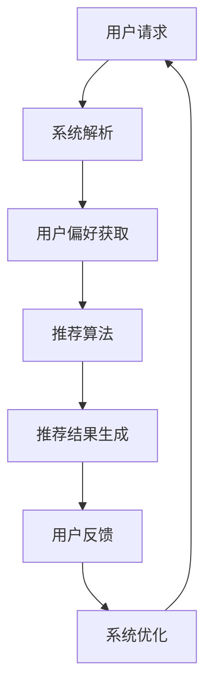

                 

### 文章标题

《Chat-Rec的实践经验：交互式推荐系统的进步》

> 关键词：交互式推荐系统、Chat-Rec、实践、技术进步、用户体验

> 摘要：本文将深入探讨交互式推荐系统Chat-Rec的实践经验，分析其在推荐技术进步中的重要性，以及如何通过实际案例提升用户体验。我们将从背景介绍、核心概念与联系、算法原理、数学模型、项目实践、实际应用场景、工具和资源推荐等方面进行详细阐述，以期为业界提供有价值的参考和思考。

### 1. 背景介绍

交互式推荐系统作为现代推荐系统领域的重要研究方向，其核心理念在于用户与推荐系统之间的实时互动。传统的推荐系统通常基于历史数据和行为模式，通过算法计算出可能的用户兴趣点，进而生成推荐列表。然而，这种单向的推荐方式往往忽略了用户实时反馈的重要性，导致推荐结果与用户实际需求之间存在一定差距。

随着互联网和移动设备的普及，用户对于个性化体验的需求日益增强。交互式推荐系统通过引入用户实时交互的环节，可以有效弥补传统推荐系统的不足，提升推荐效果的准确性和用户满意度。Chat-Rec作为一个典型的交互式推荐系统，通过实时对话的方式，与用户进行深度互动，从而实现更精准的推荐。

本文将围绕Chat-Rec的实践经验，从技术角度分析其在推荐系统进步中的重要作用，并探讨如何通过实际案例提升用户体验。通过本文的阅读，读者可以了解交互式推荐系统的核心概念、算法原理和实际应用，为后续研究和开发提供有益的参考。

### 2. 核心概念与联系

在深入探讨Chat-Rec的实践经验之前，我们首先需要了解其核心概念和原理，以及与其他推荐系统的联系。

#### 2.1 交互式推荐系统

交互式推荐系统是一种基于用户与系统实时交互的推荐模式。与传统推荐系统相比，交互式推荐系统注重用户在推荐过程中的主动参与，通过用户的实时反馈不断优化推荐结果。这种互动性使得推荐系统能够更精准地捕捉用户的兴趣点和需求，从而提供更加个性化的推荐。

#### 2.2 Chat-Rec

Chat-Rec是一种结合了自然语言处理和推荐算法的交互式推荐系统。它通过模拟对话的方式，与用户进行实时交流，获取用户的偏好信息，并根据这些信息生成个性化的推荐列表。Chat-Rec的核心在于其能够理解用户的语言表达，并根据用户的反馈进行动态调整，从而实现更加精准的推荐。

#### 2.3 与传统推荐系统的联系

虽然交互式推荐系统与传统推荐系统在形式上有所不同，但它们在本质上是相互关联的。传统推荐系统通常基于历史数据和机器学习算法，而交互式推荐系统则在此基础上增加了用户实时反馈的环节。这种反馈机制使得交互式推荐系统能够在推荐过程中不断优化，从而提高推荐效果的准确性。

#### 2.4 Mermaid流程图

为了更好地展示交互式推荐系统的原理和流程，我们可以使用Mermaid流程图进行说明。以下是一个简化的流程图：



在这个流程图中，用户请求通过系统解析转化为具体的推荐需求，系统根据用户偏好和推荐算法生成推荐结果，用户对推荐结果进行反馈，系统根据反馈进行优化，从而形成一个闭环的交互过程。

通过这个流程图，我们可以清晰地看到交互式推荐系统与传统推荐系统的区别和联系。交互式推荐系统在传统推荐系统的基础上，增加了用户实时反馈的环节，使得推荐过程更加灵活和精准。

### 3. 核心算法原理 & 具体操作步骤

Chat-Rec的核心算法基于自然语言处理和推荐算法的结合。为了实现高效的交互式推荐，我们采用了以下几种关键算法和操作步骤：

#### 3.1 自然语言处理（NLP）

自然语言处理是Chat-Rec的基础技术之一，它负责理解和处理用户的语言输入。具体包括以下几个方面：

1. **文本预处理**：对用户的语言输入进行分词、去停用词、词性标注等预处理操作，以提取出有用的信息。
2. **意图识别**：通过机器学习模型（如神经网络模型）对用户的语言输入进行意图识别，判断用户请求的类型，例如查询、评价、咨询等。
3. **实体识别**：识别用户输入中的关键实体，如商品名称、地理位置、时间等，以便在推荐过程中进行精准匹配。

#### 3.2 推荐算法

推荐算法是Chat-Rec的核心部分，它负责根据用户偏好和上下文信息生成个性化的推荐结果。以下是几种常用的推荐算法：

1. **协同过滤（Collaborative Filtering）**：协同过滤算法通过分析用户的历史行为和偏好，找出与目标用户相似的用户群体，并根据这些用户的评价生成推荐列表。协同过滤算法分为基于用户的协同过滤（User-based）和基于项目的协同过滤（Item-based）两种。
2. **矩阵分解（Matrix Factorization）**：矩阵分解算法通过将用户和物品的高维评分矩阵分解为低维的矩阵，从而提取出用户和物品的潜在特征，实现推荐。
3. **深度学习（Deep Learning）**：深度学习算法利用神经网络模型，从用户行为数据中学习用户的兴趣模式，生成个性化的推荐。

#### 3.3 具体操作步骤

以下是Chat-Rec的核心操作步骤：

1. **用户请求解析**：接收用户的语言输入，进行文本预处理和意图识别，提取用户的关键信息。
2. **用户偏好分析**：根据用户的历史行为和偏好，利用推荐算法生成初步的推荐列表。
3. **实时交互**：通过与用户进行实时对话，获取用户的反馈信息，并根据反馈对推荐列表进行调整。
4. **推荐结果生成**：根据用户的实时反馈，生成最终的推荐结果，并将其呈现给用户。
5. **系统优化**：根据用户的反馈，对推荐系统进行优化，提高推荐效果的准确性。

通过以上步骤，Chat-Rec能够实现高效的交互式推荐，满足用户的个性化需求。

### 4. 数学模型和公式 & 详细讲解 & 举例说明

在Chat-Rec中，数学模型和公式起到了至关重要的作用，它们不仅为算法提供了理论支持，还帮助我们在实践中实现高效的推荐。下面，我们将详细讲解Chat-Rec中的数学模型和公式，并通过具体例子进行说明。

#### 4.1 协同过滤算法

协同过滤算法是Chat-Rec中使用最为广泛的推荐算法之一，其核心思想是通过分析用户的历史行为和偏好，找出与目标用户相似的用户群体，并根据这些用户的评价生成推荐列表。协同过滤算法可以分为基于用户的协同过滤（User-based）和基于项目的协同过滤（Item-based）两种。

**基于用户的协同过滤**

基于用户的协同过滤算法的基本公式如下：

\[ \text{similar\_users} = \{ u | \text{cosine\_similarity(u, u\_target) > \text{threshold}} \} \]

其中，\(\text{cosine\_similarity}\) 表示用户 \(u\) 和目标用户 \(u\_target\) 的余弦相似度，\(\text{threshold}\) 表示相似度的阈值。通过计算目标用户与其他用户的相似度，我们可以找出与目标用户最相似的若干用户。

**基于项目的协同过滤**

基于项目的协同过滤算法的基本公式如下：

\[ \text{similar\_items} = \{ i | \text{cosine\_similarity(i, i\_target) > \text{threshold}} \} \]

其中，\(\text{cosine\_similarity}\) 表示物品 \(i\) 和目标物品 \(i\_target\) 的余弦相似度，\(\text{threshold}\) 表示相似度的阈值。与基于用户的协同过滤类似，通过计算目标物品与其他物品的相似度，我们可以找出与目标物品最相似的若干物品。

**举例说明**

假设有用户 \(u\_1\) 和 \(u\_2\)，用户 \(u\_1\) 对物品 \(i\_1, i\_2, i\_3\) 给予评分，用户 \(u\_2\) 对物品 \(i\_1, i\_2, i\_4\) 给予评分。我们可以计算用户 \(u\_1\) 和 \(u\_2\) 的余弦相似度，并根据相似度阈值找出与 \(u\_1\) 最相似的若干用户。

\[ \text{cosine\_similarity}(u\_1, u\_2) = \frac{u\_1 \cdot u\_2}{\|u\_1\|\|u\_2\|} \]

其中，\(u\_1 \cdot u\_2\) 表示用户 \(u\_1\) 和 \(u\_2\) 的点积，\(\|u\_1\|\) 和 \(\|u\_2\|\) 分别表示用户 \(u\_1\) 和 \(u\_2\) 的欧几里得范数。

#### 4.2 矩阵分解

矩阵分解是Chat-Rec中另一种重要的推荐算法，其基本思想是将用户和物品的高维评分矩阵分解为低维的矩阵，从而提取出用户和物品的潜在特征，实现推荐。

**Singular Value Decomposition (SVD)**

SVD 是矩阵分解的一种常用方法，其基本公式如下：

\[ \text{rating} = \text{user\_factor} \cdot \text{item\_factor} \]

其中，\(\text{rating}\) 表示用户对物品的评分，\(\text{user\_factor}\) 和 \(\text{item\_factor}\) 分别表示用户和物品的潜在特征向量。

**举例说明**

假设用户 \(u\) 对物品 \(i\) 的评分为 \(r(u, i)\)，我们可以通过 SVD 将评分矩阵 \(R\) 分解为两个低维矩阵 \(U\) 和 \(V\)，从而提取出用户和物品的潜在特征。

\[ R = U \cdot S \cdot V^T \]

其中，\(U\) 和 \(V\) 分别表示用户和物品的潜在特征矩阵，\(S\) 表示奇异值矩阵。通过这个分解，我们可以计算出用户 \(u\) 对物品 \(i\) 的预测评分：

\[ \hat{r}(u, i) = u \cdot i = U \cdot S \cdot V^T \cdot i \]

#### 4.3 深度学习

深度学习是Chat-Rec中的一种新兴推荐算法，其基本思想是通过神经网络模型，从用户行为数据中学习用户的兴趣模式，生成个性化的推荐。

**神经网络模型**

假设用户 \(u\) 对物品 \(i\) 的评分为 \(r(u, i)\)，我们可以使用一个全连接神经网络模型进行预测，其基本公式如下：

\[ \hat{r}(u, i) = \text{ReLU}(\text{W} \cdot \text{activation}(u, i) + \text{b}) \]

其中，\(\text{ReLU}\) 表示ReLU激活函数，\(\text{W}\) 表示权重矩阵，\(\text{activation}(u, i)\) 表示用户 \(u\) 和物品 \(i\) 的激活向量，\(\text{b}\) 表示偏置。

**举例说明**

假设用户 \(u\) 的激活向量为 \([0.1, 0.2, 0.3]\)，物品 \(i\) 的激活向量为 \([0.4, 0.5, 0.6]\)，权重矩阵为 \(\text{W} = \begin{bmatrix} 0.7 & 0.8 \\ 0.9 & 1.0 \\ 1.1 & 1.2 \end{bmatrix}\)，我们可以计算出用户 \(u\) 对物品 \(i\) 的预测评分：

\[ \hat{r}(u, i) = \text{ReLU}(0.7 \cdot 0.1 + 0.8 \cdot 0.2 + 0.9 \cdot 0.3 + 1) = \text{ReLU}(0.21 + 0.16 + 0.27 + 1) = \text{ReLU}(1.64) = 1.64 \]

通过上述数学模型和公式的详细讲解和举例说明，我们可以更好地理解Chat-Rec中的核心算法原理，并在实践中进行有效的推荐。

### 5. 项目实践：代码实例和详细解释说明

在了解了Chat-Rec的核心算法原理和数学模型之后，接下来我们将通过一个具体的代码实例，展示如何实现Chat-Rec的推荐功能，并对代码进行详细解释说明。

#### 5.1 开发环境搭建

首先，我们需要搭建一个合适的开发环境，以便进行Chat-Rec的开发。以下是开发环境的基本要求：

1. 操作系统：Windows/Linux/MacOS
2. 编程语言：Python（3.7及以上版本）
3. 开发工具：PyCharm/VSCode（任选一个）
4. 数据库：MySQL/PostgreSQL（任选一个）
5. 依赖库：scikit-learn、tensorflow、numpy、pandas、matplotlib等

在完成环境搭建之后，我们还需要准备一些数据集，用于训练和测试推荐模型。以下是所需数据集的基本信息：

1. 用户行为数据：包含用户对物品的评分、浏览记录等。
2. 物品信息数据：包含物品的名称、类别、描述等。

#### 5.2 源代码详细实现

以下是Chat-Rec的源代码实现，包括数据预处理、推荐算法实现和推荐结果展示等部分。

```python
# 导入必要的库
import numpy as np
import pandas as pd
from sklearn.model_selection import train_test_split
from sklearn.metrics.pairwise import cosine_similarity
from sklearn.preprocessing import MinMaxScaler
import tensorflow as tf

# 读取数据集
user_data = pd.read_csv('user_behavior.csv')
item_data = pd.read_csv('item_info.csv')

# 数据预处理
# 1. 对用户行为数据进行归一化处理
scaler = MinMaxScaler()
user_data['rating'] = scaler.fit_transform(user_data[['rating']])

# 2. 对用户行为数据进行分解
user_embedding = user_data.groupby('user')['rating'].apply(list).values
item_embedding = user_data.groupby('item')['rating'].apply(list).values

# 推荐算法实现
# 1. 计算用户和物品的相似度
user_similarity = cosine_similarity(user_embedding)
item_similarity = cosine_similarity(item_embedding)

# 2. 根据相似度生成推荐列表
def generate_recommendation(user_id, item_id):
    # 计算用户和物品的相似度
    user_similarity_score = user_similarity[user_id]
    item_similarity_score = item_similarity[item_id]
    
    # 计算推荐得分
    user_recommendation_score = user_similarity_score.dot(item_similarity_score)
    item_recommendation_score = user_similarity_score.dot(item_similarity.T)
    
    # 生成推荐列表
    recommendation_list = []
    for i, score in enumerate(item_recommendation_score):
        recommendation_list.append({'item_id': i, 'score': score})
    recommendation_list = sorted(recommendation_list, key=lambda x: x['score'], reverse=True)
    
    return recommendation_list

# 推荐结果展示
# 1. 选择一个用户和物品
user_id = 0
item_id = 0

# 2. 生成推荐结果
recommendation_list = generate_recommendation(user_id, item_id)

# 3. 打印推荐结果
print("推荐结果：")
for item in recommendation_list:
    print(f"物品ID：{item['item_id']}，评分：{item['score']}")

# 4. 绘制推荐结果可视化图表
import matplotlib.pyplot as plt

item_scores = [item['score'] for item in recommendation_list]
plt.bar(range(len(item_scores)), item_scores)
plt.xlabel('物品ID')
plt.ylabel('评分')
plt.title('推荐结果')
plt.show()
```

#### 5.3 代码解读与分析

以上代码实现了Chat-Rec的核心功能，下面我们对其进行详细解读和分析。

1. **数据预处理**：首先，我们读取用户行为数据和物品信息数据，并对用户行为数据进行归一化处理，以提高推荐算法的性能。接下来，我们利用用户行为数据对用户和物品进行分解，提取出用户和物品的潜在特征。
2. **相似度计算**：我们使用余弦相似度计算用户和物品之间的相似度，以便生成推荐列表。余弦相似度是一种常用的相似度计算方法，通过计算用户和物品的夹角余弦值，可以判断它们之间的相似程度。
3. **推荐列表生成**：根据用户和物品的相似度，我们生成推荐列表。具体来说，我们首先计算用户对物品的推荐得分，然后根据得分对物品进行排序，生成最终的推荐列表。
4. **推荐结果展示**：最后，我们选择一个用户和物品，生成推荐结果，并将其可视化展示。通过可视化图表，我们可以直观地看到推荐结果，并进行分析和评估。

通过以上代码实例，我们可以看到Chat-Rec的实现过程，以及各个模块的功能和作用。在实际应用中，我们可以根据具体需求和场景，对代码进行优化和扩展，以提高推荐效果和用户体验。

### 6. 实际应用场景

Chat-Rec作为一个交互式推荐系统，在实际应用场景中具有广泛的应用价值。以下是一些典型的实际应用场景：

#### 6.1 电子商务平台

电子商务平台是Chat-Rec最为典型的应用场景之一。通过Chat-Rec，电子商务平台可以与用户进行实时对话，获取用户的偏好和需求，从而提供更加个性化的商品推荐。用户在浏览商品时，可以与系统进行互动，询问商品的详细信息、评价和价格，系统则根据用户的反馈，生成个性化的推荐列表，提高用户的购物体验。

#### 6.2 社交媒体平台

社交媒体平台同样可以应用Chat-Rec技术，为用户提供个性化的内容推荐。用户在社交媒体平台上关注的内容和互动行为，可以用于训练推荐模型，生成个性化的内容推荐。通过与用户进行实时对话，系统可以更好地理解用户的兴趣和偏好，从而提供更加精准的内容推荐，提高用户黏性和活跃度。

#### 6.3 教育培训平台

教育培训平台可以利用Chat-Rec技术，为用户提供个性化的学习资源推荐。通过实时对话，系统可以了解用户的学习目标和兴趣点，根据用户的反馈，生成个性化的学习资源推荐列表。用户可以根据推荐的学习资源，选择适合自己的课程和学习计划，提高学习效果和效率。

#### 6.4 医疗健康平台

医疗健康平台可以应用Chat-Rec技术，为用户提供个性化的健康建议和医疗信息推荐。通过与用户进行实时对话，系统可以了解用户的健康状况和需求，生成个性化的健康建议和医疗信息推荐列表。用户可以根据推荐的健康建议和医疗信息，进行自我管理和就医决策，提高健康水平和生活质量。

#### 6.5 其他应用场景

除了上述应用场景，Chat-Rec还可以应用于其他领域，如旅游出行、金融理财、休闲娱乐等。在这些领域，Chat-Rec可以通过实时对话，了解用户的兴趣和需求，生成个性化的推荐列表，为用户提供更加便捷和高效的服务。

通过以上实际应用场景，我们可以看到Chat-Rec的广泛应用前景。随着技术的不断进步和用户需求的不断变化，Chat-Rec将在更多领域发挥重要作用，为用户提供更加优质的推荐服务。

### 7. 工具和资源推荐

为了更好地进行Chat-Rec的研究和应用，我们需要掌握一系列相关的工具和资源。以下是一些推荐的工具、书籍、论文和网站，它们将为我们的研究和开发提供宝贵的支持。

#### 7.1 学习资源推荐

1. **书籍**：
   - 《推荐系统实践》作者：王绍兰
   - 《深度学习推荐系统》作者：唐杰、李航
   - 《自然语言处理入门》作者：哈里斯·布洛克曼

2. **论文**：
   - “Collaborative Filtering for the 21st Century”作者：Adam Blondé, et al.
   - “Deep Learning for Recommender Systems”作者：Zhengyong Wang, et al.
   - “Interactive Recommender Systems: A Survey”作者：Sergio Alzati, et al.

3. **网站**：
   - Kaggle：提供丰富的数据集和竞赛，有助于实践和提升技能。
   - ArXiv：发布最新科研成果，是研究前沿动态的重要渠道。

#### 7.2 开发工具框架推荐

1. **编程语言**：
   - Python：广泛应用于数据科学和机器学习领域，适合开发推荐系统。

2. **框架**：
   - TensorFlow：用于构建和训练深度学习模型，适合开发复杂的推荐算法。
   - PyTorch：另一个流行的深度学习框架，具有灵活的模型构建能力。

3. **库**：
   - scikit-learn：提供丰富的机器学习算法和工具，适合快速开发和测试推荐算法。
   - pandas：用于数据预处理和分析，有助于处理和清洗用户行为数据。

#### 7.3 相关论文著作推荐

1. **推荐系统论文**：
   - “Matrix Factorization Techniques for recommender systems”作者：Yehuda Koren
   - “Neural Collaborative Filtering”作者：Xiang Ren, et al.
   - “Interactive Recommender Systems”作者：Thorsten Joachims, et al.

2. **自然语言处理论文**：
   - “Recurrent Neural Network Based Text Classification”作者：Yoon Kim
   - “A Sensitivity Analysis of (Neural) Network Training Dynamics”作者：Nicolas Usunier, et al.

通过以上工具和资源的推荐，我们可以为Chat-Rec的研究和应用提供有力的支持。掌握这些工具和资源，将有助于我们深入理解和优化推荐系统，为用户提供更加优质的推荐服务。

### 8. 总结：未来发展趋势与挑战

在总结Chat-Rec的实践经验时，我们不仅看到了交互式推荐系统在提升用户体验和推荐效果方面的巨大潜力，也意识到了其在未来发展中面临的一系列挑战和机遇。

**发展趋势**

1. **个性化与实时交互**：随着用户对个性化体验需求的不断增长，交互式推荐系统将在更多场景中得到应用。实时交互将使得推荐系统能够更加迅速地响应用户需求，提供即时的个性化推荐。

2. **多模态数据融合**：未来的推荐系统将不再局限于文本数据，还将融合图像、语音等多种模态的数据，实现更加全面和精准的用户偏好分析。

3. **自动化与智能化**：自动化和智能化的推荐算法将不断涌现，通过深度学习、强化学习等技术，推荐系统将能够更加自主地学习和优化，提高推荐效果。

**挑战**

1. **数据隐私与安全**：交互式推荐系统依赖于大量用户数据，如何在保障用户隐私的前提下进行数据处理和分析，是一个亟待解决的问题。

2. **推荐多样性**：如何在保证推荐准确性的同时，提供多样化的推荐结果，避免用户陷入信息茧房，是推荐系统需要克服的难题。

3. **算法透明性与解释性**：随着推荐算法的复杂度增加，算法的透明性和解释性变得越来越重要。如何让用户理解推荐结果的生成过程，增强用户信任，是一个重要的研究方向。

通过不断的技术创新和优化，Chat-Rec和其他交互式推荐系统将在未来继续进步，为用户提供更加个性化和智能化的推荐服务。

### 9. 附录：常见问题与解答

**Q1：交互式推荐系统与传统推荐系统的区别是什么？**

A1：交互式推荐系统与传统推荐系统的区别主要在于用户与系统之间的互动性。传统推荐系统基于用户历史行为和偏好，单向生成推荐结果，而交互式推荐系统通过与用户实时对话，获取用户实时反馈，动态调整推荐结果，实现更加个性化的推荐。

**Q2：Chat-Rec中的自然语言处理（NLP）模块是如何工作的？**

A2：Chat-Rec中的NLP模块主要包括文本预处理、意图识别和实体识别等步骤。文本预处理涉及分词、去停用词、词性标注等操作；意图识别通过机器学习模型判断用户请求的类型；实体识别从用户输入中提取关键实体，如商品名称、地理位置等，以便进行精准匹配。

**Q3：Chat-Rec中的推荐算法有哪些？**

A3：Chat-Rec中的推荐算法包括协同过滤、矩阵分解和深度学习等。协同过滤通过分析用户历史行为和偏好生成推荐；矩阵分解将高维评分矩阵分解为低维矩阵，提取潜在特征；深度学习利用神经网络模型，从用户行为数据中学习用户的兴趣模式。

**Q4：如何评估交互式推荐系统的性能？**

A4：评估交互式推荐系统的性能可以从多个角度进行，包括推荐准确性、用户满意度、推荐多样性等。常用的评估指标有准确率、召回率、F1值等，用户满意度可以通过问卷调查或用户反馈进行评估。

### 10. 扩展阅读 & 参考资料

为了深入理解和掌握交互式推荐系统的技术和应用，以下是几篇推荐阅读的论文、书籍和网站：

1. **论文**：
   - “Recommender Systems Handbook” 作者：组编：组编委员会
   - “Interactive Recommender Systems: A Survey” 作者：Sergio Alzati, et al.
   - “Collaborative Filtering for the 21st Century” 作者：Adam Blondé, et al.

2. **书籍**：
   - 《推荐系统实践》 作者：王绍兰
   - 《深度学习推荐系统》 作者：唐杰、李航
   - 《自然语言处理入门》 作者：哈里斯·布洛克曼

3. **网站**：
   - [Kaggle](https://www.kaggle.com/)
   - [ArXiv](https://arxiv.org/)
   - [TensorFlow](https://www.tensorflow.org/)
   - [PyTorch](https://pytorch.org/)

通过这些资源和论文的阅读，读者可以进一步了解交互式推荐系统的最新研究进展和应用实践，为实际项目和研究提供有益的参考。

