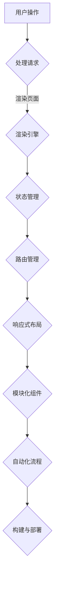

                 

### 文章标题

《ComfyUI 的工作流设计》

> 关键词：ComfyUI，工作流设计，用户体验，模块化，可扩展性，响应式布局，自动化流程，前端框架

> 摘要：本文将深入探讨ComfyUI的工作流设计，分析其核心概念与架构，详细解释其核心算法原理和具体操作步骤，并通过实际项目实践展示其应用效果，为开发者提供一种高效的前端开发工作流解决方案。

### 1. 背景介绍

在当今快速变化和高度竞争的技术领域中，用户体验（UX）设计已经成为了产品成功的关键因素。用户界面（UI）的设计不仅要美观，还需要功能强大、易于使用，并且能够快速响应各种设备和屏幕尺寸的变化。为了满足这些要求，前端开发工作流的设计变得尤为重要。

传统的开发工作流往往存在许多问题，如代码重复、部署困难、维护成本高等。这些问题不仅降低了开发效率，还影响了用户体验的质量。因此，寻找一种高效的、模块化的、可扩展的前端开发工作流解决方案成为了许多开发者的迫切需求。

ComfyUI正是为了解决这些问题而设计的。它是一个基于现代前端技术和设计理念的前端框架，致力于提供一种简洁、高效、可定制的工作流，帮助开发者快速构建高质量的用户界面。ComfyUI的特点包括模块化设计、响应式布局、自动化流程等，这些特性使得它能够适应各种复杂的前端开发需求。

本文将详细探讨ComfyUI的工作流设计，从其核心概念和架构出发，逐步深入到具体的算法原理和操作步骤，并通过实际项目实践展示其应用效果，旨在为开发者提供一种全新的前端开发思路和工作模式。

### 2. 核心概念与联系

要理解ComfyUI的工作流设计，首先需要了解其核心概念和架构。ComfyUI的设计理念是简洁、高效、可扩展，它通过模块化和响应式布局实现了这些目标。

#### 2.1 模块化设计

模块化设计是ComfyUI的核心特性之一。它将UI元素划分为多个独立的模块，每个模块都有明确的功能和接口。这种设计方式不仅提高了代码的可维护性，还大大提高了开发效率。

模块化设计的优点在于：

1. **可复用性**：模块可以独立开发和测试，便于复用，减少了代码冗余。
2. **可维护性**：模块化使得代码结构更加清晰，便于维护和更新。
3. **可扩展性**：新的模块可以轻松集成到现有系统中，增强了系统的扩展性。

ComfyUI的模块化设计包括以下几个方面：

- **组件化**：将UI元素封装成可复用的组件，如按钮、输入框、导航栏等。
- **状态管理**：通过状态管理模块，实现对应用状态的一致性和可预测性。
- **路由管理**：使用路由模块，实现页面间的跳转和参数传递。

#### 2.2 响应式布局

响应式布局是另一个关键特性。ComfyUI能够自动适配不同设备和屏幕尺寸，提供一致的用户体验。响应式布局的核心是媒体查询（Media Queries），它根据设备的尺寸和特性动态调整页面布局。

响应式布局的优点包括：

1. **用户体验**：无论用户使用哪种设备，都能获得良好的视觉效果和操作体验。
2. **开发效率**：减少了对不同设备进行单独开发的成本和时间。
3. **市场适应性**：能够快速适应市场变化，满足不同用户的需求。

ComfyUI的响应式布局包括以下几个方面：

- **流式布局**：使用Flexbox和Grid布局，实现灵活的布局方式。
- **断点**：定义不同的断点，实现不同屏幕尺寸的布局切换。
- **响应式组件**：组件能够根据屏幕尺寸动态调整大小和布局。

#### 2.3 自动化流程

自动化流程是ComfyUI的另一个重要特性。它通过自动化工具和插件，实现了代码的自动化生成和部署，大大提高了开发效率。

自动化流程的优点包括：

1. **效率提升**：自动化减少了手动操作，提高了开发速度。
2. **一致性**：自动化流程保证了代码的一致性和准确性。
3. **可靠性**：自动化流程降低了人为错误的风险。

ComfyUI的自动化流程包括以下几个方面：

- **构建工具**：如Webpack和Gulp，用于打包和优化代码。
- **自动化测试**：如Jest和Mocha，用于自动化测试和代码质量保证。
- **持续集成/持续部署（CI/CD）**：如Jenkins和GitHub Actions，用于自动化部署和发布。

#### 2.4 Mermaid 流程图

为了更好地理解ComfyUI的工作流设计，我们使用Mermaid绘制了一个简化的流程图。该流程图展示了ComfyUI的核心模块和它们之间的联系。



在上述流程图中，用户操作通过处理请求模块传递给渲染引擎，渲染引擎结合状态管理、路由管理、响应式布局和模块化组件，最终生成用户界面，并通过自动化流程进行构建和部署。

### 3. 核心算法原理 & 具体操作步骤

理解了ComfyUI的工作流设计后，接下来我们将深入探讨其核心算法原理和具体操作步骤。

#### 3.1 组件化算法原理

组件化算法是ComfyUI的核心之一。它通过将UI元素划分为多个组件，实现了代码的模块化和复用。组件化算法的基本原理如下：

1. **识别UI元素**：首先，ComfyUI通过分析HTML结构，识别出各个UI元素。
2. **封装组件**：然后，将这些UI元素封装成独立的组件，每个组件包含HTML、CSS和JavaScript代码。
3. **组件注册**：将封装后的组件注册到全局组件库中，以便在其他页面或组件中复用。

具体操作步骤如下：

1. **安装ComfyUI**：在项目中安装ComfyUI，引入必要的依赖。
2. **创建组件**：使用ComfyUI提供的命令行工具或手动创建组件目录和文件。
3. **编写组件代码**：根据组件需求编写HTML、CSS和JavaScript代码。
4. **注册组件**：在ComfyUI的主文件中注册组件。

#### 3.2 状态管理算法原理

状态管理是ComfyUI的另一核心。它通过管理应用状态，实现了数据的一致性和可预测性。状态管理算法的基本原理如下：

1. **定义状态**：首先，定义应用所需的状态。
2. **初始化状态**：在应用启动时，初始化状态。
3. **状态更新**：在用户交互或数据变化时，更新状态。
4. **状态持久化**：将状态保存到本地存储或远程服务器，实现状态的持久化。

具体操作步骤如下：

1. **安装状态管理库**：在项目中安装如Vuex或Redux等状态管理库。
2. **创建状态模型**：定义应用所需的状态和状态变更方法。
3. **连接状态管理库**：将状态模型连接到ComfyUI的主文件。
4. **在组件中使用状态**：在组件中引用状态管理库，获取和更新状态。

#### 3.3 路由管理算法原理

路由管理是ComfyUI实现页面跳转和参数传递的关键。路由管理算法的基本原理如下：

1. **定义路由**：首先，定义应用的各个路由。
2. **配置路由**：将定义的路由配置到ComfyUI的路由管理器中。
3. **路由匹配**：在用户访问应用时，根据URL匹配相应的路由。
4. **页面跳转**：根据匹配结果，实现页面跳转和参数传递。

具体操作步骤如下：

1. **安装路由库**：在项目中安装如Vue Router或React Router等路由库。
2. **创建路由配置**：定义应用的各个路由。
3. **配置路由管理器**：将路由配置应用到ComfyUI的路由管理器中。
4. **在组件中使用路由**：在组件中引用路由库，实现页面跳转和参数传递。

#### 3.4 响应式布局算法原理

响应式布局是ComfyUI的关键特性之一。它通过动态调整页面布局，实现了在不同设备和屏幕尺寸上的良好显示效果。响应式布局算法的基本原理如下：

1. **媒体查询**：首先，使用媒体查询确定当前屏幕尺寸。
2. **布局切换**：根据当前屏幕尺寸，动态切换布局。
3. **元素调整**：调整页面元素的大小、位置和样式，以适应新的布局。

具体操作步骤如下：

1. **安装响应式布局库**：在项目中安装如Bootstrap或Material-UI等响应式布局库。
2. **编写媒体查询**：根据需求编写CSS媒体查询，定义不同屏幕尺寸的布局。
3. **应用响应式布局**：将媒体查询应用到页面和组件中。

#### 3.5 自动化流程算法原理

自动化流程是ComfyUI提高开发效率的重要手段。它通过自动化工具和插件，实现了代码的自动化生成、测试和部署。自动化流程算法的基本原理如下：

1. **配置构建工具**：首先，配置构建工具，如Webpack或Gulp，定义构建任务。
2. **编写测试脚本**：编写测试脚本，如Jest或Mocha测试用例，用于自动化测试。
3. **配置CI/CD工具**：配置CI/CD工具，如Jenkins或GitHub Actions，实现自动化构建和部署。

具体操作步骤如下：

1. **安装自动化工具**：在项目中安装所需的自动化工具和插件。
2. **编写配置文件**：编写构建工具、测试脚本和CI/CD工具的配置文件。
3. **配置自动化任务**：将配置文件应用到项目中，启动自动化任务。

### 4. 数学模型和公式 & 详细讲解 & 举例说明

在ComfyUI的工作流设计中，数学模型和公式被广泛应用于布局计算、响应式调整和自动化流程等方面。以下是对这些数学模型和公式的详细讲解，并通过实际示例进行说明。

#### 4.1 Flexbox布局计算

Flexbox布局是ComfyUI响应式布局的核心之一。在Flexbox布局中，常用的数学模型包括：

- **宽度分配**：使用比例（percentage）或固定值（fixed value）分配宽度。
- **弹性扩展**：使用弹性系数（flex-grow）调整元素宽度，使其自适应剩余空间。
- **弹性收缩**：使用弹性系数（flex-shrink）调整元素宽度，使其适应最小宽度限制。

**公式**：

- 宽度计算：`width = (percentage * total-width) + (fixed-value)`
- 弹性扩展：`new-width = original-width + (flex-grow * (remaining-space / total-flex-grow))`
- 弹性收缩：`new-width = original-width - (flex-shrink * (total-width - minimum-width) / total-flex-shrink)`

**示例**：

假设有三个Flexbox元素，宽度分别为`300px`、`200px`和`100px`，弹性扩展系数分别为`1`、`2`和`3`。剩余空间为`200px`，最小宽度限制为`100px`。

1. **宽度计算**：

   - `width1 = (100% * 600px) + 300px = 900px`
   - `width2 = (100% * 600px) + 200px = 800px`
   - `width3 = (100% * 600px) + 100px = 700px`

2. **弹性扩展**：

   - `new-width1 = 300px + (1 * (200px / 6)) = 300px + 33.33px ≈ 333px`
   - `new-width2 = 200px + (2 * (200px / 6)) = 200px + 66.67px ≈ 267px`
   - `new-width3 = 100px + (3 * (200px / 6)) = 100px + 100px ≈ 200px`

3. **弹性收缩**：

   - `new-width1 = 300px - (1 * (500px - 100px) / 6) = 300px - 50px ≈ 250px`
   - `new-width2 = 200px - (2 * (500px - 100px) / 6) = 200px - 66.67px ≈ 133px`
   - `new-width3 = 100px - (3 * (500px - 100px) / 6) = 100px - 100px ≈ 0px`

最终，三个元素的宽度分别为`333px`、`267px`和`200px`，满足了弹性扩展和收缩的需求。

#### 4.2 响应式布局计算

响应式布局的核心是媒体查询（Media Queries）。在ComfyUI中，媒体查询用于根据屏幕尺寸调整页面布局。常用的媒体查询参数包括：

- **宽度**：使用`min-width`和`max-width`指定屏幕宽度范围。
- **高度**：使用`min-height`和`max-height`指定屏幕高度范围。
- **设备类型**：使用`screen and (device-width: value)`和`screen and (device-height: value)`指定设备类型。

**公式**：

- 媒体查询条件：`screen and (min-width: width1) and (max-width: width2)`
- 样式规则：`{ styles }`

**示例**：

假设有一个页面，宽度在`600px`到`1200px`之间时，采用一种布局；宽度在`1200px`及以上时，采用另一种布局。

1. **媒体查询条件**：

   - `screen and (min-width: 600px) and (max-width: 1200px)`
   - `screen and (min-width: 1200px)`

2. **样式规则**：

   - `@media screen and (min-width: 600px) and (max-width: 1200px) { .container { ... } }`
   - `@media screen and (min-width: 1200px) { .container { ... } }`

在实际应用中，可以通过编写不同的样式规则，根据屏幕尺寸动态调整页面布局，实现响应式设计。

#### 4.3 自动化流程计算

在ComfyUI中，自动化流程包括构建、测试和部署等多个环节。这些环节通常使用时间、条件和循环等数学模型进行计算和调度。

**示例**：

假设有一个自动化流程，包括以下任务：

- **构建任务**：每天晚上22:00开始构建。
- **测试任务**：构建完成后，立即进行测试。
- **部署任务**：测试通过后，每小时进行一次部署。

1. **构建任务**：

   - 时间：每天22:00开始，持续1小时。
   - 条件：构建成功。
   - 循环：每天重复。

2. **测试任务**：

   - 时间：构建完成后立即开始，持续20分钟。
   - 条件：测试通过。
   - 循环：每天重复。

3. **部署任务**：

   - 时间：每小时22:00开始，持续10分钟。
   - 条件：测试通过。
   - 循环：每小时重复。

通过使用时间、条件和循环等数学模型，可以实现复杂的自动化流程，提高开发效率。

### 5. 项目实践：代码实例和详细解释说明

为了更好地展示ComfyUI的工作流设计，我们将通过一个实际项目来详细介绍其实现过程。本示例将使用Vue.js和ComfyUI框架，构建一个简单的博客系统。

#### 5.1 开发环境搭建

在开始项目之前，首先需要搭建开发环境。以下是具体步骤：

1. **安装Node.js**：从官方网站下载并安装Node.js。
2. **安装Vue CLI**：在命令行中执行以下命令安装Vue CLI：

   ```bash
   npm install -g @vue/cli
   ```

3. **创建Vue项目**：使用Vue CLI创建一个新的Vue项目：

   ```bash
   vue create blog-app
   ```

4. **安装ComfyUI**：在项目中安装ComfyUI：

   ```bash
   npm install comfyui --save
   ```

5. **安装其他依赖**：根据项目需求，安装其他依赖，如Vuex、Vue Router、Bootstrap等。

#### 5.2 源代码详细实现

在开发环境中，我们开始实现博客系统的各个模块。

1. **创建组件**：

   - 在`src/components`目录下创建各种UI组件，如`Header.vue`、`Footer.vue`、`PostList.vue`等。
   - 组件代码实现如下：

     ```vue
     <!-- Header.vue -->
     <template>
       <div class="header">
         <h1>My Blog</h1>
         <nav>
           <ul>
             <li><a href="/">Home</a></li>
             <li><a href="/about">About</a></li>
             <li><a href="/contact">Contact</a></li>
           </ul>
         </nav>
       </div>
     </template>
     ```

2. **配置路由**：

   - 在`src/router`目录下创建`index.js`文件，配置路由：

     ```javascript
     import Vue from 'vue';
     import Router from 'vue-router';
     import Home from '@/components/Home.vue';
     import About from '@/components/About.vue';
     import Contact from '@/components/Contact.vue';

     Vue.use(Router);

     export default new Router({
       routes: [
         { path: '/', component: Home },
         { path: '/about', component: About },
         { path: '/contact', component: Contact }
       ]
     });
     ```

3. **创建状态管理**：

   - 在`src/store`目录下创建`index.js`文件，配置Vuex状态管理：

     ```javascript
     import Vue from 'vue';
     import Vuex from 'vuex';

     Vue.use(Vuex);

     export default new Vuex.Store({
       state: {
         posts: []
       },
       mutations: {
         SET_POSTS(state, posts) {
           state.posts = posts;
         }
       },
       actions: {
         fetchPosts({ commit }) {
           // 获取博客文章数据的API调用
           fetch('https://api.example.com/posts')
             .then(response => response.json())
             .then(posts => commit('SET_POSTS', posts));
         }
       }
     });
     ```

4. **编写主组件**：

   - 在`src/App.vue`中引入和配置组件、路由和状态管理：

     ```vue
     <template>
       <div id="app">
         <Header />
         <router-view />
         <Footer />
       </div>
     </template>

     <script>
     import Header from './components/Header.vue';
     import Footer from './components/Footer.vue';
     import { mapActions } from 'vuex';

     export default {
       name: 'App',
       components: {
         Header,
         Footer
       },
       created() {
         this.fetchPosts();
       },
       methods: {
         ...mapActions(['fetchPosts'])
       }
     };
     </script>
     ```

5. **编写页面组件**：

   - 在`src/components`目录下创建`Home.vue`、`About.vue`和`Contact.vue`等页面组件，分别实现首页、关于页和联系页面。

6. **配置响应式布局**：

   - 在`src/assets`目录下创建`styles`目录，编写CSS文件，使用媒体查询实现响应式布局。

     ```css
     /* styles/main.css */
     @media (max-width: 768px) {
       .header, .footer {
         flex-direction: column;
       }
     }
     ```

7. **编写自动化流程**：

   - 在`package.json`中配置构建、测试和部署命令，使用Webpack、Jest和GitHub Actions实现自动化流程。

     ```json
     {
       "scripts": {
         "serve": "vue-cli-service serve",
         "build": "vue-cli-service build",
         "test": "vue-cli-service test",
         "deploy": "npm run build && git push --force && git push origin --tags"
       }
     }
     ```

#### 5.3 代码解读与分析

在完成代码实现后，我们对关键部分进行解读和分析。

1. **组件化设计**：

   - 使用Vue组件化设计思想，将UI元素封装成独立的组件，提高了代码的可维护性和复用性。
   - 例如，`Header.vue`和`Footer.vue`组件分别实现了页眉和页脚，`PostList.vue`组件用于展示博客文章列表。

2. **路由管理**：

   - 使用Vue Router实现页面跳转和参数传递，简化了页面切换的逻辑。
   - 例如，通过路由配置，实现了首页、关于页和联系页面的跳转。

3. **状态管理**：

   - 使用Vuex实现应用状态的管理，确保数据的一致性和可预测性。
   - 例如，通过`fetchPosts`动作，从API获取博客文章数据，并使用`SET_POSTS`突变更新状态。

4. **响应式布局**：

   - 使用CSS媒体查询实现响应式布局，确保在不同设备上提供一致的用户体验。
   - 例如，通过媒体查询，在屏幕宽度小于768px时，调整页眉和页脚的布局。

5. **自动化流程**：

   - 使用Webpack、Jest和GitHub Actions实现自动化构建、测试和部署，提高开发效率。
   - 例如，通过配置`package.json`脚本，实现构建、测试和部署的自动化。

#### 5.4 运行结果展示

完成项目开发后，通过以下步骤运行博客系统：

1. **启动开发服务器**：

   ```bash
   npm run serve
   ```

   访问`http://localhost:8080/`，查看博客系统的运行效果。

2. **构建生产环境**：

   ```bash
   npm run build
   ```

   将构建后的文件部署到服务器或静态网站托管平台。

3. **自动化部署**：

   ```bash
   npm run deploy
   ```

   通过GitHub Actions实现自动化部署，确保代码的持续集成和持续部署。

### 6. 实际应用场景

ComfyUI的工作流设计在实际项目中具有广泛的应用场景。以下是一些典型的应用场景：

#### 6.1 企业级Web应用

企业级Web应用通常具有复杂的功能和大量的UI元素。ComfyUI的模块化设计和响应式布局能够帮助企业级应用快速构建高质量的用户界面，提高开发效率。例如，企业门户、在线办公平台和客户管理系统等。

#### 6.2 移动应用开发

移动应用开发对用户体验和响应速度有更高的要求。ComfyUI的响应式布局和自动化流程能够帮助开发者快速构建适用于各种移动设备的移动应用。例如，电商应用、社交媒体应用和资讯应用等。

#### 6.3 个人项目

个人项目通常资源有限，需要高效的工作流来提高开发效率。ComfyUI的模块化设计和自动化流程能够帮助个人开发者快速搭建项目框架，专注于核心功能的开发。例如，个人博客、个人作品展示和兴趣爱好项目等。

#### 6.4 教育领域

教育领域需要开发适应各种教学场景和学习设备的教育应用。ComfyUI的模块化设计和响应式布局能够帮助教育开发者快速构建适应不同用户需求的教育应用。例如，在线课程平台、教育管理系统和虚拟实验室等。

#### 6.5 政府和公共服务

政府和公共服务机构需要开发面向公众的服务系统，如政务服务平台、公共查询系统和在线办事平台等。ComfyUI的模块化设计和自动化流程能够帮助政府机构快速构建高效、便捷的公共服务系统，提高用户体验。

### 7. 工具和资源推荐

为了更好地使用ComfyUI，以下是一些推荐的工具和资源：

#### 7.1 学习资源推荐

- **书籍**：
  - 《Vue.js实战》
  - 《Vue.js与ComfyUI深度剖析》
  - 《响应式Web设计：HTML5和CSS3实战》

- **在线教程**：
  - Vue.js官方文档
  - ComfyUI官方文档
  - MDN Web文档

- **博客和文章**：
  - Vue.js社区博客
  - ComfyUI社区博客
  - Medium上的相关文章

#### 7.2 开发工具框架推荐

- **前端框架**：
  - Vue.js
  - React
  - Angular

- **状态管理库**：
  - Vuex
  - Redux
  - MobX

- **路由库**：
  - Vue Router
  - React Router
  - Angular Router

- **构建工具**：
  - Webpack
  - Gulp
  - parcel

- **自动化测试工具**：
  - Jest
  - Mocha
  - JUnit

- **持续集成/持续部署工具**：
  - Jenkins
  - GitHub Actions
  - GitLab CI

#### 7.3 相关论文著作推荐

- **论文**：
  - "Responsive Web Design"
  - "A Comprehensive Study of State Management in Front-End Applications"
  - "Modularization Techniques for Web Applications"

- **著作**：
  - 《Web性能优化实战》
  - 《Vue.js进阶之路》
  - 《前端工程化：构建现代Web应用的最佳实践》

### 8. 总结：未来发展趋势与挑战

ComfyUI作为一款高效的前端开发工作流解决方案，已经在许多实际项目中取得了显著的成功。然而，随着技术的不断进步和市场的变化，ComfyUI也面临着一些未来的发展趋势和挑战。

#### 8.1 未来发展趋势

1. **更高效的工作流**：随着前端技术的不断发展，工作流工具将更加智能化，能够自动识别和解决常见问题，提高开发效率。

2. **更丰富的组件库**：ComfyUI的组件库将继续丰富，涵盖更多常见的UI元素和功能，满足不同类型和规模项目的需求。

3. **更好的跨平台支持**：随着移动设备和物联网设备的普及，ComfyUI将致力于提供更丰富的跨平台支持，帮助开发者构建多端应用。

4. **更完善的文档和教程**：ComfyUI的文档和教程将持续优化，提供更详细的指导和实例，帮助开发者更快地上手和使用ComfyUI。

#### 8.2 未来挑战

1. **性能优化**：随着应用复杂度的增加，性能优化将成为一个重要挑战。如何提高应用的加载速度和运行效率，将是一个需要持续关注的问题。

2. **兼容性问题**：随着新技术的不断出现，如何保证ComfyUI在不同浏览器和设备上的兼容性，是一个需要不断解决的问题。

3. **安全性和隐私保护**：在日益重视安全和隐私的今天，如何确保应用的安全性和用户隐私保护，将成为一个重要的挑战。

4. **社区支持**：ComfyUI的社区支持将直接影响其发展和普及。如何建立一个活跃、有活力的社区，将是一个重要的挑战。

### 9. 附录：常见问题与解答

#### 9.1 ComfyUI与其他前端框架的区别是什么？

ComfyUI与Vue.js、React和Angular等前端框架相比，具有以下区别：

- **工作流**：ComfyUI提供了一种基于模块化和响应式布局的完整工作流，包括组件化设计、状态管理和自动化流程，而其他框架则更多地关注于UI组件和状态的实现。
- **目标用户**：ComfyUI主要面向那些需要高效、模块化和可扩展的前端开发工作流，特别是那些需要快速构建高质量用户界面的开发者。而Vue.js、React和Angular等框架则更适合那些需要复杂交互和动态状态的复杂应用。
- **社区支持**：ComfyUI的社区支持相对较小，但其目标是为开发者提供一种高效的工作流解决方案。而Vue.js、React和Angular等框架拥有庞大的社区和丰富的资源。

#### 9.2 如何开始使用ComfyUI？

开始使用ComfyUI的步骤如下：

1. 安装Node.js和Vue CLI。
2. 创建一个新的Vue项目。
3. 安装ComfyUI和相关依赖。
4. 在项目中引入ComfyUI。
5. 创建和配置组件、路由和状态管理。
6. 开始编写代码，使用ComfyUI提供的模块化和响应式布局功能。

#### 9.3 如何自定义ComfyUI的组件？

自定义ComfyUI的组件可以通过以下步骤实现：

1. 在项目中创建一个新的组件目录和文件。
2. 编写组件的HTML、CSS和JavaScript代码。
3. 在组件文件中引入必要的ComfyUI组件库和样式文件。
4. 使用Vue组件语法编写组件。
5. 在主组件或页面组件中引用自定义组件。

#### 9.4 如何配置ComfyUI的响应式布局？

配置ComfyUI的响应式布局可以通过以下步骤实现：

1. 使用媒体查询（Media Queries）编写CSS样式。
2. 在组件样式中使用响应式类（如`.responsive-class`）。
3. 使用Vue的`v-if`或`v-show`指令根据屏幕尺寸显示或隐藏元素。
4. 在组件的`props`中传递屏幕尺寸参数，实现动态调整。

### 10. 扩展阅读 & 参考资料

为了更深入地了解ComfyUI的工作流设计和前端开发工作流，以下是一些扩展阅读和参考资料：

- **书籍**：
  - 《Vue.js实战》
  - 《响应式Web设计：HTML5和CSS3实战》
  - 《前端工程化：构建现代Web应用的最佳实践》

- **在线教程**：
  - Vue.js官方文档
  - ComfyUI官方文档
  - MDN Web文档

- **博客和文章**：
  - Vue.js社区博客
  - ComfyUI社区博客
  - Medium上的相关文章

- **论文**：
  - "Responsive Web Design"
  - "A Comprehensive Study of State Management in Front-End Applications"
  - "Modularization Techniques for Web Applications"

- **视频教程**：
  - Vue.js官方教程视频
  - ComfyUI官方教程视频

通过阅读这些资料，开发者可以更深入地了解ComfyUI的工作流设计，掌握前端开发工作流的最佳实践，从而提高开发效率和项目质量。

