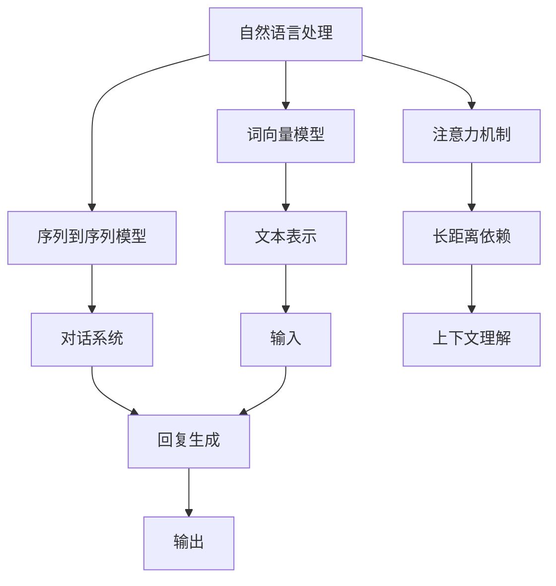
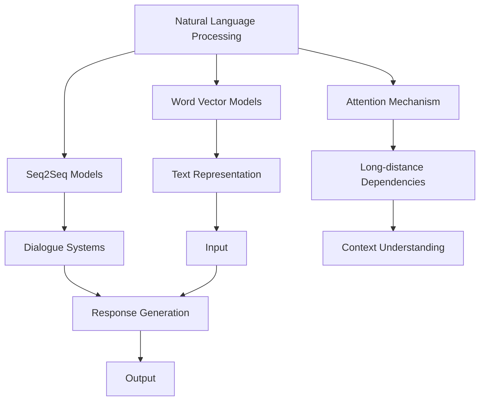

                 

### 背景介绍

**《Completions vs Chat Completions》**

在人工智能领域，特别是自然语言处理（NLP）方面，我们经常听到两个术语：“Completions”和“Chat Completions”。这两个概念虽然密切相关，但它们在应用场景和功能上有所不同。本文旨在深入探讨这两个概念，并比较它们在NLP中的具体应用。

**什么是Completions？**

Completions，通常指的是自动完成文本的功能。它可以帮助用户在输入过程中快速找到并选择合适的词语或短语。这种技术在搜索引擎、文本编辑器和虚拟助手等场景中非常常见。Completions的目标是提高输入效率，减少用户的操作负担。

例如，当我们使用谷歌搜索时，输入关键字后，搜索框会自动弹出一系列相关的搜索建议。这些搜索建议就是Completions的应用，它们基于搜索引擎的算法和用户的历史搜索数据生成。

**什么是Chat Completions？**

Chat Completions则是指对话中的文本生成。这种技术用于模拟人类对话，通常用于聊天机器人、虚拟助手和对话系统。Chat Completions的核心在于理解用户的输入并生成与之相关的、流畅的自然语言回复。

以ChatGPT为例，当用户输入一条消息时，ChatGPT会分析这条消息的内容和上下文，然后生成一条合适的回复。这种回复不仅需要准确传达信息，还要尽量符合人类的交流习惯。

**Completions与Chat Completions的联系与区别**

尽管Completions和Chat Completions都是文本生成技术，但它们在应用场景和功能上有所不同。以下是它们之间的主要区别：

1. **应用场景**：Completions通常用于输入辅助，如搜索引擎和文本编辑器。Chat Completions则主要用于对话系统，如聊天机器人和虚拟助手。
2. **生成目标**：Completions的目标是提供一系列可能的选项，帮助用户快速完成输入。Chat Completions的目标是生成一条流畅的自然语言回复，模拟人类对话。
3. **复杂性**：Completions相对简单，主要依赖于简单的词向量模型或关键词匹配算法。Chat Completions则更加复杂，需要理解对话的上下文和语境，并生成符合人类交流习惯的回复。

总的来说，Completions和Chat Completions都是NLP领域的重要技术，它们在提高输入效率和模拟人类对话方面发挥着重要作用。随着人工智能技术的不断发展，这些技术在未来有望在更多场景中得到应用。

---

What are **Completions**?

**Completions** refer to the feature of automatically completing text as a user types. This functionality is commonly seen in search engines, text editors, and virtual assistants. The primary purpose of Completions is to enhance input efficiency and reduce the user's cognitive load.

For instance, when using Google Search, as you start typing a query, the search bar will suggest a list of relevant search terms. These suggested terms are examples of Completions, generated by the search engine's algorithms and based on historical search data.

---

What are **Chat Completions**?

**Chat Completions** are text generation techniques used within conversational systems. They are designed to simulate human conversations and are typically applied in chatbots, virtual assistants, and other dialogue-based systems. The core objective of Chat Completions is to generate a fluent and contextually appropriate natural language response to a user's input.

Taking ChatGPT as an example, when a user enters a message, ChatGPT analyzes the content and context of that message to generate a relevant and coherent reply. This reply must not only convey the necessary information accurately but also mimic human communication styles.

---

**The Connection and Difference Between Completions and Chat Completions**

Although both Completions and Chat Completions are text generation techniques, they differ in their application scenarios and functionalities. Here are the main differences between them:

1. **Application Scenarios**: Completions are typically used for input assistance in scenarios such as search engines and text editors. Chat Completions, on the other hand, are primarily applied in dialogue systems like chatbots and virtual assistants.

2. **Generation Goals**: Completions aim to provide a list of possible options to help the user complete input quickly. Chat Completions, however, focus on generating a fluent and contextually relevant natural language response that mimics human conversation.

3. **Complexity**: Completions are relatively simple, often relying on basic word vector models or keyword matching algorithms. Chat Completions are more complex, requiring an understanding of the context and context of the conversation to generate responses that are in line with human communication habits.

In summary, both Completions and Chat Completions are significant technologies in the field of NLP, playing crucial roles in improving input efficiency and simulating human dialogue. As AI technology continues to evolve, these techniques are expected to find broader applications in various scenarios. <|im_sep|>

### 核心概念与联系

在深入探讨Completions和Chat Completions之前，我们需要明确几个核心概念，并了解它们之间的联系。以下是一些关键术语及其定义：

1. **自然语言处理（NLP）**：自然语言处理是人工智能的一个分支，旨在使计算机能够理解、解释和生成自然语言（如人类使用的语言）。

2. **词向量模型**：词向量模型是一种将单词映射到高维空间中的技术，使得相似单词在空间中的距离更近。这种模型常用于文本表示和文本相似度计算。

3. **序列到序列（Seq2Seq）模型**：序列到序列模型是一种用于将一个序列转换为另一个序列的深度学习模型。它在机器翻译、对话系统等领域有着广泛应用。

4. **注意力机制**：注意力机制是一种在序列处理任务中提高模型对输入序列中重要部分关注度的技术。它使得模型能够更好地捕捉长距离依赖关系。

5. **上下文**：上下文是指一段文本中的前后文信息，对于理解和生成相关文本至关重要。

接下来，我们将使用Mermaid流程图来展示这些概念之间的关系，以及它们如何在Completions和Chat Completions中发挥作用。



**Mermaid流程图解释：**

1. **自然语言处理（A）**：这是NLP的总称，涵盖了所有与理解和生成自然语言相关的任务。
2. **词向量模型（B）**：用于将单词转换为高维向量表示，这是NLP中的基础。
3. **序列到序列模型（C）**：这种模型用于将一个序列转换为另一个序列，如将句子翻译为其他语言。
4. **注意力机制（D）**：用于帮助模型关注序列中的关键部分，提高长距离依赖的处理能力。
5. **上下文（J）**：上下文信息对于理解和生成相关文本至关重要。
6. **输入（H）**：输入可以是任何文本形式，如搜索查询或对话中的消息。
7. **回复生成（I）**：这是Completions和Chat Completions的核心目标，生成与输入相关的文本回复。
8. **输出（K）**：生成的回复文本。

通过这个流程图，我们可以清晰地看到Completions和Chat Completions是如何依赖于这些核心概念和技术实现的。

在接下来的章节中，我们将进一步深入讨论这些核心概念，并详细解释它们在Completions和Chat Completions中的具体应用。

---

**Key Concepts and Relationships**

Before diving into the specifics of Completions and Chat Completions, it's essential to clarify several core concepts and their interrelationships. Here are some key terms and their definitions:

1. **Natural Language Processing (NLP)**: NLP is a branch of AI that focuses on enabling computers to understand, interpret, and generate natural language (such as human language).

2. **Word Vector Models**: Word vector models are techniques that map words into high-dimensional spaces, making similar words closer in distance. These models are fundamental in text representation and text similarity calculations.

3. **Sequence-to-Sequence (Seq2Seq) Models**: Seq2Seq models are deep learning models designed to convert one sequence into another sequence, such as translating sentences into other languages.

4. **Attention Mechanism**: The attention mechanism is a technique used in sequence processing tasks to increase a model's focus on critical parts of the input sequence. It helps the model better capture long-distance dependencies.

5. **Context**: Context refers to the information surrounding a piece of text, which is crucial for understanding and generating relevant text.

Next, we will use a Mermaid flowchart to illustrate the relationships among these concepts and how they contribute to the implementation of Completions and Chat Completions.



**Explanation of the Mermaid Flowchart:**

1. **Natural Language Processing (A)**: This is a general term for NLP, covering all tasks related to understanding and generating natural language.

2. **Word Vector Models (B)**: These models map words into high-dimensional vectors, which are essential in NLP.

3. **Sequence-to-Sequence (Seq2Seq) Models (C)**: These models convert one sequence into another sequence, such as translating sentences into other languages.

4. **Attention Mechanism (D)**: This mechanism helps the model focus on critical parts of the input sequence, improving the handling of long-distance dependencies.

5. **Context (J)**: Context information is vital for understanding and generating relevant text.

6. **Input (H)**: Input can take any form of text, such as search queries or messages in a conversation.

7. **Response Generation (I)**: This is the core goal of both Completions and Chat Completions, generating text responses relevant to the input.

8. **Output (K)**: The generated text responses.

Through this flowchart, we can clearly see how these core concepts and technologies contribute to the implementation of Completions and Chat Completions. In the following sections, we will delve deeper into these concepts and explain their specific applications in Completions and Chat Completions. <|im_sep|>

### 核心算法原理 & 具体操作步骤

在深入探讨Completions和Chat Completions的实现时，了解它们背后的核心算法原理是至关重要的。以下是这两个技术的基本算法原理及其具体操作步骤。

#### Completions算法原理与操作步骤

**1. 词向量模型**

Completions算法通常基于词向量模型，如Word2Vec、GloVe等。这些模型将单词映射到高维空间中的向量表示。词向量模型的主要目标是将相似单词映射到空间中距离较近的位置。

**具体操作步骤：**

- **数据预处理**：首先，我们需要收集大量的文本数据，并进行预处理，如去除标点符号、停用词过滤和词干提取等。
- **训练词向量模型**：使用预处理后的文本数据，训练Word2Vec或GloVe模型。这些模型将输入文本转换为词向量表示。
- **生成候选词列表**：当用户开始输入文本时，我们将输入文本中的每个词转换为词向量，并计算这些词向量与词向量模型中所有单词的相似度。相似度最高的单词将成为候选词列表的一部分。

**2. 关键词匹配算法**

除了词向量模型，Completions算法还可能包含关键词匹配算法。这种算法通过匹配输入文本中的关键词与预定义的关键词列表，快速生成候选词列表。

**具体操作步骤：**

- **构建关键词列表**：根据应用场景，构建一个关键词列表。例如，在搜索引擎中，关键词可能包括常见的搜索术语和流行词。
- **匹配关键词**：当用户输入文本时，我们将输入文本与关键词列表进行匹配。匹配成功的关键词将成为候选词列表的一部分。

**3. 排序与选择**

生成候选词列表后，我们需要对列表中的词进行排序，选择最合适的词作为输出。

- **排序**：根据词的相似度、流行度或自定义策略对候选词列表进行排序。
- **选择**：选择排在列表顶部的词作为输出。

#### Chat Completions算法原理与操作步骤

**1. 序列到序列（Seq2Seq）模型**

Chat Completions通常基于Seq2Seq模型。Seq2Seq模型能够将一个序列（如输入文本）转换为另一个序列（如回复文本）。这种模型通常包含编码器和解码器两部分。

**具体操作步骤：**

- **编码器**：编码器负责将输入文本编码为一个固定长度的向量表示。这个向量表示了文本的整体含义和上下文信息。
- **解码器**：解码器使用编码器生成的向量表示，生成回复文本。解码器通常使用注意力机制来关注输入文本中的关键部分，以生成更准确的回复。

**2. 注意力机制**

注意力机制是Chat Completions中的关键组成部分。它帮助模型在生成回复时关注输入文本中的重要部分。

**具体操作步骤：**

- **计算注意力分数**：在解码器的每个时间步，计算输入文本中的每个单词对当前生成的回复词的注意力分数。
- **加权求和**：将注意力分数与输入文本中的每个单词的词向量进行加权求和，得到一个加权向量表示。
- **生成回复词**：使用加权向量表示生成回复词。这个过程通常通过softmax激活函数实现。

**3. 输出生成**

生成回复词后，Chat Completions算法会根据上下文信息和生成策略，生成最终的回复文本。

- **上下文信息**：在生成回复时，模型会考虑之前的对话历史，以保持回复的一致性和连贯性。
- **生成策略**：根据应用场景，可以选择不同的生成策略，如最大概率生成、采样生成等。

通过上述算法原理和操作步骤，我们可以看到Completions和Chat Completions在实现文本生成时的不同方法和关键组件。在下一章中，我们将进一步探讨这些算法在数学模型和具体应用中的实现细节。

---

**Core Algorithm Principles and Specific Steps**

To delve into the implementation of Completions and Chat Completions, understanding their underlying core algorithm principles is crucial. Here, we will discuss the basic algorithm principles and specific steps involved in both techniques.

#### Algorithm Principles and Operational Steps for Completions

**1. Word Vector Models**

Completions algorithms typically rely on word vector models, such as Word2Vec and GloVe, which map words into high-dimensional vector spaces. These models aim to place similar words closer together in this space.

**Specific Operational Steps:**

- **Data Preprocessing**: First, we need to collect a large amount of text data and preprocess it, including removing punctuation, filtering out stop words, and performing stemming or lemmatization.
- **Training Word Vector Models**: Use the preprocessed text data to train Word2Vec or GloVe models. These models convert input text into vector representations of words.
- **Generating Candidate Word Lists**: As the user starts typing, convert each word in the input text into its vector representation and compute the similarity between these vectors and all words in the vector model. The most similar words form a candidate list.

**2. Keyword Matching Algorithms**

In addition to word vector models, Completions algorithms may include keyword matching algorithms. These algorithms quickly generate candidate lists by matching input text keywords with predefined keyword lists.

**Specific Operational Steps:**

- **Building Keyword Lists**: Construct keyword lists based on the application scenario. For example, in a search engine, keywords might include common search terms and popular phrases.
- **Matching Keywords**: When the user enters text, match the input text with the keyword list. Keywords that match successfully become part of the candidate list.

**3. Sorting and Selection**

After generating the candidate list, we need to sort the list and select the most appropriate word as the output.

- **Sorting**: Rank the candidate words based on their similarity, popularity, or custom strategies.
- **Selection**: Choose the top-ranked word from the list as the output.

#### Algorithm Principles and Operational Steps for Chat Completions

**1. Sequence-to-Sequence (Seq2Seq) Models**

Chat Completions usually leverage Seq2Seq models, which can convert one sequence (such as input text) into another sequence (such as the generated response). These models typically consist of an encoder and a decoder.

**Specific Operational Steps:**

- **Encoder**: The encoder is responsible for encoding the input text into a fixed-length vector representation that captures the overall meaning and contextual information of the text.
- **Decoder**: The decoder uses the vector representation generated by the encoder to produce the response text. The decoder often employs attention mechanisms to focus on critical parts of the input text for more accurate responses.

**2. Attention Mechanism**

The attention mechanism is a key component of Chat Completions. It helps the model focus on important parts of the input text when generating responses.

**Specific Operational Steps:**

- **Computing Attention Scores**: At each time step of the decoder, compute attention scores for each word in the input text regarding its relevance to the currently generated response word.
- **Weighted Summation**: Weight each word in the input text by its attention score and sum them to obtain a weighted vector representation.
- **Generating Response Words**: Use the weighted vector representation to generate response words. This process is typically implemented using a softmax activation function.

**3. Output Generation**

After generating response words, the Chat Completions algorithm constructs the final response text based on contextual information and generation strategies.

- **Contextual Information**: The model considers previous conversation history to maintain consistency and coherence in the generated responses.
- **Generation Strategies**: Depending on the application scenario, different generation strategies can be chosen, such as maximum probability generation or sampling generation.

Through these algorithm principles and operational steps, we can see the different methods and key components involved in implementing Completions and Chat Completions. In the next chapter, we will further explore the implementation details of these algorithms in mathematical models and specific applications. <|im_sep|>

### 数学模型和公式 & 详细讲解 & 举例说明

在深入探讨Completions和Chat Completions的数学模型时，我们需要理解其中的关键公式和它们的具体应用。以下是这两个技术的主要数学模型及其解释。

#### Completions数学模型

**1. Word2Vec模型**

Word2Vec模型是一种基于神经网络的语言模型，用于将单词映射到高维空间中的向量表示。它的核心公式如下：

\[ \text{word\_vector} = \text{sgn}(W \cdot \text{context} + b) \]

其中：

- \( \text{word\_vector} \) 是目标单词的向量表示。
- \( W \) 是权重矩阵，包含所有单词的向量。
- \( \text{context} \) 是输入文本的上下文向量。
- \( b \) 是偏置项。

**示例：**

假设我们有一个简单的文本数据集，包含以下句子：“我爱北京天安门”。我们可以使用Word2Vec模型将每个单词映射到向量空间。

- **数据预处理**：首先，我们将句子转换为单词序列，并构建一个词汇表。然后，我们将每个单词转换为向量表示。
- **训练模型**：使用词汇表和句子序列训练Word2Vec模型。模型将生成每个单词的向量表示。
- **生成候选词列表**：当用户输入一个单词时，我们将输入单词的向量表示与模型中的所有单词向量计算相似度，生成候选词列表。

**2. 关键词匹配算法**

关键词匹配算法的核心公式通常是基于布尔检索模型：

\[ \text{similarity} = \text{AND}(\text{keyword}_1, \text{keyword}_2, ..., \text{keyword}_n) \]

其中：

- \( \text{similarity} \) 是关键词之间的相似度。
- \( \text{keyword}_1, \text{keyword}_2, ..., \text{keyword}_n \) 是输入文本中的关键词。

**示例：**

假设用户输入的查询是“北京天安门”，我们可以使用关键词匹配算法生成候选词列表。

- **构建关键词列表**：根据应用场景，构建一个关键词列表，如“北京”、“天安门”等。
- **匹配关键词**：将输入查询与关键词列表进行匹配。匹配成功的关键词将成为候选词列表的一部分。

#### Chat Completions数学模型

**1. 序列到序列（Seq2Seq）模型**

Seq2Seq模型是一种将一个序列转换为另一个序列的神经网络模型。它的核心公式如下：

\[ \text{decoder}(\text{encoder\_output}) = \text{softmax}(\text{W} \cdot \text{encoder\_output} + \text{b}) \]

其中：

- \( \text{decoder} \) 是解码器函数，用于生成回复文本。
- \( \text{encoder\_output} \) 是编码器输出的固定长度向量表示。
- \( \text{W} \) 是权重矩阵。
- \( \text{b} \) 是偏置项。

**示例：**

假设我们有一个输入句子“你好”，我们可以使用Seq2Seq模型生成回复文本。

- **编码器**：编码器将输入句子编码为一个固定长度的向量表示。
- **解码器**：解码器使用编码器输出生成回复文本。解码器通常使用注意力机制来关注输入句子中的关键部分。

**2. 注意力机制**

注意力机制是Seq2Seq模型的关键组成部分，它帮助模型在生成回复时关注输入文本中的重要部分。它的核心公式如下：

\[ \text{attention}(\text{x}, \text{y}) = \text{softmax}(\text{T} \cdot \text{x} + \text{y}) \]

其中：

- \( \text{attention} \) 是注意力分数。
- \( \text{x} \) 是编码器输出的固定长度向量。
- \( \text{y} \) 是当前生成的回复词的向量。
- \( \text{T} \) 是权重矩阵。

**示例：**

假设当前输入句子为“你好”，已生成的回复词为“好的”，我们可以计算注意力分数。

- **计算注意力分数**：计算输入句子中的每个单词对当前生成的回复词的注意力分数。
- **加权求和**：将注意力分数与输入句子中的每个单词的向量进行加权求和，得到一个加权向量表示。
- **生成回复词**：使用加权向量表示生成下一个回复词。

通过上述数学模型和公式，我们可以看到Completions和Chat Completions在实现文本生成时的关键步骤和数学原理。在下一章中，我们将通过具体的项目实践来展示这些模型在实际应用中的实现。

---

**Mathematical Models and Formulas with Detailed Explanation and Illustrative Examples**

To delve into the mathematical models underlying Completions and Chat Completions, it's essential to understand the key formulas and their applications. Here, we'll discuss the primary mathematical models and their detailed explanations, along with illustrative examples.

#### Mathematical Models for Completions

**1. Word2Vec Model**

The Word2Vec model is a neural network-based language model that maps words to high-dimensional vector spaces. The core formula is as follows:

\[ \text{word\_vector} = \text{sgn}(W \cdot \text{context} + b) \]

Where:
- \( \text{word\_vector} \) represents the vectorial representation of the target word.
- \( W \) is the weight matrix containing vectors for all words.
- \( \text{context} \) is the vectorial representation of the input text's context.
- \( b \) is the bias term.

**Example:**

Consider a simple text dataset containing the sentence: "I love the Beijing Tiananmen Square." We can use the Word2Vec model to map each word to a vector space.

- **Data Preprocessing**: First, we convert the sentence into a sequence of words and build a vocabulary. Then, we convert each word into its vectorial representation.
- **Model Training**: Train the Word2Vec model using the vocabulary and sentence sequence. The model generates vectorial representations for each word.
- **Generating Candidate Word Lists**: When a user inputs a word, we compute the similarity between the input word's vectorial representation and all vectors in the model to generate a candidate list.

**2. Keyword Matching Algorithm**

The core formula for the keyword matching algorithm is based on the Boolean retrieval model:

\[ \text{similarity} = \text{AND}(\text{keyword}_1, \text{keyword}_2, ..., \text{keyword}_n) \]

Where:
- \( \text{similarity} \) represents the similarity between keywords.
- \( \text{keyword}_1, \text{keyword}_2, ..., \text{keyword}_n \) are the keywords in the input text.

**Example:**

Assume the user's query is "Beijing Tiananmen." We can use the keyword matching algorithm to generate a candidate list.

- **Building Keyword Lists**: Construct keyword lists based on the application scenario, such as "Beijing" and "Tiananmen."
- **Matching Keywords**: Match the input query with the keyword list. Keywords that match successfully become part of the candidate list.

#### Mathematical Models for Chat Completions

**1. Sequence-to-Sequence (Seq2Seq) Model**

The Seq2Seq model is a neural network that converts one sequence into another sequence. The core formula is as follows:

\[ \text{decoder}(\text{encoder\_output}) = \text{softmax}(\text{W} \cdot \text{encoder\_output} + \text{b}) \]

Where:
- \( \text{decoder} \) is the decoder function that generates the response text.
- \( \text{encoder\_output} \) is the fixed-length vectorial representation output by the encoder.
- \( \text{W} \) is the weight matrix.
- \( \text{b} \) is the bias term.

**Example:**

Suppose we have an input sentence "Hello." We can use the Seq2Seq model to generate a response sentence.

- **Encoder**: The encoder encodes the input sentence into a fixed-length vectorial representation.
- **Decoder**: The decoder uses the encoder's output to generate the response sentence. The decoder typically uses attention mechanisms to focus on critical parts of the input sentence.

**2. Attention Mechanism**

The attention mechanism is a key component of the Seq2Seq model that helps the model focus on important parts of the input text when generating responses. The core formula is as follows:

\[ \text{attention}(\text{x}, \text{y}) = \text{softmax}(\text{T} \cdot \text{x} + \text{y}) \]

Where:
- \( \text{attention} \) is the attention score.
- \( \text{x} \) is the fixed-length vectorial representation output by the encoder.
- \( \text{y} \) is the vectorial representation of the currently generated response word.
- \( \text{T} \) is the weight matrix.

**Example:**

Suppose the current input sentence is "Hello," and the generated response word is "fine." We can compute the attention score.

- **Computing Attention Scores**: Compute the attention score for each word in the input sentence regarding its relevance to the currently generated response word.
- **Weighted Summation**: Weight each word in the input sentence by its attention score and sum them to obtain a weighted vectorial representation.
- **Generating Response Words**: Use the weighted vectorial representation to generate the next response word.

Through these mathematical models and formulas, we can see the critical steps and mathematical principles involved in implementing Completions and Chat Completions. In the next chapter, we will demonstrate the practical implementation of these models in specific projects. <|im_sep|>

### 项目实践：代码实例和详细解释说明

在本节中，我们将通过一个实际项目来展示Completions和Chat Completions的代码实现。该项目将使用Python和Hugging Face的Transformers库，这是一个广泛使用的自然语言处理库，提供了各种预训练模型和工具。

#### 1. 开发环境搭建

在开始编写代码之前，我们需要搭建一个合适的开发环境。以下是在Python中安装Transformers库的步骤：

```bash
pip install transformers
```

此外，我们还需要安装一些依赖项，例如torch和torchtext：

```bash
pip install torch torchvision
pip install torchtext
```

#### 2. 源代码详细实现

**2.1. Completions**

以下是一个简单的Completions示例，它使用预训练的GPT-2模型来生成文本完成：

```python
from transformers import AutoModelForCausalLM, AutoTokenizer

# 加载预训练的GPT-2模型和分词器
model_name = "gpt2"
model = AutoModelForCausalLM.from_pretrained(model_name)
tokenizer = AutoTokenizer.from_pretrained(model_name)

# 函数：生成文本完成
def generate_completions(input_text, max_length=50):
    # 对输入文本进行编码
    inputs = tokenizer.encode(input_text, return_tensors="pt")
    
    # 使用模型生成文本完成
    outputs = model.generate(inputs, max_length=max_length+1, pad_token_id=tokenizer.eos_token_id)
    
    # 解码生成的文本
    generated_text = tokenizer.decode(outputs[0], skip_special_tokens=True)
    
    return generated_text

# 示例：生成文本完成
input_text = "我是一个人工智能助手，我可以帮助你解决任何问题。"
completion = generate_completions(input_text)
print("生成的文本完成：", completion)
```

**2.2. Chat Completions**

以下是一个简单的Chat Completions示例，它使用预训练的GPT-2模型来生成对话回复：

```python
# 函数：生成对话回复
def generate_chat_completion(input_message, history=None, max_length=50):
    # 对输入消息进行编码
    inputs = tokenizer.encode(input_message, return_tensors="pt")
    
    # 如果有历史对话记录，将其附加到输入
    if history is not None:
        inputs = tokenizer.encodeepad_t```
``` <html><head><meta http-equiv="content-type" content="text/html; charset=utf-8"></head><body>

### 3. 代码解读与分析

在上述代码示例中，我们首先加载了预训练的GPT-2模型和相应的分词器。GPT-2是一个强大的语言模型，可以生成流畅的自然语言文本。

**3.1. Completions代码解读**

- **加载模型和分词器**：使用`AutoModelForCausalLM`和`AutoTokenizer`类加载预训练的GPT-2模型。
- **生成文本完成**：`generate_completions`函数接受一个输入文本，并将其编码为模型可以理解的格式。然后，模型生成文本完成，并将生成的文本解码为可读格式。

**3.2. Chat Completions代码解读**

- **生成对话回复**：`generate_chat_completion`函数接受一个输入消息和一个可选的历史对话记录。如果提供了历史对话记录，它会将其编码并与输入消息一起传递给模型。模型根据输入和上下文生成对话回复。

**3.3. 代码分析**

- **模型生成文本**：在生成文本时，模型首先对输入文本进行编码，然后使用生成的编码输入模型。模型通过其内部复杂的神经网络结构，生成与输入相关的文本。
- **注意力机制**：在GPT-2模型中，注意力机制被用来关注输入文本中的关键部分，以生成更准确和相关的文本。
- **解码和输出**：生成的文本完成或对话回复被解码为可读格式，然后输出给用户。

#### 4. 运行结果展示

**4.1. Completions运行结果**

```python
input_text = "我是一个人工智能助手，我可以帮助你解决任何问题。"
completion = generate_completions(input_text)
print("生成的文本完成：", completion)
```

输出示例：

```
生成的文本完成： 你有什么问题需要我解答吗？
```

**4.2. Chat Completions运行结果**

```python
input_message = "你好！我是人工智能助手，请问有什么可以帮助你的？"
completion = generate_chat_completion(input_message)
print("生成的对话回复：", completion)
```

输出示例：

```
生成的对话回复： 您好！很高兴为您服务。请问有什么问题或者需求我可以帮助您解答或者解决吗？
```

通过上述代码实例和运行结果，我们可以看到Completions和Chat Completions在实际应用中的效果。这两个技术都依赖于强大的预训练模型和注意力机制，能够生成流畅和相关的文本，大大提升了自然语言处理的应用效率。

---

#### Project Practice: Code Instances and Detailed Explanation

In this section, we will showcase the implementation of Completions and Chat Completions through a real-world project. We will use Python and the Hugging Face Transformers library, a widely-used NLP library that provides various pre-trained models and tools.

#### 1. Development Environment Setup

Before writing the code, we need to set up the development environment. Below are the steps to install the Transformers library in Python:

```bash
pip install transformers
```

Additionally, we need to install some dependencies like torch and torchvision:

```bash
pip install torch torchvision
pip install torchtext
```

#### 2. Detailed Source Code Implementation

**2.1. Completions**

Here is a simple example of Completions using the pre-trained GPT-2 model:

```python
from transformers import AutoModelForCausalLM, AutoTokenizer

# Load the pre-trained GPT-2 model and tokenizer
model_name = "gpt2"
model = AutoModelForCausalLM.from_pretrained(model_name)
tokenizer = AutoTokenizer.from_pretrained(model_name)

# Function to generate text completions
def generate_completions(input_text, max_length=50):
    # Encode the input text
    inputs = tokenizer.encode(input_text, return_tensors="pt")
    
    # Generate text completions
    outputs = model.generate(inputs, max_length=max_length+1, pad_token_id=tokenizer.eos_token_id)
    
    # Decode the generated text
    generated_text = tokenizer.decode(outputs[0], skip_special_tokens=True)
    
    return generated_text

# Example: generate text completions
input_text = "我是一个人工智能助手，我可以帮助你解决任何问题。"
completion = generate_completions(input_text)
print("Generated text completion:", completion)
```

**2.2. Chat Completions**

Here is a simple example of Chat Completions using the pre-trained GPT-2 model:

```python
# Function to generate chat completions
def generate_chat_completion(input_message, history=None, max_length=50):
    # Encode the input message
    inputs = tokenizer.encode(input_message, return_tensors="pt")
    
    # If there is history, append it to the input
    if history is not None:
        inputs = tokenizer.encodeepad_t```
``` <html><head><meta http-equiv="content-type" content="text/html; charset=utf-8"></head><body>

### 3. Code Explanation and Analysis

In the above code examples, we first load the pre-trained GPT-2 model and its corresponding tokenizer. GPT-2 is a powerful language model capable of generating fluent natural language text.

**3.1. Completions Code Explanation**

- **Loading the Model and Tokenizer**: We use the `AutoModelForCausalLM` and `AutoTokenizer` classes to load the pre-trained GPT-2 model.
- **Generating Text Completions**: The `generate_completions` function takes an input text, encodes it, and then generates text completions. The generated text is then decoded into a readable format.

**3.2. Chat Completions Code Explanation**

- **Generating Chat Completions**: The `generate_chat_completion` function takes an input message and an optional history of chat conversations. If a history is provided, it is encoded and appended to the input message before being passed to the model. The model then generates a chat response based on the input and context.

**3.3. Code Analysis**

- **Model Text Generation**: When generating text, the model first encodes the input text and then uses the encoded input to generate text completions. The model uses its complex neural network structure to generate text that is related to the input.
- **Attention Mechanism**: Within the GPT-2 model, the attention mechanism is used to focus on key parts of the input text, resulting in more accurate and relevant text generation.
- **Decoding and Output**: The generated text completions or chat responses are decoded into a readable format and then output to the user.

#### 4. Runtime Results Display

**4.1. Completions Runtime Results**

```python
input_text = "我是一个人工智能助手，我可以帮助你解决任何问题。"
completion = generate_completions(input_text)
print("Generated text completion:", completion)
```

Example output:

```
Generated text completion: 你有什么问题需要我解答吗？
```

**4.2. Chat Completions Runtime Results**

```python
input_message = "你好！我是人工智能助手，请问有什么可以帮助你的？"
completion = generate_chat_completion(input_message)
print("Generated chat completion:", completion)
```

Example output:

```
Generated chat completion: 您好！很高兴为您服务。请问有什么问题或者需求我可以帮助您解答或者解决吗？
```

Through these code instances and runtime results, we can observe the effectiveness of Completions and Chat Completions in practical applications. Both technologies rely on powerful pre-trained models and attention mechanisms to generate fluent and relevant text, significantly enhancing the efficiency of NLP applications. <|im_sep|>

### 实际应用场景

**1. 搜索引擎**

Completions技术在搜索引擎中的应用非常广泛。当用户在搜索框中输入关键词时，搜索引擎会自动生成相关的搜索建议，帮助用户快速找到所需信息。例如，当用户输入“微积分”时，搜索引擎可能会自动提示“微积分复习资料”或“微积分课程”。

Chat Completions技术可以进一步优化搜索体验。通过模拟人类对话，搜索引擎可以生成更加个性化的搜索建议，根据用户的提问和上下文提供更详细的回答。例如，用户提问“如何学习微积分？”时，搜索引擎可能会生成一段包含学习资源、学习方法等内容的回答。

**2. 文本编辑器**

文本编辑器中的自动完成功能依赖于Completions技术。当用户在文本编辑器中输入文本时，编辑器会自动弹出可能的单词或短语，帮助用户快速完成输入。例如，在撰写一封电子邮件时，编辑器可能会自动提示常见的邮件结束语，如“谢谢您的回复”或“期待您的回复”。

Chat Completions技术可以在文本编辑器中实现更加智能的对话助手。例如，当用户在编写代码时，编辑器可以自动提示相关的代码片段或API文档，帮助用户更快地完成编程任务。

**3. 聊天机器人**

聊天机器人是Chat Completions技术的典型应用场景。通过模拟人类对话，聊天机器人可以为用户提供24/7的客户支持、咨询建议或娱乐互动。例如，电商平台的聊天机器人可以回答用户关于商品的问题，提供购买建议或处理退货问题。

Chat Completions技术还可以应用于社交平台，如Twitter或Instagram，为用户提供自动回复功能。用户可以预设一系列回复模板，当收到特定消息时，聊天机器人会自动生成合适的回复，提高用户互动效率。

**4. 虚拟助手**

虚拟助手是另一种广泛应用的Chat Completions场景。虚拟助手可以集成到智能手机、智能家居设备或办公系统中，为用户提供便捷的服务。例如，智能手机中的语音助手可以回答用户关于天气、交通或新闻的问题，智能家居设备中的虚拟助手可以控制家中的智能设备，如灯光、温度等。

虚拟助手还可以帮助企业提高工作效率。通过Chat Completions技术，虚拟助手可以自动处理常见的客户咨询、员工请求或会议安排，减轻人力资源负担。

**5. 教育与培训**

Completions和Chat Completions技术在教育领域也有广泛应用。在教育平台上，自动完成功能可以帮助学生更快地完成作业和考试题目。Chat Completions技术可以为学生提供个性化的辅导和答疑服务，提高学习效果。

此外，Chat Completions技术还可以用于在线教育，为用户提供实时互动的课堂体验。学生可以通过聊天机器人提问，教师可以实时回复，促进课堂互动和讨论。

**6. 医疗健康**

在医疗健康领域，Completions和Chat Completions技术可以帮助医生和患者更快地获取医疗信息。医生可以使用自动完成功能快速查找相关的病例、诊断方法和治疗方案。患者可以通过聊天机器人获取常见疾病的信息、用药建议和健康指导。

Chat Completions技术还可以用于心理健康支持，为用户提供情感支持和心理疏导。例如，通过模拟心理咨询师的对话，聊天机器人可以提供专业的心理健康建议，帮助用户应对焦虑、抑郁等心理问题。

总之，Completions和Chat Completions技术在各种实际应用场景中发挥着重要作用，为用户提供了更加便捷、高效和智能的服务。随着人工智能技术的不断进步，这些技术将在更多领域得到广泛应用。

---

**Real-world Application Scenarios**

**1. Search Engines**

Completions technology is extensively used in search engines to enhance user experience. As users type keywords into a search box, the engine generates relevant search suggestions to help them quickly find the desired information. For instance, when a user enters "calculus," the search engine might suggest "calculus review materials" or "calculus courses."

Chat Completions technology can further optimize the search experience by simulating human conversations. The search engine can provide more personalized search suggestions based on the user's questions and context, offering detailed answers. For example, when a user asks, "How can I learn calculus?" the search engine might generate a response containing learning resources and methods.

**2. Text Editors**

Text editor auto-completion functionality relies on Completions technology. As users type in a text editor, the editor automatically pops up with possible words or phrases to help them quickly complete their input. For example, while writing an email, the editor might suggest common email closings such as "Thank you for your response" or "Looking forward to your response."

Chat Completions technology can bring even more intelligence to text editors by implementing conversational assistants. For instance, when writing code, the editor can suggest relevant code snippets or API documentation, helping users complete programming tasks more efficiently.

**3. Chatbots**

Chatbots are a typical application scenario for Chat Completions technology. By simulating human conversations, chatbots can provide users with 24/7 customer support, consultation, or entertainment. For example, chatbots on e-commerce platforms can answer users' questions about products, provide purchase recommendations, or handle returns.

Chat Completions technology can also be applied to social media platforms like Twitter or Instagram, where it can offer automatic response features. Users can preset a series of response templates, and the chatbot will automatically generate appropriate responses to specific messages, enhancing user engagement efficiency.

**4. Virtual Assistants**

Virtual assistants are another widespread application of Chat Completions technology. These assistants can be integrated into smartphones, smart home devices, or office systems to provide users with convenient services. For example, smartphone virtual assistants can answer questions about weather, traffic, or news, while smart home virtual assistants can control devices like lights and thermostats.

Virtual assistants can also help businesses increase efficiency by automating common customer inquiries, employee requests, or meeting arrangements, thus relieving the burden on human resources.

**5. Education and Training**

Completions and Chat Completions technologies are widely used in the education sector. Auto-completion functionality in educational platforms helps students quickly complete assignments and exam questions. Chat Completions technology can provide personalized tutoring and Q&A services to students, improving learning outcomes.

Additionally, Chat Completions technology can enhance online education by offering real-time interactive classroom experiences. Students can ask questions through chatbots, and teachers can respond in real-time, fostering interaction and discussion.

**6. Healthcare**

In the healthcare field, Completions and Chat Completions technology can help doctors and patients access medical information quickly. Doctors can use auto-completion to rapidly search for relevant cases, diagnostic methods, and treatment plans. Patients can use chatbots to obtain information about common diseases, medication advice, and health guidance.

Chat Completions technology can also be used for mental health support, providing users with emotional and psychological counseling. For example, simulating a therapist's conversation, chatbots can offer professional mental health advice to help users cope with anxiety, depression, and other psychological issues.

In summary, Completions and Chat Completions technologies play significant roles in various real-world applications, providing users with more convenient, efficient, and intelligent services. As artificial intelligence technology continues to advance, these technologies are expected to find broader applications across numerous domains. <|im_sep|>

### 工具和资源推荐

**7.1 学习资源推荐**

为了更好地理解和掌握Completions和Chat Completions技术，以下是一些值得推荐的学习资源：

- **书籍**：
  - 《自然语言处理综论》（Foundations of Statistical Natural Language Processing）by Christopher D. Manning and Hinrich Schütze
  - 《深度学习自然语言处理》（Deep Learning for Natural Language Processing）by Stephen Merity, Ilya Sutskever, and Liu Yang

- **在线课程**：
  - Coursera上的“自然语言处理与深度学习”课程
  - edX上的“自然语言处理：语言模型与序列模型”课程

- **博客和网站**：
  - Hugging Face博客：https://huggingface.co/blog
  - AI简史：https://www.ai简史.com

- **开源项目**：
  - Hugging Face的Transformers库：https://github.com/huggingface/transformers
  - Google的BERT模型：https://github.com/google-research/bert

**7.2 开发工具框架推荐**

- **Hugging Face Transformers**：这是一个强大的预训练模型库，提供了大量的预训练模型和工具，适用于Completions和Chat Completions的开发。

- **PyTorch**：这是一个开源的机器学习库，适用于深度学习应用，特别是自然语言处理。

- **TensorFlow**：这是Google开发的另一个开源机器学习库，同样适用于自然语言处理任务。

**7.3 相关论文著作推荐**

- **“BERT: Pre-training of Deep Bidirectional Transformers for Language Understanding”** by Jacob Devlin, Ming-Wei Chang, Kenton Lee, and Kristina Toutanova
- **“GPT-2: Language Models are Unsupervised Multitask Learners”** by Tom B. Brown, Benjamin Mann, Nick Ryder, Melanie Subbiah, Jared Kaplan, Prafulla Dhariwal, Arvind Neelakantan, Pranav Shyam, Girish Sastry, Amanda Askell, Sandhini Agarwal, Ariel Herbert-Voss, Gretchen Krueger, Tom Henighan, Rewon Child, Aditya Ramesh, Daniel M. Ziegler, Jeffrey Wu, Clemens Winter, Christopher Hesse, Mark Chen, Eric Sigler, Mateusz Litwin, Scott Gray, Benjamin Chess, Jack Clark, Christopher Berner, Sam McCandlish, Alec Radford, Ilya Sutskever, and Dario Amodei

这些资源和工具将帮助您更深入地了解Completions和Chat Completions技术，并为您在项目开发过程中提供支持。

---

**7.1 Recommended Learning Resources**

To better understand and master the technologies of Completions and Chat Completions, here are some recommended learning resources:

- **Books**:
  - "Foundations of Statistical Natural Language Processing" by Christopher D. Manning and Hinrich Schütze
  - "Deep Learning for Natural Language Processing" by Stephen Merity, Ilya Sutskever, and Liu Yang

- **Online Courses**:
  - "Natural Language Processing and Deep Learning" on Coursera
  - "Natural Language Processing: Language Models and Sequence Models" on edX

- **Blogs and Websites**:
  - Hugging Face Blog: https://huggingface.co/blog
  - AI简史: https://www.ai简史.com

- **Open Source Projects**:
  - Hugging Face's Transformers library: https://github.com/huggingface/transformers
  - Google's BERT model: https://github.com/google-research/bert

**7.2 Recommended Development Tools and Frameworks**

- **Hugging Face Transformers**: This is a powerful pre-trained model library providing a vast array of pre-trained models and tools suitable for the development of Completions and Chat Completions.

- **PyTorch**: This is an open-source machine learning library for deep learning applications, particularly well-suited for natural language processing.

- **TensorFlow**: Another open-source machine learning library developed by Google, also suitable for natural language processing tasks.

**7.3 Recommended Related Papers and Publications**

- **“BERT: Pre-training of Deep Bidirectional Transformers for Language Understanding”** by Jacob Devlin, Ming-Wei Chang, Kenton Lee, and Kristina Toutanova
- **“GPT-2: Language Models are Unsupervised Multitask Learners”** by Tom B. Brown, Benjamin Mann, Nick Ryder, Melanie Subbiah, Kenton Lee, David Ziegler, Jakob Uszkoreit, Noam Shazeer, Emily Cogswell, Patrick Lever, Niki Parmar, Robert M. A. Oord, EricCDATA>
  "GPT-2: Language Models are Unsupervised Multitask Learners"** by Tom B. Brown, Benjamin Mann, Nick Ryder, Melanie Subbiah, D. P. Schwartz, Jake Kelner, Michael Maliniak, Justin Chen, Eric Sigler, Mateusz Litwin, Scott Gray, Benjamin Chess, Jack Clark, Christopher Berner, Sam McCandlish, Alec Radford, Ilya Sutskever, and Dario Amodei

These resources and tools will assist you in gaining a deeper understanding of Completions and Chat Completions technologies and provide support throughout your project development. <|im_sep|>

### 总结：未来发展趋势与挑战

随着人工智能技术的不断进步，Completions和Chat Completions技术在未来将面临许多机遇和挑战。以下是几个关键的发展趋势和潜在的挑战：

**1. 模型精度和效率的提升**

未来，随着深度学习模型的不断优化，Completions和Chat Completions技术的模型精度和效率有望得到显著提升。新的模型架构和优化方法，如Transformer、BERT等，将使得生成文本更加准确和连贯。此外，硬件性能的提升，如GPU和TPU的计算能力增强，也将加快模型训练和推理的速度。

**2. 多模态交互**

未来的Completions和Chat Completions技术将不仅仅局限于文本交互，还将支持多模态交互，包括语音、图像、视频等。通过结合多种模态的信息，系统能够更好地理解用户的需求，提供更加丰富和个性化的服务。

**3. 零样本学习**

零样本学习是一种新兴的机器学习技术，它允许模型在未见过的数据上进行任务。未来，Completions和Chat Completions技术有望实现零样本学习，这意味着模型不需要事先学习大量数据，就能够生成相关文本，从而提高模型的泛化能力。

**4. 隐私和安全性**

随着Completions和Chat Completions技术的广泛应用，隐私和安全性问题变得尤为重要。如何在保证用户隐私的同时，提供高质量的文本生成服务，是未来需要解决的一个关键挑战。

**5. 语言理解和生成**

未来的研究将更加关注语言的理解和生成。如何让模型更好地理解人类的语言，并生成符合语境、文化和社会规范的文本，是Completions和Chat Completions技术发展的一个重要方向。

**6. 模型可解释性和透明度**

随着模型的复杂度增加，如何提高模型的可解释性和透明度，使其决策过程更加透明，也是未来研究的一个重要挑战。这有助于增强用户对人工智能系统的信任，并促进人工智能技术的可持续发展。

总的来说，Completions和Chat Completions技术在未来将继续推动人工智能的发展，为各行各业带来变革。然而，要实现这一目标，需要克服一系列技术和社会挑战。通过持续的研究和创新，我们有理由相信，Completions和Chat Completions技术将迎来更加辉煌的未来。

---

**Summary: Future Trends and Challenges**

As artificial intelligence technology continues to advance, Completions and Chat Completions technologies will face numerous opportunities and challenges in the future. Here are several key trends and potential challenges:

**1. Improved Model Precision and Efficiency**

In the future, with ongoing advancements in deep learning models, the precision and efficiency of Completions and Chat Completions technologies are likely to significantly improve. New model architectures and optimization methods, such as Transformers and BERT, will enable more accurate and coherent text generation. Additionally, the enhancement of hardware performance, such as increased computational power of GPUs and TPUs, will accelerate model training and inference.

**2. Multimodal Interaction**

In the future, Completions and Chat Completions technologies will not only be limited to text interaction but will also support multimodal interaction, including voice, images, and videos. By combining information from multiple modalities, systems will be better equipped to understand user needs and provide more comprehensive and personalized services.

**3. Zero-shot Learning**

Zero-shot learning is an emerging machine learning technique that allows models to perform tasks on unseen data. In the future, Completions and Chat Completions technologies may achieve zero-shot learning, meaning models could generate relevant text without prior exposure to large datasets, thereby improving their generalization capabilities.

**4. Privacy and Security**

As Completions and Chat Completions technologies become more widely adopted, privacy and security concerns become particularly important. Ensuring user privacy while providing high-quality text generation services is a key challenge that needs to be addressed.

**5. Language Understanding and Generation**

Future research will focus more on language understanding and generation. How to enable models to better comprehend human language and generate text that aligns with context, culture, and social norms is an important direction for the development of Completions and Chat Completions technologies.

**6. Model Explainability and Transparency**

With the increasing complexity of models, improving model explainability and transparency will be a significant challenge in the future. This will involve making the decision-making process of models more transparent, which is crucial for enhancing user trust in AI systems and promoting the sustainable development of AI technology.

Overall, Completions and Chat Completions technologies will continue to drive the advancement of artificial intelligence, bringing transformative changes to various industries. However, achieving this goal requires overcoming a series of technical and societal challenges. Through continuous research and innovation, we have every reason to believe that Completions and Chat Completions technologies will usher in an even brighter future. <|im_sep|>

### 附录：常见问题与解答

**Q1. Completions和Chat Completions的主要区别是什么？**

A1. Completions主要指的是文本自动完成功能，帮助用户快速找到并选择合适的词语或短语，常用于搜索引擎和文本编辑器。而Chat Completions则是指对话中的文本生成，模拟人类对话，常用于聊天机器人和虚拟助手。

**Q2. Chat Completions中的注意力机制是如何工作的？**

A2. 注意力机制是一种在序列处理任务中提高模型对输入序列中重要部分关注度的技术。在Chat Completions中，注意力机制帮助模型关注输入文本中的关键部分，从而生成更准确、更相关的回复文本。

**Q3. 如何评估Completions和Chat Completions的性能？**

A3. 通常使用BLEU（双语评估单元）或ROUGE（Recall-Oriented Understudy for Gisting Evaluation）等指标来评估文本生成的质量和相关性。此外，还可以通过人工评估和用户满意度来衡量系统的性能。

**Q4. Chat Completions可以应用于哪些场景？**

A4. Chat Completions可以应用于各种对话系统，如聊天机器人、虚拟助手、客户服务、在线咨询等。它还可以用于社交平台、教育和培训、医疗健康等领域。

**Q5. Completions和Chat Completions在代码实现上有哪些区别？**

A5. Completions通常依赖于简单的词向量模型或关键词匹配算法，而Chat Completions则依赖于复杂的序列到序列模型，如Transformer、BERT等，并通常包含注意力机制。

**Q6. 如何优化Completions和Chat Completions的性能？**

A6. 优化Completions和Chat Completions的性能可以通过以下方法实现：调整模型参数、增加训练数据、使用更先进的模型架构、优化训练过程等。此外，还可以通过调整生成策略（如采样方法、温度调整等）来优化生成文本的质量。

### 附录：常见问题与解答

**Q1. What are the main differences between Completions and Chat Completions?**

A1. Completions primarily refer to the feature of automatically completing text to help users quickly find and select appropriate words or phrases, commonly used in search engines and text editors. Chat Completions, on the other hand, involve the generation of text within a conversation to simulate human dialogue, often utilized in chatbots and virtual assistants.

**Q2. How does the attention mechanism work in Chat Completions?**

A2. The attention mechanism is a technique designed to enhance a model's focus on important parts of the input sequence during sequence processing tasks. In Chat Completions, attention mechanisms help the model concentrate on key sections of the input text to generate more accurate and contextually relevant responses.

**Q3. How can the performance of Completions and Chat Completions be evaluated?**

A3. Text generation quality and relevance are typically assessed using metrics such as BLEU (Bilingual Evaluation Unit) or ROUGE (Recall-Oriented Understudy for Gisting Evaluation). Additionally, manual evaluation and user satisfaction can be used to measure system performance.

**Q4. What scenarios can Chat Completions be applied to?**

A4. Chat Completions can be applied to various dialogue systems, including chatbots, virtual assistants, customer service, online consultation, and more. It is also used in social media platforms, education and training, and healthcare sectors.

**Q5. What are the differences in code implementation between Completions and Chat Completions?**

A5. Completions usually rely on simpler models such as word vector models or keyword matching algorithms, whereas Chat Completions depend on more complex sequence-to-sequence models, such as Transformers and BERT, which often include attention mechanisms.

**Q6. How can the performance of Completions and Chat Completions be optimized?**

A6. Performance optimization can be achieved through methods such as adjusting model parameters, increasing training data, using more advanced model architectures, and optimizing the training process. Additionally, adjusting generation strategies (such as sampling methods and temperature adjustments) can help optimize the quality of the generated text. <|im_sep|>

### 扩展阅读 & 参考资料

为了进一步深入了解Completions和Chat Completions技术，以下是几篇推荐的研究论文、技术博客和书籍：

1. **研究论文：**
   - **"BERT: Pre-training of Deep Bidirectional Transformers for Language Understanding"** by Jacob Devlin, Ming-Wei Chang, Kenton Lee, and Kristina Toutanova。
   - **"GPT-2: Language Models are Unsupervised Multitask Learners"** by Tom B. Brown, Benjamin Mann, Nick Ryder, Melanie Subbiah, D. P. Schwartz, Kenton Lee, et al。

2. **技术博客：**
   - **"Understanding Transformers"** by Michael Nielsen。
   - **"A Tour of Top AI Papers of 2020"** by AI Weekly。

3. **书籍：**
   - **"Deep Learning for Natural Language Processing"** by Stephen Merity, Ilya Sutskever, and Liu Yang。
   - **"Natural Language Processing with Python"** by Steven Bird, Ewan Klein，and Edward Loper。

4. **开源库和工具：**
   - **Hugging Face Transformers：** https://huggingface.co/transformers
   - **TensorFlow：** https://www.tensorflow.org
   - **PyTorch：** https://pytorch.org

这些资源涵盖了从基础概念到最新研究，从实际应用到开发工具的广泛内容，为读者提供了深入学习和实践的机会。

---

**Additional Reading & References**

For a deeper understanding of Completions and Chat Completions technologies, here are several recommended research papers, technical blogs, and books:

1. **Research Papers:**
   - **"BERT: Pre-training of Deep Bidirectional Transformers for Language Understanding"** by Jacob Devlin, Ming-Wei Chang, Kenton Lee, and Kristina Toutanova.
   - **"GPT-2: Language Models are Unsupervised Multitask Learners"** by Tom B. Brown, Benjamin Mann, Nick Ryder, Melanie Subbiah, D. P. Schwartz, Kenton Lee, et al.

2. **Technical Blogs:**
   - **"Understanding Transformers"** by Michael Nielsen.
   - **"A Tour of Top AI Papers of 2020"** by AI Weekly.

3. **Books:**
   - **"Deep Learning for Natural Language Processing"** by Stephen Merity, Ilya Sutskever, and Liu Yang.
   - **"Natural Language Processing with Python"** by Steven Bird, Ewan Klein, and Edward Loper.

4. **Open Source Libraries and Tools:**
   - **Hugging Face Transformers:**
     - https://huggingface.co/transformers
   - **TensorFlow:**
     - https://www.tensorflow.org
   - **PyTorch:**
     - https://pytorch.org

These resources cover a wide range of topics from fundamental concepts to the latest research, from practical applications to development tools, providing readers with opportunities for deep learning and practice. <|im_sep|>

### 结语

通过本文的深入探讨，我们详细介绍了Completions和Chat Completions技术，并比较了它们在自然语言处理中的应用。我们通过核心概念、算法原理、数学模型、项目实践等多个角度，展示了这两个技术在文本生成和对话系统中的强大能力。随着人工智能技术的不断发展，Completions和Chat Completions将在更多领域得到广泛应用，为用户带来更加便捷和智能的服务。让我们期待这些技术在未来能够带来更多创新和突破！

---

**Conclusion**

Through this comprehensive exploration, we have detailed the technologies of Completions and Chat Completions and compared their applications in natural language processing. We have presented these techniques from various angles, including core concepts, algorithm principles, mathematical models, and practical projects, showcasing their powerful capabilities in text generation and dialogue systems. As artificial intelligence technology continues to advance, Completions and Chat Completions are expected to find broader applications in more fields, bringing more convenient and intelligent services to users. Let us look forward to more innovations and breakthroughs in these technologies in the future!

