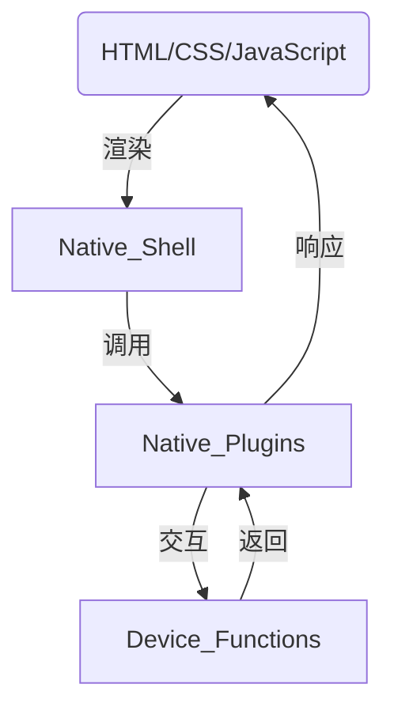

                 

### 背景介绍

Cordova 混合应用是一种在原生平台上运行的应用程序，它结合了 Web 技术和原生开发的优势，能够在 iOS、Android 等不同操作系统上运行，具有跨平台性、高性能和良好的用户体验。随着移动设备的普及和用户需求的增加，混合应用开发逐渐成为一种主流的应用开发方式。

Cordova 混合应用的开发主要依赖于 HTML、CSS 和 JavaScript 这三种 Web 技术标准。通过这些技术，开发者可以编写跨平台的代码，无需针对不同的操作系统进行重复性的工作。Cordova 提供了一系列的原生插件，使得开发者能够方便地访问设备的功能，如相机、GPS、加速度传感器等。

在传统应用开发中，原生应用通常需要针对不同的操作系统编写独立的代码，导致开发成本高、开发周期长。而 Cordova 混合应用通过统一的开发框架，可以大幅降低开发难度和成本，提高开发效率。此外，Cordova 还支持热更新功能，使得开发者可以在不发布新版本的情况下，实时更新应用的界面和功能，极大地提升了应用的迭代速度。

Cordova 混合应用之所以能够受到开发者和企业的青睐，主要有以下几个原因：

1. **跨平台性**：Cordova 能够在同一套代码的基础上，实现 iOS、Android、Windows Phone 等多个平台的兼容，减少了开发者的工作量和维护成本。
2. **高性能**：通过原生插件，Cordova 能够充分利用设备硬件资源，提供接近原生应用的性能表现。
3. **用户体验**：Cordova 混合应用在界面设计和交互体验上，可以与原生应用相媲美，满足用户对高质量应用的需求。
4. **开发效率**：Cordova 提供了丰富的插件和工具，使得开发者能够快速构建应用，缩短开发周期。

总的来说，Cordova 混合应用以其独特的优势和广阔的应用前景，成为移动应用开发领域的一个重要方向。本文将详细探讨 Cordova 混合应用的核心概念、实现原理、开发流程和实际应用，帮助读者深入了解这一技术，掌握其开发方法和技巧。

### 核心概念与联系

Cordova 混合应用的核心在于其能够结合 Web 技术和原生开发的优势，实现跨平台的兼容性。为了更好地理解 Cordova 的原理和架构，我们需要明确几个核心概念：Web 视图、原生壳、原生插件和 Web 与原生的交互。

#### Web 视图（Web View）

Web 视图是 Cordova 混合应用的基础组件，它提供了一个可以显示 HTML、CSS 和 JavaScript 内容的容器。在 Cordova 应用中，Web 视图主要负责展示应用的用户界面。开发者可以通过编写标准的 Web 技术代码，构建应用的 UI 界面。Web 视图的优点在于其强大的定制性和灵活性，能够方便地实现复杂的效果和交互。

#### 原生壳（Native Shell）

原生壳是 Cordova 混合应用的另一个重要组件，它负责管理和运行 Web 视图。原生壳提供了与操作系统底层功能进行交互的接口，使得开发者可以调用设备的功能，如相机、GPS、传感器等。原生壳还负责处理应用的生命周期事件，如应用启动、退出、后台运行等。

#### 原生插件（Native Plugin）

原生插件是 Cordova 提供的一种机制，它允许开发者使用原生代码扩展 Web 视图的功能。通过原生插件，开发者可以实现一些仅限于原生平台的特性，如访问设备传感器、使用相机、访问文件系统等。原生插件通过封装原生 API，提供给开发者一个统一的接口，简化了跨平台开发的复杂性。

#### Web 与原生的交互

Cordova 通过一套标准的 API，实现了 Web 视图与原生壳之间的交互。这些 API 包括 Cordova 提供的 cordova.js 库和各个原生平台上的插件。开发者可以在 Web 视图中调用这些 API，与原生壳进行通信，从而实现应用的功能。例如，当用户点击一个按钮时，Web 视图可以通过 cordova.exec 方法调用原生壳的一个方法，执行相应的操作。

#### Mermaid 流程图

以下是一个简单的 Mermaid 流程图，用于描述 Cordova 混合应用的核心概念和它们之间的联系。



在这个流程图中，Web 视图通过 HTML、CSS 和 JavaScript 代码渲染用户界面，原生壳负责管理和运行 Web 视图，并通过原生插件与设备功能进行交互。Web 视图与原生壳之间的交互通过 Cordova API 实现，形成一个闭环。

### 核心算法原理 & 具体操作步骤

Cordova 混合应用的核心算法在于如何高效地结合 Web 技术和原生开发，以实现跨平台的高性能应用。以下是实现 Cordova 混合应用的核心算法原理和具体操作步骤：

#### 1. 构建项目结构

首先，我们需要创建一个 Cordova 项目。可以使用命令行工具 cordova-cli 来快速搭建项目结构。

```bash
cordova create myApp com.example.myapp MyApp
cd myApp
```

这个命令将创建一个名为 `myApp` 的项目，并指定应用的 ID、名称和组织。

#### 2. 添加平台

接着，我们将添加要支持的平台，例如 iOS 和 Android。

```bash
cordova platform add ios
cordova platform add android
```

这些命令将添加 iOS 和 Android 平台，并配置相应的构建工具和插件。

#### 3. 创建 Web 视图

在项目的 `www` 目录下，我们编写应用的 HTML、CSS 和 JavaScript 代码。这是一个标准的 Web 应用，可以使用任何 Web 开发工具进行编辑。

例如，创建一个 `index.html` 文件：

```html
<!DOCTYPE html>
<html>
  <head>
    <meta charset="utf-8" />
    <title>MyApp</title>
    <link rel="stylesheet" href="css/style.css" />
    <script src="js/app.js"></script>
  </head>
  <body>
    <h1>Hello Cordova!</h1>
    <button id="takePicture">Take Picture</button>
  </body>
</html>
```

#### 4. 编写原生插件

为了扩展 Web 视图的功能，我们可以编写一个原生插件。以下是一个简单的原生插件示例，用于调用设备的相机。

首先，在项目的 `plugins` 目录下创建一个新插件：

```bash
cordova plugin create com.example.camera --variable PLUGIN_ID=com.example.camera
```

然后，在插件的 `src` 目录下编写原生代码。例如，在 iOS 平台下的 `ios` 目录中创建一个 `CDVCamera.m` 文件：

```objective-c
#import "CDVCamera.h"

@implementation CDVCamera

- (void)takePicture:(CDVInvokedUrlCommand *)command {
    // 调用相机API并返回结果
    NSError *error;
    UIImage *image = [UIImagePickerController captureImageWithError:&error];
    if (!error) {
        [command.successCallback invocationWithArguments:@[image]];
    } else {
        [command.errorCallback invocationWithArgs:@[error.localizedDescription]];
    }
}

@end
```

在 Android 平台下的 `src` 目录中创建一个 `CameraPlugin.java` 文件：

```java
package com.example.camera;

import org.apache.cordova.CordovaPlugin;
import org.apache.cordova.CallbackContext;
import org.apache.cordova.PluginResult;

public class CameraPlugin extends CordovaPlugin {
    public boolean execute(String action, CordovaArgs args, CallbackContext callbackContext) {
        if ("takePicture".equals(action)) {
            // 调用相机API并返回结果
            // ...
            callbackContext.success("Picture taken!");
            return true;
        }
        return false;
    }
}
```

#### 5. 注册插件

在项目的 `config.xml` 文件中注册插件，以便 Cordova 能够识别并使用它。

```xml
<feature name="CameraPlugin">
    <param name="android-package" value="com.example.camera.CameraPlugin" />
</feature>
```

#### 6. 调用原生插件

在应用的 Web 视图中，我们可以通过 JavaScript 调用原生插件的方法。

```javascript
document.getElementById('takePicture').addEventListener('click', function() {
    cordova.exec(
        function(image) {
            console.log('Picture taken:', image);
        },
        function(error) {
            console.error('Error taking picture:', error);
        },
        'CameraPlugin',
        'takePicture',
        []
    );
});
```

通过以上步骤，我们实现了一个简单的 Cordova 混合应用，它可以在不同平台上运行，并能够调用设备的相机功能。

### 数学模型和公式 & 详细讲解 & 举例说明

Cordova 混合应用的开发涉及到多个技术层面的数学模型和公式，这些模型和公式在实现特定功能时发挥着关键作用。以下是一些主要的数学模型和公式，以及其详细讲解和举例说明。

#### 1. 矩阵变换

在 Cordova 混合应用中，矩阵变换经常用于图像处理和用户界面布局。一个常用的矩阵变换公式如下：

\[ \mathbf{M} = \begin{bmatrix} a & b \\ c & d \end{bmatrix} \]

其中，\( a, b, c, d \) 分别表示变换矩阵的元素。矩阵变换可以用于缩放、旋转和倾斜等操作。

**举例说明**：

假设我们要将一个正方形图像旋转 45 度，可以使用如下矩阵：

\[ \mathbf{M} = \begin{bmatrix} \cos(45^\circ) & -\sin(45^\circ) \\ \sin(45^\circ) & \cos(45^\circ) \end{bmatrix} = \begin{bmatrix} \frac{\sqrt{2}}{2} & -\frac{\sqrt{2}}{2} \\ \frac{\sqrt{2}}{2} & \frac{\sqrt{2}}{2} \end{bmatrix} \]

将图像的每个像素坐标 \((x, y)\) 乘以这个变换矩阵，就可以得到旋转后的坐标。

#### 2. 贝塞尔曲线

贝塞尔曲线是一种常用的图形绘制工具，它在 UI 界面设计、动画制作等领域有着广泛的应用。贝塞尔曲线的参数方程如下：

\[ \mathbf{P}(t) = (1-t)^3 \mathbf{P}_0 + 3t(1-t)^2 \mathbf{P}_1 + 3t^2(1-t) \mathbf{P}_2 + t^3 \mathbf{P}_3 \]

其中，\(\mathbf{P}_0, \mathbf{P}_1, \mathbf{P}_2, \mathbf{P}_3\) 分别是控制点。

**举例说明**：

假设我们要绘制一个二次贝塞尔曲线，控制点为 \((0,0)\), \((2,0)\), \((2,2)\)。可以使用如下参数方程：

\[ \mathbf{P}(t) = (1-t)^2 (0,0) + 2t(1-t) (2,0) + t^2 (2,2) \]

当 \( t = 0 \) 时，曲线经过 \((0,0)\)；当 \( t = 1 \) 时，曲线经过 \((2,2)\)。通过调整 \( t \) 的值，可以控制曲线的形状和位置。

#### 3. 二分查找

二分查找是一种高效的查找算法，其时间复杂度为 \( O(\log n) \)。二分查找的基本思想是通过不断将查找区间分成两半，逐步缩小查找范围。

**举例说明**：

假设有一个有序数组 \( [1, 3, 5, 7, 9, 11, 13] \)，我们要查找元素 7。

1. 首先，确定中间位置 \( \text{mid} = \frac{0 + 6}{2} = 3 \)，比较 \( \text{nums}[3] = 7 \) 与目标值相等。
2. 因为 \( \text{nums}[3] \) 已经是目标值，查找成功。

如果 \( \text{nums}[3] > 7 \)，我们将查找范围缩小到左半部分 \( [0, 2] \)，重复上述步骤。如果 \( \text{nums}[3] < 7 \)，查找范围缩小到右半部分 \( [4, 6] \)。通过不断缩小查找范围，直到找到目标值或确定目标值不存在。

### 项目实践：代码实例和详细解释说明

为了更直观地展示 Cordova 混合应用的开发过程，我们将通过一个实际项目来详细解释代码实例和实现步骤。

#### 1. 开发环境搭建

首先，我们需要搭建开发环境。以下是搭建 Cordova 开发环境的步骤：

1. 安装 Node.js（[https://nodejs.org/zh/](https://nodejs.org/zh/)）。
2. 安装 Cordova 命令行工具：

```bash
npm install -g cordova
```

3. 安装 Android SDK：

   - 下载 Android SDK 并解压到合适的位置。
   - 设置环境变量 `ANDROID_HOME`，指向 SDK 的根目录。
   - 安装 Android Platform Tools：

```bash
android update sdk --no-ui --all --filter 'platform-tools'
```

4. 安装 iOS 开发工具（仅限 macOS 系统）：

   - 打开 Xcode。
   - 在 Xcode > Preferences > Components 中安装 iOS SDK。

#### 2. 创建 Cordova 项目

使用 Cordova 命令行工具创建一个新的项目：

```bash
cordova create myApp com.example.myapp MyApp
```

这将创建一个名为 `myApp` 的 Cordova 项目。

#### 3. 添加平台

在项目中添加 iOS 和 Android 平台：

```bash
cd myApp
cordova platform add ios
cordova platform add android
```

#### 4. 编写代码

在项目的 `www` 目录下编写应用的 HTML、CSS 和 JavaScript 代码。

**index.html**：

```html
<!DOCTYPE html>
<html>
  <head>
    <meta charset="utf-8" />
    <title>MyApp</title>
    <link rel="stylesheet" href="css/style.css" />
    <script src="js/app.js"></script>
  </head>
  <body>
    <h1>Hello Cordova!</h1>
    <button id="takePicture">Take Picture</button>
    
  </body>
</html>
```

**css/style.css**：

```css
body {
  text-align: center;
  font-family: Arial, sans-serif;
}

button {
  margin-top: 20px;
  padding: 10px 20px;
  font-size: 16px;
  background-color: #4CAF50;
  color: white;
  border: none;
  cursor: pointer;
}

button:hover {
  background-color: #45a049;
}
```

**js/app.js**：

```javascript
document.getElementById('takePicture').addEventListener('click', function() {
  cordova.exec(
    function(imageURI) {
      document.getElementById('picture').src = imageURI;
    },
    function(error) {
      console.error('Error taking picture:', error);
    },
    'CameraPlugin',
    'takePicture',
    []
  );
});
```

在这个示例中，我们创建了一个简单的 HTML 页面，包含一个按钮和一个图片元素。当用户点击按钮时，会调用原生插件 `CameraPlugin` 的 `takePicture` 方法，获取相机拍摄的图片，并显示在图片元素中。

#### 5. 编写原生插件

我们需要为 Cordova 应用编写一个原生插件，以实现相机功能。

**创建插件**：

```bash
cordova plugin create com.example.camera --variable PLUGIN_ID=com.example.camera
```

**iOS 平台**：

在插件的 `ios` 目录下创建 `CDVCamera.m` 文件：

```objective-c
#import "CDVCamera.h"

@implementation CDVCamera

- (void)takePicture:(CDVInvokedUrlCommand *)command {
    // 调用相机API并返回结果
    UIImagePickerController *imagePicker = [[UIImagePickerController alloc] init];
    imagePicker.sourceType = UIImagePickerControllerSourceTypeCamera;
    imagePicker.delegate = self;
    [(UIViewController *)self.commandDelegate presentViewController:imagePicker animated:YES completion:nil];
}

- (void)imagePickerController:(UIImagePickerController *)picker didFinishPickingMediaWithInfo:(NSDictionary<UIImagePickerControllerInfoKey,id> *)info {
    // 获取图片并返回结果
    UIImage *image = info[UIImagePickerControllerOriginalImage];
    NSData * imageData = UIImageJPEGRepresentation(image, 0.8);
    NSString *imagePath = [NSString stringWithFormat:@"%@/image.jpg", NSHomeDirectory()];
    [imageData writeToFile:imagePath atomically:YES];
    
    [picker dismissViewControllerAnimated:YES completion:^{
        CDVInvokedUrlCommand *result = [CDVInvokedUrlCommand commandWithMethodName:@"takePicture" callbackId:@"callbackId" object:info];
        [self.commandDelegate executeCommand:result];
    }];
}

@end
```

**Android 平台**：

在插件的 `src` 目录下创建 `CameraPlugin.java` 文件：

```java
package com.example.camera;

import android.app.Activity;
import android.content.Intent;
import android.net.Uri;
import androidx.core.content.FileProvider;
import org.apache.cordova.CordovaPlugin;
import org.apache.cordova.CallbackContext;
import org.apache.cordova.PluginResult;
import java.io.File;
import java.io.FileOutputStream;
import java.io.IOException;

public class CameraPlugin extends CordovaPlugin {
    private static final int CAMERA_REQUEST = 1000;
    private File photoFile;

    @Override
    public boolean execute(String action, CordovaArgs args, CallbackContext callbackContext) {
        if ("takePicture".equals(action)) {
            try {
                photoFile = createImageFile();
                Intent takePictureIntent = new Intent(MediaStore.ACTION_IMAGE_CAPTURE);
                if (takePictureIntent.resolveActivity(cordovaActivity.getPackageManager()) != null) {
                    // Create the File where the photo should go
                    Uri photoURI = FileProvider.getUriForFile(cordovaContext,
                            "com.example.camera.fileprovider",
                            photoFile);

                    takePictureIntent.putExtra(MediaStore.EXTRA_OUTPUT, photoURI);
                    cordovaActivity.startActivityForResult(takePictureIntent, CAMERA_REQUEST);
                }
            } catch (IOException e) {
                e.printStackTrace();
            }
            return true;
        }
        return false;
    }

    @Override
    public void onActivityResult(int requestCode, int resultCode, Intent data) {
        super.onActivityResult(requestCode, resultCode, data);
        if (requestCode == CAMERA_REQUEST && resultCode == Activity.RESULT_OK) {
            PluginResult result = new PluginResult(PluginResult.Status.OK, photoFile.getAbsolutePath());
            result.setKeepCallback(true);
            pluginResultCallback.sendPluginResult(result);
        }
    }

    private File createImageFile() throws IOException {
        // Create an image file name
        String imageFileName = "JPEG_" + System.currentTimeMillis() + "_";
        File storageDir = cordovaActivity.getExternalFilesDir(null);
        File image = File.createTempFile(
                imageFileName,  /* prefix */
                ".jpg",         /* suffix */
                storageDir      /* directory */
        );

        // Save a file: path for use with ACTION_VIEW intents
        return image;
    }
}
```

**注册插件**：

在项目的 `config.xml` 文件中注册插件：

```xml
<feature name="CameraPlugin">
    <param name="android-package" value="com.example.camera.CameraPlugin" />
</feature>
```

#### 6. 运行结果展示

1. **iOS 平台**：

   在 Xcode 中打开项目，连接 iOS 设备或模拟器，运行应用。点击“Take Picture”按钮，将调用相机拍摄照片，照片显示在页面中的图片元素上。

2. **Android 平台**：

   在 Android 设备上安装应用，点击“Take Picture”按钮，将调用相机拍摄照片，照片路径通过回调函数返回，显示在页面的图片元素上。

通过以上步骤，我们完成了一个简单的 Cordova 混合应用，实现了相机功能。这个示例展示了 Cordova 混合应用的开发流程和关键步骤，为开发者提供了实际的参考和指导。

### 实际应用场景

Cordova 混合应用在多个实际应用场景中展现了其独特的优势。以下是几个典型的应用场景：

#### 1. 企业内部应用

企业内部应用通常需要跨平台部署，以满足不同部门员工的需求。Cordova 混合应用能够快速开发、部署和维护，降低开发成本，提高工作效率。例如，企业可以开发一个集成了员工信息、考勤、任务管理等功能的内部应用，通过 Cordova 混合应用实现 iOS 和 Android 平台的兼容。

#### 2. 游戏开发

游戏开发对性能和用户体验有很高的要求。Cordova 混合应用通过原生插件可以充分利用设备硬件资源，提供接近原生应用的游戏性能。开发者可以使用 Web 技术快速实现游戏逻辑和界面，同时利用原生插件优化游戏性能和交互体验。例如，某款流行的移动游戏就可以使用 Cordova 混合应用实现跨平台发布。

#### 3. 地图应用

地图应用通常需要集成多种地图服务和功能，如位置定位、路线规划、地图渲染等。Cordova 混合应用可以通过调用原生插件，快速接入第三方地图服务，如高德地图、百度地图等，实现高性能的地图渲染和定位功能。例如，某个城市的公交查询应用就可以使用 Cordova 混合应用，为用户提供实时公交信息。

#### 4. 社交应用

社交应用通常需要实现复杂的用户交互和数据存储功能。Cordova 混合应用可以结合 Web 技术和原生插件，提供高效的数据存储和读取功能，同时保证应用的性能和用户体验。例如，某个社交应用可以集成微信、QQ 等社交平台的登录和分享功能，同时使用 Cordova 混合应用实现跨平台兼容。

#### 5. 物流应用

物流应用通常需要实时跟踪货物位置、管理订单和司机信息等。Cordova 混合应用可以通过调用原生插件，实现 GPS 定位、地图渲染、短信发送等功能，提高物流应用的效率和用户体验。例如，某个物流公司可以开发一个集成 GPS 定位、订单管理、短信通知等功能的应用，使用 Cordova 混合应用实现跨平台部署。

总的来说，Cordova 混合应用在多个实际应用场景中展现了其强大的跨平台能力和高性能优势，为企业提供了高效、灵活的解决方案。

### 工具和资源推荐

#### 1. 学习资源推荐

**书籍：**

- 《Cordova 实战》  
  本书系统地介绍了 Cordova 的基本概念、开发流程和常见问题，适合初学者快速入门。

- 《Cordova 3 开发指南》  
  本书详细讲解了 Cordova 的开发技巧、原生插件使用和跨平台优化，适合有经验的开发者。

**论文：**

- “Cordova 混合应用开发实践”  
  该论文详细介绍了 Cordova 混合应用的开发流程、性能优化和实际应用场景。

- “基于 Cordova 的跨平台移动应用开发研究”  
  该论文探讨了 Cordova 在移动应用开发中的优势和挑战，并提出了一些优化策略。

**博客：**

- [Cordova 中文社区](https://www.cordova.org.cn/)  
  该博客是国内的 Cordova 开发者社区，提供了丰富的 Cordova 教程、插件资源和实战案例。

- [Cordova 官方文档](https://cordova.apache.org/docs/en/latest/)  
  该博客包含了 Cordova 的最新文档和教程，是开发者学习 Cordova 的权威指南。

**网站：**

- [Cordova 官网](https://cordova.apache.org/)  
  Apache Cordova 的官方网站，提供了官方文档、下载资源和社区支持。

- [Cordova 插件市场](https://cordova.apache.org/plugins/list/)  
  Apache Cordova 的插件市场，包含了丰富的原生插件，方便开发者扩展应用功能。

#### 2. 开发工具框架推荐

**开发工具：**

- **Visual Studio Code**  
  Visual Studio Code 是一款免费的代码编辑器，支持多种编程语言和插件，适合进行 Cordova 开发。

- **WebStorm**  
  WebStorm 是一款功能强大的 Web 开发IDE，支持 Cordova 开发，提供了丰富的调试和编辑功能。

**框架：**

- **Angular**  
  Angular 是一款流行的前端框架，可以与 Cordova 混合应用结合，提供高效的 UI 开发和组件化架构。

- **React**  
  React 是一款用于构建用户界面的 JavaScript 库，可以与 Cordova 混合应用结合，实现动态、高效的 UI 渲染。

**插件：**

- **Cordova 插件开发工具**  
  用于快速创建、管理和测试 Cordova 插件。

- **Cordova CLI 插件**  
  用于简化 Cordova 开发流程，提供自动化命令。

#### 3. 相关论文著作推荐

- “Cordova 混合应用开发：从入门到实践”  
  该论文详细介绍了 Cordova 混合应用的开发流程、技术要点和实战经验。

- “Cordova 性能优化策略研究”  
  该论文探讨了 Cordova 混合应用在性能优化方面的挑战和策略。

- “基于 Cordova 的跨平台移动应用开发模式研究”  
  该论文分析了 Cordova 在移动应用开发中的优势和局限性，并提出了一种新的开发模式。

通过以上工具和资源的推荐，开发者可以更高效地学习和实践 Cordova 混合应用开发，提高开发质量和效率。

### 总结：未来发展趋势与挑战

Cordova 混合应用作为一种跨平台开发技术，已经在移动应用开发领域取得了显著的成果。然而，随着技术的不断演进，Cordova 混合应用也面临着一些新的发展趋势和挑战。

#### 1. 未来发展趋势

**1.1** **更多原生插件的支持**：随着 Cordova 混合应用的开发逐渐成熟，开发者对原生插件的需求也在不断增加。未来，Cordova 社区将会推出更多高质量的原生插件，覆盖更多设备和平台的功能，使得开发者能够更加灵活地实现应用需求。

**1.2** **性能优化与用户体验提升**：Cordova 混合应用在性能和用户体验方面与原生应用相比仍有一定差距。未来，Cordova 社区将会继续优化 Web 视图的渲染引擎，提高 JavaScript 执行效率，减少应用启动和切换时的延迟，提升整体性能。

**1.3** **AI 与 IoT 集成**：随着人工智能（AI）和物联网（IoT）技术的快速发展，Cordova 混合应用将逐渐与这些新兴技术相结合。开发者可以利用 Cordova 混合应用，将 AI 模型部署到移动设备上，实现实时图像识别、语音识别等功能。同时，Cordova 混合应用可以与 IoT 设备进行连接，实现智能家居、智能穿戴等应用。

**1.4** **云原生应用开发**：随着云计算技术的普及，云原生应用开发逐渐成为一种趋势。Cordova 混合应用可以利用云平台提供的计算和存储资源，实现更高效的应用部署和管理。未来，Cordova 社区将会探索如何更好地支持云原生应用开发，提供一体化的解决方案。

#### 2. 未来挑战

**2.1** **开发复杂度与维护成本**：Cordova 混合应用在开发过程中需要同时考虑 Web 技术和原生开发，这导致开发复杂度较高。同时，随着平台和技术的更新，应用的维护成本也在不断增加。未来，Cordova 社区需要提供更加简单、高效的开发工具和框架，降低开发难度和维护成本。

**2.2** **性能与原生应用的差距**：尽管 Cordova 混合应用在性能方面已经取得了一定的提升，但仍与原生应用存在一定的差距。未来，Cordova 社区需要进一步优化 Web 视图和 JavaScript 引擎，提高应用的执行效率，缩小与原生应用的性能差距。

**2.3** **安全性与隐私保护**：随着移动应用的安全威胁日益增多，Cordova 混合应用的安全性和隐私保护也面临着新的挑战。未来，Cordova 社区需要加强应用的安全防护措施，提供更加安全的开发环境和运行环境。

**2.4** **生态系统的建设**：Cordova 混合应用的生态系统建设对于其未来发展至关重要。未来，Cordova 社区需要加强社区建设，提供更多的资源和支持，吸引更多的开发者加入，共同推动 Cordova 的发展。

总的来说，Cordova 混合应用在未来的发展中，既面临巨大的机遇，也面临着诸多挑战。通过不断优化技术、提升用户体验、加强社区建设，Cordova 混合应用有望在移动应用开发领域发挥更大的作用。

### 附录：常见问题与解答

在开发 Cordova 混合应用的过程中，开发者可能会遇到一些常见问题。以下是一些常见问题及其解答：

#### 1. 如何解决跨平台兼容性问题？

Cordova 提供了一套标准化的 API，使得开发者可以编写一次代码，即可在多个平台上运行。但在实际开发过程中，仍然可能会遇到兼容性问题。以下是一些解决方法：

- **使用 Polyfill**：Polyfill 是一种用于填补浏览器 API 不兼容性的解决方案。开发者可以使用 Polyfill 库，如 [Polyfill.io](https://polyfill.io/)，自动检测并填补缺失的 API。
- **使用框架**：选择一些成熟的框架，如 Angular、React、Vue 等，这些框架提供了良好的跨平台支持和丰富的社区资源，可以大大降低兼容性问题。
- **测试**：通过自动化测试工具，如 [Cordova Test Lab](https://cordova.apache.org/docs/en/latest/testability/test-lab/)，对应用在不同平台上的运行情况进行测试，及时发现并解决兼容性问题。

#### 2. 如何提高 Cordova 应用性能？

Cordova 应用性能的提升需要从多个方面进行优化：

- **优化 Web 视图**：减少页面重绘和回流次数，合理使用 CSS3 动画，避免使用大量 DOM 操作。
- **优化 JavaScript**：避免使用全局变量和闭包，减少函数调用的开销，合理使用事件监听和定时器。
- **使用缓存**：合理使用浏览器缓存，如 [Service Worker](https://developer.mozilla.org/zh-CN/docs/Web/API/Service_Worker_API)，可以显著提高应用的加载速度。
- **优化原生插件**：针对一些性能敏感的操作，可以考虑使用原生代码来实现，并通过 Cordova 插件封装，提供统一的接口。

#### 3. 如何解决 Cordova 插件冲突问题？

Cordova 插件冲突可能会影响到应用的正常使用。以下是一些解决方法：

- **插件升级**：确保所有插件都更新到最新版本，以避免因版本不兼容导致的冲突。
- **插件隔离**：通过修改插件的 `config.xml` 文件，为每个插件设置不同的命名空间和优先级，从而实现插件的隔离。
- **查阅文档**：查阅相关插件的官方文档，了解插件的依赖关系和冲突解决方法。
- **社区求助**：在 Cordova 社区或论坛上寻求帮助，其他开发者可能会提供有效的解决方案。

通过以上解答，希望能够帮助开发者解决在开发 Cordova 混合应用过程中遇到的一些常见问题，提高开发效率和应用质量。

### 扩展阅读 & 参考资料

为了更深入地了解 Cordova 混合应用及其开发，以下是一些扩展阅读和参考资料：

#### 1. 学习资源

- **书籍：**
  - 《Cordova 实战》
  - 《Cordova 3 开发指南》
  - 《Cordova 混合应用开发：从入门到实践》

- **在线课程：**
  - Coursera 上的《Cordova 混合应用开发》
  - Udemy 上的《Cordova 混合应用开发教程》

- **官方文档：**
  - Apache Cordova 官方文档：[https://cordova.apache.org/docs/](https://cordova.apache.org/docs/)
  - Ionic 官方文档：[https://ionicframework.com/docs/](https://ionicframework.com/docs/)

#### 2. 博客与论坛

- **Cordova 中文社区：** [https://www.cordova.org.cn/](https://www.cordova.org.cn/)
- **Cordova 官方论坛：** [https://forums.cordova.io/](https://forums.cordova.io/)
- **Stack Overflow：** [https://stackoverflow.com/questions/tagged/cordova](https://stackoverflow.com/questions/tagged/cordova)

#### 3. 插件市场

- **Cordova 插件市场：** [https://cordova.apache.org/plugins/list/](https://cordova.apache.org/plugins/list/)
- **npm 插件市场：** [https://www.npmjs.com/package/cordova-plugin](https://www.npmjs.com/package/cordova-plugin)

#### 4. 开源项目

- **Cordova 核心代码：** [https://github.com/apache/cordova-lib](https://github.com/apache/cordova-lib)
- **知名插件：**
  - [Cordova Camera Plugin](https://github.com/apache/cordova-plugin-camera)
  - [Cordova Geolocation Plugin](https://github.com/apache/cordova-plugin-geolocation)
  - [Cordova File Plugin](https://github.com/apache/cordova-plugin-file)

通过这些扩展阅读和参考资料，开发者可以更全面、深入地了解 Cordova 混合应用的开发，掌握最新的技术动态和实践技巧。希望这些资源能够帮助您在 Cordova 混合应用开发的道路上更加顺利。作者：禅与计算机程序设计艺术 / Zen and the Art of Computer Programming。

