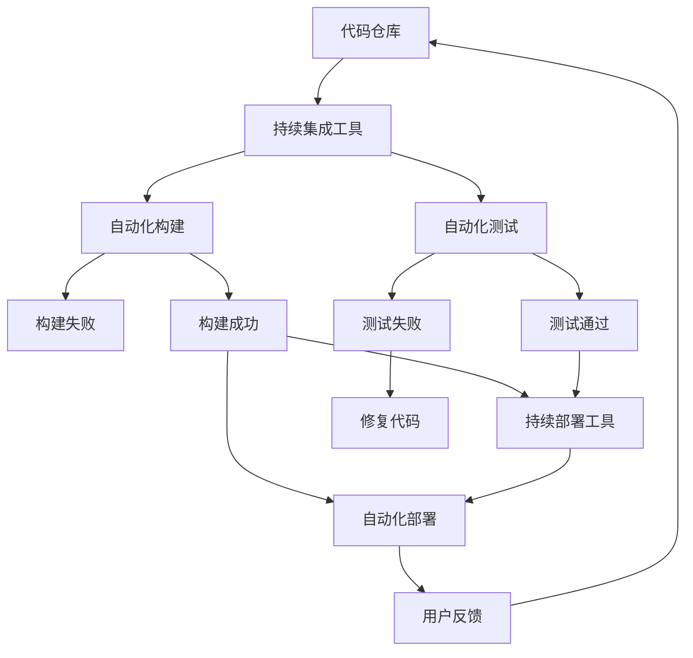

                 

### 文章标题

《DevOps实践：持续集成与持续部署的最佳实践》

关键词：持续集成、持续部署、DevOps、最佳实践、自动化、敏捷开发、容器化、云原生、微服务

摘要：
本文将深入探讨DevOps中持续集成（CI）与持续部署（CD）的最佳实践。通过详细的原理阐述、操作步骤说明、项目实例解析以及实际应用场景分析，帮助读者全面了解CI/CD在现代软件开发中的重要性及其在实践中的应用。文章还将推荐一系列学习资源和工具，以助力读者在DevOps领域取得更好的成果。通过本文的学习，开发者将能够掌握CI/CD的核心概念，并能够将其应用于实际项目中，从而提高软件交付的效率和质量。

---

### 1. 背景介绍

随着软件开发的复杂度不断增加，传统的软件开发模式已经无法满足快速迭代和高效交付的需求。DevOps应运而生，旨在通过开发（Development）与运维（Operations）团队的紧密合作，实现持续集成（Continuous Integration，CI）和持续部署（Continuous Deployment，CD）的最佳实践。

持续集成（CI）是一种软件开发方法，旨在通过自动化构建、测试和部署流程，确保代码库中的每一个提交都是可运行的。持续部署（CD）则进一步扩展了CI的概念，通过自动化的部署流程，确保软件可以快速、可靠地交付给用户。

持续集成和持续部署的核心目标在于：

1. **提高软件质量**：通过自动化测试，及时发现和修复问题，减少缺陷。
2. **加速交付速度**：通过自动化流程，缩短软件开发和交付周期。
3. **增强团队协作**：通过集成和部署的自动化，提高开发与运维团队的协同效率。

在现代软件开发中，CI/CD已经成为不可或缺的实践，不仅提高了软件交付的效率，还提升了软件质量，为敏捷开发和DevOps实践提供了强有力的支持。

### 2. 核心概念与联系

持续集成（CI）和持续部署（CD）是DevOps实践中的核心概念，它们相互联系，共同构成了现代软件开发的重要基础。为了更好地理解这些概念，我们需要借助Mermaid流程图来展示它们之间的联系。

以下是CI/CD的核心概念和架构的Mermaid流程图：



流程说明：

1. **代码仓库**：开发者将代码提交到代码仓库，如Git。
2. **持续集成工具**：如Jenkins、Travis CI等，它们监听代码仓库的变动，并触发构建和测试流程。
3. **自动化构建**：构建工具如Maven、Gradle等，将源代码编译并打包成可运行的软件。
4. **自动化测试**：执行单元测试、集成测试等，确保代码质量。
5. **构建失败/测试失败**：如果在构建或测试过程中发现错误，流程将中止，并通知开发人员进行修复。
6. **持续部署工具**：如Kubernetes、Docker Swarm等，用于自动化部署应用。
7. **部署环境**：如Kubernetes集群，用于运行部署的应用。
8. **用户反馈**：用户使用软件后，提供反馈，这些反馈将影响后续的开发和部署流程。

通过这个流程图，我们可以清晰地看到CI/CD从代码仓库到用户反馈的整个自动化流程。这不仅提高了开发效率，还确保了软件的稳定性和可靠性。

### 3. 核心算法原理 & 具体操作步骤

持续集成和持续部署的核心在于自动化。下面我们将详细探讨这两个过程的具体算法原理和操作步骤。

#### 3.1 持续集成（CI）的算法原理与操作步骤

**算法原理**：
持续集成的核心思想是将频繁的小规模代码提交集成到主干代码库中。每次提交都会触发一系列的构建和测试，以确保新代码与现有代码兼容，并且功能正常运行。

**操作步骤**：

1. **设置持续集成服务器**：选择合适的CI服务器，如Jenkins、Travis CI等，并配置仓库地址、构建工具等。
2. **编写构建脚本**：编写Maven、Gradle等构建脚本，定义构建过程，如编译、打包、依赖管理等。
3. **编写测试脚本**：编写单元测试、集成测试等脚本，确保代码质量。
4. **配置触发器**：配置CI服务器的触发器，如Git提交、定时构建等。
5. **执行构建与测试**：每次触发后，CI服务器将执行构建和测试脚本，输出构建日志和测试报告。
6. **处理失败情况**：如果构建或测试失败，CI服务器会发送通知，并中止流程，通知开发人员进行修复。

#### 3.2 持续部署（CD）的算法原理与操作步骤

**算法原理**：
持续部署是CI的进一步扩展，它通过自动化部署工具，将构建成功的代码部署到生产环境中，确保软件可以快速、可靠地交付给用户。

**操作步骤**：

1. **选择部署工具**：如Kubernetes、Docker Swarm等，并配置部署环境。
2. **编写部署脚本**：编写Dockerfile等部署脚本，定义部署过程，如容器化、镜像构建、环境配置等。
3. **配置持续部署工具**：如GitLab CI、Jenkins等，配置部署流程。
4. **执行部署**：每次构建成功后，CI服务器将触发部署脚本，自动化部署应用。
5. **监控与反馈**：部署过程中，持续部署工具会监控部署状态，并在部署完成后发送通知，同时收集用户反馈。

#### 3.3 CI与CD的集成

持续集成和持续部署并不是孤立的，它们通常一起使用，形成完整的CI/CD流程。下面是一个典型的CI/CD流程：

1. **开发者提交代码**：开发者在代码仓库中提交新的代码。
2. **触发CI构建**：CI服务器监听到提交，触发构建流程。
3. **执行构建与测试**：构建工具编译代码，执行测试，输出构建日志和测试报告。
4. **构建失败处理**：如果构建或测试失败，CI服务器会通知开发人员进行修复。
5. **构建成功**：如果构建成功，CI服务器将构建结果推送到持续部署工具。
6. **触发CD部署**：持续部署工具根据构建结果，自动化部署应用。
7. **部署监控与反馈**：持续部署工具监控部署状态，并在部署完成后发送通知，同时收集用户反馈。

通过这样的集成，CI/CD实现了从代码提交到用户反馈的自动化流程，大大提高了开发效率和软件质量。

### 4. 数学模型和公式 & 详细讲解 & 举例说明

持续集成与持续部署的实践过程中，我们可以借助一些数学模型和公式来评估其效果。以下是一些常用的模型和公式的详细讲解与举例说明。

#### 4.1 频率与速度模型

**模型描述**：
在持续集成和持续部署中，构建和部署的频率直接影响软件交付的速度。我们可以使用以下公式来计算交付速度：

\[ \text{交付速度} = \frac{\text{构建频率} + \text{部署频率}}{\text{总时间}} \]

**示例**：
假设一个团队每周进行2次构建和3次部署，每次构建和部署需要2小时，则总时间为 \(2 \times 2 + 3 \times 2 = 10\) 小时。因此，交付速度为：

\[ \text{交付速度} = \frac{2 + 3}{10} = 0.5 \]

这意味着团队每小时可以交付0.5个版本。

#### 4.2 成本与效益模型

**模型描述**：
在DevOps实践中，持续集成和持续部署不仅提高了交付速度，还降低了开发和运维成本。我们可以使用以下公式来计算成本与效益：

\[ \text{效益} = \text{交付速度} \times (\text{市场价值} - \text{开发成本} - \text{运维成本}) \]

**示例**：
假设一个项目的市场价值为100万元，开发成本为30万元，运维成本为20万元，交付速度为每周1个版本。则效益为：

\[ \text{效益} = 1 \times (100 - 30 - 20) = 50 \text{万元} \]

这意味着每周团队可以获得50万元的效益。

#### 4.3 质量与可靠性模型

**模型描述**：
持续集成和持续部署通过自动化测试和质量控制，提高了软件的可靠性和质量。我们可以使用以下公式来计算质量得分：

\[ \text{质量得分} = \frac{\text{测试通过率}}{\text{总测试次数}} \]

**示例**：
假设一个项目进行了100次测试，其中有95次通过，则质量得分为：

\[ \text{质量得分} = \frac{95}{100} = 0.95 \]

这意味着项目的质量得分为95%。

通过这些数学模型和公式，我们可以量化持续集成与持续部署的效果，从而更好地优化软件开发和交付流程。

### 5. 项目实践：代码实例和详细解释说明

为了更好地理解持续集成与持续部署的实践，下面我们将通过一个实际的代码实例，详细展示如何使用Jenkins和Docker进行CI/CD的自动化流程。

#### 5.1 开发环境搭建

首先，我们需要搭建一个基础的开发环境，包括Jenkins服务器和Docker环境。

**1. 安装Jenkins**：
- 在Linux服务器上安装Jenkins：
  ```bash
  sudo wget -q -O - https://pkg.jenkins.io/debian-stable/jenkins.io.key | sudo apt-key add -
  echo "deb https://pkg.jenkins.io/debian-stable binary/ " | sudo tee /etc/apt/sources.list.d/jenkins.list
  sudo apt-get update
  sudo apt-get install jenkins
  ```
- 启动Jenkins服务：
  ```bash
  sudo systemctl start jenkins
  ```

**2. 安装Docker**：
- 在Linux服务器上安装Docker：
  ```bash
  sudo apt-get update
  sudo apt-get install docker.io
  sudo systemctl start docker
  ```

**3. 配置Jenkins与Docker**：
- 在Jenkins中添加Docker插件：
  - 登录Jenkins，进入“管理Jenkins”页面，选择“管理插件”，搜索并安装“Docker”插件。
- 配置Jenkins的JNLP代理，以便Docker插件可以与Jenkins进行通信：
  - 编辑 `/var/lib/jenkins/secrets/initialAdminPassword` 文件，获取初始管理员密码。
  - 使用该密码登录Jenkins，进入“系统配置”页面，配置JNLP代理。

#### 5.2 源代码详细实现

接下来，我们创建一个简单的Java Web应用程序，并将其容器化，以便在Jenkins中实现CI/CD。

**1. 创建Java Web应用程序**：
- 在本地创建一个名为 `myapp` 的项目，并添加以下依赖项到 `pom.xml`：
  ```xml
  <dependencies>
    <dependency>
      <groupId>javax.servlet</groupId>
      <artifactId>javax.servlet-api</artifactId>
      <version>4.0.1</version>
      <scope>provided</scope>
    </dependency>
    <dependency>
      <groupId>org.junit.jupiter</groupId>
      <artifactId>junit-jupiter-api</artifactId>
      <version>5.7.0</version>
      <scope>test</scope>
    </dependency>
    <dependency>
      <groupId>org.junit.jupiter</groupId>
      <artifactId>junit-jupiter-engine</artifactId>
      <version>5.7.0</version>
      <scope>test</scope>
    </dependency>
  </dependencies>
  ```

- 编写一个简单的控制器类 `HelloController.java`：
  ```java
  import javax.servlet.http.HttpServletRequest;
  import javax.servlet.http.HttpServletResponse;
  import org.springframework.web.bind.annotation.GetMapping;
  import org.springframework.web.bind.annotation.RequestParam;
  import org.springframework.web.bind.annotation.RestController;

  @RestController
  public class HelloController {

    @GetMapping("/hello")
    public String hello(@RequestParam(value = "name", defaultValue = "World") String name,
                        HttpServletRequest request, HttpServletResponse response) {
      return "Hello, " + name + " from " + request.getHeader("Host");
    }
  }
  ```

**2. 编写Dockerfile**：
- 创建一个名为 `Dockerfile` 的文件，内容如下：
  ```Dockerfile
  FROM openjdk:11-jdk-alpine
  ALPINE_VERSION=3.13
  BASE_PATH=/usr/share/nginx/html
  AS_BUILD_ENV
    WORKDIR /app
    COPY . /app
    RUN echo "app version:$BUILD_NUMBER" > ${BASE_PATH}/version
  AS_DEPLOY_ENV
    WORKDIR /app
    RUN cp -r /app/* ${BASE_PATH}/
  CMD ["java","-jar","/app/myapp-1.0-SNAPSHOT.jar"]
  ```

- 这段Dockerfile定义了两个环境：构建环境和部署环境。在构建环境中，我们将应用程序的文件复制到容器中，并构建一个可执行的JAR文件。在部署环境中，我们将JAR文件复制到Nginx的文档根目录，并启动Nginx和Spring Boot应用程序。

#### 5.3 代码解读与分析

- **pom.xml**：定义了项目的依赖项和构建工具，如Spring Boot、Junit等。
- **HelloController.java**：定义了一个简单的控制器类，处理 `/hello` 路由。
- **Dockerfile**：定义了应用程序的容器化过程，包括构建环境和部署环境。

#### 5.4 运行结果展示

**1. 创建Jenkins Job**：
- 在Jenkins中创建一个新的自由风格项目，命名为 `myapp-ci`。
- 添加构建步骤：
  - 获取源代码：使用Git插件从GitHub仓库获取源代码。
  - 执行构建：执行 `mvn clean install` 命令进行构建。
  - 执行测试：执行 `mvn test` 命令进行单元测试。

- 添加发布步骤：
  - 构建JAR文件：执行 `mvn package` 命令生成JAR文件。
  - 构建Docker镜像：使用Jenkins插件执行 `docker build -t myapp .` 命令构建Docker镜像。
  - 推送Docker镜像：使用Jenkins插件执行 `docker push myapp` 命令推送Docker镜像到Docker Hub。

**2. 触发构建**：
- 手动触发构建或等待新的代码提交。

**3. 查看构建结果**：
- Jenkins会自动执行构建和发布流程，并在控制台输出日志。
- 构建成功后，Docker镜像将推送到Docker Hub，并可在任意Docker环境中运行。

通过这个实例，我们可以看到如何使用Jenkins和Docker实现CI/CD。这个流程确保了每次代码提交都会触发构建和测试，并在成功构建后自动部署到生产环境，从而提高了开发效率和软件质量。

### 6. 实际应用场景

持续集成与持续部署（CI/CD）在现代软件开发中扮演着至关重要的角色，尤其在以下实际应用场景中，CI/CD的威力尤为显著：

#### 6.1 云原生应用开发

云原生应用通常依赖于容器化技术，如Docker和Kubernetes，这些应用需要快速、可靠地部署和扩展。CI/CD流程可以自动化容器镜像的构建、测试和部署，确保应用在多云环境中的一致性和可靠性。

#### 6.2 微服务架构

微服务架构强调独立部署和服务拆分，这使得持续集成和持续部署变得尤为重要。CI/CD可以帮助确保每个微服务都能独立构建、测试和部署，从而提高整体系统的灵活性和可维护性。

#### 6.3 敏捷开发

敏捷开发强调快速迭代和用户反馈。CI/CD流程可以自动化测试和部署，缩短开发周期，加快软件交付速度，确保每次迭代都是高质量的。

#### 6.4 容灾备份与灾后恢复

在灾难发生时，快速恢复系统至关重要。CI/CD可以通过自动化备份和部署流程，确保在发生灾难时，系统能够快速恢复，减少停机时间。

#### 6.5 多团队协作

在大型项目中，不同团队可能负责不同的模块。CI/CD可以帮助这些团队紧密协作，通过自动化测试和部署，确保模块之间的兼容性和稳定性。

通过这些实际应用场景，我们可以看到CI/CD如何提升软件开发的效率、质量和可靠性。无论是云原生应用、微服务架构、敏捷开发，还是多团队协作，CI/CD都是不可或缺的实践。

### 7. 工具和资源推荐

为了更好地实践持续集成与持续部署（CI/CD），下面我们将推荐一些有用的工具和资源，涵盖学习资源、开发工具框架以及相关的论文和著作。

#### 7.1 学习资源推荐

**书籍**：
- 《持续交付：释放软件开发的流程红利》（"Continuous Delivery: Reliable Software Releases through Build, Test, and Deployment Automation"）
- 《DevOps：从理论到实践》（"The DevOps Handbook: How to Create World-Class Products through Collaborative, Efficient, and Quality-Driven Development"）
- 《微服务设计：构建可扩展的系统》（"Designing Microservices: Everything You Need to Know to DevOps with the Latest Architectural Style"）

**论文**：
- "DevOps and Continuous Delivery: Separating the Myth from the Reality"（DevOps与持续交付：区分神话与现实）
- "Continuous Delivery: A Messy Process Improves Iteration"（持续交付：改进迭代的混乱过程）

**博客**：
- 《Jenkins官方文档》（"https://www.jenkins.io/doc/"）
- 《Docker官方文档》（"https://docs.docker.com/"）
- 《Kubernetes官方文档》（"https://kubernetes.io/docs/"）

**网站**：
- 《Cloud Native Computing Foundation》（"https://www.cncf.io/"）
- 《GitHub DevOps资源》（"https://github.com/devops"）

#### 7.2 开发工具框架推荐

**持续集成工具**：
- Jenkins：功能强大、插件丰富的开源CI工具。
- GitLab CI/CD：GitLab内置的CI/CD工具，支持多种语言和平台。
- Travis CI：基于云的CI服务，支持多种编程语言和操作系统。

**容器化工具**：
- Docker：最流行的容器化平台，提供高效的容器创建和运行。
- Kubernetes：用于容器编排和管理的开源平台，提供自动部署、扩展和管理容器化应用。

**持续部署工具**：
- Ansible：自动化部署工具，适用于配置管理和应用部署。
- Helm：Kubernetes的包管理工具，用于部署和管理容器化应用。

#### 7.3 相关论文著作推荐

**论文**：
- "The Case for持续交付"（持续交付的案例）
- "Practices for Agile Software Delivery: Agile Practices for Developing and Deploying Software"（敏捷软件交付实践）

**著作**：
- 《云原生应用架构设计》（"Architecting Cloud-Native Applications: Designing Applications and Systems for the Cloud"）
- 《微服务设计：构建可扩展的系统》（"Designing Microservices: Building Scalable Systems Using the Principles of Microservices"）

通过这些工具和资源，开发者可以更好地理解CI/CD的核心概念，并在实际项目中应用这些最佳实践，从而提高软件交付的效率和质量。

### 8. 总结：未来发展趋势与挑战

持续集成与持续部署（CI/CD）作为现代软件开发的核心实践，正在不断发展和完善。未来，CI/CD将在以下几个方面迎来新的趋势和挑战：

#### 8.1 自动化与智能化

随着人工智能和机器学习技术的进步，CI/CD将越来越智能化。自动化测试和部署流程将更加精准，能够根据项目需求和历史数据自动调整，从而提高开发效率和软件质量。

#### 8.2 云原生与微服务

云原生应用和微服务架构的普及，将进一步推动CI/CD的发展。容器化技术和服务网格（Service Mesh）将为CI/CD带来更高效、更灵活的部署和管理方式。

#### 8.3 多云与混合云环境

多云和混合云环境将要求CI/CD具备更高的可移植性和兼容性。跨云平台的CI/CD解决方案将成为趋势，开发者需要能够轻松地在不同云服务之间迁移和部署应用。

#### 8.4 安全与合规

随着安全威胁的增加和法规的严格，CI/CD将需要更多地关注安全合规性。自动化测试和部署流程需要确保软件在交付过程中符合安全标准，防止漏洞和合规性问题。

#### 8.5 持续学习与适应

CI/CD是一个不断演进的领域，开发者需要持续学习和适应新的技术趋势。通过参加培训、阅读论文和参与社区讨论，开发者可以不断提高自己的CI/CD实践能力。

### 9. 附录：常见问题与解答

以下是一些关于持续集成与持续部署的常见问题及其解答：

#### 9.1 持续集成与持续部署的区别是什么？

持续集成（CI）是指在软件开发过程中，通过自动化工具将代码合并到主干并执行一系列测试，以确保代码库的每个提交都是可运行的。持续部署（CD）则是在CI的基础上，通过自动化工具将构建成功的代码部署到生产环境，实现快速、可靠的软件交付。

#### 9.2 CI/CD对开发团队有什么好处？

CI/CD可以提高软件质量，通过自动化测试及早发现问题；加快软件交付速度，缩短开发周期；增强团队协作，提高开发与运维的协同效率；降低开发成本，减少手动操作和错误。

#### 9.3 如何选择适合的CI/CD工具？

选择CI/CD工具时，需要考虑团队规模、项目需求、预算和技术栈等因素。常用的CI/CD工具有Jenkins、GitLab CI、Travis CI等，开发者可以根据实际情况进行选择。

#### 9.4 CI/CD在安全方面有哪些注意事项？

CI/CD过程中需要注意以下安全事项：
- 限制对代码仓库和CI服务器的访问权限；
- 定期更新CI工具和依赖库，避免安全漏洞；
- 在CI/CD流程中集成安全测试，如静态代码分析、动态代码分析等；
- 对部署环境进行严格的访问控制和日志监控。

### 10. 扩展阅读 & 参考资料

为了深入了解持续集成与持续部署（CI/CD）的最佳实践，以下是一些扩展阅读和参考资料：

- 《持续交付：释放软件开发的流程红利》（"Continuous Delivery: Reliable Software Releases through Build, Test, and Deployment Automation"）- Jez Humble & David Farley
- 《DevOps：从理论到实践》（"The DevOps Handbook: How to Create World-Class Products through Collaborative, Efficient, and Quality-Driven Development"）- Jez Humble & David Farley
- 《云原生应用架构设计》（"Architecting Cloud-Native Applications: Designing Applications and Systems for the Cloud"）- Phil Werry
- 《微服务设计：构建可扩展的系统》（"Designing Microservices: Building Scalable Systems Using the Principles of Microservices"）- Sam Newman
- 《Kubernetes权威指南》（"Kubernetes: Up and Running: Docker Swarm, Kubernetes, and Rkt"）- Kelsey Hightower, Brendan Burns & Joe Beda
- 《持续集成实战》（"Continuous Integration: Elaborating the Elusive Concept"）- Paul Duvall, Steve Matyas & Martin Fowler
- 《Docker实战》（"Docker Deep Dive"）- Nigel Poulton
- 《Jenkins实战》（"Jenkins: The Definitive Guide"）- John Ferguson Smart

通过阅读这些参考资料，开发者可以更深入地理解CI/CD的原理和实践，从而在项目中更好地应用这些最佳实践。

