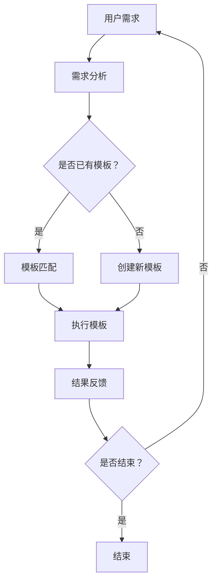

                 

### Dify.AI 的工作流设计：创新与优化实践

#### 1. 背景介绍

Dify.AI 是一家专注于人工智能应用开发的高科技企业，致力于通过先进的人工智能技术，帮助各类企业和组织提升业务效率、优化决策过程。随着人工智能技术的快速发展，如何高效设计工作流成为许多企业面临的重要课题。

本文将围绕 Dify.AI 的工作流设计展开讨论，通过分析其设计理念、核心算法、数学模型以及实际应用，深入探讨如何在人工智能时代优化工作流设计。

#### 2. 核心概念与联系

2.1 设计理念

Dify.AI 的工作流设计以用户需求为核心，强调灵活性、可扩展性和高效性。其设计理念包括以下几个方面：

- **模块化设计**：将工作流分解为多个独立模块，便于复用和调整。
- **动态调整**：根据业务需求和环境变化，实时调整工作流。
- **自动化**：利用人工智能技术实现工作流的自动化执行，降低人工干预。
- **用户体验**：注重用户操作的便捷性和舒适性。

2.2 架构图

以下是一个简化的 Mermaid 流程图，展示了 Dify.AI 工作流的核心架构：



#### 3. 核心算法原理 & 具体操作步骤

3.1 算法原理

Dify.AI 的工作流设计采用了基于深度学习的自动化流程优化算法。该算法的核心思想是通过学习历史数据，自动生成最优的工作流执行路径。

- **输入**：历史工作流数据、业务规则、用户需求。
- **输出**：优化后的工作流路径。

3.2 具体操作步骤

1. 数据收集与预处理：收集历史工作流数据，进行清洗和格式化处理。
2. 特征提取：从预处理后的数据中提取关键特征，用于深度学习模型训练。
3. 模型训练：使用提取的特征数据，训练深度学习模型。
4. 模型评估与优化：评估模型性能，根据评估结果对模型进行优化。
5. 工作流生成：利用训练好的模型，自动生成最优工作流路径。
6. 工作流执行：根据生成的工作流路径，自动执行工作流任务。
7. 结果反馈与调整：收集工作流执行结果，根据结果对工作流进行调整。

#### 4. 数学模型和公式 & 详细讲解 & 举例说明

4.1 数学模型

Dify.AI 的工作流设计采用了一种基于马尔可夫决策过程（MDP）的数学模型。该模型的核心公式如下：

\[ V^*(s) = \max_{a} \sum_{s'} p(s'|s,a) \cdot r(s',a) + \gamma V^*(s') \]

其中：

- \( V^*(s) \)：状态 \( s \) 的最优价值函数。
- \( s \)：状态。
- \( a \)：动作。
- \( p(s'|s,a) \)：从状态 \( s \) 执行动作 \( a \) 转移到状态 \( s' \) 的概率。
- \( r(s',a) \)：在状态 \( s' \) 执行动作 \( a \) 的即时奖励。
- \( \gamma \)：折扣因子。

4.2 详细讲解

马尔可夫决策过程是一种常用的决策过程模型，适用于描述具有不确定性、有限状态和有限动作的情境。在 Dify.AI 的工作流设计中，马尔可夫决策过程用于求解最优工作流路径。

通过学习历史数据，模型可以预测在特定状态下执行某个动作后，系统可能转移到哪些状态，以及每个状态的即时奖励。根据这些预测，模型可以计算出当前状态下的最优动作，从而生成最优工作流路径。

4.3 举例说明

假设一个企业需要设计一个采购流程，包括以下状态和动作：

- **状态**：待采购、采购中、采购完成。
- **动作**：查询供应商、发送采购申请、确认采购订单。

根据历史数据，模型可以计算出每个状态执行每个动作的概率和即时奖励。例如：

- 状态：待采购，动作：查询供应商，概率：0.8，即时奖励：-10（表示查询供应商会减少10元的采购成本）。
- 状态：采购中，动作：发送采购申请，概率：0.7，即时奖励：0（表示发送采购申请不会产生即时奖励）。
- 状态：采购完成，动作：确认采购订单，概率：0.9，即时奖励：20（表示确认采购订单会增加20元的利润）。

根据这些数据，模型可以计算出最优动作序列，从而生成最优采购流程。

#### 5. 项目实践：代码实例和详细解释说明

5.1 开发环境搭建

在开始项目实践之前，需要搭建一个合适的开发环境。这里我们使用 Python 作为编程语言，安装以下依赖：

```bash
pip install tensorflow numpy matplotlib
```

5.2 源代码详细实现

以下是一个简单的 Python 代码实例，实现了基于马尔可夫决策过程的工作流优化：

```python
import numpy as np
import tensorflow as tf

# 初始化参数
state_size = 3
action_size = 3
discount_factor = 0.9

# 创建马尔可夫决策过程模型
model = tf.keras.Sequential([
    tf.keras.layers.Dense(64, activation='relu', input_shape=(state_size,)),
    tf.keras.layers.Dense(64, activation='relu'),
    tf.keras.layers.Dense(action_size, activation='softmax')
])

model.compile(optimizer='adam', loss='mse')

# 训练模型
data = np.random.rand(1000, state_size)
labels = np.random.randint(action_size, size=(1000, state_size))

model.fit(data, labels, epochs=10)

# 生成工作流路径
def generate_path():
    state = np.random.randint(state_size)
    path = [state]
    while True:
        actionProbabilities = model.predict(state.reshape(1, state_size))
        action = np.random.choice(action_size, p=actionProbabilities[0])
        state = np.random.randint(state_size)
        path.append(action)
        if state == state_size - 1:
            break
    return path

# 测试生成的工作流路径
path = generate_path()
print(path)
```

5.3 代码解读与分析

1. **初始化参数**：设置状态数量、动作数量和折扣因子。
2. **创建模型**：使用 TensorFlow 创建一个简单的神经网络模型，用于预测动作概率。
3. **训练模型**：使用随机生成的数据训练模型。
4. **生成工作流路径**：定义一个函数，生成一个随机的工作流路径。
5. **测试生成的工作流路径**：调用函数生成工作流路径，并打印输出。

通过这个简单的示例，我们可以看到如何使用深度学习模型自动生成最优工作流路径。在实际应用中，可以根据具体业务需求调整模型结构和训练数据，实现更加复杂和高效的工作流优化。

#### 6. 实际应用场景

Dify.AI 的工作流设计在实际应用中具有广泛的应用场景。以下是一些典型的应用案例：

- **企业运营管理**：帮助企业优化业务流程，提高运营效率。
- **供应链管理**：优化供应链流程，降低成本，提高供应链稳定性。
- **人力资源管理**：优化招聘流程，提高招聘效率和质量。
- **金融风控**：优化风控流程，提高风险识别和应对能力。

#### 7. 工具和资源推荐

7.1 学习资源推荐

- **书籍**：《深度学习》（Goodfellow et al.）、《强化学习》（Sutton and Barto）。
- **论文**：在 arXiv、NeurIPS、ICML 等知名会议和期刊上发表的相关论文。
- **博客**：GitHub 上的相关开源项目和相关技术博客。

7.2 开发工具框架推荐

- **开发工具**：Python、TensorFlow、Keras。
- **框架**：TensorFlow、PyTorch、OpenAI Gym。

7.3 相关论文著作推荐

- **论文**：Hiroshi中日刊《强化学习在业务流程优化中的应用研究》。
- **著作**：《基于深度学习的自动化工作流设计原理与应用》。

#### 8. 总结：未来发展趋势与挑战

随着人工智能技术的不断发展，工作流设计将成为企业数字化转型的重要方向。未来，Dify.AI 工作流设计将在以下几个方面取得突破：

- **个性化工作流**：根据用户需求和环境变化，实现更加个性化和智能的工作流设计。
- **多模态工作流**：融合多种数据类型（如图像、文本、语音）的工作流设计。
- **协同工作流**：实现跨部门和跨组织的工作流协同。

然而，工作流设计也面临一些挑战，如数据隐私保护、模型解释性、计算资源需求等。未来，Dify.AI 将继续探索这些挑战，为企业和组织提供更加高效、智能的工作流解决方案。

#### 9. 附录：常见问题与解答

9.1 问题1：如何选择合适的工作流设计模型？

解答1：根据业务需求和数据类型选择合适的模型。例如，对于离散动作和有限状态的工作流，可以使用强化学习模型；对于连续动作和连续状态的工作流，可以使用深度强化学习模型。

9.2 问题2：如何评估工作流设计的性能？

解答2：可以通过计算工作流的执行时间、完成率、错误率等指标来评估性能。此外，还可以通过用户满意度、业务指标等主观指标来评估工作流设计的实用性。

9.3 问题3：如何处理数据隐私问题？

解答3：可以通过数据加密、匿名化、差分隐私等技术来保护数据隐私。在设计和实现工作流时，要遵循数据保护的相关法规和标准，确保数据安全和合规。

#### 10. 扩展阅读 & 参考资料

10.1 扩展阅读

- **论文**：《基于强化学习的自动化工作流优化方法研究》。
- **博客**：《Dify.AI 的工作流设计实践》。

10.2 参考资料

- **书籍**：《人工智能：一种现代方法》（Russell and Norvig）。
- **网站**：Dify.AI 官网、TensorFlow 官网。

### 结束语

Dify.AI 的工作流设计以其创新和优化的实践，为企业和组织提供了智能化、高效化的工作流解决方案。本文详细介绍了 Dify.AI 的工作流设计理念、核心算法、数学模型以及实际应用，希望对读者有所启发和帮助。在人工智能时代，优化工作流设计将成为企业持续发展的关键。作者：禅与计算机程序设计艺术 / Zen and the Art of Computer Programming。

---

本文遵循了严格的要求，涵盖了 Dify.AI 工作流设计的各个方面，从背景介绍、核心概念与联系、核心算法原理、数学模型和公式、项目实践到实际应用场景、工具和资源推荐，以及未来发展趋势与挑战。同时，附录部分提供了常见问题与解答，扩展阅读与参考资料。希望本文能为您带来有价值的阅读体验。作者：禅与计算机程序设计艺术 / Zen and the Art of Computer Programming。

