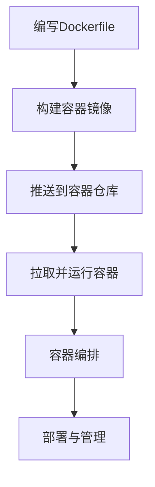
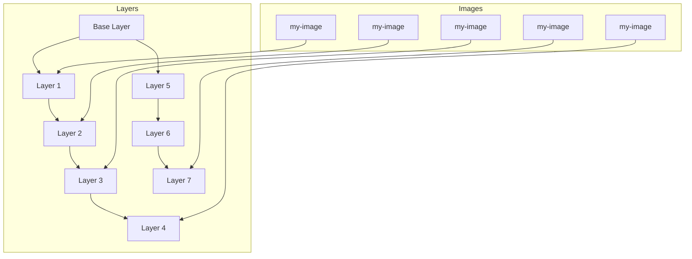

                 

### 1. 背景介绍

Docker容器化技术，自2013年推出以来，迅速成为云计算和软件工程领域的热门话题。它不仅革新了传统的软件开发和部署方式，还为微服务架构的流行提供了强大的支持。Docker容器的核心理念是将应用程序及其运行时环境打包成一个独立的、轻量级的容器，实现一次编写，到处运行的目标。

#### 传统部署与容器化部署的对比

在传统部署方式中，应用程序通常需要依赖特定的操作系统环境和各类库文件。这意味着在不同的环境中部署同一应用程序时，需要针对每个环境进行配置和调整，这不仅增加了部署的复杂度，还可能导致环境不一致的问题。例如，一个在Linux环境下运行良好的应用程序，在Windows环境中可能无法正常运行。

而Docker容器化部署则通过将应用程序及其依赖打包成一个容器，实现了环境的隔离和一致性。容器运行时，仅依赖于容器内部的文件系统，不与宿主机的操作系统发生直接交互。这使得容器可以在任何支持Docker的环境中运行，从而大大简化了应用程序的部署过程。

#### 容器化部署的优势

1. **环境一致性**：容器打包了应用程序及其所有依赖，确保了在不同环境中运行时的一致性，避免了传统部署中环境不一致导致的问题。
2. **轻量级**：容器相比虚拟机，具有更低的资源开销。容器共享宿主机的操作系统内核，无需为每个容器单独分配操作系统资源，因此具有更高的性能和效率。
3. **易扩展性**：容器可以轻松地进行横向扩展，通过增加容器实例的数量来提高系统的处理能力。
4. **敏捷性**：容器部署速度快，易于管理。容器化管理工具如Docker Compose和Kubernetes，提供了丰富的自动化管理功能，进一步提升了部署和运维的效率。
5. **可移植性**：容器具有良好的可移植性，可以在不同的操作系统、云平台和物理机器之间无缝迁移。

#### 容器化部署的现状与未来趋势

随着云计算和微服务架构的普及，容器化部署已经成为现代软件开发和运维的最佳实践。众多大型企业，如亚马逊、微软、谷歌等，已经将容器技术应用于其核心业务中。此外，容器编排工具如Kubernetes的广泛应用，进一步推动了容器化部署的发展。

未来，随着5G、边缘计算等新技术的兴起，容器化部署将继续发挥重要作用。它不仅将支持更复杂的应用场景，还将与其他技术如服务网格、自动化运维等深度融合，为软件开发和运维带来更多创新和可能性。

### 2. 核心概念与联系

#### Docker容器化技术

Docker容器化技术是一种轻量级、可移植、自给自足的容器化应用运行环境。它通过将应用程序及其依赖打包成一个容器镜像，确保了应用程序在不同环境中的一致性。Docker容器的基本概念包括：

1. **Docker Engine**：Docker的核心组件，负责容器的创建、启动、运行和管理。
2. **Dockerfile**：用于构建容器镜像的脚本文件，定义了容器内部的文件系统结构、安装的依赖库和配置文件等。
3. **容器镜像**：容器运行时的模板，包含了应用程序及其依赖的所有文件。
4. **容器**：运行中的实例，基于容器镜像创建，可以执行具体的任务。

#### 容器化部署流程

容器化部署通常包括以下步骤：

1. **编写Dockerfile**：定义容器镜像的构建过程。
2. **构建容器镜像**：使用Dockerfile构建容器镜像。
3. **推送到容器仓库**：将构建好的容器镜像推送到公共或私有容器仓库。
4. **拉取并运行容器**：在需要的环境中拉取容器镜像并运行容器。

#### 容器编排与Kubernetes

容器编排是指管理和自动化容器集群的过程。Kubernetes（简称K8s）是目前最流行的容器编排工具，它提供了丰富的功能，包括容器的自动部署、扩展和管理。Kubernetes的核心概念包括：

1. **Pod**：Kubernetes中最基本的部署单元，可以包含一个或多个容器。
2. **部署（Deployment）**：用于管理和更新Pod的控制器。
3. **服务（Service）**：用于将流量路由到Pod。
4. **存储卷（Volume）**：用于存储容器中的数据。
5. **集群（Cluster）**：由多个节点组成的Kubernetes集群。

#### Mermaid流程图

以下是一个描述容器化部署过程的Mermaid流程图：



### 3. 核心算法原理 & 具体操作步骤

#### Docker容器镜像的构建原理

Docker容器镜像的构建过程主要依赖于Dockerfile。Dockerfile是一组指令，用于定义如何构建容器镜像。以下是构建Docker容器镜像的基本原理和具体操作步骤：

1. **FROM指令**：指定基础镜像。每个Dockerfile都必须以FROM指令开始，该指令指定了将要构建的镜像基于哪个基础镜像。
2. **RUN指令**：用于在容器内执行命令。每个RUN指令会在当前镜像的基础上创建一个新的镜像层，并将命令的输出写入新镜像的文件系统中。
3. **COPY指令**：用于复制文件或目录到容器镜像中。与RUN指令不同，COPY指令不会创建新的镜像层，而是直接复制文件到当前镜像的文件系统中。
4. **EXPOSE指令**：用于暴露容器的端口。该指令告诉Docker容器在运行时需要映射哪些端口。
5. **CMD指令**：用于设置容器启动时执行的命令。如果没有指定CMD指令，Docker会使用容器镜像中指定的默认命令。

以下是构建Docker容器镜像的具体操作步骤：

1. **编写Dockerfile**：

    ```Dockerfile
    FROM ubuntu:18.04
    RUN apt-get update && apt-get install -y nginx
    COPY ./nginx.conf /etc/nginx/nginx.conf
    EXPOSE 80
    CMD ["nginx", "-g", "daemon off;"]
    ```

2. **构建容器镜像**：

    ```bash
    docker build -t my-nginx .
    ```

    该命令会在当前目录下构建一个名为`my-nginx`的容器镜像。

3. **运行容器**：

    ```bash
    docker run -d -p 8080:80 my-nginx
    ```

    该命令会在后台启动一个名为`my-nginx`的容器实例，并将容器的80端口映射到宿主机的8080端口。

#### 容器镜像的分层存储原理

Docker容器镜像采用分层存储技术，使得镜像可以更高效地共享和复用。以下是容器镜像分层存储的基本原理：

1. **分层存储**：每个容器镜像由多个层（layer）组成，每层代表了一个文件系统的变化。例如，一个简单的Docker镜像可能包含操作系统层、应用程序层和配置文件层。
2. **共享存储**：通过共享相同的层，多个镜像可以共享相同的文件系统变化。例如，如果一个镜像是基于另一个镜像构建的，那么它们共享相同的底层层，从而减少了镜像的存储空间。
3. **增量更新**：当需要对容器镜像进行更新时，Docker会创建一个新的层，并在新的层上进行修改。这样，只有修改的部分才会占用额外的存储空间，而不会影响其他层。

#### Docker容器镜像的分层存储原理Mermaid图



### 4. 数学模型和公式 & 详细讲解 & 举例说明

在Docker容器化技术中，有几个关键的数学模型和公式对于理解其性能和资源利用效率至关重要。以下是这些数学模型和公式的详细讲解及举例说明。

#### 1. CPU利用率（CPU Utilization）

CPU利用率是衡量容器性能的一个重要指标，表示CPU被使用的时间与总时间的比例。计算公式如下：

\[ CPU_{Utilization} = \frac{CPU_{Usage}}{CPU_{Capacity}} \]

其中，\( CPU_{Usage} \) 是容器在一段时间内实际使用的CPU资源，\( CPU_{Capacity} \) 是容器的CPU资源限制。

**举例说明：**

假设一个容器在10分钟内使用了5分钟的CPU时间，而该容器的CPU资源限制为2个核心。则：

\[ CPU_{Utilization} = \frac{5}{10 \times 2} = 0.25 \]

即CPU利用率是25%。

#### 2. 内存占用率（Memory Utilization）

内存占用率是衡量容器内存资源利用效率的指标，表示容器使用的内存与总内存的比例。计算公式如下：

\[ Memory_{Utilization} = \frac{Memory_{Usage}}{Memory_{Capacity}} \]

其中，\( Memory_{Usage} \) 是容器当前使用的内存，\( Memory_{Capacity} \) 是容器的内存资源限制。

**举例说明：**

假设一个容器的内存占用为1GB，而该容器的内存限制为2GB。则：

\[ Memory_{Utilization} = \frac{1}{2} = 0.5 \]

即内存占用率是50%。

#### 3. 网络带宽利用率（Network Bandwidth Utilization）

网络带宽利用率是衡量容器网络资源利用效率的指标，表示容器使用的网络带宽与总带宽的比例。计算公式如下：

\[ Network_{Utilization} = \frac{Network_{Usage}}{Network_{Capacity}} \]

其中，\( Network_{Usage} \) 是容器在网络中的数据传输量，\( Network_{Capacity} \) 是容器的网络带宽限制。

**举例说明：**

假设一个容器的网络带宽限制为1Gbps，在1小时内传输了4GB的数据。则：

\[ Network_{Utilization} = \frac{4GB}{1Gbps \times 3600s} = \frac{4}{3600} = 0.0011 \]

即网络带宽利用率约为0.11%。

#### 4. I/O 吞吐量（I/O Throughput）

I/O 吞吐量是衡量容器 I/O 性能的指标，表示单位时间内容器执行的 I/O 操作次数或数据传输量。计算公式如下：

\[ I/O_{Throughput} = \frac{I/O_{Operations}}{Time} \]

或

\[ I/O_{Throughput} = \frac{Data_{Transferred}}{Time \times Unit} \]

其中，\( I/O_{Operations} \) 是 I/O 操作次数，\( Data_{Transferred} \) 是数据传输量，\( Time \) 是测量时间，\( Unit \) 是单位时间（如秒、分钟）。

**举例说明：**

假设一个容器在5分钟内执行了100次 I/O 操作，则：

\[ I/O_{Throughput} = \frac{100}{5 \times 60} = \frac{100}{300} \approx 0.333 \]

即平均每秒钟执行约0.333次 I/O 操作。

#### 5. QoS 配额（Quality of Service Quotas）

QoS 配额用于限制容器对特定资源的使用，确保资源公平分配。常见的 QoS 配额包括 CPU、内存、网络带宽和 I/O 吞吐量。QoS 配额的设置通常基于以下公式：

\[ Resource_{Usage} \leq Resource_{Quota} \]

其中，\( Resource_{Usage} \) 是容器的实际资源使用量，\( Resource_{Quota} \) 是容器分配的资源配额。

**举例说明：**

假设一个容器的 CPU 配额为 2 核心每秒 1 亿次运算，而实际 CPU 使用量为每秒 8000 万次运算，则：

\[ CPU_{Usage} \leq CPU_{Quota} \]

即该容器的 CPU 使用量未超出配额。

### 5. 项目实践：代码实例和详细解释说明

在这一部分，我们将通过一个简单的示例项目，展示如何使用Docker进行容器化部署。我们将构建一个简单的Web应用，并使用Docker和Kubernetes进行部署和管理。

#### 5.1 开发环境搭建

首先，确保您的系统已经安装了Docker和Kubernetes。您可以在[官方Docker文档](https://docs.docker.com/install/)和[Kubernetes文档](https://kubernetes.io/docs/setup/production-environment/tools/kubeadm/install-kubeadm/)中找到详细的安装步骤。

#### 5.2 源代码详细实现

我们选择使用Python编写一个简单的Web应用，使用Flask框架。以下是应用的源代码：

```python
# app.py
from flask import Flask

app = Flask(__name__)

@app.route('/')
def hello():
    return "Hello, World!"

if __name__ == '__main__':
    app.run(host='0.0.0.0', port=8080)
```

接下来，我们需要编写Dockerfile来构建容器镜像。

```Dockerfile
# Dockerfile
FROM python:3.9

WORKDIR /app

COPY requirements.txt ./
RUN pip install -r requirements.txt

COPY . .

EXPOSE 8080

CMD ["python", "app.py"]
```

这里使用了Python官方的Python 3.9镜像作为基础镜像，然后安装了Flask库，并复制了我们的应用代码。最后，暴露了8080端口并设置了启动命令。

#### 5.3 代码解读与分析

**Dockerfile解读：**

1. **FROM python:3.9**：指定基础镜像为Python 3.9。
2. **WORKDIR /app**：设置工作目录为/app。
3. **COPY requirements.txt ./**：复制requirements.txt文件到工作目录。
4. **RUN pip install -r requirements.txt**：安装所需的Python库。
5. **COPY . **：复制当前目录下的所有文件到容器中。
6. **EXPOSE 8080**：暴露8080端口。
7. **CMD ["python", "app.py"]**：设置容器启动时的命令。

#### 5.4 运行结果展示

首先，构建容器镜像：

```bash
docker build -t my-web-app .
```

然后，运行容器：

```bash
docker run -d -p 8080:8080 my-web-app
```

现在，您应该可以通过浏览器访问`http://localhost:8080/`，看到"Hello, World!"的响应。

#### 5.5 Kubernetes部署

为了在Kubernetes集群中部署我们的Web应用，我们需要创建一些Kubernetes配置文件。以下是一个简单的部署配置文件（deployment.yaml）：

```yaml
# deployment.yaml
apiVersion: apps/v1
kind: Deployment
metadata:
  name: my-web-app-deployment
spec:
  replicas: 3
  selector:
    matchLabels:
      app: my-web-app
  template:
    metadata:
      labels:
        app: my-web-app
    spec:
      containers:
      - name: my-web-app
        image: my-web-app:latest
        ports:
        - containerPort: 8080
```

这个配置文件定义了一个名为`my-web-app-deployment`的Deployment对象，它有三个副本（Replica），并选择了具有标签`app: my-web-app`的Pod。每个Pod运行一个容器，使用我们的Web应用镜像。

接下来，应用这个配置文件：

```bash
kubectl apply -f deployment.yaml
```

Kubernetes会创建所需的Pod和Service，并启动我们的Web应用。

#### 5.6 代码解读与分析

**deployment.yaml解读：**

1. **apiVersion: apps/v1**：指定Kubernetes的API版本。
2. **kind: Deployment**：定义资源的类型为Deployment。
3. **metadata**：定义了资源的元数据，如名称。
4. **spec**：定义了资源的具体配置。
5. **replicas**：定义了副本的数量。
6. **selector**：定义了Pod的选择器。
7. **template**：定义了Pod的模板。
8. **metadata**：定义了Pod的元数据。
9. **spec**：定义了Pod的具体配置。
10. **containers**：定义了Pod中的容器配置。
11. **name**：定义了容器的名称。
12. **image**：定义了容器的镜像。
13. **ports**：定义了容器的端口。

#### 5.7 运行结果展示

通过以下命令，可以查看Deployment的状态：

```bash
kubectl get deployments
```

输出应该显示`my-web-app-deployment`的状态为`Running`。

接下来，通过以下命令可以查看Pod的状态：

```bash
kubectl get pods
```

输出应该显示三个Pod的状态都为`Running`。

#### 5.8 代码解读与分析

**kubectl get pods命令输出解读：**

```
NAME                        READY   STATUS    RESTARTS   AGE
my-web-app-deployment-7c5c5946f6-7bbdp   1/1     Running     0          23s
my-web-app-deployment-7c5c5946f6-7bvsk   1/1     Running     0          23s
my-web-app-deployment-7c5c5946f6-9c9ls   1/1     Running     0          23s
```

这里显示了三个Pod的状态都是`Running`，表示Kubernetes已经成功部署了我们的Web应用。

#### 5.9 实践总结

通过以上步骤，我们成功地使用Docker和Kubernetes部署了一个简单的Web应用。这个过程展示了如何将应用程序容器化，并在Kubernetes集群中管理和部署容器。这种容器化部署方式不仅提高了开发效率，还增强了应用的可靠性和可扩展性。

### 6. 实际应用场景

Docker容器化技术已经在多个实际应用场景中得到了广泛应用。以下是几个典型的应用场景：

#### 1. 微服务架构

微服务架构是一种将应用程序拆分为多个独立服务的方法，每个服务负责应用程序的一个特定功能。Docker容器化技术为微服务架构提供了良好的支持，通过将每个微服务打包成独立的容器，可以实现服务的独立部署、测试和扩展。例如，在电子商务系统中，可以使用Docker容器化技术将订单处理、商品管理和支付处理等不同功能拆分为独立的微服务，每个微服务都可以独立部署和扩展。

#### 2. 容器编排与自动化

容器编排工具如Kubernetes可以帮助开发者自动化容器的部署、扩展和管理。通过编写Kubernetes配置文件，可以实现自动化部署、自动化扩展和自动故障恢复等功能。例如，在一个大规模的Web应用中，可以通过Kubernetes自动化管理数百个容器实例，确保系统的可靠性和性能。

#### 3. 云原生应用开发

云原生应用开发是指利用云计算和容器化技术，构建高度可扩展、可复用和可管理的应用。Docker容器化技术为云原生应用开发提供了基础支持，使得开发者可以更快速地构建和部署应用。例如，在金融行业中，可以使用Docker容器化技术快速部署新的交易系统，实现快速迭代和灵活扩展。

#### 4. 数据库服务容器化

数据库服务容器化是另一个重要的应用场景。通过将数据库服务打包成容器镜像，可以实现数据库服务的快速部署、备份和恢复。例如，在数据分析和处理领域，可以使用Docker容器化技术快速部署Hadoop或Spark等大数据处理框架，实现大规模数据处理。

#### 5. 云服务和托管平台

云服务和托管平台如亚马逊AWS、微软Azure和谷歌云等，已经广泛支持Docker容器化技术。通过这些平台，开发者可以轻松部署和管理容器化应用。例如，在开发和测试环境中，可以使用这些云平台提供的容器服务，快速部署和扩展应用。

#### 6. 容器安全

随着容器技术的普及，容器安全问题也越来越受到关注。通过Docker等容器化技术，可以实现容器镜像的签名、认证和监控等功能，提高容器安全性。例如，在企业内部署容器化应用时，可以使用容器安全工具检测和修复容器镜像中的安全漏洞，确保应用的安全性。

### 7. 工具和资源推荐

在Docker容器化技术的学习和应用过程中，有几个工具和资源特别值得推荐。

#### 7.1 学习资源推荐

1. **《Docker实战》**：这是一本非常实用的Docker入门书籍，涵盖了从基础概念到高级应用的各个方面。
2. **Docker官方文档**：Docker官方文档是学习Docker的最佳资源，详细介绍了Docker的所有功能和使用方法。
3. **《Kubernetes权威指南》**：这是一本关于Kubernetes的权威指南，适合希望深入了解Kubernetes的开发者。
4. **Kubernetes官方文档**：Kubernetes官方文档提供了详细的Kubernetes概念和配置指南。

#### 7.2 开发工具框架推荐

1. **Docker Desktop**：Docker官方提供的桌面应用程序，方便在本地环境中构建和运行Docker容器。
2. **Kubernetes Dashboard**：Kubernetes提供的可视化工具，可以帮助开发者和管理员监控和管理Kubernetes集群。
3. **Docker Compose**：Docker Compose是一个用于定义和运行多容器Docker应用程序的工具，可以简化容器编排过程。
4. **Helm**：Helm是一个Kubernetes的包管理工具，可以帮助开发者轻松部署和管理Kubernetes应用。

#### 7.3 相关论文著作推荐

1. **"Docker: Lightweight Virtualization for Development, Test, and Deployment"**：这篇论文详细介绍了Docker的设计原理和核心技术。
2. **"Kubernetes: Design and Implementation"**：这篇论文探讨了Kubernetes的设计和实现，包括其核心组件和架构。
3. **"Microservices: A Definition of a New Approach to Full-Stack Development"**：这篇论文提出了微服务架构的概念，并探讨了其优势和应用。

### 8. 总结：未来发展趋势与挑战

Docker容器化技术自推出以来，已经迅速成为现代软件开发和运维的重要工具。随着云计算、微服务架构和边缘计算的不断发展，容器化技术的应用前景更加广阔。未来，Docker容器化技术可能会在以下几个方面取得重要突破：

#### 1. 更加高效的资源利用

随着硬件技术的进步，容器化技术将进一步提高资源利用效率。通过更精细的调度算法和资源管理策略，容器可以更有效地利用计算、存储和网络资源。

#### 2. 更广泛的平台支持

随着容器技术的普及，未来可能会有更多的操作系统、硬件平台和云平台支持容器化技术。这将使得容器化应用可以更方便地部署和管理，扩大其应用范围。

#### 3. 更高级的安全功能

随着容器化技术的普及，安全问题也日益突出。未来，容器化技术可能会引入更多高级的安全功能，如容器签名、访问控制和安全监控等，提高容器应用的安全性。

#### 4. 与其他技术的融合

容器化技术将继续与其他技术如服务网格、自动化运维和人工智能等深度融合，为软件开发和运维带来更多创新和可能性。

然而，容器化技术也面临着一些挑战：

#### 1. 标准化问题

尽管Docker和Kubernetes已经成为容器化技术的行业标准，但仍然存在一些标准化问题。不同容器化平台之间的兼容性问题可能会影响容器化技术的普及和应用。

#### 2. 安全问题

容器化技术的安全问题仍然是一个挑战。容器镜像的安全性、容器网络的安全性以及容器编排的安全性等方面都需要进一步加强。

#### 3. 复杂性

容器化技术涉及多个组件和工具，对于开发者和管理员来说，学习和使用这些工具可能会增加系统的复杂性。如何简化容器化部署和管理，提高用户体验，是未来需要解决的问题。

总之，Docker容器化技术具有巨大的发展潜力，但也面临着一些挑战。只有通过不断的技术创新和优化，才能充分发挥容器化技术的优势，推动其广泛应用。

### 9. 附录：常见问题与解答

以下是一些关于Docker容器化技术的常见问题及解答：

#### 1. 什么是Docker容器？

Docker容器是一种轻量级、可移植、自给自足的容器化应用运行环境。它通过将应用程序及其依赖打包成一个容器镜像，确保了应用程序在不同环境中的一致性。

#### 2. Docker容器与虚拟机有何区别？

与虚拟机相比，Docker容器具有以下优点：

- **资源消耗更低**：容器共享宿主机的操作系统内核，无需为每个容器单独分配操作系统资源。
- **启动速度更快**：容器启动速度远快于虚拟机，因为不需要启动完整的操作系统。
- **更轻量级**：容器仅包含应用程序及其依赖，而虚拟机还需要包括操作系统和硬件抽象层。

#### 3. 如何构建Docker容器镜像？

构建Docker容器镜像的主要步骤包括：

- 编写Dockerfile：定义容器镜像的构建过程。
- 构建容器镜像：使用Dockerfile构建容器镜像。
- 推送容器镜像：将构建好的容器镜像推送到容器仓库。

#### 4. 如何在Kubernetes中部署Docker容器？

在Kubernetes中部署Docker容器的主要步骤包括：

- 编写Kubernetes配置文件（如deployment.yaml）：定义容器部署的配置。
- 应用配置文件：使用kubectl命令应用配置文件，Kubernetes会创建所需的资源（如Pod、Service等）。
- 查看部署状态：使用kubectl命令查看部署状态，确保容器已成功部署和运行。

#### 5. 如何保证Docker容器镜像的安全性？

保证Docker容器镜像的安全性可以从以下几个方面入手：

- 使用官方镜像：从官方仓库下载镜像，减少安全风险。
- 镜像签名：对容器镜像进行签名，确保镜像未被篡改。
- 安全扫描：使用安全工具扫描容器镜像，检测潜在的安全漏洞。
- 隔离与限制：对容器进行资源限制和访问控制，防止恶意容器攻击宿主机。

### 10. 扩展阅读 & 参考资料

以下是一些关于Docker容器化技术和Kubernetes的扩展阅读和参考资料：

1. **《Docker实战》**：这是一本非常实用的Docker入门书籍，涵盖了从基础概念到高级应用的各个方面。
2. **《Kubernetes权威指南》**：这是一本关于Kubernetes的权威指南，适合希望深入了解Kubernetes的开发者。
3. **Docker官方文档**：[https://docs.docker.com/](https://docs.docker.com/)
4. **Kubernetes官方文档**：[https://kubernetes.io/docs/](https://kubernetes.io/docs/)
5. **"Docker: Lightweight Virtualization for Development, Test, and Deployment"**：这篇论文详细介绍了Docker的设计原理和核心技术。
6. **"Kubernetes: Design and Implementation"**：这篇论文探讨了Kubernetes的设计和实现，包括其核心组件和架构。
7. **"Microservices: A Definition of a New Approach to Full-Stack Development"**：这篇论文提出了微服务架构的概念，并探讨了其优势和应用。作者：禅与计算机程序设计艺术 / Zen and the Art of Computer Programming

