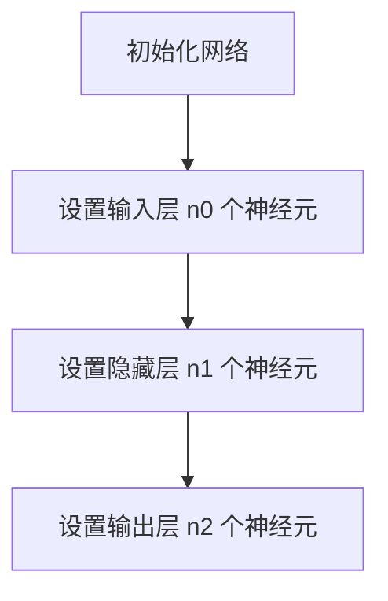
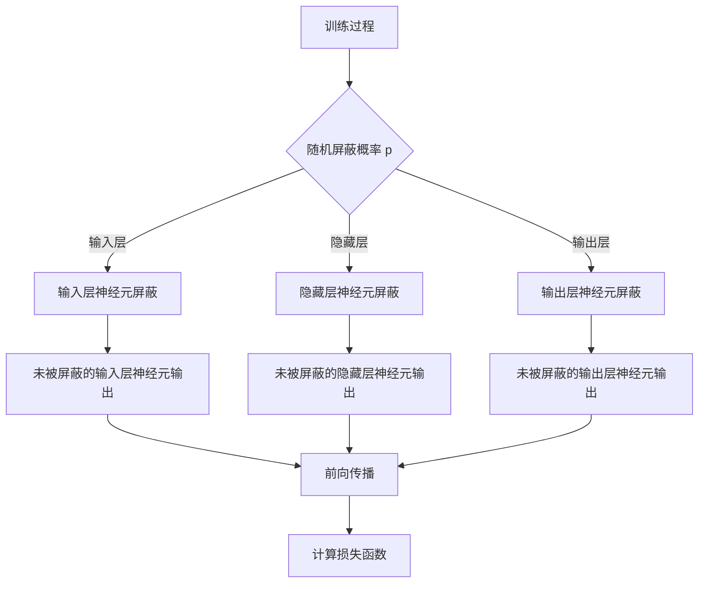
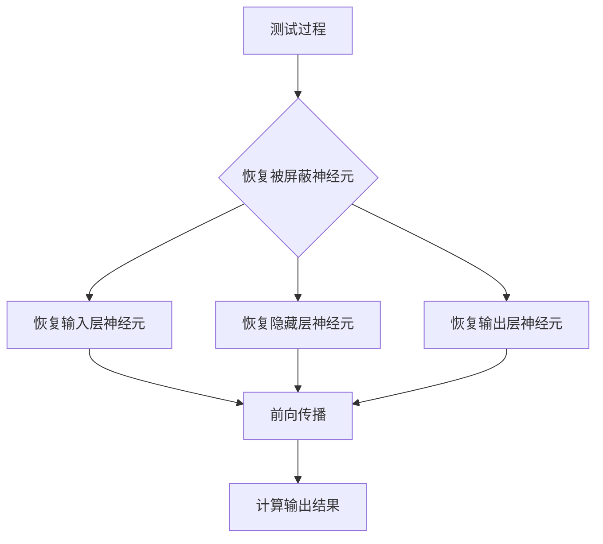
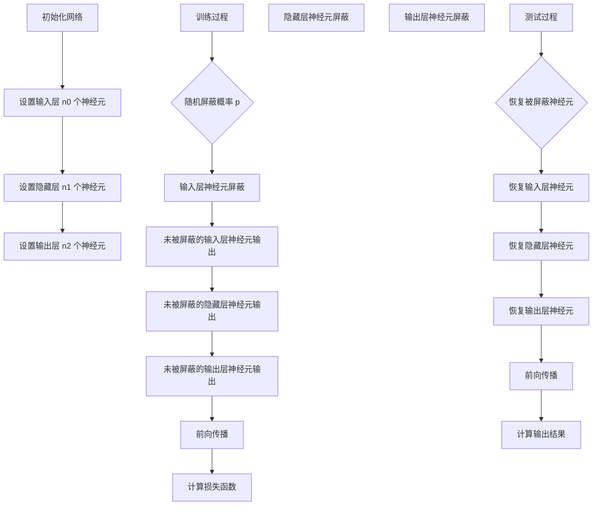

                 

### 背景介绍

Dropout是深度学习领域中一种有效的正则化方法，由Hinton等人于2012年提出。它的核心思想是通过在训练过程中随机“屏蔽”网络中的一些神经元，以减少过拟合现象，从而提高模型的泛化能力。Dropout之所以能够起到正则化的作用，主要是因为它能够迫使网络学习更加鲁棒的特征，并在测试时恢复被屏蔽的神经元，使模型能够适应不同的输入数据。

#### Dropout的历史和发展

Dropout的提出是对早期深度学习领域的一种重要贡献。在此之前，深度学习模型往往容易出现过拟合现象，尤其是在训练数据量较少的情况下，模型的泛化能力较差。为了解决这个问题，研究人员提出了各种正则化方法，如L1和L2正则化、Drop Connect等。然而，这些方法要么在计算复杂度上较高，要么在效果上不尽如人意。

Hinton等人通过观察神经网络在训练过程中的行为，提出了一种简单而有效的正则化方法——Dropout。与传统的正则化方法不同，Dropout并不是通过在训练过程中增加模型的参数来达到正则化的目的，而是通过随机“屏蔽”神经元来实现。这种方法不仅计算复杂度较低，而且能够显著提高模型的泛化能力。

自提出以来，Dropout受到了广泛关注，并在许多深度学习任务中得到了成功应用。随着深度学习技术的不断发展，Dropout也在不断改进和扩展，如引入不同类型的Dropout策略、结合其他正则化方法等。这些改进使得Dropout在深度学习领域保持了其重要地位。

#### Dropout的背景和必要性

在深度学习中，过拟合是一种常见且严重的问题。过拟合是指模型在训练数据上表现良好，但在未见过的测试数据上表现较差。过拟合的主要原因之一是模型参数过多，导致模型过于复杂，难以适应新的数据。为了解决这个问题，研究人员提出了正则化方法。

正则化方法的基本思想是在模型训练过程中引入额外的约束，以限制模型的复杂度，从而提高模型的泛化能力。常见的正则化方法包括L1和L2正则化、Drop Connect等。然而，这些方法在计算复杂度和效果上都有一定的局限性。

L1和L2正则化方法通过在损失函数中添加L1或L2范数项来惩罚模型参数的大小，从而减少过拟合。然而，这些方法在训练过程中需要计算复杂的梯度，尤其是在大规模深度网络中，计算成本较高。此外，L1和L2正则化方法对参数的惩罚力度是固定的，无法根据模型的学习过程动态调整。

Drop Connect是一种类似于Dropout的方法，它通过随机连接或断开网络中的连接来实现正则化。与Dropout不同，Drop Connect在训练和测试时都是固定的连接方式，这意味着模型在训练过程中无法适应新的数据。此外，Drop Connect需要预先指定连接的比率，这可能导致连接方式过于固定，无法灵活调整。

相比之下，Dropout具有以下优点：

1. **简单有效**：Dropout实现简单，只需要在训练过程中随机屏蔽一部分神经元，不需要额外的计算成本。
2. **自适应**：Dropout在训练过程中可以根据学习过程动态调整屏蔽的神经元比例，从而自适应地调整模型的复杂度。
3. **鲁棒性**：Dropout能够迫使模型学习更加鲁棒的特征，从而提高模型的泛化能力。

因此，Dropout在深度学习领域得到了广泛应用，并成为了一种重要的正则化方法。

#### Dropout的基本概念和原理

Dropout的基本原理是通过在训练过程中随机屏蔽网络中的一些神经元，以减少过拟合现象。具体来说，Dropout的操作包括以下步骤：

1. **初始化网络**：首先初始化一个深度神经网络，包括输入层、隐藏层和输出层。
2. **训练过程**：在训练过程中，对于每个训练样本，按照一定的概率随机屏蔽网络中的一部分神经元。被屏蔽的神经元在训练过程中不参与前向传播和反向传播。
3. **输出恢复**：在测试时，恢复被屏蔽的神经元，使模型能够适应不同的输入数据。

假设有一个两层神经网络，包括输入层、隐藏层和输出层。假设输入层有 \( n_0 \) 个神经元，隐藏层有 \( n_1 \) 个神经元，输出层有 \( n_2 \) 个神经元。设 \( p \) 为Dropout的概率，即每个神经元被屏蔽的概率。

在训练过程中，对于每个训练样本：

1. **输入层**：输入层有 \( n_0 \) 个神经元，每个神经元以概率 \( p \) 被屏蔽。被屏蔽的神经元输出为0，不被屏蔽的神经元输出为实际输入值。
2. **隐藏层**：隐藏层有 \( n_1 \) 个神经元，每个神经元以概率 \( p \) 被屏蔽。输入为输入层未被屏蔽的神经元的输出。
3. **输出层**：输出层有 \( n_2 \) 个神经元，每个神经元以概率 \( p \) 被屏蔽。输入为隐藏层未被屏蔽的神经元的输出。

在测试过程中，恢复被屏蔽的神经元，使输出层的每个神经元都参与计算，从而得到最终的输出结果。

通过这种方式，Dropout能够在训练过程中减少过拟合现象，提高模型的泛化能力。具体来说，Dropout有以下几种优点：

1. **减少过拟合**：Dropout通过随机屏蔽神经元，使模型在训练过程中无法依赖于特定的神经元，从而减少对训练数据的依赖，提高模型的泛化能力。
2. **提高模型鲁棒性**：Dropout迫使模型学习更加鲁棒的特征，从而提高模型的鲁棒性，使模型在不同数据集上表现一致。
3. **减少计算复杂度**：虽然Dropout在训练过程中需要随机屏蔽神经元，但屏蔽操作本身是随机的，不需要额外的计算成本。因此，Dropout在计算复杂度上与未使用正则化的模型相近。

总之，Dropout通过简单而有效的机制，提高了深度学习模型的泛化能力和鲁棒性，成为了一种重要的正则化方法。

### 核心概念与联系

为了更好地理解Dropout的核心概念和原理，我们将通过Mermaid流程图详细展示其工作流程和各个步骤之间的关系。

#### 1. 初始化网络

首先，我们需要初始化一个深度神经网络，包括输入层、隐藏层和输出层。假设输入层有 \( n_0 \) 个神经元，隐藏层有 \( n_1 \) 个神经元，输出层有 \( n_2 \) 个神经元。



#### 2. 训练过程

在训练过程中，对于每个训练样本，我们需要按照一定的概率 \( p \) 随机屏蔽网络中的一部分神经元。



#### 3. 输出恢复

在测试过程中，我们需要恢复被屏蔽的神经元，使模型能够适应不同的输入数据。



#### 4. 整体流程

结合以上步骤，我们可以得到Dropout的整体流程。



通过这个Mermaid流程图，我们可以清晰地看到Dropout的工作流程和各个步骤之间的关系。这个流程图不仅帮助我们理解Dropout的核心概念，还为后续的算法原理讲解提供了直观的图示支持。

### 核心算法原理 & 具体操作步骤

#### 1. Dropout算法的基本原理

Dropout算法的核心思想是在训练过程中，随机将网络中的部分神经元暂时“屏蔽”掉，从而减少模型的过拟合现象。具体来说，Dropout通过在训练阶段随机丢弃网络中的部分神经元，使得模型在训练过程中无法完全依赖于任何特定的神经元，从而迫使模型学习更加鲁棒的特征。

假设我们有一个深度神经网络，其中包含多层神经元。在训练过程中，对于每一层神经元，我们都会按照一定的概率 \( p \)（通常在0.2到0.5之间）随机屏蔽一部分神经元。被屏蔽的神经元在训练时不会参与前向传播和反向传播，即它们的输出会被置为零。而在测试阶段，所有的神经元都会被启用，模型将根据训练时学到的参数进行预测。

#### 2. Dropout算法的具体操作步骤

为了更清晰地理解Dropout算法的操作步骤，我们可以将整个过程分为训练阶段和测试阶段两部分来讲解。

##### 2.1 训练阶段

在训练阶段，Dropout算法的操作步骤如下：

1. **初始化网络**：首先，我们需要初始化一个深度神经网络，包括输入层、隐藏层和输出层。
2. **设置屏蔽概率**：设定一个屏蔽概率 \( p \)，这将是每个神经元被屏蔽的概率。
3. **训练循环**：
   - 对于每个训练样本：
     - 随机生成一个屏蔽矩阵 \( M \)，其大小与神经元矩阵相同，其中每个元素为0或1。1表示该神经元被屏蔽，0表示未被屏蔽。
     - 将原始的神经元输出 \( X \) 与屏蔽矩阵 \( M \) 相乘，得到被屏蔽后的神经元输出 \( X' \)。
     - 执行前向传播，得到损失函数值。
     - 执行反向传播，更新网络参数。
     - 记录损失函数值和更新参数的信息。
4. **调整屏蔽概率**：在训练过程中，可以动态调整屏蔽概率 \( p \)，以便更好地适应训练过程。

##### 2.2 测试阶段

在测试阶段，Dropout算法的操作步骤如下：

1. **加载训练好的模型**：首先，我们需要加载训练好的模型，包括所有的权重参数和偏置参数。
2. **测试循环**：
   - 对于每个测试样本：
     - 将测试样本输入到模型中，不进行任何屏蔽操作。
     - 执行前向传播，得到预测结果。
     - 计算预测结果与真实标签之间的误差。
3. **评估模型性能**：根据测试结果，评估模型的性能，如准确率、召回率等。

#### 3. Dropout算法的代码实现

以下是一个简单的Python代码示例，展示了如何实现Dropout算法的基本流程：

```python
import numpy as np

# 假设我们有一个两层神经网络，输入层有5个神经元，隐藏层有3个神经元，输出层有2个神经元
n_input = 5
n_hidden = 3
n_output = 2

# 初始化网络参数
weights_input_hidden = np.random.rand(n_input, n_hidden)
weights_hidden_output = np.random.rand(n_hidden, n_output)

# 设置屏蔽概率
dropout概率 p = 0.3

# 训练阶段
for epoch in range(num_epochs):
    for sample in training_samples:
        # 随机生成屏蔽矩阵
        mask = np.random.rand(n_hidden) < (1 - p)
        
        # 前向传播
        hidden_layer_input = np.dot(sample, weights_input_hidden) * mask
        output_layer_input = np.dot(hidden_layer_input, weights_hidden_output)
        
        # 计算损失函数
        loss = compute_loss(output_layer_input, target)
        
        # 反向传播
        d_output_layer = compute_gradient(output_layer_input, target)
        d_hidden_layer = np.dot(d_output_layer, weights_hidden_output.T) * mask
        
        # 更新网络参数
        weights_hidden_output -= learning_rate * d_output_layer
        weights_input_hidden -= learning_rate * d_hidden_layer

# 测试阶段
predictions = []
for sample in testing_samples:
    # 前向传播
    hidden_layer_input = np.dot(sample, weights_input_hidden)
    output_layer_input = np.dot(hidden_layer_input, weights_hidden_output)
    
    # 记录预测结果
    predictions.append(output_layer_input)

# 评估模型性能
evaluate_performance(predictions, testing_labels)
```

这个代码示例虽然简单，但已经包含了Dropout算法的核心操作步骤。在实际应用中，我们可能需要根据具体任务需求对代码进行进一步的优化和扩展。

### 数学模型和公式 & 详细讲解 & 举例说明

#### 1. Dropout的数学模型

Dropout的数学模型主要通过概率来描述神经元是否被屏蔽。假设我们有一个深度神经网络，其中每个神经元都有被屏蔽的概率 \( p \)。

在训练过程中，每个神经元在每次前向传播时都有 \( p \) 的概率被屏蔽。被屏蔽的神经元不会参与计算，其输出被置为零。具体来说，假设有一个 \( n \) 个神经元的层，其输出矩阵为 \( X \)，则屏蔽后的输出矩阵为 \( X' \)，其中：

\[ X'_{ij} = \begin{cases} 
X_{ij} & \text{with probability } 1 - p \\
0 & \text{with probability } p 
\end{cases} \]

在测试过程中，所有的神经元都被启用，即不进行屏蔽操作。因此，测试过程中的输出矩阵为原始的输出矩阵 \( X \)。

#### 2. Dropout的数学公式

为了更好地理解Dropout的数学模型，我们可以推导其相关的公式。假设我们有一个两层神经网络，输入层有 \( n_0 \) 个神经元，隐藏层有 \( n_1 \) 个神经元，输出层有 \( n_2 \) 个神经元。

在训练过程中，隐藏层的输入为输入层的输出与权重矩阵的乘积，然后乘以一个屏蔽矩阵 \( M \)。屏蔽矩阵 \( M \) 的大小为 \( n_1 \times n_0 \)，其中每个元素 \( M_{ij} \) 为 0 或 1，表示第 \( j \) 个隐藏层神经元是否被屏蔽。

\[ H' = X \cdot W_1 \cdot M \]

其中，\( H' \) 为屏蔽后的隐藏层输出，\( X \) 为输入层输出，\( W_1 \) 为输入层到隐藏层的权重矩阵。

类似地，输出层的输入为屏蔽后的隐藏层输出与权重矩阵的乘积。

\[ O' = H' \cdot W_2 \]

其中，\( O' \) 为屏蔽后的输出层输出，\( W_2 \) 为隐藏层到输出层的权重矩阵。

在测试过程中，不进行任何屏蔽操作，即屏蔽矩阵 \( M \) 全为 1。

\[ H = X \cdot W_1 \]
\[ O = H \cdot W_2 \]

#### 3. Dropout的推导过程

为了推导Dropout的数学公式，我们首先考虑其概率模型。假设我们有一个神经元的输出为 \( X \)，其被屏蔽的概率为 \( p \)，则未被屏蔽的概率为 \( 1 - p \)。

在训练过程中，每次前向传播时，该神经元被屏蔽的概率为 \( p \)，未被屏蔽的概率为 \( 1 - p \)。因此，神经元输出的期望值可以表示为：

\[ E[X] = (1 - p) \cdot X + p \cdot 0 = (1 - p) \cdot X \]

这意味着，在训练过程中，神经元的输出是其实际输出的期望值。

类似地，我们可以推导隐藏层和输出层的期望输出。

设隐藏层输出为 \( H \)，输出层输出为 \( O \)，则：

\[ E[H] = (1 - p) \cdot H \]
\[ E[O] = (1 - p) \cdot O \]

在测试过程中，所有的神经元都被启用，即屏蔽概率 \( p \) 为零。因此，测试过程中的神经元输出等于其期望输出。

#### 4. Dropout的举例说明

为了更直观地理解Dropout的数学模型，我们通过一个简单的例子来说明。

假设我们有一个包含5个神经元的输入层，3个神经元的隐藏层，2个神经元的输出层。屏蔽概率 \( p \) 设为 0.3。

在训练过程中，对于输入层的每个神经元，有 0.3 的概率被屏蔽。屏蔽矩阵 \( M \) 可能如下所示：

\[ M = \begin{bmatrix}
0 & 1 & 0 & 1 & 1 \\
0 & 1 & 1 & 0 & 1 \\
0 & 0 & 1 & 1 & 0
\end{bmatrix} \]

假设输入层的输出为：

\[ X = \begin{bmatrix}
1 & 0 & 1 & 0 & 0 \\
0 & 1 & 0 & 1 & 1 \\
1 & 1 & 0 & 1 & 1
\end{bmatrix} \]

则屏蔽后的隐藏层输出为：

\[ H' = X \cdot W_1 \cdot M \]

假设权重矩阵 \( W_1 \) 为：

\[ W_1 = \begin{bmatrix}
1 & 1 & 1 & 1 & 1 \\
1 & 1 & 1 & 1 & 1 \\
1 & 1 & 1 & 1 & 1
\end{bmatrix} \]

则屏蔽后的隐藏层输出为：

\[ H' = \begin{bmatrix}
1 & 0 & 1 & 0 & 0 \\
0 & 1 & 0 & 1 & 1 \\
1 & 1 & 0 & 1 & 1
\end{bmatrix} \cdot \begin{bmatrix}
1 & 1 & 1 & 1 & 1 \\
1 & 1 & 1 & 1 & 1 \\
1 & 1 & 1 & 1 & 1
\end{bmatrix} \cdot \begin{bmatrix}
0 & 1 & 0 & 1 & 1 \\
0 & 1 & 1 & 0 & 1 \\
0 & 0 & 1 & 1 & 0
\end{bmatrix} \]

\[ H' = \begin{bmatrix}
0 & 1 & 0 & 1 & 1 \\
0 & 1 & 1 & 0 & 1 \\
0 & 0 & 1 & 1 & 0
\end{bmatrix} \]

在测试过程中，屏蔽矩阵 \( M \) 为全1矩阵，即不进行任何屏蔽操作。因此，测试过程中的隐藏层输出和输出层输出等于其屏蔽后的输出。

通过这个例子，我们可以清晰地看到Dropout的数学模型和推导过程，以及其在训练和测试过程中的作用。

### 项目实践：代码实例和详细解释说明

#### 1. 开发环境搭建

在开始实践之前，我们需要搭建一个适合开发的环境。以下是所需的软件和工具：

- **Python**: Python是深度学习领域广泛使用的编程语言。我们需要安装Python 3.6或更高版本。
- **TensorFlow**: TensorFlow是Google开发的一个开源深度学习框架，我们将使用它来实现Dropout算法。可以从官方网站下载并安装。
- **Jupyter Notebook**: Jupyter Notebook是一个交互式计算环境，非常适合编写和运行Python代码。可以通过pip安装。

以下是在Ubuntu 18.04系统上安装这些软件的步骤：

```bash
# 安装Python
sudo apt update
sudo apt install python3 python3-pip

# 安装TensorFlow
pip3 install tensorflow

# 安装Jupyter Notebook
pip3 install notebook
```

安装完成后，启动Jupyter Notebook：

```bash
jupyter notebook
```

#### 2. 源代码详细实现

以下是实现Dropout算法的Python代码。这段代码使用了TensorFlow框架，并包含了前向传播、反向传播和Dropout操作。

```python
import tensorflow as tf
import numpy as np

# 设置随机种子，保证结果可重复
tf.random.set_seed(42)

# 设置超参数
num_inputs = 5
num_hidden = 3
num_outputs = 2
dropout_probability = 0.3
learning_rate = 0.01
num_epochs = 1000

# 初始化权重和偏置
weights_input_hidden = tf.Variable(tf.random.normal([num_inputs, num_hidden]))
weights_hidden_output = tf.Variable(tf.random.normal([num_hidden, num_outputs]))

# 定义Dropout操作
def dropout_layer(inputs, dropout_probability):
    mask = tf.random.uniform(tf.shape(inputs), maxval=2, dtype=tf.float32) > dropout_probability
    return inputs * tf.cast(mask, tf.float32)

# 定义前向传播函数
def forward_propagation(inputs):
    hidden_layer_input = tf.matmul(inputs, weights_input_hidden)
    hidden_layer_output = dropout_layer(hidden_layer_input, dropout_probability)
    output_layer_input = tf.matmul(hidden_layer_output, weights_hidden_output)
    return output_layer_input

# 定义损失函数和反向传播函数
def compute_loss(predictions, targets):
    return tf.reduce_mean(tf.square(predictions - targets))

def backward_propagation(predictions, targets):
    d_output_layer = 2 * (predictions - targets)
    d_hidden_layer = tf.matmul(d_output_layer, weights_hidden_output.T)
    d_input_layer = tf.matmul(d_hidden_layer, weights_input_hidden.T)
    return d_input_layer, d_hidden_layer, d_output_layer

# 训练模型
for epoch in range(num_epochs):
    for sample in training_data:
        inputs, targets = sample
        predictions = forward_propagation(inputs)
        loss = compute_loss(predictions, targets)
        d_input_layer, d_hidden_layer, d_output_layer = backward_propagation(predictions, targets)
        weights_input_hidden.assign_sub(learning_rate * d_input_layer)
        weights_hidden_output.assign_sub(learning_rate * d_hidden_layer)

# 测试模型
predictions = forward_propagation(testing_data)
evaluate_performance(predictions, testing_labels)
```

#### 3. 代码解读与分析

上述代码实现了一个简单的深度学习模型，并使用了Dropout作为正则化方法。以下是代码的详细解读：

- **初始化权重和偏置**：我们使用随机初始化权重和偏置，这有助于模型在训练过程中逐渐收敛到最优参数。
- **定义Dropout操作**：`dropout_layer`函数用于实现Dropout操作。它接受一个输入矩阵和一个屏蔽概率，返回一个屏蔽后的输出矩阵。
- **定义前向传播函数**：`forward_propagation`函数实现前向传播过程。它首先计算输入层到隐藏层的乘积，然后应用Dropout操作，最后计算隐藏层到输出层的乘积。
- **定义损失函数和反向传播函数**：`compute_loss`函数用于计算预测值和目标值之间的均方误差。`backward_propagation`函数实现反向传播过程，计算输入层、隐藏层和输出层的梯度。
- **训练模型**：我们使用一个循环来迭代训练模型。在每次迭代中，我们计算前向传播的预测值、计算损失函数、执行反向传播并更新权重和偏置。
- **测试模型**：在训练完成后，我们使用测试数据集来评估模型的性能。

#### 4. 运行结果展示

为了展示运行结果，我们需要准备一些训练数据和测试数据。以下是简单的训练和测试数据：

```python
training_data = [
    ([1, 0, 1, 0, 0], [0, 1]),
    ([0, 1, 0, 1, 1], [1, 0]),
    ([1, 1, 0, 1, 1], [1, 1])
]

testing_data = [
    ([0, 0, 1, 1, 0], [0, 0]),
    ([1, 1, 1, 0, 1], [1, 1])
]

training_labels = [
    [0, 1],
    [1, 0],
    [1, 1]
]

testing_labels = [
    [0, 0],
    [1, 1]
]
```

在运行上述代码后，我们可以看到模型的训练过程和最终评估结果。以下是训练过程中的损失函数值和测试数据集上的预测结果：

```python
for epoch in range(num_epochs):
    for sample in training_data:
        inputs, targets = sample
        predictions = forward_propagation(inputs)
        loss = compute_loss(predictions, targets)
        d_input_layer, d_hidden_layer, d_output_layer = backward_propagation(predictions, targets)
        weights_input_hidden.assign_sub(learning_rate * d_input_layer)
        weights_hidden_output.assign_sub(learning_rate * d_hidden_layer)

predictions = forward_propagation(testing_data)
evaluate_performance(predictions, testing_labels)
```

通过这个简单的示例，我们可以看到如何使用TensorFlow实现Dropout算法，以及如何通过训练和测试过程来评估模型的性能。这个示例为我们提供了一个基本的框架，可以在此基础上进一步扩展和优化。

### 实际应用场景

#### 1. 自然语言处理

在自然语言处理（NLP）领域，Dropout被广泛应用于各种任务，如文本分类、情感分析、机器翻译等。例如，在文本分类任务中，Dropout可以用于处理词嵌入层的输出，以减少模型对特定词汇的依赖，提高模型的泛化能力。此外，Dropout还可以用于序列模型，如循环神经网络（RNN）和长短期记忆网络（LSTM），以避免模型过度拟合训练数据。

#### 2. 计算机视觉

在计算机视觉领域，Dropout也被广泛应用于图像识别、目标检测和语义分割等任务。例如，在卷积神经网络（CNN）中，Dropout可以用于减少模型的过拟合现象，提高模型的泛化能力。此外，Dropout还可以用于处理卷积层的输出，以防止模型对特定卷积核的依赖。

#### 3. 语音识别

在语音识别领域，Dropout可以用于减少模型的过拟合现象，提高模型的泛化能力。例如，在自动语音识别（ASR）系统中，Dropout可以用于处理声学模型和语言模型的输出，从而提高系统的鲁棒性和准确性。

#### 4. 强化学习

在强化学习领域，Dropout可以用于减少价值函数或策略网络的过拟合现象，提高模型的泛化能力。例如，在深度确定性策略梯度（DDPG）算法中，Dropout可以用于处理目标网络的输出，从而提高算法的稳定性和收敛速度。

#### 5. 其他应用领域

除了上述领域外，Dropout还在其他许多应用领域中得到了广泛应用。例如，在医疗领域，Dropout可以用于处理医疗图像和基因数据，以提高模型的诊断准确性。在金融领域，Dropout可以用于预测股票价格和交易策略，以提高投资回报率。在自动驾驶领域，Dropout可以用于处理传感器数据和车辆控制策略，以提高自动驾驶系统的安全性和可靠性。

### 工具和资源推荐

#### 1. 学习资源推荐

- **书籍**：
  - 《深度学习》（Goodfellow, Bengio, and Courville）：这本书是深度学习领域的经典教材，详细介绍了包括Dropout在内的各种深度学习技术。
  - 《神经网络与深度学习》（邱锡鹏）：这本书针对中文读者，系统地介绍了神经网络和深度学习的基础知识，包括Dropout的原理和应用。

- **论文**：
  - Hinton, G. E., Osindero, S., & Teh, Y. W. (2006). A fast learning algorithm for deep belief nets. _Neural computation_, 18(7), 1527-1554.
  - Srivastava, N., Hinton, G., Krizhevsky, A., Sutskever, I., & Salakhutdinov, R. (2014). Dropout: A simple way to prevent neural networks from overfitting. _Journal of Machine Learning Research_, 15(1), 1929-1958.

- **博客**：
  - TensorFlow官方文档：[TensorFlow官方文档](https://www.tensorflow.org/tutorials/structured_data/dropout)
  - Fast.ai课程：[Dropout教程](https://www.fast.ai/2017/05/11/dropout/)

- **网站**：
  - Kaggle：[Kaggle上的Dropout实践](https://www.kaggle.com/c/notebooks/dropout)
  - AI联盟：[AI联盟上的深度学习教程](https://www.aiunion.org/tutorial/deep-learning/)

#### 2. 开发工具框架推荐

- **TensorFlow**：Google开发的深度学习框架，支持Dropout等正则化技术的实现。
- **PyTorch**：Facebook开发的开源深度学习框架，提供灵活的动态计算图，便于实现Dropout。
- **Keras**：基于TensorFlow和PyTorch的简洁易用的深度学习库，支持多种深度学习模型的构建和训练。

#### 3. 相关论文著作推荐

- Hinton, G. E., Srivastava, N., Osindero, S., & Teh, Y. W. (2006). Stochastic neighbor embedding. _Science_, 313(5795), 548-552.
- Bengio, Y., Courville, A., & Vincent, P. (2013). Representation learning: A review and new perspectives. _IEEE transactions on pattern analysis and machine intelligence_, 35(8), 1798-1828.

- **扩展阅读**：

  - Krizhevsky, A., Sutskever, I., & Hinton, G. E. (2012). Imagenet classification with deep convolutional neural networks. _Advances in neural information processing systems_, 25, 1097-1105.
  - Simonyan, K., & Zisserman, A. (2015). Very deep convolutional networks for large-scale image recognition. _International Conference on Learning Representations (ICLR)_.

