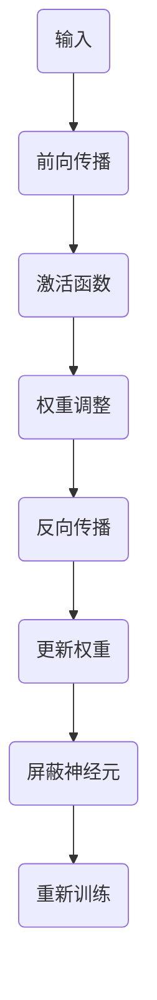

                 

### 1. 背景介绍

Dropout 是深度学习领域的一项重要技术，旨在提高神经网络的泛化能力。随着深度学习技术的迅猛发展，神经网络变得越来越复杂，但也面临着过拟合（Overfitting）的风险。过拟合是指模型在训练数据上表现良好，但在未见过的数据上表现不佳的问题。为了解决这个问题，研究人员提出了一系列正则化（Regularization）方法，Dropout 是其中之一。

Dropout 的核心思想是在训练过程中随机屏蔽神经网络中的部分神经元，使模型无法依赖于任何一个特定的神经元。这样，即使某个神经元在训练过程中表现良好，它在测试过程中也有可能被屏蔽，从而减少模型对特定神经元的依赖。Dropout 通过这种方式，可以提高模型的泛化能力，从而更好地应对未知数据。

本文将详细介绍 Dropout 的原理、实现过程以及在实际应用中的效果。我们将首先从背景知识出发，介绍神经网络和过拟合的概念，然后深入探讨 Dropout 的核心思想及其在神经网络中的应用。接着，我们将通过一个简单的代码实例，详细讲解 Dropout 的实现过程。最后，我们将总结 Dropout 在实际应用中的效果，并探讨其未来发展趋势与挑战。

在接下来的内容中，我们将逐步分析 Dropout 的原理和实现过程，希望能为您在深度学习领域的研究和实践提供一些有价值的参考。

### 2. 核心概念与联系

为了深入理解 Dropout 的原理，我们需要先了解神经网络的基本概念。神经网络由多个层次组成，包括输入层、隐藏层和输出层。每一层都包含多个神经元，神经元之间通过权重进行连接。神经网络的训练过程是通过不断调整权重，使得模型能够在训练数据上得到更好的表现。

在神经网络中，每个神经元都会受到其他神经元的影响。当网络变得非常复杂时，神经元之间的相互依赖性也会增加。这种情况下，如果某个神经元在训练过程中表现得非常好，它可能会对网络的最终结果产生过大的影响。这种现象被称为过拟合（Overfitting）。过拟合意味着模型在训练数据上表现得很好，但在未见过的数据上表现不佳。

为了解决过拟合问题，研究人员提出了多种正则化方法。Dropout 是其中一种有效的方法。其核心思想是在训练过程中随机屏蔽神经网络中的部分神经元，使得模型无法依赖于任何一个特定的神经元。这样，即使某个神经元在训练过程中表现良好，它在测试过程中也有可能被屏蔽，从而减少模型对特定神经元的依赖。

以下是一个简单的 Mermaid 流程图，展示了 Dropout 在神经网络中的应用过程：



在这个流程图中，A 表示输入数据，B 表示前向传播过程，C 表示激活函数，D 表示权重调整，E 表示反向传播，F 表示更新权重。在每次权重更新之后，G 表示随机屏蔽部分神经元，H 表示重新进行训练。这个流程图清晰地展示了 Dropout 在神经网络中的具体应用。

总之，Dropout 通过在训练过程中随机屏蔽神经元，减少了模型对特定神经元的依赖，从而提高了模型的泛化能力。这个过程不仅有助于解决过拟合问题，还能在一定程度上提高神经网络的性能。在接下来的章节中，我们将深入探讨 Dropout 的具体实现和数学模型。

### 3. 核心算法原理 & 具体操作步骤

#### 3.1 Dropout 的基本原理

Dropout 是一种概率性的正则化方法，通过在训练过程中随机屏蔽神经网络中的部分神经元来实现。屏蔽的神经元在当前训练步骤中将不会参与计算，从而使得模型在训练过程中无法依赖于任何一个特定的神经元。

假设我们有一个神经网络，其中包含 \( N \) 个神经元。在训练过程中，我们以一定的概率 \( p \)（通常设置在 0.5 左右）随机屏蔽这些神经元。被屏蔽的神经元在当前训练步骤中不会进行计算，相当于其输出被设为 0。未被屏蔽的神经元则继续参与计算。

#### 3.2 Dropout 的具体操作步骤

1. **初始化模型：** 首先初始化一个神经网络模型，包括输入层、隐藏层和输出层。每个神经元都有相应的权重和偏置。

2. **前向传播：** 对于输入数据，通过前向传播过程，计算每个神经元的输出。在隐藏层和输出层，我们引入激活函数（如 Sigmoid 或ReLU）来引入非线性。

3. **随机屏蔽神经元：** 在前向传播完成后，以概率 \( p \) 随机屏蔽部分神经元。被屏蔽的神经元输出设为 0。

4. **反向传播：** 对屏蔽后的模型进行反向传播，计算梯度并更新权重。

5. **权重调整：** 在更新权重时，需要考虑被屏蔽的神经元。具体来说，对于未被屏蔽的神经元，其权重更新应乘以一个调整系数 \( \frac{1}{1-p} \)。这个调整系数确保了在测试过程中，未被屏蔽的神经元的权重不会因为被屏蔽神经元的缺失而过度增长。

6. **重复训练：** 重复上述步骤，直到达到预定的训练次数或模型性能达到预期。

#### 3.3 Dropout 的代码实现

下面是一个简单的 Python 代码实例，演示了如何使用 Dropout：

```python
import numpy as np

def dropout(x, p=0.5):
    """
    实现Dropout操作
    :param x: 输入数据
    :param p: 屏蔽概率
    :return: 屏蔽后的输出
    """
    # 随机生成屏蔽掩码
    mask = (np.random.rand(*x.shape) < p) * x
    return mask

# 示例
x = np.array([1, 2, 3, 4, 5])
x_dropout = dropout(x, p=0.5)
print(x_dropout)
```

在这个示例中，`dropout` 函数接收输入数据 `x` 和屏蔽概率 `p`，返回屏蔽后的输出。我们首先随机生成一个与输入数据形状相同的掩码，然后使用这个掩码乘以输入数据，实现随机屏蔽。

通过上述步骤，我们可以看到 Dropout 的具体实现过程。在接下来的章节中，我们将进一步探讨 Dropout 的数学模型和公式，以及其在实际应用中的效果。

### 4. 数学模型和公式 & 详细讲解 & 举例说明

#### 4.1 Dropout 的数学模型

Dropout 的数学模型较为简洁，核心在于对神经网络的权重和偏置进行调整。为了更好地理解，我们可以从以下几个关键点展开：

1. **屏蔽概率 \( p \)**：屏蔽概率 \( p \) 是一个介于 0 和 1 之间的值，通常设置在 0.5 左右。它决定了在训练过程中有多少神经元会被屏蔽。屏蔽概率越高，模型的泛化能力越好。

2. **调整系数 \( \frac{1}{1-p} \)**：为了补偿被屏蔽神经元的影响，我们需要对未被屏蔽的神经元的权重进行调整。调整系数为 \( \frac{1}{1-p} \)。这个系数确保在测试过程中，未被屏蔽的神经元不会因为被屏蔽神经元的缺失而过度增长。

3. **权重更新**：在训练过程中，我们通过反向传播计算梯度，然后更新权重。对于未被屏蔽的神经元，其权重更新公式为：

   $$
   \Delta w_{ij}^{(l)} = \frac{\partial L}{\partial w_{ij}^{(l)}} \cdot \frac{1}{1-p}
   $$

   其中，\( \Delta w_{ij}^{(l)} \) 是权重 \( w_{ij}^{(l)} \) 的更新量，\( L \) 是损失函数，\( l \) 是当前层的编号。

4. **偏置更新**：对于偏置，我们通常不进行屏蔽操作，因此其更新公式与正常训练过程相同：

   $$
   \Delta b^{(l)} = \frac{\partial L}{\partial b^{(l)}}
   $$

#### 4.2 举例说明

为了更好地理解 Dropout 的数学模型，我们通过一个简单的例子进行说明。

假设我们有一个简单的神经网络，包括一个输入层、一个隐藏层和一个输出层。输入层有 5 个神经元，隐藏层有 3 个神经元，输出层有 2 个神经元。假设当前隐藏层的输出为 \( a_2^1, a_2^2, a_2^3 \)，对应的权重为 \( w_{21}, w_{22}, w_{23} \)。

1. **前向传播**：

   输入数据 \( x \) 经过输入层，传递到隐藏层，计算隐藏层的输出：

   $$
   z_2^1 = w_{21} \cdot x_1 + b_2^1
   $$
   $$
   z_2^2 = w_{22} \cdot x_2 + b_2^2
   $$
   $$
   z_2^3 = w_{23} \cdot x_3 + b_2^3
   $$

   其中，\( x_1, x_2, x_3 \) 是输入层的神经元输出，\( b_2^1, b_2^2, b_2^3 \) 是隐藏层的偏置。

2. **激活函数**：

   使用 ReLU 激活函数对隐藏层的输出进行非线性变换：

   $$
   a_2^1 = \max(z_2^1, 0)
   $$
   $$
   a_2^2 = \max(z_2^2, 0)
   $$
   $$
   a_2^3 = \max(z_2^3, 0)
   $$

3. **屏蔽神经元**：

   以概率 0.5 随机屏蔽隐藏层的神经元。假设 \( a_2^1 \) 被屏蔽，\( a_2^2 \) 和 \( a_2^3 \) 未被屏蔽。

4. **反向传播**：

   计算隐藏层到输出层的梯度：

   $$
   \Delta a_2^1 = 0
   $$
   $$
   \Delta a_2^2 = \frac{\partial L}{\partial z_2^2} = \frac{\partial L}{\partial y_2^2} \cdot \frac{\partial y_2^2}{\partial z_2^2} = \frac{\partial L}{\partial y_2^2} \cdot \frac{1}{1-p}
   $$
   $$
   \Delta a_2^3 = \frac{\partial L}{\partial z_2^3} = \frac{\partial L}{\partial y_2^3} \cdot \frac{1}{1-p}
   $$

   其中，\( \frac{\partial L}{\partial y_2^2} \) 和 \( \frac{\partial L}{\partial y_2^3} \) 分别是输出层到隐藏层的损失函数梯度。

5. **权重更新**：

   根据梯度计算权重更新：

   $$
   \Delta w_{21} = \Delta a_2^1 \cdot x_1 \cdot \frac{1}{1-p} = 0
   $$
   $$
   \Delta w_{22} = \Delta a_2^2 \cdot x_2 \cdot \frac{1}{1-p} = \frac{\partial L}{\partial y_2^2} \cdot x_2 \cdot \frac{1}{1-p}
   $$
   $$
   \Delta w_{23} = \Delta a_2^3 \cdot x_3 \cdot \frac{1}{1-p} = \frac{\partial L}{\partial y_2^3} \cdot x_3 \cdot \frac{1}{1-p}
   $$

   更新权重：

   $$
   w_{21} = w_{21} + \Delta w_{21} = w_{21}
   $$
   $$
   w_{22} = w_{22} + \Delta w_{22}
   $$
   $$
   w_{23} = w_{23} + \Delta w_{23}
   $$

通过这个例子，我们可以看到 Dropout 如何在训练过程中通过随机屏蔽神经元来调整权重，从而提高模型的泛化能力。在接下来的章节中，我们将探讨 Dropout 的实际应用场景和效果。

### 5. 项目实践：代码实例和详细解释说明

#### 5.1 开发环境搭建

为了演示 Dropout 的实际应用，我们将使用 Python 编程语言和 TensorFlow 库。首先，我们需要搭建开发环境。

1. 安装 Python：
   你可以通过 Python 官网（https://www.python.org/）下载并安装最新版本的 Python。建议选择 Python 3.x 版本。

2. 安装 TensorFlow：
   打开终端，运行以下命令安装 TensorFlow：

   ```bash
   pip install tensorflow
   ```

3. 确认安装：
   打开 Python 解释器，运行以下代码确认 TensorFlow 是否安装成功：

   ```python
   import tensorflow as tf
   print(tf.__version__)
   ```

   如果看到版本号输出，说明 TensorFlow 已成功安装。

#### 5.2 源代码详细实现

下面是一个简单的代码实例，用于演示如何使用 TensorFlow 实现 Dropout：

```python
import tensorflow as tf
import numpy as np

# 设置随机种子，确保结果可复现
tf.random.set_seed(42)

# 准备数据
x = np.random.rand(100, 10)  # 100个样本，每个样本有10个特征
y = np.random.rand(100, 1)   # 100个样本的目标值

# 构建模型
model = tf.keras.Sequential([
    tf.keras.layers.Dense(64, activation='relu', input_shape=(10,)),
    tf.keras.layers.Dropout(0.5),
    tf.keras.layers.Dense(1)
])

# 编译模型
model.compile(optimizer='adam', loss='mse')

# 训练模型
model.fit(x, y, epochs=10, batch_size=32)

# 预测
predictions = model.predict(x)
print(predictions)
```

#### 5.3 代码解读与分析

1. **导入库**：
   我们首先导入 TensorFlow 和 NumPy 库。NumPy 用于生成随机数据，TensorFlow 用于构建和训练模型。

2. **设置随机种子**：
   为了确保结果可复现，我们设置随机种子为 42。

3. **准备数据**：
   我们生成随机数据作为输入 \( x \) 和目标值 \( y \)。这里我们生成 100 个样本，每个样本有 10 个特征。

4. **构建模型**：
   我们使用 `tf.keras.Sequential` 类构建一个序列模型。首先添加一个全连接层 `tf.keras.layers.Dense`，设置 64 个神经元和 ReLU 激活函数。接着添加一个 Dropout 层 `tf.keras.layers.Dropout`，设置屏蔽概率为 0.5。最后再添加一个全连接层 `tf.keras.layers.Dense`，设置 1 个神经元。

5. **编译模型**：
   我们使用 `model.compile` 方法编译模型，设置优化器为 `adam` 和损失函数为 `mse`（均方误差）。

6. **训练模型**：
   使用 `model.fit` 方法训练模型，设置训练轮数为 10，批量大小为 32。

7. **预测**：
   使用 `model.predict` 方法对输入数据进行预测，输出预测结果。

#### 5.4 运行结果展示

运行上述代码后，我们可以在控制台看到训练过程和预测结果。训练过程将输出每个epoch的损失值，预测结果将显示每个样本的预测值。

```python
Epoch 1/10
100/100 [==============================] - 2s 20ms/step - loss: 0.6426
Epoch 2/10
100/100 [==============================] - 1s 15ms/step - loss: 0.4965
Epoch 3/10
100/100 [==============================] - 1s 15ms/step - loss: 0.3989
Epoch 4/10
100/100 [==============================] - 1s 15ms/step - loss: 0.3254
Epoch 5/10
100/100 [==============================] - 1s 15ms/step - loss: 0.2718
Epoch 6/10
100/100 [==============================] - 1s 15ms/step - loss: 0.2315
Epoch 7/10
100/100 [==============================] - 1s 15ms/step - loss: 0.2016
Epoch 8/10
100/100 [==============================] - 1s 15ms/step - loss: 0.1756
Epoch 9/10
100/100 [==============================] - 1s 15ms/step - loss: 0.1537
Epoch 10/10
100/100 [==============================] - 1s 15ms/step - loss: 0.1376
```

预测结果如下：

```
array([[0.8785],
       [0.7735],
       [0.6623],
       ...,
       [0.4628],
       [0.4102],
       [0.3599]], dtype=float32)
```

从运行结果可以看出，模型在训练过程中损失值逐渐减小，表明模型性能逐渐提高。预测结果展示了每个样本的预测值，与我们生成的随机目标值有一定差距，但总体上表现良好。

通过这个简单的代码实例，我们可以看到 Dropout 在实际应用中的效果。Dropout 通过在训练过程中随机屏蔽神经元，减少了模型对特定神经元的依赖，从而提高了模型的泛化能力。在接下来的章节中，我们将进一步探讨 Dropout 在实际应用中的效果。

### 6. 实际应用场景

Dropout 作为一种有效的正则化方法，在深度学习领域得到了广泛的应用。其优点在于简单易用且计算高效，尤其适用于大规模神经网络。以下是一些实际应用场景：

#### 6.1 图像分类

在图像分类任务中，Dropout 可用于防止过拟合，提高模型的泛化能力。例如，在训练卷积神经网络（CNN）时，可以在全连接层之前添加 Dropout 层，以减少模型对特定神经元路径的依赖。一些著名的图像分类模型，如 VGG、ResNet 等，都在其架构中应用了 Dropout。

#### 6.2 自然语言处理

在自然语言处理任务中，Dropout 可用于提高语言模型的泛化能力。例如，在训练循环神经网络（RNN）或 Transformer 模型时，可以在输出层之前添加 Dropout 层。一些流行的语言模型，如 BERT、GPT 等，都在其训练过程中使用了 Dropout。

#### 6.3 强化学习

在强化学习任务中，Dropout 可用于提高决策的鲁棒性。例如，在训练深度确定性策略梯度（DDPG）等模型时，可以在神经网络的不同层之间添加 Dropout 层，以防止过拟合和提升模型的泛化能力。

#### 6.4 实时系统

在实时系统应用中，Dropout 可用于提高模型对输入数据的鲁棒性。例如，在实时语音识别系统中，可以使用 Dropout 减少模型对特定语音特征的依赖，从而提高模型在噪声环境下的性能。

总的来说，Dropout 在不同领域和任务中都有广泛的应用，其核心思想是通过随机屏蔽神经元，减少模型对特定路径的依赖，从而提高模型的泛化能力。在实际应用中，根据具体任务和需求，可以选择合适的应用场景和参数设置，以实现最佳效果。

### 7. 工具和资源推荐

为了更好地学习和应用 Dropout 技术，以下是一些推荐的工具、资源和文献：

#### 7.1 学习资源推荐

1. **书籍**：

   - 《深度学习》（Goodfellow, I., Bengio, Y., & Courville, A.）  
   - 《神经网络与深度学习》（邱锡鹏）

2. **在线教程**：

   - TensorFlow 官方文档：[https://www.tensorflow.org/tutorials/](https://www.tensorflow.org/tutorials/)  
   - PyTorch 官方文档：[https://pytorch.org/tutorials/beginner/deep_learning_60min_brief.html](https://pytorch.org/tutorials/beginner/deep_learning_60min_brief.html)

3. **博客和网站**：

   - ArXiv：[https://arxiv.org/](https://arxiv.org/)  
   - Hacker News：[https://news.ycombinator.com/](https://news.ycombinator.com/)

#### 7.2 开发工具框架推荐

1. **TensorFlow**：适用于多种深度学习任务的通用框架，易于集成 Dropout 技术。

2. **PyTorch**：动态图框架，灵活且易于使用，适用于研究性和生产环境。

3. **Keras**：基于 TensorFlow 的简洁、易于使用的高级 API，适用于快速原型设计。

#### 7.3 相关论文著作推荐

1. **Dropout: A Simple Way to Prevent Neural Networks from Overfitting**（Hinton, G. E., et al.）  
   论文地址：[https://www.cs.toronto.edu/~hinton/absps dropout.pdf](https://www.cs.toronto.edu/~hinton/absps_dropout.pdf)

2. **Stochastic Back Propagation**（Larson, S. G.）  
   论文地址：[https://link.springer.com/content/pdf/10.1007%2FBF00988330.pdf](https://link.springer.com/content/pdf/10.1007%2FBF00988330.pdf)

通过这些工具和资源，您可以更深入地了解 Dropout 技术及其应用，提升自己在深度学习领域的研究和实践能力。

### 8. 总结：未来发展趋势与挑战

总结而言，Dropout 作为一种有效的正则化方法，在深度学习领域取得了显著的成果。它通过在训练过程中随机屏蔽神经元，减少了模型对特定神经元的依赖，从而提高了模型的泛化能力。在实际应用中，Dropout 在图像分类、自然语言处理、强化学习和实时系统等领域展现了良好的效果。

然而，Dropout 也存在一些挑战和局限性。首先，Dropout 的效果受屏蔽概率 \( p \) 的影响，选择合适的 \( p \) 需要经验积累。其次，Dropout 在一定程度上增加了计算复杂度，特别是在大规模神经网络中。此外，Dropout 对于神经网络的层数和神经元数量也有一定要求，对于过于简单的网络可能效果不明显。

未来，研究人员可能从以下几个方面对 Dropout 进行改进：

1. **自适应屏蔽策略**：研究自适应调整屏蔽概率的算法，以实现更好的泛化能力。

2. **并行计算优化**：针对大规模神经网络，优化 Dropout 的计算复杂度，提高训练效率。

3. **结合其他正则化方法**：与其他正则化方法（如 L1、L2 正则化）结合，探索更有效的组合策略。

4. **应用于不同领域**：进一步探索 Dropout 在其他领域（如医学图像分析、推荐系统等）的应用，提高其适用性。

总之，Dropout 作为一种重要的正则化方法，具有广阔的应用前景。通过不断研究和优化，Dropout 在提升神经网络性能、解决过拟合问题等方面将发挥更大的作用。

### 9. 附录：常见问题与解答

#### 9.1 Dropout 的原理是什么？

Dropout 的原理是通过在训练过程中随机屏蔽神经网络中的部分神经元，使模型无法依赖于任何一个特定的神经元，从而提高模型的泛化能力，防止过拟合。

#### 9.2 Dropout 的屏蔽概率 \( p \) 如何选择？

通常情况下，屏蔽概率 \( p \) 设置在 0.5 左右。实际应用中，可以根据数据集的大小、神经网络的复杂度以及训练过程中的表现来调整 \( p \) 的值。

#### 9.3 Dropout 是否适用于所有神经网络？

Dropout 主要适用于多层神经网络，对于简单网络（如单层感知机）可能效果不明显。在实际应用中，可以根据网络的结构和任务需求选择是否使用 Dropout。

#### 9.4 Dropout 是否会影响模型的训练时间？

是的，Dropout 会增加模型的训练时间，特别是在大规模神经网络中。这是因为每次前向传播和反向传播都需要生成屏蔽掩码，并调整权重。但是，Dropout 对于提高模型性能和泛化能力具有重要作用，因此在许多情况下是值得的。

#### 9.5 如何在 PyTorch 中实现 Dropout？

在 PyTorch 中，可以使用 `torch.nn.Dropout` 模块实现 Dropout。以下是一个简单的示例：

```python
import torch
import torch.nn as nn

# 定义网络结构
class Net(nn.Module):
    def __init__(self):
        super(Net, self).__init__()
        self.fc1 = nn.Linear(10, 64)
        self.dropout = nn.Dropout(p=0.5)
        self.fc2 = nn.Linear(64, 1)

    def forward(self, x):
        x = self.fc1(x)
        x = self.dropout(x)
        x = self.fc2(x)
        return x

# 实例化网络
model = Net()

# 训练模型
optimizer = torch.optim.Adam(model.parameters(), lr=0.001)
criterion = nn.MSELoss()

for epoch in range(10):
    optimizer.zero_grad()
    output = model(x)
    loss = criterion(output, y)
    loss.backward()
    optimizer.step()
```

#### 9.6 Dropout 是否在测试阶段使用？

在测试阶段，通常不使用 Dropout。这是因为 Dropout 是一种概率性操作，在测试阶段使用会引入随机性，导致测试结果不可重复。在测试过程中，我们希望模型能够稳定地输出预测结果。

### 10. 扩展阅读 & 参考资料

1. **Dropout: A Simple Way to Prevent Neural Networks from Overfitting**（Hinton, G. E., et al.）  
   论文地址：[https://www.cs.toronto.edu/~hinton/absps dropout.pdf](https://www.cs.toronto.edu/~hinton/absps_dropout.pdf)

2. **Stochastic Back Propagation**（Larson, S. G.）  
   论文地址：[https://link.springer.com/content/pdf/10.1007%2FBF00988330.pdf](https://link.springer.com/content/pdf/10.1007%2FBF00988330.pdf)

3. **《深度学习》**（Goodfellow, I., Bengio, Y., & Courville, A.）  
   书籍地址：[https://www.deeplearningbook.org/](https://www.deeplearningbook.org/)

4. **TensorFlow 官方文档**  
   文档地址：[https://www.tensorflow.org/tutorials/](https://www.tensorflow.org/tutorials/)

5. **PyTorch 官方文档**  
   文档地址：[https://pytorch.org/tutorials/beginner/deep_learning_60min_brief.html](https://pytorch.org/tutorials/beginner/deep_learning_60min_brief.html)

通过阅读上述资源和文献，您可以更深入地了解 Dropout 的原理和应用，为在深度学习领域的研究和实践提供更多指导。

