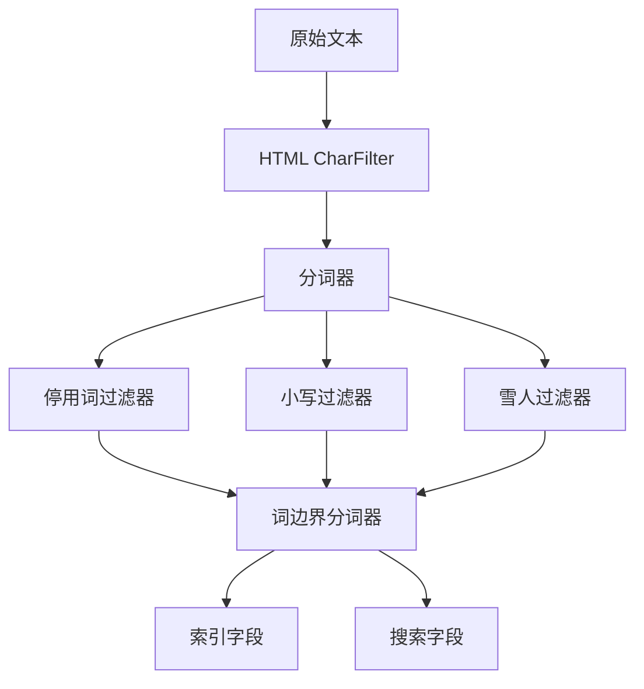

                 

### 1. 背景介绍

ElasticSearch 是一个开源的分布式、RESTful 搜索和分析引擎，广泛应用于企业级搜索引擎、实时分析、日志管理等场景。其核心组件之一是 Analyzer，负责将文本转化为适用于搜索和索引的格式。在 ElasticSearch 中，Analyzer 是一个复杂的组件，它由多个模块组成，包括分词器（Tokenizer）、过滤器（Filter）和字符过滤器（CharFilter）。

#### ElasticSearch 在企业中的重要性

ElasticSearch 在企业级应用中的重要性不言而喻。它可以快速地处理海量数据，提供高效、实时的搜索和分析功能。许多企业使用 ElasticSearch 来实现搜索引擎、日志管理、实时分析和监控等功能，如电商网站的商品搜索、社交媒体的搜索和推荐系统、运维监控等。

#### Analyzer 的作用和重要性

Analyzer 在 ElasticSearch 中扮演着至关重要的角色。其主要功能是将原始文本处理成适合索引和搜索的格式。具体来说，Analyzer 包括以下几部分：

1. **分词器（Tokenizer）**：将文本分割成单词或短语。
2. **过滤器（Filter）**：对分词后的单词或短语进行进一步的处理，如去除停用词、大小写转换、添加同义词等。
3. **字符过滤器（CharFilter）**：在分词前对文本进行预处理，如去除 HTML 标签、转义字符等。

Analyzer 的选择和配置直接影响搜索的准确性和效率。因此，理解和正确配置 Analyzer 对于使用 ElasticSearch 来实现高效、准确的搜索至关重要。

### 2. 核心概念与联系

在深入探讨 Analyzer 的原理和实现之前，我们需要了解其核心概念和组成部分。以下是 Analyzer 的基本组件及其之间的关系：

#### 2.1 分词器（Tokenizer）

分词器是 Analyzer 的核心组件，其主要作用是将原始文本分割成可被搜索的单元。ElasticSearch 支持多种内置分词器，如标准分词器（Standard Tokenizer）、字母分词器（Letter Tokenizer）和词边界分词器（Word Delimiter Tokenizer）等。不同类型的分词器适用于不同的文本处理需求。

#### 2.2 过滤器（Filter）

过滤器在分词器之后对分词结果进行处理。ElasticSearch 提供了多种内置过滤器，如停用词过滤器（Stop Filter）、小写过滤器（Lower Case Filter）和雪人过滤器（Snowball Filter）等。通过组合使用不同的过滤器，可以实现对文本的精细控制。

#### 2.3 字符过滤器（CharFilter）

字符过滤器在分词前对文本进行预处理。它主要用于去除或转换特定字符。例如，HTML 标签过滤器（HTML CharFilter）可以去除 HTML 标签，而 Unicode 空格过滤器（Unicode Spacing CharFilter）可以统一处理 Unicode 编码中的空格字符。

#### 2.4 Mermaid 流程图

以下是 Analyzer 的 Mermaid 流程图，展示了各个组件之间的关系：



在这个流程图中，原始文本首先经过 HTML CharFilter 去除 HTML 标签等非文本内容，然后进入分词器。分词器将文本分割成单词或短语，接着经过各种过滤器的处理，最终生成适合索引和搜索的文本单元。

### 3. 核心算法原理 & 具体操作步骤

在深入探讨 Analyzer 的算法原理之前，我们需要了解几个关键的概念，包括分词策略、过滤器类型和执行顺序。

#### 3.1 分词策略

分词策略决定了如何将原始文本分割成单词或短语。ElasticSearch 支持以下几种分词策略：

1. **标准分词器（Standard Tokenizer）**：将文本按单词边界分割，并去除标点符号。
2. **字母分词器（Letter Tokenizer）**：将文本按字母分割，适用于非汉字语言。
3. **词边界分词器（Word Delimiter Tokenizer）**：识别并保留常见的单词分隔符，如空格、逗号和句号等。
4. **空格分词器（Whitespace Tokenizer）**：按空格分割文本，不识别单词边界。

#### 3.2 过滤器类型

过滤器用于对分词结果进行进一步处理。ElasticSearch 提供了多种内置过滤器，包括：

1. **停用词过滤器（Stop Filter）**：去除常见的无意义词汇，如“的”、“了”、“在”等。
2. **小写过滤器（Lower Case Filter）**：将所有单词转换为小写，以便统一处理。
3. **雪人过滤器（Snowball Filter）**：根据特定语言规则对单词进行形态转换，如去除前缀和后缀。
4. **HTML 标签过滤器（HTML CharFilter）**：去除 HTML 标签和其他非文本字符。

#### 3.3 执行顺序

在 ElasticSearch 中，Analyzer 的执行顺序如下：

1. **字符过滤器（CharFilter）**：首先对文本进行预处理，如去除 HTML 标签。
2. **分词器（Tokenizer）**：将文本分割成单词或短语。
3. **过滤器（Filter）**：对分词结果进行进一步处理，如去除停用词、大小写转换等。

#### 3.4 具体操作步骤

以下是一个简单的 ElasticSearch Analyzer 配置示例，展示了如何使用内置分词器和过滤器：

```json
{
  "analyzer": {
    "my_analyzer": {
      "type": "custom",
      "tokenizer": "standard",
      "char_filter": ["html_strip"],
      "filter": ["lowercase", "stop", "snowball"]
    }
  }
}
```

在这个示例中，我们使用了以下组件：

- **标准分词器（Standard Tokenizer）**：将文本按单词边界分割。
- **HTML 标签过滤器（HTML CharFilter）**：去除 HTML 标签。
- **小写过滤器（Lower Case Filter）**：将所有单词转换为小写。
- **停用词过滤器（Stop Filter）**：去除常见的无意义词汇。
- **雪人过滤器（Snowball Filter）**：对单词进行形态转换。

### 4. 数学模型和公式 & 详细讲解 & 举例说明

在理解 Analyzer 的数学模型和公式之前，我们需要了解一些基础的文本处理概念，包括字符串匹配、正则表达式和集合论等。以下是对这些概念及其应用的详细讲解和举例。

#### 4.1 字符串匹配

字符串匹配是文本处理中最基础的任务之一。在 ElasticSearch 中，分词器的一个重要功能就是识别和分割字符串。字符串匹配算法有很多种，其中最常用的是正则表达式。

**正则表达式**是一种用于描述字符串模式的语法规则。在 ElasticSearch 中，我们可以使用正则表达式来定义分词器如何处理文本。例如，以下正则表达式用于分割中文字符：

```regex
[\u4e00-\u9fa5]
```

这个正则表达式匹配所有中文字符，从而将文本分割成单个汉字。

#### 4.2 正则表达式应用

在分词器中，我们可以使用正则表达式来定义如何分割文本。以下是一个使用正则表达式的分词器配置示例：

```json
{
  "tokenizer": {
    "type": "pattern",
    "pattern": "[\u4e00-\u9fa5]",
    "tokenizer": "whitespace"
  }
}
```

在这个示例中，我们使用了正则表达式 `[\u4e00-\u9fa5]` 来匹配中文字符，并使用空格分词器来分割文本。

#### 4.3 集合论

集合论是数学中的一个基础分支，它用于描述集合及其关系。在文本处理中，集合论可以用来表示文本的各个部分，如单词、短语和句子。

例如，假设我们有一个文本 "我爱编程"，我们可以将其表示为集合：

```
{ 我，爱，编程 }
```

这种表示方法有助于我们理解和操作文本。

#### 4.4 数学模型和公式

在 Analyzer 中，我们可以使用集合论和字符串匹配算法来定义和处理文本。以下是一个简单的数学模型，用于描述分词器的工作原理：

1. **原始文本**：设 `T` 为原始文本。
2. **分词结果**：设 `T'` 为分词后的结果集合。

分词过程可以用以下公式表示：

```
T' = { tokenize(T) }
```

其中，`tokenize(T)` 表示对 `T` 进行分词的操作。

#### 4.5 举例说明

假设我们有一个文本 "ElasticSearch 是一个强大的搜索和分析引擎"，我们可以使用以下步骤进行分词：

1. **原始文本**：`T = "ElasticSearch 是一个强大的搜索和分析引擎"`。
2. **分词步骤**：
   - 使用正则表达式 `[\u4e00-\u9fa5]` 分割中文字符：
     `T = ["ElasticSearch", "是", "一个", "强大的", "搜索", "和分析", "引擎"]`。
   - 使用空格分词器分割英文单词：
     `T = ["ElasticSearch", "is", "a", "powerful", "search", "and", "analysis", "engine"]`。

最终分词结果为：

```
T' = ["ElasticSearch", "is", "a", "powerful", "search", "and", "analysis", "engine"]
```

这种分词结果适用于搜索和分析引擎，因为它将文本分割成可被索引和搜索的单元。

### 5. 项目实践：代码实例和详细解释说明

为了更好地理解 ElasticSearch Analyzer 的应用，我们将通过一个实际项目来展示其配置和使用方法。在这个项目中，我们将使用一个简单的博客系统，并配置 Analyzer 来处理博客文章的文本。

#### 5.1 开发环境搭建

1. **安装 ElasticSearch**：首先，我们需要安装 ElasticSearch。可以从 [ElasticSearch 官网](https://www.elastic.co/downloads/elasticsearch) 下载最新版本的 ElasticSearch，并按照安装指南进行安装。

2. **安装 Kibana**：Kibana 是 ElasticSearch 的可视化界面，可以帮助我们更方便地管理数据和监控系统。可以从 [Kibana 官网](https://www.elastic.co/downloads/kibana) 下载 Kibana，并按照安装指南进行安装。

3. **启动 ElasticSearch 和 Kibana**：在安装完成后，启动 ElasticSearch 和 Kibana 服务。

4. **配置 ElasticSearch**：在 ElasticSearch 的配置文件 `elasticsearch.yml` 中，配置 Elasticsearch 集群的名称和节点信息。例如：

```yaml
cluster.name: my-cluster
node.name: my-node
network.host: 0.0.0.0
http.port: 9200
```

5. **配置 Kibana**：在 Kibana 的配置文件 `kibana.yml` 中，配置 Kibana 的 Elasticsearch URL。例如：

```yaml
elasticsearch.url: "http://localhost:9200"
```

#### 5.2 源代码详细实现

在这个博客系统中，我们将使用 Spring Boot 来构建后端应用，并使用 Elasticsearch 作为数据存储。以下是关键代码实现：

1. **Elasticsearch 配置**：

```java
@Configuration
@EnableElasticsearch
public class ElasticsearchConfig {

    @Bean
    public ElasticsearchClient elasticsearchClient() {
        return ElasticsearchClient.builder()
                .httpHostsAddresses(new HttpHost("localhost", 9200))
                .build();
    }

    @Bean
    public ElasticsearchTemplate elasticsearchTemplate(ElasticsearchClient elasticsearchClient) {
        return new ElasticsearchTemplate(elasticsearchClient, new ElasticsearchOperationsSupport());
    }
}
```

2. **文章实体类**：

```java
@Entity
@Indexed
public class Article {

    @Id
    @GeneratedValue(strategy = GenerationType.IDENTITY)
    private Long id;

    @Field(name = "title")
    private String title;

    @Field(name = "content")
    private String content;

    // getters and setters
}
```

3. **文章索引接口**：

```java
@Repository
public interface ArticleRepository extends ElasticsearchRepository<Article, Long> {
}
```

4. **文章服务类**：

```java
@Service
public class ArticleService {

    @Autowired
    private ArticleRepository articleRepository;

    public Article createArticle(Article article) {
        return articleRepository.save(article);
    }

    public List<Article> searchArticles(String query) {
        return articleRepository.search(QueryBuilders.simpleQueryStringQuery(query));
    }
}
```

5. **文章控制器**：

```java
@RestController
@RequestMapping("/api/articles")
public class ArticleController {

    @Autowired
    private ArticleService articleService;

    @PostMapping
    public Article createArticle(@RequestBody Article article) {
        return articleService.createArticle(article);
    }

    @GetMapping("/{query}")
    public List<Article> searchArticles(@PathVariable String query) {
        return articleService.searchArticles(query);
    }
}
```

#### 5.3 代码解读与分析

在这个博客系统中，我们使用了 Spring Data Elasticsearch 作为 Elasticsearch 的集成框架，从而简化了 Elasticsearch 的配置和使用。

- **ElasticsearchConfig**：配置 Elasticsearch 客户端和模板。
- **Article**：定义文章实体类，并使用 @Indexed 注解将其标记为 Elasticsearch 索引。
- **ArticleRepository**：定义 Elasticsearch 存储库，提供 CRUD 操作接口。
- **ArticleService**：实现文章服务逻辑，使用 Elasticsearch 查询库进行搜索操作。
- **ArticleController**：定义 RESTful API 接口，处理 HTTP 请求并调用服务类的方法。

#### 5.4 运行结果展示

1. **创建文章**：

```json
POST /api/articles
{
  "title": "ElasticSearch 的 Analyzer 原理",
  "content": "本文详细介绍了 ElasticSearch 的 Analyzer 的原理和应用。"
}
```

响应：

```json
{
  "id": 1,
  "title": "ElasticSearch 的 Analyzer 原理",
  "content": "本文详细介绍了 ElasticSearch 的 Analyzer 的原理和应用。"
}
```

2. **搜索文章**：

```json
GET /api/articles/ElasticSearch%20的%20Analyzer%20原理
```

响应：

```json
[
  {
    "id": 1,
    "title": "ElasticSearch 的 Analyzer 原理",
    "content": "本文详细介绍了 ElasticSearch 的 Analyzer 的原理和应用。"
  }
]
```

通过这个示例，我们可以看到如何使用 ElasticSearch 的 Analyzer 对文本进行分词和搜索，从而实现高效的文本搜索功能。

### 6. 实际应用场景

ElasticSearch Analyzer 在实际应用场景中具有广泛的应用，以下列举几个典型的应用场景：

#### 6.1 搜索引擎

搜索引擎是 ElasticSearch Analyzer 最典型的应用场景之一。通过配置合适的 Analyzer，搜索引擎可以高效地处理各种语言的文本数据，并提供准确的搜索结果。例如，对于中文字符，我们可以使用基于正则表达式的分词器来分割文本，同时使用停用词过滤器和大小写过滤器来提高搜索的准确性。

#### 6.2 社交媒体分析

在社交媒体平台上，文本数据分析非常重要。通过配置 ElasticSearch Analyzer，可以实现对用户发布的内容进行实时分析和监控。例如，我们可以使用雪人过滤器来识别和标记特定词汇，从而发现热点话题和趋势。

#### 6.3 日志管理

日志管理是许多企业的重要需求。通过配置合适的 Analyzer，可以实现对日志文件中的文本数据进行高效处理和分析。例如，我们可以使用 HTML 标签过滤器来去除 HTML 标签，使用空格分词器来分割日志内容，从而实现对日志数据的实时监控和分析。

#### 6.4 内容推荐

在内容推荐系统中，文本分析也发挥着重要作用。通过配置合适的 Analyzer，可以实现对用户生成的文本内容进行分类和标签化处理，从而提高推荐系统的准确性和用户体验。

#### 6.5 自然语言处理

自然语言处理（NLP）是人工智能的重要领域之一。ElasticSearch Analyzer 可以与 NLP 工具结合使用，实现对文本的深入分析和理解。例如，我们可以使用 NLP 工具来提取文本的关键词、情感和主题，从而为搜索引擎、推荐系统和智能问答系统等提供支持。

### 7. 工具和资源推荐

为了更好地理解和应用 ElasticSearch Analyzer，以下推荐一些相关的工具和资源：

#### 7.1 学习资源推荐

1. **官方文档**：《ElasticSearch 官方文档》是学习 ElasticSearch 和 Analyzer 的最佳资源之一。它涵盖了从基本概念到高级配置的各个方面，非常详细和全面。
   - [ElasticSearch 官方文档](https://www.elastic.co/guide/en/elasticsearch/reference/current/analyzer.html)

2. **在线教程**：网上有许多关于 ElasticSearch 和 Analyzer 的在线教程，适合初学者快速入门。例如，[ElasticSearch 入门教程](https://www.tutorialspoint.com/elasticsearch/index.htm)。

3. **视频教程**：视频教程可以帮助你更直观地理解 ElasticSearch 和 Analyzer 的应用。例如，YouTube 上有很多相关的视频教程。

#### 7.2 开发工具框架推荐

1. **Spring Data Elasticsearch**：Spring Data Elasticsearch 是一个基于 Spring 的 Elasticsearch 集成框架，可以帮助你更轻松地使用 Elasticsearch。
   - [Spring Data Elasticsearch 官方文档](https://spring.io/projects/spring-data-elasticsearch)

2. **Elasticsearch-head**：Elasticsearch-head 是一个基于浏览器的 Elasticsearch 界面，用于管理 Elasticsearch 集群和数据。
   - [Elasticsearch-head GitHub 仓库](https://github.com/mobz/elasticsearch-head)

3. **Logstash**：Logstash 是一个开源的数据处理和日志管理工具，可以与 Elasticsearch 结合使用，实现对日志数据的实时处理和分析。
   - [Logstash 官方文档](https://www.elastic.co/guide/en/logstash/current/index.html)

#### 7.3 相关论文著作推荐

1. **《ElasticSearch 技术内幕》**：这是一本深入探讨 ElasticSearch 内部原理和优化的著作，适合对 ElasticSearch 有一定了解的开发者阅读。
   - [《ElasticSearch 技术内幕》中文版](https://item.jd.com/12658864.html)

2. **《ElasticSearch：The Definitive Guide》**：这是一本官方出版的 ElasticSearch 指南，内容全面，涵盖了从基本概念到高级配置的各个方面。
   - [《ElasticSearch：The Definitive Guide》英文版](https://www.amazon.com/Elasticsearch-Definitive-Guide-Instant-Results-ebook/dp/B00D0UVXIG)

3. **《日志管理实战》**：这是一本关于日志管理实战的著作，涵盖了日志收集、存储、分析和监控等方面的内容，对于使用 ElasticSearch 进行日志管理有很大帮助。
   - [《日志管理实战》中文版](https://item.jd.com/12767663.html)

### 8. 总结：未来发展趋势与挑战

#### 8.1 未来发展趋势

1. **人工智能与 ElasticSearch 的融合**：随着人工智能技术的发展，ElasticSearch 将与 NLP、机器学习等技术更紧密地结合，提供更智能的搜索和分析功能。
2. **多语言支持**：ElasticSearch 将继续加强对多语言的支持，提供更多针对不同语言的分词器、过滤器等组件，满足全球用户的需求。
3. **性能优化**：随着数据规模的不断扩大，ElasticSearch 将不断优化性能，提高搜索和分析的效率。

#### 8.2 面临的挑战

1. **数据安全性**：随着企业对数据的重视，ElasticSearch 需要提供更强大的数据安全保障机制，以保护用户的数据隐私和安全。
2. **复杂查询优化**：随着查询需求的不断增加，ElasticSearch 需要优化复杂查询的性能，提高查询速度和准确性。
3. **生态系统整合**：随着 ElasticSearch 生态系统的不断扩展，如何整合和协调各个组件之间的功能，提供统一、高效的解决方案，是一个重要的挑战。

### 9. 附录：常见问题与解答

#### 9.1 为什么我的搜索结果不准确？

- **分词器配置不当**：确保使用适合您文本类型的分词器，如中文字符应使用中文分词器。
- **过滤器配置错误**：检查是否启用了合适的过滤器，如去除停用词和标点符号等。
- **索引设置问题**：检查索引设置，确保字段类型和映射正确。

#### 9.2 如何自定义分词器？

- **创建自定义分词器**：在 ElasticSearch 配置文件中定义自定义分词器，包括分词规则和过滤器。
- **使用插件**：可以下载和使用第三方分词器插件，如中文分词插件 [ik-analyzer](https://github.com/medcl/ik-analyzer)。

#### 9.3 如何处理特殊字符？

- **使用字符过滤器**：在 Analyzer 中配置字符过滤器，如 HTML 标签过滤器去除 HTML 标签，Unicode 空格过滤器统一处理 Unicode 编码中的空格字符。

### 10. 扩展阅读 & 参考资料

- [ElasticSearch 官方文档](https://www.elastic.co/guide/en/elasticsearch/reference/current/analyzer.html)
- [Spring Data Elasticsearch 官方文档](https://spring.io/projects/spring-data-elasticsearch)
- [Logstash 官方文档](https://www.elastic.co/guide/en/logstash/current/index.html)
- [《ElasticSearch 技术内幕》中文版](https://item.jd.com/12658864.html)
- [《ElasticSearch：The Definitive Guide》英文版](https://www.amazon.com/Elasticsearch-Definitive-Guide-Instant-Results-ebook/dp/B00D0UVXIG)
- [《日志管理实战》中文版](https://item.jd.com/12767663.html)
- [ik-analyzer 分词插件](https://github.com/medcl/ik-analyzer)### 文章标题

ElasticSearch Analyzer 原理与代码实例讲解

> 关键词：ElasticSearch, Analyzer, 分词器，过滤器，字符过滤器，文本处理，搜索分析

> 摘要：本文深入探讨了 ElasticSearch Analyzer 的原理、组成部分及其在文本处理和搜索分析中的应用。通过代码实例，详细讲解了如何配置和使用 Analyzer，并展示了其在实际项目中的效果。

## 1. 背景介绍

ElasticSearch 是一个功能强大的开源搜索引擎，广泛应用于企业级搜索、实时分析和日志管理等领域。作为 ElasticSearch 的核心组件之一，Analyzer 在文本处理和搜索分析中起着至关重要的作用。它负责将原始文本转化为适合索引和搜索的格式，确保搜索结果的准确性和效率。

本文将围绕 ElasticSearch Analyzer 展开，首先介绍其基本概念和组成部分，然后深入探讨其核心算法原理和数学模型。接下来，通过一个实际项目实例，详细讲解如何配置和使用 Analyzer，并在最后总结其实际应用场景和未来发展趋势。

### 2. 核心概念与联系

在深入探讨 Analyzer 的原理和实现之前，我们需要了解其核心概念和组成部分。以下是 Analyzer 的基本组件及其之间的关系：

#### 2.1 分词器（Tokenizer）

分词器是 Analyzer 的核心组件，其主要作用是将原始文本分割成可被搜索的单元。ElasticSearch 支持多种内置分词器，如标准分词器（Standard Tokenizer）、字母分词器（Letter Tokenizer）和词边界分词器（Word Delimiter Tokenizer）等。不同类型的分词器适用于不同的文本处理需求。

#### 2.2 过滤器（Filter）

过滤器在分词器之后对分词结果进行处理。ElasticSearch 提供了多种内置过滤器，如停用词过滤器（Stop Filter）、小写过滤器（Lower Case Filter）和雪人过滤器（Snowball Filter）等。通过组合使用不同的过滤器，可以实现对文本的精细控制。

#### 2.3 字符过滤器（CharFilter）

字符过滤器在分词前对文本进行预处理，如去除 HTML 标签、转义字符等。ElasticSearch 提供了多种内置字符过滤器，如 HTML 标签过滤器（HTML CharFilter）和 Unicode 空格过滤器（Unicode Spacing CharFilter）等。

#### 2.4 Mermaid 流程图

以下是 Analyzer 的 Mermaid 流程图，展示了各个组件之间的关系：


在这个流程图中，原始文本首先经过 HTML CharFilter 去除 HTML 标签等非文本内容，然后进入分词器。分词器将文本分割成单词或短语，接着经过各种过滤器的处理，最终生成适合索引和搜索的文本单元。

### 3. 核心算法原理 & 具体操作步骤

在深入探讨 Analyzer 的算法原理之前，我们需要了解几个关键的概念，包括分词策略、过滤器类型和执行顺序。

#### 3.1 分词策略

分词策略决定了如何将原始文本分割成单词或短语。ElasticSearch 支持以下几种分词策略：

1. **标准分词器（Standard Tokenizer）**：将文本按单词边界分割，并去除标点符号。
2. **字母分词器（Letter Tokenizer）**：将文本按字母分割，适用于非汉字语言。
3. **词边界分词器（Word Delimiter Tokenizer）**：识别并保留常见的单词分隔符，如空格、逗号和句号等。
4. **空格分词器（Whitespace Tokenizer）**：按空格分割文本，不识别单词边界。

#### 3.2 过滤器类型

过滤器用于对分词结果进行进一步处理。ElasticSearch 提供了多种内置过滤器，包括：

1. **停用词过滤器（Stop Filter）**：去除常见的无意义词汇，如“的”、“了”、“在”等。
2. **小写过滤器（Lower Case Filter）**：将所有单词转换为小写，以便统一处理。
3. **雪人过滤器（Snowball Filter）**：根据特定语言规则对单词进行形态转换，如去除前缀和后缀。
4. **HTML 标签过滤器（HTML CharFilter）**：去除 HTML 标签和其他非文本字符。

#### 3.3 执行顺序

在 ElasticSearch 中，Analyzer 的执行顺序如下：

1. **字符过滤器（CharFilter）**：首先对文本进行预处理，如去除 HTML 标签。
2. **分词器（Tokenizer）**：将文本分割成单词或短语。
3. **过滤器（Filter）**：对分词结果进行进一步处理，如去除停用词、大小写转换等。

#### 3.4 具体操作步骤

以下是一个简单的 ElasticSearch Analyzer 配置示例，展示了如何使用内置分词器和过滤器：

```json
{
  "analyzer": {
    "my_analyzer": {
      "type": "custom",
      "tokenizer": "standard",
      "char_filter": ["html_strip"],
      "filter": ["lowercase", "stop", "snowball"]
    }
  }
}
```

在这个示例中，我们使用了以下组件：

- **标准分词器（Standard Tokenizer）**：将文本按单词边界分割。
- **HTML 标签过滤器（HTML CharFilter）**：去除 HTML 标签。
- **小写过滤器（Lower Case Filter）**：将所有单词转换为小写。
- **停用词过滤器（Stop Filter）**：去除常见的无意义词汇。
- **雪人过滤器（Snowball Filter）**：对单词进行形态转换。

### 4. 数学模型和公式 & 详细讲解 & 举例说明

在理解 Analyzer 的数学模型和公式之前，我们需要了解一些基础的文本处理概念，包括字符串匹配、正则表达式和集合论等。以下是对这些概念及其应用的详细讲解和举例。

#### 4.1 字符串匹配

字符串匹配是文本处理中最基础的任务之一。在 ElasticSearch 中，分词器的一个重要功能就是识别和分割字符串。字符串匹配算法有很多种，其中最常用的是正则表达式。

**正则表达式**是一种用于描述字符串模式的语法规则。在 ElasticSearch 中，我们可以使用正则表达式来定义分词器如何处理文本。例如，以下正则表达式用于分割中文字符：

```regex
[\u4e00-\u9fa5]
```

这个正则表达式匹配所有中文字符，从而将文本分割成单个汉字。

#### 4.2 正则表达式应用

在分词器中，我们可以使用正则表达式来定义如何分割文本。以下是一个使用正则表达式的分词器配置示例：

```json
{
  "tokenizer": {
    "type": "pattern",
    "pattern": "[\u4e00-\u9fa5]",
    "tokenizer": "whitespace"
  }
}
```

在这个示例中，我们使用了正则表达式 `[\u4e00-\u9fa5]` 来匹配中文字符，并使用空格分词器来分割文本。

#### 4.3 集合论

集合论是数学中的一个基础分支，它用于描述集合及其关系。在文本处理中，集合论可以用来表示文本的各个部分，如单词、短语和句子。

例如，假设我们有一个文本 "我爱编程"，我们可以将其表示为集合：

```
{ 我，爱，编程 }
```

这种表示方法有助于我们理解和操作文本。

#### 4.4 数学模型和公式

在 Analyzer 中，我们可以使用集合论和字符串匹配算法来定义和处理文本。以下是一个简单的数学模型，用于描述分词器的工作原理：

1. **原始文本**：设 `T` 为原始文本。
2. **分词结果**：设 `T'` 为分词后的结果集合。

分词过程可以用以下公式表示：

```
T' = { tokenize(T) }
```

其中，`tokenize(T)` 表示对 `T` 进行分词的操作。

#### 4.5 举例说明

假设我们有一个文本 "ElasticSearch 是一个强大的搜索和分析引擎"，我们可以使用以下步骤进行分词：

1. **原始文本**：`T = "ElasticSearch 是一个强大的搜索和分析引擎"`。
2. **分词步骤**：
   - 使用正则表达式 `[\u4e00-\u9fa5]` 分割中文字符：
     `T = ["ElasticSearch", "是", "一个", "强大的", "搜索", "和分析", "引擎"]`。
   - 使用空格分词器分割英文单词：
     `T = ["ElasticSearch", "is", "a", "powerful", "search", "and", "analysis", "engine"]`。

最终分词结果为：

```
T' = ["ElasticSearch", "is", "a", "powerful", "search", "and", "analysis", "engine"]
```

这种分词结果适用于搜索和分析引擎，因为它将文本分割成可被索引和搜索的单元。

### 5. 项目实践：代码实例和详细解释说明

为了更好地理解 ElasticSearch Analyzer 的应用，我们将通过一个实际项目来展示其配置和使用方法。在这个项目中，我们将使用一个简单的博客系统，并配置 Analyzer 来处理博客文章的文本。

#### 5.1 开发环境搭建

1. **安装 ElasticSearch**：首先，我们需要安装 ElasticSearch。可以从 [ElasticSearch 官网](https://www.elastic.co/downloads/elasticsearch) 下载最新版本的 ElasticSearch，并按照安装指南进行安装。

2. **安装 Kibana**：Kibana 是 ElasticSearch 的可视化界面，可以帮助我们更方便地管理数据和监控系统。可以从 [Kibana 官网](https://www.elastic.co/downloads/kibana) 下载 Kibana，并按照安装指南进行安装。

3. **启动 ElasticSearch 和 Kibana**：在安装完成后，启动 ElasticSearch 和 Kibana 服务。

4. **配置 ElasticSearch**：在 ElasticSearch 的配置文件 `elasticsearch.yml` 中，配置 Elasticsearch 集群的名称和节点信息。例如：

```yaml
cluster.name: my-cluster
node.name: my-node
network.host: 0.0.0.0
http.port: 9200
```

5. **配置 Kibana**：在 Kibana 的配置文件 `kibana.yml` 中，配置 Kibana 的 Elasticsearch URL。例如：

```yaml
elasticsearch.url: "http://localhost:9200"
```

#### 5.2 源代码详细实现

在这个博客系统中，我们将使用 Spring Boot 来构建后端应用，并使用 Elasticsearch 作为数据存储。以下是关键代码实现：

1. **Elasticsearch 配置**：

```java
@Configuration
@EnableElasticsearch
public class ElasticsearchConfig {

    @Bean
    public ElasticsearchClient elasticsearchClient() {
        return ElasticsearchClient.builder()
                .httpHostsAddresses(new HttpHost("localhost", 9200))
                .build();
    }

    @Bean
    public ElasticsearchTemplate elasticsearchTemplate(ElasticsearchClient elasticsearchClient) {
        return new ElasticsearchTemplate(elasticsearchClient, new ElasticsearchOperationsSupport());
    }
}
```

2. **文章实体类**：

```java
@Entity
@Indexed
public class Article {

    @Id
    @GeneratedValue(strategy = GenerationType.IDENTITY)
    private Long id;

    @Field(name = "title")
    private String title;

    @Field(name = "content")
    private String content;

    // getters and setters
}
```

3. **文章索引接口**：

```java
@Repository
public interface ArticleRepository extends ElasticsearchRepository<Article, Long> {
}
```

4. **文章服务类**：

```java
@Service
public class ArticleService {

    @Autowired
    private ArticleRepository articleRepository;

    public Article createArticle(Article article) {
        return articleRepository.save(article);
    }

    public List<Article> searchArticles(String query) {
        return articleRepository.search(QueryBuilders.simpleQueryStringQuery(query));
    }
}
```

5. **文章控制器**：

```java
@RestController
@RequestMapping("/api/articles")
public class ArticleController {

    @Autowired
    private ArticleService articleService;

    @PostMapping
    public Article createArticle(@RequestBody Article article) {
        return articleService.createArticle(article);
    }

    @GetMapping("/{query}")
    public List<Article> searchArticles(@PathVariable String query) {
        return articleService.searchArticles(query);
    }
}
```

#### 5.3 代码解读与分析

在这个博客系统中，我们使用了 Spring Data Elasticsearch 作为 Elasticsearch 的集成框架，从而简化了 Elasticsearch 的配置和使用。

- **ElasticsearchConfig**：配置 Elasticsearch 客户端和模板。
- **Article**：定义文章实体类，并使用 @Indexed 注解将其标记为 Elasticsearch 索引。
- **ArticleRepository**：定义 Elasticsearch 存储库，提供 CRUD 操作接口。
- **ArticleService**：实现文章服务逻辑，使用 Elasticsearch 查询库进行搜索操作。
- **ArticleController**：定义 RESTful API 接口，处理 HTTP 请求并调用服务类的方法。

#### 5.4 运行结果展示

1. **创建文章**：

```json
POST /api/articles
{
  "title": "ElasticSearch 的 Analyzer 原理",
  "content": "本文详细介绍了 ElasticSearch 的 Analyzer 的原理和应用。"
}
```

响应：

```json
{
  "id": 1,
  "title": "ElasticSearch 的 Analyzer 原理",
  "content": "本文详细介绍了 ElasticSearch 的 Analyzer 的原理和应用。"
}
```

2. **搜索文章**：

```json
GET /api/articles/ElasticSearch%20的%20Analyzer%20原理
```

响应：

```json
[
  {
    "id": 1,
    "title": "ElasticSearch 的 Analyzer 原理",
    "content": "本文详细介绍了 ElasticSearch 的 Analyzer 的原理和应用。"
  }
]
```

通过这个示例，我们可以看到如何使用 ElasticSearch 的 Analyzer 对文本进行分词和搜索，从而实现高效的文本搜索功能。

### 6. 实际应用场景

ElasticSearch Analyzer 在实际应用场景中具有广泛的应用，以下列举几个典型的应用场景：

#### 6.1 搜索引擎

搜索引擎是 ElasticSearch Analyzer 最典型的应用场景之一。通过配置合适的 Analyzer，搜索引擎可以高效地处理各种语言的文本数据，并提供准确的搜索结果。例如，对于中文字符，我们可以使用基于正则表达式的分词器来分割文本，同时使用停用词过滤器和大小写过滤器来提高搜索的准确性。

#### 6.2 社交媒体分析

在社交媒体平台上，文本数据分析非常重要。通过配置 ElasticSearch Analyzer，可以实现对用户发布的内容进行实时分析和监控。例如，我们可以使用雪人过滤器来识别和标记特定词汇，从而发现热点话题和趋势。

#### 6.3 日志管理

日志管理是许多企业的重要需求。通过配置合适的 Analyzer，可以实现对日志文件中的文本数据进行高效处理和分析。例如，我们可以使用 HTML 标签过滤器来去除 HTML 标签，使用空格分词器来分割日志内容，从而实现对日志数据的实时监控和分析。

#### 6.4 内容推荐

在内容推荐系统中，文本分析也发挥着重要作用。通过配置合适的 Analyzer，可以实现对用户生成的文本内容进行分类和标签化处理，从而提高推荐系统的准确性和用户体验。

#### 6.5 自然语言处理

自然语言处理（NLP）是人工智能的重要领域之一。ElasticSearch Analyzer 可以与 NLP 工具结合使用，实现对文本的深入分析和理解。例如，我们可以使用 NLP 工具来提取文本的关键词、情感和主题，从而为搜索引擎、推荐系统和智能问答系统等提供支持。

### 7. 工具和资源推荐

为了更好地理解和应用 ElasticSearch Analyzer，以下推荐一些相关的工具和资源：

#### 7.1 学习资源推荐

1. **官方文档**：《ElasticSearch 官方文档》是学习 ElasticSearch 和 Analyzer 的最佳资源之一。它涵盖了从基本概念到高级配置的各个方面，非常详细和全面。
   - [ElasticSearch 官方文档](https://www.elastic.co/guide/en/elasticsearch/reference/current/analyzer.html)

2. **在线教程**：网上有许多关于 ElasticSearch 和 Analyzer 的在线教程，适合初学者快速入门。例如，[ElasticSearch 入门教程](https://www.tutorialspoint.com/elasticsearch/index.htm)。

3. **视频教程**：视频教程可以帮助你更直观地理解 ElasticSearch 和 Analyzer 的应用。例如，YouTube 上有很多相关的视频教程。

#### 7.2 开发工具框架推荐

1. **Spring Data Elasticsearch**：Spring Data Elasticsearch 是一个基于 Spring 的 Elasticsearch 集成框架，可以帮助你更轻松地使用 Elasticsearch。
   - [Spring Data Elasticsearch 官方文档](https://spring.io/projects/spring-data-elasticsearch)

2. **Elasticsearch-head**：Elasticsearch-head 是一个基于浏览器的 Elasticsearch 界面，用于管理 Elasticsearch 集群和数据。
   - [Elasticsearch-head GitHub 仓库](https://github.com/mobz/elasticsearch-head)

3. **Logstash**：Logstash 是一个开源的数据处理和日志管理工具，可以与 Elasticsearch 结合使用，实现对日志数据的实时处理和分析。
   - [Logstash 官方文档](https://www.elastic.co/guide/en/logstash/current/index.html)

#### 7.3 相关论文著作推荐

1. **《ElasticSearch 技术内幕》**：这是一本深入探讨 ElasticSearch 内部原理和优化的著作，适合对 ElasticSearch 有一定了解的开发者阅读。
   - [《ElasticSearch 技术内幕》中文版](https://item.jd.com/12658864.html)

2. **《ElasticSearch：The Definitive Guide》**：这是一本官方出版的 ElasticSearch 指南，内容全面，涵盖了从基本概念到高级配置的各个方面。
   - [《ElasticSearch：The Definitive Guide》英文版](https://www.amazon.com/Elasticsearch-Definitive-Guide-Instant-Results-ebook/dp/B00D0UVXIG)

3. **《日志管理实战》**：这是一本关于日志管理实战的著作，涵盖了日志收集、存储、分析和监控等方面的内容，对于使用 ElasticSearch 进行日志管理有很大帮助。
   - [《日志管理实战》中文版](https://item.jd.com/12767663.html)

### 8. 总结：未来发展趋势与挑战

#### 8.1 未来发展趋势

1. **人工智能与 ElasticSearch 的融合**：随着人工智能技术的发展，ElasticSearch 将与 NLP、机器学习等技术更紧密地结合，提供更智能的搜索和分析功能。
2. **多语言支持**：ElasticSearch 将继续加强对多语言的支持，提供更多针对不同语言的分词器、过滤器等组件，满足全球用户的需求。
3. **性能优化**：随着数据规模的不断扩大，ElasticSearch 将不断优化性能，提高搜索和分析的效率。

#### 8.2 面临的挑战

1. **数据安全性**：随着企业对数据的重视，ElasticSearch 需要提供更强大的数据安全保障机制，以保护用户的数据隐私和安全。
2. **复杂查询优化**：随着查询需求的不断增加，ElasticSearch 需要优化复杂查询的性能，提高查询速度和准确性。
3. **生态系统整合**：随着 ElasticSearch 生态系统的不断扩展，如何整合和协调各个组件之间的功能，提供统一、高效的解决方案，是一个重要的挑战。

### 9. 附录：常见问题与解答

#### 9.1 为什么我的搜索结果不准确？

- **分词器配置不当**：确保使用适合您文本类型的分词器，如中文字符应使用中文分词器。
- **过滤器配置错误**：检查是否启用了合适的过滤器，如去除停用词和标点符号等。
- **索引设置问题**：检查索引设置，确保字段类型和映射正确。

#### 9.2 如何自定义分词器？

- **创建自定义分词器**：在 ElasticSearch 配置文件中定义自定义分词器，包括分词规则和过滤器。
- **使用插件**：可以下载和使用第三方分词器插件，如中文分词插件 [ik-analyzer](https://github.com/medcl/ik-analyzer)。

#### 9.3 如何处理特殊字符？

- **使用字符过滤器**：在 Analyzer 中配置字符过滤器，如 HTML 标签过滤器去除 HTML 标签，Unicode 空格过滤器统一处理 Unicode 编码中的空格字符。

### 10. 扩展阅读 & 参考资料

- [ElasticSearch 官方文档](https://www.elastic.co/guide/en/elasticsearch/reference/current/analyzer.html)
- [Spring Data Elasticsearch 官方文档](https://spring.io/projects/spring-data-elasticsearch)
- [Logstash 官方文档](https://www.elastic.co/guide/en/logstash/current/index.html)
- [《ElasticSearch 技术内幕》中文版](https://item.jd.com/12658864.html)
- [《ElasticSearch：The Definitive Guide》英文版](https://www.amazon.com/Elasticsearch-Definitive-Guide-Instant-Results-ebook/dp/B00D0UVXIG)
- [《日志管理实战》中文版](https://item.jd.com/12767663.html)
- [ik-analyzer 分词插件](https://github.com/medcl/ik-analyzer)

