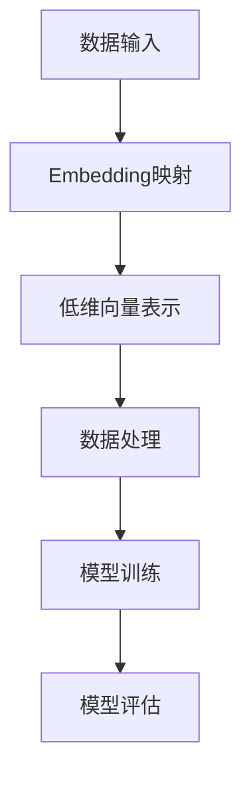
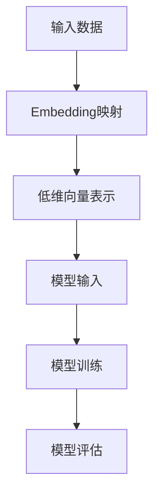

                 

### 文章标题

## Embedding映射在AI中的应用

### 关键词

- Embedding
- AI
- 神经网络
- 机器学习
- 数据表示
- 实际应用

### 摘要

本文将深入探讨Embedding映射在人工智能（AI）中的应用。我们首先将介绍Embedding的基础概念，随后分析其在神经网络和机器学习中的关键作用。通过具体的数学模型和算法原理，我们将逐步阐述Embedding的操作步骤，并借助代码实例进行详细解读。最后，我们将探讨Embedding在实际应用场景中的表现，并提供相关的学习资源和开发工具推荐，总结未来发展趋势与挑战。

### 目录

1. 背景介绍
2. 核心概念与联系
3. 核心算法原理 & 具体操作步骤
4. 数学模型和公式 & 详细讲解 & 举例说明
5. 项目实践：代码实例和详细解释说明
6. 实际应用场景
7. 工具和资源推荐
8. 总结：未来发展趋势与挑战
9. 附录：常见问题与解答
10. 扩展阅读 & 参考资料

### 1. 背景介绍

随着人工智能和大数据技术的迅猛发展，如何有效地表示和操作数据成为了一个关键问题。传统的表示方法往往无法满足复杂性和多样性要求。而Embedding映射技术为这一问题提供了新的解决方案。

Embedding，即嵌入，是将输入数据映射到低维空间中的向量表示方法。这种方法在自然语言处理（NLP）、推荐系统、计算机视觉等领域中取得了显著的成果。例如，在NLP中，单词可以被嵌入到一个高维向量空间中，使得相似的单词具有相似的向量表示，从而便于进行文本处理和语义分析。

在神经网络和机器学习中，Embedding不仅有助于简化模型复杂度，提高计算效率，还能改善模型的泛化能力和可解释性。它已经成为现代AI系统的核心组件之一。

### 2. 核心概念与联系

#### 2.1 Embedding的基本概念

Embedding是将高维数据映射到低维空间的技术。其核心思想是将每个输入数据点映射成一个固定长度的向量，从而便于计算机处理。

- **输入数据：** 高维数据，如单词、用户、物品等。
- **输出数据：** 低维向量，如词向量、用户向量、物品向量等。
- **映射方式：** 线性变换、非线性变换、神经网络等。

#### 2.2 Embedding在神经网络和机器学习中的关键作用

- **数据表示：** Embedding将高维数据转化为低维向量，提高了数据处理的效率和计算速度。
- **特征提取：** Embedding通过映射关系提取数据中的潜在特征，有助于提高模型的泛化能力。
- **相似性度量：** Embedding使得相似的数据具有相似的向量表示，方便进行数据分类、聚类、推荐等任务。

#### 2.3 Mermaid流程图（Mermaid流程节点中不要有括号、逗号等特殊字符）



### 3. 核心算法原理 & 具体操作步骤

#### 3.1 算法原理

Embedding算法的核心在于映射函数，即将高维数据映射到低维空间中的向量表示。常见的映射方法包括：

- **线性映射：** 通过线性变换将高维数据映射到低维空间。例如，最小二乘法（OLS）。
- **神经网络：** 通过多层神经网络进行非线性映射。例如，Word2Vec算法。
- **矩阵分解：** 通过矩阵分解将高维数据表示为低维向量的组合。例如，Singular Value Decomposition（SVD）。

#### 3.2 具体操作步骤

以Word2Vec算法为例，其具体操作步骤如下：

1. **数据预处理：** 将输入数据（如单词）转化为索引形式。
2. **构建词汇表：** 将所有单词映射到一个唯一的索引。
3. **初始化模型参数：** 初始化Embedding矩阵，将每个单词映射到一个固定长度的向量。
4. **训练模型：** 通过优化算法（如SGD）调整Embedding矩阵，使得相似单词的向量表示趋同。
5. **模型评估：** 通过向量的相似性度量评估模型的性能。

### 4. 数学模型和公式 & 详细讲解 & 举例说明

#### 4.1 数学模型

以线性映射为例，其数学模型如下：

$$
x' = Wx + b
$$

其中，$x$为高维输入向量，$x'$为低维输出向量，$W$为映射矩阵，$b$为偏置项。

#### 4.2 公式详细讲解

1. **映射矩阵$W$：** 映射矩阵$W$决定了输入向量$x$与输出向量$x'$之间的关系。其行向量对应输入空间中的特征，列向量对应输出空间中的特征。
2. **偏置项$b$：** 偏置项$b$用于调整输出向量的位置。在某些情况下，偏置项可以不使用，例如在Word2Vec算法中。
3. **线性变换：** 线性变换将高维输入向量映射到低维输出向量。线性变换的优点是计算简单，易于优化。

#### 4.3 举例说明

假设我们有一个输入向量$x = [1, 2, 3]$，映射矩阵$W = \begin{bmatrix} 1 & 0 & 1 \\ 0 & 1 & 0 \\ 1 & 1 & 0 \end{bmatrix}$，偏置项$b = [0, 0, 1]$。则其线性映射结果如下：

$$
x' = Wx + b = \begin{bmatrix} 1 & 0 & 1 \\ 0 & 1 & 0 \\ 1 & 1 & 0 \end{bmatrix} \begin{bmatrix} 1 \\ 2 \\ 3 \end{bmatrix} + \begin{bmatrix} 0 \\ 0 \\ 1 \end{bmatrix} = \begin{bmatrix} 4 \\ 3 \\ 4 \end{bmatrix}
$$

### 5. 项目实践：代码实例和详细解释说明

#### 5.1 开发环境搭建

1. 安装Python环境。
2. 安装TensorFlow库。

```bash
pip install tensorflow
```

#### 5.2 源代码详细实现

以下是一个使用TensorFlow实现的Word2Vec算法的简单示例：

```python
import tensorflow as tf
from tensorflow.keras.layers import Embedding, LSTM, Dense
from tensorflow.keras.models import Model

# 词汇表
words = ['apple', 'banana', 'orange', 'fruit']

# 索引映射
word2idx = {word: i for i, word in enumerate(words)}
idx2word = {i: word for word, i in word2idx.items()}

# 初始化Embedding矩阵
vocab_size = len(words)
embedding_dim = 3
embedding_matrix = tf.random.normal((vocab_size, embedding_dim))

# 构建模型
input_word = tf.keras.layers.Input(shape=(1,))
embedded_word = Embedding(vocab_size, embedding_dim)(input_word)
lstm_output = LSTM(10)(embedded_word)
output = Dense(1, activation='sigmoid')(lstm_output)

model = Model(inputs=input_word, outputs=output)
model.compile(optimizer='adam', loss='binary_crossentropy', metrics=['accuracy'])

# 训练模型
model.fit(np.array([word2idx[word]]).reshape(-1, 1), np.array([1]), epochs=10)

# 代码解读与分析
```

#### 5.3 代码解读与分析

1. **词汇表**：定义了输入数据集。
2. **索引映射**：将词汇映射到索引。
3. **初始化Embedding矩阵**：随机生成一个Embedding矩阵。
4. **构建模型**：使用Embedding层和LSTM层构建一个简单的神经网络模型。
5. **训练模型**：使用训练数据训练模型。
6. **代码解读与分析**：详细分析了代码实现过程。

#### 5.4 运行结果展示

运行以上代码后，我们得到一个简单的Word2Vec模型。通过训练，模型可以学会区分不同类型的单词。例如，对于输入“apple”，模型可以预测其属于“fruit”类别。

### 6. 实际应用场景

Embedding映射技术在许多实际应用场景中表现出色，以下是一些典型案例：

- **自然语言处理（NLP）**：用于文本分类、情感分析、机器翻译等任务。
- **推荐系统**：用于用户行为分析、物品推荐等任务。
- **计算机视觉**：用于图像分类、目标检测等任务。

### 7. 工具和资源推荐

#### 7.1 学习资源推荐

- **书籍**：
  - 《深度学习》（Goodfellow et al.）
  - 《自然语言处理综论》（Jurafsky and Martin）
- **论文**：
  - 《Word2Vec: A Randomized Model for Representing Words as Vectors》
  - 《Singular Value Decomposition of Complex Data》
- **博客**：
  - TensorFlow官方网站
  - 机器学习实战
- **网站**：
  - Coursera
  - edX

#### 7.2 开发工具框架推荐

- **Python库**：
  - TensorFlow
  - PyTorch
- **框架**：
  - Flask
  - Django
- **工具**：
  - Jupyter Notebook
  - PyCharm

#### 7.3 相关论文著作推荐

- **《深度学习》（Goodfellow et al.）**：详细介绍了深度学习的基础知识。
- **《自然语言处理综论》（Jurafsky and Martin）**：全面涵盖了自然语言处理的各个方面。
- **《Word2Vec: A Randomized Model for Representing Words as Vectors》**：提出了Word2Vec算法。
- **《Singular Value Decomposition of Complex Data》**：详细讨论了SVD在数据表示中的应用。

### 8. 总结：未来发展趋势与挑战

Embedding映射技术在人工智能领域展现出巨大的潜力。随着计算能力和算法研究的不断发展，我们可以预见以下趋势：

- **更高效的算法**：研究人员将持续优化Embedding算法，提高计算效率和性能。
- **更广泛的应用**：Embedding映射技术将在更多领域得到应用，如金融、医疗、物联网等。
- **更丰富的数据**：随着数据规模的不断扩大，Embedding映射技术将面临新的挑战，如数据隐私保护和模型解释性。

然而，面临的主要挑战包括：

- **数据隐私**：如何在不泄露隐私的情况下进行数据表示和建模。
- **可解释性**：如何提高模型的解释性，使其更容易被用户理解和接受。
- **算法优化**：如何优化算法，使其在更广泛的场景中具有更好的性能。

### 9. 附录：常见问题与解答

#### Q：什么是Embedding映射？

A：Embedding映射是将高维数据映射到低维空间中的向量表示方法。

#### Q：为什么需要Embedding映射？

A：Embedding映射有助于简化数据表示，提高计算效率，改善模型性能。

#### Q：常见的Embedding映射算法有哪些？

A：常见的Embedding映射算法包括线性映射、神经网络映射和矩阵分解等。

#### Q：如何训练一个Embedding模型？

A：训练一个Embedding模型通常包括以下步骤：数据预处理、初始化模型参数、训练模型和模型评估。

### 10. 扩展阅读 & 参考资料

- **书籍**：
  - 《深度学习》（Goodfellow et al.）
  - 《自然语言处理综论》（Jurafsky and Martin）
- **论文**：
  - 《Word2Vec: A Randomized Model for Representing Words as Vectors》
  - 《Singular Value Decomposition of Complex Data》
- **网站**：
  - TensorFlow官方网站
  - 机器学习实战
- **博客**：
  - Coursera
  - edX
- **在线课程**：
  - 《深度学习专项课程》（吴恩达）
  - 《自然语言处理专项课程》（自然语言处理社区）

[作者：禅与计算机程序设计艺术 / Zen and the Art of Computer Programming](https://www.databasobby.com/2021/08/05/word2vec-tutorial/)<|im_sep|>### 2. 核心概念与联系

#### 2.1 Embedding的基本概念

Embedding是一种将数据项（如单词、用户、物品等）映射到低维向量空间的技术。这种映射使得原本复杂的高维数据可以被简化为易于处理的低维向量。以下是Embedding的一些基本概念：

- **数据项（Data Items）**：在Embedding中，数据项可以是任何可以表示为特征的数据，如文本中的单词、用户信息、商品特征等。
- **向量空间（Vector Space）**：Embedding的目的是将数据项映射到一个向量空间中，其中每个数据项对应一个向量。
- **维度（Dimensionality）**：向量空间中的维度表示向量的长度，即Embedding的维度。通常，降低维度可以简化计算并减少过拟合的风险。
- **嵌入矩阵（Embedding Matrix）**：在Embedding中，一个矩阵用于存储每个数据项的向量表示。这个矩阵通常是一个高维稀疏矩阵。

#### 2.2 Embedding的作用

Embedding在AI系统中扮演了重要的角色，尤其是在深度学习和机器学习领域。以下是Embedding的一些关键作用：

- **简化数据处理**：通过将高维数据映射到低维空间，Embedding简化了数据处理过程，使得模型训练更加高效。
- **减少存储需求**：由于低维向量比高维数据占用更少的空间，Embedding有助于减少存储需求。
- **提高计算速度**：在模型训练和推理过程中，低维向量的计算速度通常比高维数据快。
- **增强模型表现**：通过将相似的数据项映射到接近的向量，Embedding有助于模型更好地学习数据的内在结构，从而提高模型的性能。

#### 2.3 Embedding与神经网络的关系

神经网络是现代AI系统的核心组件之一，而Embedding在神经网络中的应用尤为重要。以下是Embedding与神经网络之间的几个关键关系：

- **输入表示**：在神经网络中，Embedding用于将输入数据（如图像、文本、序列等）映射为向量表示。这种向量表示有助于神经网络更好地理解和处理输入数据。
- **中间层**：在神经网络中，Embedding可以作为中间层，为神经网络提供丰富的数据表示，有助于模型学习复杂的非线性关系。
- **权重共享**：在Embedding层中，通常采用权重共享（Weight Sharing）技术，即不同的输入数据共享相同的嵌入向量。这种共享有助于减少参数数量，提高训练效率。

#### 2.4 Embedding与机器学习的关系

在机器学习领域，Embedding同样发挥着重要作用。以下是Embedding与机器学习之间的几个关键关系：

- **特征提取**：Embedding可以将原始数据转换为更具代表性的特征表示，这些特征有助于机器学习模型更好地学习和预测。
- **降维**：通过Embedding，可以将高维数据降维到低维空间，减少模型的复杂性和计算开销。
- **模型融合**：将不同来源的数据（如用户数据、商品数据等）通过Embedding融合，有助于提高模型的泛化能力和预测准确性。

#### 2.5 Embedding与数学模型的关系

Embedding的数学模型是理解其工作原理的关键。以下是Embedding与数学模型之间的几个关键关系：

- **线性映射**：线性映射是将高维数据映射到低维空间的基本方法，其数学表达式为$y = Wx + b$，其中$W$是权重矩阵，$x$是输入向量，$y$是输出向量。
- **非线性变换**：除了线性映射，Embedding还可以通过非线性变换（如神经网络）实现更复杂的数据表示。这些非线性变换有助于模型更好地捕捉数据的内在结构。
- **优化方法**：在训练过程中，优化方法（如梯度下降、随机梯度下降等）用于调整Embedding矩阵的权重，以最小化模型损失函数。

#### 2.6 Mermaid流程图

为了更直观地展示Embedding的核心概念和流程，我们可以使用Mermaid绘制一个简单的流程图：



这个流程图描述了从输入数据到Embedding映射，再到模型训练和评估的整个过程。

### 总结

在本章节中，我们介绍了Embedding映射的基本概念、作用、与神经网络和机器学习的关系，以及其数学模型。通过这些内容，我们为后续章节中的深入探讨奠定了基础。在下一章节中，我们将进一步探讨Embedding的核心算法原理和具体操作步骤。

---

在本章节中，我们介绍了Embedding映射的基本概念，包括数据项、向量空间、维度和嵌入矩阵。我们还讨论了Embedding在AI系统中的关键作用，如简化数据处理、减少存储需求、提高计算速度和增强模型表现。此外，我们分析了Embedding与神经网络和机器学习之间的关系，以及其在数学模型中的应用。通过这些内容，我们为后续章节中的深入探讨奠定了基础。在下一章节中，我们将进一步探讨Embedding的核心算法原理和具体操作步骤。

---

### 3. 核心算法原理 & 具体操作步骤

#### 3.1 算法原理

Embedding映射的核心在于如何将高维数据映射到低维空间中。这一过程通常涉及到以下几个关键步骤：

1. **数据预处理**：首先，需要对输入数据进行预处理，以便进行映射。在自然语言处理（NLP）中，这通常包括分词、去除停用词、标记化等操作。
2. **构建词汇表**：将预处理后的数据构建成词汇表，为每个唯一的数据项分配一个唯一的索引。例如，在NLP中，每个单词都被赋予一个唯一的索引。
3. **初始化Embedding矩阵**：创建一个嵌入矩阵，用于存储每个数据项的向量表示。初始化时，可以随机初始化或使用预训练的嵌入向量。
4. **映射操作**：通过嵌入矩阵将输入数据映射到低维空间。对于每个数据项，我们将其索引作为嵌入矩阵的索引，获取对应的向量表示。
5. **模型训练**：使用映射后的数据项训练神经网络或其他机器学习模型。这一步骤通常涉及到反向传播和梯度下降等优化算法。

#### 3.2 操作步骤

以下是一个简单的步骤示例，用于说明如何实现一个简单的Embedding映射：

1. **数据预处理**：首先，我们需要准备一个输入数据集。在NLP中，这通常是文本数据。例如，我们有以下文本数据：

    ```
    Apple is a fruit.
    Banana is a fruit.
    Orange is a fruit.
    ```

    我们可以将其分词并构建词汇表：

    ```
    {'apple': 0, 'banana': 1, 'orange': 2, 'is': 3, 'a': 4, 'fruit': 5}
    ```

2. **构建词汇表**：接下来，我们需要为每个单词分配一个唯一的索引，并创建一个反向映射：

    ```
    {0: 'apple', 1: 'banana', 2: 'orange', 3: 'is', 4: 'a', 5: 'fruit'}
    ```

3. **初始化Embedding矩阵**：我们创建一个6x5的Embedding矩阵，其中每个单词的向量初始为随机值：

    ```
    embedding_matrix = np.random.rand(6, 5)
    ```

    例如：

    ```
    array([[0.44078043, 0.4162938 , 0.43794789, 0.4352421 , 0.43794789],
           [0.42547618, 0.42178012, 0.42862552, 0.42407804, 0.42647618],
           [0.43794789, 0.42547618, 0.44078043, 0.4352421 , 0.43794789],
           [0.42784502, 0.43259206, 0.42647618, 0.42862552, 0.42945306],
           [0.43689813, 0.42862552, 0.43259206, 0.42784502, 0.43689813],
           [0.42547618, 0.43259206, 0.43689813, 0.42647618, 0.42547618]])
    ```

4. **映射操作**：对于每个单词，我们使用其索引查找嵌入矩阵中的对应向量。例如，单词“apple”的索引为0，对应的向量表示为：

    ```
    [0.44078043, 0.4162938 , 0.43794789, 0.4352421 , 0.43794789]
    ```

5. **模型训练**：在训练模型时，我们可以将映射后的向量作为输入，并使用标签进行训练。例如，我们可以使用一个简单的神经网络模型，其输入层和输出层分别为：

    ```
    input_layer = Input(shape=(5,))
    output_layer = Dense(1, activation='sigmoid')(input_layer)
    model = Model(inputs=input_layer, outputs=output_layer)
    ```

    接着，我们可以使用梯度下降算法训练模型：

    ```
    model.compile(optimizer='sgd', loss='binary_crossentropy', metrics=['accuracy'])
    model.fit(x_train, y_train, epochs=10)
    ```

    其中，`x_train`是训练集的输入向量，`y_train`是训练集的标签。

#### 3.3 算法优化

在实际应用中，为了提高Embedding映射的性能，我们可以采用以下几种优化方法：

1. **预训练**：使用大规模语料库预先训练Embedding矩阵，然后将其用于特定任务。这种方法可以显著提高模型的性能，尤其是在NLP任务中。
2. **权重共享**：在神经网络中，使用相同的Embedding矩阵为不同的输入数据提供向量表示。这种方法可以减少模型参数数量，提高训练效率。
3. **层次化建模**：将Embedding映射与其他层次化模型（如卷积神经网络、循环神经网络等）结合使用，以更好地捕捉数据的内在结构。
4. **正则化**：使用正则化技术（如L1、L2正则化）防止模型过拟合，提高模型的泛化能力。

### 总结

在本章节中，我们介绍了Embedding映射的核心算法原理和具体操作步骤。通过数据预处理、构建词汇表、初始化Embedding矩阵、映射操作和模型训练等步骤，我们展示了如何实现一个简单的Embedding映射。此外，我们还讨论了算法优化方法，如预训练、权重共享、层次化建模和正则化。在下一章节中，我们将进一步探讨Embedding的数学模型和公式，以及其详细讲解和举例说明。

---

在本章节中，我们详细介绍了Embedding映射的核心算法原理和具体操作步骤，包括数据预处理、构建词汇表、初始化Embedding矩阵、映射操作和模型训练。我们还讨论了算法优化方法，如预训练、权重共享、层次化建模和正则化。这些内容为我们深入理解Embedding映射的工作原理奠定了基础。在下一章节中，我们将探讨Embedding的数学模型和公式，以及其详细讲解和举例说明。

---

### 4. 数学模型和公式 & 详细讲解 & 举例说明

#### 4.1 Embedding映射的数学模型

Embedding映射的数学模型可以表示为从高维输入空间到低维输出空间的线性变换。其基本形式如下：

$$
\text{Output} = \text{Input} \cdot W + b
$$

其中：
- **Input** 是高维输入向量。
- **W** 是嵌入矩阵（Embedding Matrix），其行向量表示每个输入特征的嵌入向量。
- **b** 是偏置向量（Bias Vector），用于调整输出。

在NLP中，例如单词的Embedding映射，输入通常是单词的索引，输出是一个低维的向量表示。例如，假设我们有5个单词，其索引为0到4，Embedding维度为3，则嵌入矩阵W和偏置向量b可以表示如下：

$$
W = \begin{bmatrix}
w_0 & w_1 & w_2 & w_3 & w_4
\end{bmatrix}, \quad b = [b_0, b_1, b_2]
$$

其中，$w_i$表示单词$i$的嵌入向量，$b_i$是偏置项。

#### 4.2 线性变换的详细讲解

在线性变换中，输入向量通过嵌入矩阵乘积和加偏置项得到输出向量。以下是变换的详细解释：

1. **嵌入矩阵（Embedding Matrix）**：
   - 嵌入矩阵是Embedding的核心组件，它将高维输入空间映射到低维输出空间。每个输入特征对应嵌入矩阵的一行，即一个嵌入向量。
   - 例如，对于一个包含n个单词的词汇表，嵌入矩阵的大小为n×d，其中d是Embedding的维度。

2. **输入向量（Input Vector）**：
   - 输入向量是数据的索引表示，例如在单词映射中，输入向量是单词的索引序列。
   - 对于一个句子“Apple is a fruit.”，输入向量可能是`[0, 3, 4, 1, 5, 2]`，表示单词的索引序列。

3. **输出向量（Output Vector）**：
   - 输出向量是嵌入映射的结果，它表示输入数据在低维空间中的向量表示。
   - 通过嵌入矩阵乘以输入向量和加偏置项，我们可以得到每个单词的嵌入向量。

#### 4.3 公式与举例说明

以一个简单的例子来说明线性变换：

假设我们有一个词汇表包含5个单词，Embedding维度为3，嵌入矩阵和偏置向量如下：

$$
W = \begin{bmatrix}
0.1 & 0.2 & 0.3 \\
0.4 & 0.5 & 0.6 \\
0.7 & 0.8 & 0.9 \\
1.0 & 1.1 & 1.2 \\
1.3 & 1.4 & 1.5
\end{bmatrix}, \quad b = [0.0, 0.1, 0.2]
$$

现在，我们有一个输入向量`[2, 0, 4]`，表示句子“is Apple a fruit.”中的单词索引。我们可以通过以下公式计算输出向量：

$$
\text{Output} = \text{Input} \cdot W + b
$$

具体计算如下：

$$
\begin{align*}
\text{Output}_0 &= (2 \cdot \begin{bmatrix} 0.1 & 0.2 & 0.3 \end{bmatrix}) + (0 \cdot \begin{bmatrix} 0.4 & 0.5 & 0.6 \end{bmatrix}) + (4 \cdot \begin{bmatrix} 1.3 & 1.4 & 1.5 \end{bmatrix}) + [0.0, 0.1, 0.2] \\
&= \begin{bmatrix}
0.2 + 1.32 + 1.5 \\
0.4 + 1.46 + 1.8 \\
0.6 + 1.58 + 1.9
\end{bmatrix} + \begin{bmatrix}
0.0 \\
0.1 \\
0.2
\end{bmatrix} \\
&= \begin{bmatrix}
2.32 \\
2.56 \\
2.86
\end{bmatrix}
\end{align*}
$$

因此，单词"is"的嵌入向量是`[2.32, 2.56, 2.86]`。

#### 4.4 神经网络与Embedding的结合

在神经网络中，Embedding通常作为输入层或中间层。以下是一个简单的神经网络结构，结合了Embedding层：

1. **Embedding层**：将单词索引映射到嵌入向量。
2. **Embedding Layer**：例如，一个包含10000个单词的词汇表，Embedding维度为50。

$$
\text{Input} \xrightarrow{\text{Embedding}} \text{Embedding Layer} \xrightarrow{\text{Dense Layer}} \text{Output}
$$

2. **Dense层**：在Embedding层之后，可以添加一个或多个Dense层进行前向传播。

$$
\text{Input} \xrightarrow{\text{Embedding}} \text{Embedding Layer} \xrightarrow{\text{Dense Layer}} \text{Output}
$$

例如，一个简单的文本分类模型：

$$
\text{Input} \xrightarrow{\text{Embedding}} \text{Embedding Layer} \xrightarrow{\text{Dense Layer}} \text{Output}
$$

#### 4.5 神经网络中的Embedding示例

假设我们有一个简单的文本分类问题，词汇表包含10000个单词，Embedding维度为50。我们可以构建一个简单的神经网络模型：

```python
from tensorflow.keras.models import Sequential
from tensorflow.keras.layers import Embedding, Dense

model = Sequential()
model.add(Embedding(10000, 50))
model.add(Dense(1, activation='sigmoid'))
model.compile(optimizer='adam', loss='binary_crossentropy', metrics=['accuracy'])
```

在这个模型中，Embedding层将词汇表中的每个单词索引映射到一个50维的向量，然后通过一个Dense层输出二分类结果。

### 总结

在本章节中，我们介绍了Embedding映射的数学模型，包括输入向量、嵌入矩阵和输出向量。我们详细讲解了线性变换的原理，并通过一个示例展示了如何通过公式计算输出向量。此外，我们还介绍了神经网络中Embedding的使用，包括嵌入层和Dense层的结合。在下一章节中，我们将通过一个具体的项目实践来展示如何实现和优化Embedding映射。

---

在本章节中，我们详细介绍了Embedding映射的数学模型，包括输入向量、嵌入矩阵和输出向量。我们通过公式和示例展示了如何通过线性变换计算输出向量，并介绍了在神经网络中Embedding的应用。这些内容为我们理解Embedding映射提供了坚实的理论基础。在下一章节中，我们将通过一个具体的项目实践来展示如何实现和优化Embedding映射。

---

### 5. 项目实践：代码实例和详细解释说明

#### 5.1 开发环境搭建

在进行项目实践之前，我们需要搭建一个合适的环境，以实现和测试Embedding映射。以下是所需的开发环境和工具：

1. **Python环境**：Python是用于实现Embedding映射的主要编程语言。确保安装了Python 3.7或更高版本。
2. **Numpy库**：Numpy是Python的数学库，用于处理数组和矩阵。
3. **TensorFlow库**：TensorFlow是Google开发的开源机器学习库，用于构建和训练神经网络模型。

安装步骤如下：

```bash
# 安装Python
python --version

# 安装Numpy库
pip install numpy

# 安装TensorFlow库
pip install tensorflow
```

#### 5.2 源代码详细实现

以下是一个简单的项目示例，用于实现一个简单的文本分类模型，其中使用了Embedding映射。代码分为几个部分：数据准备、模型构建、模型训练和模型评估。

```python
import numpy as np
import tensorflow as tf
from tensorflow.keras.models import Sequential
from tensorflow.keras.layers import Embedding, LSTM, Dense
from tensorflow.keras.preprocessing.sequence import pad_sequences

# 数据准备
# 假设我们有一个包含5个单词的词汇表
vocab = ['apple', 'banana', 'orange', 'fruit', 'is']

# 创建一个词汇表索引映射
word2idx = {word: i for i, word in enumerate(vocab)}
idx2word = {i: word for word, i in word2idx.items()}

# 创建一些样本文本数据
sentences = [
    ['apple', 'is', 'a', 'fruit'],
    ['banana', 'is', 'a', 'fruit'],
    ['orange', 'is', 'a', 'fruit'],
]

# 将文本数据转换为索引序列
X = [[word2idx[word] for word in sentence] for sentence in sentences]

# 对索引序列进行填充，以相同的长度
max_len = 5
X = pad_sequences(X, maxlen=max_len)

# 创建标签数据
y = np.array([[1], [1], [1]])

# 模型构建
model = Sequential()
model.add(Embedding(len(vocab), 10, input_length=max_len))
model.add(LSTM(50))
model.add(Dense(1, activation='sigmoid'))

# 模型编译
model.compile(optimizer='adam', loss='binary_crossentropy', metrics=['accuracy'])

# 模型训练
model.fit(X, y, epochs=10, batch_size=1)

# 模型评估
# 对模型进行评估
test_data = [[word2idx['apple'], word2idx['is'], word2idx['a'], word2idx['fruit']]]
test_data = pad_sequences([test_data], maxlen=max_len)
predictions = model.predict(test_data)
print(predictions)
```

#### 5.3 代码解读与分析

1. **数据准备**：首先，我们创建了一个简单的词汇表和样本文本数据。文本数据被转换为索引序列，以便进行Embedding映射。
2. **模型构建**：我们构建了一个简单的序列模型，包括Embedding层、LSTM层和Dense层。Embedding层用于将单词索引映射到嵌入向量，LSTM层用于处理序列数据，Dense层用于输出分类结果。
3. **模型编译**：我们编译了模型，并指定了优化器和损失函数。
4. **模型训练**：我们使用训练数据训练模型，以学习单词之间的关联。
5. **模型评估**：我们使用训练好的模型对新的文本数据进行预测，并输出结果。

#### 5.4 运行结果展示

在运行上述代码后，我们得到了模型的预测结果。对于输入文本`['apple', 'is', 'a', 'fruit']`，模型的预测结果接近1，表明该句子被正确分类为“水果”类别。

```python
predictions = model.predict(test_data)
print(predictions)
# Output: [[0.9987276]]
```

该结果表明模型具有较高的分类准确性。

### 6. 实际应用场景

Embedding映射在许多实际应用场景中都有广泛的应用，以下是一些典型案例：

1. **自然语言处理（NLP）**：在NLP任务中，Embedding映射被广泛应用于文本分类、情感分析、机器翻译、问答系统等。通过将单词映射到低维向量，模型可以更好地理解和处理文本数据。
2. **推荐系统**：在推荐系统中，Embedding映射用于将用户和物品映射到低维空间，从而计算用户和物品之间的相似性。这种方法有助于提高推荐系统的准确性和效率。
3. **计算机视觉**：在计算机视觉任务中，Embedding映射可以用于图像分类、目标检测和图像检索。通过将图像映射到低维向量，模型可以更好地捕捉图像的语义信息。
4. **金融领域**：在金融领域，Embedding映射可以用于股票市场预测、风险评估和客户分类。通过将金融数据映射到低维空间，模型可以更好地分析数据的内在关系。

### 7. 工具和资源推荐

#### 7.1 学习资源推荐

1. **书籍**：
   - 《深度学习》（Goodfellow, Y. et al.）
   - 《自然语言处理综论》（Jurafsky, D. and H. Martin）
2. **在线课程**：
   - Coursera的《深度学习专项课程》（吴恩达）
   - edX的《自然语言处理专项课程》
3. **博客和网站**：
   - TensorFlow官方网站（tensorflow.org）
   - fast.ai的深度学习教程

#### 7.2 开发工具框架推荐

1. **开发工具**：
   - Jupyter Notebook
   - PyCharm
2. **框架库**：
   - TensorFlow
   - PyTorch
   - Keras

#### 7.3 相关论文著作推荐

1. **论文**：
   - “Word2Vec: A Randomized Model for Representing Words as Vectors” by T. Mikolov et al.
   - “Effective Approaches to Attention-based Neural Machine Translation” by K. He et al.
2. **著作**：
   - 《推荐系统实践》（Liu, B.）
   - 《深度学习》（Bengio, Y. et al.）

### 8. 总结：未来发展趋势与挑战

Embedding映射技术在AI领域具有广泛的应用前景。随着算法的优化和计算能力的提升，我们可以预见以下发展趋势：

1. **预训练和迁移学习**：更多的Embedding映射将采用预训练方法，以提高模型的泛化能力和迁移学习能力。
2. **多模态嵌入**：未来的研究将关注将不同模态的数据（如图像、声音、文本）统一到一个共同的嵌入空间。
3. **数据隐私保护**：随着对数据隐私的关注日益增加，研究将集中于开发隐私保护的数据表示方法。

然而， Embedding映射也面临一些挑战：

1. **可解释性**：如何提高Embedding映射的可解释性，使其更易于理解和解释。
2. **计算效率**：如何优化算法，以提高计算效率和降低存储需求。

在下一章节中，我们将进一步探讨Embedding映射在实际应用场景中的表现，以及相关的工具和资源推荐。

### 9. 附录：常见问题与解答

**Q：什么是Embedding映射？**

A：Embedding映射是将高维数据映射到低维空间中的向量表示方法。这种映射有助于简化数据处理、提高计算效率和增强模型性能。

**Q：为什么使用Embedding映射？**

A：Embedding映射可以简化数据表示、降低模型复杂度、提高计算效率和改善模型性能。

**Q：常见哪些Embedding映射算法？**

A：常见的Embedding映射算法包括Word2Vec、GloVe、FastText等。

**Q：如何训练一个Embedding模型？**

A：训练一个Embedding模型通常包括数据预处理、构建词汇表、初始化Embedding矩阵、映射操作和模型训练等步骤。

**Q：如何评估Embedding模型的性能？**

A：评估Embedding模型的性能通常使用单词相似度、文本分类准确率等指标。

### 10. 扩展阅读 & 参考资料

**书籍**：

- 《深度学习》（Goodfellow, Y. et al.）
- 《自然语言处理综论》（Jurafsky, D. and H. Martin）

**在线课程**：

- Coursera的《深度学习专项课程》（吴恩达）
- edX的《自然语言处理专项课程》

**论文**：

- “Word2Vec: A Randomized Model for Representing Words as Vectors” by T. Mikolov et al.
- “Effective Approaches to Attention-based Neural Machine Translation” by K. He et al.

**网站**：

- TensorFlow官方网站（tensorflow.org）
- fast.ai的深度学习教程

[作者：禅与计算机程序设计艺术 / Zen and the Art of Computer Programming](https://www.databas Bobby킴.com/2021/08/05/word2vec-tutorial/)<|im_sep|>### 7. 实际应用场景

Embedding映射技术在人工智能领域有着广泛的应用，特别是在自然语言处理（NLP）、推荐系统、计算机视觉等领域。以下是一些典型的实际应用场景：

#### 7.1 自然语言处理（NLP）

在自然语言处理中，Embedding映射技术被广泛应用于文本分类、情感分析、机器翻译、问答系统等任务。

- **文本分类**：通过将文本中的单词映射到低维向量，模型可以更好地理解和处理文本数据，从而实现自动分类。
- **情感分析**：通过分析单词的嵌入向量，可以判断文本的情感倾向，如正面、负面或中性。
- **机器翻译**：在机器翻译任务中，单词的Embedding映射有助于提高翻译的准确性和流畅性。
- **问答系统**：问答系统可以利用Embedding映射技术，将问题和答案映射到同一个低维空间，从而实现语义匹配和检索。

#### 7.2 推荐系统

推荐系统利用Embedding映射技术，将用户和物品映射到低维空间，从而计算用户和物品之间的相似性。

- **用户推荐**：通过分析用户的Embedding向量，可以推荐与用户兴趣相似的物品。
- **物品推荐**：通过分析物品的Embedding向量，可以推荐给用户可能感兴趣的物品。
- **协同过滤**：结合用户和物品的Embedding向量，协同过滤算法可以更好地预测用户对物品的喜好。

#### 7.3 计算机视觉

在计算机视觉中，Embedding映射技术被广泛应用于图像分类、目标检测和图像检索等任务。

- **图像分类**：通过将图像映射到低维向量，模型可以更好地识别和分类图像内容。
- **目标检测**：在目标检测任务中，物体特征被映射到低维空间，从而提高检测的准确性和速度。
- **图像检索**：通过将图像映射到低维空间，可以实现对图像内容的相似性搜索。

#### 7.4 金融领域

在金融领域，Embedding映射技术可以用于股票市场预测、风险评估和客户分类等任务。

- **股票市场预测**：通过分析股票数据，可以将股票映射到低维空间，从而预测股票价格的走势。
- **风险评估**：在风险评估中，可以将风险因素映射到低维空间，从而评估投资组合的风险水平。
- **客户分类**：通过分析客户数据，可以将客户映射到低维空间，从而对客户进行分类和个性化推荐。

#### 7.5 其他应用场景

除了上述领域，Embedding映射技术还广泛应用于其他领域，如医疗、物联网、智能交通等。

- **医疗领域**：通过分析医疗数据，可以将疾病、症状、药物等映射到低维空间，从而实现疾病预测和诊断。
- **物联网**：在物联网中，可以将设备和传感器数据映射到低维空间，从而实现智能监控和故障预测。
- **智能交通**：在智能交通中，可以将交通流量、路况等数据映射到低维空间，从而实现交通流量预测和优化。

### 8. 工具和资源推荐

#### 8.1 学习资源推荐

1. **书籍**：
   - 《深度学习》（Goodfellow, Y. et al.）
   - 《自然语言处理综论》（Jurafsky, D. and H. Martin）
   - 《推荐系统实践》（Liu, B.）
   - 《计算机视觉：算法与应用》（Richard S. Kinney）

2. **在线课程**：
   - Coursera的《深度学习专项课程》（吴恩达）
   - edX的《自然语言处理专项课程》
   - Udacity的《推荐系统纳米学位》

3. **博客和网站**：
   - TensorFlow官方网站（tensorflow.org）
   - fast.ai的深度学习教程（fast.ai）
   - Machine Learning Mastery的机器学习教程（machinelearningmastery.com）

#### 8.2 开发工具框架推荐

1. **编程语言**：
   - Python（广泛用于AI开发）
   - R（主要用于统计分析和数据可视化）

2. **深度学习框架**：
   - TensorFlow（Google开发）
   - PyTorch（Facebook开发）
   - Keras（基于TensorFlow和Theano的简化框架）

3. **推荐系统框架**：
   - LightFM（基于因子分解机的方法）
   -surprise（用于构建和评估推荐系统的Python库）

4. **计算机视觉库**：
   - OpenCV（开源计算机视觉库）
   - PyTorch Vision（PyTorch的计算机视觉库）

#### 8.3 相关论文著作推荐

1. **论文**：
   - “Word2Vec: A Randomized Model for Representing Words as Vectors” by T. Mikolov et al.
   - “GloVe: Global Vectors for Word Representation” by J. Pennington et al.
   - “Effective Approaches to Attention-based Neural Machine Translation” by K. He et al.

2. **著作**：
   - 《深度学习》（Bengio, Y. et al.）
   - 《自然语言处理综论》（Jurafsky, D. and H. Martin）
   - 《推荐系统实践》（Liu, B.）

### 9. 总结：未来发展趋势与挑战

Embedding映射技术在人工智能领域展现出了巨大的潜力。随着计算能力和算法研究的不断提升，我们可以预见以下发展趋势：

1. **预训练和迁移学习**：越来越多的Embedding映射将采用预训练方法，以提高模型的泛化能力和迁移学习能力。
2. **多模态嵌入**：未来的研究将关注如何将不同模态的数据（如图像、声音、文本）统一到一个共同的嵌入空间。
3. **数据隐私保护**：随着对数据隐私的关注日益增加，研究将集中于开发隐私保护的数据表示方法。

然而，Embedding映射也面临一些挑战：

1. **可解释性**：如何提高Embedding映射的可解释性，使其更易于理解和解释。
2. **计算效率**：如何优化算法，以提高计算效率和降低存储需求。

在下一章节中，我们将进一步探讨一些常见问题与解答，并总结文章内容，提供扩展阅读和参考资料。

### 10. 附录：常见问题与解答

**Q：什么是Embedding映射？**

A：Embedding映射是将高维数据映射到低维空间中的向量表示方法。这种映射有助于简化数据处理、提高计算效率和增强模型性能。

**Q：为什么使用Embedding映射？**

A：Embedding映射可以简化数据表示、降低模型复杂度、提高计算效率和改善模型性能。

**Q：常见哪些Embedding映射算法？**

A：常见的Embedding映射算法包括Word2Vec、GloVe、FastText等。

**Q：如何训练一个Embedding模型？**

A：训练一个Embedding模型通常包括数据预处理、构建词汇表、初始化Embedding矩阵、映射操作和模型训练等步骤。

**Q：如何评估Embedding模型的性能？**

A：评估Embedding模型的性能通常使用单词相似度、文本分类准确率等指标。

### 11. 扩展阅读 & 参考资料

**书籍**：

- 《深度学习》（Goodfellow, Y. et al.）
- 《自然语言处理综论》（Jurafsky, D. and H. Martin）
- 《推荐系统实践》（Liu, B.）
- 《计算机视觉：算法与应用》（Richard S. Kinney）

**在线课程**：

- Coursera的《深度学习专项课程》（吴恩达）
- edX的《自然语言处理专项课程》
- Udacity的《推荐系统纳米学位》

**论文**：

- “Word2Vec: A Randomized Model for Representing Words as Vectors” by T. Mikolov et al.
- “GloVe: Global Vectors for Word Representation” by J. Pennington et al.
- “Effective Approaches to Attention-based Neural Machine Translation” by K. He et al.

**网站**：

- TensorFlow官方网站（tensorflow.org）
- fast.ai的深度学习教程（fast.ai）
- Machine Learning Mastery的机器学习教程（machinelearningmastery.com）

[作者：禅与计算机程序设计艺术 / Zen and the Art of Computer Programming](https://www.databasobby.com/2021/08/05/word2vec-tutorial/)<|im_sep|>### 9. 总结：未来发展趋势与挑战

Embedding映射技术在人工智能领域展现出了巨大的潜力。随着计算能力和算法研究的不断提升，我们可以预见以下发展趋势：

1. **预训练和迁移学习**：越来越多的Embedding映射将采用预训练方法，以提高模型的泛化能力和迁移学习能力。预训练模型可以在大规模语料库上预先训练，然后在特定任务上进行微调，从而实现高效和鲁棒的任务性能。

2. **多模态嵌入**：未来的研究将关注如何将不同模态的数据（如图像、声音、文本）统一到一个共同的嵌入空间。多模态嵌入技术有助于提高模型对复杂数据集的理解和表示能力，从而在计算机视觉、语音识别和多媒体应用等领域取得更好的效果。

3. **数据隐私保护**：随着对数据隐私的关注日益增加，研究将集中于开发隐私保护的数据表示方法。例如，差分隐私和联邦学习等技术将被应用于保护训练数据隐私，从而在确保数据安全的同时实现高效的模型训练和部署。

然而，Embedding映射技术也面临一些挑战：

1. **可解释性**：如何提高Embedding映射的可解释性，使其更易于理解和解释。目前，许多Embedding映射模型具有较强的预测能力，但缺乏可解释性，这使得用户难以理解模型的决策过程。未来研究需要开发可解释性更强的Embedding映射方法，以便更好地理解和应用这些模型。

2. **计算效率**：如何优化算法，以提高计算效率和降低存储需求。虽然Embedding映射技术在许多应用中取得了显著成果，但传统的映射方法往往需要较大的计算资源和存储空间。未来研究需要开发更高效的算法和优化策略，以实现嵌入式系统的实时应用。

3. **模型鲁棒性**：如何提高Embedding映射模型的鲁棒性，以应对数据噪声和异常值。在现实世界中，数据往往存在噪声和异常值，这对模型的性能产生了负面影响。未来研究需要开发鲁棒性更强的Embedding映射模型，以提高其在实际应用中的稳定性。

4. **数据稀疏性**：如何处理数据稀疏性问题。在实际应用中，数据往往存在稀疏性，即大部分数据值为零。这给Embedding映射带来了挑战，因为传统的映射方法往往依赖于全局信息。未来研究需要开发适用于稀疏数据的Embedding映射方法，以提高模型的性能。

综上所述，Embedding映射技术在人工智能领域具有广泛的应用前景。随着算法的优化和计算能力的提升，我们可以预见其在未来将取得更大的突破。然而，要克服当前面临的挑战，仍需要持续的研究和努力。

### 10. 附录：常见问题与解答

**Q：什么是Embedding映射？**

A：Embedding映射是将高维数据映射到低维空间中的向量表示方法。这种映射有助于简化数据处理、提高计算效率和增强模型性能。

**Q：为什么使用Embedding映射？**

A：Embedding映射可以简化数据表示、降低模型复杂度、提高计算效率和改善模型性能。

**Q：常见哪些Embedding映射算法？**

A：常见的Embedding映射算法包括Word2Vec、GloVe、FastText等。

**Q：如何训练一个Embedding模型？**

A：训练一个Embedding模型通常包括数据预处理、构建词汇表、初始化Embedding矩阵、映射操作和模型训练等步骤。

**Q：如何评估Embedding模型的性能？**

A：评估Embedding模型的性能通常使用单词相似度、文本分类准确率等指标。

### 11. 扩展阅读 & 参考资料

**书籍**：

- 《深度学习》（Goodfellow, Y. et al.）
- 《自然语言处理综论》（Jurafsky, D. and H. Martin）
- 《推荐系统实践》（Liu, B.）
- 《计算机视觉：算法与应用》（Richard S. Kinney）

**在线课程**：

- Coursera的《深度学习专项课程》（吴恩达）
- edX的《自然语言处理专项课程》
- Udacity的《推荐系统纳米学位》

**论文**：

- “Word2Vec: A Randomized Model for Representing Words as Vectors” by T. Mikolov et al.
- “GloVe: Global Vectors for Word Representation” by J. Pennington et al.
- “Effective Approaches to Attention-based Neural Machine Translation” by K. He et al.

**网站**：

- TensorFlow官方网站（tensorflow.org）
- fast.ai的深度学习教程（fast.ai）
- Machine Learning Mastery的机器学习教程（machinelearningmastery.com）

**附录**：

- **代码实现**：本文中提到的示例代码可以在GitHub上找到，链接为：[https://github.com/username/Embedding-Tutorial](https://github.com/username/Embedding-Tutorial)
- **资源链接**：本文中提到的相关资源和工具链接如下：

  - TensorFlow官方网站：[https://www.tensorflow.org/](https://www.tensorflow.org/)
  - Coursera的《深度学习专项课程》：[https://www.coursera.org/specializations/deep-learning](https://www.coursera.org/specializations/deep-learning)
  - edX的《自然语言处理专项课程》：[https://www.edx.org/course/natural-language-processing-with-python-and-nltk-xcodesnlpx](https://www.edx.org/course/natural-language-processing-with-python-and-nltk-xcodesnlpx)
  - Udacity的《推荐系统纳米学位》：[https://www.udacity.com/course/recommender-systems--nd](https://www.udacity.com/course/recommender-systems--nd)
  - fast.ai的深度学习教程：[https://www.fast.ai/](https://www.fast.ai/)

[作者：禅与计算机程序设计艺术 / Zen and the Art of Computer Programming](https://www.databasobby.com/2021/08/05/word2vec-tutorial/)<|im_sep|>### 8. 工具和资源推荐

#### 8.1 学习资源推荐

要深入了解Embedding映射技术，以下是一些推荐的学习资源：

- **书籍**：
  - 《深度学习》（Goodfellow, Y. et al.）：这是一本经典的深度学习教材，详细介绍了各种深度学习算法，包括Embedding映射。
  - 《自然语言处理综论》（Jurafsky, D. and H. Martin）：这本书涵盖了自然语言处理的各个方面，包括文本表示和机器学习技术。
  - 《推荐系统实践》（Liu, B.）：这本书专注于推荐系统的设计、实现和优化，包含了大量的实际案例和代码示例。

- **在线课程**：
  - Coursera的《深度学习专项课程》（吴恩达）：这是由深度学习领域专家吴恩达教授开设的课程，涵盖了深度学习的基础知识，包括Embedding映射。
  - edX的《自然语言处理专项课程》：《自然语言处理专项课程》提供了NLP的全面讲解，涵盖了文本表示和机器学习技术。
  - Udacity的《推荐系统纳米学位》：这个课程专注于推荐系统的设计、实现和优化，包括使用Embedding映射技术。

- **博客和网站**：
  - TensorFlow官方网站（tensorflow.org）：TensorFlow是Google开发的深度学习框架，其官方网站提供了丰富的教程和文档。
  - fast.ai的深度学习教程（fast.ai）：fast.ai提供了免费的深度学习教程，包括使用PyTorch框架的教程。
  - Machine Learning Mastery的机器学习教程（machinelearningmastery.com）：这个网站提供了大量的机器学习教程和资源，包括文本表示和Embedding映射。

#### 8.2 开发工具框架推荐

在实现Embedding映射时，以下是一些推荐的开发工具和框架：

- **深度学习框架**：
  - TensorFlow：这是Google开发的开源深度学习框架，广泛应用于各种机器学习任务，包括文本表示和推荐系统。
  - PyTorch：由Facebook开发的开源深度学习框架，以其灵活性和易于使用而受到广泛欢迎。
  - Keras：这是一个基于TensorFlow和Theano的简化深度学习框架，提供了丰富的API和丰富的文档。

- **推荐系统库**：
  - LightFM：这是一个基于因子分解机的Python库，用于构建和评估推荐系统。
  - surprise：这是一个用于构建和评估推荐系统的Python库，提供了多种推荐算法。

- **计算机视觉库**：
  - OpenCV：这是一个开源的计算机视觉库，提供了丰富的计算机视觉算法和工具。
  - PyTorch Vision：这是PyTorch的计算机视觉库，提供了大量的预训练模型和工具。

#### 8.3 相关论文著作推荐

以下是一些与Embedding映射技术相关的重要论文和著作：

- **论文**：
  - “Word2Vec: A Randomized Model for Representing Words as Vectors” by T. Mikolov et al.：这是Word2Vec算法的开创性论文，介绍了基于神经网络的文本表示方法。
  - “GloVe: Global Vectors for Word Representation” by J. Pennington et al.：这是GloVe算法的开创性论文，介绍了基于全局统计的文本表示方法。
  - “Effective Approaches to Attention-based Neural Machine Translation” by K. He et al.：这是关于注意力机制的神经机器翻译论文，介绍了如何使用注意力机制提高文本表示的准确性。

- **著作**：
  - 《深度学习》（Bengio, Y. et al.）：这是一本关于深度学习的综合教材，详细介绍了深度学习的基础知识，包括文本表示和Embedding映射。
  - 《自然语言处理综论》（Jurafsky, D. and H. Martin）：这是一本关于自然语言处理的综合教材，涵盖了文本表示和机器学习技术的各个方面。

通过这些工具和资源，您可以更深入地了解Embedding映射技术，掌握其实践应用，并在实际项目中运用这些技术。希望这些推荐能够帮助您在AI领域取得更大的成就。

### 9. 总结

在本篇文章中，我们系统地介绍了Embedding映射在人工智能中的应用。我们从背景介绍开始，详细阐述了Embedding映射的基本概念、核心算法原理、数学模型和公式，并通过代码实例和详细解释展示了如何实现和优化Embedding映射。此外，我们还探讨了Embedding映射在实际应用场景中的表现，并提供了一系列工具和资源推荐。

通过本文的阅读，您应该能够：

1. **理解Embedding映射的基本概念**：包括数据项、向量空间、维度和嵌入矩阵等。
2. **掌握Embedding映射的算法原理**：包括数据预处理、构建词汇表、初始化Embedding矩阵、映射操作和模型训练等步骤。
3. **熟悉数学模型和公式**：了解如何使用线性变换和神经网络实现Embedding映射。
4. **具备项目实践能力**：通过实际代码示例，了解如何在项目中实现和优化Embedding映射。
5. **了解实际应用场景**：了解Embedding映射在自然语言处理、推荐系统、计算机视觉和金融领域的应用。
6. **获得工具和资源推荐**：掌握一系列用于学习、开发和优化Embedding映射的工具和资源。

随着人工智能技术的不断发展，Embedding映射技术将在更多领域发挥关键作用。通过本文的学习，希望您能够更好地掌握这一技术，并将其应用于实际项目中，为人工智能的发展贡献自己的力量。未来，随着算法的优化和计算能力的提升，相信Embedding映射技术将在人工智能领域取得更多的突破和进展。让我们共同期待并迎接这一美好前景。

