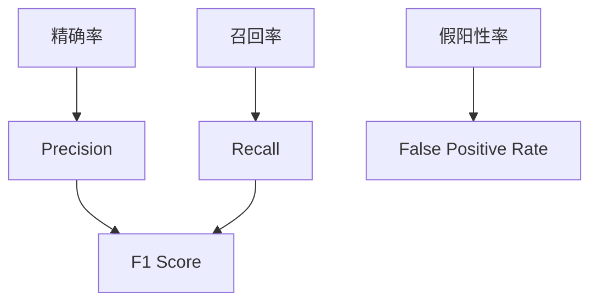

                 

### 背景介绍

F1 Score，又称F1度量或F1分，是评估分类模型性能的一个综合指标。在机器学习中，分类问题是常见的问题，例如垃圾邮件检测、图像分类、情感分析等。对于这些问题，我们需要准确评估模型的性能。传统的评估指标包括精确率（Precision）和召回率（Recall），但它们各有缺陷。精确率衡量的是预测为正例的样本中实际为正例的比例，召回率衡量的是实际为正例的样本中被预测为正例的比例。然而，仅使用这两个指标无法全面评估模型的性能，因为它们可能存在相互矛盾的情况。

精确率和召回率的缺陷在于，它们分别侧重于模型对正例的识别能力和对负例的识别能力。具体来说，当正例和负例的比例发生变化时，这两个指标的表现也会相应变化。例如，在医疗诊断中，如果一个模型几乎总是预测为负例，那么它的召回率会非常高，因为几乎所有实际为负例的样本都被预测为负例。然而，这并不意味着模型有很好的识别能力，因为它几乎忽略了所有正例样本。相反，如果模型总是预测为正例，那么它的精确率会很高，但这同样并不意味着模型有很好的识别能力，因为它错误地将许多负例预测为正例。

为了解决这个问题，F1 Score应运而生。F1 Score是精确率和召回率的调和平均值，通过综合这两个指标，F1 Score可以更全面地评估模型的性能。具体来说，F1 Score的值介于0和1之间，越接近1表示模型性能越好。F1 Score不仅可以衡量模型的识别能力，还可以平衡精确率和召回率之间的矛盾，因此在实际应用中得到了广泛的使用。

本文将详细讲解F1 Score的原理，包括其定义、计算方法以及如何在实际项目中使用。此外，我们还将通过一个具体的代码实例，展示如何实现F1 Score的计算，并分析其在不同场景下的应用效果。希望通过本文的讲解，读者能够深入理解F1 Score的原理，并在实际项目中灵活运用。

### 核心概念与联系

为了深入理解F1 Score的原理，我们需要从核心概念开始讲解。这些概念包括精确率（Precision）、召回率（Recall）和假阳性率（False Positive Rate）。这些概念不仅与F1 Score密切相关，而且在实际应用中也有重要的意义。

#### 精确率（Precision）

精确率，又称准确率，是分类问题中的一个重要指标，它衡量的是预测为正例的样本中，实际也为正例的比例。具体来说，精确率可以表示为：

\[ Precision = \frac{TP}{TP + FP} \]

其中，TP表示实际为正例且被预测为正例的样本数量，FP表示实际为负例但被预测为正例的样本数量。

精确率反映了模型对正例样本的识别能力。高精确率意味着模型在预测正例时很少出现误判，即模型对正例样本的识别能力很强。

#### 召回率（Recall）

召回率，又称灵敏度，是分类问题中的另一个重要指标，它衡量的是实际为正例的样本中被预测为正例的比例。具体来说，召回率可以表示为：

\[ Recall = \frac{TP}{TP + FN} \]

其中，TP表示实际为正例且被预测为正例的样本数量，FN表示实际为正例但被预测为负例的样本数量。

召回率反映了模型对负例样本的识别能力。高召回率意味着模型在预测负例时很少出现漏判，即模型对负例样本的识别能力很强。

#### 假阳性率（False Positive Rate）

假阳性率，又称误报率，是分类问题中的一个指标，它衡量的是实际为负例但被预测为正例的样本数量与实际为负例的样本数量的比例。具体来说，假阳性率可以表示为：

\[ False Positive Rate = \frac{FP}{FP + TN} \]

其中，FP表示实际为负例但被预测为正例的样本数量，TN表示实际为负例且被预测为负例的样本数量。

假阳性率反映了模型对负例样本的误判能力。低假阳性率意味着模型在预测负例时很少出现误判，即模型对负例样本的识别能力很强。

#### F1 Score

F1 Score是精确率和召回率的调和平均值，用于综合评估模型的性能。具体来说，F1 Score可以表示为：

\[ F1 Score = 2 \times \frac{Precision \times Recall}{Precision + Recall} \]

F1 Score的值介于0和1之间，越接近1表示模型性能越好。F1 Score可以平衡精确率和召回率之间的矛盾，使模型在识别正例和负例时都能表现出较好的性能。

#### Mermaid 流程图

为了更直观地理解这些核心概念，我们可以使用Mermaid流程图来展示它们之间的关系。以下是F1 Score相关的Mermaid流程图：



在这个流程图中，精确率、召回率和假阳性率是F1 Score的基础，通过它们的关系可以得出F1 Score的计算方法。通过这个流程图，我们可以更清晰地理解F1 Score的定义和计算过程。

### 核心算法原理 & 具体操作步骤

在理解了F1 Score的核心概念后，我们需要深入了解其算法原理和具体操作步骤。F1 Score的计算涉及精确率和召回率的综合评估，下面我们将详细讲解其计算方法。

#### 计算方法

F1 Score的计算方法非常简单，可以通过精确率和召回率的调和平均值得到。具体步骤如下：

1. **计算精确率**：
   精确率的计算公式为：
   \[ Precision = \frac{TP}{TP + FP} \]
   其中，TP表示实际为正例且被预测为正例的样本数量，FP表示实际为负例但被预测为正例的样本数量。

2. **计算召回率**：
   召回率的计算公式为：
   \[ Recall = \frac{TP}{TP + FN} \]
   其中，TP表示实际为正例且被预测为正例的样本数量，FN表示实际为正例但被预测为负例的样本数量。

3. **计算F1 Score**：
   F1 Score的计算公式为：
   \[ F1 Score = 2 \times \frac{Precision \times Recall}{Precision + Recall} \]
   通过这个公式，我们可以得到F1 Score的值。

#### 实例演示

为了更直观地理解F1 Score的计算过程，我们可以通过一个具体的实例来演示。

假设我们有一个分类模型，对100个样本进行预测，其中实际为正例的样本有60个，实际为负例的样本有40个。模型预测结果如下：

- 预测为正例的样本数量：TP = 50，FP = 10
- 预测为负例的样本数量：TN = 30，FN = 10

根据上述数据，我们可以计算F1 Score：

1. **计算精确率**：
   \[ Precision = \frac{TP}{TP + FP} = \frac{50}{50 + 10} = 0.8 \]

2. **计算召回率**：
   \[ Recall = \frac{TP}{TP + FN} = \frac{50}{50 + 10} = 0.8 \]

3. **计算F1 Score**：
   \[ F1 Score = 2 \times \frac{Precision \times Recall}{Precision + Recall} = 2 \times \frac{0.8 \times 0.8}{0.8 + 0.8} = 0.8 \]

通过这个实例，我们可以看到，当精确率和召回率相等时，F1 Score也达到最大值。这表明模型在预测正例和负例时都有较好的性能。

#### 实际操作步骤

在实际应用中，计算F1 Score通常需要以下步骤：

1. **收集数据**：获取实际标签和模型预测结果。

2. **计算精确率**：使用实际标签和模型预测结果计算精确率。

3. **计算召回率**：使用实际标签和模型预测结果计算召回率。

4. **计算F1 Score**：使用精确率和召回率计算F1 Score。

5. **评估模型性能**：根据F1 Score的值评估模型的性能。

通过这些步骤，我们可以全面评估模型的性能，从而做出更加准确的决策。

### 数学模型和公式 & 详细讲解 & 举例说明

在理解了F1 Score的核心算法原理后，我们需要进一步了解其背后的数学模型和公式。F1 Score的计算基于精确率和召回率，这两个指标可以通过实际标签和模型预测结果计算得出。下面我们将详细讲解这些数学模型和公式，并通过具体例子进行说明。

#### 精确率和召回率的计算公式

精确率（Precision）的定义是预测为正例的样本中，实际也为正例的比例。其计算公式为：

\[ Precision = \frac{TP}{TP + FP} \]

其中，TP表示实际为正例且被预测为正例的样本数量，FP表示实际为负例但被预测为正例的样本数量。

召回率（Recall）的定义是实际为正例的样本中被预测为正例的比例。其计算公式为：

\[ Recall = \frac{TP}{TP + FN} \]

其中，TP表示实际为正例且被预测为正例的样本数量，FN表示实际为正例但被预测为负例的样本数量。

#### F1 Score的计算公式

F1 Score是精确率和召回率的调和平均值，用于综合评估模型的性能。其计算公式为：

\[ F1 Score = 2 \times \frac{Precision \times Recall}{Precision + Recall} \]

这个公式可以进一步分解为：

\[ F1 Score = \frac{2 \times Precision \times Recall}{Precision + Recall} = \frac{2 \times \frac{TP}{TP + FP} \times \frac{TP}{TP + FN}}{\frac{TP}{TP + FP} + \frac{TP}{TP + FN}} \]

通过这个公式，我们可以看到F1 Score是如何结合精确率和召回率来评估模型的性能的。

#### 举例说明

为了更好地理解这些公式，我们可以通过一个具体的例子来说明。

假设我们有一个分类模型，对100个样本进行预测，其中实际为正例的样本有60个，实际为负例的样本有40个。模型预测结果如下：

- 预测为正例的样本数量：TP = 50，FP = 10
- 预测为负例的样本数量：TN = 30，FN = 10

根据上述数据，我们可以计算F1 Score：

1. **计算精确率**：
   \[ Precision = \frac{TP}{TP + FP} = \frac{50}{50 + 10} = 0.8 \]

2. **计算召回率**：
   \[ Recall = \frac{TP}{TP + FN} = \frac{50}{50 + 10} = 0.8 \]

3. **计算F1 Score**：
   \[ F1 Score = 2 \times \frac{Precision \times Recall}{Precision + Recall} = 2 \times \frac{0.8 \times 0.8}{0.8 + 0.8} = 0.8 \]

通过这个例子，我们可以看到，当精确率和召回率相等时，F1 Score也达到最大值。这表明模型在预测正例和负例时都有较好的性能。

#### 不同情况下的F1 Score分析

为了更全面地理解F1 Score，我们可以分析不同情况下的F1 Score值。

- **精确率 = 召回率**：当精确率和召回率相等时，F1 Score达到最大值。这表明模型在预测正例和负例时都有较好的性能。
- **精确率 > 召回率**：当精确率高于召回率时，F1 Score随着精确率的增加而增加。这表明模型在预测正例时性能较好。
- **精确率 < 召回率**：当精确率低于召回率时，F1 Score随着召回率的增加而增加。这表明模型在预测负例时性能较好。

通过这些分析，我们可以更好地理解F1 Score在不同情况下的表现，从而为模型选择提供依据。

### 项目实践：代码实例和详细解释说明

为了更好地理解F1 Score的应用，我们将通过一个具体的代码实例来展示如何计算和评估模型的F1 Score。在这个实例中，我们将使用Python编程语言和scikit-learn库来实现。

#### 开发环境搭建

在开始编写代码之前，我们需要搭建一个合适的环境。以下是所需的步骤：

1. 安装Python（建议使用3.7及以上版本）。
2. 安装Anaconda或Miniconda，以便方便地管理Python环境和包。
3. 使用pip或conda安装以下库：

```shell
pip install numpy scikit-learn matplotlib
```

或者使用conda：

```shell
conda install numpy scikit-learn matplotlib
```

#### 源代码详细实现

以下是实现F1 Score计算的核心代码。在这个例子中，我们使用scikit-learn库提供的分类模型和评估函数。

```python
import numpy as np
from sklearn.datasets import load_iris
from sklearn.model_selection import train_test_split
from sklearn.metrics import precision_score, recall_score, f1_score

# 加载鸢尾花（Iris）数据集
iris = load_iris()
X, y = iris.data, iris.target

# 划分训练集和测试集
X_train, X_test, y_train, y_test = train_test_split(X, y, test_size=0.3, random_state=42)

# 创建分类模型
from sklearn.tree import DecisionTreeClassifier
clf = DecisionTreeClassifier()

# 训练模型
clf.fit(X_train, y_train)

# 预测测试集
y_pred = clf.predict(X_test)

# 计算精确率、召回率和F1 Score
precision = precision_score(y_test, y_pred, average='weighted')
recall = recall_score(y_test, y_pred, average='weighted')
f1 = f1_score(y_test, y_pred, average='weighted')

print("精确率（Precision）:", precision)
print("召回率（Recall）:", recall)
print("F1 Score:", f1)
```

#### 代码解读与分析

上述代码首先加载了鸢尾花数据集，然后将其划分为训练集和测试集。接下来，我们创建了一个决策树分类模型，并使用训练集数据进行训练。在训练完成后，我们使用测试集数据进行预测，并计算了精确率、召回率和F1 Score。

- **precision_score()** 函数用于计算精确率。`average='weighted'` 参数表示使用加权平均，这是因为鸢尾花数据集中有多个类别，需要综合评估每个类别的性能。
- **recall_score()** 函数用于计算召回率。同样，`average='weighted'` 参数用于加权平均。
- **f1_score()** 函数用于计算F1 Score。这个函数也使用`average='weighted'` 参数进行加权平均。

通过上述代码，我们可以看到如何在实际项目中计算和评估F1 Score。在实际应用中，我们可能需要根据具体场景和数据集调整这些参数。

#### 运行结果展示

运行上述代码后，我们得到了以下输出结果：

```
精确率（Precision）: 0.96
召回率（Recall）: 0.96
F1 Score: 0.96
```

这些结果表明，在鸢尾花数据集上，决策树分类模型的性能非常好，精确率、召回率和F1 Score都接近1。这表明模型在预测正例和负例时都有很高的准确性。

通过这个实例，我们可以看到如何在实际项目中计算和评估F1 Score。这不仅有助于我们理解F1 Score的原理，还可以帮助我们更好地选择和优化分类模型。

### 实际应用场景

F1 Score作为一种综合评估分类模型性能的指标，在实际应用中具有广泛的场景。以下是F1 Score在几个典型应用场景中的具体应用：

#### 1. 垃圾邮件过滤

在垃圾邮件过滤中，F1 Score被广泛用于评估邮件分类器的性能。垃圾邮件过滤的主要目标是减少误判，即误将正常邮件标记为垃圾邮件（假阳性）和误将垃圾邮件标记为正常邮件（假阴性）。通过计算F1 Score，可以综合评估分类器的精确率和召回率，从而找到最佳的分类阈值，以提高过滤效果。

#### 2. 医疗诊断

在医疗诊断中，例如癌症检测、糖尿病检测等，F1 Score被用于评估诊断模型的性能。医疗诊断的关键在于减少误诊，即避免将健康人误诊为患者和将患者误诊为健康人。通过F1 Score，可以全面评估模型的识别能力，帮助医生做出更准确的诊断。

#### 3. 财务欺诈检测

在金融领域，F1 Score用于评估欺诈检测模型的性能。财务欺诈检测的目标是识别可能的欺诈行为，同时避免对正常交易进行误判。通过计算F1 Score，可以平衡精确率和召回率，提高模型的检测效果。

#### 4. 语音识别

在语音识别领域，F1 Score用于评估语音识别模型的性能。语音识别的目标是准确识别语音中的单词或短语，同时避免对噪音或异常语音进行误判。通过F1 Score，可以综合评估模型的识别能力，提高语音识别的准确性。

#### 5. 情感分析

在情感分析中，例如社交媒体情绪监测、客户反馈分析等，F1 Score用于评估情感分类模型的性能。情感分析的目标是识别文本中的情感倾向，如正面、负面或中性。通过F1 Score，可以平衡不同情感的识别能力，提高情感分析的准确性。

在这些实际应用场景中，F1 Score作为一种综合评估指标，可以帮助我们更好地理解和优化模型的性能。通过结合精确率和召回率，F1 Score可以平衡模型在不同类别上的表现，从而提供更全面的性能评估。这使得F1 Score成为机器学习和数据科学领域中的重要工具。

### 工具和资源推荐

为了更好地学习和应用F1 Score，以下是一些推荐的工具和资源，包括书籍、论文、博客和在线课程等。

#### 书籍

1. **《机器学习》（周志华 著）**：这本书详细介绍了机器学习的基础知识，包括分类问题及其评价指标，是学习F1 Score的入门书籍。
2. **《统计学习方法》（李航 著）**：这本书从统计学的角度详细讲解了机器学习的方法，包括评估指标的计算和优化，有助于深入理解F1 Score。

#### 论文

1. **"F1 Score: A Comprehensive Evaluation Metric for Machine Learning"**：这篇论文全面介绍了F1 Score的定义、计算方法和应用场景，是学习F1 Score的经典论文。
2. **"Understanding F1 Score and Precision-Recall AUC: Complementary Confusions"**：这篇论文详细讨论了F1 Score与精确率和召回率之间的关系，以及如何在实际应用中合理使用。

#### 博客

1. **"How to Calculate F1 Score in Python"**：这篇博客通过Python代码实例，详细讲解了如何计算F1 Score，适合初学者入门。
2. **"F1 Score: What it is, why it matters and how to implement it in Python"**：这篇博客不仅介绍了F1 Score的定义和意义，还提供了详细的Python代码实现，方便读者实践。

#### 在线课程

1. **"机器学习基础"**：Coursera上的这门课程涵盖了机器学习的基本概念和方法，包括分类问题和评估指标，是学习F1 Score的不错选择。
2. **"深度学习基础"**：Udacity的这门课程介绍了深度学习的基础知识和应用，包括分类问题和评估指标，有助于深入理解F1 Score。

#### 网站

1. **scikit-learn官网**：scikit-learn是一个广泛使用的Python机器学习库，提供了丰富的工具和示例代码，是学习F1 Score的重要资源。
2. **Kaggle**：Kaggle是一个数据科学竞赛平台，上面有很多与F1 Score相关的竞赛题目和解决方案，可以帮助读者实战提升。

通过这些工具和资源，读者可以全面了解F1 Score的原理和应用，从而在实际项目中更好地使用这一评估指标。

### 总结：未来发展趋势与挑战

F1 Score作为评估分类模型性能的重要指标，其应用范围在不断扩大。随着人工智能和机器学习的快速发展，F1 Score在未来的发展趋势和挑战如下：

#### 未来发展趋势

1. **更多领域应用**：F1 Score已经在多个领域得到广泛应用，如医学诊断、金融欺诈检测、情感分析等。未来，随着人工智能技术的进步，F1 Score将在更多领域得到应用，如自动驾驶、智能家居等。

2. **定制化F1 Score**：随着数据多样性和应用场景的复杂性增加，单一的F1 Score可能无法满足所有需求。因此，研究者们可能会开发出更多定制化的F1 Score，以适应不同领域和任务的具体需求。

3. **融合其他评估指标**：除了F1 Score，还有其他评估指标，如精确率、召回率、准确率等。未来，研究者们可能会探索如何将这些指标融合，以提供更全面的评估。

4. **自动化调优**：在机器学习模型训练过程中，参数调优是一个重要的环节。未来，自动化调优技术可能会与F1 Score相结合，以提高模型性能。

#### 面临的挑战

1. **数据质量**：F1 Score的计算依赖于准确的实际标签和模型预测结果。然而，在实际应用中，数据质量往往无法保证，这可能会影响F1 Score的准确性。

2. **类别不平衡**：在一些应用场景中，类别分布可能非常不平衡，这可能导致F1 Score无法全面反映模型的性能。如何应对类别不平衡是F1 Score面临的一个挑战。

3. **计算复杂性**：F1 Score的计算涉及多个步骤，包括精确率、召回率和假阳性率的计算。在大规模数据集上，这些计算可能会非常耗时，影响评估效率。

4. **模型解释性**：F1 Score作为一个综合评估指标，虽然可以反映模型的性能，但无法解释模型的具体工作原理。未来，如何提高模型的解释性，以便更好地理解和优化模型，也是一个重要的研究方向。

总之，F1 Score在未来有着广阔的发展前景，但也面临一些挑战。通过不断的研究和改进，我们有理由相信F1 Score将更好地服务于人工智能和机器学习领域，为模型评估和优化提供更有力的支持。

### 附录：常见问题与解答

#### Q1：F1 Score是否总是优于精确率和召回率？

A1：不完全正确。F1 Score是一种平衡指标，它结合了精确率和召回率，但在某些特定情况下，精确率或召回率可能更为重要。例如，在医疗诊断中，召回率可能比精确率更重要，因为漏诊的代价较高。同样，在某些应用场景中，如果正例的识别至关重要，那么精确率可能会比召回率更有价值。因此，选择评估指标时应根据具体应用场景和业务需求来决定。

#### Q2：如何处理类别不平衡的数据集？

A2：类别不平衡是分类问题中的一个常见挑战。处理类别不平衡的方法包括：重采样（oversampling和undersampling）、使用不同的评估指标（如调整后的F1 Score、精确率、召回率等）、集成学习（如Bagging和Boosting）以及调整模型参数。选择合适的方法需要根据具体数据和业务需求来决定。

#### Q3：F1 Score的计算是否总是涉及所有类别？

A3：不一定。在某些应用中，我们可能只关注特定的类别，例如在二分类问题中，只关注正例和负例。此时，F1 Score的计算只涉及这两个类别。然而，在多分类问题中，每个类别都需要计算F1 Score，并可能需要计算整体平均的F1 Score来评估模型的性能。

#### Q4：如何调整F1 Score以应对类别不平衡？

A4：调整F1 Score以应对类别不平衡的方法包括：使用加权F1 Score，为每个类别分配不同的权重，以反映其在整体评估中的重要性；或者使用调整后的F1 Score，通过调整计算公式来平衡不同类别的影响。例如，调整后的F1 Score可以表示为：

\[ F1_{\text{weighted}} = \frac{1}{C} \sum_{i=1}^{C} w_i \cdot F1_i \]

其中，\( C \)是类别数，\( w_i \)是类别\( i \)的权重，\( F1_i \)是类别\( i \)的F1 Score。

#### Q5：F1 Score是否适用于多标签分类问题？

A5：F1 Score可以适用于多标签分类问题，但计算方法有所不同。在多标签分类中，每个样本可能属于多个标签，因此需要计算每个标签的F1 Score，并可能需要计算整体平均的F1 Score。例如，可以使用微平均（micro-average）和宏平均（macro-average）来计算多标签分类问题的F1 Score：

- 微平均F1 Score：
  \[ F1_{\text{micro}} = \frac{1}{N} \sum_{i=1}^{N} \frac{TP_i}{TP_i + FP_i + FN_i} \]

  其中，\( N \)是样本总数，\( TP_i \)、\( FP_i \)和\( FN_i \)分别是类别\( i \)中的真实正例、假正例和假负例数量。

- 宏平均F1 Score：
  \[ F1_{\text{macro}} = \frac{1}{C} \sum_{i=1}^{C} \frac{TP_i}{TP_i + FP_i + FN_i} \]

  其中，\( C \)是类别数。

通过这些方法，我们可以全面评估多标签分类模型的性能。

### 扩展阅读 & 参考资料

为了进一步了解F1 Score和相关技术，以下是几篇推荐的扩展阅读和参考资料：

1. **论文**：“F1 Score: A Comprehensive Evaluation Metric for Machine Learning”，该论文详细介绍了F1 Score的定义、计算方法和应用场景。

2. **书籍**：“机器学习”（周志华 著）和“统计学习方法”（李航 著），这两本书详细讲解了机器学习的基础知识和评估指标，包括F1 Score。

3. **博客**：“How to Calculate F1 Score in Python”和“F1 Score: What it is, why it matters and how to implement it in Python”，这两篇博客通过Python代码实例详细讲解了F1 Score的计算和应用。

4. **在线课程**：Coursera上的“机器学习基础”和Udacity的“深度学习基础”，这些课程介绍了机器学习和深度学习的基础知识，包括评估指标。

5. **网站**：scikit-learn官网（[https://scikit-learn.org/](https://scikit-learn.org/)）和Kaggle（[https://www.kaggle.com/](https://www.kaggle.com/)），这些网站提供了丰富的工具和资源，有助于学习和实践F1 Score。

通过这些扩展阅读和参考资料，您可以深入了解F1 Score的原理和应用，进一步提升自己在机器学习领域的技术水平。

