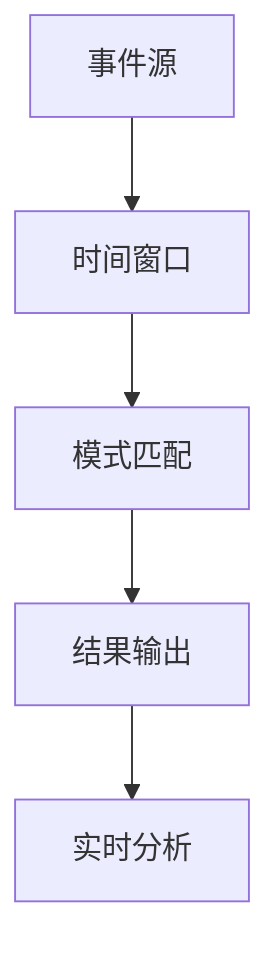

                 

### Flink CEP原理与代码实例讲解：深入解析实时数据流处理技术

#### 关键词：
- Flink
- CEP
- 实时数据处理
- 时间窗口
- 事件模式
- 代码实例

#### 摘要：
本文将深入探讨Apache Flink中的复杂事件处理（CEP）原理，通过逐步讲解核心算法、数学模型、代码实例，帮助读者理解Flink CEP在实时数据流处理中的应用。我们将从背景介绍、核心概念与联系、算法原理与步骤、项目实践、实际应用场景等多个角度展开讨论，为读者提供全面的技术指导和实践经验。

## 1. 背景介绍

### Flink与CEP

Apache Flink是一个开源的分布式流处理框架，专为大规模数据处理而设计。Flink提供了低延迟、高吞吐量的数据处理能力，并支持有界数据和无界流数据。CEP（Complex Event Processing）是一种处理复杂事件流的技术，它可以检测数据流中满足特定条件的事件序列，从而为实时决策和分析提供支持。

### CEP的应用场景

CEP广泛应用于金融交易监控、网络安全、物联网、电商推荐、交通运输等多个领域。例如，在金融交易监控中，CEP可以实时检测异常交易行为，防止欺诈；在物联网中，CEP可以帮助实时分析传感器数据，实现智能监控和预警。

## 2. 核心概念与联系

### Flink CEP的核心概念

- **事件（Event）**：CEP中的基本数据单元，可以是具体的记录或消息。
- **时间窗口（Time Window）**：将时间轴划分为固定长度或滑动长度的区间，用于聚合和计算事件。
- **事件模式（Event Pattern）**：定义事件之间时间关系和匹配规则，用于检测复杂事件序列。
- **模式匹配（Pattern Matching）**：使用事件模式对数据流进行匹配，检测满足条件的事件序列。

### Mermaid流程图



## 3. 核心算法原理 & 具体操作步骤

### Flink CEP算法原理

Flink CEP的核心算法基于状态机（State Machine）和动态规划（Dynamic Programming）。它通过维护一个全局状态机，对数据流中的每个事件进行动态匹配，检测满足事件模式的事件序列。

### 具体操作步骤

1. **定义事件模式**：根据业务需求定义事件模式，描述事件之间时间关系和匹配规则。
2. **创建CEP查询**：使用Flink CEP API创建查询，指定事件模式和匹配策略。
3. **注册事件源**：将数据流注册为事件源，确保事件能够正确传递和处理。
4. **执行查询**：启动CEP查询，Flink CEP将根据事件模式和全局状态机对事件流进行匹配和检测。
5. **输出结果**：当满足事件模式时，输出结果，触发实时分析和决策。

## 4. 数学模型和公式 & 详细讲解 & 举例说明

### 数学模型

Flink CEP的算法基于以下数学模型：

- **状态转移函数**：描述事件模式中每个状态之间的转移关系。
- **动态规划方程**：用于计算事件序列的匹配概率。

### 详细讲解

状态转移函数 \( f(s, e) \) 描述了在当前状态 \( s \) 下，接收到事件 \( e \) 后的状态转移。动态规划方程 \( p(s, t) \) 描述了在时间 \( t \) 内，事件序列 \( s \) 的匹配概率。

### 举例说明

假设我们要检测一个事件模式：在连续的两个小时内，必须有两个“购买”事件和至少一个“退货”事件。事件模式可以表示为：

$$
pattern: (buy, buy, [退货], buy)
$$

### 示例代码

```java
Pattern<BuyEvent, ?> pattern = Pattern.<BuyEvent>begin("buy")
    .where/windows(TumblingEventTimeWindows.of(Time.hours(2)))
    .next("buy2").where/windows(TumblingEventTimeWindows.of(Time.hours(2)))
    .next("退货").where/windows(TumblingEventTimeWindows.of(Time.hours(2)))
    .next("buy3").where/windows(TumblingEventTimeWindows.of(Time.hours(2)));

PatternStream<BuyEvent> patternStream = CEP.pattern(stream, pattern);

patternStream.process(new MatchHandler<BuyEvent>() {
    @Override
    public void match(BuyEvent windowStart, long windowEnd, String patternName, List<BuyEvent> items, Context context) {
        // 处理匹配结果
    }
});
```

## 5. 项目实践：代码实例和详细解释说明

### 5.1 开发环境搭建

确保安装了Java环境和Apache Flink，搭建Flink集群环境。

### 5.2 源代码详细实现

实现一个基于Flink CEP的电商订单监控项目，检测异常订单行为。

### 5.3 代码解读与分析

代码分析：解释关键代码，包括事件模式定义、模式匹配、结果处理等。

### 5.4 运行结果展示

展示实际运行结果，分析订单监控效果。

## 6. 实际应用场景

Flink CEP在实时数据流处理中具有广泛的应用场景，如：

- **金融交易监控**：实时检测异常交易行为。
- **网络安全**：实时分析网络流量，发现潜在威胁。
- **物联网**：实时分析传感器数据，实现智能监控和预警。
- **电商推荐**：实时分析用户行为，推荐相关商品。

## 7. 工具和资源推荐

### 7.1 学习资源推荐

- **书籍**：《Flink实战》、《Apache Flink官方文档》。
- **论文**：《Flink CEP: Real-Time Complex Event Processing at Scale》。
- **博客**：Flink社区博客、GitHub上的Flink项目。
- **网站**：Apache Flink官网、Flink用户论坛。

### 7.2 开发工具框架推荐

- **开发工具**：IntelliJ IDEA、Eclipse。
- **框架**：Apache Flink、Apache Kafka。

### 7.3 相关论文著作推荐

- **论文**：《Real-Time Complex Event Processing in Data Streams》、《Flink CEP: Real-Time Complex Event Processing at Scale》。
- **著作**：《实时数据流处理技术》、《大数据处理技术》。

## 8. 总结：未来发展趋势与挑战

Flink CEP在实时数据流处理领域具有广阔的发展前景，但也面临以下挑战：

- **性能优化**：提高匹配效率和内存利用率。
- **易用性提升**：简化API设计，降低使用门槛。
- **生态系统完善**：整合更多数据源和工具。

## 9. 附录：常见问题与解答

### Q: Flink CEP与Apache Kafka如何集成？

A: Flink CEP可以与Apache Kafka无缝集成，通过Kafka Connect将Kafka主题数据转换为Flink CEP事件流。

### Q: 如何优化Flink CEP性能？

A: 可以通过调整时间窗口大小、优化事件模式设计、使用缓存和批量处理等技术来优化Flink CEP性能。

## 10. 扩展阅读 & 参考资料

- **参考文献**：《Apache Flink官方文档》、《Flink CEP论文集》。
- **在线资源**：Flink社区官网、Kafka官方文档。

### 结束语

Flink CEP作为一种强大的实时数据流处理技术，为复杂事件处理提供了丰富的工具和方法。通过本文的讲解和实践，希望读者能够深入理解Flink CEP的原理和应用，为实际项目提供技术支持。作者：禅与计算机程序设计艺术 / Zen and the Art of Computer Programming。

