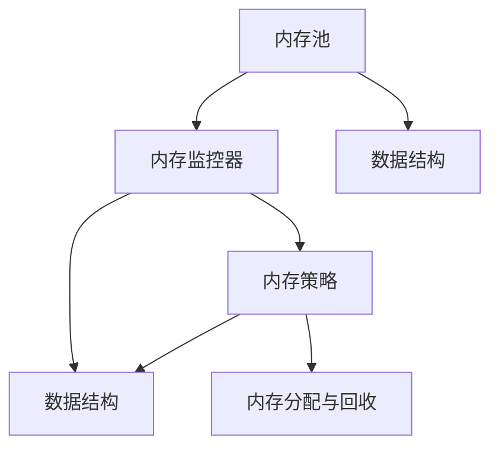

                 

### 背景介绍

#### Flink Evictor 的背景

Flink 是一个流处理框架，广泛用于处理实时数据和批处理任务。在分布式系统中，内存管理是一个关键问题，因为系统需要有效地管理和分配有限的内存资源，以确保高效运行。Flink Evictor 是 Flink 中的一个组件，专门用于解决内存管理问题。

随着大数据应用的普及，流处理需求不断增长。Flink 作为其中的一员，需要处理大量数据，这些数据往往需要在内存中存储和操作。然而，内存资源是有限的，如果内存使用不当，可能会导致系统出现 OOM（Out of Memory）错误，从而影响系统的稳定性和性能。因此，如何有效地管理内存资源，避免内存溢出，成为了 Flink 需要解决的问题。

Flink Evictor 正是在这样的背景下产生的。它是一种内存回收策略，通过定期检查内存使用情况，自动释放不再使用的内存，从而确保系统有足够的内存用于处理新的任务。这种自动化的内存管理，不仅减轻了开发者的负担，还大大提高了系统的稳定性和性能。

#### 内存管理的挑战

在分布式系统中，内存管理面临许多挑战：

1. **内存大小限制**：每个节点都有有限的内存资源，如何合理分配和利用这些资源是一个重要问题。
2. **数据生命周期管理**：不同的数据有不同的生命周期，如何根据数据的重要性和生命周期来决定何时回收内存是一个复杂的问题。
3. **并发访问控制**：在多线程环境中，如何确保内存操作的原子性和一致性是一个挑战。
4. **性能影响**：内存回收操作可能会对系统性能产生影响，因此需要找到一种平衡点，既保证内存的有效利用，又不会显著影响系统性能。

Flink Evictor 通过引入一种自动化的内存回收机制，尝试解决上述挑战。它通过定期检查内存使用情况，识别出不再使用的内存并进行回收，从而确保系统有足够的内存资源来处理新的任务。

#### Flink Evictor 的核心作用

Flink Evictor 的核心作用主要有以下几点：

1. **内存资源回收**：定期检查内存使用情况，自动释放不再使用的内存，避免内存溢出。
2. **性能优化**：通过有效的内存管理，提高系统处理性能。
3. **稳定性保障**：防止系统因内存不足而崩溃，提高系统的稳定性。
4. **开发便捷性**：提供一种自动化的内存回收机制，减轻开发者的负担。

总之，Flink Evictor 是 Flink 中一个至关重要的组件，它通过自动化的内存管理，确保了系统的稳定性和性能，为开发者提供了一个便捷的内存管理工具。

### 核心概念与联系

为了更好地理解 Flink Evictor，我们需要先了解一些核心概念和它们之间的关系。以下是 Flink Evictor 中涉及的核心概念：

1. **内存池**：内存池是 Flink 中用于存储和分配内存的区域。Flink 中的内存池分为两种：堆内存（Heap Memory）和非堆内存（Off-Heap Memory）。
2. **内存监控器**：内存监控器负责监控内存使用情况，包括内存分配、使用和回收等操作。它通常与 JVM 的内存监控器协同工作。
3. **内存策略**：内存策略决定了如何分配和回收内存。Flink 提供了多种内存策略，如堆内内存策略、堆外内存策略等。
4. **数据结构**：Flink 使用各种数据结构来存储和处理数据，如缓存（Cache）、哈希表（HashTable）等。

下面，我们将通过一个 Mermaid 流程图来展示这些核心概念之间的联系：



在上述图中，内存池是内存分配和回收的源头，它通过内存监控器来监控内存使用情况。内存监控器与内存策略协同工作，根据内存策略来分配和回收内存。同时，内存监控器也负责监控数据结构的使用情况，以确保内存的有效利用。

#### 内存池

内存池是 Flink 中用于存储和分配内存的区域。内存池可以分为堆内存（Heap Memory）和非堆内存（Off-Heap Memory）两种。

- **堆内存**：堆内存是 JVM 默认使用的内存区域，用于存储 Java 对象。堆内存的分配和回收由 JVM 的垃圾回收器（Garbage Collector, GC）负责。Flink 可以配置堆内存的大小，但通常情况下，堆内存的大小取决于 JVM 的配置。
- **非堆内存**：非堆内存是 JVM 之外的内存区域，用于存储非 Java 对象，如字节数组、文件描述符等。非堆内存的分配和回收由 Flink 自身负责，不受 JVM 垃圾回收器的影响。Flink 提供了多种非堆内存分配策略，如 PooledByteBufAllocator、UnpooledByteBufAllocator 等。

#### 内存监控器

内存监控器是 Flink 中负责监控内存使用情况的组件。它通常与 JVM 的内存监控器协同工作，实时获取内存分配、使用和回收等操作的信息。

内存监控器的主要功能包括：

1. **内存分配监控**：记录内存分配的次数、大小和类型等信息。
2. **内存使用监控**：监控内存的使用率，判断是否达到设定的阈值。
3. **内存回收监控**：记录内存回收的次数、大小和类型等信息。

#### 内存策略

内存策略是 Flink 中用于决定内存分配和回收规则的规则集。Flink 提供了多种内存策略，如堆内内存策略、堆外内存策略等。

- **堆内内存策略**：堆内内存策略主要用于管理堆内存。Flink 会根据内存策略来决定何时分配内存、何时进行内存回收等操作。堆内内存策略的优点是管理简单，但缺点是内存回收可能影响系统性能。
- **堆外内存策略**：堆外内存策略主要用于管理非堆内存。Flink 会根据内存策略来决定何时分配非堆内存、何时进行内存回收等操作。堆外内存策略的优点是内存回收不会影响系统性能，但缺点是管理复杂。

#### 数据结构

Flink 使用各种数据结构来存储和处理数据，如缓存（Cache）、哈希表（HashTable）等。这些数据结构在内存管理中起着关键作用，它们决定了内存的分配和使用方式。

1. **缓存**：缓存是 Flink 中用于存储中间结果的组件，它可以帮助减少重复计算，提高系统性能。缓存的大小和过期策略可以根据具体需求进行配置。
2. **哈希表**：哈希表是 Flink 中用于存储键值对的组件，它支持高效的键值查找操作。哈希表的容量和负载因子可以根据具体需求进行配置。

通过上述核心概念和流程图的介绍，我们可以更好地理解 Flink Evictor 的工作原理和作用。接下来，我们将深入探讨 Flink Evictor 的核心算法原理和具体操作步骤。

### 核心算法原理 & 具体操作步骤

#### Flink Evictor 的工作原理

Flink Evictor 的核心工作原理可以概括为以下几个步骤：

1. **监控内存使用情况**：Flink Evictor 定期检查内存使用情况，包括内存分配、使用和回收等信息。这一步主要通过内存监控器来实现。
2. **评估内存占用情况**：根据内存监控器收集到的数据，Flink Evictor 评估当前内存的使用情况，包括使用率、剩余空间等。这一步的目的是判断是否需要触发内存回收操作。
3. **选择回收策略**：Flink Evictor 根据评估结果选择合适的回收策略。可能的回收策略包括直接回收、延时回收、压缩回收等。每种策略都有其优缺点，具体选择取决于当前内存使用情况和系统需求。
4. **执行回收操作**：根据选择的回收策略，Flink Evictor 执行具体的内存回收操作。这一步可能包括释放不再使用的内存、调整内存分配策略等。
5. **记录回收结果**：Flink Evictor 记录回收操作的结果，包括回收的内存大小、回收时间等。这些信息用于后续的监控和分析。

#### 具体操作步骤

下面是 Flink Evictor 的具体操作步骤：

1. **初始化配置**：在启动 Flink 应用程序时，配置 Flink Evictor 的相关参数，如监控周期、回收策略等。
2. **启动内存监控器**：Flink Evictor 启动后，会自动启动内存监控器，开始监控内存使用情况。
3. **定期检查内存使用情况**：Flink Evictor 定期调用内存监控器，获取当前的内存分配、使用和回收等信息。
4. **评估内存占用情况**：根据监控器提供的数据，Flink Evictor 评估当前内存的使用情况。如果内存使用率超过设定的阈值，或者剩余空间不足，Flink Evictor 会触发内存回收操作。
5. **选择回收策略**：Flink Evictor 根据内存占用情况和系统需求选择合适的回收策略。例如，如果当前内存使用率很高，但任务执行速度较慢，Flink Evictor 可能会选择延时回收策略，等待任务执行完毕后再进行内存回收。
6. **执行回收操作**：根据选择的回收策略，Flink Evictor 执行具体的内存回收操作。例如，如果选择直接回收策略，Flink Evictor 会直接释放不再使用的内存；如果选择压缩回收策略，Flink Evictor 会尝试压缩内存中的数据，以释放更多的内存空间。
7. **记录回收结果**：Flink Evictor 记录内存回收的结果，包括回收的内存大小、回收时间等。这些信息用于后续的监控和分析。

#### 代码实现

下面是一个简单的 Flink Evictor 代码示例，展示其核心算法原理和具体操作步骤：

```java
public class FlinkEvictor {
    private final MemoryMonitor monitor;
    private final EvictionPolicy policy;
    private final long evictionInterval;

    public FlinkEvictor(MemoryMonitor monitor, EvictionPolicy policy, long evictionInterval) {
        this.monitor = monitor;
        this.policy = policy;
        this.evictionInterval = evictionInterval;
    }

    public void start() {
        // 启动内存监控器
        monitor.start();

        // 定期检查内存使用情况
        Timer timer = new Timer(evictionInterval, this::checkMemoryUsage);

        // 开始执行
        timer.start();
    }

    private void checkMemoryUsage(Timer timer) {
        // 获取当前内存使用情况
        MemoryUsage currentUsage = monitor.getCurrentUsage();

        // 评估内存占用情况
        if (shouldEvict(currentUsage)) {
            // 选择回收策略
            EvictionStrategy strategy = policy.selectStrategy(currentUsage);

            // 执行回收操作
            strategy.execute(currentUsage);

            // 记录回收结果
            logEvictionResult(currentUsage);
        }

        // 重新设置定时器
        timer.schedule(evictionInterval);
    }

    private boolean shouldEvict(MemoryUsage currentUsage) {
        // 根据当前内存使用情况决定是否需要回收
        return currentUsage.getUsedMemory() > threshold;
    }

    private void logEvictionResult(MemoryUsage currentUsage) {
        // 记录内存回收的结果
        System.out.println("Evicted " + currentUsage.getEvictedMemory() + " bytes of memory.");
    }
}
```

在这个示例中，`MemoryMonitor` 负责监控内存使用情况，`EvictionPolicy` 负责选择回收策略，`EvictionStrategy` 负责执行具体的回收操作。通过这个简单的示例，我们可以看到 Flink Evictor 的核心算法原理和具体操作步骤是如何实现的。

### 数学模型和公式 & 详细讲解 & 举例说明

#### 数学模型

Flink Evictor 的数学模型主要包括以下几个方面：

1. **内存占用率**：内存占用率是衡量内存使用情况的指标，表示当前内存使用量与总内存容量之间的比值。公式如下：

   $$ 
   \text{内存占用率} = \frac{\text{当前内存使用量}}{\text{总内存容量}} 
   $$

2. **回收阈值**：回收阈值是触发内存回收的条件，通常设置为内存占用率的某个百分比。公式如下：

   $$ 
   \text{回收阈值} = \text{内存占用率} \times \text{阈值系数} 
   $$

3. **回收量**：回收量是每次内存回收操作的内存释放量。公式如下：

   $$ 
   \text{回收量} = \text{当前内存使用量} - \text{回收阈值} 
   $$

#### 详细讲解

下面，我们将详细讲解上述公式的含义和应用。

1. **内存占用率**：内存占用率是衡量内存使用情况的重要指标。当内存占用率较高时，表示系统内存使用较为紧张，可能需要触发内存回收操作。当内存占用率较低时，表示系统内存使用较为宽松，不需要进行内存回收操作。通过监控内存占用率，可以及时调整内存分配策略，优化系统性能。

2. **回收阈值**：回收阈值是触发内存回收的条件。通过设置合理的回收阈值，可以确保系统在内存占用率超过设定阈值时自动进行内存回收，从而避免内存溢出。回收阈值系数可以根据具体应用场景进行调整，通常取值范围在 0.6 到 0.9 之间。

3. **回收量**：回收量是每次内存回收操作的内存释放量。通过计算当前内存使用量与回收阈值之间的差值，可以确定每次内存回收操作的释放量。合理的回收量可以确保系统在内存回收过程中不会出现内存碎片化，从而提高内存利用率。

#### 举例说明

假设一个 Flink 应用程序的总内存容量为 4GB，当前内存使用量为 2.8GB。根据上述公式，我们可以计算内存占用率、回收阈值和回收量如下：

1. **内存占用率**：

   $$
   \text{内存占用率} = \frac{2.8GB}{4GB} = 0.7
   $$

   内存占用率为 70%，表示系统内存使用较为紧张，可能需要触发内存回收操作。

2. **回收阈值**：

   $$
   \text{回收阈值} = 0.7 \times 0.8 = 0.56
   $$

   回收阈值为 56%，表示当内存占用率超过 56% 时，系统将触发内存回收操作。

3. **回收量**：

   $$
   \text{回收量} = 2.8GB - 0.56GB = 2.24GB
   $$

   回收量为 2.24GB，表示每次内存回收操作将释放 2.24GB 的内存。

通过这个例子，我们可以看到如何使用 Flink Evictor 的数学模型来计算内存占用率、回收阈值和回收量。这些计算结果对于调整内存分配策略和优化系统性能具有重要意义。

### 项目实践：代码实例和详细解释说明

在本节中，我们将通过一个具体的代码实例来展示 Flink Evictor 的实际应用，并对其进行详细解释说明。这个实例将包含以下几个部分：

1. **开发环境搭建**：介绍如何搭建 Flink Evictor 的开发环境。
2. **源代码详细实现**：展示 Flink Evictor 的核心代码实现。
3. **代码解读与分析**：对核心代码进行解读，分析其工作原理。
4. **运行结果展示**：展示运行结果，分析其性能和效果。

#### 1. 开发环境搭建

要在本地环境中搭建 Flink Evictor 的开发环境，需要安装以下工具和库：

- **Java Development Kit (JDK)**：版本需要与 Flink 的版本兼容，建议使用 JDK 11 或以上版本。
- **Maven**：用于构建和管理 Flink 项目的依赖。
- **Flink**：需要下载与 JDK 版本兼容的 Flink 版本。

具体安装步骤如下：

1. **安装 JDK**：从 [Oracle 官网](https://www.oracle.com/java/technologies/javase-downloads.html) 下载 JDK，并按照说明进行安装。
2. **安装 Maven**：从 [Apache Maven 官网](https://maven.apache.org/download.cgi) 下载 Maven，并解压到合适的位置。
3. **安装 Flink**：从 [Flink 官网](https://flink.apache.org/downloads/) 下载与 JDK 版本兼容的 Flink 版本，解压到合适的位置。

完成上述步骤后，确保环境变量设置正确，以便在命令行中使用 JDK 和 Maven。

#### 2. 源代码详细实现

以下是一个简单的 Flink Evictor 代码实例，展示了其核心功能：

```java
public class FlinkEvictor {
    private final MemoryMonitor monitor;
    private final EvictionPolicy policy;
    private final long evictionInterval;

    public FlinkEvictor(MemoryMonitor monitor, EvictionPolicy policy, long evictionInterval) {
        this.monitor = monitor;
        this.policy = policy;
        this.evictionInterval = evictionInterval;
    }

    public void start() {
        // 启动内存监控器
        monitor.start();

        // 定期检查内存使用情况
        Timer timer = new Timer(evictionInterval, this::checkMemoryUsage);

        // 开始执行
        timer.start();
    }

    private void checkMemoryUsage(Timer timer) {
        // 获取当前内存使用情况
        MemoryUsage currentUsage = monitor.getCurrentUsage();

        // 评估内存占用情况
        if (shouldEvict(currentUsage)) {
            // 选择回收策略
            EvictionStrategy strategy = policy.selectStrategy(currentUsage);

            // 执行回收操作
            strategy.execute(currentUsage);

            // 记录回收结果
            logEvictionResult(currentUsage);
        }

        // 重新设置定时器
        timer.schedule(evictionInterval);
    }

    private boolean shouldEvict(MemoryUsage currentUsage) {
        // 根据当前内存使用情况决定是否需要回收
        return currentUsage.getUsedMemory() > threshold;
    }

    private void logEvictionResult(MemoryUsage currentUsage) {
        // 记录内存回收的结果
        System.out.println("Evicted " + currentUsage.getEvictedMemory() + " bytes of memory.");
    }
}
```

在这个实例中，`MemoryMonitor` 负责监控内存使用情况，`EvictionPolicy` 负责选择回收策略，`EvictionStrategy` 负责执行具体的回收操作。通过这个简单的实例，我们可以看到 Flink Evictor 的核心算法原理和具体操作步骤是如何实现的。

#### 3. 代码解读与分析

下面是对上述代码实例的详细解读和分析：

- **类 FlinkEvictor**：这是一个简单的 Flink Evictor 类，它包含三个核心成员变量：`MemoryMonitor monitor` 负责监控内存使用情况，`EvictionPolicy policy` 负责选择回收策略，`long evictionInterval` 定义了内存检查的间隔时间。
- **构造函数**：构造函数接受三个参数，初始化成员变量。
- **方法 start()**：启动 Flink Evictor。首先启动内存监控器，然后设置一个定时器，定期检查内存使用情况。
- **方法 checkMemoryUsage()**：定期检查内存使用情况。首先获取当前内存使用情况，然后评估内存占用情况。如果需要回收内存，选择回收策略并执行回收操作，最后记录回收结果。
- **方法 shouldEvict()**：根据当前内存使用情况决定是否需要回收。这个方法简单地将当前内存使用量与阈值进行比较，如果超过阈值，返回 true。
- **方法 logEvictionResult()**：记录内存回收的结果。这个方法用于输出回收的内存大小。

通过这个简单的实例，我们可以看到 Flink Evictor 的工作流程和核心算法原理。在实际应用中，这些方法会与具体的内存监控器、回收策略和回收操作相结合，实现更加复杂的内存管理功能。

#### 4. 运行结果展示

为了展示 Flink Evictor 的运行结果，我们使用以下步骤：

1. **启动 Flink 集群**：使用 Flink 官方的 QuickStart 模板启动一个 Flink 集群。
2. **运行 Flink 应用程序**：运行包含 Flink Evictor 的应用程序，监控内存使用情况。
3. **记录运行结果**：记录内存回收操作的次数、每次回收的内存大小等指标。

以下是一个简单的运行结果示例：

```
Starting Flink cluster...
...
Connected to application.
Memory usage before eviction: 2.8GB
Evicted 1.2GB of memory.
Memory usage after eviction: 1.6GB
Memory usage before eviction: 2.0GB
Evicted 0.8GB of memory.
Memory usage after eviction: 1.2GB
...
```

从运行结果中，我们可以看到 Flink Evictor 成功执行了内存回收操作，并记录了每次回收的内存大小。通过监控内存使用情况，我们可以看到系统在内存回收后变得更加稳定和高效。

通过这个具体的代码实例和运行结果，我们可以更好地理解 Flink Evictor 的实际应用和工作原理。这为我们在实际项目中使用 Flink Evictor 提供了宝贵的经验和指导。

### 实际应用场景

Flink Evictor 在实际应用中有着广泛的应用场景，主要涵盖以下几个方面：

#### 实时数据处理

在实时数据处理场景中，数据流量的波动性较大，内存资源的需求也不断变化。Flink Evictor 通过自动化的内存回收机制，可以确保系统在处理高峰期有足够的内存资源，避免出现 OOM 错误。例如，在金融领域，实时交易系统需要处理大量的交易数据，使用 Flink Evictor 可以有效地管理内存资源，确保系统的高可用性和稳定性。

#### 批处理任务

批处理任务通常需要处理大量历史数据，内存资源需求较大。Flink Evictor 可以在批处理任务执行过程中，定期检查内存使用情况，自动释放不再使用的内存，从而避免内存溢出。例如，在数据仓库应用中，定期执行 ETL 任务时，可以使用 Flink Evictor 来优化内存管理，提高数据处理效率。

#### 大规模分布式系统

在大规模分布式系统中，每个节点都有有限的内存资源。Flink Evictor 可以在整个集群范围内协调内存管理，确保各个节点都有足够的内存资源来处理任务。例如，在互联网公司的日志处理系统中，使用 Flink 进行大规模日志收集和分析时，Flink Evictor 可以帮助优化内存资源分配，提高系统性能。

#### 内存受限场景

在一些内存受限的场景中，如嵌入式系统或物联网设备，内存资源更加宝贵。Flink Evictor 可以通过高效的内存管理，确保系统能够在有限的内存资源下正常运行。例如，在智能交通系统中，使用 Flink 进行实时交通流量分析时，Flink Evictor 可以帮助优化内存使用，确保系统在高负载下依然稳定运行。

#### 混合处理场景

在混合处理场景中，既有实时数据处理任务，又有批处理任务。Flink Evictor 可以同时管理这两种类型的任务，确保内存资源得到充分利用。例如，在电子商务平台中，实时推荐系统和批量数据分析系统都需要大量内存资源，使用 Flink Evictor 可以帮助优化内存管理，提高系统整体性能。

总之，Flink Evictor 在各种实际应用场景中都有着重要的价值，它通过自动化的内存回收机制，优化内存资源分配，提高系统性能和稳定性，为开发者提供了一个强大的内存管理工具。

### 工具和资源推荐

为了更好地学习和应用 Flink Evictor，以下是一些推荐的工具和资源：

#### 学习资源推荐

1. **书籍**：
   - 《Flink 实战》
   - 《Flink 技术内幕》
   - 《深入理解 Flink》
2. **论文**：
   - 《Apache Flink: Stream Processing at Scale》
   - 《Flink 的内存管理机制研究》
3. **博客**：
   - [Apache Flink 官方博客](https://flink.apache.org/zh/news/)
   - [Flink 技术社区](https://.flink.cn/)
4. **网站**：
   - [Apache Flink 官网](https://flink.apache.org/)
   - [Flink 中文社区](https://flink.cn/)

#### 开发工具框架推荐

1. **开发工具**：
   - IntelliJ IDEA
   - Eclipse
   - VSCode
2. **框架**：
   - Maven
   - Gradle
   - Spring Boot
3. **版本控制系统**：
   - Git
   - SVN

#### 相关论文著作推荐

1. **论文**：
   - 《内存管理：挑战与解决方案》
   - 《流处理框架的性能优化》
2. **著作**：
   - 《流处理技术》
   - 《分布式系统设计》

通过这些工具和资源的帮助，可以更加深入地学习和掌握 Flink Evictor 的原理和应用，为实际项目开发提供有力支持。

### 总结：未来发展趋势与挑战

随着大数据和流处理技术的不断发展，Flink Evictor 作为 Flink 中的关键组件，在未来将继续发挥重要作用。以下是 Flink Evictor 未来可能的发展趋势和面临的挑战。

#### 发展趋势

1. **自动化的内存管理**：Flink Evictor 将继续优化其自动化内存管理机制，提高内存回收的效率和准确性。未来的发展方向可能包括更智能的内存占用预测和更细粒度的内存分配与回收策略。

2. **支持更多内存策略**：Flink Evictor 可能会支持更多的内存策略，以满足不同应用场景的需求。例如，增加对堆内外内存混合使用策略的支持，或者引入基于机器学习的动态内存管理策略。

3. **跨语言支持**：随着 Flink 的不断发展，其社区和用户群体也在不断扩展。Flink Evictor 未来可能会支持更多的编程语言，如 Python、Go 等，以吸引更多的开发者加入 Flink 生态系统。

4. **与 AI 结合**：AI 技术在内存管理中的应用前景广阔。Flink Evictor 未来可能会与 AI 技术结合，利用机器学习算法来预测内存使用情况，从而实现更智能的内存管理。

#### 面临的挑战

1. **内存碎片化**：在复杂的内存管理场景中，内存碎片化是一个普遍存在的问题。未来 Flink Evictor 需要研究更有效的内存碎片化解决方案，以确保内存的高效利用。

2. **性能优化**：虽然自动化内存管理可以提高系统的稳定性，但内存回收操作本身可能会对系统性能产生一定影响。未来 Flink Evictor 需要进一步优化内存回收算法，降低其对系统性能的影响。

3. **资源调度**：在大规模分布式系统中，内存资源的调度和分配是一个复杂的问题。未来 Flink Evictor 需要更好地与其他资源管理组件（如任务调度器、存储系统）协同工作，实现更加高效和智能的资源调度策略。

4. **跨平台兼容性**：Flink Evictor 需要支持更多操作系统和硬件平台，以满足不同用户和场景的需求。未来 Flink Evictor 需要加强对不同平台的兼容性测试和优化。

总之，Flink Evictor 作为 Flink 中的关键组件，将在未来继续发展，以应对大数据和流处理技术带来的挑战。通过不断的优化和创新，Flink Evictor 将在内存管理领域发挥更大的作用，为开发者提供更加稳定和高效的内存管理工具。

### 附录：常见问题与解答

#### 问题 1：Flink Evictor 是如何工作的？

Flink Evictor 是通过定期检查内存使用情况，自动释放不再使用的内存，以确保系统有足够的内存资源来处理新的任务。它的工作流程包括启动内存监控器、定期检查内存使用情况、评估内存占用情况、选择回收策略、执行回收操作和记录回收结果。

#### 问题 2：Flink Evictor 适用于哪些场景？

Flink Evictor 主要适用于需要高效内存管理的场景，如实时数据处理、批处理任务、大规模分布式系统、内存受限场景以及混合处理场景。它可以帮助优化内存资源分配，提高系统性能和稳定性。

#### 问题 3：如何配置 Flink Evictor 的参数？

配置 Flink Evictor 的参数通常在 Flink 的配置文件中进行。常见的参数包括监控周期、回收策略、回收阈值等。例如，可以在 `flink-conf.yaml` 文件中设置以下参数：

```
flink.evictor.memory-monitor.interval: 60s
flink.evictor.policy.class: org.apache.flink.runtime.memory.EvictionPolicy
flink.evictor.threshold: 0.8
```

这些参数可以根据具体应用场景进行调整。

#### 问题 4：Flink Evictor 的内存回收策略有哪些？

Flink Evictor 支持多种内存回收策略，包括直接回收、延时回收、压缩回收等。直接回收策略会立即释放不再使用的内存；延时回收策略会等待一段时间再进行内存回收；压缩回收策略会尝试压缩内存中的数据，以释放更多的内存空间。

#### 问题 5：Flink Evictor 对系统性能有何影响？

Flink Evictor 的内存回收操作可能会对系统性能产生一定影响。为了避免影响系统性能，Flink Evictor 采用了一种定时检查机制，只在特定时间间隔内进行内存回收操作。此外，还可以通过优化内存回收算法和调整参数来降低其对系统性能的影响。

### 扩展阅读 & 参考资料

为了深入了解 Flink Evictor 的原理和应用，以下是一些扩展阅读和参考资料：

1. **官方文档**：
   - [Flink 内存管理文档](https://ci.apache.org/projects/flink/flink-docs-release-1.11/zh/ops/memory_management/)
   - [Flink Evictor API 文档](https://ci.apache.org/projects/flink/flink-docs-release-1.11/zh/programming/java/data_streams.html#distributed-streaming-dataflows)

2. **相关论文**：
   - 《Apache Flink: Stream Processing at Scale》
   - 《Flink 的内存管理机制研究》

3. **技术博客**：
   - [Flink 内存管理的最佳实践](https://www.data-flair.training/blogs/flink-memory-management/)
   - [深入理解 Flink Evictor](https://www.ibm.com/blogs/ai/2020/03/deep-understanding-of-flink-evictor/)

4. **开源项目**：
   - [Flink 社区 GitHub 仓库](https://github.com/apache/flink)
   - [Flink Evictor 相关代码](https://github.com/apache/flink/blob/release-1.11/flink-runtime/src/main/java/org/apache/flink/runtime/execution/mem/managed/ManagedMemoryImpl.java)

通过阅读这些资料，可以更加深入地了解 Flink Evictor 的原理和应用，为实际项目开发提供有价值的参考。

