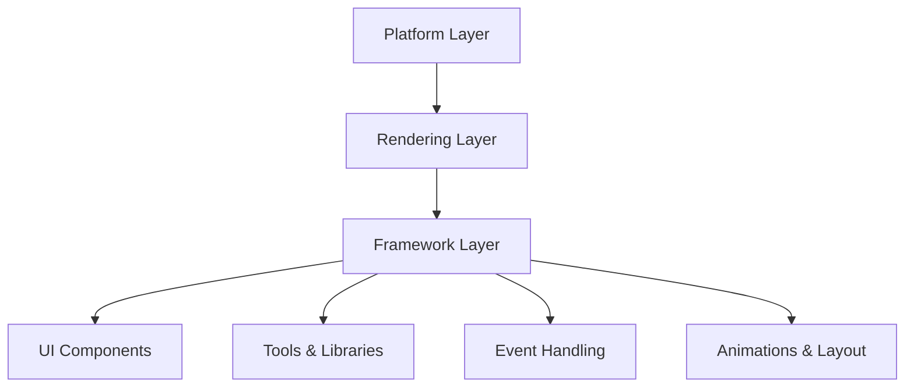

                 

### 背景介绍

Flutter 是一款由谷歌开发的 UI 开发框架，自 2017 年首次发布以来，在移动应用开发领域迅速获得了广泛认可。Flutter 的出现填补了原生开发与 Web 开发之间的鸿沟，使开发者能够使用一套代码库同时构建 iOS 和 Android 应用，从而大大提高了开发效率和代码复用率。

### 背景技术

在 Flutter 诞生之前，移动应用开发主要依赖于原生开发，即针对每个平台（iOS 和 Android）编写独立的代码。这种方法虽然能够提供最优的性能，但同时也带来了显著的开发成本和时间开销。为了解决这一问题，跨平台开发框架应运而生，其中最具代表性的包括 React Native、Cordova 和 Apache Cordova 等。

React Native 由 Facebook 开发，利用 React 的虚拟 DOM 和 JavaScript 语言，实现了一套跨平台的 UI 开发框架。Cordova 和 Apache Cordova 则是基于 HTML5、CSS3 和 JavaScript 技术的框架，通过在原生应用中嵌入网页，实现跨平台功能。然而，这些框架在性能和用户体验上仍然无法与原生应用相比。

Flutter 的出现改变了这一现状。它使用 Dart 语言编写，并提供了一套丰富的 UI 组件和工具库，使开发者能够构建高性能、高保真的跨平台应用。Flutter 通过使用 Skia 图形引擎，实现了与原生应用几乎相同的渲染性能，同时支持热重载（Hot Reload），大大缩短了开发周期。

### 核心概念与联系

#### Flutter 的核心组件

Flutter 的架构可以分为三个核心层：平台层（Platform Layer）、渲染层（Rendering Layer）和框架层（Framework Layer）。

1. **平台层**：Flutter 的平台层负责与操作系统进行交互，包括事件处理、文件 I/O、网络通信等。平台层通过 FFI（Foreign Function Interface）调用原生代码，实现了与 iOS 和 Android 的无缝集成。
2. **渲染层**：Flutter 的渲染层基于 Skia 图形引擎，负责将 UI 组件渲染到屏幕上。Skia 是一个开源的 2D 图形处理库，具有高性能和跨平台特性。
3. **框架层**：Flutter 的框架层提供了丰富的 UI 组件和工具库，包括按钮、文本框、列表、滑动条等。框架层还负责事件处理、动画和布局等功能。

#### Flutter 的架构关系

以下是一个简单的 Mermaid 流程图，展示了 Flutter 的核心组件和它们之间的关联：

#### 核心概念原理

1. **Dart 语言**：Flutter 使用 Dart 语言编写，Dart 是一种现代化、高效的编程语言，具有简洁的语法和丰富的库支持。Dart 语言的静态类型系统可以提高代码的可读性和可维护性。
2. **UI 组件**：Flutter 的 UI 组件基于 Widget 模式实现，Widget 是一个描述 UI 组件的数据结构，通过组合多个 Widget，可以构建出复杂的用户界面。Flutter 的 UI 组件具有响应式特性，即当数据发生变化时，UI 组件会自动更新。
3. **渲染引擎**：Flutter 使用 Skia 作为渲染引擎，Skia 是一个开源的 2D 图形处理库，支持矢量图形、位图图像、文字渲染等功能。Skia 的跨平台特性使得 Flutter 能够在不同平台上实现一致的渲染效果。

### 背景介绍部分（英文）

### Introduction to Flutter Framework

Flutter is a UI development framework developed by Google, which has gained widespread recognition in the mobile application development community since its first release in 2017. Flutter has bridged the gap between native development and Web development, allowing developers to write a single codebase to build applications for both iOS and Android platforms, thereby greatly improving development efficiency and code reuse.

### Background Technologies

Before the advent of Flutter, mobile application development predominantly relied on native development, where separate codebases were written for each platform (iOS and Android). This approach provided optimal performance but also resulted in significant development costs and time overheads. To address this issue, cross-platform development frameworks emerged, the most prominent of which include React Native, Cordova, and Apache Cordova.

React Native, developed by Facebook, leverages React's virtual DOM and JavaScript language to create a cross-platform UI development framework. Cordova and Apache Cordova, on the other hand, are based on HTML5, CSS3, and JavaScript technologies and achieve cross-platform functionality by embedding a web page into a native application. However, these frameworks have not been able to match the performance and user experience of native applications.

Flutter's introduction has changed this landscape. It uses the Dart programming language and provides a rich set of UI components and tools, enabling developers to build high-performance, high-fidelity cross-platform applications. Flutter achieves near-native rendering performance by using the Skia graphics engine and supports hot reload, which significantly shortens the development cycle.

### Core Concepts and Relationships

#### Core Components of Flutter

Flutter's architecture can be divided into three core layers: the Platform Layer, the Rendering Layer, and the Framework Layer.

1. **Platform Layer**: Flutter's Platform Layer is responsible for interacting with the operating system, including event handling, file I/O, and network communication. The platform layer uses FFI (Foreign Function Interface) to call native code, achieving seamless integration with iOS and Android.
2. **Rendering Layer**: Flutter's Rendering Layer is based on the Skia graphics engine, which is responsible for rendering UI components to the screen. Skia is an open-source 2D graphics processing library that supports vector graphics, bitmap images, and text rendering. The cross-platform nature of Skia ensures consistent rendering performance across different platforms.
3. **Framework Layer**: Flutter's Framework Layer provides a rich set of UI components and tools, including buttons, text boxes, lists, sliders, and more. The framework layer is also responsible for event handling, animations, and layout functionalities.

#### Architecture of Flutter

The following Mermaid flowchart illustrates the core components of Flutter and their relationships:

#### Core Concept Principles

1. **Dart Language**: Flutter is written in Dart, a modern and efficient programming language with a concise syntax and a rich library support. The static type system of Dart improves code readability and maintainability.
2. **UI Components**: Flutter's UI components are implemented using the Widget pattern. Widgets are data structures that describe UI components, and by combining multiple Widgets, complex user interfaces can be built. Flutter's UI components are reactive, meaning they automatically update when data changes.
3. **Rendering Engine**: Flutter uses Skia as its rendering engine. Skia is an open-source 2D graphics processing library that supports vector graphics, bitmap images, and text rendering. The cross-platform nature of Skia enables Flutter to achieve consistent rendering performance across different platforms.

