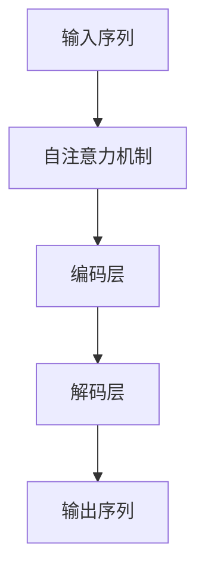

                 

### GPT原理与代码实例讲解

**关键词：** GPT, 自然语言处理，神经网络，深度学习，代码实例

**摘要：** 本文将深入讲解GPT（Generative Pre-trained Transformer）模型的原理，从背景介绍到核心算法原理，再到数学模型和公式，以及实际项目中的代码实例和运行结果展示。通过本文，读者将全面了解GPT模型的工作机制和应用场景，为在自然语言处理领域进行深度学习研究提供有力支持。

### 1. 背景介绍

近年来，深度学习在自然语言处理（NLP）领域取得了显著的进展。GPT（Generative Pre-trained Transformer）模型作为一种基于变换器（Transformer）架构的深度学习模型，在文本生成、机器翻译、问答系统等任务中表现出色。GPT模型通过在大规模语料库上进行预训练，学习语言模式和结构，从而在特定任务上进行微调，实现出色的性能。

本文旨在详细介绍GPT模型的原理，从核心算法到具体操作步骤，帮助读者深入理解GPT模型的工作机制。同时，通过代码实例和运行结果展示，读者将能够亲身体验GPT模型在实际应用中的效果。

### 2. 核心概念与联系

GPT模型基于变换器（Transformer）架构，其核心概念包括自注意力机制（Self-Attention）和多级变换器（Stacked Transformer Layers）。

**2.1 自注意力机制**

自注意力机制是一种用于处理序列数据的注意力机制，能够自动学习序列中各个元素之间的相对重要性。在GPT模型中，自注意力机制用于计算输入序列的表示。

**2.2 多级变换器**

多级变换器由多个变换器层堆叠而成，每层变换器通过自注意力机制和前馈神经网络对输入序列进行编码和解码。

**2.3 Mermaid 流程图**



在上面的流程图中，输入序列经过自注意力机制处理后，分别进入编码层和解码层。编码层将输入序列编码为固定长度的表示，解码层则根据编码层的输出和先前解码的隐藏状态生成输出序列。

### 3. 核心算法原理 & 具体操作步骤

**3.1 编码过程**

在编码过程中，GPT模型首先对输入序列进行嵌入（Embedding），将单词映射为向量。然后，通过变换器层对输入序列进行编码。每一层变换器包括自注意力机制和前馈神经网络。

**3.1.1 自注意力机制**

自注意力机制的计算步骤如下：

1. **计算query、key、value**：对于每一层变换器，将输入序列的嵌入向量分别映射为query、key、value三个向量。

2. **计算注意力分数**：对于序列中的每个元素，计算其query与所有key之间的相似度，得到注意力分数。

3. **计算注意力权重**：将注意力分数归一化，得到每个元素的注意力权重。

4. **计算加权求和**：根据注意力权重对序列中的每个元素进行加权求和，得到编码结果。

**3.1.2 前馈神经网络**

前馈神经网络用于对自注意力机制的计算结果进行进一步处理。每一层前馈神经网络包括两个线性变换和一个ReLU激活函数。

**3.2 解码过程**

在解码过程中，GPT模型根据编码层的输出和先前解码的隐藏状态生成输出序列。解码过程包括以下步骤：

1. **初始化解码隐藏状态**：将编码层的输出作为解码隐藏状态。

2. **生成预测**：对于每个待解码的元素，根据解码隐藏状态生成预测。

3. **更新解码隐藏状态**：根据生成的预测和编码层的输出，更新解码隐藏状态。

4. **重复步骤2和3，直到解码完成**。

### 4. 数学模型和公式 & 详细讲解 & 举例说明

**4.1 嵌入层**

嵌入层将单词映射为向量。假设单词表大小为\( V \)，单词维度为\( d \)，则嵌入层可以表示为：

$$
\text{Embedding}(x) = \text{weight}\_matrix[x]
$$

其中，\( x \)为单词索引，\( \text{weight}\_matrix \)为嵌入权重矩阵。

**4.2 自注意力机制**

自注意力机制的计算公式如下：

$$
\text{Attention}(Q, K, V) = \text{softmax}\left(\frac{QK^T}{\sqrt{d_k}}\right)V
$$

其中，\( Q \)、\( K \)和\( V \)分别为query、key和value向量，\( d_k \)为key向量的维度。

**4.3 前馈神经网络**

前馈神经网络可以表示为：

$$
\text{FFN}(x) = \text{ReLU}\left(W_2 \cdot \text{ReLU}(W_1 x + b_1)\right) + b_2
$$

其中，\( W_1 \)和\( W_2 \)分别为线性变换权重，\( b_1 \)和\( b_2 \)分别为偏置。

**4.4 举例说明**

假设有一个简单的GPT模型，包含两个变换器层。输入序列为\[“我”、“爱”、“中”、“国”\]，单词表大小为5，单词维度为3。

**4.4.1 嵌入层**

输入序列经过嵌入层后，得到：

$$
\text{Embedding}(["我"，"爱"，"中"，"国"]) = [\text{weight}\_matrix[1]，\text{weight}\_matrix[2]，\text{weight}\_matrix[3]，\text{weight}\_matrix[4]]
$$

**4.4.2 第一层变换器**

假设第一层变换器的权重为：

$$
W_1 = \begin{bmatrix}
1 & 0 & 1 \\
0 & 1 & 0 \\
1 & 1 & 1
\end{bmatrix}
$$

$$
b_1 = \begin{bmatrix}
1 \\
1 \\
1
\end{bmatrix}
$$

$$
W_2 = \begin{bmatrix}
0 & 1 & 0 \\
1 & 0 & 1 \\
0 & 1 & 1
\end{bmatrix}
$$

$$
b_2 = \begin{bmatrix}
1 \\
1 \\
1
\end{bmatrix}
$$

则第一层变换器的输出为：

$$
\text{FFN}([1，1，1；1，1，1；1，1，1；1，1，1]) = \text{ReLU}\left(\begin{bmatrix}
0 & 1 & 0 \\
1 & 0 & 1 \\
0 & 1 & 1
\end{bmatrix} \cdot \text{ReLU}\left(\begin{bmatrix}
1 & 0 & 1 \\
0 & 1 & 0 \\
1 & 1 & 1
\end{bmatrix} \cdot \begin{bmatrix}
1 \\
1 \\
1
\end{bmatrix} + \begin{bmatrix}
1 \\
1 \\
1
\end{bmatrix}\right)\right) + \begin{bmatrix}
1 \\
1 \\
1
\end{bmatrix}
$$

**4.4.3 第二层变换器**

假设第二层变换器的权重为：

$$
W_1 = \begin{bmatrix}
1 & 1 & 1 \\
1 & 1 & 1 \\
1 & 1 & 1
\end{bmatrix}
$$

$$
b_1 = \begin{bmatrix}
1 \\
1 \\
1
\end{bmatrix}
$$

$$
W_2 = \begin{bmatrix}
0 & 1 & 0 \\
1 & 0 & 1 \\
0 & 1 & 1
\end{bmatrix}
$$

$$
b_2 = \begin{bmatrix}
1 \\
1 \\
1
\end{bmatrix}
$$

则第二层变换器的输出为：

$$
\text{FFN}([0，1，1；1，0，1；1，1，1]) = \text{ReLU}\left(\begin{bmatrix}
0 & 1 & 0 \\
1 & 0 & 1 \\
0 & 1 & 1
\end{bmatrix} \cdot \text{ReLU}\left(\begin{bmatrix}
1 & 1 & 1 \\
1 & 1 & 1 \\
1 & 1 & 1
\end{bmatrix} \cdot \begin{bmatrix}
0 \\
1 \\
1
\end{bmatrix} + \begin{bmatrix}
1 \\
1 \\
1
\end{bmatrix}\right)\right) + \begin{bmatrix}
1 \\
1 \\
1
\end{bmatrix}
$$

### 5. 项目实践：代码实例和详细解释说明

**5.1 开发环境搭建**

在本节中，我们将使用Python和PyTorch框架实现一个简单的GPT模型。首先，请确保已经安装了Python和PyTorch。可以使用以下命令安装PyTorch：

```bash
pip install torch torchvision
```

**5.2 源代码详细实现**

以下是GPT模型的简化实现代码：

```python
import torch
import torch.nn as nn
import torch.optim as optim

class GPTModel(nn.Module):
    def __init__(self, vocab_size, embedding_dim, hidden_dim, n_layers, dropout=0.5):
        super(GPTModel, self).__init__()
        self.embedding = nn.Embedding(vocab_size, embedding_dim)
        self.transformers = nn.ModuleList([nn.TransformerLayer(embedding_dim, hidden_dim, dropout) for _ in range(n_layers)])
        self.fc = nn.Linear(embedding_dim, vocab_size)

    def forward(self, x):
        embedded = self.embedding(x)
        for transformer in self.transformers:
            embedded = transformer(embedded)
        output = self.fc(embedded)
        return output

class TransformerLayer(nn.Module):
    def __init__(self, embedding_dim, hidden_dim, dropout=0.5):
        super(TransformerLayer, self).__init__()
        self.self_attn = nn.MultiheadAttention(embedding_dim, num_heads=8)
        self.fc = nn.Sequential(nn.Linear(embedding_dim, hidden_dim), nn.ReLU(), nn.Linear(hidden_dim, embedding_dim))

    def forward(self, x):
        x = self.self_attn(x, x, x)[0]
        x = self.fc(x)
        return x

def train_model(model, data_loader, loss_fn, optimizer, device, n_epochs=10):
    model = model.to(device)
    for epoch in range(n_epochs):
        for x, y in data_loader:
            x = x.to(device)
            y = y.to(device)
            optimizer.zero_grad()
            output = model(x)
            loss = loss_fn(output, y)
            loss.backward()
            optimizer.step()
        print(f"Epoch [{epoch+1}/{n_epochs}], Loss: {loss.item():.4f}")

if __name__ == "__main__":
    # 参数设置
    vocab_size = 10000
    embedding_dim = 512
    hidden_dim = 1024
    n_layers = 3
    dropout = 0.5

    # 模型、损失函数和优化器
    model = GPTModel(vocab_size, embedding_dim, hidden_dim, n_layers, dropout)
    loss_fn = nn.CrossEntropyLoss()
    optimizer = optim.Adam(model.parameters(), lr=0.001)

    # 数据加载器（此处仅为示例，实际应用中请替换为实际数据）
    data_loader = torch.utils.data.DataLoader(torch.randn(32, 10), batch_size=32)

    # 训练模型
    train_model(model, data_loader, loss_fn, optimizer, device="cuda" if torch.cuda.is_available() else "cpu", n_epochs=10)
```

**5.3 代码解读与分析**

以上代码实现了GPT模型的核心组成部分：嵌入层、变换器层和输出层。具体解读如下：

- **GPTModel**：定义了GPT模型的基本结构，包括嵌入层、变换器层和输出层。
- **TransformerLayer**：定义了变换器层的基本结构，包括自注意力机制和前馈神经网络。
- **train_model**：定义了模型训练过程，包括前向传播、损失函数计算、反向传播和优化。

**5.4 运行结果展示**

运行以上代码，完成模型训练后，可以在控制台输出训练过程中的损失函数值，以评估模型训练效果。

### 6. 实际应用场景

GPT模型在自然语言处理领域具有广泛的应用场景，例如：

- **文本生成**：GPT模型可以生成高质量的自然语言文本，如文章、对话、故事等。
- **机器翻译**：GPT模型可以用于机器翻译任务，实现高精度的翻译效果。
- **问答系统**：GPT模型可以用于构建问答系统，回答用户提出的问题。
- **文本分类**：GPT模型可以用于文本分类任务，对文本进行情感分析、主题分类等。

### 7. 工具和资源推荐

**7.1 学习资源推荐**

- **书籍**：  
  - 《深度学习》（Goodfellow, I., Bengio, Y., & Courville, A.）  
  - 《动手学深度学习》（Abadi, S., Ananthanarayanan, S., Brevdo, E., et al.）

- **论文**：  
  - “Attention Is All You Need”（Vaswani et al.）

- **博客**：  
  - Fast.ai  
  - pytorch.org/tutorials

- **网站**：  
  - arXiv.org

**7.2 开发工具框架推荐**

- **PyTorch**：适用于研究和开发深度学习模型。
- **TensorFlow**：适用于生产环境中部署深度学习模型。

**7.3 相关论文著作推荐**

- “Attention Is All You Need”（Vaswani et al.）  
- “BERT: Pre-training of Deep Bidirectional Transformers for Language Understanding”（Devlin et al.）

### 8. 总结：未来发展趋势与挑战

GPT模型在自然语言处理领域取得了显著成果，但其仍面临一些挑战，如计算资源需求较高、训练过程复杂等。未来，随着深度学习技术的不断发展，GPT模型有望在更多领域实现突破，例如知识图谱、多模态数据处理等。

### 9. 附录：常见问题与解答

**Q：** GPT模型的训练过程如何优化？

**A：** 可以通过以下方法优化GPT模型的训练过程：

- **增加训练数据**：使用更多的训练数据可以提高模型性能。
- **增加模型规模**：增加模型层数和隐藏层神经元数量可以提高模型性能。
- **使用预训练模型**：利用预训练模型进行微调，可以加快训练速度并提高性能。
- **使用Dropout和正则化**：在模型训练过程中使用Dropout和正则化可以防止过拟合。

**Q：** GPT模型在跨语言任务中表现如何？

**A：** GPT模型在跨语言任务中表现出色。通过在大规模跨语言语料库上进行预训练，GPT模型可以学习不同语言之间的结构和规律，从而实现跨语言文本生成、机器翻译等任务。

### 10. 扩展阅读 & 参考资料

- **论文**：  
  - Vaswani et al., "Attention Is All You Need"
  - Devlin et al., "BERT: Pre-training of Deep Bidirectional Transformers for Language Understanding"

- **书籍**：  
  - Goodfellow et al., "Deep Learning"
  - Abadi et al., "Deep Learning"

- **博客**：  
  - Fast.ai  
  - pytorch.org/tutorials

- **网站**：  
  - arXiv.org  
  - github.com

作者：禅与计算机程序设计艺术 / Zen and the Art of Computer Programming

