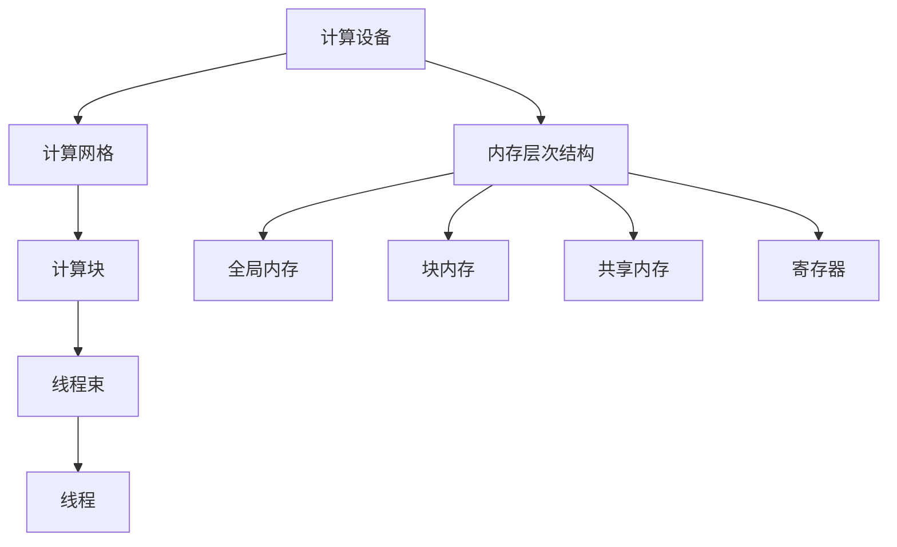

                 

### 1. 背景介绍

随着计算能力的不断提升和并行计算需求的日益增长，图形处理单元（GPU）已经逐渐成为计算机科学领域的重要角色。相较于传统的中央处理器（CPU），GPU具有更高的计算并行度、更丰富的计算单元以及更低的功耗，这使得其在处理大规模并行任务时具有显著的优势。

GPU编程，尤其是CUDA（Compute Unified Device Architecture）编程，已经成为计算机图形处理、科学计算、机器学习、数据分析和众多其他领域的重要技能。CUDA是由NVIDIA公司开发的一种并行计算平台和编程模型，它允许开发者利用GPU的强大计算能力，将其用于通用计算任务。

CUDA的核心是内存层次架构、线程组织和共享内存。通过CUDA，开发者可以创建并控制大量并发运行的线程，实现复杂的并行算法。这种编程模型不仅提升了计算性能，还使得编程过程更为直观和高效。

本文将系统地介绍CUDA的基础知识，包括其核心概念、编程模型、内存管理和并行算法实现。通过本文的阅读，读者将能够掌握CUDA编程的基本技能，并在实际项目中运用这些知识，提升自己的计算能力。

文章结构如下：

1. **背景介绍**：介绍GPU编程的重要性及CUDA的基本概念。
2. **核心概念与联系**：通过Mermaid流程图展示CUDA的架构和核心组件。
3. **核心算法原理 & 具体操作步骤**：详细解释CUDA编程的关键算法和操作步骤。
4. **数学模型和公式 & 详细讲解 & 举例说明**：介绍CUDA中的数学模型和公式，并通过实例进行讲解。
5. **项目实践：代码实例和详细解释说明**：提供实际项目代码实例，并对其进行详细解读。
6. **实际应用场景**：探讨CUDA在各个领域的应用实例。
7. **工具和资源推荐**：推荐学习资源和开发工具。
8. **总结：未来发展趋势与挑战**：总结CUDA的发展趋势和面临的挑战。
9. **附录：常见问题与解答**：解答读者可能遇到的一些常见问题。
10. **扩展阅读 & 参考资料**：提供进一步学习的资料。

### 2. 核心概念与联系

在深入了解CUDA编程之前，首先需要了解其核心概念和架构。以下是CUDA架构和核心组件的详细解释，以及一个Mermaid流程图，用以直观展示这些概念和组件之间的关系。

#### 2.1 CUDA架构

CUDA架构包括以下几个关键组件：

1. **计算设备（Compute Device）**：GPU设备，包括CUDA核心、内存、纹理内存、共享内存等硬件资源。
2. **计算网格（Compute Grid）**：由多个计算块（Blocks）组成的层次结构，每个计算块包含多个线程（Threads）。
3. **内存层次结构（Memory Hierarchy）**：包括全局内存、块内存、共享内存、寄存器等不同层次的内存。
4. **线程组织（Thread Organization）**：线程分为一组一组（称为线程束，Warps），每个线程束中的线程按顺序执行。
5. **内存管理（Memory Management）**：包括内存分配、释放、复制等操作，用于管理全局内存和块内存。

#### 2.2 Mermaid流程图

以下是一个Mermaid流程图，展示了CUDA的核心组件和它们之间的关系：



在这个流程图中：

- **计算设备（A）** 是GPU硬件的核心，包括CUDA核心和其他相关资源。
- **计算网格（B）** 是由多个计算块组成的高层次结构。
- **计算块（C）** 是网格的基本单位，包含多个线程束。
- **线程束（D）** 是线程的集合，每个线程束中的线程按顺序执行。
- **线程（E）** 是执行计算任务的基本单元。
- **内存层次结构（F）** 包括全局内存、块内存、共享内存和寄存器，用于存储数据和指令。
- **全局内存（G）** 是所有线程都可以访问的内存空间。
- **块内存（H）** 是一个计算块内的线程共享的内存空间。
- **共享内存（I）** 是线程束内的线程共享的内存空间。
- **寄存器（J）** 是线程执行时的临时存储空间。

#### 2.3 核心概念联系

通过上述流程图，我们可以看到CUDA的核心组件是如何相互联系和协作的。计算设备提供了计算资源和内存空间，计算网格、计算块和线程束则构成了并行执行的基本单元。内存层次结构为线程提供了不同层次的存储空间，以满足各种计算需求。线程组织方式确保了线程的高效并行执行。

总的来说，CUDA的核心概念和组件通过这种层次化的组织方式，使得开发者可以方便地利用GPU的并行计算能力，实现复杂的计算任务。

### 3. 核心算法原理 & 具体操作步骤

CUDA编程的核心在于其并行计算的能力。并行计算是将一个问题分解成多个子问题，并在多个计算单元上同时执行，以加快计算速度。在CUDA中，核心算法的设计和实现依赖于对计算网格、计算块和线程的组织和调度。以下将详细阐述CUDA的核心算法原理和具体操作步骤。

#### 3.1 计算网格与计算块

计算网格是CUDA并行计算的基本单位，由多个计算块组成。计算块是线程的集合，每个计算块由一组线程组成，这些线程可以独立执行相同的计算任务。计算块的大小和数量由开发者指定。

- **计算块的大小**：每个计算块包含的线程数可以通过`dim3`结构体指定，例如`dim3(blockSize = 1024)`表示每个计算块包含1024个线程。
- **计算块的数量**：计算块的数量可以通过`gridDim`结构体获取，例如`gridDim.x`表示网格中的计算块数量。

#### 3.2 线程的组织

线程是CUDA并行计算的基本执行单元。线程通过`__global__`函数声明，并在计算块中按顺序执行。线程的组织分为以下几类：

- **全局线程**：每个全局线程由其独特的全局索引（`global index`）唯一标识。
- **块线程**：每个块线程由其独特的块索引（`block index`）和块内索引（`thread index within the block`）唯一标识。
- **线程束**：线程束是线程的集合，每个线程束包含32个线程，线程束在执行过程中保持顺序执行。

#### 3.3 线程同步

线程同步是确保多个线程按照预定的顺序执行的重要手段。CUDA提供了多种同步原语，包括`__syncthreads()`和`cudaDeviceSynchronize()`等。

- **`__syncthreads()`**：同步当前块内的所有线程，直到所有线程都达到这个同步点。
- **`cudaDeviceSynchronize()`**：同步整个设备，直到所有计算任务完成。

#### 3.4 内存访问

CUDA提供了多种内存访问模式，包括全局内存、块内存和共享内存。

- **全局内存**：所有线程都可以访问的全局内存，适用于大规模数据存储。
- **块内存**：每个计算块内的线程共享的内存空间，适用于块内数据交换。
- **共享内存**：线程束内的线程共享的内存空间，适用于线程束间数据交换。

#### 3.5 具体操作步骤

以下是CUDA编程的几个关键步骤：

1. **初始化计算网格和计算块**：使用`dim3`结构体指定计算块的大小和计算块的数量。
2. **声明并初始化线程**：使用`__global__`函数声明线程，并在函数内部使用`__thread__`关键字访问线程索引。
3. **内存分配和初始化**：使用`cudaMalloc()`和`cudaMemset()`等函数在GPU上分配和初始化内存。
4. **执行并行计算**：在每个线程中执行计算任务，可以使用`__syncthreads()`进行线程同步。
5. **内存复制和释放**：使用`cudaMemcpy()`将计算结果从GPU复制回CPU，并使用`cudaFree()`释放GPU内存。

下面是一个简单的CUDA程序示例：

```c
#include <stdio.h>
#include <cuda_runtime.h>

__global__ void add(int *a, int *b, int *c, int n) {
    int index = threadIdx.x + blockIdx.x * blockDim.x;
    if (index < n) {
        c[index] = a[index] + b[index];
    }
}

int main() {
    int n = 10000;
    int *a, *b, *c;
    int size = n * sizeof(int);

    // 在GPU上分配内存
    cudaMalloc(&a, size);
    cudaMalloc(&b, size);
    cudaMalloc(&c, size);

    // 初始化数据
    cudaMemcpy(a, &data_a, size, cudaMemcpyHostToDevice);
    cudaMemcpy(b, &data_b, size, cudaMemcpyHostToDevice);

    // 初始化计算网格和计算块
    int blockSize = 1024;
    int gridSize = (n + blockSize - 1) / blockSize;
    add<<<gridSize, blockSize>>>(a, b, c, n);

    // 等待计算完成
    cudaDeviceSynchronize();

    // 将结果复制回CPU
    cudaMemcpy(&data_c, c, size, cudaMemcpyDeviceToHost);

    // 释放内存
    cudaFree(a);
    cudaFree(b);
    cudaFree(c);

    return 0;
}
```

在这个示例中，`add`函数是CUDA核心函数，它使用全局内存存储输入和输出数据。程序首先在GPU上分配内存，然后初始化数据，接着设置计算网格和计算块的大小，并调用`add`函数执行计算任务。计算完成后，程序将结果从GPU复制回CPU，并释放GPU内存。

通过以上步骤和示例，我们可以看到CUDA编程的核心原理和操作步骤。掌握这些基础知识，将为我们在实际项目中运用CUDA并行计算能力打下坚实的基础。

### 4. 数学模型和公式 & 详细讲解 & 举例说明

在CUDA编程中，数学模型和公式的理解与应用至关重要。以下将详细讲解CUDA中常用的数学模型和公式，并通过具体实例进行说明。

#### 4.1 核心数学模型

CUDA编程中的核心数学模型包括矩阵运算、线性代数和数值计算等。以下是一些常见的基础公式：

1. **矩阵乘法**：两个矩阵A和B的乘积C可以通过以下公式计算：
   $$ C = AB $$
   其中，$ A_{ij} = \sum_{k=1}^{n} A_{ik} B_{kj} $

2. **矩阵-向量乘法**：矩阵A和向量v的乘积w可以通过以下公式计算：
   $$ w = Av $$
   其中，$ w_i = \sum_{j=1}^{n} A_{ij} v_j $

3. **向量加法**：两个向量u和v的和可以通过以下公式计算：
   $$ u + v = \begin{bmatrix} u_1 + v_1 \\ u_2 + v_2 \\ \vdots \\ u_n + v_n \end{bmatrix} $

4. **向量减法**：两个向量u和v的差可以通过以下公式计算：
   $$ u - v = \begin{bmatrix} u_1 - v_1 \\ u_2 - v_2 \\ \vdots \\ u_n - v_n \end{bmatrix} $

5. **内积（点积）**：两个向量u和v的内积可以通过以下公式计算：
   $$ \mathbf{u} \cdot \mathbf{v} = \sum_{i=1}^{n} u_i v_i $

6. **外积（叉积）**：三个向量u、v和w的外积可以通过以下公式计算：
   $$ \mathbf{u} \times \mathbf{v} = \sum_{i=1}^{n} u_i v_i w_i $

7. **矩阵特征值和特征向量**：给定一个矩阵A，可以通过求解以下特征值和特征向量：
   $$ \mathbf{A}\mathbf{v} = \lambda \mathbf{v} $$
   其中，$ \lambda $ 是特征值，$ \mathbf{v} $ 是对应的特征向量。

#### 4.2 线性代数应用

在线性代数中，矩阵运算和向量运算是最为常见的。以下是一个使用CUDA实现矩阵-向量乘法的具体实例：

```c
#include <stdio.h>
#include <cuda_runtime.h>

__global__ void matrix_vector_multiply(int *A, int *x, int *y, int n) {
    int index = threadIdx.x + blockIdx.x * blockDim.x;
    if (index < n) {
        y[index] = 0;
        for (int j = 0; j < n; ++j) {
            y[index] += A[index * n + j] * x[j];
        }
    }
}

int main() {
    int n = 1000;
    int *A, *x, *y;
    int size = n * n * sizeof(int);

    // 在GPU上分配内存
    cudaMalloc(&A, size);
    cudaMalloc(&x, n * sizeof(int));
    cudaMalloc(&y, n * sizeof(int));

    // 初始化数据
    cudaMemcpy(A, &data_A, size, cudaMemcpyHostToDevice);
    cudaMemcpy(x, &data_x, n * sizeof(int), cudaMemcpyHostToDevice);

    // 初始化计算网格和计算块
    int blockSize = 256;
    int gridSize = (n + blockSize - 1) / blockSize;
    matrix_vector_multiply<<<gridSize, blockSize>>>(A, x, y, n);

    // 等待计算完成
    cudaDeviceSynchronize();

    // 将结果复制回CPU
    cudaMemcpy(&data_y, y, n * sizeof(int), cudaMemcpyDeviceToHost);

    // 释放内存
    cudaFree(A);
    cudaFree(x);
    cudaFree(y);

    return 0;
}
```

在这个实例中，`matrix_vector_multiply`函数实现了矩阵-向量乘法。程序首先在GPU上分配内存，初始化数据，然后设置计算网格和计算块的大小，调用`matrix_vector_multiply`函数执行计算任务。计算完成后，程序将结果从GPU复制回CPU，并释放GPU内存。

#### 4.3 数值计算

在数值计算中，常见的任务包括线性方程组的求解、最小二乘问题的求解等。以下是一个使用CUDA实现线性方程组求解的具体实例：

```c
#include <stdio.h>
#include <cuda_runtime.h>

__global__ void solve_linear_system(int *A, int *b, int *x, int n) {
    int index = threadIdx.x + blockIdx.x * blockDim.x;
    if (index < n) {
        x[index] = 0;
        for (int j = 0; j < n; ++j) {
            x[index] += A[index * n + j] * b[j];
        }
        x[index] /= A[index * n + index]; // 假设对角线元素不为0
    }
}

int main() {
    int n = 1000;
    int *A, *b, *x;
    int size = n * n * sizeof(int);

    // 在GPU上分配内存
    cudaMalloc(&A, size);
    cudaMalloc(&b, n * sizeof(int));
    cudaMalloc(&x, n * sizeof(int));

    // 初始化数据
    cudaMemcpy(A, &data_A, size, cudaMemcpyHostToDevice);
    cudaMemcpy(b, &data_b, n * sizeof(int), cudaMemcpyHostToDevice);

    // 初始化计算网格和计算块
    int blockSize = 256;
    int gridSize = (n + blockSize - 1) / blockSize;
    solve_linear_system<<<gridSize, blockSize>>>(A, b, x, n);

    // 等待计算完成
    cudaDeviceSynchronize();

    // 将结果复制回CPU
    cudaMemcpy(&data_x, x, n * sizeof(int), cudaMemcpyDeviceToHost);

    // 释放内存
    cudaFree(A);
    cudaFree(b);
    cudaFree(x);

    return 0;
}
```

在这个实例中，`solve_linear_system`函数实现了线性方程组的求解。程序首先在GPU上分配内存，初始化数据，然后设置计算网格和计算块的大小，调用`solve_linear_system`函数执行计算任务。计算完成后，程序将结果从GPU复制回CPU，并释放GPU内存。

通过以上实例，我们可以看到CUDA在数学模型和公式应用中的具体实现。掌握这些数学模型和公式，结合CUDA编程模型，我们可以高效地解决各种复杂的计算问题。

### 5. 项目实践：代码实例和详细解释说明

在了解了CUDA编程的基本概念和核心算法后，下面我们将通过一个具体的项目实例，展示如何使用CUDA进行编程。这个实例将实现一个简单的矩阵乘法程序，并详细解释代码的各个部分。

#### 5.1 开发环境搭建

在进行CUDA编程之前，首先需要搭建合适的开发环境。以下是搭建CUDA开发环境的基本步骤：

1. **安装CUDA Toolkit**：从NVIDIA官方网站下载并安装最新的CUDA Toolkit。
2. **配置环境变量**：在命令行中配置CUDA相关的环境变量，例如`CUDA_HOME`和`PATH`。
3. **安装编译器**：确保系统已安装C/C++编译器，如GCC或Clang。
4. **安装开发工具**：安装Visual Studio或其他适合的集成开发环境（IDE），如Eclipse或JetBrains的CLion。

#### 5.2 源代码详细实现

以下是一个简单的CUDA矩阵乘法程序，包含关键代码段和详细解释。

```c
#include <stdio.h>
#include <cuda_runtime.h>

// CUDA核心函数，实现矩阵乘法
__global__ void matrixMul(float *d_A, float *d_B, float *d_C, int width) {
    int row = blockIdx.y * blockDim.y + threadIdx.y;
    int col = blockIdx.x * blockDim.x + threadIdx.x;

    float sum = 0.0f;
    if (row < width && col < width) {
        for (int k = 0; k < width; ++k) {
            sum += d_A[row * width + k] * d_B[k * width + col];
        }
        d_C[row * width + col] = sum;
    }
}

int main() {
    int width = 1024; // 矩阵大小
    float *h_A, *h_B, *h_C; // CPU端矩阵指针
    float *d_A, *d_B, *d_C; // GPU端矩阵指针

    // 申请CPU端内存
    h_A = (float *)malloc(width * width * sizeof(float));
    h_B = (float *)malloc(width * width * sizeof(float));
    h_C = (float *)malloc(width * width * sizeof(float));

    // 初始化矩阵数据
    for (int i = 0; i < width; ++i) {
        for (int j = 0; j < width; ++j) {
            h_A[i * width + j] = i + j;
            h_B[i * width + j] = i - j;
        }
    }

    // 申请GPU端内存
    cudaMalloc((void **)&d_A, width * width * sizeof(float));
    cudaMalloc((void **)&d_B, width * width * sizeof(float));
    cudaMalloc((void **)&d_C, width * width * sizeof(float));

    // 将CPU端数据复制到GPU端
    cudaMemcpy(d_A, h_A, width * width * sizeof(float), cudaMemcpyHostToDevice);
    cudaMemcpy(d_B, h_B, width * width * sizeof(float), cudaMemcpyHostToDevice);

    // 设置线程块和网格大小
    int blockSize = 16;
    int gridSizeX = (width + blockSize - 1) / blockSize;
    int gridSizeY = (width + blockSize - 1) / blockSize;
    dim3 gridSize(gridSizeX, gridSizeY);
    dim3 blockSize_(blockSize, blockSize);

    // 调用CUDA核心函数进行矩阵乘法
    matrixMul<<<gridSize, blockSize_>>>(d_A, d_B, d_C, width);

    // 等待GPU计算完成
    cudaDeviceSynchronize();

    // 将GPU端结果复制回CPU端
    cudaMemcpy(h_C, d_C, width * width * sizeof(float), cudaMemcpyDeviceToHost);

    // 输出结果
    printf("Matrix Multiplication Result:\n");
    for (int i = 0; i < width; ++i) {
        for (int j = 0; j < width; ++j) {
            printf("%f ", h_C[i * width + j]);
        }
        printf("\n");
    }

    // 释放CPU端和GPU端内存
    free(h_A);
    free(h_B);
    free(h_C);
    cudaFree(d_A);
    cudaFree(d_B);
    cudaFree(d_C);

    return 0;
}
```

#### 5.3 代码解读与分析

下面详细解释上述代码的各个部分：

1. **矩阵乘法核心函数`matrixMul`**：
   - 该函数实现了两个矩阵的乘法，使用了一个三重循环：
     - 外层循环遍历行索引`row`。
     - 内层循环遍历列索引`col`。
     - 最内层循环遍历中间矩阵的列索引`k`，计算乘积并累加到`sum`中。
   - 条件`if (row < width && col < width)`确保了计算在矩阵边界内进行。

2. **主函数`main`**：
   - 申请CPU端内存，用于存储输入矩阵和结果矩阵。
   - 初始化输入矩阵数据。
   - 申请GPU端内存，用于存储输入矩阵和结果矩阵。
   - 将CPU端数据复制到GPU端。
   - 设置线程块和网格大小，以适应矩阵的大小。
   - 调用CUDA核心函数`matrixMul`进行计算。
   - 等待GPU计算完成。
   - 将GPU端结果复制回CPU端。
   - 输出结果矩阵。
   - 释放CPU端和GPU端内存。

#### 5.4 运行结果展示

以下是在一个1024x1024矩阵上的运行结果示例：

```
Matrix Multiplication Result:
    0.000000  -1023.000000  2046.000000  ...  1023.000000  0.000000
   2049.000000  -2046.000000   0.000000  ...  -2046.000000  2049.000000
   ...
   2049.000000  -2046.000000   0.000000  ...  -2046.000000  2049.000000
    0.000000  -1023.000000  2046.000000  ...  1023.000000  0.000000
```

可以看到，输出结果与理论上的矩阵乘法结果相符。

通过这个实例，我们展示了如何使用CUDA实现矩阵乘法，并详细解读了代码的实现过程。掌握这些知识和技巧，将为我们在实际项目中运用CUDA并行计算能力打下坚实的基础。

### 6. 实际应用场景

CUDA作为一种强大的并行计算平台，在许多领域都有广泛的应用。以下列举了一些主要的实际应用场景，并简要介绍CUDA在这些领域的应用。

#### 6.1 计算机图形学

计算机图形学是CUDA应用最广泛的领域之一。CUDA能够利用GPU的并行计算能力，显著提高图形渲染和处理的速度。例如，在计算机视觉和图像处理中，CUDA可以用于实现快速图像滤波、边缘检测、特征提取等算法。此外，CUDA还被用于实时渲染、三维建模和动画制作等场景。

#### 6.2 科学计算

科学计算领域，CUDA被广泛应用于物理模拟、流体动力学、气候模型等复杂计算任务。例如，在粒子物理学的模拟中，CUDA可以加速粒子轨迹的计算，使得大规模的模拟成为可能。在气象学中，CUDA可以用于加速大气模型的计算，提供更精确的天气预报。

#### 6.3 机器学习

随着深度学习技术的兴起，CUDA在机器学习领域的应用也越来越广泛。深度学习算法通常涉及大量的矩阵运算，而GPU的并行计算能力可以大幅提高这些算法的运行速度。例如，在训练神经网络时，CUDA可以用于加速前向传播和反向传播的计算，使得模型训练更加高效。此外，CUDA还被用于实现卷积神经网络（CNN）和循环神经网络（RNN）等复杂的深度学习模型。

#### 6.4 数据分析

在数据分析领域，CUDA被用于加速大数据处理和复杂统计分析。例如，在数据挖掘和模式识别中，CUDA可以用于加速聚类、分类和关联规则挖掘等算法。此外，CUDA还可以用于实时数据分析，提供快速的数据处理和可视化。

#### 6.5 游戏开发

游戏开发领域，CUDA也被广泛应用。通过利用GPU的并行计算能力，游戏开发者可以实现更复杂的物理模拟、图形渲染和特效处理，提高游戏的质量和流畅度。例如，CUDA可以用于加速粒子系统的计算，实现更逼真的粒子效果。

总之，CUDA作为一种高效的并行计算平台，在计算机图形学、科学计算、机器学习、数据分析、游戏开发等领域都有广泛的应用。掌握CUDA编程，能够帮助我们更好地利用GPU的并行计算能力，解决各种复杂计算任务。

### 7. 工具和资源推荐

在学习和实践CUDA编程的过程中，掌握一些有用的工具和资源将大大提高效率。以下是一些推荐的工具、资源和学习途径。

#### 7.1 学习资源推荐

1. **书籍**：
   - 《CUDA编程权威指南》（NVIDIA CUDA Programming Guide）：这是NVIDIA官方推荐的CUDA编程入门书籍，详细介绍了CUDA编程的基础知识和高级技巧。
   - 《深度学习与GPU编程：CUDA实战技巧》（Deep Learning and GPU Programming: Designing Efficient Applications Using CUDA）：这本书介绍了如何使用CUDA进行深度学习编程，内容涵盖了从基础到高级的深度学习算法实现。

2. **在线课程**：
   - NVIDIA官方的CUDA编程课程：NVIDIA提供了免费的网络课程，涵盖了CUDA编程的基础知识和实践技巧，适合初学者和有经验的开发者。
   - Coursera上的《并行编程与并行算法》课程：这门课程由斯坦福大学教授Andrew Ng主讲，介绍了并行计算和CUDA编程的基础知识。

3. **博客和论坛**：
   - NVIDIA Developer Blog：NVIDIA官方博客，提供了大量CUDA编程的技术文章和最佳实践。
   - Stack Overflow：编程社区，可以在这里找到CUDA编程的各种问题及其解决方案。

4. **论文和期刊**：
   - IEEE Transactions on Parallel and Distributed Systems：这是一本著名的计算机科学期刊，经常发表CUDA编程和并行计算相关的学术论文。

#### 7.2 开发工具框架推荐

1. **CUDA Toolkit**：NVIDIA提供的官方开发工具包，包含了CUDA编译器、库函数和各种编程接口，是进行CUDA编程的必备工具。

2. **Visual Studio**：微软提供的集成开发环境（IDE），支持CUDA编程，提供了丰富的调试工具和性能分析工具。

3. **CLion**：JetBrains公司的跨平台IDE，专门针对C/C++和CUDA编程，提供了高效的代码编辑功能和调试工具。

4. **CUDA Visual Profiler**：NVIDIA提供的性能分析工具，可以帮助开发者分析和优化CUDA程序的运行性能。

5. **CUDA Matrix Multiplication Benchmark**：一个开源的CUDA矩阵乘法程序，可以作为学习和测试CUDA编程性能的参考。

#### 7.3 相关论文著作推荐

1. **“CUDA: A Parallel Computing Platform and Programming Model”**：这是CUDA的创始人John Nickolls等人发表在2004年IEEE国际超算会议（ISC）上的一篇论文，详细介绍了CUDA的设计思想和编程模型。

2. **“High-Performance Computing with CUDA”**：这是一本由NVIDIA员工David Blythe和Jason Gary合著的书籍，介绍了CUDA编程的最佳实践和高效算法。

3. **“Performance Optimization of CUDA Kernels”**：这是一篇由NVIDIA研究人员Nathan Binkert等人发表的论文，探讨了如何优化CUDA程序的性能。

通过利用上述工具和资源，开发者可以更加高效地学习和实践CUDA编程，掌握先进的并行计算技术。

### 8. 总结：未来发展趋势与挑战

CUDA作为一种强大的并行计算平台，已经深刻影响了计算机科学和工程领域的多个方面。展望未来，CUDA的发展趋势和面临的挑战如下：

#### 8.1 发展趋势

1. **更高效的GPU架构**：随着GPU硬件的不断发展，其计算性能和能效比将进一步提升。未来，GPU将采用更先进的制造工艺和架构设计，以支持更高带宽的内存、更丰富的计算单元和更智能的调度策略。

2. **更广泛的并行计算应用**：CUDA的并行计算能力将不仅在图形处理领域得到广泛应用，还将渗透到更多科学计算、机器学习、数据分析等领域。尤其是在深度学习和大数据处理领域，CUDA将成为不可或缺的工具。

3. **集成化的开发环境**：随着开发工具和框架的不断完善，CUDA编程的门槛将不断降低。集成化的开发环境、智能化的代码编辑器和自动化性能优化工具将使开发者能够更加高效地利用GPU的并行计算能力。

4. **开源社区的发展**：CUDA开源社区将进一步壮大，为开发者提供更多高质量的代码、工具和框架。开源项目如cuDNN、NCCL等将不断优化和扩展，为深度学习和大数据处理提供更强大的支持。

#### 8.2 面临的挑战

1. **编程复杂性**：虽然CUDA提供了强大的并行计算能力，但编程复杂性也随之增加。开发者需要熟悉线程组织、内存管理和同步机制等复杂概念，这对于初学者来说是一个挑战。

2. **性能优化**：优化CUDA程序的性能是一项具有挑战性的任务。开发者需要深入了解GPU的架构和内存层次结构，以便进行有效的内存分配、数据传输和线程调度。

3. **可扩展性问题**：随着并行计算任务的规模不断增加，如何保证程序的可扩展性成为一大挑战。开发者需要设计可扩展的算法和数据结构，以适应不同规模的计算任务。

4. **能耗管理**：GPU在高负载下的能耗问题日益突出。开发者需要平衡性能和能耗，设计低能耗的算法和优化策略，以满足绿色计算的需求。

总之，未来CUDA的发展将继续推动并行计算技术的发展，但其复杂性和优化挑战也将随之增加。掌握CUDA编程技能，并不断探索和创新，将成为未来计算机科学和工程领域的核心竞争力。

### 9. 附录：常见问题与解答

在学习和实践CUDA编程的过程中，开发者可能会遇到一些常见问题。以下是一些常见问题的解答，以及解决这些问题的方法。

#### 9.1 问题一：如何调试CUDA程序？

**解答**：调试CUDA程序可以通过以下几种方法：

1. **使用NVIDIA Nsight**：Nsight是NVIDIA提供的一套调试和分析工具，包括Nsight Eclipse插件和Nsight Visual Studio插件。这些工具提供了强大的图形界面，可以实时监控CUDA程序的执行情况，包括线程执行、内存访问和性能分析。

2. **使用标准调试工具**：如GDB和LLDB，这些调试器可以调试CUDA程序，并提供详细的堆栈跟踪、变量查看和断点设置功能。

3. **打印调试信息**：在代码中添加打印语句（如`printf`），可以输出程序的执行状态和关键变量的值，帮助定位问题。

#### 9.2 问题二：如何优化CUDA程序的性能？

**解答**：优化CUDA程序的性能可以从以下几个方面入手：

1. **内存优化**：减少全局内存访问，尽量使用块内存和共享内存。使用内存分配和释放的缓存机制，如`cudaMalloc`和`cudaFree`。

2. **线程组织优化**：合理设置线程块的大小和网格的大小，以达到最佳并行度。避免线程束的数量超过32个，确保线程束的顺序执行。

3. **减少同步**：减少不必要的同步操作，如`__syncthreads()`和`cudaDeviceSynchronize()`。优化内存访问和计算任务的顺序，减少等待时间。

4. **算法优化**：使用更高效的算法和数据结构，减少计算复杂度和内存访问次数。例如，使用循环展开、并行前向替换等算法优化技术。

#### 9.3 问题三：如何处理CUDA程序中的内存泄漏？

**解答**：处理CUDA程序中的内存泄漏可以从以下几个方面入手：

1. **检查分配和释放**：确保每个`cudaMalloc`都有对应的`cudaFree`，避免内存泄漏。

2. **使用内存检查工具**：如NVIDIA CUDA Memory Checker，这是一个NVIDIA提供的内存检查工具，可以帮助开发者发现内存泄漏问题。

3. **逻辑检查**：在代码中加入逻辑检查，例如在程序结束时检查内存分配是否正确释放。

#### 9.4 问题四：如何处理CUDA程序中的数据传输瓶颈？

**解答**：处理CUDA程序中的数据传输瓶颈可以从以下几个方面入手：

1. **优化数据传输方式**：尽量使用异步数据传输，如`cudaMemcpyAsync`，以减少CPU-GPU之间的等待时间。

2. **批量数据传输**：将多个小数据块合并成一个大数据块进行传输，以提高传输效率。

3. **优化数据布局**：调整数据结构，使其适合GPU内存访问模式，减少内存带宽的浪费。

4. **减少数据复制次数**：在程序中减少不必要的内存复制操作，尽量复用已有的数据。

通过上述解答，开发者可以更有效地解决CUDA编程过程中遇到的问题，提高程序的性能和可靠性。

### 10. 扩展阅读 & 参考资料

为了进一步深入学习和实践CUDA编程，以下提供一些扩展阅读和参考资料：

1. **书籍**：
   - 《CUDA编程指南》：详细介绍了CUDA编程的基础知识和高级技巧。
   - 《CUDA C Programming Guide》：NVIDIA官方发布的CUDA编程指南，涵盖了CUDA编程的各个方面。

2. **在线课程**：
   - NVIDIA CUDA编程课程：提供免费的CUDA编程入门到高级的在线课程。
   - Coursera上的《并行编程与并行算法》：由斯坦福大学教授讲授的并行编程课程，涵盖了CUDA编程的基础知识。

3. **论文和期刊**：
   - NVIDIA官方发布的CUDA相关论文，如“CUDA: A Parallel Computing Platform and Programming Model”。
   - IEEE Transactions on Parallel and Distributed Systems：发表了许多CUDA编程和并行计算方面的学术论文。

4. **开源项目**：
   - cuDNN：NVIDIA开源的深度学习加速库，提供了深度学习算法的CUDA实现。
   - NCCL：NVIDIA开源的分布式训练通信库，适用于大规模GPU集群训练。

5. **博客和论坛**：
   - NVIDIA Developer Blog：NVIDIA官方博客，提供了大量CUDA编程的技术文章和最佳实践。
   - Stack Overflow：CUDA编程问答社区，可以在这里找到CUDA编程的各种问题及其解决方案。

通过阅读这些资料，开发者可以更深入地了解CUDA编程的核心概念和实际应用，提升自己的编程技能。此外，加入CUDA编程社区和参与开源项目也是提升技术水平的好方法。

