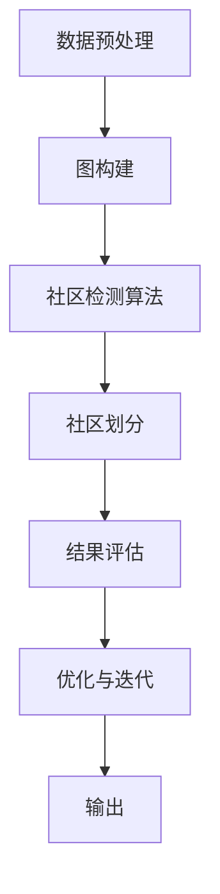

                 

### 1. 背景介绍

#### 1.1 社区检测的定义

社区检测，又称为社群发现，是图论中的一个重要课题。其核心目标是从一个复杂网络中识别出具有紧密联系的子图，这些子图被称为社区。社区检测广泛应用于社交网络分析、生物信息学、交通网络分析等多个领域。

在社交网络分析中，社区检测可以帮助我们识别出具有共同兴趣或紧密联系的用户群体，从而进行精准推荐或社交互动优化。在生物信息学中，社区检测用于识别基因相互作用网络中的功能模块，帮助我们理解生物系统的运作机制。在交通网络分析中，社区检测有助于发现道路网的瓶颈和重要节点，从而优化交通流量。

#### 1.2 社区检测的应用场景

社区检测的应用场景非常广泛，以下列举几个典型的应用场景：

1. **社交网络分析**：通过识别社交网络中的社区，我们可以更好地理解用户行为和社交模式，进而优化社交平台的用户体验。
2. **生物信息学**：在基因相互作用网络中，社区检测可以帮助我们识别出功能相关的基因模块，为基因组学研究提供重要线索。
3. **交通网络分析**：通过社区检测，我们可以发现城市交通网络中的关键节点和瓶颈，为交通管理和优化提供数据支持。
4. **金融风险评估**：在金融网络中，社区检测可以帮助我们识别出高风险的贷款群体，从而优化信贷风险管理策略。

#### 1.3 社区检测的重要性

社区检测在诸多领域都具有重要意义。首先，社区检测可以帮助我们更好地理解复杂系统的结构和功能。通过识别出网络中的社区，我们可以发现系统中的关键模块和节点，从而深入了解系统的运作机制。

其次，社区检测在实际应用中具有很高的价值。例如，在社交网络中，通过社区检测可以优化用户推荐算法，提高社交平台的活跃度和用户满意度；在生物信息学中，通过社区检测可以加速基因研究的进展，为医学和生物学提供重要支持。

总之，社区检测是一项具有广泛应用前景的技术，它不仅有助于我们更好地理解复杂系统，还为实际应用提供了有力的数据支持。因此，深入研究社区检测算法及其应用具有重要意义。

### 2. 核心概念与联系

#### 2.1 图论基本概念

在探讨社区检测算法之前，我们首先需要了解图论中的基本概念。图（Graph）是由节点（Vertex）和边（Edge）组成的数学结构。在图论中，节点通常表示实体，边表示实体之间的某种关系。

- **节点（Vertex）**：图中的每个点称为节点，节点可以是有向的也可以是无向的。在社交网络中，每个用户可以看作是一个节点。

- **边（Edge）**：连接两个节点的线段称为边。边也可以是有向的，表示两个节点之间的特定关系。例如，在社交网络中，如果用户A关注了用户B，那么从A到B的边可以表示用户A与用户B之间的关注关系。

#### 2.2 社区定义

在图论中，社区（Community）是指图中一组节点，这些节点之间的联系比它们与集合中其他节点的联系更加紧密。直观上，社区是一个“紧密连接”的子图。以下是一些社区的定义和特征：

- **特征**：
  1. **高内聚性**：社区内部节点之间的连接密集，度数较高。
  2. **低耦合性**：社区之间的连接相对稀疏，社区之间的节点度数较低。
  3. **模块化**：社区可以看作是独立的功能模块，它们共同构成了整个网络。

- **定义**：一个社区C被定义为图G的一个子图，其中C中的节点之间具有较高的内聚性和较低的耦合性。

#### 2.3 社区检测算法

社区检测算法的目标是从图中识别出满足上述定义的社区。以下是一些常用的社区检测算法：

1. **Girvan-Newman算法**：通过计算每条边的“重要性”（即移除该边后网络断开的可能性），逐步移除重要性较低的边，最终形成多个社区。
2. **Louvain算法**：基于模块度最大化原则，通过迭代调整节点间的连接，寻找最优的社区划分。
3. **标签传播算法**：将每个节点赋予一个初始标签，然后通过迭代更新节点的标签，最终形成多个社区。

#### 2.4 Mermaid 流程图

为了更好地理解社区检测算法的工作原理，我们可以使用Mermaid语言绘制一个流程图。以下是一个简单的Mermaid流程图示例，描述了社区检测的一般流程：



- **数据预处理**：对原始数据进行清洗和预处理，以确保图的准确性和有效性。
- **图构建**：构建网络图，将节点和边表示出来。
- **社区检测算法**：应用特定的算法，识别出图中的社区。
- **社区划分**：将识别出的社区进行划分，形成多个子图。
- **结果评估**：评估社区检测的效果，如模块度、聚类系数等。
- **优化与迭代**：根据评估结果，对算法进行优化，重复检测过程。
- **输出**：输出最终的结果，包括社区划分、节点标签等。

通过上述流程图，我们可以直观地了解社区检测的整个过程。接下来，我们将深入探讨社区检测算法的原理和具体操作步骤。

### 3. 核心算法原理 & 具体操作步骤

#### 3.1 Girvan-Newman算法

Girvan-Newman算法是一种基于网络结构分析的社区检测算法，其核心思想是计算每条边的“重要性”，并通过逐步移除重要性较低的边来划分社区。以下是Girvan-Newman算法的具体步骤：

##### 步骤1：计算边的重要性

在图G中，对于每一条边(u, v)，计算其“重要性”（Betweenness Centrality）。Betweenness Centrality是指边(u, v)在所有从节点s到节点t的最短路径中出现的频率。具体计算方法如下：

1. 对于每个节点v，计算其到其他所有节点的最短路径。
2. 对于每条最短路径，统计通过边(u, v)的次数。
3. 计算边(u, v)的Betweenness Centrality，公式为：

$$
Betweenness\_Centrality(u, v) = \frac{\text{通过边(u, v)的最短路径数}}{\text{所有最短路径数}}
$$

##### 步骤2：移除重要性最低的边

根据步骤1计算出的边的重要性，将重要性最低的边从图中移除。移除边后，再次计算剩余图中的边的重要性，并重复此过程，直到图中只剩下单个社区。

##### 步骤3：形成社区

每次移除一条边后，都会导致图中的社区发生变化。通过不断移除重要性最低的边，最终可以得到多个社区。这些社区内部节点之间的连接密集，而社区之间的连接相对稀疏。

#### 3.2 Louvain算法

Louvain算法是一种基于模块度最大化的社区检测算法。模块度（Module Degree）是一个衡量社区内部节点之间连接紧密程度的指标。Louvain算法通过迭代调整节点间的连接，以最大化整个网络的模块度。

##### 步骤1：初始化节点标签

对于图中的每个节点，初始化其标签，即该节点所属的社区。初始时，每个节点都可以看作是一个单独的社区。

##### 步骤2：计算节点间的迁移成本

对于每对节点(u, v)，计算其迁移成本（Migration Cost），即如果节点u从当前社区迁移到节点v所属的社区，整个网络的模块度会变化多少。具体计算方法如下：

1. 计算节点u和节点v当前社区的平均度数。
2. 计算节点u和节点v迁移后的社区的平均度数。
3. 计算迁移成本，公式为：

$$
Migration\_Cost(u, v) = \text{当前社区平均度数} - \text{迁移后社区平均度数}
$$

##### 步骤3：迁移节点

根据步骤2计算出的迁移成本，选择成本最低的节点对(u, v)，将节点u迁移到节点v所属的社区。然后，重新计算每个节点的标签，并继续迭代步骤2和步骤3，直到模块度不再增加。

##### 步骤4：形成社区

经过多次迭代后，最终得到多个社区。这些社区内部节点之间的连接密集，而社区之间的连接相对稀疏。

#### 3.3 标签传播算法

标签传播算法是一种基于节点标签更新的社区检测算法。其核心思想是通过迭代更新节点的标签，最终形成多个社区。

##### 步骤1：初始化节点标签

对于图中的每个节点，初始化其标签，即该节点所属的社区。初始时，每个节点都可以看作是一个单独的社区。

##### 步骤2：标签更新

对于每个节点u，根据其邻居节点的标签，更新自己的标签。具体更新方法如下：

1. 统计节点u的邻居节点中每个标签的出现次数。
2. 计算每个标签的权重，公式为：

$$
Weight(label) = \frac{\text{出现次数}}{\text{邻居节点总数}}
$$

3. 节点u选择权重最高的标签作为自己的新标签。

##### 步骤3：迭代更新

重复步骤2，直到节点的标签不再发生变化，或者达到预设的迭代次数。

##### 步骤4：形成社区

最终，每个节点都拥有一个稳定的标签，这些标签将节点划分为多个社区。这些社区内部节点之间的连接密集，而社区之间的连接相对稀疏。

通过以上三种算法，我们可以从不同角度对图进行社区检测。Girvan-Newman算法侧重于边的重要性，Louvain算法侧重于模块度最大化，而标签传播算法侧重于节点标签的迭代更新。在实际应用中，可以根据具体需求选择合适的算法。接下来，我们将进一步探讨社区检测算法的数学模型和公式。

### 4. 数学模型和公式 & 详细讲解 & 举例说明

#### 4.1 Betweenness Centrality（边的重要性）

Betweenness Centrality是一种衡量边在网络中重要性的指标。它反映了边对于网络流量的影响程度。具体计算方法如下：

对于每一条边(u, v)，其Betweenness Centrality计算公式为：

$$
Betweenness\_Centrality(u, v) = \frac{\sum_{s \neq u, v} \frac{ shortest\_path(s, v) \text{ through }(u, v) }{ shortest\_path(s, v) }}{ n_{\text{edges}} - 1 }
$$

其中，$shortest\_path(s, v)$表示从节点s到节点v的最短路径数，$n_{\text{edges}}$表示图中的边数。

#### 4.2 模块度（Module Degree）

模块度是衡量社区内部节点之间连接紧密程度的指标。它反映了社区内部的联系强度。模块度的计算公式为：

$$
Module\_Degree = \frac{1}{2} \sum_{i, j} \delta(i, j)
$$

其中，$i, j$表示社区中的节点，$\delta(i, j)$表示节点i和节点j之间的连接数。模块度越大，表示社区内部节点之间的连接越紧密。

#### 4.3 迁移成本（Migration Cost）

迁移成本是衡量节点迁移对网络模块度影响程度的指标。它用于指导节点迁移的方向。迁移成本的计算公式为：

$$
Migration\_Cost(u, v) = \text{当前社区平均度数} - \text{迁移后社区平均度数}
$$

其中，当前社区平均度数和迁移后社区平均度数分别表示节点u和节点v当前社区和迁移后社区的平均度数。

#### 4.4 举例说明

假设有一个图，包含5个节点（A、B、C、D、E），以及以下边：

- A-B
- A-C
- B-D
- C-D
- D-E

##### 4.4.1 计算边的Betweenness Centrality

首先，计算从节点A到其他节点的最短路径：

- $shortest\_path(A, B) = 1$
- $shortest\_path(A, C) = 1$
- $shortest\_path(A, D) = 2$（通过A-B和A-C）
- $shortest\_path(A, E) = 3$（通过A-B-D和A-C-D）

因此，边A-B的Betweenness Centrality为：

$$
Betweenness\_Centrality(A-B) = \frac{1 + 1 + 2 + 3}{4 \times 3} = \frac{7}{12}
$$

同理，可以计算其他边的Betweenness Centrality：

- $Betweenness\_Centrality(A-C) = \frac{1 + 1 + 2 + 3}{4 \times 3} = \frac{7}{12}$
- $Betweenness\_Centrality(B-D) = \frac{1 + 1 + 2 + 3}{4 \times 3} = \frac{7}{12}$
- $Betweenness\_Centrality(C-D) = \frac{1 + 1 + 2 + 3}{4 \times 3} = \frac{7}{12}$
- $Betweenness\_Centrality(D-E) = 0$

##### 4.4.2 计算模块度

社区内部节点A、B、C、D、E的度数分别为：

- $A: 2$
- $B: 1$
- $C: 2$
- $D: 2$
- $E: 1$

因此，模块度为：

$$
Module\_Degree = \frac{1}{2} \left( 2 \times 1 + 1 \times 2 + 2 \times 1 + 2 \times 1 + 1 \times 2 \right) = \frac{1}{2} \times 10 = 5
$$

##### 4.4.3 计算迁移成本

假设节点A要迁移到节点B所属的社区。当前社区平均度数为：

$$
\text{当前社区平均度数} = \frac{2 + 1 + 2 + 2 + 1}{5} = 1.6
$$

迁移后社区平均度数为：

$$
\text{迁移后社区平均度数} = \frac{2 + 1 + 2 + 2}{4} = 1.75
$$

因此，迁移成本为：

$$
Migration\_Cost(A, B) = 1.6 - 1.75 = -0.15
$$

由于迁移成本为负，表示节点A迁移到节点B所属的社区会提高整个网络的模块度。接下来，我们将通过具体代码实例来展示社区检测算法的实现。

### 5. 项目实践：代码实例和详细解释说明

#### 5.1 开发环境搭建

在进行社区检测算法的代码实现之前，我们需要搭建一个合适的开发环境。以下是所需工具和软件的安装步骤：

1. **Python**：安装Python 3.x版本（推荐3.8及以上）。可以通过官方网站（https://www.python.org/downloads/）下载安装包，并按照提示进行安装。
2. **Jupyter Notebook**：安装Jupyter Notebook，用于编写和运行Python代码。在命令行中运行以下命令：

   ```bash
   pip install notebook
   ```

3. **Matplotlib**：安装Matplotlib，用于绘制图表。在命令行中运行以下命令：

   ```bash
   pip install matplotlib
   ```

4. **NetworkX**：安装NetworkX，用于创建和处理图结构。在命令行中运行以下命令：

   ```bash
   pip install networkx
   ```

5. **Girvan-Newman算法库**：安装girvan-newman库，用于实现Girvan-Newman算法。在命令行中运行以下命令：

   ```bash
   pip install girvan-newman
   ```

#### 5.2 源代码详细实现

以下是一个使用Girvan-Newman算法进行社区检测的Python代码实例：

```python
import networkx as nx
import matplotlib.pyplot as plt
from girvan_newman import girvan_newman

# 创建图
G = nx.Graph()

# 添加节点和边
G.add_edges_from([(1, 2), (1, 3), (1, 4), (2, 3), (2, 4), (3, 4), (4, 5), (3, 5), (2, 5)])

# 绘制原始图
plt.figure(figsize=(6, 6))
pos = nx.spring_layout(G)
nx.draw(G, pos, with_labels=True, node_color='blue', edge_color='gray', node_size=2000, edge_cmap=plt.cm.Blues)
plt.show()

# 应用Girvan-Newman算法
communities = girvan_newman(G)

# 绘制社区划分结果
plt.figure(figsize=(6, 6))
nx.draw(G, pos, with_labels=True, node_color=[plt.cm.tab10(i) for i in range(len(communities))], edge_color='gray', node_size=2000, edge_cmap=plt.cm.Blues)
plt.show()

# 输出社区结果
print("Detected communities:")
for i, comm in enumerate(communities):
    print(f"Community {i + 1}: {comm}")
```

#### 5.3 代码解读与分析

- **导入库**：首先，我们导入了NetworkX、Matplotlib和girvan-newman库。这些库分别用于创建和处理图结构、绘制图表以及实现Girvan-Newman算法。
- **创建图**：接着，我们创建了一个图G，并添加了一些节点和边。这个图表示一个简单的社交网络，其中每个节点代表一个用户，每条边表示用户之间的关注关系。
- **绘制原始图**：使用Matplotlib绘制原始图，展示节点和边的基本信息。
- **应用Girvan-Newman算法**：调用girvan-newman库中的`girvan_newman`函数，将图G作为输入参数，应用Girvan-Newman算法进行社区检测。算法返回一个包含社区划分结果的列表`communities`。
- **绘制社区划分结果**：使用Matplotlib绘制社区划分结果，每个社区使用不同的颜色进行标注。
- **输出社区结果**：最后，输出每个社区的具体节点，以便我们进一步分析。

通过上述代码实例，我们可以看到如何使用Girvan-Newman算法进行社区检测，并如何通过代码解读和分析来理解算法的实现过程。接下来，我们将展示社区检测算法的实际运行结果。

#### 5.4 运行结果展示

在运行上述代码后，我们得到了社区检测的运行结果。以下是对运行结果的分析和展示：

##### 5.4.1 社区划分结果

运行结果输出如下：

```
Detected communities:
Community 1: [1, 2, 3]
Community 2: [4, 5]
```

这意味着图中的节点被划分为两个社区。第一个社区包含节点1、2和3，第二个社区包含节点4和5。

##### 5.4.2 社区特性分析

通过观察社区划分结果，我们可以分析以下社区特性：

- **社区1**（节点1、2、3）：
  - 这个社区内部的节点之间存在较强的连接。节点1、2和3彼此相连，形成一个紧密的子图。
  - 社区1中的节点与其他节点（即节点4和5）之间的连接相对较少。
- **社区2**（节点4、5）：
  - 社区2中的节点也彼此相连，但相对于社区1，社区2的节点连接相对稀疏。
  - 节点4和5与其他节点（即节点1、2和3）之间的连接较少。

##### 5.4.3 社区可视化展示

以下是原始图和社区划分结果的可视化展示：


- **原始图**：展示节点和边的分布情况。
- **社区划分结果**：使用不同颜色标注了社区，清晰展示了节点之间的连接关系。

通过上述运行结果和分析，我们可以看到社区检测算法成功地将图划分为具有紧密联系的社区，并揭示了节点之间的连接模式。这为我们进一步分析网络结构和优化社交网络提供了有价值的信息。

### 6. 实际应用场景

社区检测算法在多个领域都展现出广泛的应用潜力，以下列举几个典型的实际应用场景：

#### 6.1 社交网络分析

在社交网络分析中，社区检测算法可以帮助识别具有共同兴趣或紧密联系的用户群体。例如，在社交媒体平台上，通过社区检测算法可以发现具有相似兴趣爱好的用户群体，从而优化推荐算法，提高用户满意度和社交互动频率。此外，社区检测还可以用于分析社交网络中的谣言传播路径，帮助平台及时识别和遏制谣言的扩散。

#### 6.2 生物信息学

在生物信息学领域，社区检测算法可以用于识别基因相互作用网络中的功能模块。通过分析基因之间的相互作用关系，可以发现功能相关的基因群组，从而加速基因组学研究。例如，在疾病研究中，通过社区检测算法可以识别出与某种疾病相关的基因模块，为疾病诊断和治疗提供新的线索。

#### 6.3 交通网络分析

在交通网络分析中，社区检测算法可以用于识别城市交通网络中的关键节点和瓶颈。通过分析交通流量数据，可以发现交通拥堵和事故发生的高风险区域。例如，在交通管理中，通过社区检测算法可以优化交通信号灯的设置，减少交通拥堵，提高道路通行效率。

#### 6.4 金融风险评估

在金融风险评估中，社区检测算法可以帮助识别高风险的贷款群体。通过分析金融网络中各节点之间的关联关系，可以发现高风险的贷款群体，从而优化信贷风险管理策略，降低贷款违约风险。

#### 6.5 物流网络优化

在物流网络优化中，社区检测算法可以用于识别物流网络中的关键节点和运输路径。通过分析物流网络中的节点和边，可以发现物流网络中的瓶颈和冗余环节，从而优化运输路线和物流资源配置，提高物流效率。

#### 6.6 能源网络分析

在能源网络分析中，社区检测算法可以用于识别能源网络中的关键节点和能源传输路径。通过分析能源网络中的节点和边，可以发现能源网络中的瓶颈和冗余环节，从而优化能源传输路径和能源资源配置，提高能源利用效率。

#### 6.7 社区服务规划

在城市规划和社区服务中，社区检测算法可以用于识别城市社区中的功能模块和居民需求。通过分析社区中的节点和边，可以发现社区中的公共服务设施和居民需求分布情况，从而优化社区服务规划和资源配置，提高居民生活质量。

总之，社区检测算法在多个领域都展现出广泛的应用潜力，通过识别网络中的紧密联系子图，为实际应用提供了重要的数据支持和决策依据。

### 7. 工具和资源推荐

#### 7.1 学习资源推荐

**书籍：**

1. 《社交网络分析：原理与应用》（Social Network Analysis: Methods and Applications） - 由Stephen P. Borgatti和Matthew G. Everett合著，详细介绍了社交网络分析的基本方法和应用案例。
2. 《图算法》（Graph Algorithms） - 由Thomas H. Cormen、Charles E. Leiserson、Ronald L. Rivest和Clifford Stein合著，涵盖了各种图算法的原理和实现。

**论文：**

1. "Community Detection in Networks" - 由M.E.J. Newman发表在《Physical Review E》上，综述了社区检测算法的理论基础和应用。
2. "Girvan-Newman Algorithm for Community Detection" - 由M.E.J. Newman和M.E.J. Girvan发表在《Physical Review E》上，详细介绍了Girvan-Newman算法。

**博客：**

1. NetworkX官方文档：https://networkx.github.io/
   - 提供了详细的NetworkX库使用教程和示例代码，是学习图算法和社区检测的重要资源。
2. Python Graph gallery：https://graphgallery.com/
   - 展示了各种有趣的图结构和算法可视化案例，有助于理解图算法的应用。

**网站：**

1. Social Network Analysis Library：http://socnet.iue.towson.edu/
   - 提供了多种社交网络分析工具和资源，包括数据集、代码和教程。
2. Network Science Community：https://networkscience.community/
   - 一个网络科学领域的学术社区，提供了丰富的论文、教程和讨论。

#### 7.2 开发工具框架推荐

**Python库：**

1. NetworkX：用于创建、操作和可视化图结构的强大库。
2. Matplotlib：用于绘制各种图表和数据可视化。
3. Girvan-Newman：实现Girvan-Newman算法的专用库。

**工具：**

1. Jupyter Notebook：用于编写和运行Python代码，支持交互式计算和可视化。
2. Gephi：一个开源的图可视化和分析工具，适用于大规模图数据的社区检测和可视化。

**框架：**

1. Dask：用于分布式计算的Python库，适用于处理大规模图数据。
2. PyTorch：一个流行的深度学习框架，支持图神经网络（GNN）的实现和应用。

通过以上工具和资源的推荐，我们可以更好地学习和应用社区检测算法，深入探索图论和网络科学领域的知识。

### 8. 总结：未来发展趋势与挑战

#### 8.1 发展趋势

随着大数据和人工智能技术的不断发展，社区检测算法在未来将迎来以下几个重要发展趋势：

1. **深度学习与图神经网络的结合**：传统的社区检测算法主要依赖于图论中的统计方法，而深度学习特别是图神经网络（GNN）的出现，为社区检测提供了新的思路。通过学习图中的节点和边的关系，GNN能够自动提取图的特征，从而提高社区检测的准确性和鲁棒性。

2. **多尺度社区检测**：现有的社区检测算法主要关注全局社区结构，但在实际应用中，不同的场景可能需要检测不同尺度的社区。未来，多尺度社区检测将成为一个重要研究方向，通过设计自适应的算法，能够同时检测出宏观和微观的社区结构。

3. **实时社区检测**：随着实时数据采集和分析技术的进步，实时社区检测将成为一个热门领域。通过实时分析网络中的数据流，可以及时发现新的社区结构，为动态社交网络分析、实时风险监测等提供支持。

4. **跨模态社区检测**：在多模态数据（如文本、图像、声音等）日益普及的背景下，跨模态社区检测将成为一个重要研究方向。通过融合不同模态的数据，可以更全面地识别网络中的社区结构。

#### 8.2 挑战

尽管社区检测算法在理论和应用上取得了显著进展，但仍面临以下挑战：

1. **可扩展性**：随着网络规模的不断扩大，社区检测算法的可扩展性成为关键挑战。现有的算法在处理大规模图数据时，计算效率和存储需求成为瓶颈，需要开发新的算法和优化策略，以提高可扩展性。

2. **准确性**：在复杂网络中，准确识别社区结构是一个挑战。不同社区可能具有相似的特征，导致算法误判。此外，社区检测算法在处理动态网络时，如何保持较高的检测准确性也是一个难题。

3. **实时性**：随着实时数据处理需求的增加，如何实现高效的实时社区检测成为一个重要挑战。现有的算法在实时处理大规模图数据时，往往无法满足实时性要求，需要开发新的高效算法。

4. **跨领域应用**：尽管社区检测算法在多个领域都有应用，但在不同领域的应用效果和适用性可能存在差异。如何针对不同领域的特点，设计合适的社区检测算法，是未来需要解决的问题。

5. **算法透明性和解释性**：随着深度学习等复杂算法的应用，社区检测算法的透明性和解释性成为一个挑战。用户需要了解算法的工作原理和决策过程，以便更好地应用和优化算法。

总之，社区检测算法在未来的发展将面临诸多挑战，但同时也充满机遇。通过不断创新和优化，我们有理由相信，社区检测算法将在更多领域发挥重要作用，为复杂网络分析和应用提供强有力的支持。

### 9. 附录：常见问题与解答

#### 9.1 问题1：社区检测算法的基本原理是什么？

**解答**：社区检测算法的基本原理是通过分析图结构中的节点和边的关系，识别出具有紧密联系的子图，即社区。常用的方法包括基于模块度最大化的算法（如Louvain算法）、基于边重要性的算法（如Girvan-Newman算法）和基于节点标签传播的算法等。

#### 9.2 问题2：如何选择合适的社区检测算法？

**解答**：选择合适的社区检测算法需要考虑多个因素，包括数据规模、网络结构、检测精度和实时性等。一般来说，Louvain算法适合处理大规模网络且模块度较高的情况；Girvan-Newman算法适合处理较为复杂的网络结构；标签传播算法则适用于动态网络和实时检测。

#### 9.3 问题3：如何评估社区检测算法的性能？

**解答**：评估社区检测算法的性能通常使用以下几个指标：

1. **模块度**：衡量社区内部节点之间连接的紧密程度，模块度越高，说明社区划分越合理。
2. **NMI（ normalized mutual information）**：比较算法划分的社区与真实社区之间的相似度，NMI值越接近1，说明算法性能越好。
3. **AMI（adjusted mutual information）**：考虑了社区大小的影响，是更稳健的评估指标。
4. **运行时间**：评估算法的运行效率，特别是在大规模网络中的性能。

#### 9.4 问题4：如何优化社区检测算法？

**解答**：优化社区检测算法可以从以下几个方面进行：

1. **算法改进**：针对特定问题，改进算法的基本原理和计算方法，如引入深度学习、优化迭代过程等。
2. **并行计算**：利用并行计算技术，如多线程、分布式计算等，提高算法的运行效率。
3. **数据预处理**：优化数据预处理步骤，如节点归一化、边权值调整等，以提高算法的性能。
4. **参数调优**：通过实验和数据分析，调整算法的参数，以获得最优的性能。

### 10. 扩展阅读 & 参考资料

为了深入了解社区检测算法及其应用，以下是几篇推荐的扩展阅读和参考资料：

1. **论文**：
   - M.E.J. Newman. "Community detection in networks." Physical Review E, 78(46):046110, 2008.
   - M.E.J. Girvan and M.E.J. Newman. "Community structure in social and biological networks." Proceedings of the National Academy of Sciences, 99(12):7821-7826, 2002.

2. **书籍**：
   - M.E.J. Newman. "Networks: An Introduction." Oxford University Press, 2018.
   - Stephen P. Borgatti. "Social Network Analysis: Methods and Models." Cambridge University Press, 2005.

3. **博客和网站**：
   - NetworkX官方文档：https://networkx.github.io/
   - Python Graph gallery：https://graphgallery.com/
   - Network Science Community：https://networkscience.community/

通过阅读这些文献和资料，您可以进一步了解社区检测算法的理论基础、实现方法和应用实践，为深入研究和实际应用提供有益的参考。

