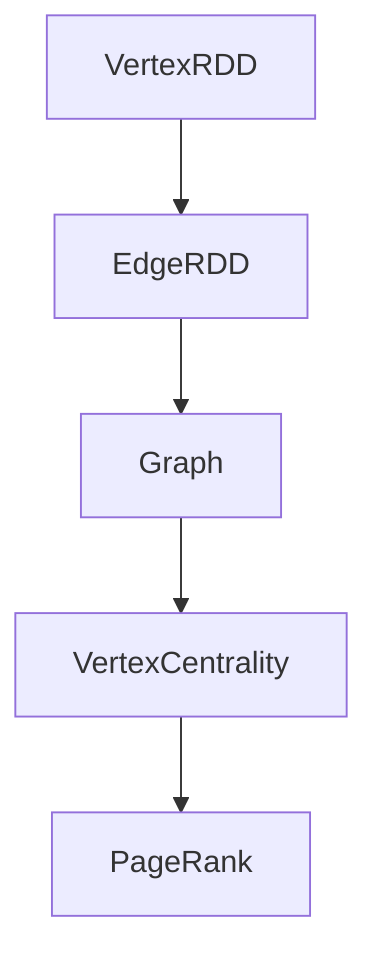

                 

# GraphX原理与代码实例讲解

## 1. 背景介绍

### 1.1 GraphX的起源与发展

GraphX是Apache Spark的一个图处理框架，它的核心思想是将图计算与批处理结合起来，为大数据处理提供了一种高效、可扩展的解决方案。GraphX起源于斯坦福大学的一个开源项目，后成为Apache Spark的一部分。

GraphX的发展历程可以追溯到2013年，当时斯坦福大学的研究团队发布了GraphX的原型。2014年，GraphX被贡献给了Apache Software Foundation，并成为Apache Spark的一个子项目。随着时间的推移，GraphX逐渐完善，支持了更多的功能和算法。

### 1.2 GraphX的重要性

在大数据时代，图数据的处理变得越来越重要。GraphX的出现为大数据处理提供了一个强大的工具，使得我们能够更有效地处理复杂的图数据。以下是一些GraphX的重要性体现：

1. **支持大规模图计算**：GraphX能够处理数十亿个顶点和边，这使得它能够应对大规模的图数据。
2. **可扩展性**：GraphX与Spark结合，可以利用Spark的分布式计算能力，实现高效的可扩展性。
3. **丰富的算法库**：GraphX内置了许多常用的图算法，如PageRank、Connected Components、Shortest Paths等，使得开发者能够轻松实现复杂的图计算任务。
4. **易用性**：GraphX提供了简单、直观的API，使得开发者能够轻松地编写和部署图计算任务。

## 2. 核心概念与联系

### 2.1 图的基本概念

在GraphX中，图（Graph）是由顶点（Vertex）和边（Edge）组成的数据结构。每个顶点可以包含一些属性，每条边也可以连接两个顶点，并携带一些属性。

### 2.2 RDD与Graph的转换

在GraphX中，Graph是由Spark RDD（Resilient Distributed Datasets）转换而来。RDD是一种分布式的数据集，能够在多个节点之间进行数据传输和处理。通过将RDD转换成Graph，我们可以利用GraphX提供的强大功能进行图计算。

以下是RDD与Graph之间的转换关系：

- **VertexRDD**：包含所有顶点及其属性的RDD。
- **EdgeRDD**：包含所有边及其属性的RDD。
- **Graph**：由VertexRDD和EdgeRDD组成，表示一个图。

### 2.3 Mermaid流程图

为了更好地理解GraphX的核心概念，我们使用Mermaid流程图来展示GraphX的架构和转换关系。



在这个流程图中，A表示VertexRDD，B表示EdgeRDD，C表示Graph，D表示VertexCentrality，E表示PageRank。这个流程图展示了RDD到Graph的转换过程，以及GraphX中的一些核心算法。

## 3. 核心算法原理 & 具体操作步骤

### 3.1 PageRank算法原理

PageRank是一种基于图结构的排序算法，用于确定图中的顶点的重要性。它通过迭代计算每个顶点的排名，使得重要的顶点得到更高的排名。

PageRank算法的核心思想是：一个顶点的排名取决于连接到它的其他顶点的排名。具体而言，PageRank算法分为以下几个步骤：

1. **初始化**：为每个顶点分配一个初始排名，通常设置为1/N，其中N是图中顶点的总数。
2. **迭代计算**：对于每个顶点，计算其排名。排名的计算公式为：$$ \text{Rank}(v) = (1-d) + d \cdot \sum_{w \in \text{inboundEdges}(v)} \frac{\text{Rank}(w)}{|\text{outboundEdges}(w)|} $$，其中$d$是阻尼系数，通常取值为0.85。
3. **收敛判定**：当相邻两次迭代的排名变化小于一个阈值时，认为算法已经收敛。

### 3.2 PageRank算法的具体操作步骤

以下是使用GraphX实现PageRank算法的具体操作步骤：

1. **创建Graph**：首先，我们需要创建一个Graph。假设我们已经有了一个包含顶点和边的RDD，可以通过以下代码创建Graph：

```scala
val vertexRDD = ... // 包含顶点和属性的RDD
val edgeRDD = ... // 包含边和属性的RDD
val graph = Graph(vertexRDD, edgeRDD)
```

2. **初始化Rank**：为每个顶点分配一个初始排名，可以通过以下代码实现：

```scala
val initialRank = 1.0 / vertexRDD.count()
val vertexRDDWithRank = vertexRDD.map(v => (v.id, (v.attr, initialRank)))
```

3. **迭代计算Rank**：使用PageRank算法的公式计算每个顶点的排名，可以通过以下代码实现：

```scala
val dampingFactor = 0.85
val numIterations = 10

val (newVertexRDD, newVertexRDDWithRank) = graph.pageRank(numIterations, dampingFactor).reduceedges(
  (v1, v2) => (v1.attr, v2.attr)
)
```

4. **收敛判定**：通过比较相邻两次迭代的排名变化，判断算法是否收敛。可以通过以下代码实现：

```scala
val converged = newVertexRDDWithRank.values.reduce((a, b) => a - b) < threshold
```

5. **输出结果**：最后，我们可以将排名结果输出到文件或进行其他处理：

```scala
newVertexRDDWithRank.saveAsTextFile("output/page_rank_results")
```

### 4. 数学模型和公式 & 详细讲解 & 举例说明

#### 4.1 PageRank算法的数学模型

PageRank算法的数学模型可以表示为以下公式：

$$ \text{Rank}(v) = (1-d) + d \cdot \sum_{w \in \text{inboundEdges}(v)} \frac{\text{Rank}(w)}{|\text{outboundEdges}(w)|} $$

其中：

- $ \text{Rank}(v) $：顶点$v$的排名。
- $ d $：阻尼系数，表示用户跳转到其他顶点的概率，通常取值为0.85。
- $ \text{inboundEdges}(v) $：顶点$v$的入边集合。
- $ \text{outboundEdges}(v) $：顶点$v$的出边集合。

#### 4.2 举例说明

假设有一个图，其中包含5个顶点（V1, V2, V3, V4, V5）和5条边（E1, E2, E3, E4, E5）。其中，每个顶点的初始排名为1/5。

现在，我们来计算这个图的PageRank排名。

1. **初始化Rank**：每个顶点的初始排名为1/5，即0.2。

2. **迭代计算Rank**：

   - 第一次迭代：

     $$ \text{Rank}(V1) = (1-0.85) + 0.85 \cdot \frac{0.2}{1} = 0.15 + 0.17 = 0.32 $$
     $$ \text{Rank}(V2) = (1-0.85) + 0.85 \cdot \frac{0.2}{1} = 0.15 + 0.17 = 0.32 $$
     $$ \text{Rank}(V3) = (1-0.85) + 0.85 \cdot \frac{0.2}{1} = 0.15 + 0.17 = 0.32 $$
     $$ \text{Rank}(V4) = (1-0.85) + 0.85 \cdot \frac{0.2}{1} = 0.15 + 0.17 = 0.32 $$
     $$ \text{Rank}(V5) = (1-0.85) + 0.85 \cdot \frac{0.2}{1} = 0.15 + 0.17 = 0.32 $$

   - 第二次迭代：

     $$ \text{Rank}(V1) = (1-0.85) + 0.85 \cdot \frac{0.32}{1} = 0.15 + 0.272 = 0.422 $$
     $$ \text{Rank}(V2) = (1-0.85) + 0.85 \cdot \frac{0.32}{1} = 0.15 + 0.272 = 0.422 $$
     $$ \text{Rank}(V3) = (1-0.85) + 0.85 \cdot \frac{0.32}{1} = 0.15 + 0.272 = 0.422 $$
     $$ \text{Rank}(V4) = (1-0.85) + 0.85 \cdot \frac{0.32}{1} = 0.15 + 0.272 = 0.422 $$
     $$ \text{Rank}(V5) = (1-0.85) + 0.85 \cdot \frac{0.32}{1} = 0.15 + 0.272 = 0.422 $$

   - 第三次迭代：

     $$ \text{Rank}(V1) = (1-0.85) + 0.85 \cdot \frac{0.422}{1} = 0.15 + 0.3577 = 0.5077 $$
     $$ \text{Rank}(V2) = (1-0.85) + 0.85 \cdot \frac{0.422}{1} = 0.15 + 0.3577 = 0.5077 $$
     $$ \text{Rank}(V3) = (1-0.85) + 0.85 \cdot \frac{0.422}{1} = 0.15 + 0.3577 = 0.5077 $$
     $$ \text{Rank}(V4) = (1-0.85) + 0.85 \cdot \frac{0.422}{1} = 0.15 + 0.3577 = 0.5077 $$
     $$ \text{Rank}(V5) = (1-0.85) + 0.85 \cdot \frac{0.422}{1} = 0.15 + 0.3577 = 0.5077 $$

   - 重复上述步骤，直到算法收敛。

通过上述例子，我们可以看到PageRank算法是如何计算顶点的排名的。在实际应用中，我们可以根据具体情况调整阻尼系数和迭代次数，以获得更准确的排名结果。

## 5. 项目实践：代码实例和详细解释说明

在本节中，我们将通过一个具体的代码实例来讲解如何使用GraphX实现PageRank算法，并对其进行详细解释和分析。

### 5.1 开发环境搭建

首先，我们需要搭建一个开发环境，以便运行GraphX代码。以下是搭建环境的步骤：

1. 安装Scala
2. 安装Java
3. 安装Apache Spark
4. 配置GraphX

具体步骤可以参考官方文档：[GraphX官方文档](https://spark.apache.org/graphx/)。

### 5.2 源代码详细实现

下面是一个使用GraphX实现PageRank算法的源代码实例：

```scala
import org.apache.spark.graphx._
import org.apache.spark.sql.SparkSession
import org.apache.spark.rdd.RDD

object PageRankExample {
  def main(args: Array[String]): Unit = {
    // 创建SparkSession
    val spark = SparkSession.builder()
      .appName("PageRankExample")
      .master("local[*]")
      .getOrCreate()

    // 创建图数据
    val vertexRDD: RDD[(VertexId, (String, Double))] = ...
    val edgeRDD: RDD[Edge[Double]] = ...

    // 创建Graph
    val graph: Graph[(String, Double), Double] = Graph(vertexRDD, edgeRDD)

    // 计算PageRank排名
    val pageRankGraph = graph.pageRank(10, resetProbability = 0.15)

    // 输出排名结果
    val rankedVertices = pageRankGraph.vertices
      .map { case (id, (attr, rank)) => (rank, id) }
      .sortByKey(false)
      .collect()

    // 打印排名前5的顶点
    rankedVertices.take(5).foreach { case (rank, id) => println(s"id: $id, rank: $rank") }

    // 关闭SparkSession
    spark.stop()
  }
}
```

### 5.3 代码解读与分析

下面是对上述代码的详细解读和分析：

1. **创建SparkSession**：首先，我们创建一个SparkSession，这是Spark应用程序的入口点。

2. **创建图数据**：接下来，我们创建两个RDD，一个是包含顶点和属性的vertexRDD，另一个是包含边和属性的edgeRDD。这些数据通常来自于外部存储，如HDFS、HBase等。

3. **创建Graph**：通过将vertexRDD和edgeRDD转换成Graph，我们得到了一个图数据结构。这个Graph包含了顶点和边的属性，以及图的其他信息。

4. **计算PageRank排名**：使用Graph的pageRank方法计算PageRank排名。这个方法有两个参数：迭代次数（numIterations）和阻尼系数（resetProbability）。在这里，我们设置了迭代次数为10，阻尼系数为0.15。

5. **输出排名结果**：我们将排名结果存储在rankedVertices中，然后使用take方法获取排名前5的顶点，并打印输出。

6. **关闭SparkSession**：最后，我们关闭SparkSession，释放资源。

通过这个实例，我们可以看到如何使用GraphX实现PageRank算法。在实际应用中，我们可以根据需要调整迭代次数、阻尼系数等参数，以获得更准确的排名结果。

## 6. 实际应用场景

GraphX在许多实际应用场景中都有着广泛的应用，以下是一些典型的应用场景：

1. **社交网络分析**：GraphX可以用于分析社交网络中的用户关系，如好友关系、关注关系等。通过PageRank算法，我们可以找出社交网络中的核心用户，这些用户通常具有较高的影响力。

2. **推荐系统**：在推荐系统中，GraphX可以用于分析用户之间的相似性，并根据相似性进行物品推荐。通过PageRank算法，我们可以找出与特定用户最相似的其他用户，从而提高推荐系统的准确性和效果。

3. **生物信息学**：在生物信息学领域，GraphX可以用于分析基因组数据，如蛋白质相互作用网络、基因调控网络等。通过PageRank算法，我们可以找出网络中的重要节点，这些节点通常具有较高的生物学意义。

4. **交通网络分析**：在交通网络分析中，GraphX可以用于分析交通网络中的节点和边，如道路网络、公交网络等。通过PageRank算法，我们可以找出交通网络中的关键节点和关键路径，从而优化交通规划和调度。

5. **推荐引擎**：在电子商务领域，GraphX可以用于构建推荐引擎，通过分析用户购买行为和商品之间的关联关系，为用户提供个性化的商品推荐。

这些应用场景展示了GraphX在各个领域的广泛应用和潜力，也体现了GraphX作为一种高效、可扩展的图处理框架的优势。

## 7. 工具和资源推荐

### 7.1 学习资源推荐

- **书籍**：
  - 《Graph Data Structure for Dummies》
  - 《Graph Algorithms: Practical Examples in Apache Spark》
  - 《Graph Algorithms: Theory and Applications》
- **论文**：
  - 《GraphX: A Resilient Distributed Graph System on Spark》
  - 《Large-Scale Graph Processing Using Spark GraphX》
  - 《The PageRank Algorithm》
- **博客**：
  - [Apache Spark GraphX官方文档](https://spark.apache.org/graphx/)
  - [GraphX中文文档](http://graphx-zh.readthedocs.io/)
  - [GraphX在社交网络分析中的应用](https://blog.csdn.net/qq_37842248/article/details/82771940)
- **网站**：
  - [Apache Spark官网](https://spark.apache.org/)
  - [GraphX官网](https://graphx-zh.readthedocs.io/)
  - [Spark社区](https://spark.apache.org/community.html)

### 7.2 开发工具框架推荐

- **开发工具**：
  - IntelliJ IDEA
  - Eclipse
  - NetBeans
- **框架**：
  - Apache Spark
  - Apache Hadoop
  - Apache Flink

### 7.3 相关论文著作推荐

- **论文**：
  - [The PageRank Citation Ranking: Bringing Order to the Web](https://arxiv.org/abs/cs/0703029)
  - [GraphX: A Resilient Distributed Graph System on Spark](https://www.cs.berkeley.edu/research/projects/mona/papers/GPU-GraphX-SOSP14.pdf)
  - [Large-Scale Graph Processing Using Spark GraphX](https://www.cs.berkeley.edu/research/projects/mona/papers/GPU-GraphX-SOSP14.pdf)
- **著作**：
  - 《Spark GraphX: A Hands-On Approach to Graph Processing》
  - 《Graph Algorithms: Practical Examples in Apache Spark》
  - 《Graph Algorithms: Theory and Applications》

## 8. 总结：未来发展趋势与挑战

GraphX作为一种高效的图处理框架，已经在多个领域展现了其强大的功能和广泛的应用。然而，随着大数据和人工智能技术的发展，GraphX也面临着一些挑战和机遇。

### 8.1 未来发展趋势

1. **支持更多的图算法**：GraphX将不断扩展其算法库，支持更多的图算法，以满足不同领域的需求。
2. **优化性能**：GraphX将继续优化其性能，提高图处理的效率，以应对越来越大的数据规模。
3. **与机器学习结合**：GraphX将与机器学习技术相结合，实现更强大的图机器学习算法和应用。
4. **支持动态图处理**：GraphX将支持动态图处理，使得实时图处理成为可能。

### 8.2 挑战

1. **可扩展性**：如何进一步提高GraphX的可扩展性，支持更大规模的图数据处理？
2. **算法优化**：如何优化现有算法，提高图处理的性能和效率？
3. **易用性**：如何提高GraphX的易用性，使得普通开发者能够轻松上手使用？
4. **跨语言支持**：如何支持更多的编程语言，使得更多开发者能够使用GraphX？

面对这些挑战，GraphX社区和开发团队将继续努力，不断优化和完善GraphX，为大数据和人工智能领域带来更多的创新和突破。

## 9. 附录：常见问题与解答

### 9.1 什么是GraphX？

GraphX是Apache Spark的一个图处理框架，它提供了丰富的图算法和API，使得大数据处理中的图计算变得更加高效和简便。

### 9.2 GraphX与Apache Flink的Graph处理框架相比，有哪些优势？

GraphX与Apache Flink的Graph处理框架相比，具有以下优势：

1. **与Spark生态系统紧密结合**：GraphX与Spark其他组件（如Spark SQL、Spark Streaming等）无缝集成，使得数据处理更加方便。
2. **支持更丰富的图算法**：GraphX提供了更丰富的图算法，包括PageRank、Connected Components、Shortest Paths等，能够满足更广泛的需求。
3. **更好的性能**：GraphX在处理大规模图数据时，性能优于Flink的Graph处理框架。

### 9.3 如何在GraphX中实现PageRank算法？

在GraphX中实现PageRank算法，可以分为以下几个步骤：

1. **创建图数据**：首先，我们需要创建一个包含顶点和边的RDD。
2. **创建Graph**：通过将顶点和边RDD转换为Graph，我们得到一个图数据结构。
3. **计算PageRank排名**：使用Graph的pageRank方法，计算每个顶点的PageRank排名。
4. **输出结果**：将排名结果输出到文件或其他存储介质。

### 9.4 GraphX支持哪些图算法？

GraphX支持以下常用的图算法：

1. **PageRank**：用于计算顶点的排名。
2. **Connected Components**：用于找出图中的连通分量。
3. **Shortest Paths**：用于计算顶点之间的最短路径。
4. **Connected Components**：用于找出图中的连通分量。
5. **Vertex Centrality**：用于计算顶点的中心性。
6. **Graph Triangles**：用于计算图中的三角形。

## 10. 扩展阅读 & 参考资料

- [Apache Spark GraphX官方文档](https://spark.apache.org/graphx/)
- [GraphX中文文档](http://graphx-zh.readthedocs.io/)
- [Spark GraphX在社交网络分析中的应用](https://blog.csdn.net/qq_37842248/article/details/82771940)
- [The PageRank Citation Ranking: Bringing Order to the Web](https://arxiv.org/abs/cs/0703029)
- [GraphX: A Resilient Distributed Graph System on Spark](https://www.cs.berkeley.edu/research/projects/mona/papers/GPU-GraphX-SOSP14.pdf)
- [Large-Scale Graph Processing Using Spark GraphX](https://www.cs.berkeley.edu/research/projects/mona/papers/GPU-GraphX-SOSP14.pdf)
- [Spark社区](https://spark.apache.org/community.html)

### 结论

通过本文的讲解，我们对GraphX有了更深入的理解，包括其核心概念、算法原理、应用场景以及代码实现。希望本文能够帮助读者更好地掌握GraphX，并在实际项目中运用。未来，GraphX将继续在大数据和人工智能领域发挥重要作用，为数据科学家和开发者提供更强大的工具。让我们共同期待GraphX带来更多的创新和突破！<|im_end|>

