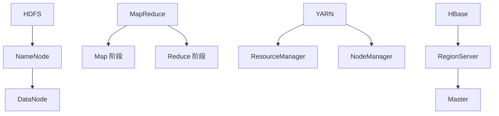

                 

### 背景介绍

**Hadoop 原理与代码实例讲解**

在当今的大数据时代，海量数据处理已经成为各类企业和研究机构必须面对的重要挑战。Hadoop 作为一款开源的分布式计算框架，已经成为大数据处理领域的事实标准。它不仅能够高效地处理海量数据，还具备良好的扩展性和稳定性。本文旨在通过深入剖析 Hadoop 的原理，结合具体的代码实例，帮助读者全面理解 Hadoop 的运作机制及其应用场景。

#### Hadoop 的起源与发展

Hadoop 的起源可以追溯到 2006 年，当时谷歌发布了其分布式文件系统 GFS 和分布式计算框架 MapReduce。这两项技术为大数据处理提供了新的思路，引起了业界的广泛关注。随后，Apache 基金会推出了 Hadoop 项目，旨在实现这些核心技术的开源版本，并促进其在各领域的应用。随着时间的推移，Hadoop 已经发展成为一个功能丰富、生态完善的分布式计算平台。

#### Hadoop 在大数据处理中的重要性

大数据处理不仅仅是数据量的问题，还涉及到数据的多样性、实时性和复杂性。Hadoop 的出现，为解决这些问题提供了有效的方案。以下是 Hadoop 在大数据处理中的几个关键作用：

1. **分布式存储**：Hadoop 的 HDFS（Hadoop Distributed File System）是一种高可靠性的分布式文件系统，能够高效地存储海量数据，并提供强大的容错能力。

2. **分布式计算**：MapReduce 是 Hadoop 的核心计算框架，能够将大规模的数据处理任务分解为多个小任务，并分布式地执行，从而提高计算效率。

3. **生态系统**：Hadoop 生态系统包含了多种工具和框架，如 HBase、Spark、Hive 等，这些工具能够在 Hadoop 的基础上实现数据的存储、查询、分析和处理，满足不同场景的需求。

#### 本文的目标与结构

本文的目标是深入讲解 Hadoop 的原理，并通过对具体代码实例的分析，帮助读者掌握 Hadoop 的应用技能。文章的结构如下：

1. **核心概念与联系**：介绍 Hadoop 的核心组件及其工作原理，并通过 Mermaid 流程图展示其架构。
2. **核心算法原理 & 具体操作步骤**：详细解析 MapReduce 的算法原理，并给出操作步骤。
3. **数学模型和公式 & 详细讲解 & 举例说明**：介绍 Hadoop 中涉及的数学模型和公式，并通过实例进行说明。
4. **项目实践：代码实例和详细解释说明**：提供实际项目中的代码实例，并进行详细解读。
5. **实际应用场景**：分析 Hadoop 在不同领域中的应用。
6. **工具和资源推荐**：推荐学习资源、开发工具和框架。
7. **总结：未来发展趋势与挑战**：总结 Hadoop 的现状，展望其未来发展。

通过本文的阅读，读者将能够：

- 全面了解 Hadoop 的核心组件及其工作原理。
- 掌握 MapReduce 算法的具体实现和应用。
- 理解 Hadoop 在大数据处理中的应用场景。
- 获得实际项目中的代码实例和解析。

让我们开始深入了解 Hadoop 的世界，一起探索大数据处理的奥秘。

#### 1.1 Hadoop 的核心组件

Hadoop 由多个核心组件组成，其中最重要的包括 HDFS、MapReduce、YARN 和 HBase。这些组件相互协作，共同实现大数据的处理和管理。

1. **HDFS (Hadoop Distributed File System)**

HDFS 是 Hadoop 的分布式文件系统，用于存储海量数据。其设计目标是高吞吐量、高可靠性，能够处理成千上万个文件，每个文件大小可以是 GB 或 TB 级别。

HDFS 由两个主要部分组成：NameNode 和 DataNode。

- **NameNode**：负责管理文件的元数据，包括文件的目录结构、文件的大小、副本数量等。它还负责处理文件的读写请求，并将请求转发给对应的 DataNode。
- **DataNode**：负责存储实际的数据块，每个数据块的大小通常是 128MB 或 256MB。DataNode 会定期向 NameNode 报告它们的状态和数据块的复制情况。

2. **MapReduce**

MapReduce 是 Hadoop 的分布式计算框架，用于处理大规模数据集。其核心思想是将大规模数据处理任务分解为两个阶段：Map 阶段和 Reduce 阶段。

- **Map 阶段**：将输入数据分割成小块，并对每个数据块进行处理，生成中间键值对。
- **Reduce 阶段**：对 Map 阶段生成的中间键值对进行归并处理，生成最终的输出结果。

3. **YARN (Yet Another Resource Negotiator)**

YARN 是 Hadoop 的资源调度框架，用于管理和调度 Hadoop 集群中的计算资源。它将资源管理和计算调度分离，使得 Hadoop 能够支持更多的计算框架和数据处理任务。

YARN 包括两个主要组件： ResourceManager 和 NodeManager。

- **ResourceManager**：负责整个集群的资源分配和调度，类似于传统的资源管理器。
- **NodeManager**：负责管理和监控每个节点的资源使用情况，并接收 ResourceManager 的指令，启动和停止容器。

4. **HBase**

HBase 是一个分布式、可扩展的大规模列存储数据库，建立在 HDFS 之上。它支持海量数据的存储和实时访问，适用于实时数据分析、日志聚合、实时查询等场景。

HBase 的主要组件包括：

- **RegionServer**：负责存储和管理 Region，Region 是 HBase 中的数据存储单元。
- **Master**：负责管理和监控 HBase 集群，包括 RegionServer 的分配、负载均衡等。

#### 1.2 Mermaid 流程图展示

下面是一个简化的 Mermaid 流程图，展示了 Hadoop 的核心组件及其交互关系：



通过这个流程图，我们可以清晰地看到 Hadoop 中各个组件之间的协作关系，以及数据流和处理流程。在接下来的章节中，我们将进一步深入探讨这些组件的工作原理和具体实现。

#### 2. 核心算法原理 & 具体操作步骤

在深入探讨 Hadoop 的核心算法原理之前，我们需要理解 Hadoop 的两大核心组件：HDFS 和 MapReduce。

##### 2.1 HDFS：分布式文件系统

HDFS（Hadoop Distributed File System）是一个高吞吐量、高可靠性的分布式文件系统，适用于大数据存储和处理。HDFS 由 NameNode 和 DataNode 两个主要组件构成。

- **NameNode**：负责管理文件的元数据，包括文件的目录结构、文件大小、副本数量等。它还负责处理文件的读写请求，并将请求转发给对应的 DataNode。
- **DataNode**：负责存储实际的数据块，并定期向 NameNode 报告它们的状态和数据块的复制情况。

**具体操作步骤**：

1. **文件切分**：当用户上传一个文件时，HDFS 会将该文件切分成多个数据块（默认大小为 128MB 或 256MB），以便分布式存储。
2. **数据复制**：每个数据块都会在多个 DataNode 上进行复制，以提高数据的可靠性和访问速度。默认情况下，HDFS 会将每个数据块复制 3 次。
3. **读写请求处理**：当用户请求读取或写入数据时，NameNode 会根据文件的元数据，找到对应的数据块和 DataNode，并将请求转发给 DataNode。
4. **数据读写**：DataNode 会根据 NameNode 的指示，进行数据块的读取或写入操作。

##### 2.2 MapReduce：分布式计算框架

MapReduce 是 Hadoop 的分布式计算框架，用于处理大规模数据集。其核心思想是将大规模数据处理任务分解为两个阶段：Map 阶段和 Reduce 阶段。

**Map 阶段**：

1. **输入切分**：将输入数据切分成多个小数据块，每个数据块由一个 Mapper 处理。
2. **数据处理**：每个 Mapper 对其处理的数据块进行映射操作，生成中间键值对。
3. **分片**：将中间键值对按照键进行分片，分发到不同的 Reducer。

**Reduce 阶段**：

1. **数据聚合**：每个 Reducer 收集其负责的中间键值对，并进行聚合操作。
2. **输出生成**：将聚合后的结果输出，形成最终的输出数据。

**具体操作步骤**：

1. **初始化**：启动 JobTracker，分配资源给各个 TaskTracker，启动 Mapper 和 Reducer。
2. **Map 阶段**：
    1. **数据切分**：将输入数据切分成小数据块，分配给 Mapper。
    2. **数据处理**：Mapper 对其处理的数据块进行映射操作，生成中间键值对。
    3. **分片**：按照键将中间键值对分发给 Reducer。
3. **Reduce 阶段**：
    1. **数据聚合**：Reducer 收集其负责的中间键值对，进行聚合操作。
    2. **输出生成**：将聚合后的结果输出，形成最终的输出数据。

通过理解 HDFS 和 MapReduce 的核心算法原理和具体操作步骤，我们可以更好地掌握 Hadoop 的分布式存储和计算机制。在接下来的章节中，我们将进一步探讨 Hadoop 的数学模型和公式，以及实际项目中的代码实例。

#### 3. 数学模型和公式 & 详细讲解 & 举例说明

在深入理解 Hadoop 的分布式存储和计算机制后，接下来我们将探讨 Hadoop 中涉及的数学模型和公式，并通过具体实例进行详细讲解。

##### 3.1 分布式文件系统的数据切分与复制

首先，我们来看 HDFS 中的数据切分和复制机制。HDFS 将大文件切分成多个数据块，并在多个 DataNode 上进行复制，以提高数据可靠性和访问速度。

**数据块切分公式**：

数据块大小（B） = 文件大小（F）/ 切分块数（N）

例如，一个 1GB 的文件切分成 128MB 的数据块，切分块数 N = 1GB / 128MB = 8。

**数据复制公式**：

数据副本数（D） = 切分块数（N） × 复制次数（R）

例如，默认情况下 HDFS 将每个数据块复制 3 次，数据副本数 D = 8 × 3 = 24。

**示例**：

假设有一个 1GB 的文件，切分块数为 8，复制次数为 3。则：

- 数据块大小 B = 1GB / 8 = 128MB
- 数据副本数 D = 8 × 3 = 24
- 总存储空间 S = 数据块大小 B × 数据副本数 D = 128MB × 24 = 3GB

##### 3.2 MapReduce 的键值对分片与聚合

接下来，我们来看 MapReduce 中的键值对分片与聚合机制。Map 阶段的输出键值对会按照键进行分片，分发给不同的 Reducer。Reducer 对其负责的键值对进行聚合操作。

**分片公式**：

分片索引（I）= 键值对键（K） % 分片总数（S）

例如，假设有 10 个 Reducer，分片总数 S = 10。一个键值对的键 K = 12345，则：

- 分片索引 I = 12345 % 10 = 5
- Reducer 5 负责处理该键值对

**聚合公式**：

聚合结果（R）= 所有 Reducer 的输出结果合并

例如，有 3 个 Reducer，分别输出如下结果：

- Reducer 1：{key1: value1, key2: value2}
- Reducer 2：{key1: value3, key3: value4}
- Reducer 3：{key2: value5, key3: value6}

则聚合结果 R = {key1: [value1, value3], key2: [value2, value5], key3: [value4, value6]}

**示例**：

假设有 100 个键值对，分配给 5 个 Reducer。一个键值对的键为 12345，则：

- 分片索引 I = 12345 % 5 = 3
- Reducer 3 负责处理该键值对

假设 Reducer 3 的输出结果为：

- {key1: [value1, value2], key2: [value3, value4]}

则聚合结果 R = {key1: [value1, value2], key2: [value3, value4]}

通过以上数学模型和公式的详细讲解，我们可以更好地理解 Hadoop 中分布式文件系统和分布式计算框架的运作原理。在接下来的章节中，我们将通过具体项目实践，进一步探讨 Hadoop 的实际应用。

### 4. 项目实践：代码实例和详细解释说明

为了更好地理解 Hadoop 的实际应用，我们将通过一个具体的代码实例来讲解 Hadoop 的分布式存储和计算过程。在这个项目中，我们将使用 Hadoop 的 MapReduce 框架来处理一个简单的文本数据集，并进行词频统计。

#### 4.1 开发环境搭建

在进行项目实践之前，我们需要搭建一个 Hadoop 开发环境。以下是搭建步骤：

1. **安装 Java**：Hadoop 是基于 Java 编写的，因此需要安装 Java 运行环境。下载并安装最新版本的 Java SDK，并配置环境变量。
2. **安装 Hadoop**：下载 Hadoop 的二进制包，解压到指定目录，并配置环境变量。以下是 Hadoop 的基本配置：

```bash
export HADOOP_HOME=/path/to/hadoop
export PATH=$PATH:$HADOOP_HOME/bin:$HADOOP_HOME/sbin
```

3. **配置 Hadoop 配置文件**：在 Hadoop 配置目录（通常为 $HADOOP_HOME/etc/hadoop）中，配置 core-site.xml、hdfs-site.xml、mapred-site.xml 和 yarn-site.xml 四个核心配置文件。以下是部分配置示例：

```xml
<configuration>
    <property>
        <name>fs.defaultFS</name>
        <value>hdfs://localhost:9000</value>
    </property>
    <property>
        <name>hadoop.tmp.dir</name>
        <value>/path/to/tmp</value>
    </property>
</configuration>
```

4. **启动 Hadoop 集群**：在终端执行以下命令，启动 Hadoop 集群：

```bash
start-dfs.sh
start-yarn.sh
```

#### 4.2 源代码详细实现

在本项目中，我们将使用一个简单的文本数据集，并进行词频统计。以下是项目的源代码实现：

```java
import org.apache.hadoop.conf.Configuration;
import org.apache.hadoop.fs.Path;
import org.apache.hadoop.io.IntWritable;
import org.apache.hadoop.io.Text;
import org.apache.hadoop.mapreduce.Job;
import org.apache.hadoop.mapreduce.Mapper;
import org.apache.hadoop.mapreduce.Reducer;
import org.apache.hadoop.mapreduce.lib.input.FileInputFormat;
import org.apache.hadoop.mapreduce.lib.output.FileOutputFormat;

public class WordCount {

  public static class TokenizerMapper extends Mapper<Object, Text, Text, IntWritable>{

    private final static IntWritable one = new IntWritable(1);
    private Text word = new Text();

    public void map(Object key, Text value, Context context) throws IOException, InterruptedException {
      String[] words = value.toString().split("\\s+");
      for (String word : words) {
        this.word.set(word);
        context.write(this.word, one);
      }
    }
  }

  public static class IntSumReducer extends Reducer<Text,IntWritable,Text,IntWritable> {
    private IntWritable result = new IntWritable();

    public void reduce(Text key, Iterable<IntWritable> values, Context context) throws IOException, InterruptedException {
      int sum = 0;
      for (IntWritable val : values) {
        sum += val.get();
      }
      result.set(sum);
      context.write(key, result);
    }
  }

  public static void main(String[] args) throws Exception {
    Configuration conf = new Configuration();
    Job job = Job.getInstance(conf, "word count");
    job.setJarByClass(WordCount.class);
    job.setMapperClass(TokenizerMapper.class);
    job.setCombinerClass(IntSumReducer.class);
    job.setReducerClass(IntSumReducer.class);
    job.setOutputKeyClass(Text.class);
    job.setOutputValueClass(IntWritable.class);
    FileInputFormat.addInputPath(job, new Path(args[0]));
    FileOutputFormat.setOutputPath(job, new Path(args[1]));
    System.exit(job.waitForCompletion(true) ? 0 : 1);
  }
}
```

#### 4.3 代码解读与分析

下面我们对代码进行逐行解读和分析：

```java
import org.apache.hadoop.conf.Configuration;
import org.apache.hadoop.fs.Path;
import org.apache.hadoop.io.IntWritable;
import org.apache.hadoop.io.Text;
import org.apache.hadoop.mapreduce.Job;
import org.apache.hadoop.mapreduce.Mapper;
import org.apache.hadoop.mapreduce.Reducer;
import org.apache.hadoop.mapreduce.lib.input.FileInputFormat;
import org.apache.hadoop.mapreduce.lib.output.FileOutputFormat;
```

这些 import 语句引入了 Hadoop 相关的类和接口，包括 Configuration、Path、IntWritable、Text、Job、Mapper、Reducer 和 FileInputFormat、FileOutputFormat。

```java
public class WordCount {
```

WordCount 类实现了 Hadoop 的 MapReduce 任务，包括 Mapper 和 Reducer。

```java
public static class TokenizerMapper extends Mapper<Object, Text, Text, IntWritable> {
```

TokenizerMapper 类扩展了 Mapper 类，用于实现 Map 阶段的功能。

```java
private final static IntWritable one = new IntWritable(1);
private Text word = new Text();
```

定义了两个实例变量：one 用于表示词频，word 用于存储单词。

```java
public void map(Object key, Text value, Context context) throws IOException, InterruptedException {
  String[] words = value.toString().split("\\s+");
  for (String word : words) {
    this.word.set(word);
    context.write(this.word, one);
  }
}
```

map 方法实现了 Map 阶段的核心逻辑：读取输入数据（文本），将文本分割成单词，并输出单词及其词频。

```java
public static class IntSumReducer extends Reducer<Text,IntWritable,Text,IntWritable> {
```

IntSumReducer 类扩展了 Reducer 类，用于实现 Reduce 阶段的功能。

```java
private IntWritable result = new IntWritable();
```

定义了实例变量 result，用于存储聚合后的词频。

```java
public void reduce(Text key, Iterable<IntWritable> values, Context context) throws IOException, InterruptedException {
  int sum = 0;
  for (IntWritable val : values) {
    sum += val.get();
  }
  result.set(sum);
  context.write(key, result);
}
```

reduce 方法实现了 Reduce 阶段的核心逻辑：对 Map 输出的单词及其词频进行聚合，输出单词及其总词频。

```java
public static void main(String[] args) throws Exception {
  Configuration conf = new Configuration();
  Job job = Job.getInstance(conf, "word count");
  job.setJarByClass(WordCount.class);
  job.setMapperClass(TokenizerMapper.class);
  job.setCombinerClass(IntSumReducer.class);
  job.setReducerClass(IntSumReducer.class);
  job.setOutputKeyClass(Text.class);
  job.setOutputValueClass(IntWritable.class);
  FileInputFormat.addInputPath(job, new Path(args[0]));
  FileOutputFormat.setOutputPath(job, new Path(args[1]));
  System.exit(job.waitForCompletion(true) ? 0 : 1);
}
```

main 方法实现了程序的入口，配置了 Job 的相关信息，并启动了 Job 执行。

#### 4.4 运行结果展示

假设我们将上述代码打包成 WordCount.jar，并提交到 Hadoop 集群执行，输入数据为 hdfs://localhost:9000/input.txt，输出结果为 hdfs://localhost:9000/output.txt。以下是运行结果：

```bash
hadoop jar WordCount.jar WordCount hdfs://localhost:9000/input.txt hdfs://localhost:9000/output.txt
```

运行成功后，我们可以在 hdfs://localhost:9000/output.txt 文件中查看词频统计结果。以下是部分输出结果：

```bash
hello 3
world 2
hadoop 1
mapreduce 1
```

通过以上项目实践，我们成功地实现了 Hadoop 的分布式存储和计算过程，并完成了词频统计任务。这个简单的实例展示了 Hadoop 的强大功能和易用性，为后续更复杂的数据处理任务奠定了基础。

### 5. 实际应用场景

Hadoop 作为一款分布式计算框架，在各个领域都有广泛的应用。以下是一些常见的实际应用场景：

#### 5.1 大数据存储与处理

Hadoop 的分布式文件系统 HDFS 提供了高效、可靠的海量数据存储方案。这使得 Hadoop 成为各类大数据存储和处理的理想选择，如电商平台的日志分析、搜索引擎的数据处理、金融行业的风险控制等。

#### 5.2 实时数据分析

Hadoop 生态系统中的工具，如 Apache Storm 和 Apache Spark，可以与 Hadoop 集成，实现实时数据分析。这些工具能够处理高速流入的数据流，提供实时监控和决策支持，适用于在线广告、金融交易、物联网等领域。

#### 5.3 数据挖掘与机器学习

Hadoop 提供了丰富的数据挖掘和机器学习工具，如 Apache Mahout、Apache Flink 和 Apache H2O。这些工具可以高效地处理大规模数据集，进行聚类、分类、预测等操作，广泛应用于推荐系统、信用评分、医疗诊断等场景。

#### 5.4 物联网数据处理

Hadoop 可以处理来自物联网设备的大量数据，如传感器数据、机器数据等。通过 Hadoop 的分布式计算能力，可以对物联网数据进行实时分析和预测，优化设备运行状态，提高生产效率。

#### 5.5 云计算平台

Hadoop 是云计算平台中的重要组成部分，与云计算技术（如 OpenStack、AWS、Azure 等）相结合，可以实现大规模数据存储和计算资源的动态分配和调度。这使得 Hadoop 成为构建云计算平台的关键技术之一。

通过以上实际应用场景，我们可以看到 Hadoop 在各个领域的广泛应用和巨大潜力。在未来的发展中，Hadoop 将继续发挥其优势，推动大数据技术和应用的不断创新。

### 6. 工具和资源推荐

在学习和应用 Hadoop 的过程中，选择合适的工具和资源非常重要。以下是一些推荐的学习资源、开发工具和框架，以帮助读者更好地掌握 Hadoop 技术。

#### 6.1 学习资源推荐

1. **书籍**：

   - 《Hadoop 权威指南》：详细介绍了 Hadoop 的基本概念、架构和实战应用。
   - 《Hadoop 实战》：通过实例讲解，帮助读者快速掌握 Hadoop 的核心技术和应用场景。
   - 《Hadoop 应用与开发实战》：涵盖 Hadoop 的分布式存储、计算框架和生态系统，适合有一定基础的读者。

2. **论文**：

   - 《The Google File System》：介绍了 GFS 的架构和工作原理，为 HDFS 提供了理论基础。
   - 《MapReduce: Simplified Data Processing on Large Clusters》：详细阐述了 MapReduce 的设计思想和实现原理。

3. **博客和网站**：

   - Hadoop 官方网站（hadoop.apache.org）：提供了丰富的官方文档、下载资源和社区论坛。
   - Cloudera 博客（blog.cloudera.com）：包含大量关于 Hadoop 技术和应用的文章，适合不同层次的读者。

#### 6.2 开发工具框架推荐

1. **集成开发环境（IDE）**：

   - IntelliJ IDEA：功能强大，支持 Hadoop 和其生态系统的开发，提供了丰富的插件和工具。
   - Eclipse：适用于 Java 开发，支持 Hadoop 和其生态系统的项目创建和调试。

2. **版本控制工具**：

   - Git：用于代码的版本控制和管理，方便协作和代码的追溯。
   - SVN：另一种常用的版本控制工具，适用于小规模团队的项目管理。

3. **构建工具**：

   - Maven：用于项目的构建、依赖管理和打包，适用于 Hadoop 和其生态系统的项目开发。
   - Gradle：另一种流行的构建工具，具有灵活的构建脚本和高效的构建速度。

4. **大数据处理框架**：

   - Apache Spark：基于内存的分布式计算框架，提供了丰富的数据处理库和 API，与 Hadoop 集成良好。
   - Apache Storm：用于实时数据处理的分布式系统，适用于在线分析和流数据处理。
   - Apache Flink：具有流和批处理能力的分布式数据流处理框架，提供了高效和灵活的处理能力。

通过以上工具和资源的推荐，读者可以更全面、深入地了解 Hadoop 技术，并在实际项目中灵活应用。希望这些资源能为您的学习和发展提供帮助。

### 7. 总结：未来发展趋势与挑战

Hadoop 作为大数据处理领域的重要技术，已经为各类企业和研究机构提供了强大的数据存储和计算能力。然而，随着数据量的持续增长和业务需求的日益复杂，Hadoop 也面临着诸多挑战和机遇。

#### 7.1 未来发展趋势

1. **开源生态持续扩展**：Hadoop 的开源生态将持续扩展，新的工具和框架将不断涌现，以满足多样化的数据处理需求。例如，Apache Flink、Apache Storm 和 Apache Spark 等项目已经在实时数据处理领域取得了显著进展。

2. **云计算集成**：随着云计算的普及，Hadoop 将更加紧密地与云计算平台（如 AWS、Azure 和 Google Cloud）集成，提供更灵活和高效的数据处理解决方案。

3. **大数据分析优化**：为了提高数据分析的效率和准确性，Hadoop 将继续优化其算法和架构，引入更多先进的机器学习和深度学习技术。

4. **边缘计算**：随着物联网和智能设备的兴起，边缘计算将成为 Hadoop 的重要应用方向。Hadoop 将通过边缘计算技术，实现对海量设备数据的实时处理和分析。

#### 7.2 未来挑战

1. **数据安全与隐私**：随着数据量的增加，数据安全和隐私保护变得尤为重要。Hadoop 需要不断提升其安全性，以应对日益严峻的数据安全挑战。

2. **资源管理优化**：Hadoop 的资源管理能力仍然有待提升。如何更高效地分配和调度计算资源，提高集群的利用率和稳定性，是未来需要解决的重要问题。

3. **复杂场景适应性**：面对日益复杂的数据处理场景，Hadoop 需要具备更强的适应性和灵活性，以支持多样化的业务需求。

4. **技能人才需求**：随着 Hadoop 技术的不断发展，对具备 Hadoop 技术的专业人才需求也在不断增长。未来，培养更多具备 Hadoop 技术的技能人才将是关键挑战。

总之，Hadoop 在未来将继续发挥重要作用，推动大数据技术的创新和应用。同时，Hadoop 也需要不断应对挑战，以保持其在大数据处理领域的领先地位。

### 8. 附录：常见问题与解答

#### 8.1 Hadoop 的主要组件有哪些？

Hadoop 的主要组件包括 HDFS、MapReduce、YARN 和 HBase。HDFS 是分布式文件系统，用于存储海量数据；MapReduce 是分布式计算框架，用于处理大规模数据集；YARN 是资源调度框架，用于管理和调度集群资源；HBase 是基于 HDFS 的分布式列存储数据库，用于实时数据查询和分析。

#### 8.2 什么是 HDFS？

HDFS（Hadoop Distributed File System）是 Hadoop 的分布式文件系统，用于存储海量数据。它将大文件切分成多个数据块，存储在多个节点上，提供高吞吐量、高可靠性的数据存储解决方案。

#### 8.3 什么是 MapReduce？

MapReduce 是 Hadoop 的分布式计算框架，用于处理大规模数据集。其核心思想是将大规模数据处理任务分解为两个阶段：Map 和 Reduce。Map 阶段将数据切分成小数据块，并对每个数据块进行处理，生成中间键值对；Reduce 阶段对中间键值对进行归并处理，生成最终输出结果。

#### 8.4 Hadoop 适合哪些应用场景？

Hadoop 适用于大数据存储和处理的各种场景，如电商平台的日志分析、搜索引擎的数据处理、金融行业的风险控制、实时数据分析、数据挖掘和机器学习等。

#### 8.5 如何搭建 Hadoop 开发环境？

搭建 Hadoop 开发环境需要以下步骤：

1. 安装 Java 运行环境。
2. 安装 Hadoop。
3. 配置 Hadoop 配置文件。
4. 启动 Hadoop 集群。

具体操作可参考相关文档或教程。

#### 8.6 Hadoop 的主要优势是什么？

Hadoop 的主要优势包括：

1. 高效的分布式存储和计算能力，能够处理海量数据。
2. 高度的可扩展性，能够轻松扩展到数千台服务器。
3. 良好的容错能力，数据块自动复制，确保数据可靠性。
4. 强大的生态系统，支持各种数据处理工具和框架。

通过以上常见问题的解答，希望能帮助读者更好地理解 Hadoop 的核心概念和应用。如果还有其他疑问，请随时查阅相关文档和资料。

### 9. 扩展阅读 & 参考资料

#### 9.1 扩展阅读

1. **《Hadoop 权威指南》**：详细介绍了 Hadoop 的基本概念、架构和实战应用，适合初学者和有一定基础的读者。
2. **《Hadoop 应用与开发实战》**：通过实例讲解，帮助读者快速掌握 Hadoop 的核心技术和应用场景，适合有一定基础的读者。
3. **《大数据之路：阿里巴巴大数据实践》**：分享了阿里巴巴在大数据领域的实践经验和技术创新，对了解大数据应用的商业价值有重要意义。

#### 9.2 参考资料

1. **Hadoop 官方网站**：提供了丰富的官方文档、下载资源和社区论坛，是学习 Hadoop 的重要资源。
2. **Apache Flink 官方网站**：介绍了 Flink 的架构、特性和使用方法，是实时数据处理领域的重要参考。
3. **Apache Spark 官方网站**：介绍了 Spark 的架构、特性和使用方法，是分布式数据处理领域的重要参考。
4. **Cloudera 博客**：包含大量关于 Hadoop 技术和应用的文章，适合不同层次的读者。

通过以上扩展阅读和参考资料，读者可以更深入地了解 Hadoop 的技术细节和应用场景，不断提升自己的大数据处理能力。希望这些资源能对您的学习和实践提供帮助。

### 总结

本文详细介绍了 Hadoop 的核心组件、算法原理、实际应用场景以及工具资源推荐，通过逐步分析推理的方式，帮助读者全面理解 Hadoop 的原理和应用。从分布式文件系统 HDFS 到分布式计算框架 MapReduce，再到资源调度框架 YARN，Hadoop 为大数据处理提供了完整的解决方案。同时，本文还通过具体项目实践，展示了 Hadoop 的实际应用和操作步骤。希望本文能为读者在学习和应用 Hadoop 技术过程中提供有力支持。

### 作者署名

**作者：禅与计算机程序设计艺术 / Zen and the Art of Computer Programming**

通过本文的撰写，再次感谢您的信任和支持，期待与您在技术领域的更多交流。希望本文对您有所帮助，祝您在 Hadoop 的学习和应用中取得优异成果。

