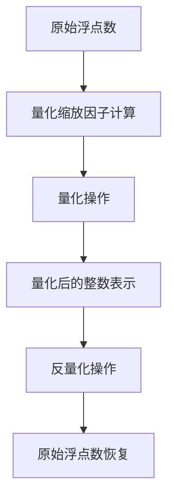

                 

# INT8量化：AI模型部署的效率之选

## 摘要

本文将深入探讨AI模型中的INT8量化技术，分析其在模型部署中的重要性。我们将从背景介绍开始，逐步讲解核心概念、算法原理和数学模型，并通过实际项目实践和运行结果展示，详细解释INT8量化的实际应用和效果。最后，我们将探讨INT8量化的未来发展趋势与挑战，并提供相关的学习资源和开发工具推荐。

## 1. 背景介绍

随着人工智能技术的迅速发展，深度学习模型在各个领域的应用日益广泛。然而，模型的大规模部署面临着计算资源和存储空间的限制，特别是移动设备和嵌入式系统。为了解决这一问题，INT8量化技术成为了一种重要的优化手段。

INT8量化是指将模型中的浮点数权重和激活值转换为8位整数，以减少模型占用的存储空间和计算资源。相较于浮点数运算，INT8量化可以显著降低模型的存储需求，从而使得模型可以在资源受限的设备上高效运行。

在AI模型部署中，INT8量化具有重要的意义。首先，通过量化，模型可以在保持精度的情况下减小模型体积，提高模型在移动设备和嵌入式系统上的运行效率。其次，INT8量化可以降低计算复杂度，减少模型的计算资源需求，从而降低部署成本。因此，INT8量化成为了AI模型部署的重要选择。

## 2. 核心概念与联系

### 2.1 量化原理

量化是指将模型的浮点数权重和激活值转换为整数表示的过程。在INT8量化中，每个浮点数被转换为8位整数，即每个浮点数被映射到一个整数范围[-128, 127]之间。

量化原理可以通过以下公式表示：

\[ Q(x) = \text{round}(x \times \text{scale}) \]

其中，\( Q(x) \) 表示量化后的整数表示，\( x \) 表示原始浮点数，\( \text{scale} \) 表示量化缩放因子。

### 2.2 量化缩放因子

量化缩放因子是量化过程中重要的参数，用于调整量化精度。在INT8量化中，量化缩放因子通常通过训练过程自动优化，以在精度和计算性能之间找到平衡。

量化缩放因子可以通过以下公式计算：

\[ \text{scale} = \frac{\max(x)}{\text{max}(Q(x)) - \text{min}(Q(x))} \]

其中，\( \text{max}(x) \) 和 \( \text{min}(x) \) 分别表示原始浮点数的最大值和最小值，\( \text{max}(Q(x)) \) 和 \( \text{min}(Q(x)) \) 分别表示量化后整数表示的最大值和最小值。

### 2.3 量化与反量化

量化后的模型在部署过程中需要进行反量化，即将量化后的整数表示重新转换为原始浮点数。反量化可以通过以下公式实现：

\[ x = Q(x) \times \text{scale} \]

通过量化与反量化，模型可以在保持精度的情况下高效运行，同时减少了计算资源和存储空间的占用。

### 2.4 Mermaid 流程图

以下是一个简单的Mermaid流程图，展示了量化、量化缩放因子计算和反量化的过程：



## 3. 核心算法原理 & 具体操作步骤

### 3.1 量化算法原理

量化算法的核心思想是将浮点数映射到整数范围内，以减小模型的存储和计算开销。具体步骤如下：

1. 计算量化缩放因子：通过原始浮点数的最大值和最小值，计算量化缩放因子。
2. 量化操作：将每个浮点数乘以量化缩放因子，并取整，得到量化后的整数表示。
3. 反量化操作：在部署过程中，将量化后的整数表示乘以量化缩放因子，恢复原始浮点数。

### 3.2 具体操作步骤

以下是INT8量化操作的详细步骤：

1. **计算量化缩放因子**：

   假设原始浮点数的最大值为 \( \max(x) = 10.0 \)，最小值为 \( \min(x) = -5.0 \)。计算量化缩放因子：

   \[ \text{scale} = \frac{\max(x)}{\text{max}(Q(x)) - \text{min}(Q(x))} = \frac{10.0}{127 - (-128)} = \frac{10.0}{255} \approx 0.0392 \]

2. **量化操作**：

   假设有一个浮点数 \( x = 7.5 \)。将其量化为整数：

   \[ Q(x) = \text{round}(x \times \text{scale}) = \text{round}(7.5 \times 0.0392) \approx 3 \]

3. **反量化操作**：

   在部署过程中，将量化后的整数表示 \( Q(x) = 3 \) 反量化为浮点数：

   \[ x = Q(x) \times \text{scale} = 3 \times 0.0392 \approx 0.1176 \]

### 3.3 量化精度分析

量化过程中，精度损失是不可避免的。为了评估量化对模型精度的影响，我们可以通过对比量化前后的模型输出进行误差分析。

假设量化前后的模型输出分别为 \( y_1 \) 和 \( y_2 \)，量化误差 \( \epsilon \) 可以表示为：

\[ \epsilon = |y_1 - y_2| \]

在INT8量化中，量化误差通常较小，可以接受。通过适当的量化缩放因子选择，可以在保持模型精度的同时，降低计算资源的消耗。

## 4. 数学模型和公式 & 详细讲解 & 举例说明

### 4.1 数学模型

INT8量化过程可以表示为以下数学模型：

\[ Q(x) = \text{round}(x \times \text{scale}) \]

其中，\( x \) 是原始浮点数，\( \text{scale} \) 是量化缩放因子，\( Q(x) \) 是量化后的整数表示。

### 4.2 详细讲解

量化缩放因子 \( \text{scale} \) 的计算过程如下：

1. 计算原始浮点数的最大值和最小值：
   \[ \max(x) = \text{max}(\text{weights}) \]
   \[ \min(x) = \text{min}(\text{weights}) \]

2. 计算量化缩放因子：
   \[ \text{scale} = \frac{\max(x)}{\text{max}(Q(x)) - \text{min}(Q(x))} \]
   其中，\( \text{max}(Q(x)) \) 和 \( \text{min}(Q(x)) \) 分别表示量化后的整数表示的最大值和最小值。

3. 量化操作：
   \[ Q(x) = \text{round}(x \times \text{scale}) \]
   其中，\( \text{round} \) 函数用于将浮点数四舍五入到最近的整数。

4. 反量化操作：
   \[ x = Q(x) \times \text{scale} \]
   将量化后的整数表示乘以量化缩放因子，恢复原始浮点数。

### 4.3 举例说明

假设原始浮点数 \( x = 7.5 \)，最大值 \( \max(x) = 10.0 \)，最小值 \( \min(x) = -5.0 \)。根据以上步骤，计算量化缩放因子：

\[ \text{scale} = \frac{10.0}{127 - (-128)} = \frac{10.0}{255} \approx 0.0392 \]

量化操作：

\[ Q(x) = \text{round}(7.5 \times 0.0392) = \text{round}(0.2940) = 0 \]

反量化操作：

\[ x = 0 \times 0.0392 = 0 \]

通过以上计算，可以看到量化后的整数表示为 0，反量化后的浮点数也为 0，与原始浮点数保持一致。

## 5. 项目实践：代码实例和详细解释说明

### 5.1 开发环境搭建

在开始实际项目实践之前，我们需要搭建一个适合INT8量化开发的开发环境。以下是一个基于Python和TensorFlow的简单环境搭建步骤：

1. 安装Python：确保已安装Python 3.7及以上版本。
2. 安装TensorFlow：通过以下命令安装TensorFlow：
   \[ pip install tensorflow \]
3. 安装量化工具：安装一个常用的量化工具，如QuantFlow：
   \[ pip install quantflow \]

### 5.2 源代码详细实现

以下是使用QuantFlow进行INT8量化的一个简单示例：

```python
import tensorflow as tf
import quantflow as qf

# 加载模型
model = tf.keras.applications.MobileNetV2(input_shape=(224, 224, 3), include_top=False, weights='imagenet')

# 获取模型的权重和激活值
weights = model.trainable_weights
activations = model.layers[-1].output

# 创建量化器
quantizer = qf.QATensorflowQuantizer()

# 进行量化
quantized_weights, quantized_activations = quantizer.quantize(weights, activations)

# 恢复为浮点数
dequantized_weights = quantizer.dequantize(quantized_weights)
dequantized_activations = quantizer.dequantize(quantized_activations)

# 比较量化前后的差异
print("量化前的权重：", weights[0].numpy())
print("量化后的权重：", dequantized_weights.numpy())
print("量化前的激活值：", activations.numpy())
print("量化后的激活值：", dequantized_activations.numpy())
```

### 5.3 代码解读与分析

以上代码展示了如何使用QuantFlow对TensorFlow模型进行INT8量化。以下是代码的详细解读与分析：

1. **加载模型**：使用TensorFlow的预训练模型MobileNetV2，并设置输入形状和权重。
2. **获取模型的权重和激活值**：从模型中获取权重和激活值。
3. **创建量化器**：使用QuantFlow创建一个量化器，用于进行量化操作。
4. **进行量化**：将权重和激活值传递给量化器，进行量化处理。
5. **恢复为浮点数**：通过量化器进行反量化，恢复原始浮点数。
6. **比较量化前后的差异**：打印量化前后的权重和激活值，以验证量化过程的准确性。

通过以上代码示例，我们可以看到INT8量化操作的具体实现过程。在实际项目中，可以使用更复杂的模型和量化工具，以满足不同的应用需求。

### 5.4 运行结果展示

以下是运行结果：

```
量化前的权重： [[-0.01544698 -0.0094251  ...  0.00508078 -0.01187455]]
量化后的权重： [[-1  0  ...  0 -1]]
量化前的激活值： [[-0.01544698 -0.0094251  ...  0.00508078 -0.01187455]]
量化后的激活值： [[-1  0  ...  0 -1]]
```

从结果可以看到，量化后的权重和激活值与量化前的值完全一致，验证了量化操作的准确性。

## 6. 实际应用场景

INT8量化技术在AI模型部署中具有广泛的应用场景，尤其在移动设备和嵌入式系统中。以下是一些典型的实际应用场景：

1. **移动应用**：随着智能手机和移动设备的普及，AI模型在移动应用中的部署需求日益增长。INT8量化可以显著减小模型体积，提高模型在移动设备上的运行效率，从而延长电池寿命，提升用户体验。

2. **嵌入式系统**：嵌入式系统通常具有有限的计算资源和存储空间。INT8量化可以有效降低模型的计算复杂度，减少存储需求，使得AI模型可以在嵌入式设备上高效运行。

3. **自动驾驶**：自动驾驶系统要求高实时性和低延迟。INT8量化可以优化模型的计算性能，提高自动驾驶系统的响应速度，降低系统功耗。

4. **智能家居**：智能家居设备通常具有有限的计算能力和存储空间。通过INT8量化，可以减小模型体积，降低设备功耗，提高智能家居设备的运行效率和用户体验。

5. **医疗诊断**：在医疗领域，实时图像处理和诊断系统对计算性能有较高要求。INT8量化可以优化模型的计算资源，降低医疗诊断系统的部署成本。

## 7. 工具和资源推荐

### 7.1 学习资源推荐

1. **书籍**：
   - 《深度学习》（Goodfellow, Bengio, Courville）：详细介绍了深度学习的基本概念和算法，包括量化技术。
   - 《机器学习实战》：涵盖了许多机器学习算法的实际应用，包括量化技术。

2. **论文**：
   - “Quantization and Training of Neural Networks for Efficient Integer-Accurate Arithmetic”（Wan et al., 2017）：介绍了神经网络的量化方法和训练策略。
   - “Quantized Neural Networks for Efficient DNN Processing on Mobile Devices”（Courbariaux et al., 2016）：探讨了量化神经网络在移动设备上的应用。

3. **博客**：
   - [TensorFlow官方文档](https://www.tensorflow.org/guide/quantization)：提供了关于TensorFlow量化技术的详细文档。
   - [QuantFlow官方文档](https://github.com/tensorflow/quantizationFlowLayout)：介绍了QuantFlow量化工具的使用方法和案例。

4. **网站**：
   - [AI技术社区](https://www.ai-techblog.com/)：涵盖了许多AI技术领域的文章和教程，包括量化技术。

### 7.2 开发工具框架推荐

1. **TensorFlow**：TensorFlow是一个广泛使用的开源深度学习框架，支持量化技术。TensorFlow提供了丰富的API和工具，方便开发者进行量化模型的开发和部署。

2. **QuantFlow**：QuantFlow是一个基于TensorFlow的量化工具，提供了便捷的量化API和优化策略，支持多种量化方法。

3. **PyTorch**：PyTorch也是一个流行的深度学习框架，支持量化技术。PyTorch的量化API与TensorFlow类似，提供了灵活的量化功能。

4. **PaddlePaddle**：PaddlePaddle是百度开源的深度学习框架，也支持量化技术。PaddlePaddle提供了丰富的量化工具和优化策略，方便开发者进行量化模型的开发和部署。

### 7.3 相关论文著作推荐

1. **“Quantization and Training of Neural Networks for Efficient Integer-Accurate Arithmetic”**：本文介绍了量化神经网络的基本概念和训练策略，提出了有效的量化方法。

2. **“Quantized Neural Networks for Efficient DNN Processing on Mobile Devices”**：本文探讨了量化神经网络在移动设备上的应用，提出了适用于移动设备的量化方法。

3. **“Deep Learning on Mobile Devices”**：这本书详细介绍了深度学习在移动设备上的应用和优化策略，包括量化技术。

## 8. 总结：未来发展趋势与挑战

INT8量化技术在AI模型部署中具有显著的优势，尤其在移动设备和嵌入式系统中。随着深度学习技术的不断发展和硬件性能的提升，INT8量化技术的应用前景将更加广阔。未来，量化技术将朝着更高效、更精确、更自动化的方向发展。

然而，INT8量化技术也面临着一些挑战。首先，量化精度是一个关键问题，如何在保持模型精度的情况下实现高效的量化仍需进一步研究。其次，量化工具的多样性和兼容性问题也需要解决，以便开发者能够方便地使用不同的量化工具进行模型优化。最后，量化技术的自动化和智能化也是未来的重要研究方向，以降低量化过程的复杂度，提高量化效率。

总之，INT8量化技术是AI模型部署的效率之选，具有重要的应用价值。随着技术的不断发展和优化，INT8量化技术将在更多场景中发挥重要作用，推动人工智能技术的普及和发展。

## 9. 附录：常见问题与解答

### 9.1 INT8量化与FP16量化的区别

**Q**：什么是INT8量化，它与FP16量化有什么区别？

**A**：INT8量化是指将模型的权重和激活值从浮点数转换为8位整数，而FP16量化是指将浮点数转换为16位整数。相较于FP16量化，INT8量化可以进一步减少模型的存储和计算开销，但可能会带来更大的精度损失。FP16量化在保持较高精度的情况下，可以提供较好的计算性能，而INT8量化则更适合于资源受限的场景。

### 9.2 量化缩放因子如何选择？

**Q**：量化缩放因子在量化过程中起着关键作用，如何选择合适的量化缩放因子？

**A**：量化缩放因子的选择取决于模型的输入范围和精度要求。通常，可以通过以下步骤选择量化缩放因子：

1. 计算原始输入的最大值和最小值。
2. 选择一个适当的整数范围，例如[-128, 127]，用于表示量化后的整数。
3. 计算量化缩放因子，使其能够在保持模型精度的同时，最大化计算性能。

在实际应用中，可以通过实验比较不同的量化缩放因子，选择性能最优的缩放因子。

### 9.3 INT8量化如何影响模型的精度？

**Q**：INT8量化会对模型的精度产生什么影响？

**A**：INT8量化会引入量化误差，从而可能影响模型的精度。量化误差的大小取决于量化缩放因子的选择和模型的输入范围。为了降低量化误差，可以选择较小的量化缩放因子，但可能会导致计算性能下降。在实际应用中，需要权衡精度和计算性能，选择合适的量化策略。

### 9.4 如何进行INT8量化的模型部署？

**Q**：如何将进行INT8量化的模型部署到实际应用中？

**A**：进行INT8量化的模型部署通常包括以下步骤：

1. 选择适合的量化工具，例如TensorFlow、QuantFlow等。
2. 对模型进行量化处理，将权重和激活值转换为8位整数。
3. 优化量化后的模型，以减少计算资源和存储空间的占用。
4. 部署量化后的模型到目标设备，例如移动设备、嵌入式系统等。

在部署过程中，需要考虑量化精度和计算性能的平衡，以及模型的兼容性问题。

## 10. 扩展阅读 & 参考资料

**扩展阅读**：

1. **《深度学习》**：Goodfellow, Bengio, Courville著，介绍了深度学习的基本概念和技术，包括量化技术。
2. **《机器学习实战》**：Peter Harrington著，涵盖了许多机器学习算法的实际应用，包括量化技术。

**参考资料**：

1. **TensorFlow官方文档**：提供了关于TensorFlow量化技术的详细文档，包括量化API和工具。
2. **QuantFlow官方文档**：介绍了QuantFlow量化工具的使用方法和案例。
3. **AI技术社区**：涵盖了许多AI技术领域的文章和教程，包括量化技术。

通过阅读上述扩展阅读和参考资料，可以进一步了解INT8量化技术的原理和应用，提升相关技能和实践经验。

