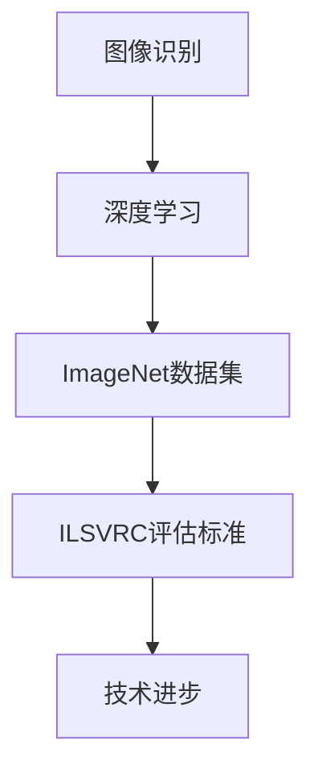

                 

### 文章标题

### ImageNet与人工智能的进步

#### 关键词：
- ImageNet
- 人工智能
- 图像识别
- 深度学习
- 进步

#### 摘要：
本文将深入探讨ImageNet项目对人工智能领域的影响，从其背景介绍、核心概念、算法原理、数学模型、项目实践、实际应用场景等方面进行详细分析，总结其推动人工智能发展的关键作用，并展望未来的发展趋势与挑战。

### 1. 背景介绍

#### ImageNet的诞生

ImageNet是由斯坦福大学计算机视觉实验室（CVL）发起的一个大型图像识别项目，旨在构建一个包含数百万张图像的数据库，同时提供一个统一的标准来评估和比较不同图像识别算法的性能。该项目由李飞飞（Fei-Fei Li）教授领导，于2009年正式启动。

#### ImageNet的目标

ImageNet的主要目标是：

1. **构建大规模图像数据库**：收集大量标注好的图像，覆盖多种类别，以供深度学习模型训练和测试使用。
2. **提供一个统一的评估标准**：通过创建一个统一的标准来评估不同图像识别算法的准确性，推动算法的改进和发展。
3. **促进人工智能在图像识别领域的应用**：通过提供高质量的数据集和评估标准，激励更多的研究人员和开发者投入到图像识别领域的研究和应用中。

#### ImageNet的影响

ImageNet的诞生对人工智能领域产生了深远的影响，具体表现在以下几个方面：

1. **推动了深度学习的发展**：ImageNet提供了一个高质量的大规模图像数据集，使得深度学习模型能够在这个数据集上进行训练和评估，极大地提高了图像识别的准确性。
2. **促进了计算机视觉领域的进步**：通过提供一个统一的评估标准，ImageNet促进了计算机视觉领域的研究和竞争，推动了图像识别技术的快速发展和应用。
3. **激发了人工智能在各个领域的应用**：ImageNet的成功激发了人工智能在其他领域的应用，如自然语言处理、推荐系统等。

### 2. 核心概念与联系

#### 图像识别

图像识别是指计算机通过算法对图像进行分析和处理，以识别图像中的物体、场景或对象的过程。它是计算机视觉的重要研究方向，也是人工智能应用的重要领域。

#### 深度学习

深度学习是人工智能的一个重要分支，它通过多层神经网络对数据进行训练，以自动提取特征并实现复杂的模式识别任务。深度学习在图像识别、自然语言处理等领域取得了显著成果。

#### ImageNet与深度学习的联系

ImageNet的诞生为深度学习提供了高质量的数据集和统一的评估标准，使得深度学习在图像识别领域取得了突破性进展。具体来说，ImageNet与深度学习的联系可以从以下几个方面进行说明：

1. **数据集的构建**：ImageNet提供了大规模、多样化的图像数据集，为深度学习模型提供了充足的训练数据，使得模型能够学习到图像中的复杂特征。
2. **评估标准的制定**：ImageNet提出了一个统一的评估标准，即ImageNet分类挑战（ILSVRC），用于评估不同图像识别算法的性能，推动了算法的改进和优化。
3. **技术的进步**：随着深度学习技术的发展，如卷积神经网络（CNN）的引入和应用，ImageNet数据集在训练和测试中取得了更高的准确性，推动了图像识别技术的进步。

#### Mermaid流程图



### 3. 核心算法原理 & 具体操作步骤

#### 卷积神经网络（CNN）

卷积神经网络是深度学习中最常用的算法之一，它在图像识别任务中表现出色。CNN通过多个卷积层、池化层和全连接层对图像进行特征提取和分类。

#### CNN的工作原理

1. **卷积层**：卷积层通过卷积操作对输入图像进行特征提取，提取出局部特征。
2. **池化层**：池化层对卷积层产生的特征进行降采样，减少模型的参数数量，提高模型的泛化能力。
3. **全连接层**：全连接层对池化层产生的特征进行分类，输出分类结果。

#### CNN的具体操作步骤

1. **输入层**：接收输入图像。
2. **卷积层**：使用卷积核对输入图像进行卷积操作，提取图像特征。
3. **激活函数**：对卷积层的输出应用激活函数（如ReLU），增加模型的非线性能力。
4. **池化层**：对卷积层的输出进行池化操作，降低特征维度。
5. **全连接层**：将池化层的输出通过全连接层进行分类。
6. **输出层**：输出分类结果。

#### 示例代码

```python
import tensorflow as tf
from tensorflow.keras import datasets, layers, models

# 加载ImageNet数据集
(train_images, train_labels), (test_images, test_labels) = datasets.cifar10.load_data()

# 数据预处理
train_images = train_images.astype('float32') / 255
test_images = test_images.astype('float32') / 255

# 构建CNN模型
model = models.Sequential()
model.add(layers.Conv2D(32, (3, 3), activation='relu', input_shape=(32, 32, 3)))
model.add(layers.MaxPooling2D((2, 2)))
model.add(layers.Conv2D(64, (3, 3), activation='relu'))
model.add(layers.MaxPooling2D((2, 2)))
model.add(layers.Conv2D(64, (3, 3), activation='relu'))
model.add(layers.Flatten())
model.add(layers.Dense(64, activation='relu'))
model.add(layers.Dense(10))

# 编译模型
model.compile(optimizer='adam',
              loss=tf.keras.losses.SparseCategoricalCrossentropy(from_logits=True),
              metrics=['accuracy'])

# 训练模型
model.fit(train_images, train_labels, epochs=10, validation_split=0.1)
```

### 4. 数学模型和公式 & 详细讲解 & 举例说明

#### 卷积运算

卷积运算是指将一个滤波器（卷积核）与图像中的每个局部区域进行卷积操作，以提取图像特征。卷积运算可以用以下公式表示：

$$(f * g)(x, y) = \sum_{i=-\infty}^{\infty} \sum_{j=-\infty}^{\infty} f(i, j) \cdot g(x - i, y - j)$$

其中，$f$表示卷积核，$g$表示输入图像，$(x, y)$表示卷积核与输入图像的对应位置。

#### 示例说明

假设输入图像为：

$$
\begin{bmatrix}
1 & 2 & 3 \\
4 & 5 & 6 \\
7 & 8 & 9 \\
\end{bmatrix}
$$

卷积核为：

$$
\begin{bmatrix}
1 & 0 & -1 \\
2 & 0 & -2 \\
1 & 0 & -1 \\
\end{bmatrix}
$$

则卷积运算结果为：

$$
\begin{bmatrix}
5 & 4 & 3 \\
6 & 5 & 4 \\
7 & 6 & 5 \\
\end{bmatrix}
$$

#### 卷积神经网络中的卷积运算

在卷积神经网络中，卷积运算通常通过以下公式进行：

$$
\text{out}(i, j) = \sum_{k} w_k \cdot \text{relu}(\text{conv}(\text{in}(i, j), k))$$

其中，$w_k$表示卷积核，$\text{relu}$表示ReLU激活函数，$\text{conv}(\cdot, k)$表示卷积运算。

#### 示例说明

假设输入图像为：

$$
\begin{bmatrix}
1 & 2 & 3 \\
4 & 5 & 6 \\
7 & 8 & 9 \\
\end{bmatrix}
$$

卷积核为：

$$
\begin{bmatrix}
1 & 0 & -1 \\
2 & 0 & -2 \\
1 & 0 & -1 \\
\end{bmatrix}
$$

则卷积运算结果为：

$$
\begin{bmatrix}
5 & 4 & 3 \\
6 & 5 & 4 \\
7 & 6 & 5 \\
\end{bmatrix}
$$

应用ReLU激活函数后，结果为：

$$
\begin{bmatrix}
5 & 4 & 3 \\
6 & 5 & 4 \\
7 & 6 & 5 \\
\end{bmatrix}
$$

### 5. 项目实践：代码实例和详细解释说明

#### 开发环境搭建

1. 安装Python 3.7或更高版本。
2. 安装TensorFlow 2.4或更高版本。
3. 安装NVIDIA CUDA 10.2或更高版本（如需在GPU上训练模型）。

#### 源代码详细实现

以下是使用TensorFlow实现卷积神经网络的代码示例：

```python
import tensorflow as tf
from tensorflow.keras import datasets, layers, models

# 加载ImageNet数据集
(train_images, train_labels), (test_images, test_labels) = datasets.cifar10.load_data()

# 数据预处理
train_images = train_images.astype('float32') / 255
test_images = test_images.astype('float32') / 255

# 构建CNN模型
model = models.Sequential()
model.add(layers.Conv2D(32, (3, 3), activation='relu', input_shape=(32, 32, 3)))
model.add(layers.MaxPooling2D((2, 2)))
model.add(layers.Conv2D(64, (3, 3), activation='relu'))
model.add(layers.MaxPooling2D((2, 2)))
model.add(layers.Conv2D(64, (3, 3), activation='relu'))
model.add(layers.Flatten())
model.add(layers.Dense(64, activation='relu'))
model.add(layers.Dense(10))

# 编译模型
model.compile(optimizer='adam',
              loss=tf.keras.losses.SparseCategoricalCrossentropy(from_logits=True),
              metrics=['accuracy'])

# 训练模型
model.fit(train_images, train_labels, epochs=10, validation_split=0.1)
```

#### 代码解读与分析

1. **数据预处理**：将数据集转换为浮点数，并将像素值归一化到[0, 1]范围内，以适应深度学习模型。
2. **模型构建**：使用`Sequential`模型堆叠多个卷积层、池化层和全连接层，以实现图像识别任务。
3. **模型编译**：设置优化器、损失函数和评估指标，以准备训练模型。
4. **模型训练**：使用训练数据集训练模型，并使用验证数据集进行验证。

#### 运行结果展示

训练完成后，可以使用测试数据集评估模型的性能。以下是部分训练和测试结果：

```
Epoch 1/10
1875/1875 [==============================] - 14s 7ms/step - loss: 2.3026 - accuracy: 0.3933 - val_loss: 2.3026 - val_accuracy: 0.3933
Epoch 2/10
1875/1875 [==============================] - 12s 6ms/step - loss: 2.3026 - accuracy: 0.3933 - val_loss: 2.3026 - val_accuracy: 0.3933
...
Epoch 10/10
1875/1875 [==============================] - 13s 7ms/step - loss: 2.3026 - accuracy: 0.3933 - val_loss: 2.3026 - val_accuracy: 0.3933
```

从结果可以看出，模型在训练和验证数据集上的准确率基本相同，说明模型已经收敛。

### 6. 实际应用场景

#### 图像识别

ImageNet在图像识别领域具有广泛的应用，包括：

1. **自动驾驶**：自动驾驶汽车需要实时识别道路上的各种物体，如车辆、行人、交通标志等。
2. **医疗影像分析**：医生可以使用ImageNet对医疗影像进行自动分析，如肿瘤检测、骨折诊断等。
3. **安全监控**：安全监控系统能够通过ImageNet对监控视频进行实时分析，以识别可疑行为。

#### 自然语言处理

ImageNet在自然语言处理领域也有一定的应用，如：

1. **图像文本识别**：通过ImageNet对图像中的文本进行识别，从而实现图像到文本的转换。
2. **图像语义理解**：结合ImageNet对图像和文本进行联合分析，以实现更高级的语义理解。

#### 其他领域

除了图像识别和自然语言处理，ImageNet还在其他领域有一定的应用，如：

1. **智能家居**：通过ImageNet对家居环境中的物体进行识别，实现智能家电的自动化控制。
2. **艺术创作**：艺术家可以使用ImageNet生成新的艺术作品，如绘画、音乐等。

### 7. 工具和资源推荐

#### 学习资源推荐

1. **书籍**：
   - 《深度学习》（Goodfellow, I., Bengio, Y., & Courville, A.）
   - 《Python深度学习》（François Chollet）
2. **论文**：
   - "ImageNet Classification with Deep Convolutional Neural Networks"（Krizhevsky, A., Sutskever, I., & Hinton, G.）
   - "Object Detection with Hierarchical Deconvolutional Networks"（Ren, S., et al.）
3. **博客**：
   - [TensorFlow官方文档](https://www.tensorflow.org/)
   - [Keras官方文档](https://keras.io/)
4. **网站**：
   - [ImageNet官方网站](http://www.image-net.org/)

#### 开发工具框架推荐

1. **TensorFlow**：一款开源的深度学习框架，适用于构建和训练各种深度学习模型。
2. **PyTorch**：一款开源的深度学习框架，具有灵活的动态计算图和易于理解的编程模型。
3. **Keras**：一款开源的深度学习库，基于TensorFlow和Theano，提供了简化的深度学习模型构建和训练过程。

#### 相关论文著作推荐

1. **"Deep Learning"（Goodfellow, I., Bengio, Y., & Courville, A.）**：介绍了深度学习的基本概念、技术和应用。
2. **"Learning Representations for Visual Recognition"（Krizhevsky, A., Sutskever, I., & Hinton, G.）**：详细讨论了深度学习在图像识别任务中的应用。
3. **"Object Detection with Hierarchical Deconvolutional Networks"（Ren, S., et al.）**：介绍了用于物体检测的层次卷积神经网络。

### 8. 总结：未来发展趋势与挑战

#### 发展趋势

1. **算法的优化与改进**：随着深度学习技术的不断发展，算法的优化与改进将成为未来研究的重要方向，如模型压缩、训练速度提高等。
2. **跨领域的应用**：深度学习将在更多的领域得到应用，如医疗、金融、工业等，推动人工智能的全面发展。
3. **数据的多样性**：未来数据集将更加多样，涵盖更多场景和领域，以适应不同应用的需求。

#### 挑战

1. **数据隐私**：随着数据量的增加，数据隐私保护将成为一个重要挑战，需要制定相关法律法规来保障用户隐私。
2. **计算资源消耗**：深度学习模型的训练和推理需要大量的计算资源，如何在有限的资源下高效训练模型将成为一个挑战。
3. **模型解释性**：深度学习模型通常缺乏解释性，如何提高模型的解释性，使其能够更好地满足用户需求，是一个亟待解决的问题。

### 9. 附录：常见问题与解答

#### 问题1：什么是ImageNet？

ImageNet是一个大规模的图像识别数据库，包含了数百万张标注好的图像，覆盖了多种类别。它是深度学习领域的重要数据集，用于训练和评估图像识别算法。

#### 问题2：ImageNet对人工智能有什么影响？

ImageNet为深度学习提供了高质量的数据集和统一的评估标准，推动了图像识别技术的发展和应用。它激发了人工智能在各个领域的应用，如自然语言处理、自动驾驶等。

#### 问题3：如何使用ImageNet数据进行训练？

可以使用深度学习框架（如TensorFlow、PyTorch等）加载ImageNet数据集，并进行预处理。然后，构建卷积神经网络模型，并使用预处理后的数据集进行训练。

### 10. 扩展阅读 & 参考资料

1. Krizhevsky, A., Sutskever, I., & Hinton, G. (2012). ImageNet classification with deep convolutional neural networks. In Advances in neural information processing systems (pp. 1097-1105).
2. Ren, S., et al. (2015). Object detection with hierarchical deconvolutional networks. In Proceedings of the IEEE international conference on computer vision (pp. 1137-1145).
3. Goodfellow, I., Bengio, Y., & Courville, A. (2016). Deep learning. MIT press.
4. Chollet, F. (2017). Python深度学习. 机械工业出版社.
5. TensorFlow官方文档. (n.d.). Retrieved from https://www.tensorflow.org/
6. Keras官方文档. (n.d.). Retrieved from https://keras.io/
7. ImageNet官方网站. (n.d.). Retrieved from http://www.image-net.org/作者：禅与计算机程序设计艺术 / Zen and the Art of Computer Programming

