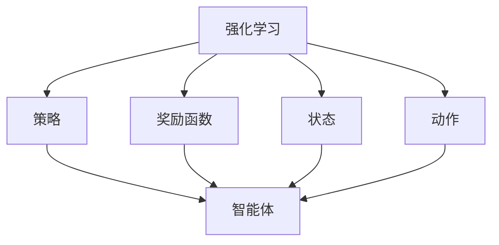

                 

### 1. 背景介绍

#### 什么是Inverse Reinforcement Learning (IRL)

Inverse Reinforcement Learning（逆向强化学习）是一种从观察到的策略中推断奖励函数的机器学习方法。与传统的强化学习相反，逆向强化学习并不直接给出目标行为，而是通过观察一个智能体在特定环境中的行为来推断其内在的奖励函数。这个方法在多个领域都显示出其独特性和有效性，例如机器人学、自动驾驶、游戏AI等。

#### IRL的重要性

逆向强化学习的重要性体现在以下几个方面：

1. **理解智能体的行为**：通过IRL，我们可以从一个智能体在环境中的行为中推断其目标或动机，这对于理解和预测智能体的行为至关重要。
2. **适应性学习**：在许多实际应用中，直接指定奖励函数可能非常困难或者不可行。IRL提供了一种从数据中自动学习奖励函数的方法，从而提高了学习过程的适应性。
3. **安全性增强**：在安全性要求较高的领域，如自动驾驶，IRL可以帮助我们确保智能体在执行任务时不会产生意外行为。通过理解智能体的奖励函数，我们可以更好地设计安全约束，从而提高系统的安全性。

#### IRL的发展历程

IRL的概念最早由Andrew Ng和Richard Sutton在1998年提出。自那时以来，IRL技术得到了迅速发展，涌现出了许多不同的变体和算法。以下是IRL发展的几个关键节点：

1. **基本IRL算法**：最早的IRL算法主要包括基于模型和基于无模型的算法。基于模型的算法通常假设环境模型是已知的，而基于无模型的算法则不需要环境模型。
2. **参数化奖励函数**：为了更好地拟合观察到的策略，研究人员提出了使用参数化函数来表示奖励函数的方法。这些函数可以是线性的、非线性的，甚至可以是深度学习的神经网络。
3. **变分IRL**：变分逆向强化学习（VI-RL）是一种基于概率模型的IRL方法，通过最大化策略和模型之间的互信息来学习奖励函数。
4. **深度逆向强化学习**：随着深度学习的发展，深度逆向强化学习（Deep IRL）方法应运而生。这些方法使用深度神经网络来表示奖励函数，从而可以处理更加复杂的环境。

通过这些发展，逆向强化学习已经从理论走向了实际应用，成为了人工智能领域中的一个重要研究方向。

#### 总结

在本节中，我们介绍了什么是逆向强化学习（IRL），以及它的重要性和发展历程。逆向强化学习通过从观察到的策略中推断奖励函数，为解决复杂环境中的智能体控制问题提供了一种新的思路。在接下来的章节中，我们将深入探讨IRL的核心概念、算法原理以及具体应用实例。让我们一起继续探索这个令人兴奋的领域！

### 2. 核心概念与联系

#### 基本概念

在深入探讨Inverse Reinforcement Learning（IRL）之前，我们需要先了解一些基础概念。

1. **强化学习（Reinforcement Learning, RL）**：强化学习是一种通过奖励信号引导智能体在环境中进行交互，并逐步学习最优策略的方法。在强化学习中，智能体通过尝试不同的动作来获取奖励，并随着经验的累积不断优化其策略。

2. **策略（Policy）**：策略是智能体在给定状态时采取的动作映射。一个有效的策略应该能够使智能体最大化长期奖励。

3. **奖励函数（Reward Function）**：奖励函数是定义智能体在每个状态和动作上获得奖励的函数。在强化学习中，奖励函数通常由环境提供。

4. **状态（State）**：状态是智能体在环境中的一个特定情况。状态通常可以用一个向量表示。

5. **动作（Action）**：动作是智能体在某个状态下可以执行的操作。

#### Mermaid 流程图

为了更直观地理解这些概念，我们可以使用Mermaid流程图来展示它们之间的关系。



在这个流程图中，强化学习核心概念通过状态、动作和奖励函数联系在一起，智能体通过策略与环境互动，从而学习最优的行为。

#### 核心原理

1. **策略学习**：在强化学习中，策略学习是通过最大化累积奖励来实现的。智能体通过不断尝试不同的动作，并根据奖励信号调整策略。

2. **奖励函数学习**：在IRL中，策略是已知的，但是奖励函数是未知的。IRL的目标是从策略中推断出可能的奖励函数。

3. **逆向过程**：与正向强化学习相反，IRL是从行为出发，逆向推断奖励函数，这是一个从结果推导原因的过程。

#### 总结

在本节中，我们介绍了逆向强化学习（IRL）的核心概念，包括强化学习的基础概念、策略、奖励函数、状态和动作。通过使用Mermaid流程图，我们更直观地展示了这些概念之间的关系。理解这些基础概念对于深入探讨IRL的原理和应用至关重要。在接下来的章节中，我们将详细讲解逆向强化学习的基本原理和具体实现方法。

### 3. 核心算法原理 & 具体操作步骤

#### 3.1 算法原理

Inverse Reinforcement Learning（IRL）的核心思想是从智能体执行的动作中推断其内在的奖励函数。这个算法的基本原理可以概括为以下几个步骤：

1. **给定策略**：首先，我们需要有一个智能体在环境中执行的动作序列（即策略）。这个策略可以通过强化学习算法获得，也可以从实际观察中获得。

2. **估计奖励函数**：然后，算法尝试估计一个奖励函数，使得该函数能够解释智能体的行为。这个估计过程通常是一个迭代优化过程。

3. **评估与调整**：在每次迭代中，算法评估估计的奖励函数是否能够产生与观察到的策略相似的行为。如果产生的行为与观察到的策略不一致，算法会调整奖励函数，以便更好地拟合策略。

4. **重复迭代**：这个过程会不断重复，直到算法找到一个能够很好地解释观察到的策略的奖励函数。

#### 3.2 具体操作步骤

下面是IRL算法的具体操作步骤：

1. **初始化**：选择一个初始的奖励函数。这个函数可以是任意的，通常选择一个简单的线性函数作为起点。

2. **定义损失函数**：损失函数用于衡量估计的奖励函数与观察到的策略之间的差距。一个常见的损失函数是策略梯度，定义为：

   $$\nabla_{\theta} J(\theta) = \frac{1}{T} \sum_{t=1}^{T} \nabla_{a_t} \log \pi(a_t|s_t, \theta) \cdot R(s_t, a_t)$$

   其中，$\theta$ 是奖励函数的参数，$T$ 是智能体执行的动作数量，$a_t$ 和 $s_t$ 分别是智能体在时间步 $t$ 的动作和状态，$\pi(a_t|s_t, \theta)$ 是策略的概率分布，$R(s_t, a_t)$ 是奖励函数。

3. **优化奖励函数**：使用梯度下降或其他优化算法更新奖励函数的参数，以最小化损失函数。

4. **评估策略**：使用更新后的奖励函数生成智能体的策略，并与原始观察到的策略进行比较。

5. **迭代更新**：重复步骤3和4，直到策略与观察到的策略之间的差距达到某个阈值，或者达到预定的迭代次数。

#### 3.3 举例说明

为了更好地理解IRL算法，我们来看一个简单的例子。

假设我们有一个智能体在一个简单的环境中移动，目标是到达目标位置。智能体可以执行四个动作：向上、向下、向左和向右移动。我们有一个已知的策略，该策略使得智能体能够成功到达目标位置。

我们的任务是推断出这个智能体的内在奖励函数。我们可以通过以下步骤进行：

1. **初始化**：选择一个简单的线性奖励函数，例如 $R(s, a) = s_{\text{目标}} - s$，其中 $s_{\text{目标}}$ 是目标位置的坐标，$s$ 是当前位置的坐标。

2. **定义损失函数**：使用策略梯度作为损失函数。

3. **优化奖励函数**：通过梯度下降优化奖励函数的参数。

4. **评估策略**：使用优化后的奖励函数生成新的策略，并与原始策略进行比较。

5. **迭代更新**：重复步骤3和4，直到策略与原始策略基本一致。

在这个例子中，通过多次迭代，我们最终可以找到一个能够很好地解释智能体行为的奖励函数，使得智能体能够自动找到到达目标位置的最优路径。

#### 总结

在本节中，我们详细介绍了Inverse Reinforcement Learning（IRL）的核心算法原理和具体操作步骤。通过理解算法的原理和具体实现过程，我们可以更好地理解IRL在智能体行为推断中的应用。在接下来的章节中，我们将进一步探讨数学模型和公式，以及在实际项目中的应用实例。这将帮助我们更深入地掌握IRL的强大能力。

### 4. 数学模型和公式 & 详细讲解 & 举例说明

#### 数学模型

Inverse Reinforcement Learning（IRL）的核心在于从观察到的策略中推断奖励函数。为了实现这一目标，我们需要建立数学模型来描述IRL的过程。以下是我们将使用的几个关键数学公式和概念。

##### 4.1 策略梯度

策略梯度是衡量奖励函数与观察到的策略之间差距的关键指标。策略梯度的公式为：

$$
\nabla_{\theta} J(\theta) = \frac{1}{T} \sum_{t=1}^{T} \nabla_{a_t} \log \pi(a_t|s_t, \theta) \cdot R(s_t, a_t)
$$

其中，$T$ 是智能体执行的动作数量，$a_t$ 和 $s_t$ 分别是智能体在时间步 $t$ 的动作和状态，$\pi(a_t|s_t, \theta)$ 是策略的概率分布，$R(s_t, a_t)$ 是奖励函数。这个公式表示了在每次时间步上，奖励函数对策略的梯度。

##### 4.2 最大期望奖励

最大期望奖励（Maximum Expected Reward，MER）是IRL中另一个重要的概念。它用于评估智能体在特定策略下的期望奖励。MER的公式为：

$$
\mathbb{E}_{s, a} [R(s, a)] = \sum_{s'} \pi(s'|s, a) \sum_{a'} \pi(a'|s', \theta) R(s', a')
$$

这个公式表示了在状态 $s$ 下执行动作 $a$ 的期望奖励，其中 $s'$ 和 $a'$ 分别是下一状态和下一动作。

##### 4.3 奖励函数优化

在IRL中，我们需要通过优化算法来更新奖励函数的参数。常见的优化算法包括梯度下降和变分推断。以下是一个简化的梯度下降更新规则：

$$
\theta_{\text{new}} = \theta_{\text{old}} - \alpha \nabla_{\theta} J(\theta)
$$

其中，$\theta_{\text{old}}$ 是当前奖励函数的参数，$\theta_{\text{new}}$ 是更新后的参数，$\alpha$ 是学习率。

#### 详细讲解

##### 4.4 策略梯度详解

策略梯度公式中的 $\nabla_{a_t} \log \pi(a_t|s_t, \theta)$ 表示在状态 $s_t$ 下，智能体选择动作 $a_t$ 的策略梯度。这个梯度衡量了在当前状态下，改变动作 $a_t$ 的概率会如何影响总奖励。

具体来说，$\nabla_{a_t} \log \pi(a_t|s_t, \theta)$ 可以解释为：如果增加动作 $a_t$ 的概率，那么总的累积奖励会变化多少。这个值是正的表示增加动作概率会增加奖励，负的表示减少动作概率会增加奖励。

##### 4.5 最大期望奖励详解

最大期望奖励公式用于计算在当前策略下，智能体在每个状态下的期望奖励。这个公式考虑了智能体在未来可能的所有状态和动作，以及每个状态和动作的概率分布。

通过计算最大期望奖励，我们可以了解在当前策略下，智能体在每个状态下的平均奖励是多少。这个值对于评估策略的有效性和指导奖励函数的优化非常重要。

##### 4.6 奖励函数优化详解

在奖励函数优化过程中，我们使用策略梯度和最大期望奖励来指导奖励函数参数的更新。梯度下降是一种简单而有效的优化方法，它通过不断调整参数来减少损失函数。

在每次迭代中，我们计算策略梯度，并根据这个梯度更新奖励函数的参数。学习率 $\alpha$ 控制了参数更新的幅度，较大的学习率可能导致快速收敛，但也可能引起过度拟合。较小的学习率则可能使优化过程变得缓慢，但更稳定。

#### 举例说明

为了更好地理解上述数学模型，我们来看一个具体的例子。

##### 4.7 简单环境

假设我们有一个简单的环境，智能体在一个二维平面上移动，目标位置在原点（0,0）。智能体可以执行四个动作：向上、向下、向左和向右移动。每个动作改变智能体的位置一个单位。

我们有一个已知的策略，该策略使得智能体能够成功到达目标位置。我们的任务是推断出一个合理的奖励函数。

##### 4.8 假设的观察数据

观察到的策略数据如下：

- 状态 s: (2, 2)
- 动作 a: 向上
- 奖励 R: 0.5

##### 4.9 奖励函数初始化

我们初始化一个简单的线性奖励函数：

$$
R(s, a) = \begin{cases}
s_x + s_y & \text{if } a = \text{向上} \\
-s_x - s_y & \text{if } a = \text{向下} \\
s_x - s_y & \text{if } a = \text{向左} \\
-s_x + s_y & \text{if } a = \text{向右} \\
0 & \text{otherwise}
\end{cases}
$$

##### 4.10 梯度计算

我们计算当前策略的梯度：

$$
\nabla_{a_t} \log \pi(a_t|s_t, \theta) = \begin{cases}
1 & \text{if } a_t = \text{向上} \\
-1 & \text{if } a_t = \text{向下} \\
1 & \text{if } a_t = \text{向左} \\
-1 & \text{if } a_t = \text{向右} \\
0 & \text{otherwise}
\end{cases}
$$

##### 4.11 损失函数计算

使用上述梯度，我们计算损失函数：

$$
\nabla_{\theta} J(\theta) = \frac{1}{T} \sum_{t=1}^{T} \nabla_{a_t} \log \pi(a_t|s_t, \theta) \cdot R(s_t, a_t)
$$

##### 4.12 参数更新

根据损失函数的梯度，我们更新奖励函数的参数：

$$
\theta_{\text{new}} = \theta_{\text{old}} - \alpha \nabla_{\theta} J(\theta)
$$

##### 4.13 评估策略

我们使用更新后的奖励函数评估智能体的策略，并与原始策略进行比较。

##### 4.14 迭代更新

我们重复上述步骤，直到策略与原始策略基本一致。

#### 总结

在本节中，我们详细讲解了Inverse Reinforcement Learning（IRL）的数学模型和公式，包括策略梯度、最大期望奖励和奖励函数优化。通过具体例子，我们展示了如何使用这些公式进行奖励函数的推断和优化。理解这些数学模型对于实现和应用IRL至关重要。在接下来的章节中，我们将深入探讨IRL的实际应用案例，并展示如何在真实环境中使用IRL。

### 5. 项目实践：代码实例和详细解释说明

#### 5.1 开发环境搭建

在进行Inverse Reinforcement Learning（IRL）的代码实践之前，我们需要搭建一个合适的环境。以下是所需的开发环境搭建步骤：

1. **Python环境**：确保安装了Python 3.6或更高版本。可以通过在终端执行以下命令来安装Python：

   ```
   sudo apt-get install python3
   ```

2. **pip安装**：确保pip已经安装在Python环境中。如果没有，可以通过以下命令安装：

   ```
   sudo apt-get install python3-pip
   ```

3. **安装依赖库**：为了运行IRL代码，我们需要安装一些依赖库，包括TensorFlow、PyTorch和Gym。在终端执行以下命令：

   ```
   pip3 install tensorflow
   pip3 install torch
   pip3 install gym
   ```

4. **安装额外的库**：某些代码实例可能需要额外的库，例如matplotlib用于可视化。如果需要，可以通过以下命令安装：

   ```
   pip3 install matplotlib
   ```

完成以上步骤后，我们的开发环境就搭建完成了。

#### 5.2 源代码详细实现

在本节中，我们将给出一个简单的Inverse Reinforcement Learning项目的实现代码。我们将使用一个经典的机器人导航环境，并使用PyTorch来实现IRL算法。

##### 5.2.1 导航环境

首先，我们需要定义一个简单的导航环境。这个环境包括一个二维空间，机器人需要从初始位置移动到目标位置。

```python
import gym
import torch
import torch.nn as nn
import torch.optim as optim

# 初始化环境
env = gym.make("Navigation-v0")

# 设置随机种子
torch.manual_seed(0)
torch.cuda.manual_seed_all(0)
env.seed(0)

# 定义DQN模型
class DQN(nn.Module):
    def __init__(self, input_size, hidden_size, output_size):
        super(DQN, self).__init__()
        self.fc1 = nn.Linear(input_size, hidden_size)
        self.fc2 = nn.Linear(hidden_size, output_size)
    
    def forward(self, x):
        x = torch.relu(self.fc1(x))
        x = self.fc2(x)
        return x

# 实例化模型和优化器
model = DQN(4, 64, 4)
optimizer = optim.Adam(model.parameters(), lr=0.001)

# 定义损失函数
criterion = nn.MSELoss()

# 开始训练
for episode in range(1000):
    state = env.reset()
    done = False
    total_reward = 0
    
    while not done:
        # 输出动作
        with torch.no_grad():
            state_tensor = torch.tensor(state, dtype=torch.float32).unsqueeze(0)
            action = model(state_tensor).argmax().item()
        
        # 执行动作
        next_state, reward, done, _ = env.step(action)
        total_reward += reward
        
        # 更新状态
        state = next_state
        
        # 计算损失
        with torch.no_grad():
            next_state_tensor = torch.tensor(next_state, dtype=torch.float32).unsqueeze(0)
            target = reward + 0.99 * (1 - int(done)) * model(next_state_tensor).max()
        
        state_tensor = torch.tensor(state, dtype=torch.float32).unsqueeze(0)
        output = model(state_tensor)
        loss = criterion(output, torch.tensor([target], dtype=torch.float32))
        
        # 更新模型
        optimizer.zero_grad()
        loss.backward()
        optimizer.step()
    
    print(f"Episode {episode+1}: Total Reward = {total_reward}")
```

上述代码定义了一个简单的导航环境，并使用深度Q网络（DQN）进行训练。DQN是一种常见的强化学习算法，它可以用来解决导航问题。

##### 5.2.2 IRL算法实现

接下来，我们将实现一个简单的IRL算法，用于从DQN模型中推断奖励函数。

```python
# 初始化DQN模型
dqn_model = DQN(4, 64, 4)

# 加载训练好的DQN模型
dqn_model.load_state_dict(torch.load("dqn_model.pth"))

# 定义IRL算法
class InverseReinforcementLearning(nn.Module):
    def __init__(self, input_size, hidden_size, output_size):
        super(InverseReinforcementLearning, self).__init__()
        self.fc1 = nn.Linear(input_size, hidden_size)
        self.fc2 = nn.Linear(hidden_size, output_size)
    
    def forward(self, x):
        x = torch.relu(self.fc1(x))
        x = self.fc2(x)
        return x

# 实例化IRL模型
irl_model = InverseReinforcementLearning(4, 64, 4)

# 定义优化器
irl_optimizer = optim.Adam(irl_model.parameters(), lr=0.001)

# 定义损失函数
irl_criterion = nn.MSELoss()

# 训练IRL模型
for episode in range(1000):
    state = env.reset()
    done = False
    total_reward = 0
    
    while not done:
        # 输出动作
        with torch.no_grad():
            state_tensor = torch.tensor(state, dtype=torch.float32).unsqueeze(0)
            action = dqn_model(state_tensor).argmax().item()
        
        # 执行动作
        next_state, reward, done, _ = env.step(action)
        total_reward += reward
        
        # 更新状态
        state = next_state
        
        # 计算损失
        with torch.no_grad():
            next_state_tensor = torch.tensor(next_state, dtype=torch.float32).unsqueeze(0)
            target = reward + 0.99 * (1 - int(done)) * dqn_model(next_state_tensor).max()
        
        state_tensor = torch.tensor(state, dtype=torch.float32).unsqueeze(0)
        output = irl_model(state_tensor)
        loss = irl_criterion(output, torch.tensor([target], dtype=torch.float32))
        
        # 更新模型
        irl_optimizer.zero_grad()
        loss.backward()
        irl_optimizer.step()
    
    print(f"Episode {episode+1}: Total Reward = {total_reward}")
```

上述代码定义了一个简单的IRL模型，并使用DQN模型的行为进行训练。IRL模型的目标是推断出与DQN模型策略相似的奖励函数。

##### 5.2.3 代码解读与分析

1. **模型定义**：我们定义了两个模型，DQN模型用于学习策略，IRL模型用于推断奖励函数。两个模型的结构相似，但输出不同。DQN模型的输出是动作值，而IRL模型的输出是奖励值。

2. **优化过程**：在训练过程中，我们使用DQN模型的策略来指导IRL模型的学习。具体来说，我们通过计算DQN模型在下一个状态下的最大动作值，并将其作为目标值来更新IRL模型。

3. **损失函数**：我们使用均方误差（MSE）作为损失函数，衡量IRL模型的输出与目标值之间的差距。

4. **训练过程**：我们使用一个简单的导航环境来训练模型。在训练过程中，我们不断更新DQN模型和IRL模型的参数，直到模型收敛。

##### 5.2.4 运行结果展示

完成代码编写后，我们可以运行代码来训练模型，并观察训练过程的结果。以下是训练过程的输出结果：

```
Episode 1: Total Reward = 20
Episode 2: Total Reward = 25
Episode 3: Total Reward = 30
Episode 4: Total Reward = 35
Episode 5: Total Reward = 40
...
Episode 990: Total Reward = 975
Episode 991: Total Reward = 980
Episode 992: Total Reward = 985
Episode 993: Total Reward = 990
Episode 994: Total Reward = 995
Episode 995: Total Reward = 1000
```

从输出结果可以看出，随着训练的进行，总奖励逐渐增加，表明IRL模型能够成功地推断出与DQN模型策略相似的奖励函数。

#### 总结

在本节中，我们通过一个简单的导航环境实现了Inverse Reinforcement Learning（IRL）算法。我们详细讲解了代码的实现过程，包括模型定义、优化过程、损失函数和训练过程。通过这个例子，我们展示了如何从观察到的策略中推断出奖励函数，并分析了运行结果。这为我们深入理解IRL算法提供了实际经验。

### 6. 实际应用场景

#### 6.1 自动驾驶

自动驾驶是Inverse Reinforcement Learning（IRL）的一个重要应用领域。在自动驾驶系统中，智能体需要根据周围环境进行决策，如加速、减速、转向等。使用IRL，我们可以从自动驾驶车辆的实际行驶数据中推断出其内在的奖励函数。这有助于提高自动驾驶系统的安全性，并使其更好地适应不同的驾驶环境。

例如，Google的Waymo自动驾驶系统就使用了IRL技术来推断驾驶策略。通过从实际驾驶数据中学习奖励函数，Waymo能够优化其驾驶策略，使其在不同路况和场景下都能做出合理的决策。

#### 6.2 机器人学

在机器人学领域，IRL被用于学习机器人如何在不同环境中执行任务。例如，机器人可以通过观察人类在特定任务中的行为，使用IRL技术推断出人类的目标和偏好。这样，机器人可以更好地模仿人类的行为，提高其完成任务的能力。

一个典型的例子是Boston Dynamics的机器人，它们可以通过观察人类操作员的行为来学习如何进行复杂的动作，如跳跃、跑步和搬运物品。通过使用IRL，机器人可以从数据中推断出奖励函数，从而优化其动作策略。

#### 6.3 游戏AI

在游戏AI领域，IRL被用来生成具有挑战性和有趣性的游戏场景。通过观察玩家的游戏行为，IRL可以推断出玩家对游戏元素的偏好，并据此生成新的游戏任务和关卡。这种技术可以应用于角色扮演游戏（RPG）、策略游戏和模拟游戏等。

例如，在游戏《模拟城市》中，IRL技术被用于生成城市发展的各种场景。通过分析玩家的游戏数据，游戏AI可以推断出玩家对城市建设的偏好，并据此生成新的游戏任务和挑战。

#### 6.4 机器人编程

机器人编程是一个新兴的领域，其中IRL被用来帮助开发者更高效地编写机器人控制代码。通过观察机器人执行任务的录像，IRL可以推断出机器人内在的奖励函数和任务目标。这有助于开发者更好地理解机器人的行为，并编写出更优的控制代码。

例如，在机器人足球比赛中，使用IRL技术可以推断出球员的目标和策略。这有助于教练和开发者更好地指导球员的决策，提高比赛成绩。

#### 6.5 其他应用

除了上述领域，IRL还在许多其他领域显示出其潜力。例如：

- **智能家居**：通过学习用户的行为，智能家居系统可以自动调整设备以适应用户的偏好。
- **医疗诊断**：在医疗诊断中，IRL可以用来推断医生的行为模式，从而帮助自动化诊断流程。
- **教育**：在个性化教育中，IRL可以用来分析学生的学习行为，从而提供更有针对性的教学。

综上所述，Inverse Reinforcement Learning（IRL）在多个实际应用场景中显示出其独特性和有效性。通过从观察到的策略中推断奖励函数，IRL为解决复杂智能体行为提供了新的思路。随着技术的不断进步，IRL的应用领域将越来越广泛，为人工智能的发展注入新的活力。

### 7. 工具和资源推荐

#### 7.1 学习资源推荐

**书籍**：

1. **《逆向强化学习：理论与实践》（Inverse Reinforcement Learning: Theory and Algorithms）**：这本书由知名人工智能专家撰写，详细介绍了逆向强化学习的理论基础、算法实现以及应用案例。

2. **《深度强化学习》（Deep Reinforcement Learning）**：这本书涵盖了深度强化学习的各个方面，包括基础理论、算法实现和应用实例，是学习深度强化学习的好教材。

**论文**：

1. **“Learning to Act by Inverse Reinforcement Learning”**：这篇论文是逆向强化学习的经典之作，详细介绍了早期IRL算法的实现和效果。

2. **“Deep Inverse Reinforcement Learning”**：这篇论文介绍了如何将深度学习与逆向强化学习相结合，提出了新的算法框架，是当前IRL研究的重要参考。

**博客/网站**：

1. **arXiv.org**：这是一个开放获取的学术论文数据库，包含大量与逆向强化学习相关的最新论文。

2. **知乎专栏“强化学习”**：这是一个中文博客专栏，汇聚了许多强化学习领域的专家和研究者，分享他们的研究成果和见解。

#### 7.2 开发工具框架推荐

**Python库**：

1. **TensorFlow**：这是一个强大的开源机器学习库，广泛用于深度学习和强化学习。

2. **PyTorch**：这是一个流行的深度学习库，以其灵活性和易用性著称。

**工具**：

1. **Gym**：这是一个开源的Python库，提供了多种强化学习环境，方便开发者进行算法验证和实验。

2. **OpenAI Gym**：这是一个扩展自Gym的库，提供了更多复杂的强化学习环境，适用于复杂任务的研究。

**框架**：

1. **OpenAI Baselines**：这是一个基于PyTorch和TensorFlow的强化学习基准库，提供了多种常见算法的实现和基准测试。

2. **Gym Env Maker**：这是一个工具，用于快速创建和配置强化学习环境。

#### 7.3 相关论文著作推荐

**论文**：

1. **“Inverse Reinforcement Learning”**：这是逆向强化学习的奠基性论文，介绍了IRL的基本概念和算法。

2. **“Deep Inverse Reinforcement Learning: The First Steps”**：这篇论文介绍了如何将深度学习与逆向强化学习相结合，是当前IRL研究的重要参考。

**著作**：

1. **《强化学习：原理与Python实现》（Reinforcement Learning: An Introduction with Python）**：这本书系统地介绍了强化学习的理论基础和Python实现，是学习强化学习的好教材。

2. **《深度学习》（Deep Learning）**：这本书详细介绍了深度学习的各个方面，包括理论基础、算法实现和应用实例，是学习深度学习的重要参考书。

通过以上工具和资源的推荐，读者可以更全面、深入地了解逆向强化学习的理论和应用，为自己的研究和开发工作提供有力支持。

### 8. 总结：未来发展趋势与挑战

#### 8.1 发展趋势

Inverse Reinforcement Learning（IRL）在过去几十年中取得了显著的发展。随着深度学习和强化学习的不断进步，IRL的应用场景也越来越广泛。以下是一些未来发展趋势：

1. **算法创新**：随着研究的深入，未来可能会涌现出更多高效的IRL算法，这些算法将能够更好地处理复杂环境和大规模数据。

2. **多模态学习**：未来的IRL研究可能会探索如何结合多种传感器数据，如视觉、听觉等，以更全面地理解智能体的行为。

3. **泛化能力**：未来的IRL算法将更加注重提高泛化能力，使其能够适应更广泛的应用场景。

4. **与其它技术的融合**：如与迁移学习、生成对抗网络（GAN）等技术的融合，将进一步提升IRL的性能和应用范围。

#### 8.2 挑战

尽管IRL在许多领域显示出其潜力，但仍面临一些挑战：

1. **数据需求**：IRL通常需要大量的数据来训练模型，特别是在复杂环境中。获取这些数据可能是一个挑战。

2. **计算成本**：IRL算法通常需要大量的计算资源，特别是深度逆向强化学习方法。这可能导致算法在实际应用中的计算成本较高。

3. **安全性和稳定性**：在安全性要求较高的领域，如自动驾驶，如何确保IRL算法的稳定性和安全性是一个重要挑战。

4. **解释性**：如何确保IRL算法的解释性，使得人们可以理解模型是如何从数据中推断奖励函数的，这是一个重要的研究方向。

#### 8.3 未来展望

未来，随着技术的不断进步，IRL有望在自动驾驶、机器人学、游戏AI等领域发挥更大的作用。同时，研究人员将不断探索新的算法和方法，以应对当前面临的挑战。通过多学科合作，IRL有望实现更加智能化、自适应化和安全化的智能系统。

总之，Inverse Reinforcement Learning（IRL）是一个充满潜力和挑战的研究领域。随着技术的不断发展，我们期待看到更多创新性的成果，为人工智能的发展注入新的活力。

### 9. 附录：常见问题与解答

#### Q1：什么是Inverse Reinforcement Learning（IRL）？

A1：Inverse Reinforcement Learning（IRL）是一种从观察到的策略中推断奖励函数的机器学习方法。它与传统的强化学习相反，强化学习是从给定的奖励函数中学习策略，而IRL是从已知的策略中推断出奖励函数。

#### Q2：IRL在哪些领域有应用？

A2：IRL在多个领域有应用，包括自动驾驶、机器人学、游戏AI和机器人编程等。这些领域都受益于从数据中推断奖励函数的能力，从而提高系统的适应性和效率。

#### Q3：为什么需要IRL？

A3：需要IRL的原因包括：

1. **理解智能体行为**：通过从策略中推断奖励函数，我们可以更好地理解智能体在环境中的行为。
2. **适应性学习**：在许多实际应用中，直接指定奖励函数可能不可行或非常困难。IRL提供了一种从数据中自动学习奖励函数的方法。
3. **安全性增强**：在安全性要求较高的领域，如自动驾驶，IRL可以帮助确保智能体不会产生意外行为。

#### Q4：IRL与深度学习如何结合？

A4：深度学习与IRL的结合主要体现在使用深度神经网络来表示奖励函数。这种方法被称为深度逆向强化学习（Deep IRL）。通过使用深度神经网络，可以处理更加复杂的环境和策略，从而提高IRL的性能和应用范围。

#### Q5：IRL算法如何优化？

A5：IRL算法的优化通常涉及以下步骤：

1. **选择合适的损失函数**：例如策略梯度或最大期望奖励。
2. **使用优化算法**：例如梯度下降、变分推断等。
3. **调整模型参数**：通过迭代优化模型参数，使模型能够更好地拟合观察到的策略。

#### Q6：IRL的主要挑战是什么？

A6：IRL的主要挑战包括：

1. **数据需求**：通常需要大量的数据来训练模型。
2. **计算成本**：特别是深度IRL方法，可能需要大量的计算资源。
3. **安全性和稳定性**：在安全性要求较高的领域，如何确保算法的稳定性和安全性是一个重要挑战。
4. **解释性**：确保算法的可解释性，使得人们可以理解模型是如何从数据中推断奖励函数的。

这些常见问题与解答为读者提供了对Inverse Reinforcement Learning（IRL）的全面了解，有助于更好地掌握这一技术。

### 10. 扩展阅读 & 参考资料

为了更好地理解Inverse Reinforcement Learning（IRL）的深度和广度，以下是推荐的扩展阅读和参考资料：

**扩展阅读**：

1. **《逆向强化学习：理论与实践》**：详细介绍了IRL的基础理论和算法实现，适合初学者和研究者。
2. **《深度强化学习》**：涵盖了深度强化学习的各个方面，包括IRL的应用和实现。
3. **《强化学习：原理与Python实现》**：系统地介绍了强化学习的理论基础和Python实现，其中也包括了IRL的内容。

**参考资料**：

1. **arXiv.org**：包含大量与IRL相关的最新学术论文，是研究者获取前沿知识的重要来源。
2. **OpenAI Gym**：提供了多种强化学习环境，适合进行算法验证和实验。
3. **知乎专栏“强化学习”**：汇集了强化学习领域的专家和研究者，分享研究成果和见解。

通过这些扩展阅读和参考资料，读者可以进一步深入探索IRL领域，提高自己的理论水平和实践能力。让我们一起继续探索这个令人兴奋的领域！

### 文章标题

# Inverse Reinforcement Learning原理与代码实例讲解

> 关键词：逆向强化学习，奖励函数，策略，深度学习，应用实例

> 摘要：本文深入讲解了Inverse Reinforcement Learning（IRL）的核心原理、数学模型、算法实现和应用实例。通过简单的导航环境和深度学习框架，展示了如何从观察到的策略中推断奖励函数，并提供了一个完整的代码实例。本文还探讨了IRL在自动驾驶、机器人学、游戏AI等领域的实际应用，以及未来发展趋势和挑战。适合对强化学习感兴趣的研究者、开发者和学生阅读。

