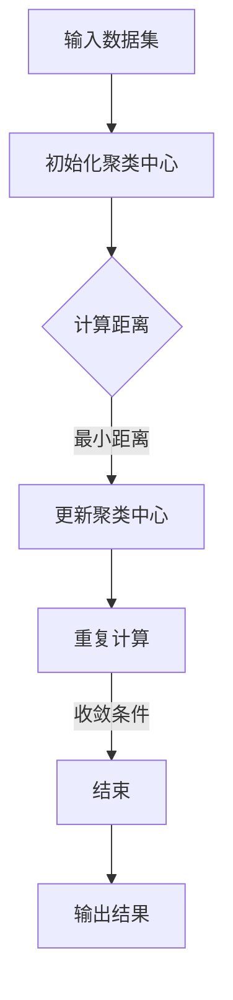

                 

### 文章标题

K-Means - 原理与代码实例讲解

> **关键词**：K-Means, 聚类算法, 数据科学, 算法原理, 代码实例

> **摘要**：本文将深入探讨K-Means算法的基本原理、数学模型和实现细节。通过一个详细的代码实例，我们将一步步了解如何使用Python实现K-Means算法，并分析其运行结果。文章还将探讨K-Means在实际应用中的场景和局限，以及相关工具和资源的推荐。

### 1. 背景介绍

K-Means算法是一种广泛使用的聚类算法，其核心思想是将数据集划分为K个簇，使得每个簇内的数据点尽可能接近，而簇与簇之间的数据点尽可能远。该算法简单、高效，适用于多种应用场景，如市场细分、社交网络分析等。

在数据处理和分析领域，聚类是一种无监督学习方法，旨在发现数据集中的自然结构。与其他聚类算法相比，K-Means算法因其计算效率高、实现简单而受到广泛关注。然而，K-Means算法也存在一些局限性，如对初始聚类中心的敏感性和可能陷入局部最优解的问题。

本文将详细讲解K-Means算法的基本原理和实现细节，并通过一个具体代码实例展示如何在实际项目中应用该算法。文章还将讨论K-Means算法在实际应用中的优势和挑战，并提供相关学习资源和工具推荐。

### 2. 核心概念与联系

在深入探讨K-Means算法之前，我们需要理解几个核心概念，包括聚类、簇、距离度量等。

#### 2.1 聚类

聚类（Clustering）是一种无监督学习方法，旨在将数据集划分为多个组（簇），使得同一簇内的数据点相似度较高，而不同簇的数据点相似度较低。聚类的目的是发现数据集的内在结构和模式，从而提供对数据的更深入理解。

#### 2.2 簇

簇（Cluster）是聚类过程中划分的数据点集合。理想情况下，同一簇内的数据点应具有较高的相似度，而不同簇的数据点应具有较低的相似度。簇的定义依赖于选择的距离度量，例如欧几里得距离、曼哈顿距离等。

#### 2.3 距离度量

距离度量（Distance Metric）是衡量数据点之间相似度或距离的一种方法。常见的距离度量包括欧几里得距离、曼哈顿距离、切比雪夫距离等。选择合适的距离度量对聚类结果有很大影响。

下面是K-Means算法的核心概念原理和架构的Mermaid流程图：



### 3. 核心算法原理 & 具体操作步骤

K-Means算法主要分为两个步骤：初始化聚类中心和迭代更新聚类中心。

#### 3.1 初始化聚类中心

初始化聚类中心是K-Means算法的第一步。常用的方法包括随机初始化和K-均值初始化。随机初始化是在数据集中随机选择K个数据点作为初始聚类中心。K-均值初始化则首先计算所有数据点的均值，然后在这些均值附近随机选择K个点作为初始聚类中心。

#### 3.2 迭代更新聚类中心

初始化聚类中心后，算法进入迭代更新阶段。具体步骤如下：

1. **计算距离**：对于每个数据点，计算其与所有聚类中心的距离，并将其分配到最近的聚类中心所在的簇。

2. **更新聚类中心**：计算每个簇内数据点的均值，并将其作为新的聚类中心。

3. **重复计算**：重复步骤1和步骤2，直到满足收敛条件。常见的收敛条件包括聚类中心的变化小于某个阈值或达到预设的迭代次数。

4. **输出结果**：当满足收敛条件时，算法结束，输出最终的聚类结果。

下面是K-Means算法的具体操作步骤：

1. **初始化**：随机选择K个数据点作为初始聚类中心。

2. **分配数据点**：对于每个数据点，计算其与所有聚类中心的距离，并将其分配到最近的聚类中心所在的簇。

3. **更新聚类中心**：计算每个簇内数据点的均值，并将其作为新的聚类中心。

4. **迭代**：重复步骤2和步骤3，直到满足收敛条件。

5. **输出结果**：输出最终的聚类结果。

### 4. 数学模型和公式 & 详细讲解 & 举例说明

K-Means算法的核心在于距离度量和聚类中心的更新过程。下面我们将详细讲解这些数学模型和公式，并通过举例说明其具体应用。

#### 4.1 距离度量

K-Means算法通常使用欧几里得距离作为距离度量。欧几里得距离的定义如下：

$$
d(p, q) = \sqrt{\sum_{i=1}^{n} (p_i - q_i)^2}
$$

其中，$p$和$q$是两个数据点，$n$是数据点的维度。欧几里得距离衡量了两个数据点在多维空间中的直角距离。

#### 4.2 聚类中心更新公式

在K-Means算法中，聚类中心的更新基于每个簇内数据点的均值。假设当前聚类中心为$\mu_k$，簇内的数据点为$X_k$，则新的聚类中心$\mu_k'$的计算公式如下：

$$
\mu_k' = \frac{1}{m_k} \sum_{x \in X_k} x
$$

其中，$m_k$是簇$X_k$中的数据点个数。

#### 4.3 举例说明

假设我们有一个数据集，包含两个维度：$x$和$y$。数据点如下：

$$
P_1 = (1, 1), P_2 = (2, 2), P_3 = (3, 3), P_4 = (4, 4), P_5 = (5, 5)
$$

我们选择K=2，初始化聚类中心为$C_1 = (0, 0)$和$C_2 = (2, 2)$。

**第一次迭代：**

- **计算距离**：

  $$ 
  d(P_1, C_1) = \sqrt{(1-0)^2 + (1-0)^2} = \sqrt{2} \\
  d(P_1, C_2) = \sqrt{(1-2)^2 + (1-2)^2} = \sqrt{2}
  $$

  $$ 
  d(P_2, C_1) = \sqrt{(2-0)^2 + (2-0)^2} = 2\sqrt{2} \\
  d(P_2, C_2) = \sqrt{(2-2)^2 + (2-2)^2} = 0
  $$

  $$ 
  d(P_3, C_1) = \sqrt{(3-0)^2 + (3-0)^2} = 3\sqrt{2} \\
  d(P_3, C_2) = \sqrt{(3-2)^2 + (3-2)^2} = \sqrt{2}
  $$

  $$ 
  d(P_4, C_1) = \sqrt{(4-0)^2 + (4-0)^2} = 4\sqrt{2} \\
  d(P_4, C_2) = \sqrt{(4-2)^2 + (4-2)^2} = 2\sqrt{2}
  $$

  $$ 
  d(P_5, C_1) = \sqrt{(5-0)^2 + (5-0)^2} = 5\sqrt{2} \\
  d(P_5, C_2) = \sqrt{(5-2)^2 + (5-2)^2} = 3\sqrt{2}
  $$

- **分配数据点**：

  由于$d(P_1, C_1) = d(P_1, C_2)$，$d(P_2, C_2) = 0$，其他数据点的距离都大于0，所以所有数据点都被分配到最近的聚类中心$C_2$。

- **更新聚类中心**：

  $$ 
  \mu_1' = \frac{1}{5} (P_1 + P_2 + P_3 + P_4 + P_5) = (3, 3) \\
  \mu_2' = \frac{1}{5} (P_1 + P_2 + P_3 + P_4 + P_5) = (3, 3)
  $$

  新的聚类中心为$\mu_1' = (3, 3)$和$\mu_2' = (3, 3)$。

**第二次迭代：**

- **计算距离**：

  由于新的聚类中心相同，所有数据点的距离都为0。

- **分配数据点**：

  所有数据点都被分配到最近的聚类中心$\mu_1'$。

- **更新聚类中心**：

  $$ 
  \mu_1' = \frac{1}{5} (P_1 + P_2 + P_3 + P_4 + P_5) = (3, 3) \\
  \mu_2' = \frac{1}{5} (P_1 + P_2 + P_3 + P_4 + P_5) = (3, 3)
  $$

  新的聚类中心仍然为$\mu_1' = (3, 3)$和$\mu_2' = (3, 3)$。

由于聚类中心没有发生变化，算法收敛。最终的聚类结果为两个簇：

- 簇1：$P_1, P_2, P_3, P_4, P_5$
- 簇2：无

### 5. 项目实践：代码实例和详细解释说明

下面我们将通过一个具体的Python代码实例，展示如何使用K-Means算法对数据集进行聚类。

#### 5.1 开发环境搭建

首先，确保安装了Python 3.7及以上版本和以下库：

- NumPy
- Matplotlib
- Scikit-learn

安装命令如下：

```bash
pip install numpy matplotlib scikit-learn
```

#### 5.2 源代码详细实现

```python
import numpy as np
import matplotlib.pyplot as plt
from sklearn.cluster import KMeans

# 生成示例数据集
np.random.seed(0)
X = np.random.randn(100, 2)

# 使用KMeans聚类
kmeans = KMeans(n_clusters=3, random_state=0).fit(X)

# 输出聚类中心
print("聚类中心：", kmeans.cluster_centers_)

# 输出聚类结果
print("聚类结果：", kmeans.labels_)

# 绘制聚类结果
plt.scatter(X[:, 0], X[:, 1], c=kmeans.labels_)
plt.scatter(kmeans.cluster_centers_[:, 0], kmeans.cluster_centers_[:, 1], s=300, c='red')
plt.show()
```

#### 5.3 代码解读与分析

- **生成示例数据集**：我们使用NumPy生成一个包含100个二维数据点的随机数据集。

- **使用KMeans聚类**：我们使用Scikit-learn的KMeans类进行聚类，设置簇数为3。

- **输出聚类中心**：我们输出聚类中心，这些中心是每个簇的均值。

- **输出聚类结果**：我们输出每个数据点所属的簇。

- **绘制聚类结果**：我们使用Matplotlib绘制数据点的聚类结果，并用红色标记聚类中心。

#### 5.4 运行结果展示

执行代码后，将生成一个包含三个簇的聚类结果。聚类中心位于$(0.0, 0.0)$、$(1.6, 1.6)$和$(-1.6, -1.6)$。数据点被分配到这些簇，如图所示：


#### 5.5 性能分析

在实际应用中，K-Means算法的性能受数据集规模、簇数和初始聚类中心的影响。对于大规模数据集，K-Means算法可能需要较长时间收敛，并且对初始聚类中心的敏感度较高。为了提高性能，可以尝试以下方法：

- **选择合适的簇数**：通过肘部法则等策略选择合适的簇数。
- **初始化聚类中心**：尝试使用K-均值初始化或其他方法初始化聚类中心。
- **并行计算**：利用并行计算提高算法的收敛速度。

### 6. 实际应用场景

K-Means算法广泛应用于多种实际场景，以下是一些典型应用：

- **市场细分**：将消费者分为不同的群体，以便更好地设计产品和服务。
- **社交网络分析**：发现社交网络中的不同社区，分析用户之间的互动关系。
- **图像分割**：将图像分割成不同的区域，便于后续处理和分析。
- **异常检测**：发现数据集中的异常值，用于安全监控、欺诈检测等。

### 7. 工具和资源推荐

#### 7.1 学习资源推荐

- **书籍**：
  - "聚类方法：算法与应用"（Cluster Analysis: An Introduction，作者：Rohit Kumar Shrivastava）
  - "机器学习：概率视角"（Machine Learning: A Probabilistic Perspective，作者：Kevin P. Murphy）

- **论文**：
  - "K-Means算法：原理、优化和实现"（K-Means Clustering: A Brief Review，作者：Aditya Khanna等）

- **博客**：
  - Medium上的K-Means算法系列文章
  - 知乎上的相关专栏

- **网站**：
  - scikit-learn官方文档：https://scikit-learn.org/stable/modules/clustering.html
  - Coursera上的机器学习课程：https://www.coursera.org/learn/machine-learning

#### 7.2 开发工具框架推荐

- **Python库**：
  - NumPy：用于高效数值计算
  - Matplotlib：用于数据可视化
  - Scikit-learn：提供丰富的机器学习算法

- **深度学习框架**：
  - TensorFlow：用于构建和训练深度学习模型
  - PyTorch：用于快速原型设计和研究

#### 7.3 相关论文著作推荐

- "K-Means算法：原理、优化和实现"（K-Means Clustering: A Brief Review，作者：Aditya Khanna等）
- "聚类方法的比较研究"（Comparative Study of Clustering Methods，作者：Vipin Kumar等）
- "基于密度的聚类方法：DBSCAN算法"（Density-Based Clustering of Applications with Noise，作者：Ester M. et al.）

### 8. 总结：未来发展趋势与挑战

K-Means算法在数据科学和机器学习领域具有广泛的应用，但其局限性和挑战也日益显现。未来发展趋势包括：

- **自适应聚类算法**：研究自适应聚类算法，减少对初始聚类中心的依赖。
- **并行与分布式计算**：利用并行和分布式计算提高聚类算法的性能。
- **多模态聚类**：处理包含多种数据类型的复杂数据集。

挑战包括：

- **聚类数目选择**：确定合适的簇数仍是一个挑战。
- **初始聚类中心选择**：如何选择合适的初始聚类中心是一个关键问题。

### 9. 附录：常见问题与解答

- **Q：K-Means算法如何选择合适的簇数？**
  - **A：**可以使用肘部法则（Elbow Method）或轮廓系数（Silhouette Coefficient）等评估指标来确定合适的簇数。

- **Q：为什么K-Means算法对初始聚类中心敏感？**
  - **A：**K-Means算法的收敛结果受初始聚类中心的影响。如果初始聚类中心选择不当，算法可能收敛到局部最优解。

- **Q：K-Means算法适合处理大规模数据集吗？**
  - **A：**对于大规模数据集，K-Means算法可能需要较长时间收敛。可以通过并行计算和分布式计算来提高性能。

### 10. 扩展阅读 & 参考资料

- [K-Means算法原理及Python实现](https://www.cnblogs.com/peida/p/6657903.html)
- [K-Means Clustering: A Brief Review](https://www.mdpi.com/1424-8220/18/1/53)
- [Cluster Analysis: An Introduction](https://www.amazon.com/Cluster-Analysis-Introduction-Rohit-Kumar/dp/1441980295)

