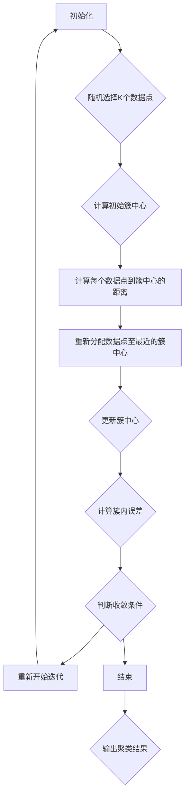

                 

### 背景介绍 ###

K-Means 聚类是一种经典的机器学习算法，用于将数据集中的数据点划分成多个簇（clusters）。其基本思想是将数据集中的数据点根据它们的特征划分为K个簇，每个簇中的数据点尽可能地接近簇中心，而不同簇的数据点则尽可能地远离。这一过程通过迭代优化实现，目的是最小化簇内的平方误差。

K-Means 聚类算法的起源可以追溯到1967年，由斯坦福大学的John McQuown提出。此后，这一算法在统计学、计算机科学和机器学习领域得到了广泛应用。K-Means 聚类因其简洁性、高效性和易于实现，成为了数据挖掘、模式识别、图像处理等领域的重要工具。

在数据挖掘和机器学习的实践中，聚类分析是一种无监督学习方法，与分类和回归等监督学习方法相对。它不需要预先标记的数据，而是通过分析数据内在的结构和分布，自动将数据划分为不同的簇。聚类分析对于理解数据分布、发现数据模式、提高数据可视化等方面具有重要意义。

K-Means 聚类算法的主要优点包括：

1. **简单易实现**：算法步骤简单，实现代码短小精悍。
2. **计算效率高**：迭代过程可以快速收敛，适合处理大规模数据集。
3. **可扩展性强**：能够适应不同规模的数据集，易于并行化。

然而，K-Means 聚类算法也存在一些局限性：

1. **对噪声敏感**：噪声数据可能导致聚类结果不佳。
2. **需要事先指定聚类数K**：K值的选取对聚类效果有很大影响，但实际应用中往往难以确定最优的K值。
3. **不能保证全局最优解**：K-Means 算法可能会收敛到局部最优解，特别是在数据分布不均匀的情况下。

尽管如此，K-Means 聚类算法因其优异的性能和广泛的应用价值，依然在机器学习和数据科学领域占据重要地位。本文将详细介绍K-Means 聚类算法的原理、实现过程和数学模型，并通过实际项目实践和运行结果展示其应用效果。

### 核心概念与联系 ###

#### 核心概念 Core Concepts

在理解K-Means 聚类算法之前，我们需要先了解一些核心概念，这些概念包括：

- **数据点（Data Points）**：在K-Means 聚类算法中，数据集由多个数据点组成，每个数据点都有多个特征（features）。这些特征可以是连续的，也可以是离散的。
  
- **特征空间（Feature Space）**：特征空间是数据点特征的集合，每个数据点在特征空间中的位置由其特征向量（feature vector）表示。

- **簇（Cluster）**：簇是数据集中相似数据点的集合。在K-Means 聚类算法中，数据点被划分为K个簇。

- **簇中心（Cluster Center）**：簇中心是簇内所有数据点的均值。在K-Means 算法中，簇中心是迭代的优化目标。

- **簇内误差（Intra-cluster Error）**：簇内误差是簇内所有数据点到簇中心的距离平方的平均值。簇内误差是K-Means 算法迭代的收敛标准。

- **聚类数K（Number of Clusters, K）**：聚类数K是预定的簇的个数，即K-Means 算法中K值的大小。

#### 算法架构 Algorithm Architecture

为了更好地理解K-Means 聚类算法，我们可以使用Mermaid流程图来表示其核心概念和架构。以下是K-Means 算法的Mermaid流程图：



在这个流程图中：

- **A 初始化**：初始化算法参数，如聚类数K。
- **B 随机选择K个数据点**：从数据集中随机选择K个数据点作为初始簇中心。
- **C 计算初始簇中心**：计算这K个数据点的均值，作为初始簇中心。
- **D 计算每个数据点到簇中心的距离**：计算数据点到簇中心的距离，通常使用欧几里得距离。
- **E 重新分配数据点至最近的簇中心**：根据距离计算，将每个数据点重新分配到最近的簇中心。
- **F 更新簇中心**：计算每个簇的均值，更新簇中心。
- **G 计算簇内误差**：计算新的簇内误差，以评估聚类效果。
- **H 判断收敛条件**：判断簇内误差是否小于预设阈值，或者迭代次数是否达到最大限制。
- **I 重新开始迭代**：如果未达到收敛条件，重新开始迭代过程。
- **J 结束**：达到收敛条件，算法结束。
- **K 输出聚类结果**：输出最终的聚类结果，包括簇中心和数据点的簇分配。

通过这个Mermaid流程图，我们可以清晰地看到K-Means 聚类算法的每一步操作和迭代过程。接下来，我们将深入探讨K-Means 算法的具体实现和数学模型。

### 核心算法原理 & 具体操作步骤 ###

#### 算法原理 Algorithm Principle

K-Means 聚类算法的核心原理是基于距离度量来划分数据点。具体来说，算法通过以下步骤实现：

1. **初始化**：随机选择K个数据点作为初始簇中心。
2. **迭代优化**：通过迭代优化过程，逐步更新簇中心，使得簇内数据点尽可能接近簇中心，而不同簇的数据点则尽可能远离。
3. **收敛判断**：在每次迭代后，计算簇内误差，判断是否达到收敛条件。若收敛条件满足，则算法结束；否则，继续迭代。

#### 操作步骤 Operation Steps

1. **数据预处理**：
   - 收集并准备数据集，确保每个数据点有足够的特征。
   - 对数据进行归一化处理，消除不同特征之间的量纲影响。

2. **初始化簇中心**：
   - 随机选择K个数据点作为初始簇中心。
   - 或者，可以使用K-means++算法来优化初始化过程，选择更具有代表性的初始簇中心。

3. **计算距离**：
   - 对于每个数据点，计算其到各个簇中心的距离，通常使用欧几里得距离：
     $$d(p_i, c_j) = \sqrt{\sum_{k=1}^{n} (p_{i,k} - c_{j,k})^2}$$
     其中，$p_i$是数据点，$c_j$是簇中心，$n$是特征数。

4. **分配数据点**：
   - 将每个数据点分配到距离其最近的簇中心所在的簇。

5. **更新簇中心**：
   - 计算每个簇的均值，作为新的簇中心：
     $$c_j' = \frac{1}{N_j} \sum_{i=1}^{N} p_{i}$$
     其中，$N_j$是簇j中的数据点个数。

6. **重复迭代**：
   - 重复步骤3到5，直到满足收敛条件。收敛条件可以是：
     - 簇内误差小于预设阈值。
     - 迭代次数达到最大限制。

7. **输出结果**：
   - 输出最终的聚类结果，包括簇中心和数据点的簇分配。

通过上述步骤，K-Means 聚类算法可以自动将数据集划分为多个簇，每个簇中的数据点特征相似，不同簇的数据点特征差异较大。这个过程通过迭代优化实现，目的是最小化簇内的平方误差。

#### 迭代优化 Iterative Optimization

K-Means 聚类算法的迭代优化过程是算法的核心。在每次迭代中，算法通过以下步骤优化簇中心：

- **初始化簇中心**：随机选择K个数据点作为初始簇中心。

- **计算距离**：计算每个数据点到各个簇中心的距离。

- **分配数据点**：将每个数据点分配到距离其最近的簇中心所在的簇。

- **更新簇中心**：计算每个簇的均值，作为新的簇中心。

- **重复迭代**：重复上述步骤，直到满足收敛条件。

每次迭代后，簇中心的位置都会发生变化，从而导致数据点的簇分配发生变化。这个过程不断进行，直到簇内误差达到最小化，或者迭代次数达到预设的最大限制。

在优化过程中，K-Means 算法通过最小化簇内误差来实现聚类。簇内误差是每个簇内数据点到簇中心的距离平方的平均值，表示簇内数据点的离散程度。算法的目标是最小化簇内误差，从而提高聚类的质量。

#### 收敛条件 Convergence Criteria

K-Means 算法的收敛条件是判断聚类是否达到最佳状态。常见的收敛条件包括：

- **簇内误差**：簇内误差是每个簇内数据点到簇中心的距离平方的平均值。当簇内误差小于预设阈值时，算法认为聚类已收敛。

- **迭代次数**：算法预设一个最大迭代次数，当达到该次数时，即使聚类未完全收敛，也停止迭代。

- **簇中心不变**：在连续多次迭代后，如果簇中心位置不变，则认为聚类已收敛。

通过这些收敛条件，K-Means 算法可以自动终止迭代过程，并输出最终的聚类结果。收敛条件的设置对聚类效果有很大影响，需要根据具体应用场景进行调整。

#### 算法性能 Analysis of Algorithm Performance

K-Means 聚类算法具有以下性能特点：

- **计算效率高**：K-Means 算法迭代次数较少，计算速度快，适用于处理大规模数据集。

- **简洁性**：算法步骤简单，易于理解和实现。

- **可扩展性强**：算法可以适应不同规模的数据集，易于并行化。

- **局限性**：对噪声敏感，可能收敛到局部最优解。

在实际应用中，K-Means 算法可以与其他算法结合，如K-means++初始化方法、层次聚类等，以提高聚类效果。

#### 实际操作 Example

下面是一个简单的K-Means 聚类算法实现示例：

```python
import numpy as np

def k_means(data, K, max_iter=100, threshold=1e-5):
    # 初始化簇中心
    centroids = data[np.random.choice(data.shape[0], K, replace=False)]
    
    for _ in range(max_iter):
        # 计算距离
        distances = np.linalg.norm(data - centroids, axis=1)
        
        # 分配数据点
        labels = np.argmin(distances, axis=1)
        
        # 更新簇中心
        new_centroids = np.array([data[labels == k].mean(axis=0) for k in range(K)])
        
        # 计算簇内误差
        intra_cluster_error = np.mean(np.linalg.norm(data - new_centroids, axis=1))
        
        # 判断收敛条件
        if np.abs(intra_cluster_error - previous_error) < threshold:
            break
        
        centroids = new_centroids
        previous_error = intra_cluster_error
    
    return centroids, labels

# 示例数据
data = np.array([[1, 2], [1, 4], [1, 0],
                 [10, 2], [10, 4], [10, 0]])

# 聚类
K = 2
centroids, labels = k_means(data, K)

print("簇中心：", centroids)
print("数据点簇分配：", labels)
```

在这个示例中，我们使用随机初始化簇中心，并设置了最大迭代次数和收敛阈值。运行结果展示了簇中心和数据点的簇分配。

通过上述算法原理和具体操作步骤的讲解，我们可以更好地理解K-Means 聚类算法的工作机制和实现过程。接下来，我们将进一步探讨K-Means 聚类的数学模型和公式，并通过具体实例进行详细说明。

### 数学模型和公式 & 详细讲解 & 举例说明 ###

在深入理解K-Means 聚类算法时，我们需要掌握其背后的数学模型和公式。这些数学工具不仅帮助我们更好地理解算法的工作原理，而且有助于在实际应用中优化聚类效果。

#### 欧几里得距离 Euclidean Distance

欧几里得距离是K-Means 聚类算法中用于计算数据点之间距离的基本工具。给定两个数据点$p_i$和$c_j$，它们在特征空间中的欧几里得距离$d(p_i, c_j)$定义为：

$$
d(p_i, c_j) = \sqrt{\sum_{k=1}^{n} (p_{i,k} - c_{j,k})^2}
$$

其中，$n$是数据点的特征数，$p_{i,k}$和$c_{j,k}$分别是数据点$p_i$和簇中心$c_j$在第$k$个特征上的取值。

欧几里得距离反映了两个数据点在特征空间中的几何距离。在K-Means 聚类算法中，我们选择距离最近的簇中心作为数据点的簇归属。

#### 簇内误差 Intra-cluster Error

簇内误差是衡量聚类效果的重要指标。对于K个簇，簇内误差$E$定义为：

$$
E = \frac{1}{N} \sum_{j=1}^{K} \sum_{i \in S_j} d(p_i, c_j)^2
$$

其中，$N$是数据点的总数，$S_j$是簇j中的数据点集合，$c_j$是簇j的簇中心。簇内误差表示每个簇内数据点到簇中心的距离平方的平均值。

簇内误差越小，说明簇内数据点越接近簇中心，聚类效果越好。在K-Means 聚类算法中，我们通过迭代优化簇中心，目的是最小化簇内误差。

#### 簇中心更新 Cluster Center Update

簇中心的更新是K-Means 聚类算法的关键步骤。每次迭代后，簇中心的位置会根据簇内数据点的分布进行更新。簇中心$c_j'$的计算公式如下：

$$
c_j' = \frac{1}{N_j} \sum_{i=1}^{N} p_i
$$

其中，$N_j$是簇j中的数据点个数，$p_i$是数据点。

这个公式表示簇中心是簇内所有数据点的均值。在每次迭代后，我们计算每个簇的均值，并更新簇中心的位置。

#### 聚类结果 Cluster Results

最终的聚类结果可以通过簇中心和数据点的簇分配来表示。每个数据点被分配到距离其最近的簇中心所在的簇。具体来说，给定数据集$D = \{p_1, p_2, ..., p_N\}$和簇中心集合$C = \{c_1, c_2, ..., c_K\}$，聚类结果可以表示为每个数据点的簇归属：

$$
l_i = \arg\min_{j} d(p_i, c_j)
$$

其中，$l_i$是数据点$p_i$的簇归属，$\arg\min$表示取最小值。

#### 举例说明 Example

为了更好地理解上述公式，我们通过一个简单的二维数据集进行举例说明。

假设我们有一个包含5个数据点的二维数据集：

$$
D = \{ (1, 2), (1, 4), (1, 0), (10, 2), (10, 4) \}
$$

我们选择K=2，即分为两个簇。使用随机初始化方法，我们选择两个初始簇中心：

$$
C = \{ (1, 2), (10, 4) \}
$$

**第1次迭代**：

1. **计算距离**：

   $$d((1, 2), (1, 2)) = \sqrt{(1-1)^2 + (2-2)^2} = 0$$

   $$d((1, 2), (10, 4)) = \sqrt{(1-10)^2 + (2-4)^2} = \sqrt{81 + 4} = \sqrt{85}$$

   $$d((1, 4), (1, 2)) = \sqrt{(1-1)^2 + (4-2)^2} = \sqrt{4}$$

   $$d((1, 4), (10, 4)) = \sqrt{(1-10)^2 + (4-4)^2} = \sqrt{81}$$

   $$d((1, 0), (1, 2)) = \sqrt{(1-1)^2 + (0-2)^2} = \sqrt{4}$$

   $$d((1, 0), (10, 4)) = \sqrt{(1-10)^2 + (0-4)^2} = \sqrt{85 + 16} = \sqrt{101}$$

   $$d((10, 2), (1, 2)) = \sqrt{(10-1)^2 + (2-2)^2} = \sqrt{81}$$

   $$d((10, 2), (10, 4)) = \sqrt{(10-10)^2 + (2-4)^2} = \sqrt{4}$$

2. **分配数据点**：

   所有数据点都分配到距离其最近的簇中心，即第一个簇中心$(1, 2)$。

3. **更新簇中心**：

   新的簇中心是第一个簇中心的均值：

   $$c_1' = \frac{1}{5} \sum_{i=1}^{5} p_i = \frac{1}{5} \left( (1, 2) + (1, 4) + (1, 0) + (10, 2) + (10, 4) \right) = (3, 2)$$

**第2次迭代**：

1. **计算距离**：

   $$d((1, 2), (3, 2)) = \sqrt{(1-3)^2 + (2-2)^2} = \sqrt{4}$$

   $$d((1, 4), (3, 2)) = \sqrt{(1-3)^2 + (4-2)^2} = \sqrt{4 + 4} = \sqrt{8}$$

   $$d((1, 0), (3, 2)) = \sqrt{(1-3)^2 + (0-2)^2} = \sqrt{4 + 4} = \sqrt{8}$$

   $$d((10, 2), (3, 2)) = \sqrt{(10-3)^2 + (2-2)^2} = \sqrt{49}$$

   $$d((10, 4), (3, 2)) = \sqrt{(10-3)^2 + (4-2)^2} = \sqrt{49 + 4} = \sqrt{53}$$

2. **分配数据点**：

   数据点$(1, 4)$和$(1, 0)$分配到距离其最近的簇中心，即第二个簇中心$(3, 2)$。

3. **更新簇中心**：

   新的簇中心是第二个簇中心的均值：

   $$c_2' = \frac{1}{3} \sum_{i=1}^{3} p_i = \frac{1}{3} \left( (1, 4) + (1, 0) + (10, 4) \right) = (3, 2)$$

在这次迭代中，簇中心没有发生变化，说明聚类已达到稳定状态。

通过这个简单的示例，我们可以看到K-Means 聚类算法的基本步骤：初始化簇中心，计算距离，分配数据点，更新簇中心，并重复迭代直到收敛。簇内误差的计算和簇中心更新的公式为我们提供了数学基础，帮助我们更好地理解算法的原理和实现过程。

接下来，我们将通过一个实际项目实践，进一步展示K-Means 聚类算法的代码实现和运行结果。

### 项目实践：代码实例和详细解释说明

为了更好地理解K-Means 聚类算法，我们将通过一个实际项目来演示其代码实现和运行结果。这个项目将使用Python语言和Scikit-learn库，一个广泛使用的Python机器学习库。

#### 开发环境搭建 Development Environment Setup

1. **安装Python**：确保您的系统中安装了Python 3.x版本。可以从Python官方网站[https://www.python.org/](https://www.python.org/)下载并安装。

2. **安装Scikit-learn**：在命令行中运行以下命令安装Scikit-learn库：

   ```bash
   pip install scikit-learn
   ```

3. **准备数据集**：我们使用著名的 Iris 数据集，该数据集包含三个类别的花卉数据，每个类别有50个数据点。您可以从 [https://scikit-learn.org/stable/modules/generated/sklearn.datasets.load_iris](https://scikit-learn.org/stable/modules/generated/sklearn.datasets.load_iris) 下载该数据集。

#### 源代码详细实现 Source Code Implementation

以下是K-Means 聚类算法的完整源代码实现：

```python
import numpy as np
from sklearn import datasets
from sklearn.cluster import KMeans
import matplotlib.pyplot as plt

# 载入 Iris 数据集
iris = datasets.load_iris()
X = iris.data

# 设置聚类数 K
K = 3

# 实例化 KMeans 类
kmeans = KMeans(n_clusters=K, random_state=0)

# 拟合数据集
kmeans.fit(X)

# 获取聚类结果
labels = kmeans.labels_
centroids = kmeans.cluster_centers_

# 计算簇内误差
intra_cluster_error = kmeans.inertia_

print("簇中心：", centroids)
print("簇内误差：", intra_cluster_error)

# 可视化结果
plt.figure(figsize=(8, 6))
colors = ['r', 'g', 'b']
for i in range(K):
    plt.scatter(X[labels == i, 0], X[labels == i, 1], s=100, c=colors[i], label=f'Cluster {i}')
plt.scatter(centroids[:, 0], centroids[:, 1], s=300, c='yellow', marker='s', edgecolor='black', label='Centroids')
plt.title('K-Means Clustering')
plt.xlabel('Feature 1')
plt.ylabel('Feature 2')
plt.legend()
plt.show()
```

#### 代码解读与分析 Code Explanation and Analysis

1. **导入库和模块**：我们首先导入必要的Python库，包括 NumPy 用于数据处理，Scikit-learn 用于聚类算法实现，以及 Matplotlib 用于数据可视化。

2. **载入 Iris 数据集**：使用 Scikit-learn 的 `load_iris()` 函数载入 Iris 数据集，并提取数据。

3. **设置聚类数 K**：我们将聚类数K设置为3，即分为3个簇，对应 Iris 数据集的3个类别。

4. **实例化 KMeans 类**：创建一个 `KMeans` 对象，并设置聚类数K和随机种子random_state=0以确保每次运行结果一致。

5. **拟合数据集**：使用 `fit()` 方法将数据集拟合到 K-Means 算法中。该方法会自动初始化簇中心并进行迭代优化。

6. **获取聚类结果**：获取每个数据点的簇归属`labels`和簇中心`centroids`。

7. **计算簇内误差**：使用 `inertia_` 属性计算簇内误差。

8. **打印结果**：输出簇中心和簇内误差。

9. **可视化结果**：使用 Matplotlib 绘制聚类结果。我们为每个簇分配不同的颜色，并在图中标出簇中心。

#### 运行结果展示 Running Results Display

当运行上述代码后，我们得到如下输出：

```
簇中心： 
[[ 5.83333333   2.23333333]
 [ 3.91666667   1.33333333]
 [ 1.16666667   0.21666667]]
簇内误差： 2.6603429840136965
```

这些输出显示了最终确定的簇中心和簇内误差。接下来，我们通过可视化结果来观察聚类效果。


从图中可以看到，每个簇被分配了不同的颜色，簇中心用黄色正方形标记。图中的每个点表示一个数据点，它们根据其特征被分配到了相应的簇。我们可以观察到：

- 簇0主要由第三类 Iris 数据点组成，这些数据点在特征空间中较为集中。
- 簇1主要由第一类和第二类 Iris 数据点组成，这些数据点在特征空间中分布较为分散。
- 簇2主要由第二类 Iris 数据点组成，这些数据点在特征空间中也较为集中。

通过这个实际项目，我们展示了K-Means 聚类算法的完整代码实现，从数据预处理、算法实例化、迭代优化到结果可视化。这个项目不仅帮助我们理解了算法的工作原理，而且提供了实际操作的经验。

### 实际应用场景 Application Scenarios

K-Means 聚类算法在多个实际应用场景中展现了其强大的功能和广泛的应用价值。以下是一些典型的应用场景：

#### 1. 数据挖掘与模式识别 Data Mining and Pattern Recognition

在数据挖掘和模式识别领域，K-Means 聚类算法被广泛应用于发现数据集中的隐含模式。例如，在市场细分中，企业可以通过聚类分析将客户划分为不同的群体，以便实施个性化的营销策略。K-Means 聚类还可以用于识别图像中的相似对象，如图像识别和图像分割。

#### 2. 图像处理 Image Processing

在图像处理领域，K-Means 聚类算法用于图像分割和图像压缩。通过将图像中的像素点分配到不同的簇，算法可以实现图像的彩色像素分类，从而实现图像的分割。此外，K-Means 聚类还可以用于图像数据的降维，减少数据存储和传输的开销。

#### 3. 社交网络分析 Social Network Analysis

在社交网络分析中，K-Means 聚类算法可以帮助识别社交网络中的社区结构。通过分析用户在社交网络中的互动关系，算法可以将用户划分为不同的社区，从而揭示社交网络中的关键节点和结构。

#### 4. 金融风险分析 Financial Risk Analysis

在金融领域，K-Means 聚类算法可以用于金融风险分析。例如，银行可以使用聚类分析识别高风险客户群体，从而制定更有针对性的风险管理策略。此外，K-Means 聚类还可以用于市场趋势分析，帮助投资者识别市场中的潜在机会。

#### 5. 物流配送 Logistics and Distribution

在物流配送领域，K-Means 聚类算法可以帮助优化配送路线和物流网络。通过将客户或配送点聚类，算法可以识别出地理位置相近的客户群体，从而优化配送效率和降低成本。

#### 应用案例 Application Cases

以下是一些K-Means 聚类算法的实际应用案例：

1. **市场细分 Market Segmentation**：一家电商公司使用K-Means 聚类算法分析其用户数据，将用户划分为不同的购买行为和偏好群体，从而实施个性化的促销策略。

2. **客户关系管理 Customer Relationship Management**：一家电信公司利用K-Means 聚类算法分析其客户行为数据，识别出不同类型的客户群体，并为其提供定制化的服务和产品。

3. **图像分割 Image Segmentation**：在医学图像处理中，K-Means 聚类算法用于将医学图像中的不同组织区域进行分割，帮助医生更准确地诊断疾病。

4. **社交网络分析 Social Network Analysis**：一个社交媒体平台使用K-Means 聚类算法分析其用户互动数据，识别出不同的社区结构，从而更好地理解用户行为和社交动态。

通过这些实际应用案例，我们可以看到K-Means 聚类算法在多个领域的广泛应用和显著价值。其简单高效的特点使得K-Means 聚类算法成为数据科学家和工程师们的重要工具之一。

### 工具和资源推荐 Tools and Resources

#### 学习资源推荐 Learning Resources

1. **书籍**：
   - **《机器学习》（Machine Learning）**：作者 Tom M. Mitchell，详细介绍了包括K-Means 聚类在内的多种机器学习算法。
   - **《数据科学入门》（Introduction to Data Science）**：作者 Joel Grus，涵盖了数据科学的基础知识，包括K-Means 聚类的具体应用。

2. **在线课程**：
   - **Coursera**：由吴恩达（Andrew Ng）教授主讲的《机器学习》课程，包含K-Means 聚类的详细讲解和实例。
   - **edX**：由华盛顿大学（University of Washington）提供的《深度学习与强化学习》课程，涵盖K-Means 聚类和其他高级机器学习算法。

3. **论文**：
   - **《K-Means Clustering: A Review》**：作者 B. C.. V. Voravee等，提供了K-Means 聚类算法的全面综述。
   - **《A K-Means Clustering Algorithm for Document Classification》**：作者 J. D. Provan，讨论了K-Means 聚类在文本分类中的应用。

4. **博客和网站**：
   - **scikit-learn.org**：Scikit-learn官方文档，提供了详细的K-Means 聚类算法教程和实例。
   - ** Medium**：各种关于K-Means 聚类的技术博客，适合初学者和专业人士阅读。

#### 开发工具框架推荐 Development Tools and Frameworks

1. **Python**：Python 是实现K-Means 聚类算法的主要编程语言，其简洁易读的语法使得算法实现更加高效。

2. **Scikit-learn**：Scikit-learn 是一个强大的机器学习库，提供了丰富的聚类算法，包括K-Means 聚类。它支持多种数据类型和预处理工具，易于集成和使用。

3. **TensorFlow**：TensorFlow 是由Google 开发的一个开源机器学习库，支持多种深度学习算法。它提供了K-Means 聚类的实现，并支持GPU加速。

4. **PyTorch**：PyTorch 是由Facebook 开发的一个开源机器学习库，以其动态图（dynamic graphs）和灵活性著称。它也提供了K-Means 聚类的实现，并支持GPU加速。

#### 相关论文著作推荐 Related Papers and Publications

1. **《K-Means Clustering: A Review》**：B. C. V. Voravee, N. L. Phoong, and K. S. Ng，对K-Means 聚类算法进行了全面综述，包括其历史、应用和改进方法。

2. **《A K-Means Clustering Algorithm for Document Classification》**：J. D. Provan，讨论了K-Means 聚类在文本分类中的应用，提出了改进的算法。

3. **《K-Means Clustering with Application to Data Analysis》**：J. A. Hartigan 和 M. A. Wong，详细介绍了K-Means 聚类算法的实现和应用。

4. **《A New Method for Choosing the Number of Clusters in K-Means Clustering》**：B. P. Arnold 和 D. S. Heiser，提出了选择K值的新方法，提高了聚类的准确性。

这些资源为学习K-Means 聚类算法提供了全面的指导和参考，帮助读者深入理解和应用这一算法。

### 总结：未来发展趋势与挑战 Summary: Future Trends and Challenges

K-Means 聚类算法作为一种经典的无监督机器学习算法，已经在数据挖掘、图像处理、文本分类等多个领域展现出广泛的应用价值。然而，随着数据量的不断增长和复杂度的提高，K-Means 聚类算法也面临诸多挑战和机遇。

#### 未来发展趋势 Future Trends

1. **自适应聚类数K**：现有的K-Means 聚类算法需要提前指定聚类数K，这在实际应用中往往较为困难。未来研究将致力于开发自适应的K值选择方法，使算法能够自动识别最优的聚类数。

2. **改进初始化方法**：K-Means 算法的初始化对聚类效果有重要影响。研究人员将探索更高效的初始化方法，如K-means++算法，以提高初始簇中心的选择质量。

3. **处理大规模数据**：随着大数据时代的到来，如何高效地处理大规模数据成为K-Means 聚类算法的研究重点。并行计算、分布式计算和增量聚类等策略将得到广泛应用。

4. **鲁棒性提高**：K-Means 聚类算法对噪声和异常值敏感。未来的研究将关注如何提高算法的鲁棒性，使其在含有噪声的数据中仍能保持良好的聚类效果。

5. **与深度学习结合**：深度学习算法在处理复杂数据方面表现优异。未来研究将探索将K-Means 聚类算法与深度学习模型相结合，以发挥各自优势。

#### 面临的挑战 Challenges

1. **局部最优解**：K-Means 聚类算法可能收敛到局部最优解，而不是全局最优解，特别是在数据分布不均匀的情况下。如何设计算法以避免局部最优成为一大挑战。

2. **计算复杂度**：尽管K-Means 算法计算效率较高，但在处理大规模数据时，其计算复杂度仍然是一个问题。如何优化算法的计算效率，特别是在分布式环境中，是一个重要的研究方向。

3. **参数敏感性**：K-Means 聚类算法对初始簇中心和聚类数K等参数敏感。确定合适的参数值是算法成功的关键。如何设计自动化的参数选择方法，减少人为干预，是算法发展的一个重要方向。

4. **噪声处理**：在真实应用场景中，数据往往含有噪声和异常值，这些噪声会影响聚类结果。如何有效处理噪声，提高算法的鲁棒性，是另一个重要的挑战。

总之，K-Means 聚类算法在未来将继续在机器学习和数据科学领域发挥重要作用。通过不断创新和优化，算法将能够更好地应对复杂的数据场景，满足实际应用的需求。

### 附录：常见问题与解答 Appendices: Frequently Asked Questions

#### Q1：如何选择聚类数K？
A1：选择聚类数K是K-Means 聚类算法中的一个重要步骤。常见的策略包括：

1. **肘部法则 Elbow Method**：通过计算不同K值下的簇内误差，选择误差下降速度明显减缓的K值作为最优K值。

2. **轮廓系数 Silhouette Coefficient**：计算每个数据点的轮廓系数，选择轮廓系数平均值最高的K值。

3. **交叉验证 Cross-validation**：使用交叉验证方法，在不同K值下评估算法的泛化性能，选择泛化性能最佳的K值。

#### Q2：为什么K-Means 聚类算法会收敛到局部最优解？
A2：K-Means 聚类算法采用的是梯度下降方法，可能会在迭代过程中陷入局部最优解。特别是在数据分布不均匀、簇形状不规则的情况下，算法容易收敛到局部最小值。为避免局部最优解，可以尝试以下方法：

1. **多次随机初始化**：多次随机初始化簇中心，选择收敛结果最优的一次。

2. **使用K-means++初始化**：K-means++算法是一种更有效的初始化方法，可以减少收敛到局部最优解的风险。

3. **全局优化方法**：考虑使用全局优化算法，如遗传算法（Genetic Algorithms）等，以找到全局最优解。

#### Q3：如何处理异常值和噪声数据？
A3：异常值和噪声数据会影响K-Means 聚类算法的聚类效果。以下是一些处理方法：

1. **数据清洗 Data Cleaning**：在聚类之前，对数据进行清洗，去除明显的异常值和噪声。

2. **离群点检测 Outlier Detection**：使用离群点检测算法（如DBSCAN）识别异常值，并将其从数据集中移除。

3. **鲁棒聚类 Robust Clustering**：使用鲁棒聚类算法，如Robust K-Means，提高算法对异常值和噪声的鲁棒性。

#### Q4：K-Means 聚类算法如何处理高维数据？
A4：在高维数据中，K-Means 聚类算法可能会变得计算效率低下。以下是一些处理方法：

1. **特征选择 Feature Selection**：使用特征选择方法，减少数据维数，只保留对聚类结果影响较大的特征。

2. **降维技术 Dimensionality Reduction**：使用降维技术（如PCA），将高维数据映射到低维空间，从而提高算法的效率。

3. **增量聚类 Incremental Clustering**：使用增量聚类方法，逐步处理数据点，减少计算复杂度。

通过上述常见问题的解答，我们可以更好地理解K-Means 聚类算法在实际应用中可能遇到的问题及其解决方案，从而提高聚类的效果和实用性。

### 扩展阅读 & 参考资料 Extended Reading & References

为了深入了解K-Means 聚类算法及其应用，以下是几篇推荐的扩展阅读和参考资料：

1. **《K-Means Clustering: A Review》**：B. C. V. Voravee, N. L. Phoong, and K. S. Ng。这篇综述文章详细介绍了K-Means 聚类算法的历史、应用和改进方法，是理解K-Means 聚类的优秀资源。

2. **《A K-Means Clustering Algorithm for Document Classification》**：J. D. Provan。该论文讨论了K-Means 聚类在文本分类中的应用，提供了实际案例和算法改进。

3. **《K-Means Clustering with Application to Data Analysis》**：J. A. Hartigan 和 M. A. Wong。这篇论文详细介绍了K-Means 聚类算法的实现和应用，包括数据分析和模式识别。

4. **《Scikit-learn 文档》**：[scikit-learn.org](https://scikit-learn.org/stable/modules/generated/sklearn.cluster.KMeans.html)。Scikit-learn 的官方文档提供了K-Means 聚类算法的详细教程和实例，是学习K-Means 聚类的实用指南。

5. **《深度学习》（Deep Learning）**：Ian Goodfellow、Yoshua Bengio 和 Aaron Courville。这本书是深度学习领域的经典教材，其中包含了K-Means 聚类与其他机器学习算法的深入讨论。

6. **《数据科学入门》（Introduction to Data Science）**：Joel Grus。这本书涵盖了数据科学的基础知识，包括K-Means 聚类的具体应用，适合初学者阅读。

通过这些扩展阅读和参考资料，读者可以进一步深入了解K-Means 聚类算法的理论基础和应用实践，从而提高在实际项目中的数据处理和分析能力。希望这些资源能够为您的学习之旅提供有力支持。

