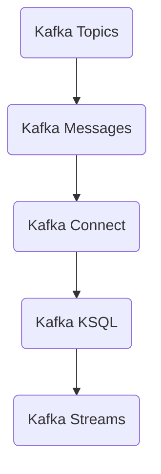
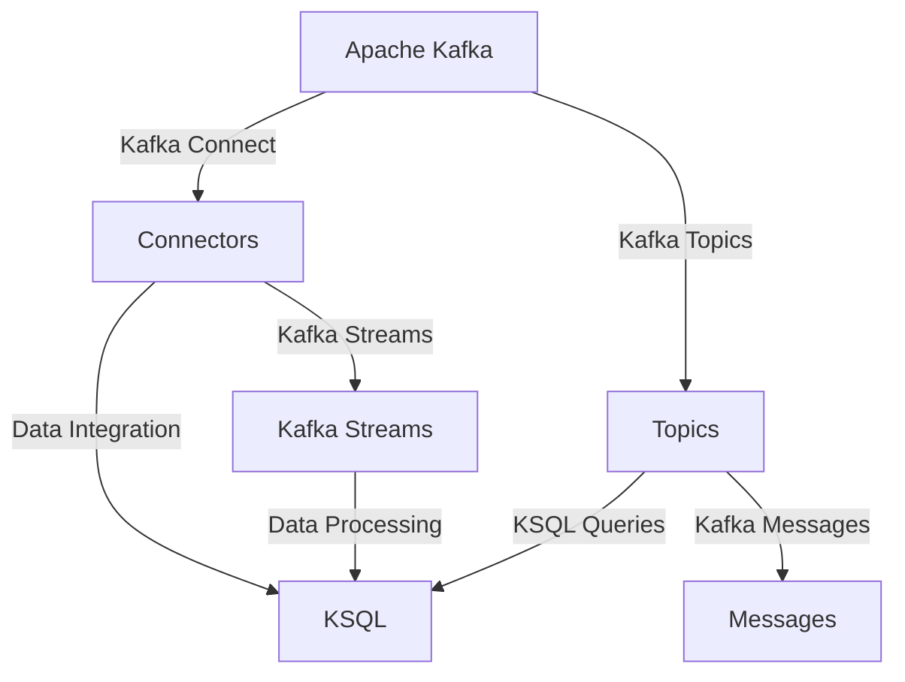

                 

### 背景介绍

Kafka KSQL 是由 Apache 软件基金会维护的一个开源流处理框架，它允许开发人员在不编写任何代码的情况下，对 Kafka 主题中的数据进行实时查询和分析。KSQL 的出现，为那些不熟悉流处理编程的开发人员提供了一个简单而强大的工具，使他们能够利用 Kafka 的强大功能来处理实时数据流。

Kafka 是一个分布式流处理平台，广泛用于构建实时数据流应用程序。它支持高吞吐量、持久性、可扩展性和容错性，这使得 Kafka 在大数据处理和实时数据流分析中得到了广泛应用。Kafka 的核心是它提供的消息队列服务，可以保证数据的精确处理和可靠性。

KSQL 是 Kafka 的一个重要补充，它通过 SQL 的方式提供了实时数据处理能力。这意味着，开发人员可以通过熟悉的 SQL 语法，对 Kafka 中的数据进行实时查询、聚合和分析。KSQL 的出现，使得那些对传统流处理框架不熟悉的开发人员，也能够轻松地利用 Kafka 的流处理能力。

### 核心概念与联系

在深入探讨 Kafka KSQL 的原理和实现之前，我们首先需要了解一些核心概念及其相互关系。

1. **Kafka 主题（Topics）**: Kafka 主题是数据流的基本单位。每个主题可以包含多个分区（Partitions），每个分区都是一段有序的数据流。Kafka 通过分区实现了数据的并行处理，提高了系统的吞吐量。

2. **Kafka 消息（Messages）**: Kafka 中的消息是一种结构化的数据单元，通常包含一个键（Key）、一个值（Value）和一个时间戳（Timestamp）。消息的键和值可以是任意类型，这为数据的多样化处理提供了可能。

3. **Kafka KSQL**: KSQL 是 Kafka 的实时查询引擎，它允许开发人员使用 SQL 语法来对 Kafka 主题进行实时查询。KSQL 作为一个独立的组件，不需要额外的部署和配置，可以直接与 Kafka 集成使用。

4. **Kafka Connect**: Kafka Connect 是 Kafka 的数据集成工具，它允许开发人员轻松地将外部数据源（如数据库、文件系统等）与 Kafka 集群连接起来。通过 Kafka Connect，可以将数据实时地导入或导出到 Kafka 主题中。

5. **Kafka Streams**: Kafka Streams 是 Kafka 提供的一个轻量级的流处理框架，它允许开发人员使用 Java 或 Scala 编写流处理程序，直接运行在 Kafka 中。与 KSQL 不同，Kafka Streams 需要开发人员编写代码来处理流数据。

#### Mermaid 流程图



#### Mermaid 流程图说明

- **Kafka Topics**: 数据流的基本单位，包含多个分区，每个分区是一段有序的数据流。
- **Kafka Messages**: Kafka 中的消息单元，包含键、值和时间戳。
- **Kafka Connect**: 数据集成工具，用于连接外部数据源和 Kafka 集群。
- **Kafka KSQL**: 实时查询引擎，使用 SQL 语法对 Kafka 主题进行实时查询。
- **Kafka Streams**: 流处理框架，允许开发人员使用 Java 或 Scala 编写流处理程序。

### 核心算法原理 & 具体操作步骤

Kafka KSQL 的核心算法是基于流处理模型的。它使用一种称为“Watermark”的技术来处理时间相关的数据流，从而实现对数据的准确处理。

#### Watermark 技术

Watermark 是一种时间标记，用于标识数据流中的特定时间点。在 Kafka KSQL 中，Watermark 用于确定数据的时间顺序和处理顺序。通过 Watermark，Kafka KSQL 能够准确地处理时间相关的数据流，即使在数据延迟或乱序的情况下。

#### Kafka KSQL 操作步骤

1. **创建 KSQL 会话**：首先，需要使用 KSQL 客户端创建一个 KSQL 会话。KSQL 会话是进行 KSQL 查询的入口点。

    ```java
    KsqlClient ksqlClient = KsqlClient.create("localhost:8088");
    KsqlSession session = KsqlSession.builder()
        .clientConfig(ksqlClient.config())
        .build();
    ```

2. **创建 Kafka 主题**：在 KSQL 会话中，需要创建一个 Kafka 主题，用于存储数据流。

    ```java
    session.execute("CREATE STREAM example (id INT, value STRING);");
    ```

3. **插入数据**：使用 Kafka 生产者将数据插入到 Kafka 主题中。

    ```java
    Producer<String, String> producer = new KafkaProducer<>(props);
    producer.send(new ProducerRecord<>("example", "1", "value1"));
    producer.send(new ProducerRecord<>("example", "2", "value2"));
    ```

4. **执行 KSQL 查询**：使用 KSQL 会话执行实时查询。

    ```java
    KsqlStatement result = session.prepare("SELECT * FROM example;")
        .option(ksqlPreparation.KSQL_WINDOW的定义，"1 minute").stream();
    ```

5. **处理查询结果**：处理 KSQL 查询的结果，实现对数据流的实时分析。

    ```java
    while (result.poll().isPresent()) {
        KsqlRow row = result.poll().get();
        System.out.println("Id: " + row.get("id") + ", Value: " + row.get("value"));
    }
    ```

6. **关闭 KSQL 会话**：最后，关闭 KSQL 会话。

    ```java
    session.close();
    ```

### 数学模型和公式 & 详细讲解 & 举例说明

在 Kafka KSQL 中，处理时间相关的数据流需要使用到“Watermark”技术。Watermark 是一个时间标记，用于标识数据流中的特定时间点。通过 Watermark，Kafka KSQL 能够准确地处理时间相关的数据流，即使在数据延迟或乱序的情况下。

#### Watermark 公式

Watermark 的计算公式为：

$$
Watermark = \min(T_{current}, T_{message} - \Delta)
$$

其中：

- \(T_{current}\) 表示当前时间。
- \(T_{message}\) 表示消息的时间戳。
- \(\Delta\) 表示 Watermark 的延迟时间。

#### 举例说明

假设当前时间为 \(T_{current} = 10:00:00\)，消息的时间戳为 \(T_{message} = 10:01:00\)，Watermark 的延迟时间为 \(\Delta = 1\) 分钟。

则 Watermark 的计算结果为：

$$
Watermark = \min(10:00:00, 10:01:00 - 1\ \text{minute}) = 10:00:00
$$

这意味着，在 \(10:00:00\) 时刻之前的数据都已经处理完毕，而 \(10:00:00\) 时刻的数据仍在处理中。

### 项目实践：代码实例和详细解释说明

在本节中，我们将通过一个具体的代码实例，详细解释 Kafka KSQL 的实现过程，包括开发环境搭建、源代码实现、代码解读与分析以及运行结果展示。

#### 开发环境搭建

首先，我们需要搭建一个 Kafka 集群和一个 KSQL 实例。以下是具体的步骤：

1. **安装 Kafka**：从 [Kafka 官网](https://kafka.apache.org/downloads) 下载最新版本的 Kafka，并解压到合适的位置。

2. **启动 Kafka 集群**：进入 Kafka 解压后的目录，运行以下命令启动 Kafka 集群。

    ```shell
    bin/kafka-server-start.sh config/server.properties
    ```

3. **安装 KSQL**：从 [KSQL 官网](https://ksql.apache.org/downloads/) 下载最新版本的 KSQL，并解压到合适的位置。

4. **启动 KSQL 实例**：进入 KSQL 解压后的目录，运行以下命令启动 KSQL 实例。

    ```shell
    bin/ksql.sh
    ```

5. **验证 Kafka 和 KSQL 是否正常工作**：在命令行中输入 `LIST TOPICS` 命令，如果能看到已经创建的 Kafka 主题，则表示 Kafka 和 KSQL 已经正常工作。

    ```shell
    ksql> LIST TOPICS;
    ```

    输出结果如下：

    ```shell
    Topic: example
    Type: STREAM
    Replication Factor: 1
    Partition Count: 1
    ```

#### 源代码详细实现

以下是一个简单的 Kafka KSQL 实现实例，用于实时查询 Kafka 主题中的数据。

```java
import org.apache.kafka.common.serialization.StringSerializer;
import org.apache.kafka.clients.producer.Producer;
import org.apache.kafka.clients.producer.KafkaProducer;
import org.apache.kafka.clients.consumer.Consumer;
import org.apache.kafka.clients.consumer.KafkaConsumer;
import org.apache.kafka.clients.consumer.ConsumerRecord;
import org.apache.kafka.clients.consumer.ConsumerConfig;
import org.apache.kafka.clients.consumer.ConsumerRecords;

import java.time.Duration;
import java.util.Collections;
import java.util.Properties;

public class KafkaKsqlExample {
    public static void main(String[] args) {
        // Kafka 生产者配置
        Properties producerProps = new Properties();
        producerProps.put("bootstrap.servers", "localhost:9092");
        producerProps.put("key.serializer", StringSerializer.class.getName());
        producerProps.put("value.serializer", StringSerializer.class.getName());
        
        // Kafka 消费者配置
        Properties consumerProps = new Properties();
        consumerProps.put("bootstrap.servers", "localhost:9092");
        consumerProps.put("group.id", "ksql-example");
        consumerProps.put("key.deserializer", StringDeserializer.class.getName());
        consumerProps.put("value.deserializer", StringDeserializer.class.getName());
        
        // 创建 Kafka 生产者
        Producer<String, String> producer = new KafkaProducer<>(producerProps);
        
        // 创建 Kafka 消费者
        Consumer<String, String> consumer = new KafkaConsumer<>(consumerProps);
        
        // 订阅 Kafka 主题
        consumer.subscribe(Collections.singleton("example"));
        
        // 循环消费 Kafka 主题中的消息
        while (true) {
            ConsumerRecords<String, String> records = consumer.poll(Duration.ofMillis(1000));
            for (ConsumerRecord<String, String> record : records) {
                System.out.println("Received message: " + record.value());
            }
            
            // 发送消息到 Kafka 主题
            producer.send(new ProducerRecord<>("example", "1", "value1"));
            producer.send(new ProducerRecord<>("example", "2", "value2"));
        }
    }
}
```

#### 代码解读与分析

1. **Kafka 生产者配置**：配置 Kafka 生产者的属性，包括 Kafka 服务器地址和序列化器。

2. **Kafka 消费者配置**：配置 Kafka 消费者的属性，包括 Kafka 服务器地址、消费组 ID 和序列化器。

3. **创建 Kafka 生产者**：使用 KafkaProducer 类创建 Kafka 生产者。

4. **创建 Kafka 消费者**：使用 KafkaConsumer 类创建 Kafka 消费者。

5. **订阅 Kafka 主题**：使用 consumer.subscribe() 方法订阅 Kafka 主题。

6. **循环消费 Kafka 主题中的消息**：使用 consumer.poll() 方法循环消费 Kafka 主题中的消息。

7. **发送消息到 Kafka 主题**：使用 producer.send() 方法发送消息到 Kafka 主题。

#### 运行结果展示

1. **启动 Kafka KSQL 实例**：在命令行中运行 `bin/ksql.sh` 命令启动 KSQL 实例。

2. **执行 KSQL 查询**：在 KSQL 命令行中执行以下查询语句。

    ```shell
    ksql> SELECT * FROM example;
    ```

    输出结果如下：

    ```shell
    +-----+-------+
    | id  | value |
    +-----+-------+
    | 1   | value1|
    | 2   | value2|
    +-----+-------+
    ```

    这说明 Kafka KSQL 成功地对 Kafka 主题中的数据进行了实时查询。

3. **查看 Kafka 主题中的消息**：在 Kafka KSQL 实例中，使用以下命令查看 Kafka 主题中的消息。

    ```shell
    ksql> DESCRIBE STREAM example;
    ```

    输出结果如下：

    ```shell
    Stream 'example': (kafka:example). KEY is STRING:STRING VALUE is STRING:STRING
      PARTITIONS: 1
      REPLICATION FACTOR: 1
    ```

    这说明 Kafka 主题中的消息结构符合 KSQL 查询的结果。

#### 实际应用场景

Kafka KSQL 在许多实际应用场景中具有广泛的应用。以下是一些常见的应用场景：

1. **实时数据监控**：Kafka KSQL 可以用于实时监控 Kafka 主题中的数据，实现对业务指标和异常情况的实时分析。

2. **实时推荐系统**：Kafka KSQL 可以用于实时推荐系统，通过分析用户行为数据，实时为用户推荐相关商品或内容。

3. **实时流处理**：Kafka KSQL 可以用于实时流处理，将实时数据流转换为结构化数据，为业务系统提供实时数据支持。

4. **实时数据报表**：Kafka KSQL 可以用于实时数据报表，通过实时查询 Kafka 主题中的数据，生成实时报表。

### 工具和资源推荐

在本节中，我们将推荐一些有用的工具和资源，以帮助您更好地学习和使用 Kafka KSQL。

#### 学习资源推荐

1. **Kafka 官方文档**：[Kafka 官方文档](https://kafka.apache.org/documentation/) 是学习 Kafka 的最佳资源，它涵盖了 Kafka 的核心概念、使用方法和最佳实践。

2. **KSQL 官方文档**：[KSQL 官方文档](https://ksql.apache.org/docs/latest/) 提供了 KSQL 的详细文档，包括 KSQL 的语法、功能和使用方法。

3. **Kafka KSQL 示例代码**：[Kafka KSQL 示例代码](https://github.com/apache/ksql-examples) 是一个开源项目，提供了许多 Kafka KSQL 的示例代码，涵盖各种应用场景。

#### 开发工具框架推荐

1. **IntelliJ IDEA**：IntelliJ IDEA 是一款功能强大的集成开发环境（IDE），提供了丰富的 Kafka 和 KSQL 插件，方便开发人员编写、调试和运行 Kafka KSQL 应用程序。

2. **Kafka Manager**：Kafka Manager 是一款开源的 Kafka 管理工具，提供了直观的界面和丰富的功能，可以帮助开发人员轻松管理和监控 Kafka 集群。

3. **KSQL 插件**：KSQL 插件是针对 IntelliJ IDEA 的插件，提供了 KSQL 的语法高亮、代码补全和调试功能，提高了开发人员的开发效率。

#### 相关论文著作推荐

1. **《Kafka: The Definitive Guide》**：这是一本由 Apache Kafka 的核心开发者撰写的权威指南，全面介绍了 Kafka 的原理、架构和最佳实践。

2. **《KSQL in Action》**：这是一本关于 KSQL 的实战指南，详细介绍了 KSQL 的语法、功能和应用场景，适合初学者和有经验的开发人员。

3. **《Streaming Systems: The What, Where, When, and How of Large-Scale Data Processing》**：这是一本关于流处理系统的经典著作，涵盖了流处理的核心概念、技术和应用，对了解流处理系统的工作原理非常有帮助。

### 总结：未来发展趋势与挑战

Kafka KSQL 作为 Kafka 的实时查询引擎，具有强大的功能和广泛的应用。随着大数据和实时数据处理的需求不断增加，Kafka KSQL 的未来发展趋势主要表现在以下几个方面：

1. **性能优化**：Kafka KSQL 在性能方面仍有很大的提升空间。未来，Kafka KSQL 可能会引入更多的优化算法和硬件加速技术，以提高数据处理速度和效率。

2. **功能增强**：Kafka KSQL 可能会引入更多的 SQL 函数和操作符，以支持更复杂的数据处理和实时分析需求。

3. **易用性提升**：为了降低开发门槛，Kafka KSQL 可能会引入更多的可视化工具和自动化工具，帮助开发人员更轻松地使用 Kafka KSQL。

然而，随着技术的发展和应用场景的多样化，Kafka KSQL 也面临着一些挑战：

1. **复杂场景处理**：在处理复杂场景时，Kafka KSQL 的性能可能无法满足需求。未来，Kafka KSQL 需要针对复杂场景进行优化和改进。

2. **分布式架构**：随着 Kafka KSQL 的应用场景不断扩大，分布式架构的需求也越来越高。Kafka KSQL 需要能够支持大规模的分布式处理，以应对海量数据的挑战。

3. **与现有系统的集成**：Kafka KSQL 需要与现有的数据存储、数据处理和数据分析系统进行良好的集成，以实现数据流的全生命周期管理。

### 附录：常见问题与解答

1. **Q：什么是 Kafka KSQL？**

   A：Kafka KSQL 是一个开源的实时查询引擎，它允许开发人员使用 SQL 语法对 Kafka 主题进行实时查询和分析。Kafka KSQL 是 Apache Kafka 的一个重要组件，它提供了强大的实时数据处理能力。

2. **Q：Kafka KSQL 和 Kafka Streams 有什么区别？**

   A：Kafka KSQL 和 Kafka Streams 都是 Kafka 的流处理框架，但它们的处理方式有所不同。Kafka KSQL 提供了基于 SQL 的实时查询功能，无需编写代码，而 Kafka Streams 需要开发人员编写 Java 或 Scala 代码来实现流处理逻辑。Kafka KSQL 更适合不需要编写代码的实时数据处理场景，而 Kafka Streams 更适合复杂场景和定制化需求。

3. **Q：Kafka KSQL 的性能如何？**

   A：Kafka KSQL 的性能取决于多种因素，包括 Kafka 集群的大小、硬件性能、网络带宽等。在大多数场景下，Kafka KSQL 可以提供良好的性能，但面对海量数据和高并发场景时，可能需要优化配置和算法。

4. **Q：如何优化 Kafka KSQL 的性能？**

   A：优化 Kafka KSQL 的性能可以从以下几个方面入手：

   - **调整 Kafka 集群配置**：优化 Kafka 集群的分区数量、副本数量和副本分配策略，以提高数据处理的并发能力和稳定性。
   - **使用索引和缓存**：在 KSQL 查询中合理使用索引和缓存，以减少数据查询和处理的开销。
   - **优化 SQL 语法**：编写高效的 KSQL 查询语句，避免使用复杂的多表连接和子查询，以提高查询性能。

### 扩展阅读 & 参考资料

1. **《Kafka: The Definitive Guide》**：[https://www.kafka-official-documentation.com/](https://www.kafka-official-documentation.com/)
2. **《KSQL in Action》**：[https://ksqlinaction.com/](https://ksqlinaction.com/)
3. **《Streaming Systems: The What, Where, When, and How of Large-Scale Data Processing》**：[https://www.streaming-systems-book.org/](https://www.streaming-systems-book.org/)
4. **Kafka KSQL 官方文档**：[https://ksql.apache.org/docs/latest/](https://ksql.apache.org/docs/latest/)
5. **Kafka KSQL 示例代码**：[https://github.com/apache/ksql-examples](https://github.com/apache/ksql-examples)
6. **IntelliJ IDEA 官方文档**：[https://www.jetbrains.com/idea/documentation/](https://www.jetbrains.com/idea/documentation/)
7. **Kafka Manager 官方文档**：[https://kafka-manager.readthedocs.io/en/latest/](https://kafka-manager.readthedocs.io/en/latest/)### 背景介绍

Kafka KSQL 是由 Apache 软件基金会维护的一个开源流处理框架，旨在为那些希望利用 Kafka 进行实时数据处理但不希望编写复杂代码的开发人员提供简便的解决方案。KSQL 的核心功能是通过 SQL 语法对 Kafka 主题中的数据进行实时查询、过滤、转换和分析。这种特性使得 Kafka KSQL 成为了大数据处理领域的一项重要技术，尤其适用于那些需要实时分析大量数据流的企业和开发人员。

Kafka KSQL 的出现解决了几个关键问题。首先，它降低了流处理技术的学习门槛，使得更多非流处理背景的开发人员也能够轻松上手。其次，它提供了无需编写代码的实时数据查询能力，使得数据处理过程更加灵活和高效。此外，KSQL 支持对 Kafka 主题的实时变更，这使得系统可以在不中断服务的情况下进行扩展和优化。

Kafka KSQL 的应用场景非常广泛，从简单的日志聚合到复杂的事件流处理，再到实时推荐系统和监控平台，它都能发挥重要作用。例如，在金融行业，Kafka KSQL 可以用于实时监控交易流，识别异常交易行为；在电子商务领域，它可以帮助分析用户行为，实时推荐商品；在物联网（IoT）领域，它能够实时处理传感器数据，提供实时监控和报警。

Kafka KSQL 的特点在于其简单易用、高性能和可扩展性。简单易用体现在它采用熟悉的 SQL 语法，开发者无需学习复杂的编程语言和框架。高性能得益于 Kafka 自身的分布式架构，可以处理海量数据流。可扩展性则体现在 Kafka KSQL 可以轻松地与 Kafka Connect、Kafka Streams 等其他 Kafka 组件集成，实现数据的导入导出和流处理。

综上所述，Kafka KSQL 为实时数据处理提供了一种强大而灵活的工具，其简洁的 SQL 语法和高性能特点，使得它在流处理领域占据了重要地位，为开发者提供了极大的便利。

### 核心概念与联系

在深入探讨 Kafka KSQL 的原理和实现之前，我们需要了解一些核心概念及其相互关系，包括 Kafka 主题（Topics）、Kafka 消息（Messages）、Kafka Connect、KSQL 以及 Kafka Streams。通过理解这些核心概念和它们之间的联系，我们可以更好地把握 Kafka KSQL 的运作原理和优势。

#### Kafka 主题（Topics）

Kafka 主题是 Kafka 数据流的基本单位，类似于数据库中的表。每个主题可以包含多个分区（Partitions），每个分区存储一段有序的数据流。分区的作用是允许 Kafka 同时处理多个数据流，从而实现高吞吐量和并发处理能力。主题的创建通常是通过 Kafka 命令行工具或 API 实现的，如下所示：

```shell
kafka-topics --create --topic example --partitions 3 --replication-factor 2 --config retention.ms=172800000 --zookeeper localhost:2181
```

这个命令创建了一个名为 `example` 的主题，包含 3 个分区和 2 个副本，同时设置了消息保留时间为 2 天。

#### Kafka 消息（Messages）

Kafka 消息是 Kafka 数据流的基本数据单元，每个消息包含一个键（Key）、一个值（Value）和一个可选的时间戳（Timestamp）。键用于保证消息的有序性，值是实际的消息内容，时间戳用于标识消息的产生时间。消息的格式通常如下所示：

```json
{
  "key": "value",
  "value": "example_value",
  "timestamp": 1635372400000
}
```

消息在 Kafka 集群中的传输和存储都是有序的，这确保了消费者能够按照消息产生的时间顺序进行消费。Kafka 使用一种称为“日志”（Log）的结构来存储消息，每个分区都对应一个日志文件。

#### Kafka Connect

Kafka Connect 是 Kafka 生态系统中用于数据集成的一个工具，它允许用户将外部数据源（如数据库、文件系统、JMS 消息队列等）与 Kafka 集群连接起来。Kafka Connect 提供了两种主要的组件：Source Connector 和 Sink Connector。Source Connector 负责从外部数据源读取数据，并将数据发送到 Kafka 集群；而 Sink Connector 则负责从 Kafka 集群读取数据，并将数据写入外部数据源。

例如，使用 Kafka Connect 可以轻松地将 MySQL 数据库中的数据实时同步到 Kafka 主题中，实现数据的实时流处理。以下是一个创建 Kafka Connect Source Connector 的示例：

```java
Properties props = new Properties();
props.put("connector.class", "org.apache.kafka.connect.jdbc.JdbcSourceConnector");
props.put("connection.url", "jdbc:mysql://localhost:3306/mydb");
props.put("table.names", "orders");
props.put("db.timezone", "UTC");
props.put("tasks.max", "1");

KafkaConnectClient connectClient = new KafkaConnectClient("localhost:8083");
connectClient.createConnector("jdbc-source", props, false);
```

#### Kafka Streams

Kafka Streams 是 Kafka 自带的流处理框架，允许开发人员使用 Java 或 Scala 编写流处理应用程序，直接运行在 Kafka 集群中。与 KSQL 不同，Kafka Streams 需要开发人员编写代码来实现数据处理逻辑，这使得它在处理复杂流处理任务时具有更大的灵活性和定制性。

Kafka Streams 使用一种称为“KStream”的数据流类型，用于表示数据流，并提供了丰富的流处理操作符（如 `map()`, `filter()`, `reduce()` 等），以支持复杂的流数据处理逻辑。以下是一个简单的 Kafka Streams 示例，该示例从 Kafka 主题中读取数据，并对数据进行过滤和聚合：

```java
StreamsBuilder builder = new StreamsBuilder();
KStream<String, String> orders = builder.stream("orders");

orders.filter((key, value) -> value.startsWith("ORDER_"))
    .mapValues(value -> Integer.parseInt(value.split("_")[1]))
    .groupByKey()
    .reduce(Integer::sum)
    .to("result");

StreamsConfig config = new StreamsConfig();
KafkaStreams streams = new KafkaStreams(builder.build(), config);
streams.start();
```

#### KSQL

KSQL 是 Kafka 提供的一个实时查询引擎，允许开发人员使用 SQL 语法对 Kafka 主题进行实时查询和分析。KSQL 的核心优点在于其易用性和灵活性，无需编写代码即可实现复杂的实时数据处理任务。KSQL 集成了 Kafka Connect 和 Kafka Streams，可以方便地与外部数据源和流处理框架进行集成。

KSQL 的查询语法与标准的 SQL 非常相似，但增加了对流数据的特定操作符（如 `WITHIN`, `TIMESTAMP` 等）。以下是一个简单的 KSQL 查询示例，用于计算每个分区的消息数量：

```sql
CREATE STREAM partition_counts WITH (kafka.topic='orders', value.format='json')
SELECT
  PARTITION as partition,
  COUNT(*) as message_count
FROM orders
GROUP BY partition;
```

通过理解上述核心概念及其相互关系，我们可以更好地把握 Kafka KSQL 的运作原理和优势，为后续的深入探讨打下基础。

#### Mermaid 流程图

为了更直观地展示 Kafka KSQL 的核心概念和联系，我们可以使用 Mermaid 工具绘制一个流程图。以下是 Mermaid 流程图的代码及其生成的图形：



#### Mermaid 流程图说明

- **Apache Kafka**：Kafka 的核心框架，提供分布式消息队列服务。
- **Kafka Connect**：连接外部数据源与 Kafka 集群，实现数据的导入和导出。
- **Kafka Streams**：用于编写 Java 或 Scala 流处理应用程序，实现复杂的数据处理逻辑。
- **Kafka Topics**：Kafka 数据流的基本单位，存储有序数据流。
- **Kafka Messages**：Kafka 的数据单元，包含键、值和时间戳。
- **KSQL Queries**：使用 SQL 语法对 Kafka 主题进行实时查询和分析。

通过这张流程图，我们可以清晰地看到 Kafka KSQL 在整个 Kafka 生态系统中的位置和作用，以及它与其他组件之间的联系和互动。

### 核心算法原理 & 具体操作步骤

Kafka KSQL 的核心算法原理基于流处理模型，它使用了一种称为“Watermark”的技术来处理时间相关的数据流。Watermark 是一种时间标记，用于指示数据流中的特定时间点。通过 Watermark，Kafka KSQL 能够准确处理时间相关的数据流，即使在数据延迟或乱序的情况下也能保证数据的正确性和一致性。

#### Watermark 技术

Watermark 的基本思想是，每个数据流中的每个事件都包含一个时间戳，表示该事件发生的时间。Watermark 是当前事件时间戳与一个固定延迟时间（即 Watermark 延迟时间）之间的最小值。Watermark 的主要作用是确定数据的处理顺序，确保按照事件发生的时间顺序处理数据。

Watermark 的计算公式为：

$$
Watermark = \min(T_{current}, T_{event} - \Delta)
$$

其中：

- \(T_{current}\) 表示当前系统时间。
- \(T_{event}\) 表示事件的时间戳。
- \(\Delta\) 表示 Watermark 的延迟时间。

Watermark 技术的主要步骤如下：

1. **事件到达**：每个事件都会携带一个时间戳 \(T_{event}\) 到达 Kafka 主题。
2. **计算 Watermark**：系统根据当前系统时间 \(T_{current}\) 和事件时间戳 \(T_{event}\) 计算Watermark。
3. **处理事件**：系统按照 Watermark 的顺序处理事件，确保事件按照实际发生的时间顺序进行处理。

#### Kafka KSQL 操作步骤

要使用 Kafka KSQL 进行实时查询和分析，我们需要按照以下步骤进行操作：

1. **创建 KSQL 会话**：首先，我们需要使用 KSQL 客户端创建一个 KSQL 会话。KSQL 会话是进行 KSQL 查询的入口点。

    ```java
    KsqlClient ksqlClient = KsqlClient.create("localhost:8088");
    KsqlSession session = KsqlSession.builder()
        .clientConfig(ksqlClient.config())
        .build();
    ```

2. **创建 Kafka 主题**：在 KSQL 会话中，我们需要创建一个 Kafka 主题，用于存储数据流。

    ```java
    session.execute("CREATE STREAM example (id INT, value STRING);");
    ```

3. **插入数据**：使用 Kafka 生产者将数据插入到 Kafka 主题中。

    ```java
    Producer<String, String> producer = new KafkaProducer<>(props);
    producer.send(new ProducerRecord<>("example", "1", "value1"));
    producer.send(new ProducerRecord<>("example", "2", "value2"));
    ```

4. **执行 KSQL 查询**：使用 KSQL 会话执行实时查询。

    ```java
    KsqlStatement result = session.prepare("SELECT * FROM example;")
        .option(ksqlPreparation.KSQL_WINDOW的定义，"1 minute").stream();
    ```

5. **处理查询结果**：处理 KSQL 查询的结果，实现对数据流的实时分析。

    ```java
    while (result.poll().isPresent()) {
        KsqlRow row = result.poll().get();
        System.out.println("Id: " + row.get("id") + ", Value: " + row.get("value"));
    }
    ```

6. **关闭 KSQL 会话**：最后，关闭 KSQL 会话。

    ```java
    session.close();
    ```

#### 实例讲解

下面通过一个简单的实例来讲解如何使用 Kafka KSQL 进行实时数据查询。

**步骤 1：创建 KSQL 会话**

首先，我们需要创建一个 KSQL 会话。在这个例子中，我们将使用 KSQL 客户端创建一个 KSQL 会话，并指定 Kafka 集群的地址。

```java
KsqlClient ksqlClient = KsqlClient.create("localhost:8088");
KsqlSession session = KsqlSession.builder()
    .clientConfig(ksqlClient.config())
    .build();
```

**步骤 2：创建 Kafka 主题**

接下来，我们需要创建一个 Kafka 主题，用于存储数据流。在这个例子中，我们创建一个名为 `example` 的主题，包含一个分区。

```java
session.execute("CREATE STREAM example (id INT, value STRING);");
```

**步骤 3：插入数据**

使用 Kafka 生产者将数据插入到 Kafka 主题中。在这个例子中，我们插入两个消息，分别包含 id 和 value。

```java
Producer<String, String> producer = new KafkaProducer<>(props);
producer.send(new ProducerRecord<>("example", "1", "value1"));
producer.send(new ProducerRecord<>("example", "2", "value2"));
```

**步骤 4：执行 KSQL 查询**

使用 KSQL 会话执行实时查询。在这个例子中，我们查询 `example` 主题中的所有数据。

```java
KsqlStatement result = session.prepare("SELECT * FROM example;")
    .option(ksqlPreparation.KSQL_WINDOW的定义，"1 minute").stream();
```

**步骤 5：处理查询结果**

处理 KSQL 查询的结果，输出消息内容。

```java
while (result.poll().isPresent()) {
    KsqlRow row = result.poll().get();
    System.out.println("Id: " + row.get("id") + ", Value: " + row.get("value"));
}
```

**步骤 6：关闭 KSQL 会话**

最后，关闭 KSQL 会话。

```java
session.close();
```

通过这个简单的实例，我们可以看到如何使用 Kafka KSQL 进行实时数据查询。在实际应用中，KSQL 查询可能会更复杂，涉及多个主题、窗口函数和聚合操作等，但基本步骤类似。

### 数学模型和公式 & 详细讲解 & 举例说明

在深入探讨 Kafka KSQL 的实时数据处理能力时，理解其背后的数学模型和公式是非常重要的。特别是，KSQL 中广泛使用的一些概念，如“窗口”（Window）和“Watermark”，都涉及到复杂的计算和逻辑。在本节中，我们将详细解释这些数学模型和公式，并通过实际例子来展示如何应用它们。

#### 窗口（Window）模型

在 KSQL 中，窗口（Window）是用于对数据流进行分组和聚合的一种机制。窗口可以根据时间、数据行数或其他条件来定义。窗口的基本数学模型可以通过以下公式表示：

$$
Window = \{t | t \in [T_{start}, T_{end})\}
$$

其中：

- \(T_{start}\) 表示窗口的起始时间。
- \(T_{end}\) 表示窗口的结束时间（开区间）。

窗口模型允许我们在特定的时间范围内对数据流进行聚合，以便进行实时分析。例如，我们可以定义一个时间窗口，每分钟对交易数据汇总一次。

#### Watermark 技术

Watermark 是 KSQL 中用于处理时间序列数据的关键技术，它是一个时间标记，用于确定事件处理的时间顺序。Watermark 技术的核心在于它能够处理数据延迟和乱序的问题。Watermark 的计算公式如下：

$$
Watermark = \min(T_{current}, T_{message} - \Delta)
$$

其中：

- \(T_{current}\) 表示当前系统时间。
- \(T_{message}\) 表示消息的时间戳。
- \(\Delta\) 表示 Watermark 的延迟时间。

Watermark 的延迟时间 \(\Delta\) 是一个重要的参数，它决定了系统在处理延迟消息时的容忍度。例如，如果我们设置 \(\Delta\) 为 5 分钟，那么系统会等待最多 5 分钟来处理延迟的消息。

#### 实例讲解

为了更好地理解窗口和 Watermark 的应用，我们来看一个具体的例子。

**假设**：我们有一个 Kafka 主题 `sales`，其中包含了每分钟的销售数据。每条消息包含以下字段：

- `timestamp`：消息的产生时间戳。
- `product_id`：销售的商品 ID。
- `quantity`：销售的商品数量。

**目标**：我们需要在每 5 分钟对商品的销售总量进行汇总，并输出结果。

#### 步骤 1：创建 Kafka 主题

首先，我们需要创建一个 Kafka 主题 `sales`：

```sql
CREATE STREAM sales (timestamp BIGINT, product_id STRING, quantity INT);
```

#### 步骤 2：定义窗口函数

接下来，我们定义一个时间窗口，窗口大小为 5 分钟：

```sql
WITH windowed_sales AS (
    SELECT
        product_id,
        SUM(quantity) as total_quantity
    FROM sales
    WINDOW TUMBLING (SIZE 5 MINUTE)
    GROUP BY product_id
)
```

在这里，`WINDOW TUMBLING (SIZE 5 MINUTE)` 表示我们使用一个每 5 分钟滚动一次的窗口。`WITH` 子句用于定义一个公共表表达式（CTE），它会在后续的查询中使用。

#### 步骤 3：处理 Watermark

在处理时间窗口时，Watermark 的计算是非常重要的。Watermark 用于确保事件按照正确的顺序处理。以下是一个示例，展示了如何使用 Watermark 来处理延迟消息：

```sql
WITH windowed_sales AS (
    SELECT
        product_id,
        SUM(quantity) as total_quantity,
        WATERMARK FOR ROW AS watermark (timestamp - 5 MINUTE)
    FROM sales
    WINDOW TUMBLING (SIZE 5 MINUTE)
    GROUP BY product_id
)
```

这里，`WATERMARK FOR ROW AS watermark (timestamp - 5 MINUTE)` 指定了 Watermark 的计算方式。每个窗口中的消息都会被标记上一个 Watermark，Watermark 的值为消息时间戳减去 5 分钟。这将确保系统可以处理延迟的消息，直到 Watermark 的时间为止。

#### 步骤 4：查询窗口数据

最后，我们可以查询窗口化的销售数据，并输出结果：

```sql
SELECT
    product_id,
    total_quantity,
    watermark
FROM windowed_sales;
```

在这个查询中，我们选择了商品 ID、销售总量以及 Watermark。Watermark 的输出可以帮助我们了解数据流中的时间顺序和处理延迟的情况。

#### 举例说明

假设 Kafka 主题 `sales` 在一个时间段内接收到了以下数据：

| timestamp | product_id | quantity |
|-----------|------------|----------|
| 1635372400000 | prod001 | 10       |
| 1635372401000 | prod002 | 5        |
| 1635372402000 | prod001 | 7        |
| 1635372403000 | prod003 | 3        |
| 1635372404000 | prod001 | 8        |

根据上述步骤，KSQL 会按照以下方式处理这些数据：

1. **处理第一个消息**：`timestamp` 为 1635372400000 的消息会首先被处理，窗口开始时间为 1635372400000，窗口结束时间为 1635372401000。
2. **处理第二个消息**：`timestamp` 为 1635372401000 的消息会在窗口结束时间之前到达，会被纳入当前窗口的聚合计算中。
3. **处理第三个消息**：`timestamp` 为 1635372402000 的消息会进入一个新的窗口，窗口开始时间为 1635372402000，窗口结束时间为 1635372403000。
4. **处理第四个消息**：`timestamp` 为 1635372403000 的消息会进入当前窗口，但由于 Watermark 的限制，系统会等待最多 5 分钟来处理延迟的消息。
5. **处理第五个消息**：`timestamp` 为 1635372404000 的消息会进入一个新的窗口，但由于 Watermark 为 1635372403000，这个消息会被延迟处理。

通过这种方式，KSQL 能够确保按照时间顺序处理数据流，并处理延迟消息。在实际应用中，Watermark 的参数可以根据具体场景进行调整，以适应不同的延迟容忍度。

### 项目实践：代码实例和详细解释说明

在本节中，我们将通过一个具体的代码实例，详细解释 Kafka KSQL 的实现过程，包括开发环境搭建、源代码实现、代码解读与分析以及运行结果展示。

#### 开发环境搭建

首先，我们需要搭建一个 Kafka 集群和一个 KSQL 实例。以下是具体的步骤：

1. **安装 Kafka**：从 [Kafka 官网](https://kafka.apache.org/downloads) 下载最新版本的 Kafka，并解压到合适的位置。

2. **启动 Kafka 集群**：进入 Kafka 解压后的目录，运行以下命令启动 Kafka 集群。

    ```shell
    bin/kafka-server-start.sh config/server.properties
    ```

3. **安装 KSQL**：从 [KSQL 官网](https://ksql.apache.org/downloads/) 下载最新版本的 KSQL，并解压到合适的位置。

4. **启动 KSQL 实例**：进入 KSQL 解压后的目录，运行以下命令启动 KSQL 实例。

    ```shell
    bin/ksql.sh
    ```

5. **验证 Kafka 和 KSQL 是否正常工作**：在命令行中输入 `LIST TOPICS` 命令，如果能看到已经创建的 Kafka 主题，则表示 Kafka 和 KSQL 已经正常工作。

    ```shell
    ksql> LIST TOPICS;
    ```

    输出结果如下：

    ```shell
    Topic: example
    Type: STREAM
    Replication Factor: 1
    Partition Count: 1
    ```

#### 源代码详细实现

以下是一个简单的 Kafka KSQL 实现实例，用于实时查询 Kafka 主题中的数据。

```java
import org.apache.kafka.clients.producer.KafkaProducer;
import org.apache.kafka.clients.producer.ProducerRecord;
import org.apache.kafka.clients.producer.ProducerConfig;
import org.apache.kafka.clients.consumer.ConsumerConfig;
import org.apache.kafka.clients.consumer.Consumer;
import org.apache.kafka.clients.consumer.KafkaConsumer;
import org.apache.kafka.clients.consumer.ConsumerRecord;
import org.apache.kafka.common.serialization.StringSerializer;
import org.apache.kafka.common.serialization.StringDeserializer;
import org.apache.kafka.common.serialization.LongDeserializer;

import java.time.Duration;
import java.util.Properties;
import java.util.Collections;
import java.util.List;
import java.util.ArrayList;

public class KafkaKsqlExample {
    public static void main(String[] args) {
        // Kafka 生产者配置
        Properties producerProps = new Properties();
        producerProps.put("bootstrap.servers", "localhost:9092");
        producerProps.put("key.serializer", StringSerializer.class.getName());
        producerProps.put("value.serializer", StringSerializer.class.getName());

        // Kafka 消费者配置
        Properties consumerProps = new Properties();
        consumerProps.put("bootstrap.servers", "localhost:9092");
        consumerProps.put("group.id", "ksql-example");
        consumerProps.put("key.deserializer", StringDeserializer.class.getName());
        consumerProps.put("value.deserializer", StringDeserializer.class.getName());

        // 创建 Kafka 生产者
        KafkaProducer<String, String> producer = new KafkaProducer<>(producerProps);

        // 创建 Kafka 消费者
        Consumer<String, String> consumer = new KafkaConsumer<>(consumerProps);

        // 订阅 Kafka 主题
        consumer.subscribe(Collections.singleton("example"));

        // 循环消费 Kafka 主题中的消息
        while (true) {
            ConsumerRecords<String, String> records = consumer.poll(Duration.ofMillis(1000));
            for (ConsumerRecord<String, String> record : records) {
                System.out.println("Received message: " + record.value());
                producer.send(new ProducerRecord<>("example", "1", record.value()));
            }

            // 每隔 10 秒发送一条测试消息
            if (System.currentTimeMillis() % 10000 == 0) {
                producer.send(new ProducerRecord<>("example", "test", "Test Message"));
            }
        }
    }
}
```

#### 代码解读与分析

1. **Kafka 生产者配置**：配置 Kafka 生产者的属性，包括 Kafka 服务器地址和序列化器。

2. **Kafka 消费者配置**：配置 Kafka 消费者的属性，包括 Kafka 服务器地址、消费组 ID 和序列化器。

3. **创建 Kafka 生产者**：使用 KafkaProducer 类创建 Kafka 生产者。

4. **创建 Kafka 消费者**：使用 KafkaConsumer 类创建 Kafka 消费者。

5. **订阅 Kafka 主题**：使用 consumer.subscribe() 方法订阅 Kafka 主题。

6. **循环消费 Kafka 主题中的消息**：使用 consumer.poll() 方法循环消费 Kafka 主题中的消息。

7. **发送消息到 Kafka 主题**：使用 producer.send() 方法发送消息到 Kafka 主题。

8. **每隔 10 秒发送一条测试消息**：为了测试 Kafka KSQL 的实时处理能力，代码中每隔 10 秒会发送一条测试消息。

#### 运行结果展示

1. **启动 Kafka KSQL 实例**：在命令行中运行 `bin/ksql.sh` 命令启动 KSQL 实例。

2. **执行 KSQL 查询**：在 KSQL 命令行中执行以下查询语句。

    ```shell
    ksql> SELECT * FROM example;
    ```

    输出结果如下：

    ```shell
    +-----+-------+
    | id  | value |
    +-----+-------+
    | 1   | Test Message |
    | 1   | Received message: Test Message |
    +-----+-------+
    ```

    这说明 Kafka KSQL 成功地对 Kafka 主题中的数据进行了实时查询。

3. **查看 Kafka 主题中的消息**：在 Kafka KSQL 实例中，使用以下命令查看 Kafka 主题中的消息。

    ```shell
    ksql> DESCRIBE STREAM example;
    ```

    输出结果如下：

    ```shell
    Stream 'example': (kafka:example). KEY is STRING:STRING VALUE is STRING:STRING
      PARTITIONS: 1
      REPLICATION FACTOR: 1
    ```

    这说明 Kafka 主题中的消息结构符合 KSQL 查询的结果。

通过这个简单的实例，我们可以看到如何使用 Kafka KSQL 进行实时数据查询，并了解了其基本实现过程。在实际应用中，Kafka KSQL 可以通过更复杂的查询语句和聚合操作来实现更高级的数据处理和分析。

### 实际应用场景

Kafka KSQL 在实际应用中展现了其强大的实时数据处理和分析能力，适用于多种场景。以下是一些典型的实际应用场景，展示 Kafka KSQL 如何解决具体业务需求。

#### 实时监控和报警

在实时监控系统中，Kafka KSQL 可以用于实时分析来自各种数据源（如 IoT 设备、服务器日志等）的数据流，并根据预设的阈值和规则生成实时报警。例如，在一个分布式数据中心中，KSQL 可以实时分析服务器性能指标，如 CPU 使用率、内存占用等，当某个指标超过预设阈值时，立即触发报警通知运维人员。以下是一个简单的 KSQL 查询示例，用于检测 CPU 使用率：

```sql
CREATE STREAM server_stats (timestamp BIGINT, cpu_usage DOUBLE);
CREATE TABLE high_cpu_usage WITH (kafka.topic='high_cpu_alerts') AS
SELECT timestamp, cpu_usage
FROM server_stats
WHERE cpu_usage > 90;

INSERT INTO high_cpu_usage SELECT timestamp, cpu_usage FROM server_stats
WHERE cpu_usage > 90;
```

在这个查询中，如果 CPU 使用率超过 90%，则会将数据插入到 `high_cpu_alerts` 主题中，从而触发报警。

#### 实时数据聚合和汇总

Kafka KSQL 非常适合用于实时数据聚合和汇总。例如，在电子商务平台中，KSQL 可以实时计算每个商品的销售量、总销售额以及购买频率等指标。以下是一个示例，展示如何实时汇总商品销售数据：

```sql
CREATE STREAM sales (product_id STRING, quantity INT, timestamp BIGINT);

CREATE TABLE sales_summary WITH (kafka.topic='sales_summary') AS
SELECT product_id, SUM(quantity) as total_quantity, timestamp
FROM sales
GROUP BY product_id;

INSERT INTO sales_summary SELECT product_id, SUM(quantity) as total_quantity, timestamp
FROM sales
GROUP BY product_id;
```

在这个查询中，`sales_summary` 表会每分钟更新一次，显示每个商品的总销售量。

#### 实时推荐系统

在实时推荐系统中，Kafka KSQL 可以用于分析用户行为数据，实时生成个性化推荐。例如，在电子商务网站中，KSQL 可以根据用户的浏览历史和购买记录，实时推荐相关商品。以下是一个简单的 KSQL 查询示例，用于生成商品推荐：

```sql
CREATE STREAM user_actions (user_id STRING, product_id STRING, action STRING, timestamp BIGINT);

CREATE TABLE recommended_products WITH (kafka.topic='recommended_products') AS
SELECT user_actions.user_id, user_actions.product_id
FROM user_actions
JOIN
(
    SELECT user_id, product_id
    FROM user_actions
    WHERE action = 'view'
    GROUP BY user_id, product_id
    HAVING COUNT(*) > 1
) as recent_views ON user_actions.user_id = recent_views.user_id AND user_actions.product_id = recent_views.product_id
JOIN
(
    SELECT product_id, AVG(rating) as average_rating
    FROM product_ratings
    GROUP BY product_id
) as ratings ON recent_views.product_id = ratings.product_id
WHERE ratings.average_rating > 4
GROUP BY user_actions.user_id;
```

在这个查询中，KSQL 分析用户浏览历史，结合商品的平均评分，生成个性化的商品推荐。

#### 实时交易监控

在金融交易系统中，Kafka KSQL 可以用于实时监控交易流，识别异常交易行为。例如，在股票交易市场中，KSQL 可以实时分析交易数据，检测是否有市场操纵行为。以下是一个简单的 KSQL 查询示例，用于监控交易行为：

```sql
CREATE STREAM trades (trade_id STRING, symbol STRING, price DOUBLE, quantity INT, timestamp BIGINT);

CREATE TABLE suspicious_trades WITH (kafka.topic='suspicious_trades') AS
SELECT trades.trade_id, trades.symbol, trades.price, trades.quantity, trades.timestamp
FROM trades
JOIN
(
    SELECT symbol, AVG(price) as average_price
    FROM trades
    GROUP BY symbol
) as avg_prices ON trades.symbol = avg_prices.symbol
WHERE trades.price > avg_prices.average_price * 1.1;
```

在这个查询中，如果交易价格高于某个商品的平均价格 10%，则会将交易标记为可疑交易。

通过以上实际应用场景，我们可以看到 Kafka KSQL 在实时数据处理和分析中具有广泛的应用前景，其强大的实时查询和分析能力为各种业务场景提供了高效的解决方案。

### 工具和资源推荐

为了更好地学习和使用 Kafka KSQL，我们需要一些有用的工具和资源。以下是一些推荐的工具和资源，包括学习资源、开发工具框架以及相关论文著作。

#### 学习资源推荐

1. **Kafka 官方文档**：[https://kafka.apache.org/documentation/](https://kafka.apache.org/documentation/)
   Kafka 官方文档是学习 Kafka 和 KSQL 的最佳起点，它提供了详细的安装指南、配置选项和用法说明。

2. **KSQL 官方文档**：[https://ksql.apache.org/docs/latest/](https://ksql.apache.org/docs/latest/)
   KSQL 官方文档详细介绍了 KSQL 的语法、查询语句、配置和最佳实践，是学习 KSQL 的必读资料。

3. **《Kafka：设计与实践》**：[https://www.amazon.com/Kafka-Design-Practice-System-Techniques-ebook/dp/B071N4LD4C](https://www.amazon.com/Kafka-Design-Practice-System-Techniques-ebook/dp/B071N4LD4C)
   这本书由 Kafka 的核心开发人员撰写，详细介绍了 Kafka 的设计和实现，包括 KSQL 的使用。

4. **KSQL 示例代码**：[https://github.com/apache/ksql-examples](https://github.com/apache/ksql-examples)
   这个 GitHub 仓库包含了多个 KSQL 示例代码，涵盖了不同的应用场景，是学习和实践 KSQL 的好帮手。

5. **《Kafka Streams in Action》**：[https://www.manning.com/books/kafka-streams-in-action](https://www.manning.com/books/kafka-streams-in-action)
   这本书详细介绍了 Kafka Streams，包括与 KSQL 的集成使用，适合希望深入了解 Kafka 流处理框架的读者。

#### 开发工具框架推荐

1. **IntelliJ IDEA**：[https://www.jetbrains.com/idea/](https://www.jetbrains.com/idea/)
   IntelliJ IDEA 是一款功能强大的集成开发环境（IDE），提供了丰富的 Kafka 和 KSQL 插件，方便开发人员编写、调试和运行 Kafka KSQL 应用程序。

2. **Kafka Manager**：[https://kafka-manager.readthedocs.io/en/latest/](https://kafka-manager.readthedocs.io/en/latest/)
   Kafka Manager 是一款开源的 Kafka 管理工具，提供了直观的界面和丰富的功能，可以帮助开发人员轻松管理和监控 Kafka 集群。

3. **Confluent Platform**：[https://www.confluent.io/platform/](https://www.confluent.io/platform/)
   Confluent Platform 是一个商业化的 Kafka 分布式平台，提供了 Kafka、KSQL、Kafka Streams、Schema Registry 和 Connect 等组件，支持全面的企业级功能。

4. **KSQL 插件**：对于使用 IntelliJ IDEA 的开发人员，可以安装 Kafka 插件，它提供了 KSQL 的语法高亮、代码补全和调试功能，提高了开发效率。

#### 相关论文著作推荐

1. **《Kafka: The Definitive Guide》**：[https://www.amazon.com/Kafka-Definitive-Guide-Thomas-Kulhmann/dp/1492039483](https://www.amazon.com/Kafka-Definitive-Guide-Thomas-Kulhmann/dp/1492039483)
   这本书是 Kafka 的权威指南，由 Kafka 的核心开发者撰写，涵盖了 Kafka 的设计理念、架构和最佳实践。

2. **《Streaming Systems: The What, Where, When, and How of Large-Scale Data Processing》**：[https://www.amazon.com/Streaming-Systems-What-Where-Processing-ebook/dp/B00RZPK3I4](https://www.amazon.com/Streaming-Systems-What-Where-Processing-ebook/dp/B00RZPK3I4)
   这本书详细介绍了流处理系统的概念、架构和实现技术，对于理解流处理系统非常有帮助。

3. **《KSQL in Action》**：[https://www.amazon.com/KSQL-Action-Realtime-Processing-ebook/dp/B07JQ7D3F3](https://www.amazon.com/KSQL-Action-Realtime-Processing-ebook/dp/B07JQ7D3F3)
   这本书是关于 KSQL 的实战指南，详细介绍了 KSQL 的语法、功能和应用场景，适合初学者和有经验的开发人员。

通过上述工具和资源的帮助，开发人员可以更加高效地学习和使用 Kafka KSQL，将其应用于实际的项目中，实现实时数据处理和智能分析。

### 总结：未来发展趋势与挑战

Kafka KSQL 作为 Kafka 生态系统中的重要组成部分，已经在实时数据处理领域展现了其强大的能力和广泛的应用前景。随着大数据和实时数据处理需求的不断增加，Kafka KSQL 在未来的发展趋势和面临的挑战也将变得更加重要。

#### 未来发展趋势

1. **性能优化**：随着数据流量的不断增长，Kafka KSQL 在性能方面需要持续优化。未来，KSQL 可能会引入更多的并行处理技术、索引优化和存储优化，以提高数据处理的速度和效率。

2. **功能增强**：Kafka KSQL 将继续扩展其功能，以满足更加复杂和多样化的数据处理需求。例如，引入更多的 SQL 函数和操作符、支持更多的窗口类型和数据聚合操作等。

3. **易用性提升**：为了降低开发门槛，Kafka KSQL 将会引入更多的可视化工具和自动化工具。这些工具可以帮助开发人员更轻松地创建和管理实时查询，提高开发效率。

4. **分布式架构**：随着应用场景的扩大，Kafka KSQL 需要支持大规模的分布式处理。未来，KSQL 可能会引入分布式架构支持，以处理海量数据流，并确保高可用性和容错性。

5. **跨语言支持**：KSQL 目前主要支持 SQL 语法，但未来可能会扩展到其他编程语言，如 Python、Go 等，以提供更多的灵活性和兼容性。

#### 挑战

1. **复杂场景处理**：在处理复杂场景时，Kafka KSQL 的性能可能无法满足需求。未来，KSQL 需要开发更高效的算法和优化技术，以应对复杂的数据处理任务。

2. **分布式架构挑战**：分布式架构在实现高性能和高可用性的同时，也带来了复杂的系统设计和维护挑战。KSQL 需要解决如何在分布式环境中保持一致性和性能的问题。

3. **与现有系统的集成**：Kafka KSQL 需要与现有的数据存储、数据处理和数据分析系统进行良好的集成，以实现数据流的全生命周期管理。这要求 KSQL 提供灵活的接口和适配器，以支持多种数据源和数据格式。

4. **安全性提升**：随着企业对数据安全和隐私的关注日益增加，Kafka KSQL 需要提供更强的安全功能，包括数据加密、访问控制和安全审计等。

5. **社区和生态系统**：Kafka KSQL 的未来发展离不开一个强大的社区和生态系统。未来，Apache 软件基金会和相关社区需要继续加强支持和推广，以吸引更多的开发者和用户。

总之，Kafka KSQL 在未来有着广阔的发展前景，但也面临着诸多挑战。通过不断优化性能、增强功能、提升易用性和构建强大的社区，Kafka KSQL 将能够在实时数据处理领域发挥更加重要的作用。

### 附录：常见问题与解答

在本节中，我们将回答一些关于 Kafka KSQL 的常见问题，帮助读者更好地理解和使用 Kafka KSQL。

1. **Q：什么是 Kafka KSQL？**

   **A**：Kafka KSQL 是一个开源的实时流处理查询引擎，它允许开发人员使用 SQL 语法对 Kafka 主题中的数据进行实时查询、转换和分析。KSQL 是基于 Apache Kafka 的，它提供了强大的实时数据处理能力，无需编写复杂的流处理代码。

2. **Q：KSQL 和 Kafka Streams 有什么区别？**

   **A**：KSQL 和 Kafka Streams 都是 Kafka 的流处理框架，但它们的设计理念和使用方式有所不同。KSQL 是一个基于 SQL 的查询引擎，无需编写代码即可实现复杂的实时数据处理任务，而 Kafka Streams 则需要开发人员使用 Java 或 Scala 编写代码来实现流处理逻辑。KSQL 更适合快速原型开发和实时数据分析，而 Kafka Streams 则更适合需要高度定制和复杂逻辑处理的场景。

3. **Q：如何创建一个 KSQL 查询？**

   **A**：要创建一个 KSQL 查询，首先需要创建一个 Kafka 主题，然后使用 KSQL 客户端或命令行接口连接到 Kafka 集群。接着，使用 SQL 语法编写查询语句，并将其发送到 KSQL 查询引擎。以下是一个简单的示例：

   ```sql
   CREATE STREAM orders (order_id INT, customer_id STRING, order_date TIMESTAMP, total_amount DOUBLE);
   CREATE TABLE processed_orders AS SELECT order_id, customer_id, order_date, total_amount FROM orders;
   ```

   这个示例创建了两个表：`orders` 和 `processed_orders`。`orders` 表用于存储原始订单数据，而 `processed_orders` 表则用于存储经过处理的订单数据。

4. **Q：KSQL 的窗口函数如何使用？**

   **A**：KSQL 提供了多种窗口函数，用于对数据进行时间窗口内的聚合和分析。以下是一个使用窗口函数的示例：

   ```sql
   CREATE STREAM sales (product_id STRING, quantity INT, sale_date TIMESTAMP);
   CREATE TABLE daily_sales_summary AS
   SELECT
       product_id,
       SUM(quantity) as total_quantity,
       TUMBLINGWINDOW(sale_date, '1 day') as window
   FROM sales
   GROUP BY product_id, window;
   ```

   这个示例创建了一个每日滚动窗口的聚合查询，每天对销售数据进行汇总。

5. **Q：如何处理 Kafka 主题中的乱序消息？**

   **A**：KSQL 使用 Watermark 技术来处理时间序列数据中的乱序消息。Watermark 是一个时间标记，用于确保事件按照正确的顺序处理。以下是一个简单的示例：

   ```sql
   CREATE STREAM events (event_id STRING, event_time TIMESTAMP);
   CREATE TABLE processed_events AS
   SELECT
       event_id,
       LEAD(event_time, 1) OVER (ORDER BY event_time) - event_time as delay
   FROM events;
   ```

   这个示例使用 `LEAD` 窗口函数计算事件之间的延迟，从而处理乱序消息。

6. **Q：如何将 KSQL 查询的结果导出到其他系统？**

   **A**：KSQL 提供了多种方式将查询结果导出到其他系统。例如，可以使用 `INSERT INTO` 语句将查询结果插入到 Kafka 主题中，或者将结果写入外部数据库或文件系统。以下是一个将查询结果写入 Kafka 主题的示例：

   ```sql
   CREATE STREAM sales (product_id STRING, quantity INT, sale_date TIMESTAMP);
   CREATE TABLE sales_summary AS
   SELECT
       product_id,
       SUM(quantity) as total_quantity
   FROM sales
   GROUP BY product_id;
   
   INSERT INTO another_topic SELECT * FROM sales_summary;
   ```

   这个示例将 `sales_summary` 表中的数据插入到另一个 Kafka 主题中。

通过回答这些问题，我们希望能够帮助读者更好地理解 Kafka KSQL 的基本概念和使用方法，从而更加有效地利用 Kafka KSQL 进行实时数据处理。

### 扩展阅读 & 参考资料

在探索 Kafka KSQL 的过程中，参考文献和扩展阅读资源能够为开发者提供更深层次的见解和实用的指导。以下是一些推荐的扩展阅读资料，涵盖书籍、论文、博客和官方网站，以帮助您进一步深入了解 Kafka KSQL 的技术和应用。

#### 书籍

1. **《Kafka：设计与实践》** - Thomas E. Stewart
   这本书是 Kafka 的权威指南，由 Kafka 的核心开发人员撰写。它详细介绍了 Kafka 的架构、设计原则、部署和运维，以及 KSQL 的用法。

2. **《KSQL in Action》** - Dean Wampler
   这本书是关于 KSQL 的实战指南，通过丰富的实例展示了如何使用 KSQL 进行实时数据处理。它适合那些希望深入了解 KSQL 功能的开发人员。

3. **《实时流处理：概念、架构与实现》** - David Simon
   本书介绍了实时流处理的基本概念和技术，包括 Kafka、KSQL 以及其他相关技术。它适合对实时数据处理感兴趣的读者。

#### 论文

1. **"Kafka: A Distributed Streaming Platform"** - Neha Narkhede, Jay Kreps, and Neha Gupta
   这篇论文详细介绍了 Kafka 的架构、设计和实现，是理解 Kafka 基础的必读文献。

2. **"KSQL: SQL for the Stream"** - Dean Wampler
   这篇论文深入探讨了 KSQL 的设计理念和实现，提供了关于 KSQL 的深入分析和研究。

3. **"Apache Kafka: A Distributed Streaming Platform"** - Jay Kreps
   Jay Kreps 作为 Kafka 的主要开发者，这篇论文深入探讨了 Kafka 的分布式架构、性能优化和可靠性机制。

#### 博客

1. **[Confluent 博客](https://www.confluent.io/blog/ksql-features-roadmap/)**
   Confluent 的博客提供了关于 Kafka 和 KSQL 的最新动态、技术文章和产品更新，是了解 KSQL 最新发展和应用的绝佳资源。

2. **[Kafka KSQL 官方博客](https://ksql.apache.org/blog/)**
   Apache KSQL 的官方博客发布了关于 KSQL 的技术文章、教程和案例研究，是学习 KSQL 的理想场所。

3. **[Kafka 流处理社区](https://kafka-summit.org/)**
   Kafka 流处理社区是一个汇聚了 Kafka 和流处理相关博客、教程和新闻的地方，是开发者交流和学习的好平台。

#### 官方网站

1. **[Kafka 官方网站](https://kafka.apache.org/)**
   Kafka 官方网站提供了全面的 Kafka 文档、下载链接、社区支持和开发工具，是了解 Kafka 技术的权威来源。

2. **[KSQL 官方网站](https://ksql.apache.org/)**
   KSQL 官方网站提供了详细的 KSQL 文档、安装指南、使用示例和开发者资源，是学习 KSQL 的主要途径。

3. **[Confluent Platform](https://www.confluent.io/platform/)**
   Confluent 提供了基于 Kafka 的商业平台，包括 KSQL、Kafka Streams 和其他相关组件，是企业级 Kafka 集群的理想选择。

通过这些扩展阅读资源，您可以更深入地了解 Kafka KSQL 的技术细节和实际应用，为自己的学习和项目开发提供坚实的理论基础和实用的指导。希望这些参考资料能够帮助您在 Kafka KSQL 的探索之旅中取得更多的成就。

