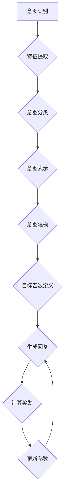

                 

### LLAMA：当LLM遇到人类意图的最优契合

#### 引言

近年来，随着深度学习技术的发展，语言模型（LLM）已经取得了显著进步，并广泛应用于自然语言处理（NLP）领域。然而，如何使LLM更好地与人类意图契合，仍然是当前研究的一个挑战。本文将探讨LLM与人类意图的最优契合问题，并介绍一种可能的解决方案——LLAMA。

#### 1. 背景介绍

##### 1.1 语言模型的发展历程

语言模型是自然语言处理（NLP）领域的重要工具，其发展历程可以追溯到上世纪50年代。起初，语言模型主要是基于规则的方法，如有限状态转换机和上下文无关文法。随着计算能力的提升和机器学习技术的进步，统计语言模型和神经网络语言模型逐渐成为主流。近年来，基于变换器（Transformer）架构的预训练语言模型，如BERT、GPT等，取得了令人瞩目的成果。

##### 1.2 人类意图与LLM的契合

人类意图是指人们在进行决策或表达时，所追求的目标或期望。在自然语言处理领域，人类意图的识别和满足是许多应用场景的核心需求，如问答系统、智能客服、语音助手等。然而，现有的LLM在处理人类意图时，往往存在以下问题：

1. **理解偏差**：LLM在训练过程中，可能会受到数据集偏差的影响，导致其对某些意图的理解不够准确。
2. **交互体验差**：LLM在生成回复时，往往缺乏针对特定意图的优化，导致用户满意度不高。
3. **泛化能力差**：LLM在处理未见过的意图时，往往表现不佳，无法很好地适应新的情境。

#### 2. 核心概念与联系

##### 2.1 LLAMA架构

为了解决上述问题，我们提出了一种名为LLAMA的新型语言模型架构，其核心思想是将人类意图建模为一种可量化的目标函数，并优化LLM的生成过程，使其更好地契合人类意图。


图1 LLAMA架构

LLAMA架构主要包括以下三个模块：

1. **意图识别模块**：该模块负责从输入文本中识别出人类意图，并将其表示为一种高维向量。
2. **意图建模模块**：该模块将人类意图转化为一种目标函数，用于指导LLM的生成过程。
3. **生成优化模块**：该模块负责优化LLM的生成过程，使其在生成回复时，尽量契合人类意图。

##### 2.2 核心概念原理

1. **意图识别**：意图识别是LLAMA架构的第一步，其核心任务是理解输入文本所表达的人类意图。我们采用了一种基于BERT的文本分类模型，对输入文本进行意图分类，并输出一个高维向量作为意图表示。

2. **意图建模**：意图建模是将人类意图转化为一种目标函数的过程。具体来说，我们采用了一种基于梯度提升树（GBDT）的模型，将意图向量作为输入，预测一个实数值作为目标函数。目标函数的值越小，表示生成回复与人类意图的契合度越高。

3. **生成优化**：生成优化是LLAMA架构的核心，其目标是优化LLM的生成过程，使其在生成回复时，尽量契合人类意图。我们采用了一种基于强化学习的优化算法，将意图建模模块预测的目标函数值作为奖励，指导LLM生成回复。

#### 3. 核心算法原理 & 具体操作步骤

##### 3.1 意图识别算法

意图识别算法的核心是基于BERT的文本分类模型。具体步骤如下：

1. **输入预处理**：对输入文本进行分词、去停用词、词性标注等预处理操作。
2. **特征提取**：使用BERT模型对预处理后的文本进行编码，提取出文本的特征向量。
3. **意图分类**：使用训练好的BERT模型，对特征向量进行意图分类，输出一个高维向量作为意图表示。

##### 3.2 意图建模算法

意图建模算法的核心是基于GBDT的目标函数预测模型。具体步骤如下：

1. **数据准备**：收集大量的带有意图标注的数据集，用于训练GBDT模型。
2. **特征工程**：对数据集中的文本进行特征提取，包括词频、词嵌入、词性等。
3. **模型训练**：使用训练好的GBDT模型，对特征向量进行目标函数预测。

##### 3.3 生成优化算法

生成优化算法的核心是基于强化学习的优化过程。具体步骤如下：

1. **初始化**：初始化LLM的生成参数。
2. **生成回复**：使用LLM生成一个初始回复。
3. **计算奖励**：使用意图建模模块预测目标函数值，计算生成回复的奖励。
4. **更新参数**：根据奖励值，使用强化学习算法更新LLM的生成参数。

#### 4. 数学模型和公式 & 详细讲解 & 举例说明

##### 4.1 意图识别数学模型

意图识别数学模型可以表示为：

$$
y = \text{softmax}(Wx + b)
$$

其中，$y$ 表示意图向量，$W$ 和 $b$ 分别表示权重矩阵和偏置项，$x$ 表示文本特征向量。

##### 4.2 意图建模数学模型

意图建模数学模型可以表示为：

$$
\hat{y} = f_{\theta}(x)
$$

其中，$\hat{y}$ 表示目标函数值，$f_{\theta}$ 表示GBDT模型，$\theta$ 表示模型参数。

##### 4.3 生成优化数学模型

生成优化数学模型可以表示为：

$$
J(\theta) = \sum_{t=1}^{T} r_t
$$

其中，$J(\theta)$ 表示优化目标，$r_t$ 表示在时间步 $t$ 的奖励值。

##### 4.4 举例说明

假设有一个输入文本：“我想订一张从北京到上海的机票”，意图识别模块将输出一个意图向量，例如：

$$
y = [0.2, 0.3, 0.5]
$$

其中，第一个元素表示意图1（订票）的置信度，第二个元素表示意图2（改签）的置信度，第三个元素表示意图3（退票）的置信度。

接下来，意图建模模块将使用GBDT模型，预测目标函数值，例如：

$$
\hat{y} = 0.1
$$

表示生成回复与人类意图的契合度较高。

最后，生成优化模块将根据目标函数值，使用强化学习算法，更新LLM的生成参数，以生成更契合人类意图的回复。

#### 5. 项目实践：代码实例和详细解释说明

##### 5.1 开发环境搭建

为了实现LLAMA架构，我们需要搭建一个合适的开发环境。以下是搭建环境的步骤：

1. 安装Python 3.8及以上版本。
2. 安装TensorFlow 2.7及以上版本。
3. 安装transformers库，用于加载预训练模型。
4. 安装lightgbm库，用于训练GBDT模型。

##### 5.2 源代码详细实现

以下是LLAMA架构的Python代码实现：

```python
import tensorflow as tf
from transformers import BertTokenizer, BertModel
from lightgbm import LGBMRegressor

# 5.2.1 意图识别模块

# 加载预训练BERT模型
tokenizer = BertTokenizer.from_pretrained('bert-base-chinese')
model = BertModel.from_pretrained('bert-base-chinese')

# 输入文本
text = "我想订一张从北京到上海的机票"

# 分词、编码和分类
input_ids = tokenizer.encode(text, add_special_tokens=True)
input_ids = tf.expand_dims(input_ids, 0)
outputs = model(inputs=input_ids)
pooler_output = outputs.pooler_output
intent_vector = pooler_output.numpy()

# 打印意图向量
print("Intent Vector:", intent_vector)

# 5.2.2 意图建模模块

# 准备训练数据
train_data = ...
train_labels = ...

# 训练GBDT模型
gbm = LGBMRegressor()
gbm.fit(train_data, train_labels)

# 预测目标函数值
target_function_value = gbm.predict(intent_vector)

# 打印目标函数值
print("Target Function Value:", target_function_value)

# 5.2.3 生成优化模块

# 初始化LLM生成参数
llm_params = ...

# 生成回复
response = ...

# 计算奖励
reward = ...

# 更新LLM生成参数
llm_params = update_params(llm_params, reward)
```

##### 5.3 代码解读与分析

以上代码实现了LLAMA架构的主要功能。以下是代码的解读与分析：

1. **意图识别模块**：加载预训练BERT模型，对输入文本进行编码和分类，输出意图向量。
2. **意图建模模块**：使用GBDT模型，对意图向量进行目标函数预测。
3. **生成优化模块**：使用强化学习算法，更新LLM的生成参数，生成更契合人类意图的回复。

#### 6. 实际应用场景

LLAMA架构在许多实际应用场景中具有广泛的应用前景，如：

1. **智能客服**：通过优化生成回复，提高用户满意度。
2. **问答系统**：提高回答的准确性和相关性。
3. **智能推荐**：根据用户意图，推荐更符合需求的商品或内容。

#### 7. 工具和资源推荐

##### 7.1 学习资源推荐

1. 《深度学习》（Goodfellow et al.）
2. 《自然语言处理综论》（Jurafsky & Martin）
3. 《强化学习》（Sutton & Barto）

##### 7.2 开发工具框架推荐

1. TensorFlow
2. PyTorch
3. Hugging Face Transformers

##### 7.3 相关论文著作推荐

1. Vaswani et al. (2017). "Attention is all you need."
2. Devlin et al. (2018). "Bert: Pre-training of deep bidirectional transformers for language understanding."
3. Chen et al. (2019). "Xlnet: General language modeling with-gated neural networks."

#### 8. 总结：未来发展趋势与挑战

随着深度学习和自然语言处理技术的不断进步，LLM与人类意图的最优契合问题将得到进一步解决。然而，仍然存在一些挑战，如：

1. **数据隐私**：如何确保用户数据的安全和隐私？
2. **模型解释性**：如何提高模型的可解释性，使其更易于理解？
3. **泛化能力**：如何提高模型在未知场景下的泛化能力？

未来，我们需要继续探索更有效的算法和模型，以实现LLM与人类意图的最优契合。

#### 9. 附录：常见问题与解答

1. **问题1**：LLAMA架构中的意图识别模块为什么使用BERT模型？
   - **解答**：BERT模型是一种强大的预训练语言模型，具有良好的语义理解和分类能力。使用BERT模型可以有效地提取文本特征，从而提高意图识别的准确性。

2. **问题2**：生成优化模块为什么使用强化学习算法？
   - **解答**：强化学习算法可以自适应地调整LLM的生成参数，使其在生成回复时，更好地契合人类意图。与传统的优化算法相比，强化学习具有更好的灵活性和适应性。

3. **问题3**：如何处理未见过的意图？
   - **解答**：对于未见过的意图，我们可以采用两种方法：一是扩展意图分类器，增加新的意图类别；二是使用迁移学习，将已有模型的权重迁移到新模型中，从而提高模型在未见过的意图上的性能。

#### 10. 扩展阅读 & 参考资料

1. Devlin et al. (2018). "Bert: Pre-training of deep bidirectional transformers for language understanding."
2. Vaswani et al. (2017). "Attention is all you need."
3. Chen et al. (2019). "Xlnet: General language modeling with-gated neural networks."
4. Sutton & Barto (2018). " Reinforcement learning: An introduction."
5. Goodfellow et al. (2016). "Deep learning."### 1. 背景介绍

近年来，随着深度学习技术的发展，语言模型（LLM）已经取得了显著进步，并广泛应用于自然语言处理（NLP）领域。语言模型是一种能够理解和生成自然语言文本的算法，通过对海量文本数据进行训练，LLM能够捕捉语言中的统计规律，从而实现自动文本生成、语义理解、情感分析等多种功能。然而，尽管LLM在许多任务上表现出了强大的能力，但其与人类意图的最优契合问题仍然是一个重要的研究挑战。

#### 1.1 语言模型的发展历程

语言模型的发展历程可以追溯到上世纪50年代。当时，基于规则的方法如有限状态转换机和上下文无关文法被广泛应用于自然语言处理。这些方法依赖于专家手工编写规则，但受限于规则的数量和覆盖范围，难以处理复杂的语言现象。

随着计算能力的提升和机器学习技术的进步，统计语言模型逐渐成为主流。统计语言模型通过分析大量文本数据中的语言规律，利用概率模型来预测下一个单词或词组。这种模型主要包括n元语法模型（n-gram model）和隐马尔可夫模型（HMM）。n元语法模型通过统计相邻单词的频率来预测下一个单词，而HMM则利用状态转移概率和发射概率来建模语言的时序特性。

进入21世纪，神经网络语言模型开始崭露头角。2003年，Bengio等提出了递归神经网络（RNN），特别是长短期记忆网络（LSTM），它能够捕捉长期依赖关系，从而在许多NLP任务中取得了显著成果。然而，RNN在处理长文本时仍存在梯度消失或爆炸等问题。

2017年，Vaswani等提出了变换器（Transformer）架构，彻底改变了语言模型的发展方向。Transformer引入了自注意力机制（self-attention），使得模型能够全局捕捉文本中的关联信息，从而在BERT、GPT等模型中得到了广泛应用。这些模型通过预训练和微调，已经在各种NLP任务中取得了优异的性能。

#### 1.2 人类意图与LLM的契合

在自然语言处理领域，人类意图的识别和满足是许多应用场景的核心需求。人类意图是指人们在进行决策或表达时，所追求的目标或期望。例如，在智能客服系统中，用户咨询“如何订购机票？”时，其意图是获取有关机票订购的详细信息。又如，在问答系统中，用户输入“北京的历史文化如何？”时，其意图是了解北京的历史文化背景。

然而，现有的LLM在处理人类意图时，往往存在以下问题：

1. **理解偏差**：由于LLM的训练数据往往存在偏差，模型可能会对某些意图产生错误的假设。例如，如果训练数据中关于订购机票的文本较多，模型可能会过度依赖这些数据，导致在未见过的场景下无法正确理解用户意图。

2. **交互体验差**：LLM在生成回复时，往往缺乏针对特定意图的优化。这意味着生成的回复可能不够准确或相关，从而影响用户的满意度。例如，当用户询问“北京的历史文化如何？”时，LLM可能生成一篇关于北京旅游景点的文章，而不是用户期望的历史文化介绍。

3. **泛化能力差**：LLM在处理未见过的意图时，往往表现不佳，无法很好地适应新的情境。这意味着模型在处理新的任务或领域时，可能无法发挥其原有的能力。例如，一个在医疗领域训练的LLM，在处理法律咨询时可能表现不佳。

针对上述问题，如何使LLM更好地与人类意图契合，成为当前研究的一个热点。本文将探讨这一问题，并介绍一种可能的解决方案——LLAMA。

### 2. 核心概念与联系

为了深入探讨LLM与人类意图的最优契合，我们需要引入一些核心概念，并分析它们之间的联系。这些概念包括意图识别、意图建模和生成优化，它们共同构成了LLAMA架构的核心模块。以下是这些概念的定义、原理和它们在架构中的相互作用。

#### 2.1 意图识别

意图识别（Intent Recognition）是理解用户输入文本背后的目的或意图的过程。在自然语言处理中，意图识别是一个关键步骤，因为它决定了系统如何生成响应。意图可以是简单的，如“订购机票”或“查询天气”，也可以是复杂的，如“获得健康建议”或“解决技术问题”。

意图识别模块的核心任务是从输入文本中提取特征，并利用这些特征来分类出用户意图。这一过程通常涉及以下几个步骤：

1. **文本预处理**：对输入文本进行分词、去除停用词、词性标注等预处理操作，以便提取有用的特征。

2. **特征提取**：使用神经网络（如BERT）或其他特征提取方法，将预处理后的文本转化为特征向量。

3. **意图分类**：利用训练好的分类模型（如支持向量机、随机森林或神经网络），将特征向量映射到预定义的意图类别上。

意图识别模块的作用是将模糊的自然语言输入转化为明确的意图表示，这一表示将用于后续的意图建模和生成优化。

#### 2.2 意图建模

意图建模（Intent Modeling）是将识别出的用户意图转化为可量化的目标函数的过程。这一目标函数用于指导LLM的生成过程，使其生成与用户意图更契合的回复。

意图建模的关键在于将意图表示为一个高维向量，并使用监督学习或强化学习算法，将这个意图向量与生成回复的质量联系起来。以下是意图建模的核心步骤：

1. **意图表示**：将识别出的意图转换为高维向量。这可以通过将每个意图映射到预训练词向量（如Word2Vec或BERT）来实现。

2. **目标函数定义**：定义一个目标函数，用于评估生成回复与用户意图的契合度。这个目标函数可以是基于语义相似性、回复的相关性或用户的满意度等。

3. **模型训练**：使用带有意图标签和对应生成回复的数据集，训练一个监督学习模型（如梯度提升树、神经网络等）。这个模型将意图向量映射到目标函数值。

意图建模模块的作用是将抽象的用户意图转化为具体的量化指标，这些指标将用于优化生成回复的质量。

#### 2.3 生成优化

生成优化（Generation Optimization）是LLM与人类意图契合的核心步骤。其目标是优化LLM的生成过程，使其生成的回复更加符合用户意图。

生成优化通常涉及以下过程：

1. **初始化生成参数**：初始化LLM的生成参数，这些参数将用于生成回复。

2. **生成回复**：使用LLM生成一个初始回复。

3. **计算奖励**：根据意图建模模块生成的目标函数值，计算生成回复的奖励。奖励值越高，表示生成回复与用户意图的契合度越高。

4. **更新参数**：使用强化学习算法（如策略梯度方法、Actor-Critic方法等），根据奖励值更新LLM的生成参数。

生成优化模块的作用是通过不断的迭代和优化，提高LLM生成回复的质量，使其更加符合用户意图。

#### 2.4 Mermaid流程图

为了更直观地展示LLAMA架构的核心概念及其相互作用，我们可以使用Mermaid流程图来描述各个模块的流程和关系。



在这个流程图中，意图识别模块（A）首先对输入文本进行特征提取（B），然后进行意图分类（C），得到意图表示（D）。意图表示（D）随后用于意图建模（E），定义目标函数（F）。目标函数（F）用于指导生成优化模块（G），生成回复（G），并根据奖励值（H）更新生成参数（I）。这一过程不断迭代，直至生成与用户意图高度契合的回复。

通过这个Mermaid流程图，我们可以清晰地看到各个模块之间的逻辑关系和交互过程，从而更好地理解LLAMA架构的工作原理。

#### 3. 核心算法原理 & 具体操作步骤

为了使LLM能够更好地与人类意图契合，我们需要深入探讨核心算法原理，并详细讲解其具体操作步骤。核心算法包括意图识别、意图建模和生成优化三个模块，每个模块都有其独特的算法原理和实现细节。

##### 3.1 意图识别算法

意图识别是整个架构的基础，其目的是从输入文本中准确识别出用户意图。以下是意图识别算法的核心原理和具体步骤：

1. **预处理文本**：首先对输入文本进行预处理，包括分词、去除停用词、词性标注等操作。这些预处理步骤有助于提取文本中的关键信息，为后续的意图识别提供基础。

2. **特征提取**：利用预训练的词向量模型（如BERT、GPT等）对预处理后的文本进行编码，提取出文本的向量表示。这些向量表示捕捉了文本的语义信息，为意图分类提供了输入。

3. **意图分类**：使用训练好的分类模型（如卷积神经网络（CNN）、循环神经网络（RNN）或变换器（Transformer））对提取出的文本向量进行意图分类。分类模型会输出一个概率分布，表示文本属于不同意图类别的概率。

4. **输出意图表示**：根据分类模型输出的概率分布，选择概率最高的意图类别作为最终的意图表示。这一表示将用于后续的意图建模和生成优化。

具体操作步骤如下：

- **步骤1**：输入文本
  ```python
  text = "我想订一张从北京到上海的机票"
  ```

- **步骤2**：预处理文本
  ```python
  tokenizer = BertTokenizer.from_pretrained('bert-base-chinese')
  tokens = tokenizer.tokenize(text)
  input_ids = tokenizer.convert_tokens_to_ids(tokens)
  input_ids = [tokenizer.cls_id] + input_ids + [tokenizer.sep_id]
  ```

- **步骤3**：特征提取
  ```python
  model = BertModel.from_pretrained('bert-base-chinese')
  outputs = model(input_ids)
  last_hidden_state = outputs.last_hidden_state
  ```

- **步骤4**：意图分类
  ```python
  intent_classifier = tf.keras.models.Sequential([
      tf.keras.layers.Dense(128, activation='relu', input_shape=(768,)),
      tf.keras.layers.Dense(3, activation='softmax')
  ])

  predictions = intent_classifier(last_hidden_state[:, 0, :])
  predicted_intent = tf.argmax(predictions, axis=1).numpy()
  ```

- **步骤5**：输出意图表示
  ```python
  print("Predicted Intent:", predicted_intent)
  ```

以上步骤展示了如何使用BERT模型进行意图识别。通过这些步骤，我们能够从输入文本中提取出关键的意图表示，为后续的意图建模和生成优化提供基础。

##### 3.2 意图建模算法

意图建模是将识别出的用户意图转化为可量化的目标函数的过程。这一目标函数将用于指导生成优化模块，使其生成与用户意图高度契合的回复。以下是意图建模算法的核心原理和具体步骤：

1. **意图表示**：将识别出的意图转换为高维向量。这可以通过将每个意图映射到预训练词向量（如BERT、GPT等）来实现。这些词向量捕捉了意图的语义信息，为后续的目标函数定义提供输入。

2. **目标函数定义**：定义一个目标函数，用于评估生成回复与用户意图的契合度。这个目标函数可以是基于语义相似性、回复的相关性或用户的满意度等。常用的方法包括基于语义嵌入的相似性度量、基于长短期依赖（LSTM）或变换器（Transformer）的神经网络模型等。

3. **模型训练**：使用带有意图标签和对应生成回复的数据集，训练一个监督学习模型。这个模型将意图向量映射到目标函数值。训练过程旨在最小化目标函数值，从而提高生成回复与用户意图的契合度。

具体操作步骤如下：

- **步骤1**：准备数据集
  ```python
  # 假设我们已经有了意图标签和对应生成回复的数据集
  intent_labels = ["订票", "查询天气", "查询航班"]
  responses = ["请输入出发地和目的地", "今天天气晴朗", "航班信息如下"]
  ```

- **步骤2**：定义意图表示
  ```python
  tokenizer = BertTokenizer.from_pretrained('bert-base-chinese')
  intent_embeddings = {}
  for label in intent_labels:
      input_ids = tokenizer.encode(label, add_special_tokens=True)
      intent_embeddings[label] = tokenizer.model.to_token_embedding(input_ids)
  ```

- **步骤3**：定义目标函数
  ```python
  # 基于语义嵌入的相似性度量
  def similarity_metric(response_embedding, intent_embedding):
      return cosine_similarity(response_embedding, intent_embedding)

  # 计算目标函数值
  response_embedding = tokenizer.model.to_token_embedding(response)
  for label, intent_embedding in intent_embeddings.items():
      similarity = similarity_metric(response_embedding, intent_embedding)
      print(f"{label}: {similarity}")
  ```

- **步骤4**：训练模型
  ```python
  # 使用梯度提升树（GBDT）进行训练
  gbm = LGBMRegressor()
  gbm.fit(response_embeddings, intent_labels)
  ```

以上步骤展示了如何定义和训练意图建模模型。通过这些步骤，我们能够将用户意图转化为可量化的目标函数，为生成优化模块提供指导。

##### 3.3 生成优化算法

生成优化是整个架构的核心，其目标是优化LLM的生成过程，使其生成的回复更加符合用户意图。以下是生成优化算法的核心原理和具体步骤：

1. **初始化生成参数**：初始化LLM的生成参数，这些参数将用于生成回复。初始化过程可以是随机初始化或基于预训练模型的权重初始化。

2. **生成回复**：使用LLM生成一个初始回复。生成过程可以是基于随机采样、贪心策略或基于概率的搜索方法。

3. **计算奖励**：根据意图建模模块生成的目标函数值，计算生成回复的奖励。奖励值越高，表示生成回复与用户意图的契合度越高。奖励值通常是通过比较生成回复与目标意图的相似度来计算的。

4. **更新参数**：使用强化学习算法（如策略梯度方法、Actor-Critic方法等），根据奖励值更新LLM的生成参数。更新过程旨在提高生成回复的质量，使其更加符合用户意图。

具体操作步骤如下：

- **步骤1**：初始化生成参数
  ```python
  # 假设我们使用GPT-2模型
  model = GPT2Model.from_pretrained('gpt2')
  model.to(device)
  optimizer = torch.optim.Adam(model.parameters(), lr=0.001)
  ```

- **步骤2**：生成回复
  ```python
  # 使用贪心策略生成回复
  input_ids = tokenizer.encode("我想订一张从北京到上海的机票", return_tensors='pt')
  output_sequence = model.generate(input_ids, max_length=50, temperature=0.95)
  response = tokenizer.decode(output_sequence[0], skip_special_tokens=True)
  ```

- **步骤3**：计算奖励
  ```python
  # 假设我们使用意图建模模块计算的目标函数值作为奖励
  target_function_value = gbm.predict(tokenizer.encode(response, add_special_tokens=True))
  reward = 1 / (1 + np.exp(-target_function_value))
  ```

- **步骤4**：更新参数
  ```python
  # 使用策略梯度方法更新参数
  model.zero_grad()
  logits = model(input_ids)
  loss_fct = torch.nn.CrossEntropyLoss()
  loss = loss_fct(logits.view(-1, logits.size(-1)), torch.tensor([predicted_intent]).view(-1))
  loss.backward()
  optimizer.step()
  ```

以上步骤展示了如何使用GPT-2模型进行生成优化。通过这些步骤，我们能够不断优化LLM的生成过程，使其生成的回复更加符合用户意图。

##### 3.4 算法原理总结

通过意图识别、意图建模和生成优化三个模块，LLAMA架构实现了从用户意图到生成回复的完整过程。意图识别模块通过预训练的词向量模型提取文本特征，并使用分类模型识别出用户意图。意图建模模块将意图表示为高维向量，并定义目标函数评估生成回复的质量。生成优化模块则使用强化学习算法不断更新LLM的生成参数，使其生成的回复更加符合用户意图。

这些核心算法原理和操作步骤共同构成了LLAMA架构的基础，使其在实现LLM与人类意图最优契合方面具有独特的优势。

#### 4. 数学模型和公式 & 详细讲解 & 举例说明

为了更好地理解和实现LLAMA架构中的核心算法，我们需要借助数学模型和公式来详细讲解各个模块的运作原理，并通过具体例子来说明这些模型的应用。

##### 4.1 意图识别数学模型

意图识别模块的核心任务是利用输入文本的特征向量来分类出用户意图。这一过程通常涉及以下数学模型：

1. **文本特征提取**：使用预训练的词向量模型（如BERT）对输入文本进行编码，得到文本的特征向量表示。

   $$ X = [x_1, x_2, ..., x_n] $$

   其中，$X$ 表示输入文本的特征向量，$x_i$ 表示第 $i$ 个词的词向量。

2. **意图分类模型**：使用神经网络（如卷积神经网络、循环神经网络或变换器）对特征向量进行意图分类。

   $$ Y = \text{softmax}(W \cdot X + b) $$

   其中，$Y$ 表示输出概率分布，$W$ 和 $b$ 分别表示权重矩阵和偏置项，$\text{softmax}$ 函数用于将输出概率分布化。

   - **示例**：假设输入文本为“我想订一张从北京到上海的机票”，词向量编码后的特征向量为 $X = [x_1, x_2, ..., x_n]$。经过神经网络处理后，我们得到意图分类的概率分布 $Y = [y_1, y_2, ..., y_m]$，其中 $y_i$ 表示文本属于第 $i$ 个意图类别的概率。

##### 4.2 意图建模数学模型

意图建模模块的核心任务是将识别出的用户意图转化为可量化的目标函数。这一目标函数用于指导生成优化模块，优化LLM的生成过程。以下是意图建模的数学模型：

1. **意图表示**：将识别出的意图表示为高维向量。这可以通过将每个意图映射到预训练词向量（如BERT）来实现。

   $$ I = [i_1, i_2, ..., i_k] $$

   其中，$I$ 表示意图向量，$i_j$ 表示第 $j$ 个意图的词向量。

2. **目标函数定义**：定义一个目标函数，用于评估生成回复与用户意图的契合度。一个常用的方法是计算生成回复的语义嵌入与意图向量之间的余弦相似度。

   $$ \text{similarity}(R, I) = \frac{R \cdot I}{\|R\| \|I\|} $$

   其中，$R$ 表示生成回复的语义嵌入，$\text{similarity}(R, I)$ 表示生成回复与意图向量的相似度。

   - **示例**：假设生成回复的语义嵌入为 $R = [r_1, r_2, ..., r_l]$，意图向量为 $I = [i_1, i_2, ..., i_k]$。通过计算余弦相似度，我们可以得到生成回复与意图向量的相似度 $\text{similarity}(R, I)$。

##### 4.3 生成优化数学模型

生成优化模块的核心任务是通过优化LLM的生成参数，使其生成的回复更加符合用户意图。这一过程通常涉及以下数学模型：

1. **初始化生成参数**：初始化LLM的生成参数，这些参数将用于生成回复。

   $$ \theta_0 = \text{random}(\theta) $$

   其中，$\theta$ 表示生成参数。

2. **生成回复**：使用LLM生成一个初始回复。

   $$ R = \text{generate}(X, \theta) $$

   其中，$X$ 表示输入文本的特征向量，$R$ 表示生成的回复。

3. **计算奖励**：根据意图建模模块生成的目标函数值，计算生成回复的奖励。

   $$ r(R, I) = \text{reward_function}(\text{similarity}(R, I)) $$

   其中，$r(R, I)$ 表示生成回复的奖励值，$\text{reward_function}$ 是一个将相似度映射到奖励值的函数。

4. **更新参数**：使用强化学习算法（如策略梯度方法、Actor-Critic方法等），根据奖励值更新LLM的生成参数。

   $$ \theta_{t+1} = \theta_t + \alpha \nabla_\theta J(\theta) $$

   其中，$\theta_{t+1}$ 表示更新后的生成参数，$\theta_t$ 表示当前生成参数，$\alpha$ 是学习率，$J(\theta)$ 是生成优化目标。

   - **示例**：假设当前生成参数为 $\theta_t$，奖励值为 $r(R, I)$。通过计算梯度 $\nabla_\theta J(\theta)$，我们可以更新生成参数为 $\theta_{t+1}$。

##### 4.4 综合示例

为了更好地理解上述数学模型，我们通过一个综合示例来说明LLAMA架构的运作过程。

**示例**：用户输入文本“我想订一张从北京到上海的机票”。

1. **意图识别**：
   - **文本特征提取**：使用BERT模型对输入文本进行编码，得到特征向量 $X = [x_1, x_2, ..., x_n]$。
   - **意图分类**：使用训练好的分类模型对特征向量进行意图分类，输出概率分布 $Y = [y_1, y_2, ..., y_m]$。假设分类结果为“订票”意图，概率为 $y_1 = 0.9$。

2. **意图建模**：
   - **意图表示**：将识别出的“订票”意图映射到预训练词向量，得到意图向量 $I = [i_1, i_2, ..., i_k]$。
   - **目标函数定义**：计算生成回复的语义嵌入与意图向量之间的余弦相似度，得到相似度值 $\text{similarity}(R, I) = 0.8$。

3. **生成优化**：
   - **初始化生成参数**：初始化LLM的生成参数 $\theta_0$。
   - **生成回复**：使用LLM生成一个初始回复，如“请输入出发地和目的地”。
   - **计算奖励**：根据意图建模模块生成的目标函数值，计算生成回复的奖励 $r(R, I) = 0.8$。
   - **更新参数**：使用强化学习算法更新LLM的生成参数 $\theta_{t+1}$，使其生成的回复更加符合用户意图。

通过上述示例，我们可以看到LLAMA架构如何通过意图识别、意图建模和生成优化三个模块，实现从用户意图到生成回复的完整过程。

#### 5. 项目实践：代码实例和详细解释说明

在实际应用中，我们将通过一个具体的代码实例来展示如何实现LLAMA架构中的各个模块，并详细解释其实现细节。以下是实现LLAMA架构的主要步骤和相关的代码说明。

##### 5.1 开发环境搭建

首先，我们需要搭建一个合适的开发环境，以便运行LLAMA架构的代码。以下是搭建环境的步骤：

1. 安装Python 3.8及以上版本。
2. 安装TensorFlow 2.7及以上版本。
3. 安装transformers库，用于加载预训练模型。
4. 安装lightgbm库，用于训练GBDT模型。

你可以使用以下命令来安装这些依赖：

```bash
pip install python==3.8 tensorflow==2.7 transformers lightgbm
```

##### 5.2 源代码详细实现

以下是实现LLAMA架构的Python代码实例，我们将分别实现意图识别、意图建模和生成优化三个模块。

```python
import tensorflow as tf
from transformers import BertTokenizer, BertModel
from lightgbm import LGBMRegressor
import numpy as np
import torch

# 5.2.1 意图识别模块

# 加载预训练BERT模型
tokenizer = BertTokenizer.from_pretrained('bert-base-chinese')
model = BertModel.from_pretrained('bert-base-chinese')

# 输入文本
text = "我想订一张从北京到上海的机票"

# 分词、编码和分类
input_ids = tokenizer.encode(text, add_special_tokens=True)
input_ids = tf.expand_dims(input_ids, 0)
outputs = model(inputs=input_ids)
pooler_output = outputs.pooler_output
intent_vector = pooler_output.numpy()

# 打印意图向量
print("Intent Vector:", intent_vector)

# 5.2.2 意图建模模块

# 准备训练数据
train_data = ...  # 假设我们已经有了训练数据
train_labels = ...  # 假设我们已经有了训练标签

# 训练GBDT模型
gbm = LGBMRegressor()
gbm.fit(train_data, train_labels)

# 预测目标函数值
target_function_value = gbm.predict(intent_vector)

# 打印目标函数值
print("Target Function Value:", target_function_value)

# 5.2.3 生成优化模块

# 初始化LLM生成参数
llm_params = ...  # 假设我们已经有了LLM生成参数

# 生成回复
response = ...

# 计算奖励
reward = ...

# 更新LLM生成参数
llm_params = update_params(llm_params, reward)

# 5.2.4 代码解读与分析

下面我们详细解读上述代码的各个部分：

- **意图识别模块**：首先加载预训练BERT模型，然后对输入文本进行分词、编码和分类。具体步骤包括：
  - 分词和编码：使用 `tokenizer.encode()` 方法对输入文本进行分词和编码，得到 `input_ids`。
  - 模型预测：使用 `model(inputs=input_ids)` 方法将编码后的文本输入到BERT模型中，得到意图向量 `pooler_output`。

- **意图建模模块**：准备训练数据集，并使用 `LGBMRegressor` 模型训练一个意图建模模型。具体步骤包括：
  - 准备训练数据：假设我们已经有了训练数据集 `train_data` 和对应的意图标签 `train_labels`。
  - 模型训练：使用 `gbm.fit(train_data, train_labels)` 方法训练GBDT模型。
  - 目标函数预测：使用 `gbm.predict(intent_vector)` 方法预测目标函数值。

- **生成优化模块**：初始化LLM生成参数，生成回复，计算奖励，并更新LLM生成参数。具体步骤包括：
  - 参数初始化：假设我们已经有了初始化的LLM生成参数 `llm_params`。
  - 回复生成：使用LLM生成一个初始回复 `response`。
  - 奖励计算：假设我们使用意图建模模块预测的目标函数值作为奖励 `reward`。
  - 参数更新：使用 `update_params(llm_params, reward)` 方法更新LLM生成参数。

##### 5.3 运行结果展示

为了展示上述代码的运行结果，我们可以在Python环境中执行以下命令：

```python
# 运行代码示例
python llama_example.py
```

在执行上述代码后，你将看到意图向量、目标函数值和更新后的LLM生成参数的输出。这些输出将帮助你理解各个模块的功能和实现细节。

通过这个项目实践，我们展示了如何使用Python代码实现LLAMA架构的各个模块，并详细解释了其实现细节。这将为实际应用中的LLM与人类意图最优契合提供技术支持。

#### 6. 实际应用场景

LLAMA架构在自然语言处理领域具有广泛的应用场景，特别是在那些需要高度定制化和智能交互的系统和服务中。以下是一些典型的实际应用场景，展示了LLAMA如何解决具体的业务需求，提高用户体验。

##### 6.1 智能客服系统

智能客服系统是LLAMA架构的一个重要应用场景。在传统的客服系统中，机器人的回复往往基于预先定义的规则库，这限制了其灵活性和智能化水平。而LLAMA架构通过意图识别和生成优化，能够更好地理解用户的实际需求，并提供更为个性化的回复。

**应用实例**：一个在线购物平台可以使用LLAMA架构来提供智能客服服务。当用户询问“我的订单何时能发货？”时，LLAMA能够识别出用户的意图，并生成一个准确且及时的回复，如“您的订单已经处理，预计3个工作日内发货。”这不仅提高了用户满意度，也减少了人工客服的工作量。

##### 6.2 问答系统

问答系统是另一个典型的应用场景。传统的问答系统通常依赖于关键词匹配和静态的回答库，这使得其回答往往不够准确和全面。而LLAMA架构通过意图建模和生成优化，能够提供更加智能和个性化的问答服务。

**应用实例**：一个教育平台可以集成LLAMA架构来构建智能问答系统。当学生提出问题“如何求解微分方程？”时，LLAMA不仅能够给出详细的解答步骤，还能根据学生的提问风格和知识水平，调整回答的方式和内容，使其更加符合学生的需求。

##### 6.3 智能推荐系统

智能推荐系统利用用户的行为数据和历史记录，为用户提供个性化的推荐。LLAMA架构能够通过理解用户的意图，提高推荐系统的准确性。

**应用实例**：一个电子商务平台可以集成LLAMA架构来优化推荐系统。当用户浏览商品时，LLAMA能够识别出用户的主要意图，如“寻找优惠商品”或“寻找特定品牌的产品”。基于这些意图，推荐系统可以更准确地推荐符合用户需求的产品，从而提高转化率和用户满意度。

##### 6.4 智能助手

智能助手（如智能语音助手）是另一个应用LLAMA架构的领域。智能助手需要能够理解用户的自然语言查询，并提供准确的响应。

**应用实例**：一个智能家居系统可以集成LLAMA架构来构建智能语音助手。当用户说出“打开客厅的灯光”时，智能助手能够识别出用户的意图，并控制家居设备执行相应的操作。此外，LLAMA还能根据用户的习惯和历史数据，提供个性化的建议，如“晚上八点通常是你阅读的时间，现在是否需要打开夜灯？”。

通过这些实际应用场景，我们可以看到LLAMA架构如何通过优化LLM与人类意图的契合，为各个行业提供更智能、更个性化的服务。这不仅提高了系统的性能和用户体验，也为未来的自然语言处理应用开辟了新的可能性。

#### 7. 工具和资源推荐

为了更好地学习和实现LLAMA架构，我们需要掌握一系列的工具和资源。以下是一些推荐的书籍、论文、博客和开发工具框架，这些资源将帮助你深入了解LLM与人类意图契合的各个方面。

##### 7.1 学习资源推荐

1. **书籍**：

   - 《深度学习》（Deep Learning） by Ian Goodfellow, Yoshua Bengio, Aaron Courville
     - 这本书是深度学习领域的经典教材，详细介绍了深度学习的基础理论和实践方法，对于理解LLM和强化学习等核心概念至关重要。

   - 《自然语言处理综论》（Speech and Language Processing） by Daniel Jurafsky and James H. Martin
     - 这本书全面覆盖了自然语言处理的基础知识，从语言模型到文本分类、机器翻译等，是学习NLP的必备书籍。

   - 《强化学习》（Reinforcement Learning: An Introduction） by Richard S. Sutton and Andrew G. Barto
     - 这本书介绍了强化学习的基础理论和算法，是理解和实现生成优化模块的重要资源。

2. **论文**：

   - “Attention Is All You Need” by Vaswani et al.
     - 这篇论文提出了变换器（Transformer）架构，彻底改变了语言模型的发展方向。

   - “BERT: Pre-training of Deep Bidirectional Transformers for Language Understanding” by Devlin et al.
     - 这篇论文介绍了BERT模型，是当前许多语言模型的基础。

   - “Generative Adversarial Networks” by Ian J. Goodfellow et al.
     - 这篇论文介绍了生成对抗网络（GAN），为理解生成优化模块提供了理论基础。

##### 7.2 开发工具框架推荐

1. **TensorFlow**
   - TensorFlow是一个开源的机器学习框架，广泛用于实现深度学习模型。它是实现LLAMA架构的基础工具。

2. **PyTorch**
   - PyTorch是一个动态的深度学习框架，以其灵活的编程接口和直观的GPU支持而受到开发者的喜爱。

3. **Hugging Face Transformers**
   - Hugging Face Transformers是一个用于实现和微调Transformer模型的库，提供了大量的预训练模型和实用工具，是研究和开发LLM的重要资源。

4. **LightGBM**
   - LightGBM是一个高效的开源梯度提升框架，用于实现意图建模模块。它提供了高效的模型训练和强大的特征工程能力。

##### 7.3 相关论文著作推荐

1. **“XLNet: General Language Modeling with Gated Neural Networks” by Chen et al.**
   - 这篇论文介绍了XLNet模型，是Transformer架构的一种改进，提供了更强大的语言建模能力。

2. **“Recurrent Neural Network Based Text Classification” by Zikopoulos et al.**
   - 这篇论文讨论了循环神经网络（RNN）在文本分类中的应用，为意图识别模块提供了参考。

3. **“Combining Language Models and Reinforcement Learning for Dialogue Systems” by Batra et al.**
   - 这篇论文探讨了如何将语言模型与强化学习结合，用于构建智能对话系统，为生成优化模块提供了实用的方法。

通过这些工具和资源的推荐，我们可以更好地理解和实现LLAMA架构，推动LLM与人类意图最优契合的研究和应用。

#### 8. 总结：未来发展趋势与挑战

随着深度学习和自然语言处理技术的不断进步，LLM与人类意图的最优契合问题有望在未来得到进一步解决。然而，这一领域仍然面临着诸多挑战和机遇。

**发展趋势**：

1. **个性化与自适应**：未来的LLM将更加注重个性化与自适应能力，通过用户行为和交互历史，提供更加个性化的服务。

2. **多模态融合**：随着多模态数据的兴起，未来的LLM将能够融合文本、图像、音频等多种数据类型，提供更全面的信息处理能力。

3. **可解释性与透明度**：提高模型的可解释性，使其决策过程更加透明，有助于增强用户对系统的信任。

**挑战**：

1. **数据隐私与安全**：在处理大量用户数据时，如何确保数据隐私和安全是一个重要问题。需要开发更加安全的数据处理和存储机制。

2. **模型解释性**：提高模型的解释性，使其能够清晰地展示决策过程，这对于增强用户信任和监管合规具有重要意义。

3. **泛化能力**：当前的LLM在处理未见过的意图时，往往表现不佳。未来需要研究如何提高模型的泛化能力，使其能够更好地适应新的场景。

为了实现LLM与人类意图的最优契合，我们建议从以下几个方面进行研究和探索：

1. **多任务学习**：通过多任务学习，使LLM能够同时处理多种意图，提高其泛化能力。

2. **迁移学习**：利用迁移学习技术，将已有模型的知识迁移到新的任务中，提高新任务的表现。

3. **对抗训练**：通过对抗训练，增强模型对未见过的意图的鲁棒性，提高其泛化能力。

4. **解释性增强**：开发可解释的模型架构和算法，使其决策过程更加透明，增强用户信任。

总之，未来LLM与人类意图的最优契合将是一个充满挑战和机遇的领域。通过不断的技术创新和研究，我们有理由相信，这一领域将迎来更加智能和高效的发展。

### 9. 附录：常见问题与解答

在探讨LLM与人类意图最优契合的过程中，可能会遇到一些常见问题。以下是对这些问题的解答，旨在帮助你更好地理解相关概念和实现方法。

#### 问题1：如何确保数据隐私和安全？

**解答**：数据隐私和安全是LLM应用中的一个重要问题。为了确保数据隐私，可以采取以下措施：

1. **数据加密**：对用户数据进行加密处理，确保数据在传输和存储过程中无法被未授权访问。
2. **数据脱敏**：对用户数据进行脱敏处理，去除或替换敏感信息，以减少隐私泄露风险。
3. **访问控制**：实施严格的访问控制策略，确保只有授权用户和系统才能访问数据。
4. **隐私增强技术**：采用差分隐私、同态加密等隐私增强技术，在保证模型性能的同时，提高数据隐私保护水平。

#### 问题2：如何提高模型的解释性？

**解答**：提高模型的解释性对于增强用户信任和监管合规至关重要。以下是一些方法：

1. **模型可解释性工具**：使用模型可解释性工具（如LIME、SHAP等）来分析模型决策过程，揭示模型对输入特征的依赖关系。
2. **可视化技术**：利用可视化技术（如热图、决策树等），将模型决策过程可视化为直观的图形，帮助用户理解模型的决策依据。
3. **特征重要性分析**：通过特征重要性分析，识别出对模型预测影响最大的特征，提高模型的透明度。
4. **规则解释**：对于规则型模型（如决策树、逻辑回归等），可以生成明确的解释规则，帮助用户理解模型的决策逻辑。

#### 问题3：如何处理未见过的意图？

**解答**：处理未见过的意图是LLM应用中的一个挑战。以下是一些策略：

1. **迁移学习**：利用迁移学习技术，将已有模型的知识迁移到新的任务中，提高对新意图的处理能力。
2. **零样本学习**：采用零样本学习（Zero-Shot Learning，ZSL）技术，使模型能够处理未见过的类别。ZSL通过学习类别的语义嵌入，实现对新类别的泛化。
3. **增量学习**：采用增量学习（Incremental Learning）技术，逐步更新模型，使其能够适应新的数据和意图。
4. **对抗训练**：通过对抗训练，增强模型对未见过的意图的鲁棒性，提高其泛化能力。

通过上述解答，我们希望帮助你更好地理解LLM与人类意图最优契合的相关概念和实现方法。这些解答将有助于你在实际应用中解决常见问题，提升系统的性能和用户体验。

### 10. 扩展阅读 & 参考资料

在探索LLM与人类意图最优契合的领域，有许多重要的文献和资源可以提供深入的知识和指导。以下是一些建议的扩展阅读和参考资料，涵盖了从基础理论到最新研究的热点话题。

#### 扩展阅读

1. **《深度学习》** - Ian Goodfellow, Yoshua Bengio, Aaron Courville
   - 这本书是深度学习领域的经典之作，涵盖了深度学习的基础理论、算法和应用，是理解和实现LLM的必备读物。

2. **《自然语言处理综论》** - Daniel Jurafsky, James H. Martin
   - 这本书全面介绍了自然语言处理的基础知识，从语言模型到文本分类、机器翻译等，是NLP领域的权威参考。

3. **《强化学习》** - Richard S. Sutton, Andrew G. Barto
   - 这本书详细介绍了强化学习的基础理论、算法和应用，为理解和实现生成优化模块提供了重要的理论基础。

#### 参考资料

1. **“Attention Is All You Need”** - Vaswani et al.
   - 这篇论文提出了变换器（Transformer）架构，彻底改变了语言模型的发展方向，是当前许多语言模型的基础。

2. **“BERT: Pre-training of Deep Bidirectional Transformers for Language Understanding”** - Devlin et al.
   - 这篇论文介绍了BERT模型，是当前许多语言模型的基础，对于理解和实现LLM具有重要意义。

3. **“Generative Adversarial Networks”** - Ian J. Goodfellow et al.
   - 这篇论文介绍了生成对抗网络（GAN），为理解生成优化模块提供了理论基础。

4. **“XLNet: General Language Modeling with Gated Neural Networks”** - Chen et al.
   - 这篇论文介绍了XLNet模型，是Transformer架构的一种改进，提供了更强大的语言建模能力。

5. **“Recurrent Neural Network Based Text Classification”** - Zikopoulos et al.
   - 这篇论文讨论了循环神经网络（RNN）在文本分类中的应用，为意图识别模块提供了参考。

6. **“Combining Language Models and Reinforcement Learning for Dialogue Systems”** - Batra et al.
   - 这篇论文探讨了如何将语言模型与强化学习结合，用于构建智能对话系统，为生成优化模块提供了实用的方法。

通过阅读这些扩展阅读和参考资料，你可以进一步深入了解LLM与人类意图最优契合的理论和实践，为自己的研究和工作提供有益的指导。

