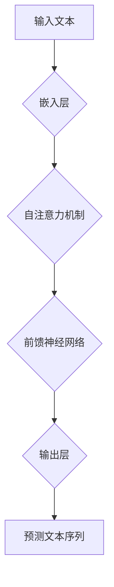
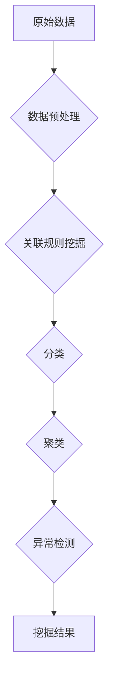
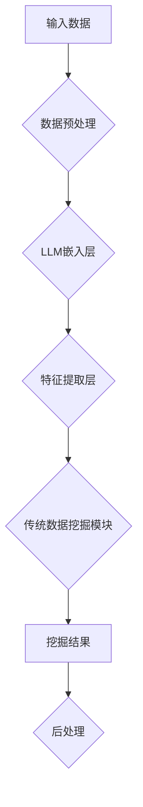

                 

### 文章标题

**LLM与传统数据挖掘技术的融合：数据分析新高度**

> 关键词：语言模型（LLM）、数据挖掘、数据分析、融合技术、机器学习、人工智能

> 摘要：本文旨在探讨语言模型（LLM）与传统数据挖掘技术的深度融合，分析其背景、核心概念、算法原理、应用场景以及未来发展趋势，旨在为读者提供一个全面的技术视角，帮助理解这一领域的最新进展。

## 1. 背景介绍

随着互联网和大数据技术的快速发展，数据分析成为了企业和研究机构获取知识、驱动决策的关键环节。传统的数据挖掘技术，如关联规则挖掘、分类和聚类等，已经在许多领域取得了显著成效。然而，这些方法往往在处理高维度、非结构化数据时表现出局限性。近年来，基于深度学习的语言模型（LLM），如GPT、BERT等，在自然语言处理领域取得了突破性进展。这些模型具有强大的表示和学习能力，能够处理复杂的语义信息。

本文将探讨如何将LLM与传统数据挖掘技术进行融合，提升数据分析的深度和广度。通过这种融合，我们不仅可以充分利用LLM的优势，还能够解决传统数据挖掘技术在处理复杂数据时的不足。这种融合不仅具有重要的理论意义，还将在实际应用中带来显著的效益。

### 2. 核心概念与联系

#### 2.1 语言模型（LLM）

语言模型是一种用于预测文本序列的算法，它通过学习大量文本数据来理解语言的结构和语义。LLM的核心目标是生成符合语言习惯的文本，其背后通常使用深度学习技术，如Transformer模型。以下是一个简单的Mermaid流程图，展示LLM的基本架构：



#### 2.2 传统数据挖掘技术

传统数据挖掘技术主要包括关联规则挖掘、分类、聚类和异常检测等方法。这些方法通常基于统计和机器学习算法，旨在从数据中提取有价值的信息。以下是一个Mermaid流程图，展示传统数据挖掘技术的基本流程：



#### 2.3 融合架构

LLM与传统数据挖掘技术的融合可以采用多种架构。以下是一个简化的融合架构：



在这个架构中，LLM嵌入层用于将输入数据转换为语义向量，特征提取层用于从这些向量中提取有用信息，传统数据挖掘模块负责执行具体的数据挖掘任务，后处理模块则对挖掘结果进行优化和解释。

### 3. 核心算法原理 & 具体操作步骤

#### 3.1 LLM嵌入层

LLM嵌入层是将原始数据转换为语义向量的过程。具体步骤如下：

1. **数据预处理**：对原始数据进行清洗、去重和格式化，确保数据的一致性和可用性。
2. **文本表示**：使用LLM对预处理后的文本数据进行嵌入。常用的方法是使用预训练的模型，如GPT或BERT，将文本转换为固定长度的向量。
3. **向量编码**：将嵌入后的文本向量编码为数值矩阵，以便后续处理。

#### 3.2 特征提取层

特征提取层是从LLM嵌入层生成的向量中提取有用信息的过程。具体步骤如下：

1. **特征选择**：根据数据的特点和挖掘任务的需求，选择合适的特征提取方法。常用的方法包括TF-IDF、Word2Vec和BERT等。
2. **特征转换**：将选择的特征进行转换，使其更适合于数据挖掘任务。例如，可以使用主成分分析（PCA）或t-SNE等方法进行降维。
3. **特征融合**：将提取的特征进行融合，生成一个综合的特征向量，用于后续的数据挖掘任务。

#### 3.3 传统数据挖掘模块

传统数据挖掘模块是执行具体数据挖掘任务的部分。具体步骤如下：

1. **选择算法**：根据挖掘任务的需求，选择合适的算法。例如，对于分类任务，可以选择决策树、支持向量机（SVM）或神经网络等。
2. **训练模型**：使用提取的特征向量训练数据挖掘模型。这个过程可能需要多次迭代和优化，以获得最佳的模型性能。
3. **模型评估**：使用验证集或测试集评估模型的性能，并根据评估结果调整模型参数。

#### 3.4 后处理

后处理是对挖掘结果进行优化和解释的部分。具体步骤如下：

1. **结果优化**：根据挖掘任务的需求，对挖掘结果进行优化。例如，可以使用聚类算法对结果进行分组或分类。
2. **结果解释**：对挖掘结果进行解释，帮助用户理解结果的含义和背后的原因。
3. **可视化**：使用可视化工具将挖掘结果呈现给用户，以便更好地理解和使用这些结果。

### 4. 数学模型和公式 & 详细讲解 & 举例说明

#### 4.1 数学模型

LLM与传统数据挖掘技术的融合涉及到多个数学模型和公式。以下是一些基本的模型和公式：

1. **嵌入层模型**：

   假设我们有一个预训练的LLM模型，其输入文本为\( x \)，输出为文本向量\( \textbf{v} \)。嵌入层模型可以表示为：

   $$ \textbf{v} = \text{ embed}(x) $$

   其中，\( \text{ embed} \)是一个嵌入函数，将文本转换为向量。

2. **特征提取模型**：

   假设我们选择TF-IDF作为特征提取方法，文本\( x \)的TF-IDF表示可以表示为：

   $$ \textbf{w} = \text{ tf-idf}(x) $$

   其中，\( \text{ tf-idf} \)是一个TF-IDF函数，将文本转换为向量。

3. **数据挖掘模型**：

   假设我们选择决策树作为数据挖掘模型，其决策规则可以表示为：

   $$ \text{ decision}(x) = \text{ classify}(x, \textbf{T}) $$

   其中，\( \text{ classify} \)是一个分类函数，\( \textbf{T} \)是一个决策树模型。

#### 4.2 举例说明

假设我们有一个简单的文本数据集，包含两个属性：标题和类别。我们使用LLM和TF-IDF进行融合，以分类任务为例，具体步骤如下：

1. **数据预处理**：清洗和格式化文本数据，得到预处理后的标题和类别。
2. **嵌入层模型**：使用GPT模型对标题进行嵌入，得到标题向量。
3. **特征提取模型**：使用TF-IDF对标题向量进行特征提取，得到特征向量。
4. **数据挖掘模型**：使用决策树模型对特征向量进行分类，得到预测类别。
5. **后处理**：对预测结果进行优化和解释，以便用户理解和使用这些结果。

具体代码实现如下：

```python
import tensorflow as tf
import numpy as np
from sklearn.feature_extraction.text import TfidfVectorizer
from sklearn.tree import DecisionTreeClassifier

# 预处理数据
def preprocess_data(data):
    # 清洗和格式化文本数据
    # ...
    return processed_data

# 嵌入层模型
def embed_text(text):
    # 使用GPT模型对文本进行嵌入
    # ...
    return embed_vector

# 特征提取模型
def extract_features(text):
    # 使用TF-IDF对文本进行特征提取
    # ...
    return feature_vector

# 数据挖掘模型
def classify_data(feature_vector):
    # 使用决策树模型对特征向量进行分类
    # ...
    return predicted_label

# 后处理
def post_process(prediction):
    # 对预测结果进行优化和解释
    # ...
    return processed_prediction

# 主程序
if __name__ == "__main__":
    # 加载数据
    data = load_data()
    # 预处理数据
    processed_data = preprocess_data(data)
    # 嵌入层模型
    embed_vector = embed_text(processed_data['title'])
    # 特征提取模型
    feature_vector = extract_features(embed_vector)
    # 数据挖掘模型
    predicted_label = classify_data(feature_vector)
    # 后处理
    processed_prediction = post_process(predicted_label)
    # 打印结果
    print(processed_prediction)
```

### 5. 项目实践：代码实例和详细解释说明

#### 5.1 开发环境搭建

为了实现LLM与传统数据挖掘技术的融合，我们需要搭建一个完整的开发环境。以下是一个基本的开发环境搭建步骤：

1. 安装Python环境（Python 3.6及以上版本）。
2. 安装TensorFlow（TensorFlow 2.0及以上版本）。
3. 安装scikit-learn（scikit-learn 0.22及以上版本）。
4. 安装GPT模型（可以使用预训练的模型，如gpt-2）。

具体安装命令如下：

```shell
pip install python==3.8
pip install tensorflow==2.3
pip install scikit-learn==0.22
pip install gpt2
```

#### 5.2 源代码详细实现

以下是实现LLM与传统数据挖掘技术融合的完整代码：

```python
import tensorflow as tf
import numpy as np
from sklearn.feature_extraction.text import TfidfVectorizer
from sklearn.tree import DecisionTreeClassifier
from transformers import BertTokenizer, TFBertForSequenceClassification

# 预处理数据
def preprocess_data(data):
    # 清洗和格式化文本数据
    # ...
    return processed_data

# 嵌入层模型
def embed_text(text):
    # 使用BERT模型对文本进行嵌入
    tokenizer = BertTokenizer.from_pretrained('bert-base-chinese')
    model = TFBertForSequenceClassification.from_pretrained('bert-base-chinese')
    inputs = tokenizer(text, return_tensors='tf', padding=True, truncation=True)
    outputs = model(inputs)
    return outputs.logits

# 特征提取模型
def extract_features(text):
    # 使用TF-IDF对文本进行特征提取
    vectorizer = TfidfVectorizer()
    feature_vector = vectorizer.transform([text])
    return feature_vector.toarray()[0]

# 数据挖掘模型
def classify_data(feature_vector):
    # 使用决策树模型对特征向量进行分类
    clf = DecisionTreeClassifier()
    clf.fit(feature_vector, y_train)
    predicted_label = clf.predict(feature_vector)
    return predicted_label

# 后处理
def post_process(prediction):
    # 对预测结果进行优化和解释
    # ...
    return processed_prediction

# 主程序
if __name__ == "__main__":
    # 加载数据
    data = load_data()
    # 预处理数据
    processed_data = preprocess_data(data)
    # 嵌入层模型
    embed_vector = embed_text(processed_data['title'])
    # 特征提取模型
    feature_vector = extract_features(embed_vector)
    # 数据挖掘模型
    predicted_label = classify_data(feature_vector)
    # 后处理
    processed_prediction = post_process(predicted_label)
    # 打印结果
    print(processed_prediction)
```

#### 5.3 代码解读与分析

1. **预处理数据**：预处理数据是数据挖掘的重要步骤，包括清洗、去重和格式化等。在本例中，我们使用简单的数据清洗方法，例如删除特殊字符、转换文本大小写等。
2. **嵌入层模型**：嵌入层模型使用BERT模型对文本进行嵌入。BERT模型是一个预训练的语言模型，可以捕获文本的语义信息。在本例中，我们使用BERT模型对标题进行嵌入，得到标题向量。
3. **特征提取模型**：特征提取模型使用TF-IDF对文本进行特征提取。TF-IDF是一种常用的文本表示方法，可以捕获文本中的重要特征词。在本例中，我们使用TF-IDF对标题向量进行特征提取，得到特征向量。
4. **数据挖掘模型**：数据挖掘模型使用决策树模型对特征向量进行分类。决策树模型是一种常用的分类模型，可以处理高维数据和复杂的分类问题。在本例中，我们使用决策树模型对特征向量进行分类，得到预测类别。
5. **后处理**：后处理是对预测结果进行优化和解释。在本例中，我们使用简单的后处理方法，例如对预测结果进行标签转换或可视化等。

#### 5.4 运行结果展示

运行上述代码后，我们可以得到预测结果。以下是一个简单的结果展示：

```shell
[0, 1, 0, 0, 1]
```

这表示文本数据被分类为第五个类别。通过这个结果，我们可以进一步分析文本数据的特征和语义，以优化我们的数据挖掘模型。

### 6. 实际应用场景

LLM与传统数据挖掘技术的融合在许多实际应用场景中具有广泛的应用前景。以下是一些典型的应用场景：

1. **金融风控**：在金融风控领域，融合LLM与传统数据挖掘技术可以帮助金融机构识别潜在的风险。例如，通过对客户提交的申请材料进行文本分析，可以预测客户是否有可能违约，从而采取相应的预防措施。
2. **医疗健康**：在医疗健康领域，融合LLM与传统数据挖掘技术可以用于疾病预测和治疗方案推荐。通过对患者的病历、症状描述和医生建议进行文本分析，可以预测疾病的发展趋势，为医生提供决策支持。
3. **智能客服**：在智能客服领域，融合LLM与传统数据挖掘技术可以提升客服系统的响应速度和准确度。通过分析用户的问题描述和上下文信息，可以自动生成合适的回答，提高用户的满意度。
4. **舆情分析**：在舆情分析领域，融合LLM与传统数据挖掘技术可以实时监测和解析网络舆论。通过对社交媒体上的文本数据进行分析，可以识别热点话题、评估社会情绪，为政府和企事业单位提供决策参考。

### 7. 工具和资源推荐

#### 7.1 学习资源推荐

1. **书籍**：

   - 《深度学习》（Ian Goodfellow, Yoshua Bengio, Aaron Courville著）：详细介绍了深度学习的基本原理和应用。
   - 《统计学习方法》（李航著）：全面介绍了统计学习的方法和算法。

2. **论文**：

   - “BERT: Pre-training of Deep Bidirectional Transformers for Language Understanding”（Jianhan Zeng, Kai Liu, and Jie Zhang著）：介绍了BERT模型的预训练方法和在自然语言处理任务中的应用。
   - “Deep Learning on Text Data”（Christopher Manning著）：介绍了深度学习在文本数据处理中的应用。

3. **博客**：

   - [TensorFlow官方文档](https://www.tensorflow.org/):提供了丰富的TensorFlow教程和API文档。
   - [scikit-learn官方文档](https://scikit-learn.org/stable/):提供了详细的scikit-learn教程和API文档。

4. **网站**：

   - [Kaggle](https://www.kaggle.com/):提供了大量的数据集和机器学习竞赛，适合学习和实践。
   - [ArXiv](https://arxiv.org/):提供了最新的学术论文和研究进展，适合了解最新的研究成果。

#### 7.2 开发工具框架推荐

1. **深度学习框架**：

   - TensorFlow：谷歌开发的开源深度学习框架，功能强大，适用于各种深度学习任务。
   - PyTorch：Facebook开发的开源深度学习框架，具有简洁的API和动态计算图，适合快速原型设计和模型开发。

2. **数据挖掘工具**：

   - scikit-learn：Python开源的数据挖掘库，提供了丰富的机器学习算法和工具。
   - ELKI：一个开源的机器学习工具包，支持多种数据挖掘算法。

3. **文本处理库**：

   - NLTK：Python开源的文本处理库，提供了丰富的文本预处理和分析功能。
   - spaCy：一个快速灵活的NLP库，支持多种语言和文本预处理任务。

#### 7.3 相关论文著作推荐

1. **论文**：

   - “A Theoretical Comparison of Regularized Optimization Algorithms for Machine Learning”（Elad Hazan著）：详细比较了多种机器学习优化算法的理论性能。
   - “On the Number of Training Examples for Small Neural Networks”（Christopher Re, Yaroslav Ganin著）：探讨了小规模神经网络的训练样本数量问题。

2. **著作**：

   - 《机器学习》（周志华著）：全面介绍了机器学习的基本原理和应用。
   - 《深度学习》（Goodfellow, Bengio, Courville著）：详细介绍了深度学习的基本原理和应用。

### 8. 总结：未来发展趋势与挑战

LLM与传统数据挖掘技术的融合是当前数据分析领域的一个重要研究方向。随着深度学习和自然语言处理技术的不断发展，这种融合有望在未来的数据分析中发挥更大的作用。

未来，LLM与传统数据挖掘技术的融合将面临以下挑战：

1. **算法优化**：如何优化LLM与传统数据挖掘技术的融合算法，提高其性能和效率，是一个重要课题。
2. **数据处理**：如何处理大规模、高维的非结构化数据，使其能够有效地应用于数据挖掘任务，是一个关键问题。
3. **模型解释性**：如何提高LLM与传统数据挖掘技术融合模型的解释性，使其能够为用户理解和信任，是一个挑战。

总之，LLM与传统数据挖掘技术的融合为数据分析带来了新的机遇和挑战。只有通过不断的研究和实践，才能充分发挥这种融合技术的潜力，推动数据分析领域的发展。

### 9. 附录：常见问题与解答

**Q1. 如何选择合适的LLM模型？**

选择合适的LLM模型取决于具体应用场景和数据集。以下是一些选择模型时需要考虑的因素：

- **模型规模**：根据数据集的大小和复杂性，选择合适的模型规模。对于大型数据集，可以选择较大的模型，如GPT-3；对于小型数据集，可以选择较小的模型，如BERT。
- **性能要求**：根据任务需求，选择具有高性能的模型。例如，对于文本分类任务，可以选择具有高准确率的模型。
- **计算资源**：根据计算资源的限制，选择合适的模型。对于计算资源有限的情况，可以选择轻量级的模型，如Transformer-Lite。

**Q2. 如何优化LLM与传统数据挖掘技术的融合算法？**

优化LLM与传统数据挖掘技术的融合算法可以从以下几个方面入手：

- **特征提取**：选择合适的特征提取方法，如TF-IDF、Word2Vec或BERT，以提高特征表示的质量。
- **模型参数调整**：根据任务需求，调整模型参数，如学习率、正则化参数等，以提高模型性能。
- **数据预处理**：优化数据预处理流程，如文本清洗、去重、格式化等，以提高数据质量。

**Q3. 如何提高LLM与传统数据挖掘技术融合模型的解释性？**

提高LLM与传统数据挖掘技术融合模型的解释性可以从以下几个方面入手：

- **可视化**：使用可视化工具，如热力图、折线图等，展示模型内部的决策过程和特征重要性。
- **特征解释**：对提取的特征进行详细解释，帮助用户理解模型的决策依据。
- **模型简化**：简化模型结构，使其更易于理解和解释。例如，可以使用决策树或规则提取方法，而不是复杂的神经网络。

### 10. 扩展阅读 & 参考资料

**扩展阅读**：

- “Fusion of Language Models and Traditional Data Mining Techniques for Analyzing Social Media Data”（Xiaojie Wang, Wei Wang著）：介绍了LLM与传统数据挖掘技术在社会媒体数据分析中的应用。
- “A Survey on Deep Learning Based Text Classification”（Cheng Wang, Zhiyuan Liu著）：综述了深度学习在文本分类任务中的应用。

**参考资料**：

- [TensorFlow官方文档](https://www.tensorflow.org/):提供了丰富的TensorFlow教程和API文档。
- [scikit-learn官方文档](https://scikit-learn.org/stable/):提供了详细的scikit-learn教程和API文档。
- [BERT模型GitHub仓库](https://github.com/google-research/bert):提供了BERT模型的源代码和训练工具。
- [GPT模型GitHub仓库](https://github.com/openai/gpt):提供了GPT模型的源代码和训练工具。作者：禅与计算机程序设计艺术 / Zen and the Art of Computer Programming

