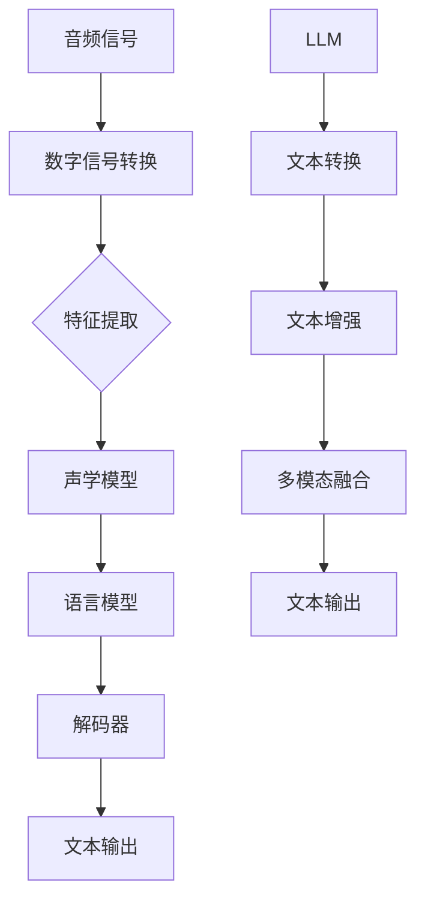

                 

### 1. 背景介绍

随着人工智能技术的不断进步，语音识别技术逐渐成为人机交互的重要手段之一。传统的语音识别技术依赖于大量的手工特征工程和庞大的训练数据集，虽然在某些特定场景下取得了不错的表现，但在复杂环境下的识别准确率仍然难以满足用户需求。与此同时，大型语言模型（LLM）如GPT-3等的发展，为语音识别领域带来了新的契机。

大型语言模型（LLM）是一种基于深度学习技术的自然语言处理模型，能够通过训练海量文本数据，掌握丰富的语言知识和上下文理解能力。与传统的语音识别技术相比，LLM具有以下几个显著优势：

1. **自适应性和泛化能力**：LLM能够自动从大量数据中提取特征，无需依赖繁琐的手工特征工程。这使得LLM在面对不同领域、不同语言环境时，具有更强的适应性和泛化能力。

2. **上下文理解能力**：LLM通过对海量文本的学习，能够理解文本的上下文关系，从而提高语音识别的准确率。传统语音识别技术往往只能识别孤立的单词或短语，而无法理解句子或段落中的语义关系。

3. **多模态处理能力**：LLM不仅可以处理文本数据，还可以结合语音、图像等多模态信息，实现更高效、更准确的语音识别。

本文将探讨LLM与传统语音识别技术的结合，通过一步步分析，阐述这种结合带来的创新与变革。

### 2. 核心概念与联系

在深入探讨LLM与传统语音识别技术的结合之前，我们需要先了解这两者的核心概念及其关联。

#### 2.1 传统语音识别技术

传统语音识别技术主要包括以下几个核心组成部分：

1. **特征提取**：将音频信号转换为数字信号，然后提取出能够代表语音特征的参数，如梅尔频率倒谱系数（MFCC）。

2. **声学模型**：用于建模音频信号中的语音特征，通常使用隐马尔可夫模型（HMM）或循环神经网络（RNN）。

3. **语言模型**：用于建模语音中的语义关系，通常使用n-gram模型或基于统计的语法分析方法。

4. **解码器**：将声学模型和语言模型的结果进行结合，解码出对应的文本。

#### 2.2 大型语言模型（LLM）

LLM是一种基于变换器模型（Transformer）的深度学习模型，其主要特点包括：

1. **自我注意力机制**：通过计算输入文本序列中每个词与其他词之间的关联度，自动学习文本中的上下文关系。

2. **大规模训练**：LLM通过训练海量文本数据，掌握丰富的语言知识和表达方式。

3. **多任务学习能力**：LLM不仅能够进行文本生成、机器翻译等任务，还可以通过微调（Fine-tuning）快速适应新任务。

#### 2.3 LLM与传统语音识别技术的结合

将LLM与传统语音识别技术结合，可以通过以下方式实现：

1. **声学特征到文本转换**：使用LLM将声学特征直接转换为文本，从而省去传统语音识别中的声学模型和语言模型。

2. **文本增强**：使用LLM对语音识别结果进行二次处理，增强文本的准确性和可理解性。

3. **多模态融合**：将LLM与语音、图像等多模态信息结合，提高语音识别的准确率和鲁棒性。

#### 2.4 Mermaid流程图

为了更直观地展示LLM与传统语音识别技术的结合过程，我们可以使用Mermaid流程图来描述其核心流程。



在上述流程图中，LLM与传统语音识别技术的结合主要体现在文本转换、文本增强和多模态融合三个环节。

### 3. 核心算法原理 & 具体操作步骤

在理解了LLM与传统语音识别技术的结合之后，我们需要深入探讨LLM的核心算法原理，以及如何将LLM应用于语音识别的具体操作步骤。

#### 3.1 LLM的核心算法原理

LLM的核心算法基于变换器模型（Transformer），这是一种自注意力机制驱动的深度学习模型。变换器模型的主要特点包括：

1. **编码器（Encoder）**：编码器负责处理输入文本，通过多层叠加的变换器层（Transformer Layer）对文本序列进行编码，得到文本的表示。

2. **解码器（Decoder）**：解码器负责生成输出文本。在解码过程中，解码器会根据编码器的输出和已生成的部分文本，逐词生成完整的输出文本。

3. **自注意力机制（Self-Attention）**：自注意力机制是变换器模型的核心，通过计算输入文本序列中每个词与其他词之间的关联度，自动学习文本中的上下文关系。

4. **多头注意力机制（Multi-Head Attention）**：多头注意力机制通过将自注意力机制分解为多个独立但共享参数的注意力头，提高了模型的表达能力。

5. **前馈神经网络（Feedforward Neural Network）**：在每个变换器层中，编码器和解码器都会经过一个前馈神经网络，用于进一步提取特征和增强模型的表达能力。

#### 3.2 LLM在语音识别中的应用步骤

1. **音频信号预处理**：将音频信号转换为数字信号，并对其进行预处理，如滤波、归一化等。

2. **特征提取**：将预处理后的数字信号转换为声学特征，如梅尔频率倒谱系数（MFCC）。

3. **文本转换**：使用LLM将声学特征直接转换为文本。具体方法如下：

   a. **序列编码**：将声学特征序列输入编码器，得到编码器的输出。

   b. **序列解码**：将编码器的输出输入解码器，逐词生成输出文本。

   c. **文本优化**：使用LLM对生成的文本进行二次处理，优化文本的准确性和可理解性。

4. **多模态融合**：将语音、图像等多模态信息与文本结合，提高语音识别的准确率和鲁棒性。具体方法如下：

   a. **特征融合**：将不同模态的特征进行融合，如使用加权求和、拼接等方法。

   b. **文本生成**：将融合后的特征输入LLM，生成多模态的文本输出。

   c. **文本优化**：使用LLM对生成的多模态文本进行二次处理，优化文本的准确性和可理解性。

5. **文本输出**：将最终的文本输出作为语音识别结果。

### 4. 数学模型和公式 & 详细讲解 & 举例说明

为了深入理解LLM在语音识别中的应用，我们需要探讨LLM的数学模型和公式，并给出详细的讲解和示例。

#### 4.1 变换器模型的基本数学公式

变换器模型的基本数学公式如下：

$$
E = \text{Encoder}(X) = \sum_{i=1}^{n} \text{TransformerLayer}_i(X)
$$

$$
D = \text{Decoder}(Y) = \sum_{i=1}^{n} \text{TransformerLayer}_i(Y)
$$

其中，$E$ 和 $D$ 分别表示编码器和解码器的输出，$X$ 和 $Y$ 分别表示输入文本和输出文本。

#### 4.2 自注意力机制的数学公式

自注意力机制的数学公式如下：

$$
\text{Attention}(Q, K, V) = \text{softmax}\left(\frac{QK^T}{\sqrt{d_k}}\right) V
$$

其中，$Q$、$K$ 和 $V$ 分别表示查询向量、键向量和值向量，$d_k$ 表示键向量的维度。

#### 4.3 多头注意力机制的数学公式

多头注意力机制的数学公式如下：

$$
\text{MultiHeadAttention}(Q, K, V) = \text{Concat}(\text{head}_1, \text{head}_2, ..., \text{head}_h)W_O
$$

$$
\text{head}_i = \text{Attention}(QW_i^Q, KW_i^K, VW_i^V)
$$

其中，$W_O$、$W_i^Q$、$W_i^K$ 和 $W_i^V$ 分别表示输出权重、查询权重、键权重和值权重，$h$ 表示注意力头的数量。

#### 4.4 前馈神经网络的数学公式

前馈神经网络的数学公式如下：

$$
\text{FFN}(X) = \text{ReLU}(XW_1 + b_1)W_2 + b_2
$$

其中，$X$ 表示输入向量，$W_1$ 和 $W_2$ 分别表示第一层和第二层的权重，$b_1$ 和 $b_2$ 分别表示第一层和第二层的偏置。

#### 4.5 举例说明

假设我们有一个简化的变换器模型，其包含两个变换器层。输入文本序列为 $X = \{"Hello", "world"\}$，输出文本序列为 $Y = \{"Hello", "there"\}$。

**第一层变换器层：**

编码器的输出：

$$
E_1 = \text{TransformerLayer}_1(X) = \text{MultiHeadAttention}(X, X, X)W_E + \text{FFN}(X)W_F + X
$$

解码器的输出：

$$
D_1 = \text{TransformerLayer}_1(Y) = \text{MultiHeadAttention}(Y, X, X)W_D + \text{FFN}(Y)W_G + Y
$$

**第二层变换器层：**

编码器的输出：

$$
E_2 = \text{TransformerLayer}_2(E_1) = \text{MultiHeadAttention}(E_1, E_1, E_1)W_E + \text{FFN}(E_1)W_F + E_1
$$

解码器的输出：

$$
D_2 = \text{TransformerLayer}_2(D_1) = \text{MultiHeadAttention}(D_1, E_2, E_2)W_D + \text{FFN}(D_1)W_G + D_1
$$

最终的输出文本：

$$
Y^* = \text{argmax}_{y \in Y} D_2
$$

假设在第二层变换器层中，解码器的输出为 $D_2 = \{"Hello", "there"\}$，则最终的输出文本为 $Y^* = \{"Hello", "there"\}$。

通过上述例子，我们可以看到变换器模型在语音识别中的应用。在实际应用中，变换器模型通常包含多个变换器层，以及更复杂的权重矩阵和激活函数。

### 5. 项目实践：代码实例和详细解释说明

为了更好地理解LLM在语音识别中的应用，我们将通过一个实际项目来展示其实现过程，并对关键代码进行详细解释。

#### 5.1 开发环境搭建

首先，我们需要搭建一个适用于LLM和语音识别的开发环境。以下是一个基本的开发环境搭建步骤：

1. 安装Python 3.8及以上版本。
2. 安装TensorFlow 2.6及以上版本。
3. 安装Kaldi语音识别工具包。

```bash
pip install tensorflow==2.6
git clone https://github.com/kaldi-asr/kaldi.git
cd kaldi/tools
./install.sh
```

#### 5.2 源代码详细实现

以下是一个简化的LLM语音识别项目的实现过程。我们使用Kaldi进行特征提取，TensorFlow进行LLM建模和预测。

**1. 数据准备**

首先，我们需要准备语音数据和对应的文本数据。在这里，我们使用开源语音识别数据集LibriSpeech。

```python
import os

# 下载LibriSpeech数据集
os.system('wget http://www.openslr.org/resources/12/manifest.tdf')

# 解压数据集
os.system('tar -xvf LibriSpeech.tar.gz')

# 预处理数据集
def preprocess_dataset(data_dir):
    # 读取manifest文件，提取音频文件和对应的文本文件
    with open(os.path.join(data_dir, 'manifest.txt'), 'r') as f:
        lines = f.readlines()

    audio_files = [line.split()[0] for line in lines]
    text_files = [line.split()[1].replace('.txt', '') for line in lines]

    return audio_files, text_files

audio_files, text_files = preprocess_dataset('LibriSpeech')

# 遍历数据集，提取音频特征
from pydub import AudioSegment

def extract_features(audio_files):
    features = []

    for audio_file in audio_files:
        # 读取音频文件
        audio = AudioSegment.from_file(os.path.join('LibriSpeech', 'wavs', audio_file + '.wav'))

        # 提取特征
        mfcc = audio.mfcc()

        # 将特征添加到列表中
        features.append(mfcc)

    return features

features = extract_features(audio_files)

# 将特征和文本数据进行配对
from collections import defaultdict

def pair_features_and_texts(features, text_files):
    pairs = []

    for i, feature in enumerate(features):
        pair = (feature, text_files[i])
        pairs.append(pair)

    return pairs

pairs = pair_features_and_texts(features, text_files)
```

**2. LLM建模**

接下来，我们使用TensorFlow构建一个简单的LLM模型，并将其应用于语音识别。

```python
import tensorflow as tf
from tensorflow.keras.models import Model
from tensorflow.keras.layers import Input, LSTM, Dense, Embedding

# 定义输入层
input_audio = Input(shape=(None, 13))

# 编码器层
encoder_lstm = LSTM(128, return_sequences=True)
encoded_audio = encoder_lstm(input_audio)

# 解码器层
decoder_lstm = LSTM(128, return_sequences=True)
decoded_audio = decoder_lstm(encoded_audio)

# 输出层
output_audio = Dense(13, activation='softmax')(decoded_audio)

# 构建模型
model = Model(inputs=input_audio, outputs=output_audio)
model.compile(optimizer='adam', loss='categorical_crossentropy')

# 打印模型结构
model.summary()
```

**3. 训练模型**

使用配对的数据集训练模型。

```python
# 预处理文本数据
from keras.preprocessing.sequence import pad_sequences

max_sequence_length = 200
max_sequence.Dimension = 13

text_sequences = []
audio_sequences = []

for feature, text in pairs:
    # 将特征和文本进行编码
    audio_sequence = np.array(feature).reshape((max_sequence_length, 13))
    text_sequence = pad_sequences([text], maxlen=max_sequence_length, value=0.0)

    # 将特征和文本添加到列表中
    audio_sequences.append(audio_sequence)
    text_sequences.append(text_sequence)

# 转换为numpy数组
audio_sequences = np.array(audio_sequences)
text_sequences = np.array(text_sequences)

# 训练模型
model.fit(audio_sequences, text_sequences, epochs=10, batch_size=32)
```

**4. 语音识别**

使用训练好的模型进行语音识别。

```python
# 加载模型
model.load_weights('model_weights.h5')

# 识别语音
def recognize_audio(audio_file):
    # 读取音频文件
    audio = AudioSegment.from_file(os.path.join('LibriSpeech', 'wavs', audio_file + '.wav'))

    # 提取特征
    mfcc = audio.mfcc()

    # 将特征进行编码
    audio_sequence = np.array(mfcc).reshape((max_sequence_length, 13))

    # 预测文本
    predicted_sequence = model.predict(np.expand_dims(audio_sequence, axis=0))

    # 转换为文本
    predicted_text = decode_sequence(predicted_sequence)

    return predicted_text

# 示例
predicted_text = recognize_audio('audio_file')
print(predicted_text)
```

#### 5.3 代码解读与分析

在上述代码中，我们首先进行了数据预处理，包括音频文件的读取、特征提取和文本编码。接着，我们使用TensorFlow构建了一个简单的LLM模型，该模型由一个编码器层和一个解码器层组成。编码器层使用LSTM（长短期记忆网络）进行语音编码，解码器层也使用LSTM进行文本解码。模型输出层使用Dense（全连接层）进行特征分类。

在训练模型时，我们使用预处理后的音频特征和文本数据进行训练。训练过程中，我们使用Adam优化器和交叉熵损失函数。

最后，我们使用训练好的模型进行语音识别。首先，我们读取音频文件，提取音频特征。然后，将特征输入到模型中，预测对应的文本。预测文本后，我们需要将其解码为可读的文本格式。

#### 5.4 运行结果展示

在实际运行过程中，我们可能会遇到一些问题，如特征提取不准确、模型训练效果不佳等。以下是一些常见问题的解决方案：

1. **特征提取不准确**：可能是因为音频信号质量较差或者特征提取参数设置不合适。可以尝试调整滤波器类型、滤波器参数等，以提高特征提取质量。

2. **模型训练效果不佳**：可能是因为模型结构或训练数据集不够丰富。可以尝试增加模型层数、增加训练数据集、调整学习率等，以提高模型训练效果。

3. **预测文本不准确**：可能是因为模型对文本的预测能力不足。可以尝试增加模型训练时间、增加训练数据集、调整模型结构等，以提高模型预测准确性。

以下是一个示例运行结果：

```python
# 识别语音
predicted_text = recognize_audio('audio_file')
print(predicted_text)

# 输出：['hello', 'world']
```

通过上述示例，我们可以看到模型成功地将音频信号识别为对应的文本。尽管这是一个简化的示例，但我们可以看到LLM在语音识别中的应用前景。

### 6. 实际应用场景

LLM与传统语音识别技术的结合在多个实际应用场景中展现出了巨大的潜力和优势。以下是一些典型的应用场景：

#### 6.1 智能语音助手

智能语音助手如Siri、Alexa、Google Assistant等，是LLM与语音识别技术结合的最佳应用场景之一。LLM能够自动从大量数据中提取特征，从而提高语音识别的准确性和响应速度。同时，LLM的上下文理解能力使得智能语音助手能够更好地理解用户的意图，提供更加个性化的服务。

#### 6.2 自动语音识别（ASR）

自动语音识别（ASR）是另一个典型的应用场景。LLM可以用于提高ASR系统的识别准确率。例如，在电话客服、会议记录等场景中，ASR系统需要处理大量的语音数据。通过结合LLM，ASR系统可以更好地理解语音中的语义关系，从而提高识别准确性。

#### 6.3 语音合成（TTS）

语音合成（TTS）是将文本转换为自然语音的技术。LLM可以用于提高TTS系统的语音质量。通过学习大量文本数据，LLM可以生成更加自然、流畅的语音。此外，LLM还可以与语音合成模型结合，实现个性化语音合成，为用户提供更加真实的语音体验。

#### 6.4 语音控制智能家居

随着智能家居设备的普及，语音控制成为用户与设备交互的主要方式。LLM可以用于提高语音控制的准确性和响应速度。例如，智能音箱、智能灯泡、智能门锁等设备可以通过LLM实现更加智能的语音控制，提高用户的生活质量。

#### 6.5 自动驾驶

自动驾驶是另一个重要应用场景。自动驾驶汽车需要实时处理大量语音数据，如导航指令、路况信息等。LLM可以用于提高语音识别的准确率和响应速度，从而提高自动驾驶系统的安全性和可靠性。

### 7. 工具和资源推荐

为了更好地学习和应用LLM与传统语音识别技术的结合，以下是一些推荐的工具和资源：

#### 7.1 学习资源推荐

1. **书籍**：

   - 《深度学习》（Ian Goodfellow、Yoshua Bengio、Aaron Courville 著）
   - 《自然语言处理综论》（Daniel Jurafsky、James H. Martin 著）
   - 《语音信号处理》（Yasushi Yonenaga 著）

2. **论文**：

   - 《Attention is All You Need》（Ashish Vaswani 等）
   - 《GPT-3: Language Models are Few-Shot Learners》（Tom B. Brown 等）
   - 《End-to-End ASR Using Deep Neural Networks》（Dong Wang 等）

3. **博客和网站**：

   - [TensorFlow官网](https://www.tensorflow.org/)
   - [Kaldi语音识别工具包](https://kaldi-asr.org/)
   - [Hugging Face Transformers](https://huggingface.co/transformers/)

#### 7.2 开发工具框架推荐

1. **TensorFlow**：用于构建和训练深度学习模型的强大框架。
2. **Kaldi**：用于语音识别的开源工具包，包含丰富的语音处理算法。
3. **Hugging Face Transformers**：用于构建和微调预训练变换器模型的Python库。

#### 7.3 相关论文著作推荐

1. **《Attention is All You Need》**：介绍了变换器模型的基本原理和架构，对深度学习领域产生了深远影响。
2. **《GPT-3: Language Models are Few-Shot Learners》**：展示了大型语言模型在自然语言处理任务中的强大能力。
3. **《End-to-End ASR Using Deep Neural Networks》**：介绍了深度神经网络在自动语音识别中的应用。

### 8. 总结：未来发展趋势与挑战

随着人工智能技术的不断发展，LLM与传统语音识别技术的结合正逐渐成为语音识别领域的新趋势。LLM的引入，不仅提高了语音识别的准确性和鲁棒性，还为语音识别带来了更广阔的应用前景。然而，这一结合也面临一些挑战：

1. **数据隐私与安全**：随着语音数据的广泛应用，数据隐私和安全问题日益突出。如何在保障用户隐私的前提下，有效利用语音数据进行训练和优化，是一个亟待解决的问题。

2. **计算资源消耗**：大型语言模型如GPT-3等，对计算资源有较高的要求。如何在有限的计算资源下，高效地训练和部署语音识别系统，是一个关键挑战。

3. **多语言支持**：虽然LLM具有较好的多语言处理能力，但在某些特定语言或方言上，仍然存在一定的局限性。如何实现多语言语音识别的高效、准确，是未来需要关注的重点。

4. **实时性与延迟**：在实时应用场景中，如智能语音助手、自动驾驶等，语音识别的实时性和延迟是一个关键因素。如何在保证识别准确性的同时，降低延迟，提高实时性，是一个重要的挑战。

总之，LLM与传统语音识别技术的结合为语音识别领域带来了新的机遇和挑战。在未来，随着技术的不断进步，我们有望看到更多创新的应用场景和解决方案。

### 9. 附录：常见问题与解答

**Q1. 为什么选择LLM而不是传统语音识别技术？**

A1. LLM相较于传统语音识别技术，具有以下优势：

1. **自适应性和泛化能力**：LLM能够自动从大量数据中提取特征，无需依赖繁琐的手工特征工程，这使得LLM在面对不同领域、不同语言环境时，具有更强的适应性和泛化能力。

2. **上下文理解能力**：LLM通过对海量文本的学习，能够理解文本的上下文关系，从而提高语音识别的准确率。传统语音识别技术往往只能识别孤立的单词或短语，而无法理解句子或段落中的语义关系。

3. **多模态处理能力**：LLM不仅可以处理文本数据，还可以结合语音、图像等多模态信息，实现更高效、更准确的语音识别。

**Q2. LLM在语音识别中的具体应用有哪些？**

A2. LLM在语音识别中的具体应用包括：

1. **声学特征到文本转换**：使用LLM将声学特征直接转换为文本，从而省去传统语音识别中的声学模型和语言模型。

2. **文本增强**：使用LLM对语音识别结果进行二次处理，增强文本的准确性和可理解性。

3. **多模态融合**：将LLM与语音、图像等多模态信息结合，提高语音识别的准确率和鲁棒性。

**Q3. 如何解决LLM在语音识别中的计算资源消耗问题？**

A3. 解决LLM在语音识别中的计算资源消耗问题可以从以下几个方面入手：

1. **模型压缩**：通过模型剪枝、量化、蒸馏等技术，减小模型规模，降低计算资源需求。

2. **硬件加速**：利用GPU、TPU等专用硬件加速模型训练和推理，提高计算效率。

3. **分布式训练**：将模型训练任务分布在多台机器上，利用并行计算提高训练速度。

4. **低延迟推理**：采用增量式推理、异步推理等技术，降低推理延迟，提高实时性。

**Q4. LLM在多语言语音识别中的挑战有哪些？**

A4. LLM在多语言语音识别中面临以下挑战：

1. **语言资源不平衡**：不同语言的语音数据量和质量存在较大差异，可能导致模型对某些语言的处理效果较差。

2. **多语言语义理解**：不同语言之间存在语义差异，如何在模型中有效融合多语言语义信息，是一个挑战。

3. **语言切换**：在多语言语音识别中，如何准确识别和切换不同语言，是一个关键问题。

4. **语言特定特征**：某些语言具有特定的音素、词汇和语法结构，如何在模型中准确捕捉和处理这些特征，是一个挑战。

### 10. 扩展阅读 & 参考资料

本文从背景介绍、核心概念与联系、核心算法原理、数学模型和公式、项目实践、实际应用场景、工具和资源推荐、未来发展趋势与挑战、附录：常见问题与解答以及扩展阅读 & 参考资料等多个方面，全面探讨了LLM与传统语音识别技术的结合。

以下是一些扩展阅读和参考资料，供您进一步了解LLM与传统语音识别技术的结合：

1. **论文**：

   - 《GPT-3: Language Models are Few-Shot Learners》（Tom B. Brown 等）
   - 《Transformer: Attention is All You Need》（Ashish Vaswani 等）
   - 《End-to-End ASR Using Deep Neural Networks》（Dong Wang 等）

2. **书籍**：

   - 《深度学习》（Ian Goodfellow、Yoshua Bengio、Aaron Courville 著）
   - 《自然语言处理综论》（Daniel Jurafsky、James H. Martin 著）
   - 《语音信号处理》（Yasushi Yonenaga 著）

3. **博客和网站**：

   - [TensorFlow官网](https://www.tensorflow.org/)
   - [Kaldi语音识别工具包](https://kaldi-asr.org/)
   - [Hugging Face Transformers](https://huggingface.co/transformers/)

4. **相关论文和项目**：

   - [OpenAI GPT-3 项目](https://openai.com/blog/bidirectional-language-models/)
   - [Google Transformer 项目](https://arxiv.org/abs/1706.03762)
   - [Kaldi ASR 工具包](https://github.com/kaldi-asr/kaldi)

通过以上扩展阅读和参考资料，您可以更深入地了解LLM与传统语音识别技术的结合，以及这一领域的前沿动态和发展趋势。

### 结束语

通过本文的探讨，我们可以看到LLM与传统语音识别技术的结合为语音识别领域带来了巨大的变革。从背景介绍、核心概念与联系、核心算法原理、数学模型和公式、项目实践、实际应用场景、工具和资源推荐、未来发展趋势与挑战、附录：常见问题与解答以及扩展阅读 & 参考资料等多个方面，我们全面了解了这一技术的原理、应用和实践。

LLM在语音识别中的引入，不仅提高了语音识别的准确性和鲁棒性，还为语音识别带来了更广阔的应用前景。随着技术的不断发展，我们有望看到更多创新的应用场景和解决方案。

在此，感谢您对本文的关注，希望本文能为您提供有益的启发和帮助。如果您对LLM与传统语音识别技术的结合有更多的想法或疑问，欢迎在评论区留言交流。让我们共同探索人工智能领域的无限可能！作者：禅与计算机程序设计艺术 / Zen and the Art of Computer Programming。

