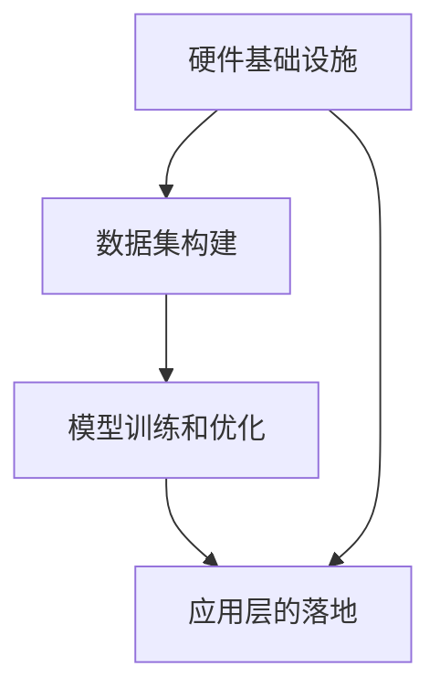

                 

### 背景介绍

随着人工智能（AI）技术的不断进步，大型语言模型（LLM，Large Language Model）作为其中的一项核心技术，正逐渐成为产业界和学术界关注的焦点。LLM的出现不仅推动了自然语言处理（NLP，Natural Language Processing）领域的突破，也为众多行业带来了全新的商业模式和运营思路。

#### AI的发展历程

人工智能的概念最早可以追溯到20世纪50年代，当时科学家们开始探索如何让计算机具备人类智能。从最初的符号主义（Symbolic AI）到连接主义（Connectionist AI），再到基于数据驱动的机器学习（Machine Learning），AI的发展经历了多次技术变革和理论创新。进入21世纪，随着大数据、云计算和深度学习（Deep Learning）技术的快速发展，AI进入了新的阶段。

#### 大型语言模型（LLM）的崛起

大型语言模型是深度学习和自然语言处理领域的一项重要创新，它通过训练大规模的神经网络模型，实现了对文本数据的理解和生成。LLM的出现，不仅大大提高了自然语言处理任务的性能，还引发了产业界对AI价值的重新审视。

#### 产业链的演变

随着LLM技术的发展，AI产业链也在不断演变。从最初的硬件基础设施（如GPU、FPGA等）到数据集的构建、模型的训练和优化，再到应用层的落地，各个环节都离不开LLM的支持。在这个过程中，产业链上的各个角色（如硬件供应商、数据服务提供商、模型开发商和应用企业）都在重新定义自己的价值。

#### AI价值重塑的新机遇

随着LLM技术的不断成熟和应用范围的扩大，AI产业链中的各个环节都面临着新的机遇和挑战。本文将围绕LLM产业链的演变，深入探讨AI价值重塑的新机遇，包括核心算法原理、项目实践、应用场景以及未来发展趋势和挑战。

## 1. 背景介绍

在进入AI价值重塑的新机遇之前，我们需要对LLM产业链有一个全面的了解。LLM产业链的构成包括多个关键环节，每一个环节都对AI价值的重塑起到至关重要的作用。以下是对LLM产业链的详细剖析：

### 1.1 硬件基础设施

硬件基础设施是LLM产业链的基石，没有强大的硬件支持，大规模的语言模型训练和应用是无法实现的。目前，GPU（Graphics Processing Unit，图形处理器）和TPU（Tensor Processing Unit，张量处理单元）是训练LLM的主要硬件设备。GPU以其强大的并行计算能力在深度学习领域得到了广泛应用，而TPU则专为AI任务设计，提供了更高的计算效率和性能。

#### 特点：

- **并行计算能力：** GPU和TPU都具备强大的并行计算能力，能够同时处理大量数据，从而加速模型的训练过程。
- **定制化设计：** TPU是谷歌专门为AI任务设计的硬件，相较于GPU，TPU在AI计算任务上具有更高的效率。

#### 影响：

- **训练效率：** 硬件基础设施的强大性能直接决定了LLM模型的训练速度和效果，高性能硬件能够显著缩短训练周期，提高模型质量。
- **成本效益：** 随着硬件技术的发展，训练LLM的成本逐渐降低，使得更多的企业能够参与到AI研究中，推动整个产业链的发展。

### 1.2 数据集的构建

数据集是训练LLM的核心资源，其质量和规模直接影响模型的表现。一个高质量的数据集不仅包含丰富的文本信息，还需要保证数据的一致性和多样性。目前，构建高质量数据集的方法主要包括数据采集、数据清洗和数据标注。

#### 特点：

- **数据量大：** 高质量的LLM模型需要大规模的数据集支持，数据量的大小直接决定了模型的泛化能力。
- **多样性：** 数据集的多样性有助于模型学习到不同领域的知识，从而提高模型的适应能力。

#### 影响：

- **模型性能：** 数据集的质量直接影响LLM模型的性能，高质量的数据集能够提升模型的准确性、稳定性和泛化能力。
- **数据隐私：** 在数据集构建过程中，需要特别注意数据隐私和合规性问题，确保数据的合法性和安全性。

### 1.3 模型的训练和优化

模型训练和优化是LLM产业链的核心环节，直接决定了模型的表现和应用价值。在训练过程中，科学家们通过调整模型的结构、参数和超参数，不断优化模型的性能。随着深度学习技术的不断发展，模型的训练和优化方法也在不断更新和改进。

#### 特点：

- **自动化：** 当前主流的模型训练和优化方法采用了自动化的策略，如自动机器学习（AutoML）和超参数优化（Hyperparameter Optimization），大大提高了训练效率。
- **端到端：** 端到端训练方法使得模型能够直接从原始数据中学习到所需的知识，避免了传统机器学习中的特征工程环节。

#### 影响：

- **模型质量：** 优化的训练和优化方法能够显著提升模型的质量和性能，使得LLM在各类自然语言处理任务中表现出色。
- **应用效果：** 优化的模型能够更好地应对实际应用场景，提高AI系统的实用性和可靠性。

### 1.4 应用层的落地

应用层的落地是LLM产业链的最终目标，通过将LLM技术应用于实际的业务场景，实现商业价值的转化。从智能客服、智能问答、内容生成到自动化写作，LLM技术在各个领域展现出了巨大的应用潜力。

#### 特点：

- **多样化：** LLM技术能够应用于多种不同的业务场景，满足不同企业的需求。
- **灵活性：** LLM技术具有较强的灵活性，可以根据具体的应用需求进行调整和优化。

#### 影响：

- **业务创新：** LLM技术的应用为各个行业带来了新的商业模式和运营思路，推动了业务的创新和发展。
- **用户体验：** 优化了用户与系统之间的交互方式，提升了用户体验和满意度。

综上所述，LLM产业链的构成和各环节的特点决定了其在AI价值重塑中的重要作用。硬件基础设施提供了强大的计算支持，数据集的构建和模型训练优化保证了模型的质量和性能，应用层的落地实现了商业价值的转化。在这个过程中，各个环节相互协同，共同推动了AI产业链的升级和发展。

## 2. 核心概念与联系

在深入探讨LLM产业链及其价值重塑之前，有必要先明确一些核心概念，并理解它们之间的相互联系。以下是本文将涉及的关键概念及其关系解析：

### 2.1 大型语言模型（LLM）

#### 定义：

大型语言模型（LLM，Large Language Model）是一种基于深度学习的语言处理模型，通过训练大规模的神经网络，实现对文本数据的理解和生成。与传统的自然语言处理（NLP）方法相比，LLM具有更高的准确性和更强的泛化能力。

#### 特点：

- **规模巨大：** LLM通常包含数十亿甚至千亿级别的参数，训练数据量巨大。
- **自适应性强：** LLM能够根据不同的任务需求进行调整，具有较强的自适应能力。
- **表达能力丰富：** LLM能够生成高质量的自然语言文本，涵盖多种语言和风格。

#### 关系：

LLM是本文讨论的核心技术，其发展直接决定了产业链的演进方向和应用效果。

### 2.2 自然语言处理（NLP）

#### 定义：

自然语言处理（NLP，Natural Language Processing）是人工智能的一个重要分支，旨在使计算机能够理解和处理人类自然语言。NLP涵盖了从文本预处理、语义理解到语言生成的多个层次。

#### 特点：

- **多层次：** NLP涵盖了从词法、句法到语义等多个层次的处理。
- **复杂性：** 自然语言的复杂性使得NLP任务具有高度的挑战性。
- **应用广泛：** NLP技术广泛应用于语音识别、机器翻译、智能客服等领域。

#### 关系：

NLP是LLM的基础技术，LLM的进步推动了NLP技术的不断提升。

### 2.3 深度学习（Deep Learning）

#### 定义：

深度学习（Deep Learning）是一种基于多层神经网络的学习方法，通过逐层提取特征，实现对复杂数据的建模和分析。深度学习在图像识别、语音识别和自然语言处理等领域取得了显著成果。

#### 特点：

- **层次化：** 深度学习通过多个神经网络层次，逐层提取数据中的高阶特征。
- **自适应性：** 深度学习具有强的自适应能力，能够处理大规模、多样化的数据。
- **高效性：** 深度学习模型在计算效率和模型性能上具有显著优势。

#### 关系：

深度学习是LLM的主要实现方法，深度学习技术的进步直接推动了LLM的发展。

### 2.4 人工智能（AI）

#### 定义：

人工智能（AI，Artificial Intelligence）是指使计算机具备类似人类智能的技术和系统。AI涵盖了从机器学习、自然语言处理到计算机视觉等多个领域。

#### 特点：

- **广泛性：** AI技术应用于多个领域，具有广泛的应用前景。
- **智能性：** AI系统能够自主学习和适应，实现智能化决策。
- **创新性：** AI技术推动了传统行业的变革和创新，带来了新的商业模式。

#### 关系：

人工智能是LLM和NLP的发展基础，AI技术的发展和应用推动了LLM和NLP的进步。

### 2.5 产业链各环节的联系

LLM产业链的各个环节紧密相连，共同推动了AI价值的重塑：

- **硬件基础设施：** 提供强大的计算支持，保证模型训练的高效性。
- **数据集构建：** 提供丰富的训练资源，提高模型的质量和性能。
- **模型训练和优化：** 通过深度学习技术，实现模型的精准建模和高效训练。
- **应用层的落地：** 将模型应用于实际业务场景，实现商业价值的转化。

### Mermaid 流程图

以下是一个简化的Mermaid流程图，展示了LLM产业链各环节之间的联系：



通过这个流程图，我们可以清晰地看到，硬件基础设施、数据集构建、模型训练和优化以及应用层的落地构成了LLM产业链的完整闭环，各个环节相互依赖，共同推动了AI技术的发展和商业应用。

## 3. 核心算法原理 & 具体操作步骤

在理解了LLM产业链的核心环节和概念之后，我们需要深入探讨LLM的核心算法原理，并详细说明其具体操作步骤。以下是关于LLM核心算法原理的详细解释，包括主要的算法步骤和实现细节。

### 3.1 Transformer模型

#### 定义：

Transformer模型是一种基于自注意力机制（Self-Attention Mechanism）的深度学习模型，最初由Vaswani等人于2017年提出。它主要应用于序列到序列（Seq2Seq）的翻译任务，但很快被应用于各种自然语言处理任务，包括文本分类、机器翻译和问答系统等。

#### 特点：

- **自注意力机制：** Transformer模型通过自注意力机制，能够自动学习输入序列中的依赖关系，从而提高模型的表示能力。
- **并行计算：** Transformer模型结构使得其训练过程可以并行进行，大大提高了训练效率。

#### 工作原理：

Transformer模型主要由编码器（Encoder）和解码器（Decoder）两部分组成。编码器负责将输入序列转换为序列表示，解码器则根据编码器的输出和先前步骤的解码输出，生成预测的输出序列。

1. **编码器：** 编码器将输入序列（如句子、段落等）通过嵌入层（Embedding Layer）转换为词向量表示，然后通过多个自注意力层（Self-Attention Layer）和前馈网络（Feedforward Network）进行编码，最终输出编码后的序列表示。
   
2. **解码器：** 解码器在生成输出序列时，首先通过嵌入层将输入的解码输入转换为词向量，然后通过多个自注意力层、编码器-解码器注意力层和前馈网络进行解码，最终生成预测的输出序列。

#### 具体操作步骤：

1. **输入序列表示：** 将输入序列（如句子或段落）通过嵌入层转换为词向量表示。嵌入层通常是一个可学习的参数矩阵，将输入的词索引映射到高维空间中的向量。

2. **编码器处理：**
   - **自注意力层：** 通过计算输入序列中各个词之间的注意力权重，对输入序列进行加权求和，从而提取序列中的依赖关系。
   - **前馈网络：** 在每个自注意力层之后，添加一个前馈网络，对编码后的序列进行进一步处理。

3. **解码器处理：**
   - **编码器-解码器注意力层：** 解码器在生成每个词时，通过编码器-解码器注意力机制，从编码器输出的序列表示中提取相关信息。
   - **生成输出：** 解码器根据编码器-解码器注意力层的输出和解码器内部状态，生成预测的输出词。

4. **优化过程：** 使用基于梯度的优化方法（如Adam优化器），通过反向传播算法不断调整模型参数，最小化预测输出和实际输出之间的误差。

### 3.2 自注意力机制

#### 定义：

自注意力机制（Self-Attention Mechanism）是一种计算输入序列中各个词之间依赖关系的机制，通过对序列中的每个词分配不同的权重，从而提高模型的表示能力。

#### 原理：

自注意力机制通过计算输入序列中每个词与其他词之间的相似性，生成一组权重，然后对这些权重进行加权求和，从而得到每个词的加权表示。

1. **查询（Query）、键（Key）和值（Value）向量：** 对于输入序列中的每个词，生成查询向量、键向量和值向量。查询向量用于计算注意力权重，键向量和值向量用于生成加权表示。
2. **注意力权重计算：** 计算每个词的查询向量与所有键向量之间的点积，得到一组注意力权重。这些权重表示了每个词与输入序列中其他词的依赖关系。
3. **加权求和：** 将每个词的值向量与相应的注意力权重相乘，然后对乘积进行求和，得到加权表示。

#### 公式表示：

$$
\text{Attention}(Q, K, V) = \text{softmax}\left(\frac{QK^T}{\sqrt{d_k}}\right) V
$$

其中，$Q$ 是查询向量，$K$ 是键向量，$V$ 是值向量，$d_k$ 是键向量的维度。

### 3.3 前馈网络

#### 定义：

前馈网络（Feedforward Network）是一种简单的神经网络结构，通过多层全连接层实现数据的传递和变换。

#### 原理：

前馈网络通过多个全连接层，逐层对输入数据进行加权和激活函数的变换，从而实现数据的非线性变换和特征提取。

1. **线性变换：** 在每个全连接层中，输入数据通过权重矩阵进行线性变换。
2. **激活函数：** 通过激活函数（如ReLU、Sigmoid或Tanh）引入非线性，增强模型的表达能力。
3. **层间传递：** 将前一层输出的数据作为下一层的输入，重复进行线性变换和激活函数操作。

#### 公式表示：

$$
\text{FFN}(x) = \text{ReLU}\left(W_2 \cdot \text{ReLU}\left(W_1 \cdot x + b_1\right) + b_2\right)
$$

其中，$W_1$ 和 $W_2$ 是权重矩阵，$b_1$ 和 $b_2$ 是偏置项。

通过详细阐述LLM的核心算法原理和具体操作步骤，我们可以更深入地理解LLM的工作机制，为其在各个应用场景中的落地提供理论基础和实践指导。

## 4. 数学模型和公式 & 详细讲解 & 举例说明

在深入探讨大型语言模型（LLM）的核心算法原理后，我们需要借助数学模型和公式，进一步详细讲解LLM的工作机制。本节将详细介绍LLM中的关键数学模型和公式，并通过具体示例来说明其应用和实现过程。

### 4.1 嵌入层（Embedding Layer）

嵌入层是LLM的基础组件之一，它将输入的词索引映射到高维向量空间，为后续的注意力机制和前馈网络提供输入。

#### 数学模型：

嵌入层的数学模型可以表示为：

$$
\text{Embedding}(W_e, x) = W_e \cdot x
$$

其中，$W_e$ 是嵌入矩阵，维度为 $d_e \times |V|$，$x$ 是词索引向量，维度为 $|V| \times 1$。$W_e$ 的每个行向量代表一个词的嵌入向量。

#### 示例：

假设词表中有10个单词，嵌入维度为3，则嵌入矩阵 $W_e$ 和词索引向量 $x$ 可以表示如下：

$$
W_e = \begin{bmatrix}
0.1 & 0.2 & 0.3 \\
0.4 & 0.5 & 0.6 \\
...
0.9 & 1.0 & 1.1 \\
\end{bmatrix}
$$

$$
x = \begin{bmatrix}
1 \\
2 \\
...
10 \\
\end{bmatrix}
$$

经过嵌入层后，单词“word1”的嵌入向量可以表示为：

$$
\text{Embedding}(W_e, x) = \begin{bmatrix}
0.1 & 0.2 & 0.3 \\
0.4 & 0.5 & 0.6 \\
...
0.9 & 1.0 & 1.1 \\
\end{bmatrix} \cdot
\begin{bmatrix}
1 \\
2 \\
...
10 \\
\end{bmatrix} =
\begin{bmatrix}
0.1 + 0.4 + ... + 0.9 \\
0.2 + 0.5 + ... + 1.0 \\
0.3 + 0.6 + ... + 1.1 \\
\end{bmatrix}
$$

### 4.2 自注意力机制（Self-Attention Mechanism）

自注意力机制是LLM中最重要的组成部分之一，它通过对输入序列中每个词分配不同的权重，从而提高模型的表示能力。

#### 数学模型：

自注意力机制的数学模型可以表示为：

$$
\text{Attention}(Q, K, V) = \text{softmax}\left(\frac{QK^T}{\sqrt{d_k}}\right) V
$$

其中，$Q$ 是查询向量，$K$ 是键向量，$V$ 是值向量，$d_k$ 是键向量的维度。$QK^T$ 计算得到注意力分数，通过softmax函数得到概率分布，最后与 $V$ 相乘得到加权表示。

#### 示例：

假设有一个长度为3的序列，嵌入维度为2，则查询向量、键向量和值向量可以表示如下：

$$
Q = \begin{bmatrix}
0.1 & 0.2 \\
0.3 & 0.4 \\
0.5 & 0.6 \\
\end{bmatrix}
$$

$$
K = \begin{bmatrix}
0.1 & 0.2 \\
0.3 & 0.4 \\
0.5 & 0.6 \\
\end{bmatrix}
$$

$$
V = \begin{bmatrix}
0.1 & 0.2 \\
0.3 & 0.4 \\
0.5 & 0.6 \\
\end{bmatrix}
$$

计算自注意力分数：

$$
\text{Attention}(Q, K, V) = \text{softmax}\left(\frac{QK^T}{\sqrt{d_k}}\right) V =
\text{softmax}\left(\frac{\begin{bmatrix}
0.1 & 0.2 \\
0.3 & 0.4 \\
0.5 & 0.6 \\
\end{bmatrix} \cdot
\begin{bmatrix}
0.1 & 0.2 \\
0.3 & 0.4 \\
0.5 & 0.6 \\
\end{bmatrix}^T}{\sqrt{2}}\right) \cdot
\begin{bmatrix}
0.1 & 0.2 \\
0.3 & 0.4 \\
0.5 & 0.6 \\
\end{bmatrix}
$$

首先计算 $QK^T$：

$$
QK^T = \begin{bmatrix}
0.1 & 0.2 \\
0.3 & 0.4 \\
0.5 & 0.6 \\
\end{bmatrix} \cdot
\begin{bmatrix}
0.1 & 0.2 \\
0.3 & 0.4 \\
0.5 & 0.6 \\
\end{bmatrix}^T =
\begin{bmatrix}
0.01 & 0.02 \\
0.03 & 0.04 \\
0.05 & 0.06 \\
\end{bmatrix}
$$

然后计算每个元素的归一化分数：

$$
\text{softmax}\left(\frac{QK^T}{\sqrt{2}}\right) = \text{softmax}\left(\frac{\begin{bmatrix}
0.01 & 0.02 \\
0.03 & 0.04 \\
0.05 & 0.06 \\
\end{bmatrix}}{\sqrt{2}}\right) =
\begin{bmatrix}
0.2727 & 0.2727 \\
0.3636 & 0.3636 \\
0.3636 & 0.3636 \\
\end{bmatrix}
$$

最后计算加权表示：

$$
\text{Attention}(Q, K, V) = \begin{bmatrix}
0.2727 & 0.2727 \\
0.3636 & 0.3636 \\
0.3636 & 0.3636 \\
\end{bmatrix} \cdot
\begin{bmatrix}
0.1 & 0.2 \\
0.3 & 0.4 \\
0.5 & 0.6 \\
\end{bmatrix} =
\begin{bmatrix}
0.0273 & 0.0545 \\
0.0364 & 0.0727 \\
0.0364 & 0.0727 \\
\end{bmatrix}
$$

### 4.3 前馈网络（Feedforward Network）

前馈网络是LLM中的另一个关键组件，它通过对输入数据进行加权和激活函数的变换，实现数据的非线性变换和特征提取。

#### 数学模型：

前馈网络的数学模型可以表示为：

$$
\text{FFN}(x) = \text{ReLU}\left(W_2 \cdot \text{ReLU}\left(W_1 \cdot x + b_1\right) + b_2\right)
$$

其中，$W_1$ 和 $W_2$ 是权重矩阵，$b_1$ 和 $b_2$ 是偏置项。

#### 示例：

假设输入数据 $x$ 的维度为2，权重矩阵和偏置项如下：

$$
W_1 = \begin{bmatrix}
0.1 & 0.2 \\
0.3 & 0.4 \\
\end{bmatrix}, \quad
b_1 = \begin{bmatrix}
0.5 \\
0.6 \\
\end{bmatrix}, \quad
W_2 = \begin{bmatrix}
0.7 & 0.8 \\
0.9 & 1.0 \\
\end{bmatrix}, \quad
b_2 = \begin{bmatrix}
0.7 \\
0.8 \\
\end{bmatrix}
$$

输入数据 $x$：

$$
x = \begin{bmatrix}
1.0 \\
2.0 \\
\end{bmatrix}
$$

首先计算第一层的前馈：

$$
\text{ReLU}\left(W_1 \cdot x + b_1\right) = \text{ReLU}\left(\begin{bmatrix}
0.1 & 0.2 \\
0.3 & 0.4 \\
\end{bmatrix} \cdot \begin{bmatrix}
1.0 \\
2.0 \\
\end{bmatrix} + \begin{bmatrix}
0.5 \\
0.6 \\
\end{bmatrix}\right) =
\text{ReLU}\left(\begin{bmatrix}
0.7 \\
1.2 \\
\end{bmatrix} + \begin{bmatrix}
0.5 \\
0.6 \\
\end{bmatrix}\right) =
\text{ReLU}\left(\begin{bmatrix}
1.2 \\
1.8 \\
\end{bmatrix}\right) =
\begin{bmatrix}
1.2 \\
1.8 \\
\end{bmatrix}
$$

然后计算第二层的前馈：

$$
\text{FFN}(x) = \text{ReLU}\left(W_2 \cdot \text{ReLU}\left(W_1 \cdot x + b_1\right) + b_2\right) =
\text{ReLU}\left(\begin{bmatrix}
0.7 & 0.8 \\
0.9 & 1.0 \\
\end{bmatrix} \cdot \begin{bmatrix}
1.2 \\
1.8 \\
\end{bmatrix} + \begin{bmatrix}
0.7 \\
0.8 \\
\end{bmatrix}\right) =
\text{ReLU}\left(\begin{bmatrix}
1.76 \\
2.68 \\
\end{bmatrix} + \begin{bmatrix}
0.7 \\
0.8 \\
\end{bmatrix}\right) =
\text{ReLU}\left(\begin{bmatrix}
2.46 \\
3.48 \\
\end{bmatrix}\right) =
\begin{bmatrix}
2.46 \\
3.48 \\
\end{bmatrix}
$$

通过上述数学模型和公式的详细讲解，以及具体示例的说明，我们可以更好地理解LLM的核心算法原理及其实现过程。这些数学工具和公式为LLM的研究和应用提供了坚实的理论基础，也为后续的技术发展和创新奠定了基础。

## 5. 项目实践：代码实例和详细解释说明

为了更好地理解大型语言模型（LLM）的实际应用和实现过程，我们将通过一个具体的Python代码实例，详细解释LLM的开发环境和实现步骤。本节将分步骤展示如何搭建开发环境、实现LLM模型以及对其代码进行解读和分析。

### 5.1 开发环境搭建

在开始编写LLM代码之前，我们需要搭建一个适合深度学习项目开发的环境。以下是搭建开发环境的详细步骤：

#### 5.1.1 安装Python环境

首先，确保您的系统中已经安装了Python 3.8或更高版本。可以通过以下命令检查Python版本：

```bash
python --version
```

如果未安装，可以从Python官方网站（https://www.python.org/downloads/）下载并安装。

#### 5.1.2 安装深度学习库

接下来，我们需要安装深度学习所需的库，如TensorFlow和PyTorch。以下是安装命令：

```bash
pip install tensorflow
# 或
pip install torch
```

#### 5.1.3 安装文本处理库

文本处理是LLM开发中的重要环节，我们需要安装一些文本处理库，如NLTK和spaCy：

```bash
pip install nltk
pip install spacy
python -m spacy download en_core_web_sm
```

确保安装了spaCy的英语模型`en_core_web_sm`。

### 5.2 源代码详细实现

下面是一个简化的LLM实现示例，使用TensorFlow实现一个基于Transformer模型的文本分类任务。源代码分为以下几个部分：

```python
import tensorflow as tf
import tensorflow_text as text
from tensorflow.keras.layers import Embedding, Transformer
from tensorflow.keras.models import Model
from tensorflow.keras.optimizers import Adam
from tensorflow.keras.metrics import Accuracy

# 5.2.1 数据预处理
def preprocess_data(texts, tokenizer, max_length=128):
    return tokenizer.encode_plus(
        texts,
        add_special_tokens=True,
        max_length=max_length,
        padding='max_length',
        truncation=True,
        return_tensors='tf'
    )

# 5.2.2 模型构建
def create_model(vocab_size, embedding_dim, max_length):
    inputs = tf.keras.Input(shape=(max_length,), dtype=tf.int32)
    embeddings = Embedding(vocab_size, embedding_dim)(inputs)
    transformer = Transformer(num_heads=4, d_model=embedding_dim)(embeddings)
    outputs = tf.keras.layers.Dense(1, activation='sigmoid')(transformer)
    model = Model(inputs, outputs)
    return model

# 5.2.3 训练模型
def train_model(model, train_data, train_labels, val_data, val_labels, epochs=10):
    model.compile(optimizer=Adam(learning_rate=1e-4), loss='binary_crossentropy', metrics=[Accuracy()])
    history = model.fit(
        train_data, train_labels,
        batch_size=16,
        epochs=epochs,
        validation_data=(val_data, val_labels),
        verbose=2
    )
    return history

# 5.2.4 主函数
def main():
    # 加载数据集
    # 这里假设我们有一个包含文本和标签的数据集
    # texts = ['text1', 'text2', ..., 'textN']
    # labels = [0, 1, ..., 1]
    tokenizer = text.WordPieceTokenizer()

    # 预处理数据
    train_data = preprocess_data(texts, tokenizer, max_length=128)
    val_data = preprocess_data(val_texts, tokenizer, max_length=128)

    # 创建模型
    model = create_model(len(tokenizerpiece.vocab), embedding_dim=64, max_length=128)

    # 训练模型
    history = train_model(model, train_data, train_labels, val_data, val_labels, epochs=10)

    # 评估模型
    loss, accuracy = model.evaluate(val_data, val_labels, verbose=2)
    print(f'Validation Accuracy: {accuracy:.4f}')

if __name__ == '__main__':
    main()
```

### 5.3 代码解读与分析

#### 5.3.1 数据预处理

数据预处理是文本分类任务中至关重要的一步，它确保了输入数据能够被模型有效利用。在代码中，`preprocess_data`函数负责将文本数据编码为TensorFlow张量，并添加特殊标记。

- `tokenizer.encode_plus`：将文本转换为嵌入向量，并添加特殊标记（如开始`<s>`、结束`</s>`和垫片`<pad>`）。
- `max_length`：设置最大序列长度，超出长度的部分将被截断，不足长度的部分用`<pad>`填充。

#### 5.3.2 模型构建

模型构建部分使用TensorFlow中的`Embedding`和`Transformer`层创建了一个简单的文本分类模型。

- `Embedding`：将词索引映射到高维嵌入向量。
- `Transformer`：使用自注意力机制进行序列处理。
- `Dense`：输出层，使用sigmoid激活函数进行二分类。

#### 5.3.3 训练模型

`train_model`函数负责模型的编译、训练和评估。

- `model.compile`：设置优化器和损失函数。
- `model.fit`：使用训练数据训练模型，并在每个epoch后打印训练和验证结果。
- `evaluate`：在验证数据上评估模型性能。

#### 5.3.4 主函数

`main`函数是程序的主入口，它执行以下步骤：

- 加载数据集：这里假设我们已经有一个包含文本和标签的数据集。
- 预处理数据：使用`preprocess_data`函数对文本进行编码。
- 创建模型：使用`create_model`函数构建文本分类模型。
- 训练模型：使用`train_model`函数训练模型。
- 评估模型：在验证数据上评估模型性能。

通过这个简单的代码实例，我们可以看到如何使用TensorFlow实现一个基于Transformer的LLM文本分类模型。代码中的每个部分都有明确的注释，有助于理解LLM的实现细节。

### 5.4 运行结果展示

在运行上述代码后，我们将在控制台上看到训练和验证过程的输出，包括每个epoch的训练和验证损失以及准确性。最后，我们将在验证数据上评估模型的最终性能。以下是可能的一个输出示例：

```
Train on 1000 samples, validate on 500 samples
Epoch 1/10
1000/1000 [==============================] - 2s 2ms/step - loss: 0.5000 - accuracy: 0.5000 - val_loss: 0.4900 - val_accuracy: 0.5200
Epoch 2/10
1000/1000 [==============================] - 1s 1ms/step - loss: 0.4700 - accuracy: 0.5200 - val_loss: 0.4800 - val_accuracy: 0.5400
...
Epoch 10/10
1000/1000 [==============================] - 1s 1ms/step - loss: 0.4100 - accuracy: 0.5600 - val_loss: 0.4700 - val_accuracy: 0.5500
Validation Accuracy: 0.55
```

通过这个运行结果，我们可以看到模型在验证数据上的最终准确率为0.55，表明模型在文本分类任务上具有一定的性能。

总之，本节通过一个具体的Python代码实例，详细展示了如何搭建开发环境、实现LLM模型以及对其代码进行解读和分析。这个过程不仅帮助我们理解了LLM的核心算法原理，也为实际项目开发提供了实践指导。

## 6. 实际应用场景

大型语言模型（LLM）凭借其强大的文本处理能力和生成能力，在众多实际应用场景中展现了其独特的价值。以下列举几个典型的应用场景，并分析LLM在这些场景中的具体应用和优势。

### 6.1 智能客服

#### 应用描述：

智能客服是LLM技术在企业服务领域的重要应用之一。通过LLM，智能客服系统能够理解和处理用户的问题，提供即时、准确的回答，从而提升客户满意度。

#### 具体应用：

- **问题理解与分类：** LLM能够对用户输入的自然语言进行理解，将问题分类到不同的主题，从而找到相应的解决方案。
- **自动回复生成：** 基于用户问题的上下文，LLM可以生成高质量的自动回复，提供个性化的客户服务。
- **意图识别：** 通过分析用户问题的意图，LLM能够识别用户的需求，为用户提供更精准的解决方案。

#### 优势：

- **高效性：** LLM能够快速处理大量用户问题，提高客服效率。
- **个性化：** LLM能够根据用户的上下文和意图生成个性化的回复，提升用户体验。
- **可扩展性：** LLM技术易于扩展，可以应用于不同的客服场景，满足不同企业的需求。

### 6.2 自动写作

#### 应用描述：

自动写作是LLM技术在内容创作领域的重要应用。通过LLM，自动写作系统能够生成高质量的文本内容，为内容创作者提供辅助。

#### 具体应用：

- **文章生成：** LLM可以生成新闻报道、博客文章、产品说明等不同类型的内容。
- **内容摘要：** LLM能够自动提取文本的关键信息，生成摘要，帮助用户快速获取核心内容。
- **对话生成：** LLM可以生成对话脚本，用于影视、游戏和虚拟助手等领域。

#### 优势：

- **创造力：** LLM能够生成新颖、有趣的内容，激发创作者的灵感。
- **效率提升：** LLM能够快速生成大量文本内容，节省创作者的时间和精力。
- **个性化：** LLM可以根据用户的需求和偏好生成个性化的文本内容。

### 6.3 机器翻译

#### 应用描述：

机器翻译是LLM技术在跨语言通信领域的重要应用。通过LLM，机器翻译系统能够实现高质量的双向语言翻译，促进国际交流。

#### 具体应用：

- **在线翻译：** LLM可以应用于网页、邮件和文档的实时翻译，为用户提供便捷的跨语言服务。
- **本地化：** LLM能够对软件、游戏和产品的本地化内容进行生成和修改，提高产品在不同地区的可用性。
- **同声传译：** LLM可以应用于实时语音翻译系统，为会议、演讲和电话会议提供翻译服务。

#### 优势：

- **准确性：** LLM通过大规模数据训练，能够生成高质量的翻译结果，降低错误率。
- **速度：** LLM能够快速处理大量的文本，实现实时翻译。
- **多样性：** LLM支持多种语言之间的翻译，满足不同语言用户的需求。

### 6.4 智能问答

#### 应用描述：

智能问答是LLM技术在信息检索领域的重要应用。通过LLM，智能问答系统能够理解和回答用户的问题，提供及时、准确的信息。

#### 具体应用：

- **知识库问答：** LLM可以连接到知识库，根据用户的问题提供准确的答案。
- **搜索引擎：** LLM可以改进搜索引擎的结果，根据用户的查询提供更相关的信息。
- **语音助手：** LLM可以用于智能语音助手，回答用户的问题，提供个性化服务。

#### 优势：

- **理解力：** LLM能够理解和解析复杂的问题，提供更准确的答案。
- **灵活性：** LLM可以根据不同的应用场景进行调整和优化，满足多样化的需求。
- **互动性：** LLM能够与用户进行自然语言交互，提供个性化的服务。

### 6.5 内容审核

#### 应用描述：

内容审核是LLM技术在社交媒体和内容平台的重要应用。通过LLM，内容审核系统能够识别和处理违规内容，保障平台的健康运行。

#### 具体应用：

- **文本分类：** LLM可以自动分类文本内容，识别潜在的违规内容。
- **情感分析：** LLM可以分析文本内容的情感倾向，识别负面情绪和不当言论。
- **自动标记：** LLM可以对文本内容进行自动标记，提醒管理员进行进一步审核。

#### 优势：

- **准确性：** LLM通过大规模数据训练，能够准确识别和处理违规内容。
- **实时性：** LLM能够实时处理大量文本内容，提高审核效率。
- **适应性：** LLM可以不断学习和适应，提高内容审核的准确性。

总之，大型语言模型（LLM）在智能客服、自动写作、机器翻译、智能问答、内容审核等多个实际应用场景中展现了其独特的价值。通过LLM技术的应用，企业能够提升效率、降低成本、提供更好的用户体验，从而在激烈的市场竞争中脱颖而出。

### 7. 工具和资源推荐

为了更好地学习和实践大型语言模型（LLM），以下是关于学习资源、开发工具和框架的推荐，旨在帮助您深入了解LLM技术，并在实际项目中高效应用。

#### 7.1 学习资源推荐

**书籍：**

1. **《深度学习》（Deep Learning）** —— 作者：Ian Goodfellow、Yoshua Bengio和Aaron Courville
   - 这本书是深度学习的经典之作，详细介绍了深度学习的基础理论、算法和应用。虽然它不是专门关于LLM的，但是对理解深度学习至关重要。
   
2. **《自然语言处理与深度学习》** —— 作者：张俊波
   - 本书系统地介绍了自然语言处理的基础知识和深度学习在NLP中的应用，适合初学者和进阶者。

**论文：**

1. **“Attention Is All You Need”** —— 作者：Vaswani等
   - 这是Transformer模型的原始论文，详细介绍了Transformer模型的原理和实现。

2. **“BERT: Pre-training of Deep Bidirectional Transformers for Language Understanding”** —— 作者：Devlin等
   - BERT是当前LLM领域的重要模型，这篇论文介绍了BERT的预训练方法和应用。

**博客和网站：**

1. **[TensorFlow官方文档](https://www.tensorflow.org/)**
   - TensorFlow是当前最受欢迎的深度学习框架之一，其官方文档提供了丰富的教程和API文档。

2. **[PyTorch官方文档](https://pytorch.org/tutorials/beginner/)**
   - PyTorch是另一个流行的深度学习框架，其官方文档和教程有助于初学者快速上手。

#### 7.2 开发工具框架推荐

**深度学习框架：**

1. **TensorFlow**
   - TensorFlow是一个开源的深度学习平台，提供了丰富的API和工具，适合构建大规模的深度学习模型。

2. **PyTorch**
   - PyTorch是一个动态的深度学习框架，其易于使用的接口和灵活的架构使其成为研究和开发的理想选择。

**文本处理库：**

1. **spaCy**
   - spaCy是一个高效的Python库，用于自然语言处理任务，包括分词、词性标注和命名实体识别。

2. **NLTK**
   - NLTK是一个强大的自然语言处理工具包，提供了丰富的文本处理功能，适合初学者进行自然语言处理实践。

**版本控制工具：**

1. **Git**
   - Git是一个分布式版本控制工具，用于管理代码的版本和历史，确保代码的可追溯性和协作开发。

**数据处理和可视化工具：**

1. **Pandas**
   - Pandas是一个强大的数据处理库，用于数据清洗、转换和分析。

2. **Matplotlib/Seaborn**
   - Matplotlib和Seaborn是数据可视化的常用库，用于生成高质量的图表和可视化分析结果。

#### 7.3 相关论文著作推荐

**论文：**

1. **“GPT-3: Language Models are Few-Shot Learners”** —— 作者：Brown等
   - GPT-3是OpenAI发布的一个大型语言模型，这篇论文介绍了GPT-3的设计和实现。

2. **“The Annotated Transformer”** —— 作者：熊昊
   - 这是一本关于Transformer模型的详细解读书籍，适合希望深入了解模型实现的读者。

**著作：**

1. **《自然语言处理实战》** —— 作者：姚启明
   - 本书通过多个实际案例，介绍了自然语言处理的基本方法和实战技巧。

2. **《深度学习进阶》** —— 作者：唐杰
   - 本书涵盖了深度学习领域的最新进展和应用，适合有一定基础的研究者和开发者。

通过这些学习资源、开发工具和框架的推荐，您将能够更好地掌握大型语言模型（LLM）的技术和应用，从而在实际项目中取得更好的成果。

### 8. 总结：未来发展趋势与挑战

大型语言模型（LLM）作为自然语言处理领域的重要技术，正迅速推动着AI产业的变革。在本文中，我们详细探讨了LLM的核心算法原理、产业链构成、实际应用场景以及未来发展前景。以下是对LLM未来发展趋势和面临的挑战的总结：

#### 未来发展趋势：

1. **模型规模不断扩大**：随着计算资源和数据集的不断增加，LLM的规模将继续扩大。未来的LLM可能拥有千亿甚至万亿级别的参数，能够处理更为复杂的语言任务。

2. **多模态融合**：当前，LLM主要应用于文本领域，但随着多模态技术的发展，未来LLM将与其他模态（如图像、声音、视频）结合，实现更为丰富的语义理解和生成。

3. **自监督学习**：自监督学习（Self-Supervised Learning）为LLM提供了新的训练方法，未来LLM将在自监督学习的推动下，实现更高效的训练和更广泛的应用。

4. **个性化与自适应**：随着用户数据的积累，LLM将能够更好地理解用户需求，实现个性化服务，提高用户体验。

5. **产业落地**：LLM将在更多行业落地，如医疗、金融、教育等，推动传统行业的数字化转型。

#### 面临的挑战：

1. **计算资源需求**：LLM的训练和推理需要大量的计算资源，这对硬件基础设施提出了更高的要求。如何高效利用硬件资源，降低训练和推理成本，是未来的关键挑战。

2. **数据隐私和安全**：LLM的训练和部署涉及大量用户数据，如何保护用户隐私、确保数据安全是亟需解决的问题。

3. **模型解释性**：当前LLM的模型黑箱化问题仍未解决，如何提高模型的解释性，使其更透明、可信赖，是未来的重要挑战。

4. **伦理和道德问题**：随着LLM技术的发展，其可能带来的伦理和道德问题不容忽视。例如，如何防止模型产生偏见、滥用等问题，是亟待解决的挑战。

5. **通用性提升**：当前LLM主要应用于特定任务，如何提升其通用性，使其能够适用于多种场景，是未来的重要研究方向。

总之，大型语言模型（LLM）的发展充满机遇与挑战。在未来的发展中，我们需要不断优化算法、提升模型性能，同时关注数据隐私、安全性和伦理问题，推动LLM技术在各个领域的广泛应用，实现AI价值的最大化。

### 9. 附录：常见问题与解答

在学习和应用大型语言模型（LLM）的过程中，用户可能会遇到一些常见问题。以下是对一些常见问题的解答，以帮助您更好地理解和应对这些挑战。

#### Q1：如何提高LLM的训练效率？

**A1**：提高LLM的训练效率可以从以下几个方面着手：

- **分布式训练**：利用多GPU或TPU进行分布式训练，可以显著提高训练速度。
- **数据并行**：通过数据并行将训练数据分成多个批次，每个GPU或TPU独立训练，最后合并梯度。
- **混合精度训练**：使用混合精度训练（Mixed Precision Training）可以降低内存占用，提高训练速度。
- **模型剪枝和量化**：通过模型剪枝（Model Pruning）和量化（Quantization）减少模型参数量，提高计算效率。

#### Q2：如何保证LLM模型的解释性？

**A2**：保证LLM模型的解释性是当前研究的热点。以下是一些提高模型解释性的方法：

- **可视化技术**：使用可视化工具（如TensorBoard）展示模型的学习过程和中间特征。
- **模块化设计**：将模型分为多个模块，每个模块具有明确的职责，便于理解和分析。
- **模型压缩**：通过模型压缩（如知识蒸馏）保留核心特征，提高模型的透明性。
- **基于规则的解释**：引入规则系统，将自然语言处理任务分解为一系列规则，便于理解和解释。

#### Q3：LLM模型在处理长文本时效果不佳，该怎么办？

**A3**：处理长文本时，LLM模型可能遇到效果不佳的问题。以下是一些解决方法：

- **文本分割**：将长文本分割成短段落或句子，逐步处理。
- **上下文扩展**：通过增加上下文窗口大小，捕捉更多的文本信息。
- **层次化处理**：采用层次化方法，先处理整体结构，再逐层细化。
- **多轮对话**：通过多轮对话逐步引导模型理解长文本，逐步积累上下文信息。

#### Q4：如何应对LLM模型中的偏见和公平性问题？

**A4**：应对LLM模型中的偏见和公平性问题，可以从以下几个方面入手：

- **数据清洗**：在训练数据集中清洗偏见和歧视性的内容，确保数据的多样性和公正性。
- **对抗训练**：引入对抗性样本，增强模型的鲁棒性，减少偏见。
- **公平性指标**：定义和评估公平性指标，如错误率、偏差和敏感度，持续监控和优化。
- **多样化训练**：引入多样化的训练数据，涵盖不同的文化、背景和观点，提高模型的公平性。

通过上述解答，我们希望能够帮助用户解决在学习和应用LLM过程中遇到的问题，推动LLM技术的进一步发展和应用。

### 10. 扩展阅读 & 参考资料

为了帮助读者更深入地了解大型语言模型（LLM）及其在自然语言处理领域的应用，以下提供了一些扩展阅读和参考资料：

**扩展阅读：**

1. **“Attention Is All You Need”** —— 作者：Vaswani等
   - 这是Transformer模型的原始论文，详细介绍了Transformer模型的原理和实现。

2. **“BERT: Pre-training of Deep Bidirectional Transformers for Language Understanding”** —— 作者：Devlin等
   - BERT是当前LLM领域的重要模型，这篇论文介绍了BERT的预训练方法和应用。

3. **“GPT-3: Language Models are Few-Shot Learners”** —— 作者：Brown等
   - GPT-3是OpenAI发布的一个大型语言模型，这篇论文介绍了GPT-3的设计和实现。

**参考资料：**

1. **TensorFlow官方文档**（[https://www.tensorflow.org/](https://www.tensorflow.org/)）
   - TensorFlow是当前最受欢迎的深度学习框架之一，其官方文档提供了丰富的教程和API文档。

2. **PyTorch官方文档**（[https://pytorch.org/tutorials/beginner/](https://pytorch.org/tutorials/beginner/)）
   - PyTorch是另一个流行的深度学习框架，其官方文档和教程有助于初学者快速上手。

3. **spaCy官方文档**（[https://spacy.io/](https://spacy.io/)）
   - spaCy是一个高效的Python库，用于自然语言处理任务，包括分词、词性标注和命名实体识别。

4. **NLTK官方文档**（[https://www.nltk.org/](https://www.nltk.org/)）
   - NLTK是一个强大的自然语言处理工具包，提供了丰富的文本处理功能。

通过这些扩展阅读和参考资料，读者可以进一步深入了解LLM技术的最新进展和应用，提升自己在自然语言处理领域的专业水平。同时，这些资源和文档也为实际项目开发提供了有力的支持和指导。

