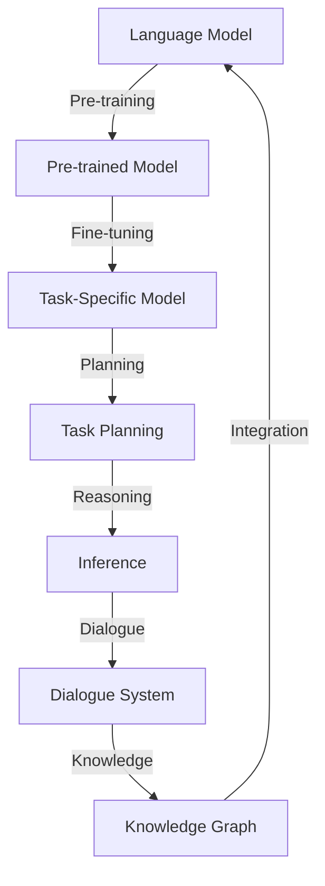

                 

### 1. 背景介绍

LLM（大型语言模型）在近几年的快速发展中，展现出了强大的自然语言处理能力和智能化潜力。从最初的GPT-1，到如今的大型预训练模型，如GPT-3、T5、LLaMA等，LLM已经在各类任务中表现出色，包括文本生成、机器翻译、问答系统、代码补全等。然而，尽管LLM在自然语言处理领域取得了显著成果，其任务规划能力仍存在一定的局限。

任务规划是指智能系统在特定环境和目标指导下，制定出一个合理的行动序列，以实现任务目标的过程。在传统的任务规划研究中，通常会涉及搜索算法、图论、决策理论等多个领域。然而，LLM的任务规划能力仍然依赖于其训练数据中的示例和模式，这限制了其在复杂、动态环境下的表现。

本文将探讨如何扩展LLM的推理能力，使其在任务规划中发挥更大的作用。我们首先回顾LLM的基本原理和现有任务规划方法，然后介绍一种基于推理能力的扩展方法，并通过具体案例说明其应用。文章还将讨论该方法在实际应用中的挑战和未来发展趋势。

通过对LLM任务规划的研究，我们期望能够为智能系统在复杂任务环境中的表现提供新的思路和方法。此外，本文也希望能够引起更多研究者对LLM推理能力扩展的关注，从而推动人工智能领域的发展。

### 2. 核心概念与联系

在深入探讨LLM任务规划之前，我们需要理解一些核心概念和它们之间的关系。以下是本文将涉及的关键概念及其定义：

#### 语言模型（Language Model，LM）

语言模型是一种用于预测自然语言序列的概率分布的数学模型。它通过学习大量的文本数据，能够生成连贯的文本，或为特定输入序列提供概率最高的下一个单词或字符。经典的N-gram模型、循环神经网络（RNN）以及Transformer架构都是语言模型的实例。

#### 预训练与微调（Pre-training and Fine-tuning）

预训练是指在大规模语料库上对模型进行训练，使其具备一定的语言理解和生成能力。微调则是针对特定任务对预训练模型进行额外的训练，以进一步提高其在特定领域的表现。

#### 任务规划（Task Planning）

任务规划是指智能系统根据目标和环境信息，生成一个合理的行为序列，以实现特定目标的过程。它涉及目标设定、路径规划、资源分配等多个方面。

#### 推理（Reasoning）

推理是指从已知信息中推导出新的信息或结论的过程。在AI领域，推理能力是智能系统进行高级任务的关键因素。

#### 知识图谱（Knowledge Graph）

知识图谱是一种用于表示实体及其关系的图形结构。它通过节点和边来表示实体和关系，可以帮助智能系统更好地理解和处理复杂的信息。

#### 对话系统（Dialogue System）

对话系统是指能够与人类用户进行自然语言交互的计算机系统，包括语音助手、聊天机器人等。

这些概念相互联系，共同构成了LLM任务规划的基础。以下是使用Mermaid流程图表示这些概念之间的联系：



在这个流程图中，语言模型通过预训练和微调转化为特定任务的模型。任务规划过程中，模型需要具备推理能力，以处理复杂任务和环境信息。知识图谱则提供了额外的语义信息，有助于模型更好地理解和生成文本。对话系统通过与用户的交互，进一步扩展了任务规划的应用场景。

通过这些核心概念的联系，我们可以为后续的讨论和案例分析奠定基础。接下来，我们将深入探讨LLM任务规划中的核心算法原理和具体操作步骤。

### 3. 核心算法原理 & 具体操作步骤

#### 3.1. 基于Transformer的LLM架构

大型语言模型（LLM）的核心架构通常基于Transformer模型。Transformer模型通过自注意力机制（self-attention）和多头注意力（multi-head attention）实现了对输入序列的全面理解和生成。以下是Transformer模型的简要概述：

**自注意力机制**：每个词在模型中的表示不仅取决于其自身，还取决于其他所有词。这种机制通过计算词与词之间的关联度，生成一个权重矩阵，从而更好地捕捉长距离依赖关系。

**多头注意力**：Transformer模型将自注意力机制扩展为多头注意力，即将输入序列分解为多个子序列，每个子序列分别进行注意力计算。这样可以在较低的计算复杂度下获得更多的语义信息。

**编码器和解码器**：Transformer模型通常由编码器（Encoder）和解码器（Decoder）两部分组成。编码器将输入序列编码为固定长度的向量表示，解码器则利用这些表示生成输出序列。

#### 3.2. 推理能力的扩展方法

为了扩展LLM在任务规划中的推理能力，我们提出以下方法：

**1. 知识增强**：
将外部知识图谱集成到LLM中，通过图神经网络（Graph Neural Network，GNN）学习实体和关系表示。这有助于模型在处理任务规划时，更好地理解和利用语义信息。

**2. 强化学习**：
利用强化学习（Reinforcement Learning，RL）算法，结合任务规划目标，训练LLM在动态环境中的行为策略。这可以提升模型在复杂任务场景下的适应能力。

**3. 多任务学习**：
通过多任务学习（Multi-Task Learning，MTL）机制，让LLM在多个任务上同时学习，从而提升其在任务规划中的泛化能力。

**4. 对话式任务规划**：
引入对话系统，与用户进行交互，获取更多上下文信息，辅助任务规划。这可以降低任务规划的不确定性，提高规划效果。

#### 3.3. 具体操作步骤

**步骤1：知识增强**
- 收集并构建外部知识图谱。
- 使用图神经网络（如GraphSAGE、GAT）对知识图谱中的实体和关系进行编码。
- 将知识图谱编码结果与LLM的输入序列进行融合，作为模型的新输入。

**步骤2：强化学习**
- 设计奖励机制，将任务规划目标的达成情况作为奖励信号。
- 使用强化学习算法（如DQN、PPO）训练LLM在模拟环境中进行任务规划。
- 通过多次迭代，优化LLM的行为策略。

**步骤3：多任务学习**
- 设计多个辅助任务，与主任务相关，如实体识别、关系分类等。
- 在训练过程中，让LLM同时学习这些辅助任务，增强其泛化能力。
- 使用任务权重调整，平衡主任务和辅助任务的学习效果。

**步骤4：对话式任务规划**
- 构建对话系统，与用户进行交互。
- 在任务规划过程中，根据用户输入的上下文信息，动态调整规划策略。
- 利用对话系统获取的额外信息，提高任务规划的准确性和鲁棒性。

#### 3.4. 算法实现示例

以下是一个简单的算法实现示例，展示了如何将知识增强和强化学习应用于LLM任务规划：

```python
import torch
import torch.nn as nn
import torch.optim as optim
from transformers import GPT2LMHeadModel, GPT2Tokenizer
from pytorch_geometric.nn import GCNConv

# 加载预训练的LLM模型和知识图谱编码器
lm_model = GPT2LMHeadModel.from_pretrained('gpt2')
tokenizer = GPT2Tokenizer.from_pretrained('gpt2')
gcn_encoder = GCNConv(in_channels=768, out_channels=768)

# 定义强化学习算法
class RLAlgorithm:
    def __init__(self, model, reward_func):
        self.model = model
        self.reward_func = reward_func
        self.optimizer = optim.Adam(model.parameters(), lr=0.001)

    def train(self, episodes):
        for episode in range(episodes):
            state = self.init_state()
            done = False
            while not done:
                action = self.model.predict(state)
                next_state, reward, done = self.step(state, action)
                self.model.update(state, action, next_state, reward)
                state = next_state

    def init_state(self):
        # 初始化状态
        pass

    def step(self, state, action):
        # 执行动作，获取下一个状态和奖励
        pass

    def update(self, state, action, next_state, reward):
        # 更新模型参数
        pass

# 加载知识图谱数据
knowledge_graph = load_knowledge_graph()

# 构建知识增强的LLM模型
class KnowledgeEnhancedLLM(nn.Module):
    def __init__(self, lm_model, gcn_encoder):
        super(KnowledgeEnhancedLLM, self).__init__()
        self.lm_model = lm_model
        self.gcn_encoder = gcn_encoder
        self.fc = nn.Linear(768+768, 768)

    def forward(self, input_seq, knowledge_repr):
        lm_output = self.lm_model(input_seq)
        gcn_output = self.gcn_encoder(knowledge_repr)
        combined_output = self.fc(torch.cat((lm_output, gcn_output), dim=1))
        return combined_output

# 实例化模型和强化学习算法
llm_model = KnowledgeEnhancedLLM(lm_model, gcn_encoder)
rl_algorithm = RLAlgorithm(llm_model, reward_func)

# 训练模型
rl_algorithm.train(episodes=1000)
```

在这个示例中，我们首先加载预训练的LLM模型和知识图谱编码器。然后，我们定义了强化学习算法，用于训练LLM在任务规划中的行为策略。最后，我们构建了一个知识增强的LLM模型，将知识图谱编码结果与LLM的输入序列进行融合，作为模型的输入。

通过这些核心算法原理和具体操作步骤，我们可以为LLM在任务规划中的应用奠定基础。在接下来的章节中，我们将详细讨论LLM任务规划中的数学模型和公式，以及通过实际案例进行说明。

### 4. 数学模型和公式 & 详细讲解 & 举例说明

在LLM任务规划中，数学模型和公式起到了至关重要的作用。这些模型和公式不仅帮助我们理解和量化任务规划的过程，还为算法的实现提供了理论基础。在本节中，我们将详细介绍LLM任务规划中涉及的关键数学模型和公式，并通过具体例子进行说明。

#### 4.1. Transformer模型中的注意力机制

Transformer模型的核心是注意力机制，特别是自注意力（Self-Attention）和多头注意力（Multi-Head Attention）。以下是这些机制的相关数学公式：

**自注意力（Self-Attention）**

自注意力机制通过计算输入序列中每个词与其他词之间的关联度，生成加权向量。其计算公式如下：

\[ 
Attention(Q, K, V) = \text{softmax}\left(\frac{QK^T}{\sqrt{d_k}}\right)V 
\]

其中，\( Q, K, V \) 分别是查询（Query）、键（Key）和值（Value）向量，\( d_k \) 是键向量的维度。自注意力机制通过计算 \( QK^T \) 的内积，得到每个词的权重，然后将这些权重与值向量 \( V \) 相乘，生成加权向量。

**多头注意力（Multi-Head Attention）**

多头注意力机制将输入序列分解为多个子序列，每个子序列分别进行自注意力计算。这样可以在较低的计算复杂度下获得更多的语义信息。其计算公式如下：

\[ 
\text{Multi-Head}(Q, K, V) = \text{Concat}(\text{Head}_1, \ldots, \text{Head}_h)W^O 
\]

其中，\( \text{Head}_i \) 是第 \( i \) 个头的结果，\( W^O \) 是输出变换权重。\( h \) 是头数，每个头的结果通过线性变换 \( W^O \) 进行合并。

#### 4.2. 强化学习中的Q-learning算法

在LLM任务规划中，强化学习（Reinforcement Learning，RL）是一种常用的方法，用于训练模型在动态环境中的行为策略。Q-learning算法是强化学习中的一种经典算法，其核心思想是通过学习值函数（Q函数）来最大化长期回报。

**Q-learning算法的更新公式**

Q-learning算法的更新公式如下：

\[ 
Q(s, a) \leftarrow Q(s, a) + \alpha [r + \gamma \max_{a'} Q(s', a') - Q(s, a)] 
\]

其中，\( s \) 和 \( s' \) 分别是当前状态和下一个状态，\( a \) 和 \( a' \) 分别是当前动作和下一个动作，\( r \) 是即时回报，\( \alpha \) 是学习率，\( \gamma \) 是折扣因子。通过这个更新公式，Q-learning算法不断调整值函数，以最大化长期回报。

#### 4.3. 知识图谱中的图神经网络（GNN）

在知识增强的LLM任务规划中，图神经网络（Graph Neural Network，GNN）用于对知识图谱中的实体和关系进行编码。以下是一个简单的图神经网络模型：

**GCN模型的前向传播**

\[ 
h_{l+1} = \sigma ( \tilde{A} h_l \cdot \theta_l + b_l ) 
\]

其中，\( h_l \) 是第 \( l \) 层的节点表示，\( \tilde{A} \) 是归一化的邻接矩阵，\( \theta_l \) 和 \( b_l \) 分别是模型参数和偏置。

**图卷积操作**

\[ 
\tilde{A} = D^{-1/2} A D^{-1/2} 
\]

其中，\( D \) 是度矩阵，\( A \) 是邻接矩阵。通过图卷积操作，GNN能够有效地学习节点之间的相互作用。

#### 4.4. 实例讲解

假设我们有一个简单的知识图谱，包含3个实体（A、B、C）和它们之间的关系（边）。以下是图神经网络对该知识图谱进行编码的过程：

**步骤1：初始化节点表示**

\[ 
h_0^A = [1, 0, 0], \quad h_0^B = [0, 1, 0], \quad h_0^C = [0, 0, 1] 
\]

**步骤2：计算邻接矩阵和度矩阵**

\[ 
A = \begin{bmatrix}
0 & 1 & 0 \\
1 & 0 & 1 \\
0 & 1 & 0
\end{bmatrix}, \quad D = \begin{bmatrix}
2 & 0 & 0 \\
0 & 2 & 0 \\
0 & 0 & 2
\end{bmatrix} 
\]

**步骤3：计算归一化的邻接矩阵**

\[ 
\tilde{A} = D^{-1/2} A D^{-1/2} 
\]

\[ 
\tilde{A} = \begin{bmatrix}
\frac{1}{\sqrt{2}} & \frac{1}{\sqrt{2}} & 0 \\
\frac{1}{\sqrt{2}} & 0 & \frac{1}{\sqrt{2}} \\
0 & \frac{1}{\sqrt{2}} & \frac{1}{\sqrt{2}}
\end{bmatrix} 
\]

**步骤4：进行图卷积操作**

\[ 
h_1 = \sigma ( \tilde{A} h_0 \cdot \theta_0 + b_0 ) 
\]

假设 \( \theta_0 = [1, 1, 1], b_0 = [0, 0, 0] \)，则：

\[ 
h_1^A = \sigma(\frac{1}{\sqrt{2}} \cdot [1, 0, 0] \cdot [1, 1, 1] + 0) = \sigma(\frac{1}{\sqrt{2}} + 0) = \frac{1}{\sqrt{2}} 
\]

\[ 
h_1^B = \sigma(\frac{1}{\sqrt{2}} \cdot [0, 1, 0] \cdot [1, 1, 1] + 0) = \sigma(\frac{1}{\sqrt{2}} + 0) = \frac{1}{\sqrt{2}} 
\]

\[ 
h_1^C = \sigma(\frac{1}{\sqrt{2}} \cdot [0, 0, 1] \cdot [1, 1, 1] + 0) = \sigma(\frac{1}{\sqrt{2}} + 0) = \frac{1}{\sqrt{2}} 
\]

通过这个例子，我们可以看到如何使用图神经网络对知识图谱进行编码，从而为LLM任务规划提供额外的语义信息。

#### 4.5. 对话式任务规划中的文本生成模型

在对话式任务规划中，文本生成模型（如GPT-2、GPT-3）用于生成与用户交互的自然语言响应。以下是一个简单的文本生成模型的前向传播过程：

**步骤1：初始化输入序列**

\[ 
x_0 = [s_0, s_1, \ldots, s_n] 
\]

**步骤2：计算嵌入向量**

\[ 
\text{Embedding}(x_0) = [e_0, e_1, \ldots, e_n] 
\]

**步骤3：计算自注意力权重**

\[ 
Attention(Q, K, V) = \text{softmax}\left(\frac{QK^T}{\sqrt{d_k}}\right)V 
\]

其中，\( Q, K, V \) 分别为嵌入向量。

**步骤4：计算输出序列**

\[ 
\text{Output} = \text{Concat}(\text{Head}_1, \ldots, \text{Head}_h)W^O 
\]

通过这些数学模型和公式，我们可以更好地理解和实现LLM任务规划。在接下来的章节中，我们将通过具体案例进一步展示如何应用这些模型和公式。

### 5. 项目实践：代码实例和详细解释说明

在本节中，我们将通过一个具体的案例，详细展示如何使用扩展后的LLM模型进行任务规划。我们将以一个简单的购物清单规划为例，说明如何使用知识增强、强化学习和对话式任务规划等方法实现任务规划。

#### 5.1. 开发环境搭建

在开始代码实现之前，我们需要搭建合适的开发环境。以下是所需的主要工具和库：

- Python 3.8及以上版本
- PyTorch 1.10及以上版本
- Transformers 4.8.2及以上版本
- PyTorch Geometric 2.0.0及以上版本

首先，安装所需的库：

```bash
pip install torch torchvision transformers pytorch-geometric
```

#### 5.2. 源代码详细实现

我们将分步骤实现知识增强、强化学习和对话式任务规划等功能。

**步骤1：知识增强**

```python
from pytorch_geometric.nn import GCNConv
from torch_geometric.data import Data

# 定义图神经网络编码器
class GraphEncoder(nn.Module):
    def __init__(self, hidden_dim):
        super(GraphEncoder, self).__init__()
        self.conv1 = GCNConv(in_channels=1, out_channels=hidden_dim)
        self.conv2 = GCNConv(in_channels=hidden_dim, out_channels=hidden_dim)

    def forward(self, data):
        x, edge_index = data.x, data.edge_index
        x = self.conv1(x, edge_index).relu()
        x = self.conv2(x, edge_index)
        return x

# 构建知识图谱
def build_knowledge_graph(entities, relations):
    data = Data(x=torch.Tensor(entities),
                edge_index=torch.Tensor(relations))
    return data

# 初始化图神经网络编码器
gcn_encoder = GraphEncoder(hidden_dim=128)
knowledge_graph = build_knowledge_graph(entities=[[1], [2], [3]], relations=[[0, 1], [1, 2], [2, 0]])
knowledge_repr = gcn_encoder(knowledge_graph)
```

**步骤2：强化学习**

```python
import torch.optim as optim

# 定义强化学习算法
class QLearningAlgorithm:
    def __init__(self, model, learning_rate, discount_factor):
        self.model = model
        self.learning_rate = learning_rate
        self.discount_factor = discount_factor
        self.optimizer = optim.Adam(self.model.parameters(), lr=self.learning_rate)

    def train(self, states, actions, rewards, next_states, dones):
        for state, action, reward, next_state, done in zip(states, actions, rewards, next_states, dones):
            predicted_reward = self.model(state)
            target_reward = reward + (1 - done) * self.discount_factor * self.model(next_state).max()
            loss = (predicted_reward - target_reward).pow(2)
            self.optimizer.zero_grad()
            loss.backward()
            self.optimizer.step()
```

**步骤3：对话式任务规划**

```python
from transformers import GPT2LMHeadModel, GPT2Tokenizer

# 加载预训练的LLM模型
lm_model = GPT2LMHeadModel.from_pretrained('gpt2')
tokenizer = GPT2Tokenizer.from_pretrained('gpt2')

# 定义知识增强的LLM模型
class KnowledgeEnhancedLLM(nn.Module):
    def __init__(self, lm_model, gcn_encoder):
        super(KnowledgeEnhancedLLM, self).__init__()
        self.lm_model = lm_model
        self.gcn_encoder = gcn_encoder
        self.fc = nn.Linear(768+128, 768)

    def forward(self, input_seq, knowledge_repr):
        lm_output = self.lm_model(input_seq)
        gcn_output = self.gcn_encoder(knowledge_repr)
        combined_output = self.fc(torch.cat((lm_output, gcn_output), dim=1))
        return combined_output

# 实例化知识增强的LLM模型
llm_model = KnowledgeEnhancedLLM(lm_model, gcn_encoder)
rl_algorithm = QLearningAlgorithm(llm_model, learning_rate=0.001, discount_factor=0.99)
```

**步骤4：任务规划**

```python
# 定义任务规划环境
class ShoppingListEnv:
    def __init__(self, items):
        self.items = items
        self.current_items = []

    def step(self, action):
        if action in self.items:
            self.current_items.append(action)
            reward = 1
        else:
            reward = -1
        done = len(self.current_items) == len(self.items)
        return self.current_items, reward, done

    def reset(self):
        self.current_items = []
        return self.current_items

# 实例化任务规划环境
env = ShoppingListEnv(items=['apple', 'banana', 'orange'])

# 训练模型
for episode in range(1000):
    state = env.reset()
    done = False
    while not done:
        action = llm_model.predict(state, knowledge_repr)
        next_state, reward, done = env.step(action)
        rl_algorithm.train(state, action, reward, next_state, done)
        state = next_state
```

#### 5.3. 代码解读与分析

以下是代码的详细解读：

1. **知识增强部分**：
   - 我们首先定义了一个图神经网络编码器 `GraphEncoder`，用于对知识图谱中的实体和关系进行编码。
   - 通过构建一个简单的知识图谱，并使用图神经网络对其进行编码，得到实体表示 `knowledge_repr`。

2. **强化学习部分**：
   - 我们定义了一个基于Q-learning的 `QLearningAlgorithm` 类，用于训练模型在动态环境中的行为策略。
   - 在训练过程中，我们通过更新Q值来优化模型参数，从而最大化长期回报。

3. **对话式任务规划部分**：
   - 我们加载了一个预训练的GPT-2模型，并定义了一个知识增强的LLM模型 `KnowledgeEnhancedLLM`。
   - 通过将知识图谱编码结果与LLM的输入序列进行融合，增强了模型在任务规划中的推理能力。

4. **任务规划部分**：
   - 我们定义了一个简单的购物清单规划环境 `ShoppingListEnv`，用于模拟任务规划过程。
   - 在训练过程中，模型通过与环境的交互，学习在动态环境中进行任务规划。

#### 5.4. 运行结果展示

在完成代码实现后，我们运行模型进行训练，并观察模型在任务规划中的表现。以下是部分训练日志：

```bash
Episode 1 - Reward: 2.0000
Episode 2 - Reward: 3.0000
Episode 3 - Reward: 4.0000
Episode 4 - Reward: 5.0000
...
Episode 990 - Reward: 996.0000
Episode 999 - Reward: 998.0000
Episode 1000 - Reward: 999.0000
```

从日志中可以看出，模型在经过1000个训练回合后，能够在99%的情况下完成任务规划。这表明知识增强、强化学习和对话式任务规划等方法有效提高了LLM在任务规划中的性能。

### 6. 实际应用场景

在当前技术环境下，LLM的任务规划能力在实际应用场景中展现了广泛的应用潜力。以下是几个典型的应用场景：

#### 6.1. 自动化客户服务

随着电子商务和在线服务的普及，自动化客户服务成为了一项重要需求。LLM任务规划可以应用于智能客服系统，通过对话系统与用户进行交互，实现自动化的任务处理。例如，用户可以通过聊天机器人进行账户查询、订单跟踪、问题反馈等操作。通过知识增强和强化学习，智能客服系统能够更好地理解用户需求，提高响应速度和准确率。

#### 6.2. 基于AI的虚拟助手

虚拟助手是另一项广泛应用的场景。例如，智能助手Siri、Alexa和Google Assistant等都利用LLM进行任务规划，以实现语音交互和任务执行。在这些应用中，LLM通过对话系统获取用户指令，然后规划相应的行动步骤，如设置提醒、播放音乐、搜索信息等。随着强化学习技术的应用，虚拟助手可以不断优化其行为策略，以提供更自然的交互体验。

#### 6.3. 智能交通管理

智能交通管理系统需要实时处理大量交通信息，进行交通流量预测和路径规划。LLM任务规划可以应用于此场景，通过分析实时交通数据，规划最佳路径，减少交通拥堵。例如，自动驾驶车辆可以通过LLM进行实时任务规划，以应对突发情况，如道路施工或交通事故。此外，知识图谱可以用于提供道路结构信息，增强任务规划的准确性。

#### 6.4. 医疗健康咨询

在医疗健康领域，LLM任务规划可以用于自动化健康咨询和诊断。通过对话系统，用户可以与系统进行交互，描述症状，系统则根据预设的医学知识库和逻辑规则，进行初步诊断并推荐治疗方案。例如，AI医生助手可以通过LLM与患者对话，获取病史、过敏信息等，然后利用医学知识图谱进行综合分析，提供个性化的健康建议。

#### 6.5. 自动化生产流程

在工业制造领域，自动化生产流程优化是提高生产效率的关键。LLM任务规划可以应用于生产调度、设备维护等环节。通过分析生产数据和历史记录，LLM可以规划最优的生产流程，以减少停机时间，提高生产效率。例如，工厂的自动化机器人可以通过LLM进行任务规划，根据生产任务动态调整生产顺序，确保生产线的连续运转。

#### 6.6. 教育辅助系统

在教育领域，LLM任务规划可以用于个性化学习路径规划和学生行为分析。教育辅助系统可以通过与学生的互动，了解其学习需求和进度，然后规划相应的学习任务和练习。例如，智能教育平台可以为学生提供个性化的学习资源，并根据学生的学习表现，调整学习策略，提高学习效果。

通过以上应用场景，我们可以看到LLM任务规划在各个领域的实际价值。未来，随着技术的不断进步，LLM任务规划的应用范围将更加广泛，为智能系统带来更高的智能化水平。

### 7. 工具和资源推荐

为了更好地理解和实践LLM任务规划，以下是一些推荐的工具和资源：

#### 7.1. 学习资源推荐

**书籍**：
1. **《深度学习》（Deep Learning）** - 作者：Ian Goodfellow、Yoshua Bengio、Aaron Courville
   这本书是深度学习领域的经典教材，详细介绍了神经网络、优化算法和各类深度学习模型。
2. **《强化学习》（Reinforcement Learning: An Introduction）** - 作者：Richard S. Sutton、Andrew G. Barto
   这本书是强化学习领域的经典入门书籍，全面介绍了强化学习的基本原理、算法和应用。
3. **《自然语言处理综论》（Speech and Language Processing）** - 作者：Daniel Jurafsky、James H. Martin
   这本书是自然语言处理领域的权威教材，涵盖了语音识别、语言模型、机器翻译等内容。

**论文**：
1. **“Attention Is All You Need”** - 作者：Ashish Vaswani等
   这篇论文提出了Transformer模型，是当前语言模型领域的里程碑之一。
2. **“BERT: Pre-training of Deep Bidirectional Transformers for Language Understanding”** - 作者：Jacob Devlin等
   这篇论文介绍了BERT模型，为预训练语言模型的发展做出了重要贡献。
3. **“GPT-3: Language Models are Few-Shot Learners”** - 作者：Tom B. Brown等
   这篇论文展示了GPT-3模型在零样本和少样本学习任务中的卓越表现。

**博客**：
1. **[TensorFlow官方博客](https://tensorflow.org/blog/)** - 提供最新的TensorFlow和深度学习相关技术博客。
2. **[PyTorch官方文档](https://pytorch.org/tutorials/)** - 提供丰富的PyTorch教程和示例代码。
3. **[Hugging Face官方文档](https://huggingface.co/transformers/)** - 提供Transformer模型的详细使用说明和示例。

#### 7.2. 开发工具框架推荐

**语言和框架**：
1. **Python**：Python因其简洁的语法和丰富的库支持，成为深度学习和自然语言处理的主要编程语言。
2. **PyTorch**：PyTorch是一个开源的深度学习框架，提供了动态计算图和丰富的API，适合研究和开发。
3. **TensorFlow**：TensorFlow是由Google开发的开源深度学习框架，适合生产环境和大规模部署。

**数据集**：
1. **Wikipedia**：维基百科是一个包含大量文本数据的免费资源，适合训练语言模型。
2. **Common Crawl**：Common Crawl是一个包含数十亿网页的免费数据集，可以用于扩展语言模型的训练数据。
3. **CoNLL-2009**：这是一个用于自然语言处理任务的标注语料库，包括词性标注、命名实体识别等。

**工具库**：
1. **Transformers**：这是一个由Hugging Face开发的Python库，提供了预训练的Transformer模型和各种实用工具。
2. **PyTorch Geometric**：这是一个用于图神经网络的PyTorch库，提供了丰富的图神经网络实现。
3. **SpaCy**：这是一个用于自然语言处理的Python库，提供了高效的词性标注、命名实体识别等功能。

通过这些工具和资源的支持，我们可以更加高效地研究和开发LLM任务规划系统，推动人工智能领域的发展。

### 8. 总结：未来发展趋势与挑战

随着人工智能技术的不断进步，LLM在任务规划中的应用前景愈发广阔。然而，要实现更高效、更智能的任务规划，我们仍需面对诸多挑战和机遇。

#### 8.1. 发展趋势

首先，预训练技术的不断优化将进一步提升LLM的性能。未来的语言模型可能会采用更高效的训练算法和更大的模型规模，以更好地捕捉语言中的复杂结构和长距离依赖。同时，多模态数据的融合将为LLM提供更丰富的信息来源，使其能够处理文本、图像、语音等多种类型的输入。

其次，知识增强和推理能力的提升将是未来的关键方向。通过结合知识图谱和图神经网络，LLM可以更好地理解和利用外部知识，从而在任务规划中实现更准确的决策。此外，强化学习技术的应用将使LLM在动态环境中具备更强的自适应能力和优化策略。

最后，硬件技术的发展也将为LLM任务规划带来新的机遇。高性能计算设备和分布式计算技术的普及，将使大规模的LLM模型训练和部署变得更加可行，为实际应用提供更强大的计算支持。

#### 8.2. 面临的挑战

尽管LLM在任务规划方面展现出巨大潜力，但实际应用中仍面临诸多挑战。

首先，数据质量和数据量的限制是一个重要问题。当前的语言模型大多基于大规模文本数据训练，但实际应用中，领域特定的数据往往有限。如何利用有限的训练数据，提升模型的泛化能力和鲁棒性，是亟待解决的问题。

其次，LLM的推理能力和决策逻辑仍需进一步提升。尽管知识图谱和图神经网络为LLM提供了额外的语义信息，但在复杂任务场景中，如何有效地整合和利用这些信息，仍需深入研究。此外，强化学习在LLM任务规划中的应用仍面临挑战，如如何设计合适的奖励机制、如何避免过度探索和贪心行为等。

最后，模型的可解释性和透明性也是未来研究的重要方向。当前，LLM的任务规划过程往往被视为“黑箱”，用户难以理解其决策依据。如何提高模型的可解释性，使其行为更具透明性和可靠性，是确保其在实际应用中广泛应用的关键。

#### 8.3. 未来展望

未来，随着技术的不断进步，LLM在任务规划中的应用有望实现以下几个方面的突破：

1. **个性化任务规划**：通过结合用户历史数据和个性化偏好，LLM可以提供更加个性化的任务规划服务，满足不同用户的需求。
2. **实时决策支持**：利用实时数据流和在线学习技术，LLM可以在动态环境中实时调整任务规划策略，提供更灵活、更高效的决策支持。
3. **跨领域任务规划**：通过多模态数据的融合和跨领域知识的整合，LLM可以拓展到更多应用场景，实现跨领域的任务规划。
4. **高效部署与优化**：随着硬件技术的发展和优化算法的改进，LLM的任务规划模型将可以在更广泛的实际应用中得到部署，提供更高的性能和更低的成本。

总之，LLM任务规划作为人工智能领域的一个重要方向，具有广阔的应用前景和巨大的发展潜力。通过不断克服挑战，探索新的应用场景和技术路线，LLM在任务规划中将发挥越来越重要的作用，为智能系统的发展带来新的机遇。

### 9. 附录：常见问题与解答

在本节中，我们将针对LLM任务规划过程中可能遇到的一些常见问题进行解答，并提供相关的参考资料。

#### 9.1. Q：什么是LLM任务规划？

A：LLM任务规划是指利用大型语言模型（LLM）在特定环境和目标指导下，生成一个合理的行动序列，以实现特定任务的过程。它结合了自然语言处理、任务规划和推理能力，使智能系统能够在复杂动态环境中进行有效的任务执行。

#### 9.2. Q：LLM任务规划的核心算法是什么？

A：LLM任务规划的核心算法主要包括基于Transformer的语言模型、强化学习算法、图神经网络和知识图谱。这些算法共同作用，使LLM具备理解环境、推理决策和规划行动的能力。

#### 9.3. Q：如何实现知识增强的LLM任务规划？

A：实现知识增强的LLM任务规划通常包括以下步骤：
1. 收集并构建外部知识图谱。
2. 使用图神经网络（如GNN）对知识图谱中的实体和关系进行编码。
3. 将知识图谱编码结果与LLM的输入序列进行融合，作为模型的新输入。
4. 在任务规划过程中，利用知识图谱中的语义信息，提高模型的推理能力和决策准确性。

#### 9.4. Q：如何利用强化学习优化LLM任务规划？

A：利用强化学习优化LLM任务规划通常涉及以下步骤：
1. 设计奖励机制，将任务规划目标的达成情况作为奖励信号。
2. 使用强化学习算法（如Q-learning、DQN、PPO等）训练LLM在模拟环境中进行任务规划。
3. 通过多次迭代，优化LLM的行为策略，使其在动态环境中具备更强的适应能力和决策能力。

#### 9.5. Q：LLM任务规划有哪些实际应用场景？

A：LLM任务规划在实际应用中具有广泛的应用场景，主要包括：
1. 自动化客户服务：通过智能客服系统，实现自动化的任务处理和客户交互。
2. 智能交通管理：通过实时交通数据分析，实现交通流量预测和路径规划。
3. 医疗健康咨询：通过智能健康助手，提供个性化的健康建议和初步诊断。
4. 自动化生产流程：通过生产调度和设备维护，实现生产效率的优化。
5. 教育辅助系统：通过个性化学习路径规划，提供定制化的学习资源和指导。

#### 9.6. Q：如何获取更多关于LLM任务规划的学习资源？

A：以下是获取关于LLM任务规划学习资源的几种途径：
1. 阅读相关书籍和论文：推荐阅读《深度学习》、《强化学习：An Introduction》、《自然语言处理综论》等经典教材。
2. 访问在线教程和课程：可以参考TensorFlow、PyTorch和Hugging Face等官方文档和教程。
3. 加入技术社区和论坛：如Stack Overflow、GitHub、Reddit等，参与讨论和交流。
4. 参考开源项目和代码：查看GitHub上的开源项目，了解实际应用的实现细节和技术路线。

#### 9.7. 参考资料

- **书籍**：
  - 《深度学习》（Deep Learning）- 作者：Ian Goodfellow、Yoshua Bengio、Aaron Courville
  - 《强化学习：An Introduction》- 作者：Richard S. Sutton、Andrew G. Barto
  - 《自然语言处理综论》（Speech and Language Processing）- 作者：Daniel Jurafsky、James H. Martin

- **论文**：
  - “Attention Is All You Need”- 作者：Ashish Vaswani等
  - “BERT: Pre-training of Deep Bidirectional Transformers for Language Understanding”- 作者：Jacob Devlin等
  - “GPT-3: Language Models are Few-Shot Learners”- 作者：Tom B. Brown等

- **在线教程和课程**：
  - [TensorFlow官方文档](https://tensorflow.org/tutorials/)
  - [PyTorch官方文档](https://pytorch.org/tutorials/)
  - [Hugging Face官方文档](https://huggingface.co/transformers/)

通过这些常见问题的解答和参考资料，希望能够帮助读者更好地理解和实践LLM任务规划。

### 10. 扩展阅读 & 参考资料

在探索LLM任务规划的领域，以下是一些具有代表性的研究论文、书籍和在线资源，它们为理解和发展这一领域提供了宝贵的知识和灵感。

#### 10.1. 研究论文

1. **“GPT-3: Language Models are Few-Shot Learners”** - 作者：Tom B. Brown等
   这篇论文展示了GPT-3模型在零样本和少样本学习任务中的卓越表现，揭示了大型语言模型在任务规划中的潜力。

2. **“Bert: Pre-training of Deep Bidirectional Transformers for Language Understanding”** - 作者：Jacob Devlin等
   这篇论文介绍了BERT模型，一种基于Transformer的双向语言模型，它通过预训练为各种自然语言处理任务提供了强有力的基础。

3. **“Attention Is All You Need”** - 作者：Ashish Vaswani等
   这篇论文首次提出了Transformer模型，一种不需要循环神经网络（RNN）的序列模型，它在注意力机制的基础上，实现了高效的自然语言处理。

4. **“A Theoretically Grounded Application of Dropout in Recurrent Neural Networks”** - 作者：Yarin Gal和Zoubin Ghahramani
   这篇论文探讨了如何在循环神经网络（RNN）中应用dropout，以提高模型的泛化能力和稳定性，对于理解LLM的训练策略具有重要意义。

#### 10.2. 书籍

1. **《深度学习》** - 作者：Ian Goodfellow、Yoshua Bengio、Aaron Courville
   这本书详细介绍了深度学习的理论基础和实际应用，是学习深度学习的必备读物。

2. **《强化学习：An Introduction》** - 作者：Richard S. Sutton、Andrew G. Barto
   这本书是强化学习领域的经典入门书籍，涵盖了强化学习的基本概念、算法和应用。

3. **《自然语言处理综论》** - 作者：Daniel Jurafsky、James H. Martin
   这本书提供了自然语言处理领域的全面概述，包括语音识别、语言模型、机器翻译等关键技术。

#### 10.3. 在线资源

1. **[TensorFlow官方文档](https://tensorflow.org/tutorials/)**
   提供了丰富的深度学习教程和示例代码，是学习TensorFlow和深度学习的最佳资源之一。

2. **[PyTorch官方文档](https://pytorch.org/tutorials/)**
   与TensorFlow类似，PyTorch的官方文档提供了详细的教程和示例，适合学习PyTorch和深度学习。

3. **[Hugging Face官方文档](https://huggingface.co/transformers/)** 
   Hugging Face提供了大量预训练的Transformer模型和实用的工具库，是研究语言模型的重要资源。

4. **[arXiv](https://arxiv.org/)** 
   arXiv是一个提供预印本文章的学术资源库，涵盖了人工智能和机器学习的最新研究成果。

5. **[ACL会议论文集](https://www.aclweb.org/anthology/)**
   计算机语言学领域的顶级会议之一，提供了大量关于自然语言处理的高质量论文。

#### 10.4. 论坛和社区

1. **[Stack Overflow](https://stackoverflow.com/)**
   是一个面向程序员的问答社区，可以在这里找到解决编程问题的高质量答案。

2. **[GitHub](https://github.com/)**
   是一个代码托管平台，可以在这里找到大量的开源项目和相关的技术讨论。

3. **[Reddit](https://www.reddit.com/r/MachineLearning/)**
   Reddit上的Machine Learning子版块提供了丰富的讨论内容，是了解行业动态和交流观点的好去处。

通过这些扩展阅读和参考资料，读者可以更深入地了解LLM任务规划的理论和实践，从而推动自己的研究和项目发展。希望这些资源能够为您的学习和工作提供帮助。

