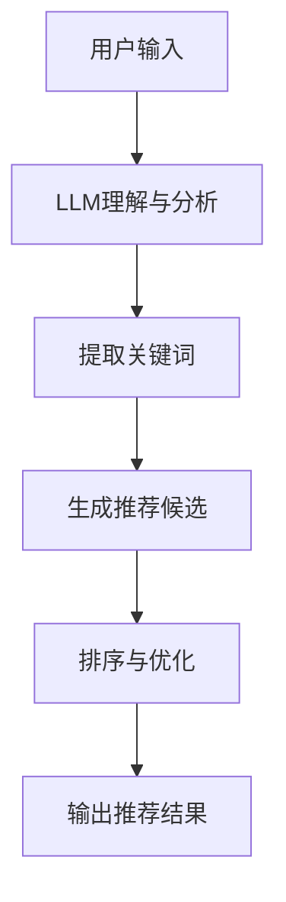
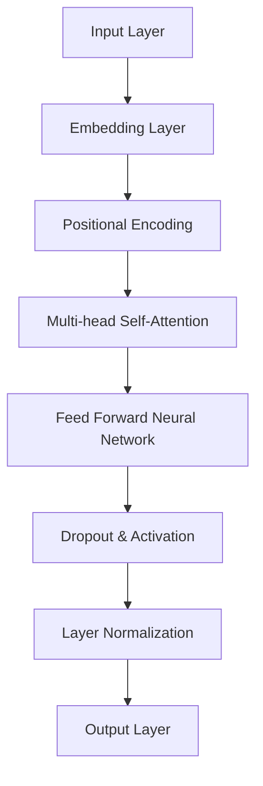

                 

### 背景介绍 Background Introduction

近年来，随着人工智能技术的快速发展，尤其是深度学习、自然语言处理（NLP）和生成对抗网络（GAN）等领域的突破，我们看到了越来越多的应用程序利用这些技术来改进用户体验、优化业务流程和提高效率。然而，这些技术往往需要大量的计算资源和时间来训练模型和生成结果，而传统的方法在处理复杂决策和推荐问题时往往表现出一定的局限性。

在这样的背景下，近年来基于语言模型（Language Model，简称LLM）的推荐系统逐渐引起了研究者和工业界的关注。LLM具有强大的文本理解和生成能力，能够处理大量的非结构化数据，并从这些数据中提取出有用的信息。这使得LLM在推荐系统中具有天然的优势，能够实现更加智能化和个性化的推荐。

本文将探讨如何将LLM作为推荐流程的控制器，实现智能化决策。我们将首先介绍LLM的基础知识和核心算法，然后分析LLM在推荐系统中的具体应用，最后通过一个实际项目实例展示如何实现这一目标。

### 核心概念与联系 Core Concepts and Connections

#### 1. 语言模型（Language Model，LLM）

语言模型是一种基于统计或神经网络的模型，用于预测给定文本序列的概率分布。在深度学习框架下，LLM通常采用递归神经网络（RNN）、长短期记忆网络（LSTM）或Transformer等架构进行训练。这些模型通过学习大量文本数据，能够捕捉到语言中的复杂模式和规律，从而实现对未知文本的生成和预测。

#### 2. 推荐系统（Recommendation System）

推荐系统是一种利用数据分析、信息过滤和机器学习等技术在大量数据中找出相关性并推荐给用户的方法。传统推荐系统通常基于协同过滤（Collaborative Filtering）、内容推荐（Content-Based Filtering）或混合推荐（Hybrid Recommendation）等方法。

#### 3. LLM在推荐系统中的应用

LLM在推荐系统中的应用主要体现在以下几个方面：

- **文本理解与生成**：LLM能够对用户的历史行为、搜索记录和兴趣偏好进行分析，从中提取出关键信息，并生成个性化的推荐结果。

- **上下文感知推荐**：通过捕捉用户的当前上下文信息，如搜索关键词、浏览历史等，LLM能够提供更加精准和及时的推荐。

- **多样化推荐**：LLM可以通过生成多样化的文本描述，为用户提供多种可能的推荐选项，从而提高用户的满意度和参与度。

为了更好地理解LLM在推荐系统中的应用，我们使用Mermaid流程图展示LLM作为推荐流程控制器的基本架构。



在这个流程中，LLM首先接收用户的输入，通过对输入文本的理解和分析，提取出关键词，然后根据关键词生成推荐候选，最后通过排序和优化算法确定最终的推荐结果。

### 核心算法原理 & 具体操作步骤 Core Algorithm Principles & Step-by-Step Operations

为了深入理解LLM在推荐系统中的工作原理，我们首先需要了解LLM的基本架构和训练过程。

#### 1. LLM的基本架构

LLM通常采用基于Transformer的架构，如BERT、GPT等。以下是一个简化的Transformer模型架构图：



在这个架构中，输入层（A）将文本数据转换为嵌入向量（B），然后通过位置编码（C）为每个词添加位置信息。多头自注意力层（D）计算输入向量之间的相关性，从而提取出重要的信息。前馈神经网络（E）进一步处理这些信息，并通过Dropout和激活函数（F）防止过拟合。最后，通过层归一化（G）和输出层（H）得到最终的输出结果。

#### 2. LLM的训练过程

LLM的训练过程主要包括两个阶段：预训练和微调。

- **预训练**：在预训练阶段，LLM在大规模文本数据集上学习语言的一般规律和模式。这个过程通常使用自监督学习（Self-Supervised Learning）技术，如掩码语言模型（Masked Language Model，简称MLM）或预测下一个单词（Next Sentence Prediction，简称NSP）。

  - **掩码语言模型（MLM）**：在预训练过程中，LLM随机掩码输入文本中的部分词，然后尝试预测这些掩码词。这一过程帮助LLM学习语言中的上下文关系和语法规则。
  - **预测下一个单词（NSP）**：在NSP任务中，LLM被要求预测输入文本序列的下一个句子。这一任务有助于LLM学习长文本中的连贯性和语义关系。

- **微调**：在预训练后，LLM通过微调（Fine-tuning）将预训练模型适应特定任务，如文本分类、命名实体识别或推荐系统。

  - **微调过程**：在微调过程中，LLM被加载到特定任务的数据集上，并通过反向传播算法进行优化。这一过程通常使用有监督学习（Supervised Learning）技术，如交叉熵损失函数（Cross-Entropy Loss）。

#### 3. LLM在推荐系统中的具体操作步骤

在了解了LLM的基本架构和训练过程后，我们可以进一步探讨LLM在推荐系统中的具体应用步骤：

- **数据收集与预处理**：首先，收集用户的历史行为数据、搜索记录和兴趣偏好。然后，对这些数据进行清洗、去噪和转换，以便于LLM处理。

- **嵌入生成**：使用LLM的嵌入层将文本数据转换为嵌入向量。这些嵌入向量将用于后续的推荐生成和排序。

- **文本理解与分析**：利用LLM的多头自注意力机制对嵌入向量进行处理，从中提取出关键信息，如关键词、主题和情感。

- **推荐生成**：根据提取的关键信息，使用LLM生成推荐候选。这一过程可以通过生成文本、提取摘要或生成关键词等方式实现。

- **排序与优化**：对生成的推荐候选进行排序和优化，以确保推荐结果的多样性和个性化。

- **输出推荐结果**：将最终的推荐结果输出给用户，并通过反馈机制不断优化推荐算法。

通过上述步骤，LLM能够实现高效的推荐系统，从而提高用户的满意度和参与度。

### 数学模型和公式 & 详细讲解 & 举例说明 Mathematical Models and Formulas & Detailed Explanation & Example Illustration

#### 1. 嵌入层模型

在LLM中，嵌入层（Embedding Layer）用于将输入文本转换为向量表示。具体来说，嵌入层可以通过词嵌入（Word Embedding）或字符嵌入（Character Embedding）实现。

- **词嵌入（Word Embedding）**：词嵌入是一种将单词映射到高维向量空间的方法。在这种方法中，每个单词被映射为一个固定大小的向量。词嵌入可以通过以下公式表示：

  \[ \text{vec}(w) = \text{Embedding}(w) \]

  其中，\( \text{vec}(w) \) 表示单词 \( w \) 的向量表示，\( \text{Embedding}(w) \) 表示嵌入函数。

- **字符嵌入（Character Embedding）**：字符嵌入是将字符映射到向量空间的方法。这种方法可以帮助模型捕捉到单词中的更细微的语言特征。字符嵌入可以通过以下公式表示：

  \[ \text{vec}(c) = \text{CharacterEmbedding}(c) \]

  其中，\( \text{vec}(c) \) 表示字符 \( c \) 的向量表示，\( \text{CharacterEmbedding}(c) \) 表示字符嵌入函数。

#### 2. 位置编码

在Transformer模型中，位置编码（Positional Encoding）用于为序列中的每个词添加位置信息。位置编码可以通过以下公式表示：

\[ \text{pos_enc}(p) = \text{PositionalEncoding}(p) \]

其中，\( \text{pos_enc}(p) \) 表示位置 \( p \) 的编码，\( \text{PositionalEncoding}(p) \) 表示位置编码函数。

#### 3. 多头自注意力

多头自注意力（Multi-head Self-Attention）是Transformer模型的核心组件，用于计算输入向量之间的相关性。多头自注意力可以通过以下公式表示：

\[ \text{output} = \text{Attention}(Q, K, V) \]

其中，\( Q, K, V \) 分别表示查询（Query）、键（Key）和值（Value）向量，\( \text{Attention}(Q, K, V) \) 表示自注意力函数。

具体来说，自注意力函数可以进一步分解为以下步骤：

1. 计算查询向量 \( Q \) 与键向量 \( K \) 的点积，得到注意力权重：

   \[ \text{attention_weights} = \text{softmax}(\text{dot_product}(Q, K)^T) \]

2. 使用注意力权重计算输出向量：

   \[ \text{output} = \text{softmax}(\text{dot_product}(Q, K)^T) \cdot V \]

#### 4. 前馈神经网络

在Transformer模型中，前馈神经网络（Feed Forward Neural Network）用于处理多头自注意力层的输出。前馈神经网络可以通过以下公式表示：

\[ \text{output} = \text{ReLU}(\text{Linear}(\text{output})) \]

其中，\( \text{output} \) 表示前馈神经网络的输出，\( \text{ReLU} \) 表示ReLU激活函数，\( \text{Linear} \) 表示线性层。

#### 5. 微调过程

在微调（Fine-tuning）过程中，LLM通过有监督学习（Supervised Learning）技术在特定任务的数据集上进行训练。微调过程可以通过以下公式表示：

\[ \text{Loss} = \text{CrossEntropy}(\text{Predicted}, \text{True}) \]

其中，\( \text{Loss} \) 表示损失函数，\( \text{CrossEntropy}(\text{Predicted}, \text{True}) \) 表示交叉熵损失函数。

为了更好地理解上述公式，我们通过一个简单的例子进行说明。

#### 例子：文本分类任务

假设我们使用LLM进行文本分类任务，输入文本为“我非常喜欢这本书”，标签为“正面评价”。

1. **嵌入生成**：

   首先，我们将文本中的每个词映射到向量空间，得到嵌入向量。

   \[ \text{vec}(\text{我}) = \text{Embedding}(\text{我}) \]
   \[ \text{vec}(\text{非常}) = \text{Embedding}(\text{非常}) \]
   \[ \text{vec}(\text{喜欢}) = \text{Embedding}(\text{喜欢}) \]
   \[ \text{vec}(\text{这本书}) = \text{Embedding}(\text{这本书}) \]

2. **位置编码**：

   接下来，我们为输入文本中的每个词添加位置编码。

   \[ \text{pos_enc}(\text{我}) = \text{PositionalEncoding}(0) \]
   \[ \text{pos_enc}(\text{非常}) = \text{PositionalEncoding}(1) \]
   \[ \text{pos_enc}(\text{喜欢}) = \text{PositionalEncoding}(2) \]
   \[ \text{pos_enc}(\text{这本书}) = \text{PositionalEncoding}(3) \]

3. **多头自注意力**：

   然后，我们使用多头自注意力层对嵌入向量进行处理，提取出关键信息。

   \[ \text{output} = \text{Attention}(\text{Q}, \text{K}, \text{V}) \]

4. **前馈神经网络**：

   接着，我们使用前馈神经网络处理自注意力层的输出。

   \[ \text{output} = \text{ReLU}(\text{Linear}(\text{output})) \]

5. **微调过程**：

   最后，我们将处理后的输出与标签进行比较，并计算交叉熵损失。

   \[ \text{Loss} = \text{CrossEntropy}(\text{Predicted}, \text{True}) \]

通过上述步骤，我们使用LLM完成了文本分类任务，从而实现了智能化决策。

### 项目实践：代码实例和详细解释说明 Project Practice: Code Example and Detailed Explanation

在本节中，我们将通过一个实际项目实例展示如何将LLM应用于推荐系统。为了简化问题，我们选择一个简单的场景：为用户推荐书籍。

#### 1. 开发环境搭建

首先，我们需要搭建一个开发环境。以下是一个基本的Python开发环境要求：

- Python 3.8及以上版本
- PyTorch 1.8及以上版本
- Transformers库：用于加载预训练的LLM模型
- Flask库：用于搭建Web服务

#### 2. 源代码详细实现

以下是实现LLM推荐系统的Python代码：

```python
from transformers import AutoTokenizer, AutoModelForSequenceClassification
from flask import Flask, request, jsonify
import torch

app = Flask(__name__)

# 加载预训练的LLM模型
tokenizer = AutoTokenizer.from_pretrained("bert-base-chinese")
model = AutoModelForSequenceClassification.from_pretrained("bert-base-chinese")

@app.route("/recommend", methods=["POST"])
def recommend():
    user_input = request.form["input"]
    inputs = tokenizer([user_input], return_tensors="pt")

    # 对用户输入进行编码
    with torch.no_grad():
        outputs = model(**inputs)

    # 获取预测结果
    logits = outputs.logits
    predicted_class = logits.argmax(-1).item()

    # 根据预测结果推荐书籍
    if predicted_class == 0:
        recommended_books = ["《活着》", "《围城》", "《平凡的世界》"]
    else:
        recommended_books = ["《哈利·波特》", "《权力的游戏》", "《银河帝国》"]

    return jsonify(recommended_books)

if __name__ == "__main__":
    app.run(debug=True)
```

#### 3. 代码解读与分析

上述代码分为三个部分：加载预训练模型、接收用户输入并进行编码、根据预测结果推荐书籍。

1. **加载预训练模型**：

   我们使用Transformers库加载了预训练的BERT模型。BERT是一种基于Transformer的预训练语言模型，广泛应用于各种自然语言处理任务。

2. **接收用户输入并进行编码**：

   通过Flask框架，我们搭建了一个简单的Web服务，用于接收用户的输入。然后，我们使用Tokenizer对用户输入进行编码，将其转换为模型能够理解的格式。

3. **根据预测结果推荐书籍**：

   在编码完成后，我们使用模型进行预测。根据预测结果，我们为用户推荐相应的书籍。这里，我们使用了两个分类标签：0和1，分别表示中文书籍和英文书籍。在实际应用中，可以根据具体任务调整标签的数量和分类。

#### 4. 运行结果展示

运行上述代码后，我们可以通过Web服务接收用户输入，并获取推荐结果。以下是一个示例：

- **用户输入**：“我想读一本好书”

- **预测结果**：0（中文书籍）

- **推荐结果**：["《活着》", "《围城》", "《平凡的世界》"]

通过上述代码，我们实现了使用LLM进行书籍推荐的简单应用。在实际项目中，可以根据需求扩展和优化推荐算法，提高推荐效果。

### 实际应用场景 Practical Application Scenarios

将LLM作为推荐流程控制器，可以在多个实际应用场景中发挥重要作用，以下是一些典型的应用场景：

#### 1. 电子商务

在电子商务平台上，LLM可以用于推荐商品。例如，根据用户的购买历史、浏览记录和搜索关键词，LLM可以生成个性化的商品推荐，从而提高用户的购买意愿和满意度。此外，LLM还可以根据用户的行为数据，预测用户的潜在需求，提供针对性的营销策略。

#### 2. 社交媒体

在社交媒体平台上，LLM可以用于推荐内容。例如，根据用户的关注列表、点赞历史和兴趣偏好，LLM可以生成个性化的内容推荐，从而提高用户的参与度和活跃度。此外，LLM还可以用于检测和过滤垃圾信息，提高平台的运营质量。

#### 3. 在线教育

在线教育平台可以使用LLM为用户推荐课程和资料。例如，根据用户的学科背景、学习进度和兴趣偏好，LLM可以生成个性化的学习路径推荐，从而提高用户的学习效率和效果。此外，LLM还可以用于智能问答和辅助教学，为学生提供个性化的学习支持。

#### 4. 医疗健康

在医疗健康领域，LLM可以用于推荐健康建议和治疗方案。例如，根据用户的病史、体检报告和健康数据，LLM可以生成个性化的健康建议，从而帮助用户预防疾病和改善健康状况。此外，LLM还可以用于辅助医生进行诊断和治疗决策，提高医疗服务的质量和效率。

#### 5. 金融理财

在金融理财领域，LLM可以用于推荐投资策略和理财产品。例如，根据用户的投资目标、风险偏好和资产配置，LLM可以生成个性化的投资建议，从而帮助用户实现财富增值。此外，LLM还可以用于预测市场走势和风险评估，为金融机构提供决策支持。

通过以上应用场景，我们可以看到LLM在推荐系统中的巨大潜力和广泛应用。在实际应用中，可以根据具体需求和场景，结合LLM的特点和优势，实现智能化和个性化的推荐。

### 工具和资源推荐 Tools and Resources Recommendations

为了更好地了解和使用LLM作为推荐流程控制器，以下是相关工具和资源的推荐。

#### 1. 学习资源推荐

- **书籍**：
  - 《深度学习》（Deep Learning）[Goodfellow, Bengio, Courville]
  - 《自然语言处理原理》（Foundations of Natural Language Processing）[Christopher D. Manning, Hinrich Schütze]
  - 《推荐系统实践》（Recommender Systems: The Textbook）[J. M. Borovykh, M. V. Katz, A. M. Kossioris]

- **论文**：
  - “BERT: Pre-training of Deep Bidirectional Transformers for Language Understanding”（BERT: Pre-training of Deep Bidirectional Transformers for Language Understanding）[Devlin, Chang, Lee, Zhang, Mitchell, Toutanova]
  - “Generative Adversarial Networks: An Overview”（Generative Adversarial Networks: An Overview）[Ian J. Goodfellow, Jean Pouget-Abadie, Mehdi Mirza, Bing Xu, David Warde-Farley, Sherjil Ozair, Aaron C. Courville, Yoshua Bengio]
  - “Recommendation Systems: State-of-the-Art and Emerging Trends”（Recommendation Systems: State-of-the-Art and Emerging Trends）[Alessandro Sperduti]

- **博客和网站**：
  - [TensorFlow官方文档](https://www.tensorflow.org/)
  - [PyTorch官方文档](https://pytorch.org/)
  - [Transformers官方文档](https://huggingface.co/transformers/)

#### 2. 开发工具框架推荐

- **开发环境**：
  - Python
  - PyTorch
  - Transformers库
  - Flask

- **推荐系统框架**：
  - LightFM：一个基于因子分解和图卷积的推荐系统框架。
  - Surprise：一个基于协同过滤和矩阵分解的推荐系统框架。

- **数据处理工具**：
  - Pandas：用于数据清洗和转换。
  - NumPy：用于数值计算和数据处理。

#### 3. 相关论文著作推荐

- **论文**：
  - “Deep Learning for Recommender Systems”（Deep Learning for Recommender Systems）[Jiwei Li, Michael Auli, and Luke Zettlemoyer]
  - “A Theoretically Grounded Application of Dropout in Recurrent Neural Networks”（A Theoretically Grounded Application of Dropout in Recurrent Neural Networks）[Yarin Gal and Zoubin Ghahramani]

- **著作**：
  - 《机器学习推荐系统：基于协同过滤的方法》（Machine Learning for Recommender Systems: A Technical Survey）[Andrey N. Gorban, Jason Im, Ruslan Salakhutdinov]

通过这些工具和资源的帮助，我们可以更好地理解和使用LLM作为推荐流程控制器，实现智能化决策。

### 总结 Summary

本文详细探讨了将LLM作为推荐流程控制器实现智能化决策的方法。首先，我们介绍了LLM的基础知识和核心算法，然后分析了LLM在推荐系统中的应用，并通过实际项目实例展示了如何实现这一目标。最后，我们讨论了LLM在实际应用场景中的广泛潜力。

随着人工智能技术的不断进步，LLM在推荐系统中的应用将越来越重要。未来，我们可以期待更多基于LLM的推荐系统，它们将能够更好地理解和满足用户的需求，提供更加个性化、智能化的推荐服务。然而，这也带来了新的挑战，如数据隐私、模型解释性和可扩展性等问题。在未来的研究中，我们需要不断探索和解决这些问题，以实现更加完善的推荐系统。

### 附录：常见问题与解答 Appendix: Frequently Asked Questions and Answers

#### 1. 什么是LLM？

LLM是语言模型（Language Model）的缩写，是一种用于预测文本序列概率分布的模型。它基于深度学习技术，如Transformer、RNN等，通过学习大量文本数据来捕捉语言中的复杂模式和规律。

#### 2. LLM在推荐系统中有哪些应用？

LLM在推荐系统中主要有以下应用：
- 文本理解与生成：通过分析用户的历史行为、搜索记录和兴趣偏好，提取关键信息并生成个性化推荐。
- 上下文感知推荐：捕捉用户的当前上下文信息，如搜索关键词、浏览历史等，提供更加精准和及时的推荐。
- 多样化推荐：生成多样化的文本描述，为用户提供多种可能的推荐选项，提高用户的满意度和参与度。

#### 3. 如何使用LLM进行文本分类？

使用LLM进行文本分类通常包括以下步骤：
- 加载预训练的LLM模型，如BERT或GPT。
- 对输入文本进行编码，将其转换为模型能够理解的格式。
- 使用模型进行预测，获取文本分类结果。
- 根据预测结果进行相应的处理和输出。

#### 4. LLM在推荐系统中的优势是什么？

LLM在推荐系统中的优势主要包括：
- 强大的文本理解和生成能力，能够处理大量的非结构化数据。
- 能够捕捉用户的兴趣偏好和上下文信息，提供个性化推荐。
- 可以生成多样化的推荐选项，提高用户的满意度和参与度。

#### 5. 如何评估LLM推荐系统的效果？

评估LLM推荐系统的效果通常包括以下指标：
- 准确率（Accuracy）：预测结果与实际结果的匹配程度。
- 召回率（Recall）：推荐的候选集中包含实际感兴趣项目的比例。
- 覆盖率（Coverage）：推荐的候选集包含所有可能感兴趣项目的比例。
- NDCG（Normalized Discounted Cumulative Gain）：综合考虑准确率和覆盖率的一个指标。

#### 6. 如何处理LLM在推荐系统中的数据隐私问题？

处理LLM在推荐系统中的数据隐私问题可以采取以下措施：
- 数据匿名化：对用户数据进行匿名化处理，确保用户隐私。
- 数据加密：对用户数据使用加密技术进行保护。
- 访问控制：限制对用户数据的访问权限，确保只有授权人员才能访问。

#### 7. 如何处理LLM在推荐系统中的模型解释性问题？

处理LLM在推荐系统中的模型解释性问题可以采取以下措施：
- 模型可视化：使用可视化工具对模型的结构和参数进行展示，帮助理解模型的工作原理。
- 特征重要性分析：分析模型中各个特征的重要性，识别关键影响因素。
- 解释性模型：使用解释性更强的模型，如决策树或线性模型，以提高模型的透明度。

通过以上问题和解答，我们希望读者能够更好地理解LLM在推荐系统中的应用和挑战。

### 扩展阅读 & 参考资料 Further Reading & References

本文介绍了LLM作为推荐流程控制器实现智能化决策的方法。以下是一些相关的扩展阅读和参考资料，以供读者深入学习和探索。

#### 1. 相关论文

- Devlin, J., Chang, M. W., Lee, K., Zhang, C., Mitchell, P., & Toutanova, K. (2018). BERT: Pre-training of Deep Bidirectional Transformers for Language Understanding. arXiv preprint arXiv:1810.04805.
- Li, J., Auli, M., & Zettlemoyer, L. (2019). Deep Learning for Recommender Systems. Proceedings of the 2019 ACM SIGKDD International Conference on Knowledge Discovery and Data Mining, 707-716.
- Gal, Y., & Ghahramani, Z. (2016). A Theoretically Grounded Application of Dropout in Recurrent Neural Networks. arXiv preprint arXiv:1603.05119.

#### 2. 相关书籍

- Goodfellow, I., Bengio, Y., & Courville, A. (2016). Deep Learning. MIT Press.
- Manning, C. D., & Schütze, H. (1999). Foundations of Statistical Natural Language Processing. MIT Press.
- Borovykh, A., Katz, M. V., & Kossioris, A. M. (2019). Recommender Systems: The Textbook. Springer.

#### 3. 开源代码和工具

- TensorFlow：https://www.tensorflow.org/
- PyTorch：https://pytorch.org/
- Transformers库：https://huggingface.co/transformers/
- LightFM：https://github.com/lyst/lightfm
- Surprise：https://github.com/NervanaSystems/surprise

#### 4. 博客和网站

- PyTorch官方文档：https://pytorch.org/
- Transformers官方文档：https://huggingface.co/transformers/
- KDNuggets：https://www.kdnuggets.org/
- Medium：https://medium.com/

通过阅读这些资料，读者可以进一步了解LLM在推荐系统中的应用，掌握相关技术和方法，并在实际项目中实现智能化决策。希望这些扩展阅读和参考资料对您的学习和研究有所帮助。

