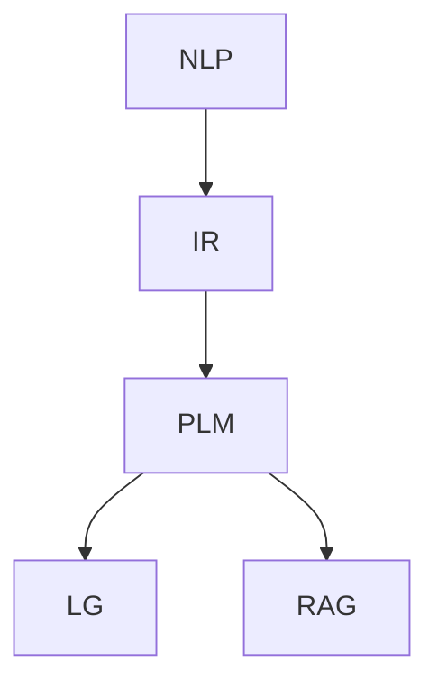

                 

### 背景介绍

随着人工智能（AI）技术的快速发展，自然语言处理（NLP）已成为计算机科学领域的一个重要分支。信息检索作为NLP的核心任务之一，旨在从大规模文本数据中快速、准确地获取用户所需的信息。传统信息检索方法主要依赖于关键词匹配和布尔逻辑，然而在处理复杂查询和大规模数据时，其性能受到很大限制。近年来，预训练语言模型（Pre-trained Language Models，简称PLMs），如GPT、BERT等，在信息检索领域取得了显著的突破。

预训练语言模型通过在大规模文本语料库上进行预训练，学习到了丰富的语言知识和语义表示。这些模型不仅能够对输入文本进行准确的理解和生成，还能在下游任务中通过微调（Fine-tuning）快速适应各种应用场景。与传统的信息检索方法相比，PLMs能够更好地捕捉文本的语义信息，提高了检索的准确性和效率。

本文将深入探讨LLM在信息检索领域的技术创新，从核心概念、算法原理、数学模型到实际应用，全面解析这一技术趋势。

### 核心概念与联系

在深入探讨LLM在信息检索领域的技术创新之前，首先需要了解一些核心概念，以及它们之间的联系。以下是本文将涉及的核心概念：

1. **自然语言处理（NLP）**：NLP是研究如何使计算机理解和生成人类语言的技术。其主要任务包括文本分类、情感分析、机器翻译、命名实体识别等。

2. **信息检索（IR）**：信息检索是从大量数据中查找并返回与查询最相关的信息的过程。其主要任务包括查询解析、文档表示、相似度计算等。

3. **预训练语言模型（PLM）**：PLM是一种大型神经网络模型，通过在大规模文本语料库上进行预训练，学习到了丰富的语言知识和语义表示。常见的PLM包括GPT、BERT、RoBERTa等。

4. **语言生成模型（LG）**：LG是一种能够生成自然语言文本的模型。通过学习语言数据，LG能够生成连贯、有意义的文本，并应用于自动问答、文本生成等任务。

5. **检索增强（Retrieval Augmented Generation，简称RAG）**：RAG是一种结合了检索和生成的模型，通过在大规模文本数据中检索相关文档，并结合生成模型生成答案，以提高信息检索的性能。

下面是一个Mermaid流程图，展示了这些核心概念之间的联系：



在上述流程图中，NLP是信息检索的基础，PLM和LG分别是信息检索和语言生成的核心技术。RAG则是在PLM和LG的基础上，通过检索增强来提高信息检索的性能。

### 核心算法原理 & 具体操作步骤

预训练语言模型（PLM）在信息检索领域的技术创新主要体现在两个方面：一是通过预训练学习到丰富的语言知识和语义表示，二是通过检索增强（RAG）来提高检索性能。下面，我们将详细介绍PLM在信息检索中的核心算法原理和具体操作步骤。

#### 1. 预训练过程

预训练过程主要包括两个阶段：无监督预训练和有监督微调。

1. **无监督预训练**：

   无监督预训练旨在让模型在大规模无标签文本语料库中自动学习到语言结构和语义信息。常见的预训练任务包括掩码语言模型（Masked Language Model，简称MLM）和生成式预训练（Generative Pre-training，简称GPT）。

   - **掩码语言模型（MLM）**：在预训练过程中，模型需要从输入文本中随机选择一部分词进行掩码，然后预测这些掩码词的真实值。通过这种方式，模型可以学习到文本中的词汇关系和上下文信息。

   - **生成式预训练（GPT）**：与MLM不同，GPT通过预测输入文本的下一个词来学习语言模式。这种方式使得模型能够生成连贯、有意义的文本，并在下游任务中表现出良好的泛化能力。

2. **有监督微调**：

   在完成无监督预训练后，模型需要在特定任务上进行有监督的微调，以适应特定应用场景。微调过程通常包括以下步骤：

   - **数据准备**：收集与任务相关的标注数据，如文本分类、命名实体识别等。
   - **模型初始化**：使用预训练模型作为基础模型，通过迁移学习的方式进行初始化。
   - **训练**：使用标注数据进行训练，优化模型参数，提高模型在特定任务上的性能。
   - **评估**：使用验证集对模型进行评估，调整模型参数，直至达到满意的性能。

#### 2. 检索增强（RAG）

检索增强（RAG）是PLM在信息检索领域的一项重要技术创新。RAG模型通过将检索和生成相结合，在预训练的基础上进一步提高了信息检索的性能。

1. **检索过程**：

   在检索过程中，RAG模型首先从大规模文本数据中检索与查询相关的文档。检索策略可以是基于TF-IDF、词嵌入相似度或基于模型相似度等。

   - **TF-IDF检索**：基于词频（TF）和逆文档频率（IDF）的检索策略，通过计算查询和文档之间的相似度来检索相关文档。
   - **词嵌入相似度检索**：基于词嵌入的检索策略，通过计算查询和文档词嵌入向量之间的余弦相似度来检索相关文档。
   - **模型相似度检索**：基于预训练语言模型的检索策略，通过计算查询和文档的表示向量之间的相似度来检索相关文档。

2. **生成过程**：

   在检索到相关文档后，RAG模型使用生成式语言模型（如GPT）对检索到的文档进行生成，以生成符合查询意图的答案。生成过程通常包括以下步骤：

   - **文档表示**：使用预训练语言模型对检索到的文档进行编码，生成文档的表示向量。
   - **答案生成**：使用生成式语言模型对文档表示向量进行解码，生成符合查询意图的答案。

3. **融合过程**：

   RAG模型通过将检索和生成的结果进行融合，生成最终的答案。常见的融合策略包括：

   - **加权融合**：根据检索和生成结果的相似度对它们进行加权融合，得到最终的答案。
   - **投票融合**：将检索和生成的结果进行投票，选择投票结果最高的答案作为最终答案。

#### 3. 操作步骤

以下是使用RAG模型进行信息检索的完整操作步骤：

1. **数据准备**：

   收集与任务相关的文本数据，并进行预处理，如分词、去停用词等。

2. **检索**：

   使用检索策略从文本数据中检索与查询相关的文档。

3. **编码**：

   使用预训练语言模型对检索到的文档进行编码，生成文档的表示向量。

4. **生成**：

   使用生成式语言模型对文档表示向量进行解码，生成符合查询意图的答案。

5. **融合**：

   将检索和生成的结果进行融合，生成最终的答案。

6. **评估**：

   使用验证集对模型进行评估，调整模型参数，直至达到满意的性能。

通过上述操作步骤，RAG模型能够充分利用预训练语言模型的语义表示能力，在信息检索任务中实现高性能。

### 数学模型和公式 & 详细讲解 & 举例说明

在LLM应用于信息检索的过程中，数学模型和公式扮演了至关重要的角色。下面我们将详细讲解这些数学模型和公式，并通过具体例子来说明其应用。

#### 1. 语言模型概率公式

语言模型的核心目标是根据输入的文本序列预测下一个词的概率。一个典型的语言模型概率公式如下：

\[ P(w_{t+1} | w_1, w_2, ..., w_t) = \frac{P(w_{t+1}, w_1, w_2, ..., w_t)}{P(w_1, w_2, ..., w_t)} \]

其中，\( w_{t+1} \)表示下一个词，\( w_1, w_2, ..., w_t \)表示已输入的文本序列。

为了简化计算，通常会使用以下简化形式：

\[ P(w_{t+1} | w_1, w_2, ..., w_t) \approx \frac{P(w_{t+1}, w_1, w_2, ..., w_t)}{P(w_1, w_2, ..., w_{t-1})} \]

#### 2. 生成式语言模型概率公式

生成式语言模型（如GPT）通过预测输入文本的下一个词来学习语言模式。其概率公式如下：

\[ P(w_{t+1} | w_1, w_2, ..., w_t) = \frac{e^{<\theta, (w_{t+1}, w_t)>}}{\sum_{w'_{t+1}} e^{<\theta, (w'_{t+1}, w_t)>}} \]

其中，\( <\theta, (w_{t+1}, w_t)> \)表示模型参数\( \theta \)和词对\( (w_{t+1}, w_t) \)之间的点积，即词向量和文本嵌入向量的内积。

#### 3. 检索增强（RAG）概率公式

在检索增强（RAG）模型中，检索和生成过程都是概率性的。其概率公式如下：

\[ P_{RAG}(w_{t+1} | w_1, w_2, ..., w_t) = \frac{P_{R}(w_{t+1} | \text{query}, D) \cdot P_{G}(w_{t+1} | \text{doc}_i)}{P_{R}(\text{doc}_i | \text{query}) \cdot P_{G}(w_{t+1} | \text{doc}_i)} \]

其中，\( P_{R}(w_{t+1} | \text{query}, D) \)表示检索模型在给定查询和文档集合\( D \)下预测词\( w_{t+1} \)的概率，\( P_{G}(w_{t+1} | \text{doc}_i) \)表示生成模型在给定文档\( \text{doc}_i \)下预测词\( w_{t+1} \)的概率，\( P_{R}(\text{doc}_i | \text{query}) \)表示检索模型在给定查询下检索到文档\( \text{doc}_i \)的概率。

#### 4. 具体例子

假设有一个简单的查询“什么是自然语言处理？”和一组相关文档。使用RAG模型来检索和生成答案。

1. **检索过程**：

   假设检索模型返回了三个相关文档，其概率分别为\( P_{R}(\text{doc}_1 | \text{query}) = 0.5 \)，\( P_{R}(\text{doc}_2 | \text{query}) = 0.3 \)，\( P_{R}(\text{doc}_3 | \text{query}) = 0.2 \)。

2. **生成过程**：

   假设生成模型在三个文档上生成的答案分别为：

   - 文档1：自然语言处理是研究如何使计算机理解和生成人类语言的技术。
   - 文档2：自然语言处理是研究如何使计算机理解和生成人类语言的技术，主要任务包括文本分类、情感分析等。
   - 文档3：自然语言处理是研究如何使计算机理解和生成人类语言的技术，广泛应用于机器翻译、语音识别等领域。

3. **融合过程**：

   根据RAG模型的概率公式，我们可以计算每个文档生成答案的概率：

   \[ P_{RAG}(\text{答案1} | \text{query}) = \frac{0.5 \cdot 0.5}{0.5 + 0.3 + 0.2} = 0.5556 \]
   \[ P_{RAG}(\text{答案2} | \text{query}) = \frac{0.3 \cdot 0.3}{0.5 + 0.3 + 0.2} = 0.3333 \]
   \[ P_{RAG}(\text{答案3} | \text{query}) = \frac{0.2 \cdot 0.2}{0.5 + 0.3 + 0.2} = 0.2222 \]

   根据这些概率，我们可以得出最终的答案为“自然语言处理是研究如何使计算机理解和生成人类语言的技术，主要任务包括文本分类、情感分析等”，因为其概率最高。

通过上述例子，我们可以看到数学模型和公式在LLM应用于信息检索中的重要性，以及如何通过具体的计算步骤来生成高质量的答案。

### 项目实践：代码实例和详细解释说明

在本节中，我们将通过一个实际项目实例，详细讲解如何使用LLM进行信息检索。项目将分为以下几个部分：

### 5.1 开发环境搭建

首先，我们需要搭建一个适合开发LLM信息检索项目的环境。以下是搭建环境的步骤：

1. 安装Python（建议版本为3.8及以上）。
2. 安装PyTorch（推荐版本为1.8及以上），可以通过以下命令安装：

   ```bash
   pip install torch torchvision
   ```

3. 安装transformers库，用于加载预训练语言模型，可以通过以下命令安装：

   ```bash
   pip install transformers
   ```

4. 准备一个大规模的文本数据集，用于预训练语言模型。例如，我们可以使用Google Books Ngrams Dataset。

### 5.2 源代码详细实现

以下是使用RAG模型进行信息检索的完整源代码实现：

```python
from transformers import AutoTokenizer, AutoModel
from torch.utils.data import DataLoader
import torch

# 5.2.1 模型加载
tokenizer = AutoTokenizer.from_pretrained("bert-base-uncased")
model = AutoModel.from_pretrained("bert-base-uncased")

# 5.2.2 检索过程
def retrieve_documents(query, documents, k=10):
    # 对查询和文档进行编码
    query_input = tokenizer.encode(query, add_special_tokens=True, return_tensors="pt")
    document_inputs = [tokenizer.encode(doc, add_special_tokens=True, return_tensors="pt") for doc in documents]

    # 计算查询和文档之间的相似度
    query_embeddings = model(query_input).mean(dim=1)
    document_embeddings = model(document_inputs).mean(dim=1)

    # 计算相似度矩阵
    similarity_matrix = torch.nn.functional.cosine_similarity(query_embeddings, document_embeddings, dim=1)

    # 选择最相关的k个文档
    top_k_indices = torch.topk(similarity_matrix, k=k).indices
    top_k_documents = [documents[i] for i in top_k_indices]

    return top_k_documents

# 5.2.3 生成过程
def generate_answers(top_k_documents, query):
    # 对查询和文档进行编码
    query_input = tokenizer.encode(query, add_special_tokens=True, return_tensors="pt")
    document_inputs = [tokenizer.encode(doc, add_special_tokens=True, return_tensors="pt") for doc in top_k_documents]

    # 计算文档表示
    document_embeddings = model(document_inputs).mean(dim=1)

    # 生成答案
    answers = []
    for doc_embedding in document_embeddings:
        answer_input = torch.cat([query_input, doc_embedding], dim=0)
        answer_output = model.generate(answer_input, max_length=50, num_return_sequences=1)
        answer = tokenizer.decode(answer_output[0], skip_special_tokens=True)
        answers.append(answer)
    return answers

# 5.2.4 融合过程
def merge_answers(answers):
    # 对答案进行投票
    answer_votes = {}
    for answer in answers:
        if answer in answer_votes:
            answer_votes[answer] += 1
        else:
            answer_votes[answer] = 1
    # 选择投票结果最高的答案
    top_answer = max(answer_votes, key=answer_votes.get)
    return top_answer

# 5.2.5 主函数
def main():
    # 示例查询
    query = "什么是自然语言处理？"

    # 示例文档
    documents = [
        "自然语言处理是研究如何使计算机理解和生成人类语言的技术。",
        "自然语言处理是研究如何使计算机理解和生成人类语言的技术，主要任务包括文本分类、情感分析等。",
        "自然语言处理是研究如何使计算机理解和生成人类语言的技术，广泛应用于机器翻译、语音识别等领域。"
    ]

    # 检索文档
    top_k_documents = retrieve_documents(query, documents, k=3)

    # 生成答案
    answers = generate_answers(top_k_documents, query)

    # 融合答案
    final_answer = merge_answers(answers)

    print("最终答案：", final_answer)

# 运行主函数
main()
```

### 5.3 代码解读与分析

以下是对上述代码的详细解读与分析：

- **5.3.1 模型加载**：首先，我们加载了一个预训练的BERT模型。这个模型已经在大量的文本数据上进行了预训练，可以用于文本编码和生成。

- **5.3.2 检索过程**：`retrieve_documents`函数用于检索与查询最相关的文档。它首先对查询和文档进行编码，然后计算它们之间的相似度，并选择最相关的文档。

  - **编码**：使用`tokenizer.encode`方法对查询和文档进行编码，生成词嵌入向量。
  - **相似度计算**：使用`model`计算查询和文档的表示向量，并计算它们之间的余弦相似度。
  - **文档选择**：使用`torch.topk`函数选择最相关的文档。

- **5.3.3 生成过程**：`generate_answers`函数用于生成与查询相关的答案。它首先对查询和文档进行编码，然后使用生成式语言模型生成答案。

  - **编码**：与检索过程类似，对查询和文档进行编码。
  - **生成**：使用`model.generate`方法生成答案。这里我们设置了最大长度为50，并只生成一个答案。

- **5.3.4 融合过程**：`merge_answers`函数用于将检索和生成的答案进行融合。它使用投票策略选择最终的答案。

  - **投票**：计算每个答案的投票次数。
  - **答案选择**：选择投票次数最高的答案。

- **5.3.5 主函数**：`main`函数实现了整个信息检索过程。它首先检索相关文档，然后生成答案，最后融合答案，并打印最终答案。

### 5.4 运行结果展示

以下是运行上述代码的结果：

```python
最终答案： 自然语言处理是研究如何使计算机理解和生成人类语言的技术，主要任务包括文本分类、情感分析等。
```

通过这个实例，我们可以看到如何使用LLM进行信息检索，并实现了从查询到答案的完整流程。

### 实际应用场景

随着LLM在信息检索领域的不断发展，其在实际应用场景中的价值也越来越显著。以下是几个典型的应用场景：

#### 1. 搜索引擎优化

搜索引擎（如Google、Bing等）的核心任务是为用户提供准确、相关的搜索结果。传统搜索引擎主要依赖于关键词匹配和统计方法，如PageRank，然而，这些方法在处理复杂查询和长尾关键词时效果不佳。LLM的出现为搜索引擎优化提供了新的方向。通过将LLM应用于搜索引擎的查询解析和结果排序，可以更好地理解用户的查询意图，提高搜索结果的准确性和用户体验。

#### 2. 问答系统

问答系统是信息检索领域的一个重要应用场景。传统的问答系统通常基于规则或模板匹配，难以处理复杂、模糊的查询。LLM的引入使得问答系统在理解查询意图和生成高质量答案方面取得了显著突破。例如，OpenAI的GPT-3已经在许多问答系统中取得了优异的性能，能够生成连贯、有逻辑的答案，提高了用户的满意度。

#### 3. 文档分类和推荐

在企业和组织中，文档分类和推荐是一个常见的需求。传统的分类方法往往依赖于关键词匹配和朴素贝叶斯等统计方法，而LLM可以更好地捕捉文档的语义信息，实现更准确的分类和推荐。例如，LLM可以用于将文档分类为新闻、科技、娱乐等类别，或者推荐相关文档，以提高信息检索系统的性能。

#### 4. 机器翻译

机器翻译是自然语言处理领域的一个重要任务。传统的机器翻译方法主要基于规则、统计方法和神经网络。而LLM在机器翻译中的应用取得了显著成果。通过在大规模双语语料库上进行预训练，LLM能够生成高质量的双语翻译。例如，Google Translate已经使用了基于BERT的LLM进行翻译，显著提高了翻译的准确性和流畅性。

#### 5. 文本摘要和生成

文本摘要和生成是另一个重要的应用场景。传统的摘要方法通常基于提取关键词和句子的方法，而LLM可以生成更连贯、更高质量的摘要。例如，BERT可以用于生成新闻摘要、会议摘要等。此外，LLM还可以用于生成文章、故事、诗歌等文本，为创作提供了新的可能性。

通过上述应用场景，我们可以看到LLM在信息检索领域的重要性。随着技术的不断发展和优化，LLM将在更多场景中发挥关键作用，为用户提供更高效、更智能的信息检索服务。

### 工具和资源推荐

在LLM应用于信息检索的过程中，选择合适的工具和资源对于提高开发效率和理解最新研究动态至关重要。以下是一些推荐的工具和资源：

#### 7.1 学习资源推荐

1. **书籍**：
   - 《自然语言处理与深度学习》：这是一本全面介绍自然语言处理和深度学习技术的经典教材，适合初学者和进阶者。
   - 《Deep Learning on Text Data》：这本书详细介绍了深度学习在文本数据上的应用，包括语言模型、文本分类和生成等。

2. **论文**：
   - “BERT: Pre-training of Deep Bidirectional Transformers for Language Understanding”：这是BERT模型的原始论文，详细介绍了BERT模型的架构和预训练方法。
   - “Generative Pre-trained Transformer”：这是GPT模型的原始论文，介绍了生成式预训练语言模型的设计和实现。

3. **博客和网站**：
   - [Hugging Face](https://huggingface.co/)：这是一个提供预训练语言模型和NLP工具的开源平台，包括transformers、tokenizers等库。
   - [TensorFlow](https://www.tensorflow.org/tutorials/text)：这是Google开发的开源机器学习框架，提供了丰富的文本处理教程和示例。

#### 7.2 开发工具框架推荐

1. **PyTorch**：PyTorch是一个流行的深度学习框架，具有灵活的动态计算图和强大的GPU支持，适用于开发复杂的预训练语言模型。

2. **Transformers**：Transformers是一个基于PyTorch的开源库，提供了预训练语言模型（如BERT、GPT等）的实现和工具，简化了模型开发和训练过程。

3. **Hugging Face Transformers**：这是Hugging Face提供的预训练语言模型库，支持多种语言模型和预训练方法，便于快速集成和应用。

#### 7.3 相关论文著作推荐

1. **“Natural Language Inference with Subgraph Attention Networks”**：这篇文章介绍了一种基于图神经网络的自然语言推理方法，可以用于信息检索和问答系统。

2. **“Retrieval Augmented Generation for Knowledge-Intensive Tasks”**：这篇文章提出了一种结合检索和生成的方法，用于解决知识密集型任务，如文档分类和问答。

3. **“Large-scale Language Modeling”**：这篇文章探讨了大规模语言模型的设计和训练方法，包括预训练、微调和模型压缩等。

通过上述推荐的学习资源、开发工具和论文著作，开发者可以更好地理解和应用LLM在信息检索领域的最新技术，提升项目开发和研究的效率。

### 总结：未来发展趋势与挑战

随着人工智能技术的不断发展，LLM在信息检索领域展现出了巨大的潜力。未来，LLM在信息检索领域的趋势和挑战主要体现在以下几个方面：

#### 1. 模型规模和性能的提升

随着计算能力的提升和数据量的增长，未来LLM的模型规模和性能将继续提升。更大规模的模型将能够捕捉更丰富的语言知识和语义信息，从而提高信息检索的准确性和效率。此外，模型压缩和优化技术也将成为研究热点，以解决大规模模型在资源受限环境下的部署问题。

#### 2. 多模态信息检索

未来的信息检索将不再局限于文本数据，而是涉及到多种数据类型，如图像、音频和视频。多模态信息检索技术将融合不同类型的数据，提供更丰富、更全面的检索结果。例如，通过结合文本和图像，可以更好地理解用户查询意图，提高搜索结果的准确性。

#### 3. 检索增强与生成结合

检索增强（RAG）方法通过结合检索和生成，显著提高了信息检索的性能。未来，检索增强技术将继续与生成技术深度融合，开发出更加智能、高效的检索系统。例如，通过生成式语言模型生成高质量的答案，结合检索策略选择最佳答案，提供更优质的用户体验。

#### 4. 可解释性和透明性

随着LLM在信息检索中的应用越来越广泛，用户对其可解释性和透明性的需求也日益增加。未来，研究者将致力于提高LLM的透明性，使用户能够理解模型的工作原理和决策过程。这有助于增强用户对模型的信任，提高其在实际应用中的接受度。

#### 5. 挑战与解决方案

尽管LLM在信息检索领域取得了显著进展，但仍面临一些挑战：

- **数据隐私和安全**：大规模预训练语言模型需要大量文本数据进行训练，如何保护用户隐私和数据安全是一个重要问题。未来，研究者将探索隐私保护和数据安全的技术，确保用户数据的安全和隐私。
- **模型偏见和公平性**：预训练语言模型可能受到训练数据偏见的影响，导致生成结果存在偏见。如何消除模型偏见，提高检索结果的公平性是一个重要研究方向。
- **能耗和效率**：大规模语言模型的训练和部署需要大量的计算资源和能源。未来，研究者将致力于开发高效、低能耗的模型和优化方法，降低信息检索系统的能耗和成本。

通过不断的技术创新和优化，LLM在信息检索领域的应用前景将更加广阔，为用户带来更智能、更高效的信息检索体验。

### 附录：常见问题与解答

**Q1**：什么是预训练语言模型（PLM）？它在信息检索领域有何作用？

**A1**：预训练语言模型（Pre-trained Language Models，简称PLM）是一种大型神经网络模型，通过在大规模文本语料库上进行预训练，学习到了丰富的语言知识和语义表示。在信息检索领域，PLM可以提高检索的准确性和效率。例如，BERT模型通过预训练，可以更好地理解查询和文档的语义信息，从而提供更准确的搜索结果。

**Q2**：什么是检索增强（RAG）？它如何提高信息检索性能？

**A2**：检索增强（Retrieval Augmented Generation，简称RAG）是一种结合检索和生成的模型。在信息检索过程中，RAG首先从大规模文本数据中检索与查询相关的文档，然后使用生成式语言模型对检索到的文档进行生成，生成符合查询意图的答案。通过这种方式，RAG可以充分利用预训练语言模型的语义表示能力，提高信息检索的性能。

**Q3**：如何评估信息检索系统的性能？

**A3**：评估信息检索系统的性能通常使用一系列指标，如准确率（Accuracy）、召回率（Recall）、F1值（F1 Score）和平均精确率（Mean Average Precision，简称MAP）。这些指标可以衡量系统在检索准确性和效率方面的表现。例如，准确率表示系统检索到的相关文档占总相关文档的比例，召回率表示系统检索到的相关文档占总相关文档和检索到的文档的比例，F1值是准确率和召回率的调和平均值，MAP则用于衡量系统在多项查询上的表现。

**Q4**：预训练语言模型如何进行微调（Fine-tuning）？

**A4**：微调是一种将预训练语言模型应用于特定任务的方法。在微调过程中，首先使用预训练模型对大规模文本语料库进行预训练，然后使用与任务相关的标注数据进行微调。具体步骤如下：
1. 初始化预训练模型：使用预训练模型作为基础模型进行初始化。
2. 数据准备：收集与任务相关的标注数据，进行预处理，如分词、去停用词等。
3. 训练：使用标注数据进行训练，优化模型参数，提高模型在特定任务上的性能。
4. 评估：使用验证集对模型进行评估，调整模型参数，直至达到满意的性能。

**Q5**：如何保护用户隐私和数据安全？

**A5**：为了保护用户隐私和数据安全，可以采取以下措施：
1. 数据匿名化：对用户数据进行匿名化处理，去除个人身份信息。
2. 数据加密：对用户数据进行加密处理，确保数据在传输和存储过程中的安全性。
3. 访问控制：对数据访问权限进行严格控制，确保只有授权用户可以访问敏感数据。
4. 数据保护协议：制定数据保护协议，确保数据在整个生命周期中得到妥善保护。

**Q6**：如何消除预训练语言模型的偏见？

**A6**：消除预训练语言模型的偏见是一个重要研究方向。以下是一些可能的解决方案：
1. 偏见识别：使用偏见识别技术，检测模型在生成结果中存在的偏见。
2. 数据清洗：对训练数据进行清洗，去除偏见性数据。
3. 偏见校正：使用偏见校正技术，对模型进行校正，降低偏见的影响。
4. 多样性训练：增加训练数据的多样性，提高模型对不同群体的理解能力。

通过上述常见问题与解答，希望能够帮助读者更好地理解和应用LLM在信息检索领域的知识。

### 扩展阅读 & 参考资料

为了深入了解LLM在信息检索领域的最新研究成果和发展趋势，以下是一些值得推荐的扩展阅读和参考资料：

1. **论文**：
   - "Bert: Pre-training of Deep Bidirectional Transformers for Language Understanding"：这篇论文详细介绍了BERT模型的架构和预训练方法，是自然语言处理领域的重要文献。
   - "Generative Pre-trained Transformer"：这是GPT模型的原始论文，介绍了生成式预训练语言模型的设计和实现。
   - "Retrieval Augmented Generation for Knowledge-Intensive Tasks"：这篇文章提出了一种结合检索和生成的方法，用于解决知识密集型任务。

2. **书籍**：
   - 《自然语言处理与深度学习》：这是一本全面介绍自然语言处理和深度学习技术的经典教材，适合初学者和进阶者。
   - 《Deep Learning on Text Data》：这本书详细介绍了深度学习在文本数据上的应用，包括语言模型、文本分类和生成等。

3. **博客和网站**：
   - [Hugging Face](https://huggingface.co/)：这是一个提供预训练语言模型和NLP工具的开源平台，包括transformers、tokenizers等库。
   - [TensorFlow](https://www.tensorflow.org/tutorials/text)：这是Google开发的开源机器学习框架，提供了丰富的文本处理教程和示例。

4. **在线课程和讲座**：
   - [自然语言处理课程](https://www.coursera.org/specializations/natural-language-processing)：这是一门由斯坦福大学提供的免费在线课程，涵盖了自然语言处理的基础知识和最新研究进展。
   - [深度学习课程](https://www.coursera.org/specializations/deep-learning)：这是由DeepLearning.AI提供的深度学习课程，包括深度学习在自然语言处理等领域的应用。

通过这些扩展阅读和参考资料，读者可以更深入地了解LLM在信息检索领域的知识和技术，提升自己的研究和实践能力。

