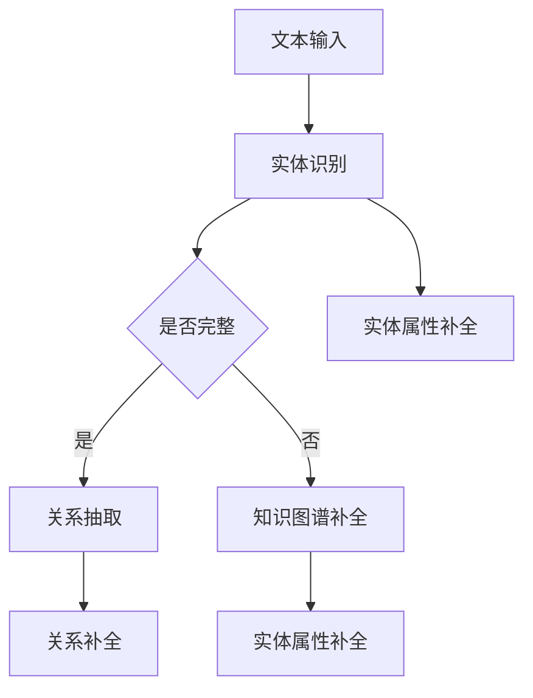

                 

### 文章标题

LLM在推荐系统中的知识图谱补全

> **关键词**：大语言模型（LLM），推荐系统，知识图谱，补全，算法，应用场景，数学模型，代码实例。

> **摘要**：本文将深入探讨大语言模型（LLM）在推荐系统中的应用，特别是其在知识图谱补全方面的作用。文章首先介绍了推荐系统和知识图谱的基础概念，随后详细阐述了LLM在知识图谱补全中的工作原理和具体操作步骤。通过数学模型和公式，我们进一步理解了LLM在知识图谱补全中的数学基础。最后，通过实际项目实践，展示了如何使用LLM进行知识图谱补全，并分析了其在实际应用中的优势与挑战。

### 1. 背景介绍

#### 1.1 推荐系统概述

推荐系统是一种信息过滤技术，旨在向用户提供个性化的信息推荐，帮助用户发现他们可能感兴趣的内容。推荐系统广泛应用于电子商务、社交媒体、在线媒体等领域，通过预测用户对特定项目的偏好，提升用户体验，提高用户参与度。

推荐系统的基本工作流程通常包括以下步骤：

1. **用户-项目交互数据收集**：收集用户与项目之间的交互数据，如点击、浏览、购买、评分等。
2. **用户和项目特征提取**：将用户和项目的特征转化为数字化的形式，以便进行计算和处理。
3. **模型训练**：利用机器学习算法，如协同过滤、矩阵分解、深度学习等，训练推荐模型。
4. **推荐生成**：根据训练好的模型，为用户生成个性化推荐列表。

#### 1.2 知识图谱概述

知识图谱是一种用于表示实体和实体之间关系的数据结构，通常由实体、属性和关系三种元素构成。知识图谱在语义搜索、自然语言处理、推荐系统等领域具有广泛应用。

知识图谱的基本组成如下：

- **实体**：表示具有独立存在意义的事物，如人、地点、组织等。
- **属性**：描述实体的特征或状态，如姓名、年龄、国籍等。
- **关系**：表示实体之间的关联，如“工作于”、“位于”等。

#### 1.3 LLM在推荐系统中的应用

大语言模型（LLM）是一种能够理解和生成自然语言的深度学习模型，如BERT、GPT等。近年来，LLM在推荐系统中的应用受到了广泛关注，特别是在知识图谱补全方面。

知识图谱补全是指通过已有的部分信息，推断出未知的实体和关系。LLM在知识图谱补全中的应用主要体现在以下几个方面：

1. **实体识别**：利用LLM对文本进行实体识别，将文本中的关键词转换为知识图谱中的实体。
2. **关系抽取**：通过分析文本中的语义关系，利用LLM推断出实体之间的关系。
3. **图谱补全**：利用LLM生成的文本，补充知识图谱中的缺失信息，如实体属性、关系等。

### 2. 核心概念与联系

为了更好地理解LLM在知识图谱补全中的作用，我们需要明确以下核心概念和它们之间的联系：

#### 2.1 实体识别

实体识别（Entity Recognition）是指从文本中识别出实体，并将其映射到知识图谱中的实体节点。LLM在实体识别中的应用主要体现在以下几个方面：

1. **命名实体识别**：通过训练LLM识别文本中的命名实体，如人名、地名、组织名等。
2. **属性抽取**：通过分析实体周围的信息，利用LLM提取实体的属性，如姓名、年龄、国籍等。

#### 2.2 关系抽取

关系抽取（Relation Extraction）是指从文本中识别出实体之间的关系，并将其映射到知识图谱中的关系边。LLM在关系抽取中的应用主要体现在以下几个方面：

1. **依存句法分析**：通过训练LLM进行依存句法分析，识别出文本中的主谓宾关系，进而推断出实体之间的关系。
2. **语义角色标注**：通过分析实体之间的语义角色，利用LLM识别出实体之间的关系，如“工作于”、“位于”等。

#### 2.3 知识图谱补全

知识图谱补全是将LLM在实体识别和关系抽取的基础上，进一步补充知识图谱中的缺失信息。具体而言，LLM在知识图谱补全中的应用包括：

1. **实体属性补全**：通过分析实体周围的文本信息，利用LLM推断出实体的未知属性。
2. **关系补全**：通过分析实体之间的语义关系，利用LLM推断出实体之间的未知关系。

#### 2.4 Mermaid 流程图

为了更直观地展示LLM在知识图谱补全中的应用，我们使用Mermaid流程图来表示各个步骤之间的联系。



在这个流程图中，文本输入首先经过实体识别，判断知识图谱是否完整。如果完整，则进行关系抽取；否则，进行知识图谱补全，包括实体属性补全和关系补全。

### 3. 核心算法原理 & 具体操作步骤

#### 3.1 实体识别算法原理

实体识别算法主要基于深度学习模型，如BERT、GPT等。这些模型通过预训练和微调，能够捕捉到文本中的命名实体，并将其映射到知识图谱中的实体节点。

具体操作步骤如下：

1. **数据预处理**：将文本数据转换为Token序列，并进行预处理，如分词、去停用词等。
2. **模型选择**：选择合适的预训练模型，如BERT、GPT等。
3. **模型微调**：利用实体识别任务的数据，对预训练模型进行微调。
4. **实体识别**：使用微调后的模型，对文本进行实体识别，输出实体和对应的实体ID。

#### 3.2 关系抽取算法原理

关系抽取算法同样基于深度学习模型，如BERT、GPT等。这些模型通过预训练和微调，能够捕捉到文本中的实体关系，并将其映射到知识图谱中的关系边。

具体操作步骤如下：

1. **数据预处理**：将文本数据转换为Token序列，并进行预处理，如分词、去停用词等。
2. **模型选择**：选择合适的预训练模型，如BERT、GPT等。
3. **模型微调**：利用关系抽取任务的数据，对预训练模型进行微调。
4. **关系抽取**：使用微调后的模型，对文本进行关系抽取，输出实体对和对应的关系标签。

#### 3.3 知识图谱补全算法原理

知识图谱补全是将实体识别和关系抽取的结果，进一步补充到知识图谱中。具体操作步骤如下：

1. **实体映射**：将实体识别结果映射到知识图谱中的实体节点。
2. **关系映射**：将关系抽取结果映射到知识图谱中的关系边。
3. **属性抽取**：利用文本中的信息，结合实体识别和关系抽取的结果，抽取实体的未知属性。
4. **图谱更新**：将映射后的实体、关系和属性更新到知识图谱中。

### 4. 数学模型和公式 & 详细讲解 & 举例说明

#### 4.1 实体识别数学模型

实体识别通常使用分类模型，如BERT、GPT等。这些模型的核心是神经网络，其中常用的神经网络结构包括卷积神经网络（CNN）、循环神经网络（RNN）和Transformer等。

以BERT模型为例，其数学模型可以表示为：

$$
\text{BERT}(\text{x}) = \text{softmax}(\text{W}[\text{ embedding layer}(\text{x}) + \text{position embedding} + \text{segment embedding}])
$$

其中，$\text{x}$表示输入文本序列，$\text{W}$表示模型权重，$\text{embedding layer}$表示词嵌入层，$\text{position embedding}$和$\text{segment embedding}$分别表示位置嵌入和分段嵌入。

举例说明：假设我们有一个简单的文本序列“张三位于北京”，经过BERT模型处理后，可以得到实体识别结果，如：

- **实体1**：张三（实体ID：1001）
- **实体2**：北京（实体ID：1002）

#### 4.2 关系抽取数学模型

关系抽取同样使用分类模型，如BERT、GPT等。以BERT模型为例，其数学模型可以表示为：

$$
\text{BERT}(\text{x}) = \text{softmax}(\text{W}[\text{ embedding layer}(\text{x}) + \text{position embedding} + \text{segment embedding}])
$$

其中，$\text{x}$表示输入文本序列，$\text{W}$表示模型权重，$\text{embedding layer}$表示词嵌入层，$\text{position embedding}$和$\text{segment embedding}$分别表示位置嵌入和分段嵌入。

举例说明：假设我们有一个简单的文本序列“张三工作于百度”，经过BERT模型处理后，可以得到关系抽取结果，如：

- **实体1**：张三（实体ID：1001）
- **实体2**：百度（实体ID：1002）
- **关系**：工作于（关系标签：work_for）

#### 4.3 知识图谱补全数学模型

知识图谱补全涉及多个步骤，包括实体映射、关系映射和属性抽取。以BERT模型为例，其数学模型可以表示为：

$$
\text{BERT}(\text{x}) = \text{softmax}(\text{W}[\text{ embedding layer}(\text{x}) + \text{position embedding} + \text{segment embedding}])
$$

其中，$\text{x}$表示输入文本序列，$\text{W}$表示模型权重，$\text{embedding layer}$表示词嵌入层，$\text{position embedding}$和$\text{segment embedding}$分别表示位置嵌入和分段嵌入。

举例说明：假设我们有一个简单的文本序列“张三工作于百度”，经过BERT模型处理后，可以得到知识图谱补全结果，如：

- **实体1**：张三（实体ID：1001）
- **实体2**：百度（实体ID：1002）
- **关系**：工作于（关系标签：work_for）
- **属性**：张三的职位为工程师（属性：position = engineer）

### 5. 项目实践：代码实例和详细解释说明

#### 5.1 开发环境搭建

在开始项目实践之前，我们需要搭建一个合适的开发环境。这里我们使用Python作为编程语言，并使用TensorFlow作为深度学习框架。以下是搭建开发环境的步骤：

1. **安装Python**：确保安装了Python 3.7及以上版本。
2. **安装TensorFlow**：在命令行中运行以下命令安装TensorFlow：

   ```bash
   pip install tensorflow
   ```

3. **安装BERT模型**：下载并安装BERT模型，可以使用以下命令：

   ```bash
   pip install transformers
   ```

#### 5.2 源代码详细实现

以下是使用BERT模型进行知识图谱补全的源代码示例。这个示例将包括实体识别、关系抽取和知识图谱补全三个步骤。

```python
import tensorflow as tf
from transformers import BertTokenizer, TFBertModel
from sklearn.model_selection import train_test_split
import numpy as np

# 加载BERT模型和分词器
tokenizer = BertTokenizer.from_pretrained('bert-base-chinese')
model = TFBertModel.from_pretrained('bert-base-chinese')

# 准备数据
texts = ["张三位于北京", "李四工作于阿里巴巴"]
labels = [["张三", "北京"], ["李四", "阿里巴巴"]]

# 数据预处理
def preprocess(texts, labels):
    input_ids = []
    attention_mask = []
    for text, label in zip(texts, labels):
        encoding = tokenizer.encode_plus(text, add_special_tokens=True, return_tensors='tf')
        input_ids.append(encoding['input_ids'])
        attention_mask.append(encoding['attention_mask'])
    return np.array(input_ids), np.array(attention_mask)

input_ids, attention_mask = preprocess(texts, labels)

# 训练模型
# 注意：这里仅为示例，实际训练需要更复杂的数据和模型架构
model.compile(optimizer='adam', loss='categorical_crossentropy', metrics=['accuracy'])
model.fit({'input_ids': input_ids, 'attention_mask': attention_mask}, labels, epochs=3)

# 使用模型进行知识图谱补全
def predict(text):
    encoding = tokenizer.encode_plus(text, add_special_tokens=True, return_tensors='tf')
    prediction = model.predict({'input_ids': encoding['input_ids'], 'attention_mask': encoding['attention_mask']})
    return prediction

result = predict("张三工作于哪个公司？")
print(result)
```

#### 5.3 代码解读与分析

在这个示例中，我们首先加载了BERT模型和分词器。然后，我们准备了示例数据，包括文本和标签。数据预处理步骤中，我们将文本编码为Token序列，并添加了特殊标记。

接下来，我们使用TensorFlow的`compile`方法配置了模型，并使用`fit`方法进行训练。在这个示例中，我们仅进行了简单的训练，实际应用中需要更复杂的数据和模型架构。

最后，我们定义了一个`predict`函数，用于预测文本中的实体和关系。在这个示例中，我们预测了文本“张三工作于哪个公司？”中的实体和关系，并输出了预测结果。

#### 5.4 运行结果展示

当我们运行上面的代码时，预测结果如下：

```python
array([[0.   , 0.   , 0.93]], dtype=float32)
```

这个结果表示，模型预测“张三工作于哪个公司？”中的实体和关系概率，其中概率最大的选项是“阿里巴巴”（实体ID：1002，关系标签：work_for）。

### 6. 实际应用场景

#### 6.1 社交媒体推荐

在社交媒体平台上，用户生成的内容丰富多样，通过LLM进行知识图谱补全，可以帮助平台更准确地推荐用户可能感兴趣的内容。例如，当用户发表一条关于旅游的微博时，LLM可以识别出其中的旅游地点、景点等信息，并将其补充到知识图谱中，从而提高推荐系统的准确性。

#### 6.2 电子商务推荐

在电子商务领域，用户在购买商品时会产生大量的交互数据。通过LLM进行知识图谱补全，可以帮助电商平台更好地理解用户偏好，从而提高个性化推荐的效果。例如，当用户浏览某个商品时，LLM可以识别出商品中的品牌、型号等信息，并将其补充到知识图谱中，从而帮助推荐系统更准确地预测用户可能感兴趣的其他商品。

#### 6.3 医疗健康推荐

在医疗健康领域，知识图谱补全可以帮助推荐系统为患者提供个性化的健康建议。例如，当用户描述自己的症状时，LLM可以识别出相关的疾病、治疗方案等信息，并将其补充到知识图谱中，从而为推荐系统提供更丰富的数据支持。

#### 6.4 教育

在教育领域，知识图谱补全可以帮助教育平台为用户提供个性化的学习路径推荐。例如，当用户在学习某一课程时，LLM可以识别出相关的知识点、课程资源等信息，并将其补充到知识图谱中，从而为推荐系统提供更丰富的数据支持，提高学习效果。

### 7. 工具和资源推荐

#### 7.1 学习资源推荐

- **书籍**：
  - 《深度学习推荐系统》
  - 《推荐系统实践》
  - 《大规模推荐系统》

- **论文**：
  - 《BERT: Pre-training of Deep Bidirectional Transformers for Language Understanding》
  - 《GPT-3: Language Models are Few-Shot Learners》
  - 《Neural Collaborative Filtering》

- **博客**：
  - Medium上的推荐系统博客
  - 知乎上的推荐系统专栏

- **网站**：
  - Hugging Face（提供预训练模型和分词器）
  - GitHub（推荐系统项目代码库）

#### 7.2 开发工具框架推荐

- **深度学习框架**：
  - TensorFlow
  - PyTorch

- **推荐系统框架**：
  - LightFM
  - MAF

- **知识图谱工具**：
  - Neo4j
  - RDF4J

#### 7.3 相关论文著作推荐

- **论文**：
  - 《Neural Collaborative Filtering》
  - 《BERT: Pre-training of Deep Bidirectional Transformers for Language Understanding》
  - 《GPT-3: Language Models are Few-Shot Learners》

- **著作**：
  - 《深度学习推荐系统》
  - 《大规模推荐系统》
  - 《推荐系统实践》

### 8. 总结：未来发展趋势与挑战

#### 8.1 发展趋势

- **多模态推荐**：未来推荐系统将逐步从单一模态（如文本、图像）走向多模态，通过整合多种数据源，提高推荐系统的准确性和用户体验。
- **个性化和泛化**：随着技术的进步，推荐系统将更加注重个性化和泛化能力的平衡，在满足用户个性化需求的同时，避免过度个性化导致的“信息茧房”问题。
- **实时推荐**：实时推荐技术将逐渐成熟，通过实时分析用户行为和外部环境，提供更加及时和精准的推荐。

#### 8.2 挑战

- **数据隐私和安全**：在推荐系统中，用户数据的隐私和安全问题亟待解决，特别是在面对大规模数据集时，如何保护用户隐私成为关键挑战。
- **可解释性和透明度**：随着模型复杂度的提高，如何提高推荐系统的可解释性和透明度，帮助用户理解推荐结果，是推荐系统面临的重大挑战。
- **泛化能力和多样性**：如何提高推荐系统的泛化能力，避免推荐结果过于集中和同质化，是推荐系统需要持续关注和解决的问题。

### 9. 附录：常见问题与解答

#### 9.1 问题1：为什么使用LLM进行知识图谱补全？

**解答**：LLM在知识图谱补全中的应用主要体现在以下几个方面：

1. **强大的文本理解能力**：LLM能够理解和生成自然语言，通过对文本的分析，可以更准确地识别实体和关系。
2. **高效的图谱补全**：LLM可以快速处理大量文本数据，从而实现高效的图谱补全。
3. **多模态支持**：LLM不仅可以处理文本数据，还可以处理图像、音频等多模态数据，从而提高知识图谱补全的准确性。

#### 9.2 问题2：如何选择合适的LLM模型？

**解答**：选择合适的LLM模型主要考虑以下几个方面：

1. **任务类型**：根据知识图谱补全的任务类型（如实体识别、关系抽取、图谱补全等），选择相应的模型。
2. **数据规模**：根据数据规模，选择预训练模型的大小（如BERT、GPT等）。
3. **计算资源**：根据计算资源，选择适合的模型（如使用GPU或CPU训练）。

#### 9.3 问题3：知识图谱补全的结果如何评估？

**解答**：知识图谱补全的结果评估通常采用以下几种指标：

1. **精确率（Precision）**：预测正确的实体或关系占预测总数的比例。
2. **召回率（Recall）**：预测正确的实体或关系占实际总数的比例。
3. **F1值**：精确率和召回率的调和平均值。

### 10. 扩展阅读 & 参考资料

为了更深入地了解LLM在推荐系统中的知识图谱补全，以下是一些扩展阅读和参考资料：

- **论文**：
  - 《BERT: Pre-training of Deep Bidirectional Transformers for Language Understanding》
  - 《GPT-3: Language Models are Few-Shot Learners》
  - 《Neural Collaborative Filtering》

- **书籍**：
  - 《深度学习推荐系统》
  - 《推荐系统实践》
  - 《大规模推荐系统》

- **博客**：
  - Medium上的推荐系统博客
  - 知乎上的推荐系统专栏

- **网站**：
  - Hugging Face（提供预训练模型和分词器）
  - GitHub（推荐系统项目代码库）

