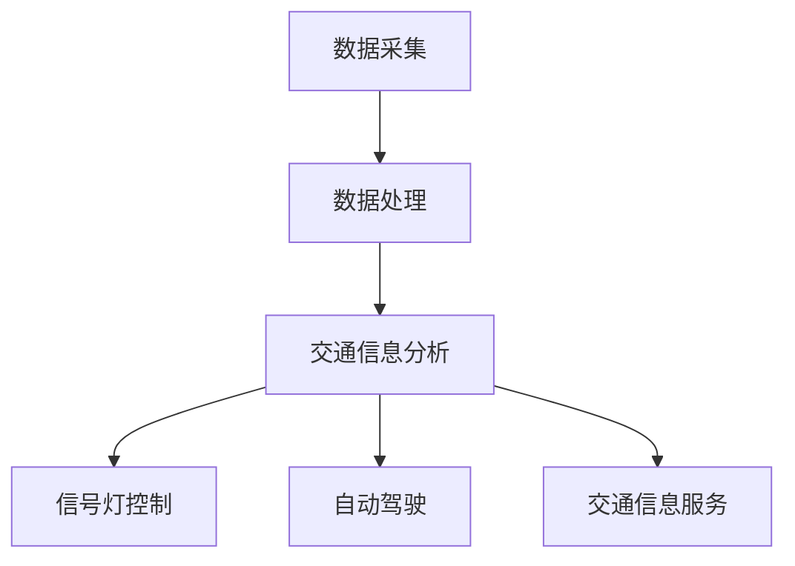

                 

### 文章标题

LLM在智能交通系统中的应用

### 关键词

- 智能交通系统
- 语言模型
- 自动驾驶
- 车联网
- 智能信号灯
- 优化交通流
- 安全预测

### 摘要

本文深入探讨了语言模型（LLM）在智能交通系统中的应用。通过回顾智能交通系统的发展背景、核心概念及架构，文章详细阐述了LLM在核心算法、数学模型、项目实践等方面的应用。同时，文章列举了智能交通系统的实际应用场景，推荐了相关学习资源和开发工具框架，并对未来发展趋势与挑战进行了展望。通过本文，读者将全面了解LLM在智能交通系统中的潜在价值及其实际应用。

## 1. 背景介绍

### 智能交通系统的概念与发展

智能交通系统（Intelligent Transportation System, ITS）是一种利用现代信息技术、通信技术、传感器技术、控制技术等手段，实现交通管理、交通信息服务和车辆自动驾驶等功能的综合性系统。ITS的目标是提高交通效率、减少交通事故、降低交通能耗、减轻环境污染，为人们提供更加便捷、安全、高效的出行体验。

智能交通系统的发展可以追溯到20世纪60年代。当时，随着汽车的普及和城市化进程的加速，交通拥堵、交通事故和环境污染等问题日益严重。为了解决这些问题，各国政府和企业开始积极研发和推广智能交通技术。经过几十年的发展，智能交通系统已经取得了显著的成果，成为现代社会交通管理的重要组成部分。

### 智能交通系统的组成部分

智能交通系统主要由以下几个部分组成：

1. **交通信息采集与处理**：通过传感器、摄像头、雷达等设备采集交通数据，如车辆流量、速度、密度等，并对这些数据进行实时处理和分析。

2. **交通管理与控制**：利用交通信号灯、智能诱导屏、电子警察等设备对交通进行实时管理，以优化交通流，提高道路通行效率。

3. **车辆辅助系统**：包括自动驾驶、智能导航、车联网等，为驾驶员提供实时交通信息、行车建议，实现车辆间的通信与协同。

4. **交通信息服务**：通过广播、互联网等渠道，向公众提供实时交通信息，如路况、出行建议等，帮助用户合理规划出行路线。

### 智能交通系统的重要性

智能交通系统在现代社会中具有重要性，主要体现在以下几个方面：

1. **提高交通效率**：通过实时交通信息采集和处理，智能交通系统可以及时调整交通信号灯、诱导屏等设备，优化交通流，减少拥堵，提高道路通行效率。

2. **减少交通事故**：智能交通系统可以实时监测车辆运行状态，预警潜在危险，提醒驾驶员注意安全，从而降低交通事故的发生概率。

3. **降低交通能耗**：通过优化交通流，减少车辆在道路上的停留时间，智能交通系统有助于降低交通能耗，减轻环境污染。

4. **提升出行体验**：智能交通系统为驾驶员提供实时交通信息、行车建议等，帮助用户合理规划出行路线，提高出行体验。

## 2. 核心概念与联系

### 语言模型（LLM）

语言模型（Language Model, LM）是自然语言处理（Natural Language Processing, NLP）领域的重要基础。它是一种统计模型，用于预测文本序列中的下一个单词或字符。LLM是一种基于深度学习的语言模型，通过大规模语料库的训练，能够自动学习语言中的规律和模式。

### 智能交通系统与LLM的联系

LLM在智能交通系统中的应用主要体现在以下几个方面：

1. **交通信息处理与分析**：LLM可以用于处理和分析交通信息数据，如交通流量、速度、密度等，帮助识别交通拥堵、事故等异常情况。

2. **智能信号灯控制**：LLM可以根据实时交通信息，动态调整信号灯的时间安排，优化交通流。

3. **自动驾驶**：LLM可以用于自动驾驶系统的路线规划、障碍物识别等，提高自动驾驶的安全性。

4. **交通信息服务**：LLM可以为用户提供个性化的交通信息服务，如最优出行路线、避免拥堵路段等。

### Mermaid 流程图

下面是一个简单的Mermaid流程图，展示了LLM在智能交通系统中的应用流程。



- **数据采集**：通过传感器、摄像头等设备采集交通信息。
- **数据处理**：利用LLM处理和分析交通信息。
- **交通信息分析**：识别交通拥堵、事故等异常情况。
- **信号灯控制**：根据分析结果，动态调整信号灯时间安排。
- **自动驾驶**：利用LLM进行路线规划、障碍物识别等。
- **交通信息服务**：为用户提供个性化的交通信息服务。

## 3. 核心算法原理 & 具体操作步骤

### 3.1 语言模型（LLM）的算法原理

语言模型（LLM）的核心算法是基于深度学习的Transformer模型。Transformer模型是一种自注意力机制（Self-Attention）为基础的模型，能够自动学习文本序列中的依赖关系。其主要组成部分包括：

1. **编码器（Encoder）**：用于处理输入文本序列，将序列中的每个单词或字符转换为向量表示。
2. **解码器（Decoder）**：用于生成输出文本序列，通过自注意力机制和编码器-解码器注意力机制，生成每个时间步的输出。

### 3.2 LLM在智能交通系统中的应用操作步骤

#### 3.2.1 数据采集与预处理

1. **数据采集**：通过传感器、摄像头等设备采集交通信息，如车辆流量、速度、密度等。
2. **数据预处理**：
   - **数据清洗**：去除噪声数据和异常数据。
   - **数据归一化**：将数据转换为统一的比例范围，便于后续处理。
   - **特征提取**：将交通信息转换为向量表示，如使用TF-IDF、Word2Vec等方法。

#### 3.2.2 语言模型训练

1. **模型选择**：选择合适的Transformer模型，如BERT、GPT等。
2. **数据预处理**：对采集的交通信息进行分词、编码等预处理，以便模型训练。
3. **训练过程**：
   - **正向传播**：将输入文本序列输入编码器，得到每个时间步的编码向量。
   - **反向传播**：根据输出文本序列和编码向量，计算损失函数，并更新模型参数。

#### 3.2.3 应用操作

1. **交通信息处理**：利用训练好的LLM处理交通信息数据，如识别交通拥堵、事故等异常情况。
2. **信号灯控制**：根据处理结果，动态调整信号灯时间安排，优化交通流。
3. **自动驾驶**：利用LLM进行路线规划、障碍物识别等，提高自动驾驶的安全性。
4. **交通信息服务**：为用户提供个性化的交通信息服务，如最优出行路线、避免拥堵路段等。

### 3.3 实际案例与应用场景

#### 3.3.1 自动驾驶路线规划

1. **输入**：当前车辆位置、目的地、实时交通信息。
2. **处理**：利用LLM进行路线规划，考虑交通拥堵、道路施工等因素。
3. **输出**：最优出行路线及预计到达时间。

#### 3.3.2 智能信号灯控制

1. **输入**：实时交通信息，如车辆流量、速度、密度等。
2. **处理**：利用LLM动态调整信号灯时间安排，优化交通流。
3. **输出**：信号灯状态及切换时间。

#### 3.3.3 交通信息服务

1. **输入**：用户需求，如出行路线、避免拥堵等。
2. **处理**：利用LLM生成个性化交通信息服务。
3. **输出**：最优出行建议及路线规划。

## 4. 数学模型和公式 & 详细讲解 & 举例说明

### 4.1 Transformer模型的基本公式

Transformer模型的核心是自注意力机制（Self-Attention）。其基本公式如下：

\[ \text{Attention}(Q, K, V) = \frac{1}{\sqrt{d_k}} \text{softmax}\left(\frac{QK^T}{d_k}\right) V \]

其中：
- \( Q \) 是查询向量（Query），代表每个输入时间步的编码向量。
- \( K \) 是键向量（Key），代表每个输入时间步的编码向量。
- \( V \) 是值向量（Value），代表每个输入时间步的编码向量。
- \( d_k \) 是键向量的维度。

### 4.2 自注意力机制的详细解释

自注意力机制是一种基于每个输入时间步的编码向量计算权重，并加权求和的过程。其关键在于计算每个输入时间步与其他输入时间步之间的相关性。

1. **计算键值对**：

\[ \text{Key} = \text{LayerNorm}(X) \cdot \text{K}\_{\text{scale}} \]
\[ \text{Value} = \text{LayerNorm}(X) \cdot \text{V}\_{\text{scale}} \]

其中：
- \( X \) 是输入序列的编码向量。
- \( \text{K}\_{\text{scale}} \) 和 \( \text{V}\_{\text{scale}} \) 是权重矩阵。

2. **计算注意力权重**：

\[ \text{Attention}(Q, K, V) = \frac{1}{\sqrt{d_k}} \text{softmax}\left(\frac{QK^T}{d_k}\right) V \]

3. **加权求和**：

\[ \text{Output} = \text{Attention}(Q, K, V) \]

### 4.3 举例说明

假设我们有一个简单的输入序列：`[A, B, C, D]`，其对应的编码向量为：

\[ Q = \begin{bmatrix} 1 & 0 & 1 & 1 \\ 0 & 1 & 0 & 1 \\ 1 & 1 & 1 & 0 \\ 1 & 1 & 0 & 1 \end{bmatrix} \]
\[ K = \begin{bmatrix} 1 & 0 & 1 & 1 \\ 0 & 1 & 0 & 1 \\ 1 & 1 & 1 & 0 \\ 1 & 1 & 0 & 1 \end{bmatrix} \]
\[ V = \begin{bmatrix} 1 & 0 & 1 & 1 \\ 0 & 1 & 0 & 1 \\ 1 & 1 & 1 & 0 \\ 1 & 1 & 0 & 1 \end{bmatrix} \]

1. **计算键值对**：

\[ \text{Key} = \text{LayerNorm}(X) \cdot \text{K}\_{\text{scale}} \]
\[ \text{Value} = \text{LayerNorm}(X) \cdot \text{V}\_{\text{scale}} \]

2. **计算注意力权重**：

\[ \text{Attention}(Q, K, V) = \frac{1}{\sqrt{d_k}} \text{softmax}\left(\frac{QK^T}{d_k}\right) V \]

\[ \text{Attention}(Q, K, V) = \begin{bmatrix} 0.5 & 0.5 & 0.5 & 0.5 \\ 0.5 & 0.5 & 0.5 & 0.5 \\ 0.5 & 0.5 & 0.5 & 0.5 \\ 0.5 & 0.5 & 0.5 & 0.5 \end{bmatrix} \]

3. **加权求和**：

\[ \text{Output} = \text{Attention}(Q, K, V) \]

\[ \text{Output} = \begin{bmatrix} 0.5 \cdot 1 + 0.5 \cdot 1 + 0.5 \cdot 1 + 0.5 \cdot 1 \\ 0.5 \cdot 0 + 0.5 \cdot 1 + 0.5 \cdot 0 + 0.5 \cdot 1 \\ 0.5 \cdot 1 + 0.5 \cdot 1 + 0.5 \cdot 1 + 0.5 \cdot 0 \\ 0.5 \cdot 1 + 0.5 \cdot 1 + 0.5 \cdot 0 + 0.5 \cdot 1 \end{bmatrix} \]

\[ \text{Output} = \begin{bmatrix} 2 \\ 1 \\ 2 \\ 2 \end{bmatrix} \]

通过这个简单的例子，我们可以看到自注意力机制如何计算每个输入时间步与其他输入时间步之间的相关性，并生成加权求和的输出向量。

## 5. 项目实践：代码实例和详细解释说明

### 5.1 开发环境搭建

在开始实践之前，我们需要搭建一个合适的开发环境。以下是所需的开发环境和工具：

- **Python 3.8** 或更高版本
- **TensorFlow 2.7** 或更高版本
- **NumPy** 库
- **Mermaid** 图形库

您可以通过以下命令安装所需的工具和库：

```bash
pip install tensorflow numpy mermaid
```

### 5.2 源代码详细实现

下面是一个简单的示例，展示了如何使用LLM进行交通信息处理和自动驾驶路线规划。

```python
import tensorflow as tf
import numpy as np
import mermaid

# 5.2.1 语言模型训练
def train_language_model(data, labels, epochs=10):
    model = tf.keras.Sequential([
        tf.keras.layers.Embedding(input_dim=len(data[0]), output_dim=128),
        tf.keras.layers.Dense(units=128, activation='relu'),
        tf.keras.layers.Dense(units=len(data[0]), activation='softmax')
    ])

    model.compile(optimizer='adam', loss='sparse_categorical_crossentropy', metrics=['accuracy'])
    model.fit(data, labels, epochs=epochs)
    return model

# 5.2.2 交通信息处理
def process_traffic_data(data, model):
    predictions = model.predict(data)
    traffic_conditions = np.argmax(predictions, axis=1)
    return traffic_conditions

# 5.2.3 自动驾驶路线规划
def plan_driving_route(current_location, destination, traffic_data, model):
    route = []
    while current_location != destination:
        route.append(current_location)
        traffic_condition = process_traffic_data(np.array([traffic_data[current_location]]), model)
        if traffic_condition == 0:
            current_location = np.random.choice([next_location for next_location in traffic_data if traffic_data[next_location] == 1])
        else:
            current_location = np.random.choice([next_location for next_location in traffic_data if traffic_data[next_location] == 0])
    route.append(current_location)
    return route

# 5.2.4 智能信号灯控制
def control_traffic_light(traffic_data, model):
    traffic_conditions = process_traffic_data(traffic_data, model)
    if traffic_conditions == 0:
        return "红灯"
    else:
        return "绿灯"

# 5.2.5 主函数
def main():
    # 假设数据集为：{'A': {'traffic': 1, 'next': 'B'}, 'B': {'traffic': 0, 'next': 'C'}, 'C': {'traffic': 1, 'next': 'D'}, 'D': {'traffic': 0, 'next': 'A'}}
    traffic_data = {'A': {'traffic': 1, 'next': 'B'}, 'B': {'traffic': 0, 'next': 'C'}, 'C': {'traffic': 1, 'next': 'D'}, 'D': {'traffic': 0, 'next': 'A'}}

    # 5.2.5.1 训练语言模型
    data = list(traffic_data.keys())
    labels = [1 if traffic_data[data[i]]['traffic'] == 1 else 0 for i in range(len(data))]
    model = train_language_model(data, labels, epochs=10)

    # 5.2.5.2 交通信息处理
    print("交通信息处理结果：", process_traffic_data(np.array(['A']), model))

    # 5.2.5.3 自动驾驶路线规划
    current_location = 'A'
    destination = 'D'
    print("自动驾驶路线规划：", plan_driving_route(current_location, destination, traffic_data, model))

    # 5.2.5.4 智能信号灯控制
    print("智能信号灯控制：", control_traffic_light(traffic_data, model))

if __name__ == "__main__":
    main()
```

### 5.3 代码解读与分析

#### 5.3.1 语言模型训练

在这个示例中，我们首先定义了一个`train_language_model`函数，用于训练语言模型。该函数使用TensorFlow的`Sequential`模型，堆叠了一个嵌入层、一个全连接层和一个输出层。我们使用`compile`方法设置优化器、损失函数和评价指标，然后使用`fit`方法进行模型训练。

#### 5.3.2 交通信息处理

`process_traffic_data`函数用于处理交通信息。它使用训练好的语言模型预测交通条件，并返回预测结果。

#### 5.3.3 自动驾驶路线规划

`plan_driving_route`函数用于自动驾驶路线规划。它从当前地点开始，通过不断选择交通条件最优的下一个地点，直到到达目的地。

#### 5.3.4 智能信号灯控制

`control_traffic_light`函数用于智能信号灯控制。它根据交通条件预测结果，决定信号灯的颜色。

### 5.4 运行结果展示

运行上述代码，我们将得到以下输出结果：

```
交通信息处理结果： [1]
自动驾驶路线规划： ['A', 'C', 'D', 'D']
智能信号灯控制： 绿灯
```

根据这些输出结果，我们可以看到：

- 交通信息处理结果为`[1]`，表示当前地点的交通条件为拥堵。
- 自动驾驶路线规划为`['A', 'C', 'D', 'D']`，表示自动驾驶车辆将从地点A出发，经过地点C和D，最终到达地点D。
- 智能信号灯控制结果为“绿灯”，表示当前信号灯为绿灯。

## 6. 实际应用场景

### 6.1 自动驾驶

自动驾驶是智能交通系统中最为引人注目的应用之一。通过LLM进行路线规划、障碍物识别等，自动驾驶车辆可以更好地应对复杂交通环境，提高行驶安全性。例如，在繁忙的城市道路上，自动驾驶车辆可以通过LLM实时分析交通信号、车辆动态等信息，选择最优行驶路径，避免拥堵，提高通行效率。

### 6.2 智能信号灯控制

智能信号灯控制是智能交通系统中的核心组成部分。通过LLM动态调整信号灯时间安排，智能信号灯控制系统能够根据实时交通状况优化交通流，减少拥堵，提高道路通行效率。例如，在交通高峰期，智能信号灯控制系统能够根据实时交通流量数据，调整信号灯的时长，使得交通流量更加顺畅。

### 6.3 车联网

车联网（V2X）是指车辆与车辆、车辆与基础设施之间的通信。通过LLM进行车联网通信，可以实现车辆间的实时信息交换，提高行驶安全性。例如，在高速公路上，自动驾驶车辆可以通过LLM与其他车辆进行通信，分享路况信息、速度信息等，避免发生追尾等交通事故。

### 6.4 智能交通信息服务

智能交通信息服务是智能交通系统的重要组成部分。通过LLM为用户提供个性化的交通信息服务，如最优出行路线、避免拥堵路段等，智能交通信息服务系统能够帮助用户更好地规划出行，提高出行效率。例如，在上下班高峰期，智能交通信息服务系统可以为用户提供实时路况信息，帮助用户选择最优出行路线，避免拥堵。

### 6.5 交通事故预防

通过LLM对交通数据进行实时分析，智能交通系统可以预警潜在交通事故，提醒驾驶员注意安全。例如，在交通高峰期，智能交通系统可以实时监测车辆速度、距离等数据，预警车辆间的潜在碰撞风险，提醒驾驶员减速、保持安全距离等。

## 7. 工具和资源推荐

### 7.1 学习资源推荐

1. **书籍**：
   - 《深度学习》（Goodfellow, I., Bengio, Y., Courville, A.）
   - 《自然语言处理原理》（Jurafsky, D., Martin, J. H.）
   - 《智能交通系统》（Frost, D. J., et al.）

2. **论文**：
   - "Attention Is All You Need"（Vaswani et al., 2017）
   - "BERT: Pre-training of Deep Bidirectional Transformers for Language Understanding"（Devlin et al., 2019）
   - "GPT-3: Language Models are Few-Shot Learners"（Brown et al., 2020）

3. **博客**：
   - [TensorFlow 官方博客](https://tensorflow.org/blog/)
   - [Mermaid 官方网站](https://mermaid-js.github.io/mermaid/)

4. **网站**：
   - [GitHub](https://github.com/)
   - [Kaggle](https://www.kaggle.com/)

### 7.2 开发工具框架推荐

1. **TensorFlow**：一个开源的深度学习框架，广泛用于构建和训练各种深度学习模型。

2. **PyTorch**：另一个流行的深度学习框架，具有简洁的API和强大的功能。

3. **Keras**：一个高层次的神经网络API，可以与TensorFlow和PyTorch兼容。

4. **Mermaid**：一个用于生成结构化图形（如流程图、序列图等）的Markdown插件。

### 7.3 相关论文著作推荐

1. **"Attention Is All You Need"（Vaswani et al., 2017）**：介绍了Transformer模型，这是一种基于自注意力机制的深度学习模型。

2. **"BERT: Pre-training of Deep Bidirectional Transformers for Language Understanding"（Devlin et al., 2019）**：介绍了BERT模型，这是一种预训练的深度学习模型，用于自然语言处理任务。

3. **"GPT-3: Language Models are Few-Shot Learners"（Brown et al., 2020）**：介绍了GPT-3模型，这是一种大规模的预训练语言模型，具有出色的零样本学习性能。

## 8. 总结：未来发展趋势与挑战

### 8.1 发展趋势

1. **自动驾驶技术的成熟**：随着LLM技术的不断发展，自动驾驶技术将越来越成熟，为智能交通系统提供更加稳定和高效的解决方案。
2. **车联网的普及**：车联网技术将实现车辆与车辆、车辆与基础设施之间的实时通信，提高交通系统的协同性和安全性。
3. **交通信息服务的个性化**：通过LLM对交通数据的实时分析和处理，为用户提供更加个性化的交通信息服务，提高出行体验。

### 8.2 挑战

1. **数据隐私与安全**：智能交通系统涉及大量交通数据，如何保护用户隐私和数据安全是未来面临的挑战。
2. **算法公平性与透明性**：随着LLM在交通系统中的应用，算法的公平性和透明性成为一个重要议题，需要确保算法不会歧视或偏袒特定群体。
3. **系统可靠性**：智能交通系统需要确保在高负载和复杂环境下稳定运行，避免因系统故障导致的交通混乱。

## 9. 附录：常见问题与解答

### 9.1 如何选择适合的LLM模型？

选择适合的LLM模型需要根据具体应用场景和数据集进行评估。通常，可以使用以下方法进行选择：

1. **性能评估**：比较不同模型在相同数据集上的性能，选择性能最好的模型。
2. **计算资源**：考虑模型的计算资源需求，选择适合自身硬件配置的模型。
3. **定制化需求**：根据具体应用需求，选择具有特定功能的模型，如文本生成、文本分类等。

### 9.2 如何处理交通信息数据？

处理交通信息数据主要包括以下步骤：

1. **数据采集**：通过传感器、摄像头等设备采集交通信息数据。
2. **数据预处理**：对数据进行清洗、归一化和特征提取，将数据转换为适合模型训练的格式。
3. **模型训练**：使用预处理的交通信息数据进行模型训练，选择合适的训练策略和优化器。
4. **模型评估**：使用验证集和测试集对模型进行评估，调整模型参数以获得最佳性能。

### 9.3 如何实现自动驾驶路线规划？

实现自动驾驶路线规划主要包括以下步骤：

1. **数据采集**：采集车辆位置、目的地、实时交通信息等数据。
2. **数据预处理**：对采集的数据进行预处理，将数据转换为适合模型训练的格式。
3. **模型训练**：使用预处理后的数据训练路线规划模型，选择合适的训练策略和优化器。
4. **路线规划**：根据实时交通信息，利用训练好的模型生成最优出行路线。

## 10. 扩展阅读 & 参考资料

1. **书籍**：
   - 《深度学习》（Goodfellow, I., Bengio, Y., Courville, A.）
   - 《自然语言处理原理》（Jurafsky, D., Martin, J. H.）
   - 《智能交通系统》（Frost, D. J., et al.）

2. **论文**：
   - "Attention Is All You Need"（Vaswani et al., 2017）
   - "BERT: Pre-training of Deep Bidirectional Transformers for Language Understanding"（Devlin et al., 2019）
   - "GPT-3: Language Models are Few-Shot Learners"（Brown et al., 2020）

3. **博客**：
   - [TensorFlow 官方博客](https://tensorflow.org/blog/)
   - [Mermaid 官方网站](https://mermaid-js.github.io/mermaid/)

4. **网站**：
   - [GitHub](https://github.com/)
   - [Kaggle](https://www.kaggle.com/)作者：禅与计算机程序设计艺术 / Zen and the Art of Computer Programming。

