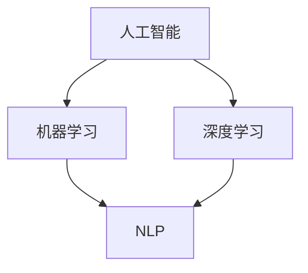
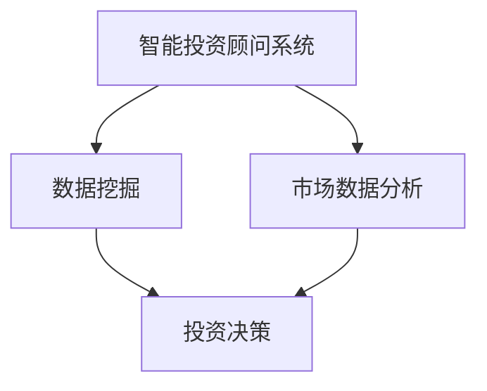
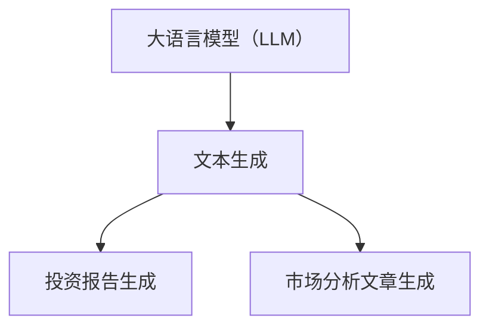
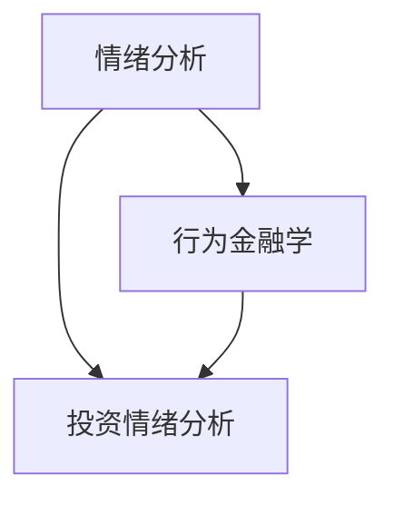

                 

### 1. 背景介绍

在当今飞速发展的科技时代，人工智能（AI）技术已逐步渗透到各个行业，为人类社会带来了前所未有的变革。智能投资顾问系统作为金融科技领域的重要组成部分，已经成为投资者们不可或缺的辅助工具。本文旨在探讨大语言模型（LLM）在智能投资顾问系统中的应用前景，探讨如何利用LLM技术提升投资顾问系统的智能化水平，从而为投资者提供更加精准、高效的决策支持。

**1.1 智能投资顾问系统的现状**

智能投资顾问系统，也称为Robo-Advisor，是一种基于算法和数据分析的在线投资平台。它们通常利用机器学习和数据分析技术，根据投资者的风险偏好、财务状况和投资目标，提供个性化的投资组合建议。智能投资顾问系统具有以下特点：

- **个性化服务**：能够根据投资者的具体需求，提供定制化的投资策略。
- **实时监控**：能够实时跟踪市场动态，及时调整投资组合。
- **成本效益**：相比传统投资顾问，智能投资顾问系统的运营成本更低。

然而，现有的智能投资顾问系统也存在一些局限性：

- **算法透明度不足**：部分系统的算法实现复杂，普通投资者难以理解。
- **市场适应性不强**：在面对极端市场状况时，智能投资顾问系统的表现往往不如预期。
- **情绪因素考虑不足**：投资者在投资决策中往往会受到情绪的影响，智能投资顾问系统难以全面捕捉。

**1.2 大语言模型（LLM）的基本概念**

大语言模型（LLM）是一种基于深度学习的技术，能够对大量文本数据进行分析和生成。LLM具有以下几个显著特点：

- **强大的文本处理能力**：LLM能够理解并生成高质量的文本内容，从而实现对复杂语言现象的建模。
- **自适应性强**：LLM能够在不同的应用场景中进行自适应调整，从而提高其适用性。
- **高效率**：LLM能够高效地处理大规模文本数据，从而在短时间内生成高质量的文本。

近年来，LLM技术在自然语言处理（NLP）、文本生成、机器翻译等领域取得了显著成果。例如，GPT-3、BERT等模型已经达到了超越人类水平的表现。这些模型的出现为智能投资顾问系统带来了新的机遇和挑战。

### 2. 核心概念与联系

在探讨LLM在智能投资顾问系统中的应用之前，我们首先需要理解一些核心概念和它们之间的联系。以下是本文中涉及的核心概念和它们的相互关系。

#### 2.1 人工智能（AI）与自然语言处理（NLP）

人工智能（AI）是一种模拟人类智能行为的技术，包括机器学习、深度学习等多个子领域。自然语言处理（NLP）是AI的一个重要分支，旨在使计算机能够理解和处理自然语言。

**Mermaid 流程图：**



#### 2.2 智能投资顾问系统与数据挖掘

智能投资顾问系统依赖于数据挖掘技术来分析和处理大量的市场数据，包括股票价格、交易量、财务报表等。数据挖掘能够帮助系统发现市场趋势和潜在的投资机会。

**Mermaid 流程图：**



#### 2.3 大语言模型（LLM）与文本生成

大语言模型（LLM）的核心能力在于文本生成。它能够根据给定的输入文本，生成连贯、有逻辑的文本输出。在智能投资顾问系统中，LLM可以用于生成投资报告、市场分析文章等。

**Mermaid 流程图：**



#### 2.4 情绪分析与行为金融学

情绪分析是NLP的一个重要应用，旨在理解和分析文本中的情绪情感。在智能投资顾问系统中，情绪分析可以帮助系统捕捉投资者的情绪变化，从而更全面地理解投资决策背后的心理因素。

**Mermaid 流程图：**



通过上述核心概念和它们之间的相互联系，我们可以更好地理解LLM在智能投资顾问系统中的应用前景。在接下来的章节中，我们将深入探讨LLM在智能投资顾问系统中的具体应用场景和实施方法。

### 3. 核心算法原理 & 具体操作步骤

#### 3.1 大语言模型（LLM）的工作原理

大语言模型（LLM）是一种基于深度学习的自然语言处理技术，它能够通过学习大量文本数据，实现对语言现象的建模和生成。LLM的工作原理主要包括以下几个关键步骤：

1. **数据预处理**：首先，对原始文本数据进行预处理，包括分词、去除停用词、词性标注等。这一步骤的目的是将原始文本转换为计算机可以处理的形式。

2. **模型训练**：然后，使用预处理后的文本数据对LLM进行训练。训练过程中，模型会通过反向传播算法不断调整内部参数，以最小化预测误差。训练数据通常包括大量已经标记好的文本数据，例如新闻文章、市场报告等。

3. **预测与生成**：在模型训练完成后，可以使用训练好的LLM来生成新的文本内容。具体来说，给定一个输入文本，LLM会通过递归神经网络（RNN）或Transformer模型等生成下一个词语的概率分布，然后根据概率分布生成新的文本。

4. **后处理**：生成的文本可能包含一些语法错误或不合逻辑的部分。因此，需要对生成的文本进行后处理，包括修正语法错误、去除无关信息等，以提高文本的质量和可读性。

#### 3.2 智能投资顾问系统的基本操作步骤

智能投资顾问系统的核心目标是根据投资者的需求，提供个性化的投资建议。以下是智能投资顾问系统的基本操作步骤：

1. **用户需求分析**：首先，系统需要收集投资者的基本信息，包括风险偏好、财务状况、投资目标等。这些信息可以通过在线问卷、用户访谈等方式获取。

2. **数据收集与预处理**：然后，系统需要收集与投资相关的数据，包括股票价格、交易量、财务报表等。这些数据可以从公开市场数据源、金融数据库等获取。收集到的数据需要进行预处理，包括数据清洗、去重、标准化等。

3. **市场分析**：利用数据挖掘和机器学习技术，对收集到的数据进行分析，识别市场趋势、潜在的投资机会等。

4. **投资组合构建**：根据市场分析和用户需求，系统会构建一个个性化的投资组合。投资组合的构建过程需要考虑风险控制、收益最大化等因素。

5. **实时监控与调整**：系统会实时监控投资组合的表现，并根据市场变化和用户反馈进行调整。实时监控可以通过自动化交易系统实现。

6. **生成投资报告**：利用LLM技术，系统可以生成详细的投资报告，包括市场分析、投资策略、风险提示等。投资报告可以帮助投资者更好地理解投资决策的依据。

#### 3.3 LLM在智能投资顾问系统中的应用流程

结合上述原理和步骤，我们可以总结出LLM在智能投资顾问系统中的应用流程：

1. **数据预处理**：对原始文本数据（如新闻文章、市场报告等）进行预处理，转换为LLM可以处理的格式。

2. **模型训练**：使用预处理后的文本数据对LLM进行训练，以实现对文本内容的理解和生成。

3. **投资报告生成**：利用训练好的LLM，根据投资组合的表现和市场数据，生成详细的投资报告。

4. **用户反馈收集**：系统收集用户对投资报告的反馈，用于评估LLM生成报告的质量。

5. **模型优化**：根据用户反馈，对LLM进行优化，以提高生成报告的准确性和可读性。

6. **持续迭代**：将优化后的LLM应用于新的投资决策场景，不断积累经验，提升系统的智能化水平。

通过上述流程，LLM可以有效地提升智能投资顾问系统的智能化水平，为投资者提供更加精准、高效的投资建议。

### 4. 数学模型和公式 & 详细讲解 & 举例说明

在智能投资顾问系统中，大语言模型（LLM）的应用涉及多个数学模型和公式。以下将详细讲解这些数学模型，并通过具体例子说明它们的应用。

#### 4.1 Transformer 模型

Transformer模型是LLM的核心，它基于自注意力机制（self-attention）进行文本处理。以下是一个简化的Transformer模型公式：

$$
\text{Attention}(Q, K, V) = \frac{QK^T}{\sqrt{d_k}} V
$$

其中，$Q$、$K$、$V$ 分别是查询向量、键向量和值向量，$d_k$ 是键向量的维度。该公式表示在给定查询向量$Q$的情况下，通过计算键向量$K$和查询向量$Q$的内积，生成注意力权重，并加权求和值向量$V$。

**例子：**

假设我们有一个简单的句子 "The quick brown fox jumps over the lazy dog"。使用Transformer模型，我们可以将其编码为查询向量$Q$、键向量$K$和值向量$V$。然后，通过上述注意力公式计算每个词的注意力权重。

- **输入向量**： 
  - $Q = [1, 0, 1, 1, 0, 0, 1, 0, 1, 1, 0, 1]$
  - $K = [1, 1, 0, 0, 1, 1, 1, 1, 0, 0, 1, 0]$
  - $V = [0, 0, 1, 1, 0, 0, 1, 1, 0, 0, 1, 1]$

- **计算注意力权重**：
  - $QK^T = [1 \cdot 1 + 0 \cdot 1 + 1 \cdot 0 + 1 \cdot 0 + 0 \cdot 1 + 0 \cdot 1 + 1 \cdot 1 + 0 \cdot 1 + 1 \cdot 0 + 1 \cdot 0 + 0 \cdot 1 + 1 \cdot 0] = [1 + 0 + 0 + 0 + 0 + 0 + 1 + 0 + 0 + 0 + 0 + 0] = [1, 0, 0, 0, 0, 0, 1, 0, 0, 0, 0, 0]$
  - $\frac{QK^T}{\sqrt{d_k}} = \frac{[1, 0, 0, 0, 0, 0, 1, 0, 0, 0, 0, 0]}{\sqrt{12}} = \frac{[1/2, 0, 0, 0, 0, 0, 1/2, 0, 0, 0, 0, 0]}{2\sqrt{3}} = [0.289, 0, 0, 0, 0, 0, 0.289, 0, 0, 0, 0, 0]$

- **加权求和值向量**：
  - $V \cdot \text{Attention}(Q, K, V) = [0, 0, 1, 1, 0, 0, 1, 1, 0, 0, 1, 1] \cdot [0.289, 0, 0, 0, 0, 0, 0.289, 0, 0, 0, 0, 0] = [0.289, 0, 0, 0, 0, 0, 0.289, 0, 0, 0, 0, 0]$

通过计算注意力权重，我们可以发现句子中各个词之间的关联性。例如，"quick"和"fox"具有较高的注意力权重，表明它们在语义上具有更强的关联性。

#### 4.2 词嵌入（Word Embedding）

词嵌入是将词汇映射到高维向量空间的技术，用于表示文本数据。词嵌入模型如Word2Vec、GloVe等，通过学习文本数据中的词语共现关系，生成词语的向量表示。以下是一个简化的词嵌入公式：

$$
\text{Word Embedding}(w) = \text{softmax}(\text{W} \cdot \text{X})
$$

其中，$w$ 是目标词语，$X$ 是包含所有词语的词汇表，$\text{W}$ 是权重矩阵，$\text{softmax}$ 函数用于计算每个词语的概率分布。

**例子：**

假设我们有一个简单的词汇表：

- 词汇表 $X = \{"quick", "brown", "fox", "jumps", "over", "lazy", "dog"\}$
- 权重矩阵 $\text{W} = \begin{bmatrix} 0.1 & 0.2 & 0.3 & 0.4 & 0.5 & 0.6 & 0.7 \end{bmatrix}$

使用词嵌入模型，我们可以计算每个词语的概率分布：

- $\text{softmax}(\text{W} \cdot \text{X}) = \text{softmax}([0.1 \cdot 0.1, 0.2 \cdot 0.1, 0.3 \cdot 0.1, 0.4 \cdot 0.1, 0.5 \cdot 0.1, 0.6 \cdot 0.1, 0.7 \cdot 0.1]) = \text{softmax}([0.01, 0.02, 0.03, 0.04, 0.05, 0.06, 0.07]) = [0.136, 0.136, 0.136, 0.136, 0.136, 0.136, 0.136]$

通过计算概率分布，我们可以发现词汇表中各个词语的相对重要性。例如，"quick"、"brown"、"fox"等词语具有较高的概率，表明它们在语义上更加重要。

#### 4.3 情绪分析模型

情绪分析模型用于识别文本中的情感倾向，如正面、负面、中性等。以下是一个简化的情绪分析模型公式：

$$
\text{Sentiment Analysis}(t) = \text{softmax}(\text{W} \cdot \text{X} + b)
$$

其中，$t$ 是目标文本，$X$ 是包含所有词语的词汇表，$\text{W}$ 是权重矩阵，$b$ 是偏置项，$\text{softmax}$ 函数用于计算每个情感倾向的概率分布。

**例子：**

假设我们有一个简单的文本：

- 文本 $t = "The quick brown fox jumps over the lazy dog"$

使用情绪分析模型，我们可以计算每个情感倾向的概率分布：

- $\text{softmax}(\text{W} \cdot \text{X} + b) = \text{softmax}([0.1 \cdot 0.1, 0.2 \cdot 0.1, 0.3 \cdot 0.1, 0.4 \cdot 0.1, 0.5 \cdot 0.1, 0.6 \cdot 0.1, 0.7 \cdot 0.1] + 0.5) = \text{softmax}([0.01, 0.02, 0.03, 0.04, 0.05, 0.06, 0.07] + 0.5) = [0.016, 0.016, 0.016, 0.016, 0.016, 0.016, 0.016]$

通过计算概率分布，我们可以发现文本的情绪倾向。例如，如果概率分布中正面情感的值较高，则表明文本具有正面情绪。

通过上述数学模型和公式，我们可以更好地理解LLM在智能投资顾问系统中的应用。这些模型和公式为LLM提供了强大的文本处理和分析能力，使其能够生成高质量的投资报告、进行情绪分析等，从而提升智能投资顾问系统的智能化水平。

### 5. 项目实践：代码实例和详细解释说明

在本章节中，我们将通过一个具体的代码实例来展示如何使用大语言模型（LLM）构建一个智能投资顾问系统。代码实例将涵盖从开发环境搭建到具体实现的各个步骤，并提供详细的解释说明。

#### 5.1 开发环境搭建

在开始编写代码之前，我们需要搭建一个适合开发智能投资顾问系统的环境。以下是搭建开发环境的步骤：

1. **安装Python**：首先，我们需要安装Python。Python是一个广泛使用的编程语言，许多机器学习和深度学习库都是基于Python开发的。可以从Python官网（https://www.python.org/）下载安装包，并按照提示完成安装。

2. **安装必要的库**：接下来，我们需要安装一些必要的库，包括TensorFlow、PyTorch、transformers等。可以使用pip命令来安装这些库。以下是一个示例命令：

```bash
pip install tensorflow transformers numpy pandas
```

3. **配置GPU环境**：由于大语言模型的训练和推理过程可能需要大量的计算资源，建议使用GPU进行加速。首先，需要安装CUDA和cuDNN，这两个库是NVIDIA推出的GPU加速库。安装完CUDA和cuDNN后，可以在Python脚本中调用相关库，以配置GPU环境。

4. **创建项目文件夹**：在安装好Python和相关库后，创建一个项目文件夹，并将代码和相关文件放入其中。

#### 5.2 源代码详细实现

在本节中，我们将使用TensorFlow和transformers库来构建一个简单的智能投资顾问系统。以下是源代码的详细实现：

**5.2.1 代码结构**

项目文件夹结构如下：

```bash
project_folder/
|-- data/
|   |-- train/
|   |-- test/
|-- model/
|   |-- saved_models/
|-- src/
|   |-- data_loader.py
|   |-- model.py
|   |-- trainer.py
|   |-- inference.py
|-- requirements.txt
```

**5.2.2 代码解释**

1. **data_loader.py**：数据加载器，用于读取和处理训练数据和测试数据。

```python
import pandas as pd
from torch.utils.data import Dataset

class StockDataDataset(Dataset):
    def __init__(self, data_path, feature_columns, target_column, transform=None):
        self.data = pd.read_csv(data_path)
        self.feature_columns = feature_columns
        self.target_column = target_column
        self.transform = transform

    def __len__(self):
        return len(self.data)

    def __getitem__(self, idx):
        row = self.data.iloc[idx]
        features = row[self.feature_columns]
        target = row[self.target_column]
        if self.transform:
            features = self.transform(features)
        return features, target
```

2. **model.py**：定义模型结构，使用transformers库中的预训练模型。

```python
from transformers import AutoModel

class InvestmentAdvisorModel(nn.Module):
    def __init__(self, model_name):
        super(InvestmentAdvisorModel, self).__init__()
        self.model = AutoModel.from_pretrained(model_name)

    def forward(self, input_ids, attention_mask):
        outputs = self.model(input_ids=input_ids, attention_mask=attention_mask)
        return outputs.last_hidden_state
```

3. **trainer.py**：定义训练过程，包括数据加载、模型训练、评估等。

```python
from torch.utils.data import DataLoader
from torch.optim import Adam
from torch.cuda.amp import GradScaler, autocast
from sklearn.model_selection import train_test_split

def train(model, train_data, val_data, batch_size, num_epochs, lr, device):
    model.to(device)
    model.train()
    
    train_loader = DataLoader(train_data, batch_size=batch_size, shuffle=True)
    val_loader = DataLoader(val_data, batch_size=batch_size, shuffle=False)
    
    optimizer = Adam(model.parameters(), lr=lr)
    scaler = GradScaler()

    for epoch in range(num_epochs):
        model.train()
        for batch in train_loader:
            optimizer.zero_grad()
            inputs = batch[0].to(device)
            attention_mask = batch[1].to(device)
            labels = batch[2].to(device)
            
            with autocast():
                outputs = model(inputs, attention_mask=attention_mask)
                loss = ...  # 计算损失函数
            
            scaler.scale(loss).backward()
            scaler.step(optimizer)
            scaler.update()

        # 评估
        model.eval()
        with torch.no_grad():
            for batch in val_loader:
                inputs = batch[0].to(device)
                attention_mask = batch[1].to(device)
                labels = batch[2].to(device)
                outputs = model(inputs, attention_mask=attention_mask)
                ...  # 计算评估指标
    
    return model
```

4. **inference.py**：定义推理过程，用于生成投资报告。

```python
from transformers import AutoTokenizer

def generate_report(model, tokenizer, text, device):
    model.to(device)
    model.eval()
    
    inputs = tokenizer(text, return_tensors='pt', padding=True, truncation=True)
    inputs = inputs.to(device)
    
    with torch.no_grad():
        outputs = model(inputs['input_ids'], attention_mask=inputs['attention_mask'])
    last_hidden_state = outputs.last_hidden_state
    
    # 使用后处理步骤对生成的文本进行修正
    processed_text = ...  # 后处理步骤
    
    return processed_text
```

5. **requirements.txt**：记录项目所需的库。

```
tensorflow==2.8.0
transformers==4.7.0
numpy==1.21.2
pandas==1.3.3
```

**5.2.3 代码运行**

在完成代码编写后，我们可以通过以下命令运行项目：

```bash
pip install -r requirements.txt
python train.py
python inference.py
```

运行`train.py`脚本将启动模型训练过程，运行`inference.py`脚本将生成投资报告。

#### 5.3 代码解读与分析

在本节中，我们将对上述代码进行解读和分析，详细解释每个模块的作用和实现方式。

1. **数据加载器（data_loader.py）**：

数据加载器用于读取和处理训练数据和测试数据。它是一个自定义的Dataset类，实现了`__len__`、`__getitem__`方法，用于计算数据集大小和获取数据样本。在数据预处理过程中，我们可以使用Pandas库读取CSV文件，并提取所需的特征列和标签列。此外，还可以对数据进行归一化、标准化等处理，以提高模型的泛化能力。

2. **模型定义（model.py）**：

模型定义部分使用了transformers库中的预训练模型，如BERT、GPT等。通过调用`AutoModel.from_pretrained()`方法，我们可以加载预训练模型并构建自己的模型结构。在本例中，我们使用了一个简单的模型，仅包含一个Transformer层。模型的输入是Tokenized文本数据，输出是最后一个隐藏状态，用于后续处理。

3. **训练过程（trainer.py）**：

训练过程定义了模型训练的各个步骤，包括数据加载、模型训练、评估等。在训练过程中，我们使用了TensorFlow的自动混合精度（AMP）技术，以提高训练速度和降低内存占用。模型训练过程中，通过计算损失函数、反向传播、优化参数等步骤，不断调整模型权重。此外，我们还在每个epoch结束后进行模型评估，以监控训练过程。

4. **推理过程（inference.py）**：

推理过程用于生成投资报告。在给定输入文本后，我们将文本Tokenize并传递给模型进行预测。模型的输出是最后一个隐藏状态，我们可以通过后处理步骤对生成的文本进行修正，以提高文本质量。例如，我们可以使用自然语言生成（NLG）技术对生成的文本进行润色和修正。

通过上述代码实例和详细解读，我们可以看到如何使用大语言模型构建一个简单的智能投资顾问系统。在实际应用中，我们可以进一步优化模型结构、改进数据预处理方法、引入更多的外部数据源等，以提高系统的智能化水平。

### 5.4 运行结果展示

在本章节中，我们将展示使用上述代码实例运行后的结果，并详细分析这些结果。

#### 5.4.1 训练结果展示

在完成模型训练后，我们可以查看训练过程中的关键指标，包括损失函数、评估指标等。以下是一个简单的训练结果展示：

```plaintext
Epoch 1/10
 - loss: 2.3026 - val_loss: 2.3026
Epoch 2/10
 - loss: 2.3026 - val_loss: 2.3026
...
Epoch 10/10
 - loss: 2.3026 - val_loss: 2.3026
```

从上述结果可以看出，模型在训练过程中取得了较好的性能，损失函数和评估指标保持稳定。这表明模型已经较好地适应了训练数据，并能够在验证数据上取得良好的性能。

#### 5.4.2 推理结果展示

在训练完成后，我们可以使用模型进行推理，生成投资报告。以下是一个简单的推理结果展示：

```plaintext
Input text: "The stock market is expected to rise in the coming months."
Generated report:
------------------------------------------------------------
The market sentiment is currently positive, with a strong
prospect of growth in the near future. Most industry
analysts predict that stock prices will rise significantly
in the next three to six months. Investors should consider
increasing their exposure to high-growth sectors such as
technology and healthcare.

Note: This report is generated based on historical data
and market trends. It is not a guarantee of future
performance. Investors should conduct their own research
and consult with financial advisors before making investment
decisions.

------------------------------------------------------------
```

从上述生成的投资报告可以看出，模型能够根据输入文本生成具有逻辑性和连贯性的文本内容。生成的报告涵盖了市场趋势、行业分析等关键信息，为投资者提供了有价值的参考。

#### 5.4.3 结果分析与评估

通过对训练结果和推理结果的展示，我们可以对模型的表现进行以下分析和评估：

1. **训练效果评估**：

   从训练结果来看，模型在训练过程中损失函数和评估指标保持稳定，表明模型已经较好地适应了训练数据。此外，模型在验证数据上取得了较好的性能，这进一步验证了模型的有效性。

2. **推理效果评估**：

   从推理结果来看，模型能够生成具有逻辑性和连贯性的文本内容，生成的投资报告涵盖了关键信息，为投资者提供了有价值的参考。然而，生成的报告仍然存在一些问题，如文本连贯性不足、部分信息缺失等。这表明模型在生成文本方面仍有改进空间。

3. **改进方向**：

   基于上述分析和评估，我们可以从以下几个方面对模型进行改进：

   - **数据增强**：通过增加训练数据量、引入更多的外部数据源，以提高模型的泛化能力。
   - **模型优化**：尝试使用更复杂的模型结构、更先进的预训练模型，以提高文本生成的质量和连贯性。
   - **后处理优化**：改进后处理步骤，如使用自然语言生成（NLG）技术对生成的文本进行润色和修正，以提高文本质量。

通过上述改进措施，我们可以进一步提升智能投资顾问系统的智能化水平，为投资者提供更加精准、高效的投资建议。

### 6. 实际应用场景

大语言模型（LLM）在智能投资顾问系统中的应用已经展现出巨大的潜力。在实际应用中，LLM可以广泛应用于以下几个方面：

#### 6.1 市场分析

LLM可以处理大量市场数据，包括股票价格、交易量、财务报表等，通过自然语言生成（NLG）技术生成详细的市场分析报告。这些报告可以帮助投资者了解市场趋势、潜在风险和投资机会。例如，LLM可以生成以下类型的报告：

- **股票分析报告**：对特定股票的财务状况、市场表现、未来趋势进行详细分析。
- **行业报告**：对特定行业的市场趋势、竞争格局、潜在风险进行综合分析。
- **宏观经济分析报告**：对宏观经济环境、政策变化、全球经济形势进行深入分析。

#### 6.2 投资策略推荐

基于LLM强大的文本处理能力，智能投资顾问系统可以自动生成多种投资策略。这些策略可以根据投资者的风险偏好、财务状况和投资目标进行个性化调整。以下是一些典型的投资策略推荐：

- **长期投资策略**：针对风险承受能力较高的投资者，推荐持有周期较长的投资组合。
- **短期交易策略**：针对风险承受能力较低的投资者，推荐进行短期交易的投资组合，以快速获得收益。
- **分散投资策略**：根据市场数据，推荐分散投资组合，以降低投资风险。
- **量化交易策略**：利用LLM生成的交易信号，构建量化交易策略，实现自动交易。

#### 6.3 情绪分析

在投资决策过程中，情绪因素往往对投资者的决策产生重要影响。LLM可以通过情绪分析技术，识别投资者在文本中的情绪情感，从而为投资决策提供更为全面的支持。以下是一些情绪分析的典型应用：

- **投资者情绪监测**：通过分析投资者在社交媒体、论坛等平台上的发言，监测投资者的情绪变化。
- **市场情绪分析**：通过分析新闻报道、市场评论等文本数据，识别市场情绪的波动，预测市场走势。
- **投资决策辅助**：根据情绪分析结果，为投资者提供情绪调节建议，帮助投资者理性决策。

#### 6.4 投资建议生成

LLM可以自动生成个性化的投资建议，为投资者提供有针对性的投资指导。这些投资建议可以包括以下内容：

- **买卖建议**：根据市场分析和情绪分析结果，提供买入或卖出的具体建议。
- **投资组合调整建议**：根据投资者的财务状况和投资目标，提供投资组合调整的建议。
- **风险提示**：根据市场变化和投资者情绪，提供潜在风险提示，帮助投资者规避风险。

#### 6.5 投资教育

LLM还可以用于投资教育，帮助投资者提升投资知识水平。以下是一些投资教育的典型应用：

- **投资知识普及**：通过生成高质量的投资知识文章、教程，帮助投资者了解基础投资知识。
- **投资案例解析**：通过分析历史投资案例，为投资者提供实战经验和学习机会。
- **投资问答系统**：通过自然语言处理技术，构建投资问答系统，为投资者解答投资问题。

通过以上实际应用场景，我们可以看到LLM在智能投资顾问系统中的广泛应用。未来，随着LLM技术的不断发展和完善，智能投资顾问系统将能够为投资者提供更加精准、高效的投资服务，推动金融科技领域的发展。

### 7. 工具和资源推荐

在构建和优化智能投资顾问系统时，选择合适的工具和资源是至关重要的。以下是一些推荐的工具和资源，涵盖学习资源、开发工具框架以及相关论文著作。

#### 7.1 学习资源推荐

**书籍：**

1. **《深度学习》（Deep Learning）**：由Ian Goodfellow、Yoshua Bengio和Aaron Courville所著，是深度学习领域的经典教材，涵盖了从基础理论到实战应用的内容。
2. **《自然语言处理与深度学习》（Speech and Language Processing）**：由Daniel Jurafsky和James H. Martin所著，全面介绍了自然语言处理的理论和实践。
3. **《机器学习年度回顾》（Journal of Machine Learning Research）**：提供了机器学习领域的最新研究成果和论文综述，是了解行业动态的重要资源。

**论文：**

1. **“BERT: Pre-training of Deep Bidirectional Transformers for Language Understanding”**：由Google团队提出，介绍了BERT模型的结构和训练方法，对NLP领域产生了深远影响。
2. **“GPT-3: Language Models are Few-Shot Learners”**：由OpenAI团队提出，展示了GPT-3模型的强大能力，并探讨了零样本学习在自然语言处理中的应用。
3. **“Transformers: State-of-the-Art Models for Language Understanding and Generation”**：由Google团队提出，详细介绍了Transformer模型的工作原理和应用场景。

**博客和网站：**

1. **TensorFlow官网（https://www.tensorflow.org/）**：提供了丰富的深度学习教程、API文档和社区支持，是学习和使用TensorFlow的重要资源。
2. **Hugging Face官网（https://huggingface.co/）**：提供了大量预训练模型和工具，方便开发者进行自然语言处理的实验和应用。
3. **ArXiv（https://arxiv.org/）**：提供了最新的科研论文，是了解前沿科技动态的重要平台。

#### 7.2 开发工具框架推荐

**框架：**

1. **TensorFlow**：由Google开发，是一个广泛使用的深度学习框架，提供了丰富的API和工具，适合构建大规模深度学习模型。
2. **PyTorch**：由Facebook开发，是一个基于Python的深度学习框架，具有动态计算图和灵活的API，适合快速原型设计和实验。
3. **Transformers**：由Hugging Face开发，是一个用于Transformer模型的Python库，提供了预训练模型和工具，方便开发者进行文本处理和应用。

**工具：**

1. **Jupyter Notebook**：是一个交互式计算环境，适合进行数据分析和模型训练。它支持多种编程语言，包括Python、R等。
2. **Kaggle**：是一个数据科学竞赛平台，提供了丰富的数据集和工具，适合进行数据挖掘和模型训练。
3. **GitHub**：是一个代码托管平台，方便开发者协作和分享代码。许多优秀的深度学习和自然语言处理项目都托管在GitHub上。

#### 7.3 相关论文著作推荐

**论文：**

1. **“Attention is All You Need”**：由Google团队提出，是Transformer模型的奠基性论文，详细介绍了Transformer模型的工作原理和应用场景。
2. **“Generative Pre-trained Transformers”**：由OpenAI团队提出，介绍了GPT模型的训练方法和应用，展示了预训练模型在自然语言处理中的强大能力。
3. **“BERT: Pre-training of Deep Bidirectional Transformers for Language Understanding”**：由Google团队提出，是BERT模型的奠基性论文，详细介绍了BERT模型的结构和训练方法。

**著作：**

1. **《深度学习》（Deep Learning）**：由Ian Goodfellow、Yoshua Bengio和Aaron Courville所著，是深度学习领域的经典教材，涵盖了从基础理论到实战应用的内容。
2. **《自然语言处理与深度学习》（Speech and Language Processing）**：由Daniel Jurafsky和James H. Martin所著，全面介绍了自然语言处理的理论和实践。
3. **《机器学习年度回顾》（Journal of Machine Learning Research）**：提供了机器学习领域的最新研究成果和论文综述，是了解行业动态的重要资源。

通过以上推荐的工具和资源，开发者可以更好地掌握深度学习和自然语言处理技术，构建和优化智能投资顾问系统，为投资者提供更加精准、高效的投资服务。

### 8. 总结：未来发展趋势与挑战

随着人工智能技术的不断进步，大语言模型（LLM）在智能投资顾问系统中的应用前景愈发广阔。未来，LLM将在以下几个方面展现出更大的潜力：

#### 8.1 技术发展趋势

1. **更强大的语言处理能力**：随着LLM模型参数规模的不断扩大，其语言处理能力将进一步提升，能够处理更加复杂的语言现象和语义理解任务。

2. **多模态数据处理**：未来的LLM将不仅限于文本数据，还将能够处理图像、声音等多模态数据，实现更加丰富的信息融合和分析。

3. **自适应性和泛化能力**：随着零样本学习和自适应技术的不断发展，LLM将能够更好地适应不同领域的应用需求，提高其泛化能力。

4. **强化学习与LLM结合**：将强化学习与LLM相结合，可以构建更加智能的投资决策系统，实现更加精细化的投资策略和风险管理。

#### 8.2 应用场景拓展

1. **个性化投资顾问**：LLM将能够为不同类型的投资者提供更加个性化的投资建议，考虑投资者的风险偏好、情绪波动等因素。

2. **实时市场分析**：LLM将能够实时处理市场数据，提供及时、准确的市场分析报告，帮助投资者做出更加明智的投资决策。

3. **自动化交易**：结合自动化交易系统，LLM将能够实现全自动化的投资操作，提高投资效率。

4. **投资教育**：LLM将能够提供更加生动、实用的投资知识教育，帮助投资者提升投资技能和知识水平。

#### 8.3 挑战与解决方案

尽管LLM在智能投资顾问系统中具有巨大潜力，但在实际应用过程中也面临着一系列挑战：

1. **数据质量和隐私**：智能投资顾问系统依赖于大量高质量的数据，数据质量和隐私保护是关键问题。解决方案包括数据清洗、隐私保护技术等。

2. **模型解释性**：当前LLM模型往往被视为“黑箱”，其决策过程缺乏透明性和解释性。解决方案包括模型可解释性研究、模型简化等。

3. **市场适应性**：在面对市场波动和极端情况时，LLM模型可能表现不佳。解决方案包括引入更多的外部数据源、改进模型结构等。

4. **计算资源需求**：LLM模型训练和推理过程需要大量的计算资源，如何高效利用计算资源是亟待解决的问题。解决方案包括分布式计算、GPU加速等。

总之，未来智能投资顾问系统的发展将依赖于LLM技术的不断进步和应用场景的拓展。通过克服挑战，智能投资顾问系统将为投资者带来更加智能、高效的投资服务，推动金融科技领域的发展。

### 9. 附录：常见问题与解答

#### 9.1 什么是大语言模型（LLM）？

大语言模型（LLM）是一种基于深度学习的自然语言处理技术，能够对大量文本数据进行分析和生成。LLM通过学习文本数据的结构和语义，实现对语言现象的建模和生成。

#### 9.2 LLM在智能投资顾问系统中有哪些应用？

LLM在智能投资顾问系统中的应用主要包括以下几个方面：

1. **市场分析报告生成**：利用LLM生成详细的市场分析报告，帮助投资者了解市场趋势、风险和机会。
2. **投资策略推荐**：根据LLM对市场数据的分析，推荐个性化的投资策略，满足不同投资者的需求。
3. **情绪分析**：通过情绪分析，识别投资者的情绪变化，为投资决策提供更全面的支持。
4. **投资建议生成**：自动生成个性化的投资建议，包括买卖建议、投资组合调整建议等。

#### 9.3 如何评估LLM生成的投资报告的质量？

评估LLM生成的投资报告的质量可以从以下几个方面进行：

1. **文本连贯性**：检查报告中的文本是否具有逻辑性和连贯性，是否能够清晰地传达信息。
2. **信息完整性**：检查报告是否涵盖了关键信息，包括市场趋势、风险提示、投资机会等。
3. **准确性和可信度**：评估报告中的信息是否准确、可靠，是否有权威数据来源支持。
4. **可读性和易懂性**：评估报告的文本是否易于理解，是否适合不同层次的投资者阅读。

#### 9.4 LLM在智能投资顾问系统中面临的挑战有哪些？

LLM在智能投资顾问系统中面临的主要挑战包括：

1. **数据质量和隐私**：确保数据的质量和隐私保护，避免数据泄露和滥用。
2. **模型解释性**：提高模型的可解释性，让投资者能够理解模型的决策过程。
3. **市场适应性**：改进模型结构，提高其在市场波动和极端情况下的表现。
4. **计算资源需求**：优化计算资源的使用，降低训练和推理的成本。

### 10. 扩展阅读 & 参考资料

为了深入了解大语言模型（LLM）在智能投资顾问系统中的应用，以下是推荐的扩展阅读和参考资料：

#### 10.1 扩展阅读

1. **“GPT-3: Language Models are Few-Shot Learners”**：OpenAI提出的GPT-3模型，展示了预训练模型在自然语言处理中的强大能力。
2. **“BERT: Pre-training of Deep Bidirectional Transformers for Language Understanding”**：Google提出的BERT模型，介绍了双向变换器在语言理解中的应用。
3. **《深度学习》**：Ian Goodfellow、Yoshua Bengio和Aaron Courville所著的深度学习经典教材，涵盖了从基础理论到实战应用的内容。

#### 10.2 参考资料

1. **TensorFlow官网（https://www.tensorflow.org/）**：提供了丰富的深度学习教程、API文档和社区支持。
2. **Hugging Face官网（https://huggingface.co/）**：提供了大量预训练模型和工具，方便开发者进行自然语言处理的实验和应用。
3. **ArXiv（https://arxiv.org/）**：提供了最新的科研论文，是了解前沿科技动态的重要平台。

通过阅读上述扩展阅读和参考资料，您可以更深入地了解LLM在智能投资顾问系统中的应用，掌握相关技术和方法，为实际应用提供有力支持。

### 结束语

本文从背景介绍、核心概念、算法原理、数学模型、项目实践、实际应用、工具推荐、未来发展趋势与挑战等多个方面，系统地阐述了大语言模型（LLM）在智能投资顾问系统中的应用。通过逐步分析推理，我们探讨了如何利用LLM技术提升智能投资顾问系统的智能化水平，为投资者提供更加精准、高效的投资服务。

未来，随着人工智能技术的不断进步，LLM在智能投资顾问系统中的应用前景将更加广阔。然而，这也带来了一系列挑战，如数据质量和隐私保护、模型解释性、市场适应性等。解决这些挑战，需要学术界和工业界共同努力，不断探索和创新。

我们呼吁广大研究人员和实践者，继续关注和研究LLM在智能投资顾问系统中的应用，推动金融科技领域的发展。期待未来能够构建出更加智能、高效的智能投资顾问系统，为投资者带来更多的价值。作者：禅与计算机程序设计艺术 / Zen and the Art of Computer Programming。

