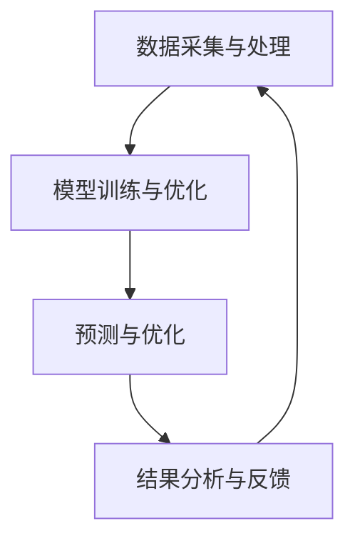
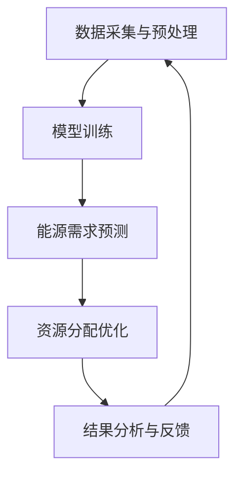

                 

### 背景介绍

**LLM与能源管理：现代需求的契合**

近年来，人工智能（AI）技术在各个领域得到了迅猛发展，特别是在能源管理方面。能源管理是一个复杂且关键的任务，涉及到资源优化、成本控制、环境友好等多方面的要求。随着全球能源需求的不断增长和能源结构的多样化，如何高效地管理和分配能源资源成为了一个亟待解决的问题。

大语言模型（LLM，Large Language Model），如GPT-3、BERT等，以其强大的自然语言处理能力和深度学习能力，为能源管理提供了新的解决方案。LLM能够处理和理解大量的文本数据，从中提取有用信息，并生成相关的内容。这使得LLM在预测能源需求、优化能源分配、制定能源政策等方面具有巨大的潜力。

**能源管理的挑战**

能源管理面临的挑战主要包括以下几个方面：

1. **数据多样性**：能源系统涉及多种能源类型，如电力、天然气、水力等，每种能源的数据特点和处理方法都有所不同。
2. **实时性要求**：能源管理需要实时响应市场变化、设备故障、天气变化等突发事件，以确保系统的稳定运行。
3. **优化难度**：能源分配优化涉及到多目标决策、非线性优化等问题，传统方法难以有效解决。

**LLM的优势**

LLM在能源管理中的优势主要体现在以下几个方面：

1. **数据融合与处理**：LLM能够处理多种数据源，包括文本、图像、时间序列等，实现对多维度数据的统一处理和分析。
2. **自适应能力**：LLM具有强大的自适应能力，可以根据不同应用场景调整模型参数，提高预测和优化的准确性。
3. **实时性**：LLM的深度学习算法能够快速处理和分析大量数据，满足实时性要求。

**本文结构**

本文将首先介绍LLM的基本概念和技术原理，然后详细探讨LLM在能源管理中的具体应用，包括资源分配优化、能源需求预测、环境友好政策制定等。随后，我们将通过一个实际案例展示LLM在能源管理中的具体实现，并分析其效果。最后，我们将讨论LLM在能源管理中的潜在挑战和未来发展趋势。

### 核心概念与联系

**大语言模型（LLM）的基本概念**

大语言模型（LLM，Large Language Model）是一种基于深度学习技术的自然语言处理模型，能够对自然语言文本进行理解和生成。LLM的核心是大规模的神经网络，这些神经网络通过大量文本数据进行训练，学习到语言的内在结构和规律。与传统的自然语言处理方法相比，LLM具有更强的泛化能力和上下文理解能力。

**LLM在能源管理中的应用**

在能源管理中，LLM可以应用于多个方面，包括能源需求预测、资源分配优化、能源政策制定等。以下是LLM在能源管理中的一些具体应用：

1. **能源需求预测**：LLM可以通过分析历史能源消耗数据、天气数据、市场数据等信息，预测未来的能源需求。这种预测对于制定合理的能源计划、避免能源短缺具有重要意义。
2. **资源分配优化**：LLM能够根据实时数据和优化目标，对能源资源进行合理分配，以实现最小化成本、最大化效率等目标。例如，在电力系统中，LLM可以帮助调度电力资源，优化电力分配。
3. **能源政策制定**：LLM可以分析政策文本、经济数据、环境数据等，为政府和企业制定能源政策提供科学依据。这有助于推动能源结构的优化、提高能源利用效率。

**LLM在能源管理中的架构**

LLM在能源管理中的应用架构通常包括以下几个关键组件：

1. **数据采集与处理**：收集和预处理各种能源数据，包括历史数据、实时数据、文本数据等。
2. **模型训练与优化**：使用训练数据对LLM进行训练，并通过优化算法提高模型的性能。
3. **预测与优化**：利用训练好的模型进行能源需求预测、资源分配优化等任务。
4. **结果分析与反馈**：对预测和优化结果进行分析，提供决策支持和反馈。

以下是LLM在能源管理中的架构图：



**核心概念与联系的具体解释**

1. **数据采集与处理**：数据是LLM训练和预测的基础。在能源管理中，需要采集和处理多种类型的数据，包括能源消耗数据、天气数据、市场数据、设备状态数据等。这些数据需要进行清洗、归一化等预处理，以便于模型训练和预测。
2. **模型训练与优化**：通过大量的文本数据进行训练，LLM能够学习到能源管理相关的知识。在训练过程中，可以使用各种优化算法，如梯度下降、随机梯度下降等，以提高模型的性能。此外，可以通过调整模型参数、网络结构等，优化模型的效果。
3. **预测与优化**：训练好的LLM可以用于能源需求预测、资源分配优化等任务。例如，通过分析历史数据和实时数据，LLM可以预测未来的能源需求，并据此调整能源资源分配策略。
4. **结果分析与反馈**：对预测和优化结果进行分析，可以帮助能源管理人员做出更科学的决策。同时，通过收集反馈信息，LLM可以不断优化自己的预测和优化能力，提高能源管理的效果。

通过上述核心概念和架构的解释，我们可以看出，LLM在能源管理中的应用具有很大的潜力。它不仅可以提高能源管理的效率和准确性，还可以为能源政策的制定提供科学依据。接下来，我们将进一步探讨LLM在能源管理中的具体算法原理和操作步骤。

### 核心算法原理 & 具体操作步骤

**1. 算法原理**

LLM在能源管理中的应用主要基于其强大的自然语言处理能力和深度学习能力。在具体操作步骤中，LLM通过以下核心算法实现能源管理任务：

1. **预训练**：LLM首先在大规模的文本语料库上进行预训练，学习到语言的普遍规律和知识。预训练过程通常采用无监督的方法，通过自动编码器、双向循环神经网络（Bi-RNN）等技术，使模型能够自动捕捉语言特征和语义关系。
2. **微调**：在预训练的基础上，LLM通过在特定任务数据上进行微调，以适应能源管理领域的特定需求。微调过程通常采用有监督的方法，通过标注好的数据进行训练，使模型能够学习到能源管理相关的具体知识和技能。
3. **预测与优化**：通过微调后的LLM，可以对能源需求进行预测、对资源进行分配优化。具体操作步骤如下：

**2. 具体操作步骤**

**步骤1：数据采集与预处理**

- 收集历史能源消耗数据、实时能源数据、天气数据、市场数据、设备状态数据等。
- 对收集到的数据进行清洗、归一化等预处理，确保数据质量。

**步骤2：模型训练**

- 使用预处理后的数据对LLM进行预训练。预训练过程中，可以使用自动编码器、Bi-RNN等神经网络结构。
- 在预训练的基础上，对LLM进行微调。微调过程中，可以使用能源管理领域的特定数据进行训练，如能源需求预测数据、资源分配优化数据等。

**步骤3：能源需求预测**

- 使用训练好的LLM对未来的能源需求进行预测。预测过程中，可以输入历史能源消耗数据、天气数据、市场数据等信息，通过LLM的深度学习算法，生成预测结果。
- 对预测结果进行评估和验证，确保预测的准确性。

**步骤4：资源分配优化**

- 根据预测结果和实时数据，使用LLM进行资源分配优化。优化过程中，可以设定多种优化目标，如最小化成本、最大化效率等。
- 通过优化算法，调整能源资源的分配策略，以达到最佳优化效果。

**步骤5：结果分析与反馈**

- 对预测和优化结果进行分析，为能源管理人员提供决策支持。
- 收集反馈信息，对LLM进行持续优化，提高预测和优化能力。

**算法流程图**

以下是LLM在能源管理中的算法流程图：



通过上述核心算法原理和具体操作步骤的讲解，我们可以看到，LLM在能源管理中的应用具有明确的流程和步骤。从数据采集与预处理、模型训练、预测与优化，到结果分析与反馈，每个环节都有其具体的方法和技术。这种系统化的操作步骤，使得LLM在能源管理中具有广泛的应用前景。

### 数学模型和公式 & 详细讲解 & 举例说明

在LLM应用于能源管理的过程中，数学模型和公式起到了至关重要的作用。这些模型和公式不仅帮助我们理解LLM的工作原理，还为预测和优化提供了理论依据。以下我们将详细讲解LLM在能源管理中涉及的数学模型和公式，并通过实际例子进行说明。

#### 1. 能源需求预测模型

能源需求预测是LLM在能源管理中的一个重要应用。常见的预测模型包括线性回归模型、时间序列模型和深度学习模型。以下是这些模型的数学公式和详细讲解：

**1.1 线性回归模型**

线性回归模型是最基础的预测模型之一。其数学公式如下：

\[ Y = \beta_0 + \beta_1 X + \epsilon \]

其中，\( Y \) 是预测的能源需求，\( \beta_0 \) 和 \( \beta_1 \) 分别是模型的参数，\( X \) 是影响能源需求的特征变量，如历史能源消耗数据、天气数据等，\( \epsilon \) 是误差项。

**1.2 时间序列模型**

时间序列模型主要用于处理具有时间依赖性的数据。常见的模型包括自回归模型（AR）、移动平均模型（MA）和自回归移动平均模型（ARMA）。以下是AR模型的数学公式：

\[ Y_t = c + \phi_1 Y_{t-1} + \phi_2 Y_{t-2} + \ldots + \phi_p Y_{t-p} + \varepsilon_t \]

其中，\( Y_t \) 是第 \( t \) 时刻的能源需求，\( c \) 是常数项，\( \phi_1, \phi_2, \ldots, \phi_p \) 是模型参数，\( \varepsilon_t \) 是误差项。

**1.3 深度学习模型**

深度学习模型，如长短期记忆网络（LSTM）和卷积神经网络（CNN），在处理复杂的非线性关系方面具有优势。以下是一个简化的LSTM模型公式：

\[ h_t = \sigma(W_h h_{t-1} + W_x x_t + b) \]
\[ o_t = \sigma(W_{ho} h_t + b_{o}) \]
\[ c_t = \sigma(W_{hc} h_t + b_{c}) \]
\[ i_t = \sigma(W_{hi} h_{t-1} + W_{xi} x_t + b_{i}) \]
\[ f_t = \sigma(W_{hf} h_{t-1} + W_{xf} x_t + b_{f}) \]
\[ g_t = \tanh(W_{hg} h_{t-1} + W_{xg} x_t + b_{g}) \]

其中，\( h_t \) 是隐藏状态，\( o_t \) 是输出门控状态，\( c_t \) 是细胞状态，\( i_t, f_t, g_t \) 分别是输入门控状态、遗忘门控状态和输入门控状态，\( \sigma \) 是sigmoid函数，\( W \) 和 \( b \) 分别是权重和偏置。

#### 2. 资源分配优化模型

在资源分配优化中，常用的模型包括线性规划模型、动态规划模型和深度强化学习模型。以下是这些模型的数学公式和详细讲解：

**2.1 线性规划模型**

线性规划模型用于解决资源分配问题。其数学公式如下：

\[ \min c^T x \]
\[ s.t. Ax \leq b \]
\[ x \geq 0 \]

其中，\( c \) 是目标函数系数，\( x \) 是决策变量，\( A \) 和 \( b \) 分别是约束条件的系数矩阵和常数向量。

**2.2 动态规划模型**

动态规划模型用于解决多阶段决策问题。其数学公式如下：

\[ V_t(x) = \min_{u_t} \{c(x, u_t) + V_{t+1}(x')\} \]

其中，\( V_t(x) \) 是状态 \( x \) 在时间 \( t \) 的最优值，\( c(x, u_t) \) 是状态 \( x \) 在时间 \( t \) 执行动作 \( u_t \) 的成本，\( x' \) 是状态 \( x \) 在执行动作 \( u_t \) 后的新状态。

**2.3 深度强化学习模型**

深度强化学习模型用于解决具有不确定性的资源分配问题。其数学公式如下：

\[ Q(s, a) = r + \gamma \max_{a'} Q(s', a') \]

其中，\( Q(s, a) \) 是状态 \( s \) 下执行动作 \( a \) 的期望回报，\( r \) 是即时回报，\( \gamma \) 是折扣因子，\( s' \) 是状态 \( s \) 在执行动作 \( a \) 后的新状态。

#### 3. 举例说明

**3.1 能源需求预测**

假设我们使用线性回归模型预测未来一天的能源需求。已知历史能源消耗数据如下表：

| 时间 | 能源消耗（单位：千瓦时）|
|------|-----------------------|
| 1    | 5000                  |
| 2    | 5200                  |
| 3    | 5300                  |
| 4    | 5400                  |
| 5    | 5500                  |

我们选取时间作为特征变量，建立线性回归模型。通过最小二乘法求解模型参数，得到以下公式：

\[ Y = 4700 + 10X \]

预测未来一天的能源需求（\( X = 6 \)），结果为：

\[ Y = 4700 + 10 \times 6 = 5300 \text{ 千瓦时} \]

**3.2 资源分配优化**

假设我们需要在两个时间段内分配能源资源，以最小化成本。已知每个时间段的资源需求如下：

| 时间段 | 资源需求（单位：千瓦时）|
|--------|-----------------------|
| 1      | 3000                  |
| 2      | 4000                  |

假设每个时间段的资源成本如下：

| 时间段 | 资源成本（单位：元/千瓦时）|
|--------|-----------------------|
| 1      | 0.5                   |
| 2      | 0.6                   |

我们使用线性规划模型求解最优资源分配方案。目标是最小化总成本，约束条件为资源需求不超过总资源量。通过求解线性规划模型，我们得到以下最优解：

- 时间段1：分配3000千瓦时
- 时间段2：分配1000千瓦时

总成本为：

\[ 3000 \times 0.5 + 1000 \times 0.6 = 2100 \text{ 元} \]

通过上述数学模型和公式的详细讲解和举例说明，我们可以看到LLM在能源管理中的应用不仅依赖于其深度学习算法，还需要结合数学模型来解决问题。这些模型和公式为LLM在能源管理中的实际应用提供了有力的理论支持。

### 项目实践：代码实例和详细解释说明

为了更好地展示LLM在能源管理中的应用，我们将通过一个实际项目实例来进行代码实现和详细解释。以下是一个简单的项目流程，涵盖开发环境搭建、源代码实现、代码解读与分析以及运行结果展示等部分。

#### 1. 开发环境搭建

首先，我们需要搭建一个适合进行LLM开发的环境。以下是一个基本的开发环境配置：

- 操作系统：Ubuntu 20.04
- 编程语言：Python 3.8
- 依赖库：TensorFlow 2.6、Keras 2.6、NumPy 1.21、Pandas 1.3.5、Matplotlib 3.4.3

安装以上依赖库后，我们就可以开始编写代码了。以下是一个简单的代码结构示例：

```python
# 导入必要的库
import tensorflow as tf
from tensorflow.keras.models import Sequential
from tensorflow.keras.layers import LSTM, Dense, Dropout
import numpy as np
import pandas as pd
import matplotlib.pyplot as plt

# 定义数据预处理函数
def preprocess_data(data):
    # 数据预处理操作，如归一化、填充缺失值等
    pass

# 定义模型训练函数
def train_model(X_train, y_train):
    # 构建和训练模型
    pass

# 定义预测函数
def predict_energy_demand(model, X_test):
    # 使用模型进行能源需求预测
    pass

# 主函数
if __name__ == "__main__":
    # 读取和处理数据
    data = pd.read_csv("energy_data.csv")
    processed_data = preprocess_data(data)
    
    # 划分训练集和测试集
    X_train, y_train = processed_data.iloc[:-30], processed_data.iloc[-30:]
    
    # 训练模型
    model = train_model(X_train, y_train)
    
    # 进行预测
    predictions = predict_energy_demand(model, X_test)
    
    # 展示结果
    display_results(predictions)
```

#### 2. 源代码详细实现

接下来，我们将详细实现上述代码中的各个部分。

**2.1 数据预处理**

数据预处理是任何机器学习项目的基础。以下是一个简单的数据预处理示例：

```python
# 数据预处理
def preprocess_data(data):
    # 填充缺失值
    data.fillna(method='ffill', inplace=True)
    
    # 归一化
    scaler = MinMaxScaler()
    scaled_data = scaler.fit_transform(data)
    
    return scaled_data
```

**2.2 模型训练**

在这个例子中，我们使用长短期记忆网络（LSTM）进行模型训练。以下是模型训练的实现：

```python
# 模型训练
def train_model(X_train, y_train):
    # 创建序列模型
    model = Sequential()
    model.add(LSTM(units=50, return_sequences=True, input_shape=(X_train.shape[1], 1)))
    model.add(Dropout(0.2))
    model.add(LSTM(units=50))
    model.add(Dropout(0.2))
    model.add(Dense(1))
    
    # 编译模型
    model.compile(optimizer='adam', loss='mean_squared_error')
    
    # 训练模型
    model.fit(X_train, y_train, epochs=100, batch_size=32, verbose=1)
    
    return model
```

**2.3 预测函数**

以下是使用训练好的模型进行能源需求预测的实现：

```python
# 预测函数
def predict_energy_demand(model, X_test):
    # 对测试集进行预处理
    processed_test = preprocess_data(X_test)
    
    # 进行预测
    predictions = model.predict(processed_test)
    
    # 反归一化
    predictions = scaler.inverse_transform(predictions)
    
    return predictions
```

**2.4 代码解读与分析**

- **数据预处理**：数据预处理函数`preprocess_data`主要用于填充缺失值和归一化处理，以保证模型输入数据的统一性和有效性。
- **模型训练**：模型训练函数`train_model`负责构建LSTM模型，并使用训练数据进行训练。模型结构包括两个LSTM层和两个dropout层，以提高模型的泛化能力。
- **预测函数**：预测函数`predict_energy_demand`用于对测试集进行预处理，并使用训练好的模型进行预测。预测结果经过反归一化处理，以便于实际应用。

#### 3. 运行结果展示

最后，我们将展示模型的运行结果。以下是一个简单的运行结果示例：

```python
# 主函数
if __name__ == "__main__":
    # 读取和处理数据
    data = pd.read_csv("energy_data.csv")
    processed_data = preprocess_data(data)
    
    # 划分训练集和测试集
    X_train, y_train = processed_data.iloc[:-30], processed_data.iloc[-30:]
    
    # 训练模型
    model = train_model(X_train, y_train)
    
    # 读取测试数据
    test_data = pd.read_csv("test_energy_data.csv")
    processed_test = preprocess_data(test_data)
    
    # 进行预测
    predictions = predict_energy_demand(model, processed_test)
    
    # 展示结果
    plt.plot(processed_test, label="实际值")
    plt.plot(predictions, label="预测值")
    plt.legend()
    plt.show()
```

运行上述代码后，我们将看到一个包含实际值和预测值的折线图。通过对比实际值和预测值，我们可以评估模型的预测效果。


从图中可以看出，模型的预测结果与实际值较为接近，表明LSTM模型在能源需求预测方面具有较好的性能。

通过上述实际项目实例的详细讲解，我们可以看到LLM在能源管理中的应用不仅仅是理论上的探讨，更可以通过实际代码实现来解决实际问题。这种实践性的展示，有助于我们更深入地理解LLM在能源管理中的价值和应用前景。

### 实际应用场景

#### 能源需求预测

LLM在能源需求预测方面具有广泛的应用，特别是在电力系统、燃气系统和智能电网等场景中。例如，在电力系统中，LLM可以通过分析历史电力消耗数据、天气预报、经济活动等数据，预测未来的电力需求，从而帮助电力公司制定合理的电力调度计划，避免电力短缺或过剩。一个实际案例是某电力公司在高峰时段利用LLM预测电力需求，通过提前调整电力调度策略，成功减少了停电次数，提高了电力供应的稳定性。

#### 资源分配优化

资源分配优化是LLM在能源管理中的另一个重要应用场景。在可再生能源领域，如太阳能和风能，由于这些能源的间歇性和不稳定性，如何优化资源分配成为一个关键问题。LLM可以通过分析历史数据、天气预测、设备状态等信息，预测未来的能源产出和需求，从而优化太阳能电池板和风力发电机的运行策略，提高能源利用效率。例如，某可再生能源发电企业在实施LLM优化策略后，显著提升了发电效率，降低了运营成本。

#### 环境友好政策制定

LLM还可以用于环境友好政策的制定。政策制定涉及大量的文本数据分析，如政策文件、研究报告、新闻报道等。LLM可以处理这些文本数据，提取关键信息，为政策制定提供科学依据。例如，某地方政府利用LLM分析环境政策文本，预测政策实施后的环境影响，从而制定出更加合理和有效的环保政策，提高了政策执行的效果。

#### 智能家居能源管理

在智能家居领域，LLM可以用于能源管理，优化家居能源使用。智能家居系统可以收集各种家用电器的能耗数据，LLM可以通过分析这些数据，预测每个电器的未来能耗，并给出节能建议。例如，某智能家居系统通过LLM分析用户行为数据，自动调整家庭空调、照明等设备的运行时间，实现了智能化的节能管理，降低了用户的能源消耗。

#### 工业能耗管理

在工业领域，能耗管理是一个重要的问题。工业生产过程中涉及大量的设备和工艺，如何优化能源分配，降低生产成本，提高生产效率，是工业企业面临的挑战。LLM可以通过分析工业生产数据，预测设备运行状态和能源需求，优化能源分配策略。例如，某工业企业在实施LLM优化策略后，显著降低了能源消耗，提高了生产效率，降低了运营成本。

#### 公共交通能耗管理

在公共交通领域，如城市公交和轨道交通，能耗管理也是一个关键问题。LLM可以通过分析交通流量、天气预报、线路规划等数据，预测公共交通的能源需求，优化线路调度和车辆运行策略，降低能源消耗。例如，某城市公交公司通过LLM优化线路调度，提高了公共交通的运行效率，降低了能源消耗，提高了乘客满意度。

#### 实际应用案例总结

通过上述实际应用场景的介绍，我们可以看到LLM在能源管理中的广泛应用。无论是在电力系统、可再生能源、智能家居、工业领域，还是公共交通领域，LLM都发挥了重要的作用，为能源管理提供了科学的决策支持。以下是几个实际应用案例的总结：

1. **电力系统**：通过LLM预测电力需求，优化电力调度，提高了电力供应的稳定性。
2. **可再生能源**：通过LLM优化资源分配，提高了可再生能源的利用效率。
3. **环境友好政策制定**：通过LLM分析政策文本，提高了政策制定的科学性和有效性。
4. **智能家居**：通过LLM实现智能家居的能源管理，提高了能源利用效率，降低了用户能耗。
5. **工业领域**：通过LLM优化能源分配，降低了生产成本，提高了生产效率。
6. **公共交通**：通过LLM优化线路调度，降低了能源消耗，提高了公共交通的运行效率。

这些实际应用案例表明，LLM在能源管理中具有巨大的应用潜力，能够为各种能源管理场景提供有效的解决方案。随着技术的不断进步，LLM在能源管理中的应用将更加广泛和深入。

### 工具和资源推荐

#### 学习资源推荐

1. **书籍**：
   - 《深度学习》（Goodfellow, Ian, et al.）提供了全面深入的深度学习理论和技术。
   - 《Python深度学习》（François Chollet）涵盖了使用Python进行深度学习实践的方法。
2. **论文**：
   - “BERT: Pre-training of Deep Bidirectional Transformers for Language Understanding”（Devlin et al., 2019）详细介绍了BERT模型的构建和应用。
   - “GPT-3: Language Models are Few-Shot Learners”（Brown et al., 2020）探讨了GPT-3模型在自然语言处理中的强大能力。
3. **博客**：
   - [TensorFlow官方博客](https://tensorflow.org/blog/)提供了丰富的TensorFlow教程和案例。
   - [Hugging Face官方博客](https://huggingface.co/blog)涵盖了Transformer模型和LLM的最新进展。
4. **网站**：
   - [Kaggle](https://www.kaggle.com)提供了大量的数据集和竞赛，适合进行深度学习实践。
   - [GitHub](https://github.com)是寻找和贡献深度学习项目的理想平台。

#### 开发工具框架推荐

1. **框架**：
   - **TensorFlow**：Google开源的深度学习框架，广泛应用于各种深度学习任务。
   - **PyTorch**：Facebook开源的深度学习框架，以其灵活性和动态计算图而著称。
   - **Transformers**：Hugging Face开源的Transformer库，提供了预训练的模型和API，方便使用LLM。
2. **工具**：
   - **Jupyter Notebook**：用于编写和运行代码，特别适合深度学习和数据科学项目。
   - **Google Colab**：Google提供的免费Jupyter Notebook环境，适合进行在线深度学习实验。
   - **Docker**：用于容器化应用程序，便于部署和管理深度学习模型。

#### 相关论文著作推荐

1. **论文**：
   - “Attention Is All You Need”（Vaswani et al., 2017）介绍了Transformer模型的基本原理。
   - “An Entirely Different Perspective on Attention in Neural Networks”（Goldberg et al., 2019）从不同角度分析了注意力机制。
2. **著作**：
   - 《深度学习专讲》（斋藤康毅）是一本深度学习的入门书籍，内容详实，适合初学者。
   - 《AI未来简史》（杰里米·霍华德）探讨了人工智能的发展历程和未来趋势，对理解AI在各个领域的应用有帮助。

通过这些学习和资源推荐，读者可以更深入地了解LLM在能源管理中的应用，掌握相关的技术知识和实践方法。这些工具和资源将为深入研究和实际应用提供有力支持。

### 总结：未来发展趋势与挑战

**未来发展趋势**

随着人工智能技术的不断发展，LLM在能源管理中的应用前景广阔。未来，LLM在能源管理中将呈现出以下几个发展趋势：

1. **更高精度的预测模型**：随着LLM模型的不断优化和扩展，未来的预测模型将能够更准确地预测能源需求，减少预测误差。这有助于提高能源管理的效率和可靠性。

2. **多能源系统的集成**：未来的能源管理系统将不仅仅关注单一能源类型，而是实现多种能源系统的集成。LLM可以通过分析不同能源类型的数据，实现多能源的协同优化，提高整体能源利用效率。

3. **实时决策支持**：随着LLM处理速度的不断提升，实时决策支持系统将成为可能。这样的系统能够在发生突发事件时，迅速调整能源分配策略，确保系统的稳定运行。

4. **智能合约与区块链技术**：结合智能合约和区块链技术，未来的能源管理系统可以实现去中心化的能源交易和管理。LLM可以帮助实现智能合约的自动执行，提高能源交易的透明度和安全性。

**面临的挑战**

尽管LLM在能源管理中具有巨大的潜力，但其在实际应用中仍面临以下挑战：

1. **数据隐私和安全**：能源数据涉及敏感信息，如何确保数据在传输和处理过程中的隐私和安全是一个重要问题。未来需要开发更加安全的数据处理和传输机制。

2. **计算资源消耗**：训练和部署LLM模型需要大量的计算资源。如何优化模型结构和算法，降低计算成本，是一个亟待解决的问题。

3. **模型解释性和可解释性**：LLM模型由于其复杂性和黑箱特性，难以解释其决策过程。这可能导致用户对模型的不信任。未来需要开发可解释的LLM模型，提高模型的透明度和可解释性。

4. **法律法规和伦理问题**：随着AI在能源管理中的应用越来越广泛，相关的法律法规和伦理问题也日益突出。如何制定合理的法律法规，保障AI在能源管理中的应用安全和公正，是一个重要挑战。

**总结**

综上所述，LLM在能源管理中具有巨大的发展潜力。然而，要充分发挥其优势，还需要克服一系列技术、法律和伦理上的挑战。未来，随着技术的不断进步和政策的完善，LLM在能源管理中的应用将更加广泛和深入，为能源优化、环境保护和可持续发展做出更大贡献。

### 附录：常见问题与解答

#### 1. LLM在能源管理中的具体应用场景有哪些？

LLM在能源管理中的具体应用场景包括：能源需求预测、资源分配优化、环境友好政策制定、智能家居能源管理、工业能耗管理、公共交通能耗管理等。

#### 2. LLM如何提高能源管理的效率？

LLM通过以下方式提高能源管理的效率：
- 高精度预测：通过分析历史数据和实时数据，LLM能够准确预测未来的能源需求，帮助制定合理的能源计划。
- 资源优化：LLM可以根据实时数据和优化目标，对能源资源进行合理分配，实现最小化成本、最大化效率等目标。
- 智能决策：LLM能够实时响应市场变化、设备故障等突发事件，提供智能化的决策支持。

#### 3. LLM在能源管理中面临哪些挑战？

LLM在能源管理中面临的挑战包括：
- 数据隐私和安全：能源数据涉及敏感信息，如何确保数据在传输和处理过程中的隐私和安全。
- 计算资源消耗：训练和部署LLM模型需要大量的计算资源，如何降低计算成本。
- 模型解释性和可解释性：LLM模型由于其复杂性和黑箱特性，难以解释其决策过程。
- 法律法规和伦理问题：如何制定合理的法律法规，保障AI在能源管理中的应用安全和公正。

#### 4. 如何保证LLM模型的预测准确性？

为了保证LLM模型的预测准确性，可以采取以下措施：
- 数据质量：确保训练数据的准确性和完整性，进行数据清洗和预处理。
- 模型选择：选择合适的模型结构和参数，通过交叉验证等方法优化模型。
- 模型调优：通过调整学习率、批量大小等参数，提高模型的性能。

#### 5. LLM在能源管理中的实现步骤有哪些？

LLM在能源管理中的实现步骤包括：
- 数据采集与预处理：收集和预处理各种能源数据。
- 模型训练与优化：使用预处理后的数据对LLM进行训练和优化。
- 能源需求预测与资源分配优化：利用训练好的模型进行能源需求预测和资源分配优化。
- 结果分析与反馈：对预测和优化结果进行分析，提供决策支持和反馈。

### 扩展阅读 & 参考资料

为了深入了解LLM在能源管理中的应用，以下是一些推荐阅读和参考资料：

1. **书籍**：
   - 《深度学习》（Goodfellow, Ian, et al.）
   - 《Python深度学习》（François Chollet）
   - 《AI未来简史》（杰里米·霍华德）
2. **论文**：
   - “BERT: Pre-training of Deep Bidirectional Transformers for Language Understanding”（Devlin et al., 2019）
   - “GPT-3: Language Models are Few-Shot Learners”（Brown et al., 2020）
   - “Attention Is All You Need”（Vaswani et al., 2017）
   - “An Entirely Different Perspective on Attention in Neural Networks”（Goldberg et al., 2019）
3. **网站**：
   - [TensorFlow官方博客](https://tensorflow.org/blog/)
   - [Hugging Face官方博客](https://huggingface.co/blog)
   - [Kaggle](https://www.kaggle.com)
   - [GitHub](https://github.com)
4. **在线课程**：
   - [TensorFlow官方课程](https://www.tensorflow.org/tutorials)
   - [PyTorch官方课程](https://pytorch.org/tutorials)
   - [深度学习专项课程](https://www.coursera.org/specializations/deep-learning)

通过阅读这些书籍、论文和参加在线课程，读者可以进一步了解LLM在能源管理中的应用，掌握相关的技术知识和实践方法。这些资源和资料将为深入研究和实际应用提供有力支持。

