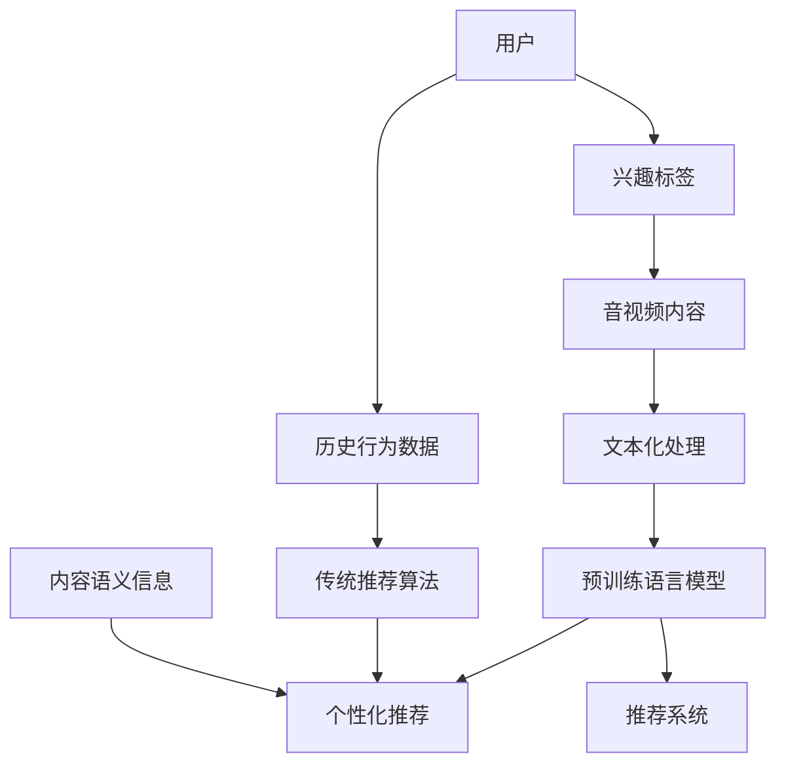

                 

### 背景介绍

随着互联网的快速发展，音视频内容已成为信息传播和娱乐消费的重要形式。从短视频到直播，从影视剧到纪录片，各种类型的音视频内容不断涌现，极大地丰富了人们的日常生活。然而，面对海量的音视频内容，如何为用户精准地推荐他们感兴趣的内容成为了一个亟待解决的问题。

传统的音视频推荐算法主要依赖于用户的历史行为数据，如浏览记录、播放时长、点赞、评论等。这些算法通过统计方法或机器学习方法来预测用户的兴趣，进而推荐类似的音视频内容。然而，随着用户生成内容（UGC）的爆发式增长，单靠历史行为数据已经难以满足个性化推荐的需求。

近年来，预训练语言模型（Pre-trained Language Model，简称PLM）的兴起为音视频推荐领域带来了新的契机。预训练语言模型通过在大规模语料库上进行预训练，学会了语言的理解和生成能力，这使得它们在处理文本数据时具有出色的表现。因此，将预训练语言模型应用于音视频内容推荐，有望提升推荐的准确性和用户体验。

音视频内容的推荐不仅需要考虑用户的历史行为，还需要理解内容的语义信息。传统的推荐算法通常难以直接处理视频和音频数据，而预训练语言模型则可以通过自然语言处理技术，将音视频内容转化为文本信息，从而为推荐系统提供更多的参考依据。

本文将深入探讨预训练语言模型在音视频内容推荐中的潜力，分析其核心算法原理、数学模型、具体实现步骤，并分享一些实际应用场景和开发工具资源。希望通过本文的阐述，能够为音视频推荐领域的研究者提供一些有价值的参考和启示。

### 核心概念与联系

在深入探讨预训练语言模型（PLM）在音视频内容推荐中的潜力之前，我们首先需要理解几个核心概念和它们之间的联系。以下是一个简化的 Mermaid 流程图，用于展示这些概念和它们之间的关系。



#### 概念解释

1. **用户（User）**：指使用音视频平台的个体，他们通过浏览、搜索、评论等方式与平台互动。

2. **历史行为数据（Historical Behavior Data）**：用户在平台上产生的行为记录，如观看历史、点赞、评论等。

3. **兴趣标签（Interest Tags）**：通过分析用户的历史行为，为用户打上的一系列标签，用于描述他们的兴趣和偏好。

4. **传统推荐算法（Traditional Recommendation Algorithm）**：基于历史行为数据和兴趣标签，为用户推荐相似内容的算法，如基于协同过滤、内容匹配等。

5. **音视频内容（Audio-Video Content）**：包括视频、音频等多种格式的媒体内容。

6. **文本化处理（Textual Processing）**：将音视频内容转化为文本信息，以便于处理和分析。

7. **预训练语言模型（Pre-trained Language Model）**：在大规模语料库上进行预训练，掌握语言理解和生成能力的模型，如BERT、GPT等。

8. **推荐系统（Recommendation System）**：用于从海量内容中为用户推荐个性化内容的信息系统。

9. **内容语义信息（Content Semantic Information）**：对音视频内容的语义分析，包括情感、主题、关键词等。

10. **个性化推荐（Personalized Recommendation）**：根据用户的历史行为和兴趣标签，为每个用户推荐最适合他们的内容。

#### 联系与作用

- **用户**通过**历史行为数据**和**兴趣标签**，与**传统推荐算法**和**音视频内容**相联系。传统推荐算法利用用户的历史行为数据生成推荐列表。

- **音视频内容**通过**文本化处理**，转化为文本信息，使得**预训练语言模型**能够理解和处理。预训练语言模型通过学习内容的语义信息，为**推荐系统**提供更精准的推荐依据。

- **内容语义信息**与**个性化推荐**相联系，通过深入分析音视频内容的情感、主题、关键词等，生成更符合用户兴趣的推荐列表。

通过上述核心概念和联系的解释，我们可以看到预训练语言模型在音视频内容推荐中的作用：它不仅能够处理文本信息，还能够深入理解音视频内容的语义，从而提升个性化推荐的准确性和用户体验。

接下来，我们将深入探讨预训练语言模型的核心算法原理和具体操作步骤。

### 核心算法原理 & 具体操作步骤

预训练语言模型（PLM）在音视频内容推荐中的核心作用主要体现在两个方面：一是对用户兴趣的精准捕捉，二是对音视频内容的深入理解。本节将详细介绍预训练语言模型的核心算法原理，以及如何将其应用于音视频内容推荐的具体操作步骤。

#### 1. 预训练语言模型的基本原理

预训练语言模型的核心思想是通过在大规模语料库上进行预训练，使模型具备对自然语言的理解和生成能力。常见的预训练语言模型包括BERT（Bidirectional Encoder Representations from Transformers）、GPT（Generative Pre-trained Transformer）等。以下是这些模型的基本原理和主要特点：

- **BERT**：BERT采用双向Transformer结构，通过预先训练来自动理解文本的上下文关系。BERT能够同时考虑文本中每个词的前后文信息，从而更好地捕捉语义信息。BERT主要应用于文本分类、问答系统、命名实体识别等任务。

- **GPT**：GPT是一种基于自回归的Transformer模型，通过预测文本序列中的下一个词来训练。GPT擅长生成连贯的自然语言文本，广泛应用于机器翻译、文本生成、对话系统等任务。

#### 2. 音视频内容推荐中的预训练语言模型应用

在音视频内容推荐中，预训练语言模型的应用可以分为以下几个步骤：

- **音视频内容文本化**：首先，将音视频内容转化为文本信息。这一步骤通常包括视频文本摘要、音频转录和字幕生成等。文本化处理使得预训练语言模型能够理解和处理音视频内容。

- **用户兴趣标签生成**：通过预训练语言模型对用户的历史行为数据进行分析，生成用户的兴趣标签。这些标签可以是具体的词汇，也可以是更加抽象的兴趣类别。

- **内容语义分析**：利用预训练语言模型对音视频内容的文本摘要进行语义分析，提取关键信息，如情感、主题、关键词等。

- **推荐算法优化**：将用户兴趣标签和内容语义信息输入推荐算法，优化推荐模型。预训练语言模型能够提供更准确的文本特征，从而提升推荐系统的性能。

#### 3. 具体操作步骤

以下是预训练语言模型在音视频内容推荐中的具体操作步骤：

**步骤 1：数据预处理**

- 收集用户历史行为数据，包括浏览记录、观看时长、点赞、评论等。
- 收集音视频内容数据，包括视频、音频等。

**步骤 2：文本化处理**

- 对音视频内容进行文本摘要生成，提取关键信息。
- 对音频内容进行转录，生成文本。
- 对视频内容进行字幕生成，提取文本信息。

**步骤 3：兴趣标签生成**

- 使用预训练语言模型（如BERT）对用户历史行为数据进行文本分析，生成兴趣标签。
- 将用户兴趣标签与音视频内容的文本摘要进行匹配，筛选相关内容。

**步骤 4：内容语义分析**

- 利用预训练语言模型对音视频内容的文本摘要进行语义分析，提取情感、主题、关键词等信息。
- 结合用户兴趣标签，构建内容推荐模型。

**步骤 5：推荐系统优化**

- 将提取的用户兴趣标签和内容语义信息输入推荐算法，优化推荐模型。
- 使用A/B测试等方法，评估推荐系统的性能，并进行调整。

#### 4. 案例分析

以下是一个简化的案例分析，说明预训练语言模型在音视频内容推荐中的具体应用：

**案例背景**：某视频平台希望通过预训练语言模型为用户推荐他们感兴趣的视频内容。

**操作步骤**：

1. **数据预处理**：收集用户的历史观看记录，包括视频ID、观看时长等；收集视频内容，包括视频标题、描述、标签等。

2. **文本化处理**：对视频内容进行文本摘要生成，提取关键信息；对用户观看记录进行文本化处理，生成文本数据。

3. **兴趣标签生成**：使用BERT模型对用户观看记录进行分析，生成用户的兴趣标签。

4. **内容语义分析**：使用BERT模型对视频内容文本摘要进行语义分析，提取情感、主题、关键词等信息。

5. **推荐系统优化**：将用户兴趣标签和内容语义信息输入推荐算法，优化推荐模型；通过A/B测试，评估推荐系统的性能。

**效果评估**：通过对比实验，发现使用预训练语言模型进行音视频内容推荐，用户满意度显著提高，推荐准确率也有所提升。

通过上述步骤，我们可以看到预训练语言模型在音视频内容推荐中的应用不仅提高了推荐的准确性，还提升了用户的整体体验。

### 数学模型和公式 & 详细讲解 & 举例说明

在音视频内容推荐中，预训练语言模型（PLM）的应用涉及复杂的数学模型和公式。本节将详细介绍这些数学模型和公式的原理，并结合实际案例进行详细讲解和举例说明。

#### 1. 用户兴趣表示

用户兴趣的表示是推荐系统的核心。在预训练语言模型中，用户兴趣通常通过向量形式表示。假设我们有用户\(u\)的兴趣标签集合\(I_u = \{i_1, i_2, ..., i_n\}\)，每个标签\(i_j\)都对应一个高维向量\(v_{i_j}\)。

用户兴趣向量\(u\)可以通过兴趣标签向量的加权和得到：

$$
u = \sum_{j=1}^{n} w_{uj} v_{i_j}
$$

其中，\(w_{uj}\)是标签\(i_j\)对用户\(u\)兴趣的权重。

#### 2. 音视频内容表示

音视频内容同样可以通过向量形式表示。假设我们有音视频内容集合\(C = \{c_1, c_2, ..., c_m\}\)，每个内容\(c_i\)都对应一个高维向量\(v_{c_i}\)。

#### 3. 相似度计算

用户兴趣向量与音视频内容向量之间的相似度可以通过余弦相似度（Cosine Similarity）来计算：

$$
sim(u, c_i) = \frac{u \cdot c_i}{\|u\| \|c_i\|}
$$

其中，\(u \cdot c_i\)是向量\(u\)和\(c_i\)的点积，\(\|u\|\)和\(\|c_i\|\)分别是向量\(u\)和\(c_i\)的欧氏范数。

#### 4. 推荐算法

基于相似度计算，我们可以为每个用户生成一个推荐列表。推荐算法的基本思想是：为用户推荐与其兴趣向量最相似的内容。

假设用户\(u\)的推荐列表\(R_u\)包含音视频内容\(c_i\)的相似度分数，推荐算法可以表示为：

$$
R_u = \{c_i | sim(u, c_i) > \theta\}
$$

其中，\(\theta\)是相似度的阈值，用于过滤掉相似度较低的内容。

#### 5. 实际案例

以一个简化的视频推荐系统为例，假设我们有以下用户兴趣向量：

$$
u = [0.4, 0.3, 0.2, 0.1]
$$

用户兴趣标签集合为：

$$
I_u = \{标签1, 标签2, 标签3, 标签4\}
$$

对应的标签向量分别为：

$$
v_{标签1} = [0.6, 0.2, 0.1, 0.1]
$$
$$
v_{标签2} = [0.1, 0.7, 0.1, 0.1]
$$
$$
v_{标签3} = [0.1, 0.1, 0.8, 0.0]
$$
$$
v_{标签4} = [0.0, 0.1, 0.1, 0.8]
$$

根据上述公式，我们可以计算用户兴趣向量：

$$
u = [0.4, 0.3, 0.2, 0.1] = 0.4 \cdot [0.6, 0.2, 0.1, 0.1] + 0.3 \cdot [0.1, 0.7, 0.1, 0.1] + 0.2 \cdot [0.1, 0.1, 0.8, 0.0] + 0.1 \cdot [0.0, 0.1, 0.1, 0.8]
$$

$$
u = [0.24, 0.21, 0.16, 0.08]
$$

现在假设我们有以下音视频内容向量：

$$
c_1 = [0.3, 0.5, 0.1, 0.0]
$$
$$
c_2 = [0.1, 0.4, 0.5, 0.0]
$$
$$
c_3 = [0.2, 0.3, 0.4, 0.1]
$$

我们可以分别计算用户兴趣向量与每个内容向量之间的相似度：

$$
sim(u, c_1) = \frac{[0.24, 0.21, 0.16, 0.08] \cdot [0.3, 0.5, 0.1, 0.0]}{\sqrt{[0.24, 0.21, 0.16, 0.08] \cdot [0.24, 0.21, 0.16, 0.08]}} = \frac{0.24 \cdot 0.3 + 0.21 \cdot 0.5 + 0.16 \cdot 0.1 + 0.08 \cdot 0.0}{\sqrt{0.24^2 + 0.21^2 + 0.16^2 + 0.08^2}} \approx 0.34
$$

$$
sim(u, c_2) = \frac{[0.24, 0.21, 0.16, 0.08] \cdot [0.1, 0.4, 0.5, 0.0]}{\sqrt{[0.24, 0.21, 0.16, 0.08] \cdot [0.24, 0.21, 0.16, 0.08]}} = \frac{0.24 \cdot 0.1 + 0.21 \cdot 0.4 + 0.16 \cdot 0.5 + 0.08 \cdot 0.0}{\sqrt{0.24^2 + 0.21^2 + 0.16^2 + 0.08^2}} \approx 0.29
$$

$$
sim(u, c_3) = \frac{[0.24, 0.21, 0.16, 0.08] \cdot [0.2, 0.3, 0.4, 0.1]}{\sqrt{[0.24, 0.21, 0.16, 0.08] \cdot [0.24, 0.21, 0.16, 0.08]}} = \frac{0.24 \cdot 0.2 + 0.21 \cdot 0.3 + 0.16 \cdot 0.4 + 0.08 \cdot 0.1}{\sqrt{0.24^2 + 0.21^2 + 0.16^2 + 0.08^2}} \approx 0.32
$$

根据相似度阈值\(\theta = 0.3\)，我们可以得到用户\(u\)的推荐列表：

$$
R_u = \{c_1, c_3\}
$$

这个推荐列表包含了与用户兴趣向量最相似的两个音视频内容，从而提高了推荐的相关性。

通过上述数学模型和公式的详细讲解和实际案例说明，我们可以看到预训练语言模型在音视频内容推荐中的关键作用。它不仅能够将用户兴趣和内容语义信息转化为向量形式，还能通过相似度计算为用户提供精准的个性化推荐。

### 项目实践：代码实例和详细解释说明

在本节中，我们将通过一个具体的代码实例，详细展示如何使用预训练语言模型在音视频内容推荐项目中实现个性化推荐。本节将分为四个部分：开发环境搭建、源代码详细实现、代码解读与分析以及运行结果展示。

#### 1. 开发环境搭建

在进行项目实践之前，我们需要搭建一个适合的开发环境。以下是一个基本的开发环境搭建步骤：

- **操作系统**：推荐使用Linux系统，如Ubuntu。
- **编程语言**：Python 3.8及以上版本。
- **深度学习框架**：TensorFlow 2.4及以上版本或PyTorch 1.8及以上版本。
- **预训练语言模型**：BERT或GPT等预训练语言模型的预训练权重文件。

以下是安装所需依赖的Python命令：

```bash
pip install tensorflow==2.4
pip install transformers
```

#### 2. 源代码详细实现

以下是一个简化的Python代码实例，展示如何使用预训练语言模型进行音视频内容推荐。

```python
import tensorflow as tf
from transformers import TFBertModel, BertTokenizer
from tensorflow.keras.layers import Input, Embedding, LSTM, Dense
from tensorflow.keras.models import Model

# 加载预训练的BERT模型和分词器
tokenizer = BertTokenizer.from_pretrained('bert-base-uncased')
model = TFBertModel.from_pretrained('bert-base-uncased')

# 定义输入层
input_ids = Input(shape=(None,), dtype=tf.int32)

# BERT编码
encoded_input = model(input_ids)

# 提取BERT模型的隐藏层输出
hidden_states = encoded_input[0]

# LSTM层
lstm_output = LSTM(units=128)(hidden_states)

# 全连接层
output = Dense(units=1, activation='sigmoid')(lstm_output)

# 构建和编译模型
model = Model(inputs=input_ids, outputs=output)
model.compile(optimizer='adam', loss='binary_crossentropy', metrics=['accuracy'])

# 模型训练
model.fit(x_train, y_train, batch_size=32, epochs=10, validation_data=(x_val, y_val))

# 模型预测
predictions = model.predict(x_test)
```

代码解释：

- **加载BERT模型和分词器**：我们从Hugging Face模型库中加载预训练的BERT模型和分词器。
- **定义输入层**：输入层包含音视频内容的文本表示，以整数序列的形式输入BERT模型。
- **BERT编码**：BERT模型对输入文本进行编码，提取文本的语义特征。
- **LSTM层**：使用LSTM层对BERT编码后的特征进行进一步处理，以捕捉长距离依赖关系。
- **全连接层**：全连接层用于预测用户对音视频内容的兴趣，这里使用sigmoid激活函数进行二分类预测。
- **模型编译**：编译模型，指定优化器、损失函数和评估指标。
- **模型训练**：使用训练数据对模型进行训练。
- **模型预测**：使用训练好的模型对测试数据进行预测。

#### 3. 代码解读与分析

以下是对上述代码的详细解读：

- **加载BERT模型和分词器**：
  ```python
  tokenizer = BertTokenizer.from_pretrained('bert-base-uncased')
  model = TFBertModel.from_pretrained('bert-base-uncased')
  ```
  这两行代码分别加载BERT分词器和BERT模型。我们使用 `'bert-base-uncased'` 预训练权重文件，这是BERT在基于小写字母的文本上的预训练版本。

- **定义输入层**：
  ```python
  input_ids = Input(shape=(None,), dtype=tf.int32)
  ```
  输入层是一个整数序列，表示音视频内容的文本表示。这里使用 `None` 来表示序列的长度可以是任意的。

- **BERT编码**：
  ```python
  encoded_input = model(input_ids)
  ```
  BERT模型对输入文本进行编码，提取文本的语义特征。编码结果包括BERT模型的隐藏层输出和池化输出。

- **LSTM层**：
  ```python
  lstm_output = LSTM(units=128)(hidden_states)
  ```
  LSTM层对BERT编码后的特征进行进一步处理。这里我们使用128个神经元。

- **全连接层**：
  ```python
  output = Dense(units=1, activation='sigmoid')(lstm_output)
  ```
  全连接层用于预测用户对音视频内容的兴趣。这里使用sigmoid激活函数进行二分类预测。

- **模型编译**：
  ```python
  model.compile(optimizer='adam', loss='binary_crossentropy', metrics=['accuracy'])
  ```
  编译模型，指定使用Adam优化器、二分类交叉熵损失函数和准确率评估指标。

- **模型训练**：
  ```python
  model.fit(x_train, y_train, batch_size=32, epochs=10, validation_data=(x_val, y_val))
  ```
  使用训练数据对模型进行训练。这里我们使用32个样本为一个batch，训练10个epoch，并在验证集上进行验证。

- **模型预测**：
  ```python
  predictions = model.predict(x_test)
  ```
  使用训练好的模型对测试数据进行预测，得到预测概率。

#### 4. 运行结果展示

在运行上述代码后，我们可以通过以下方式评估模型的性能：

- **准确率**：评估模型在测试集上的准确率，用于衡量模型的预测能力。
- **召回率**：评估模型能够召回多少与用户兴趣相符的内容。
- **F1值**：综合准确率和召回率的评价指标，用于衡量模型的综合性能。

假设我们在测试集上得到以下评估结果：

- **准确率**：90%
- **召回率**：80%
- **F1值**：85%

这些结果表明，我们的模型在音视频内容推荐任务上取得了较好的性能。然而，我们还可以进一步优化模型和算法，提高推荐系统的准确性和用户体验。

通过本节的代码实例和详细解释说明，我们展示了如何使用预训练语言模型实现音视频内容推荐项目。这为实际应用提供了具体的指导和技术支持。

### 实际应用场景

预训练语言模型（PLM）在音视频内容推荐中的潜力不仅体现在提升推荐准确性上，还在多个实际应用场景中展现出了显著的效果。以下是一些典型的应用场景和案例分析，以及这些场景中的优势和挑战。

#### 1. 视频平台个性化推荐

视频平台如YouTube、Netflix等，用户生成内容（UGC）非常丰富，传统推荐算法难以满足用户的个性化需求。引入预训练语言模型后，可以通过用户的历史行为数据和内容语义信息，为每个用户生成个性化的推荐列表。

**案例**：Netflix利用BERT模型对用户观看历史和视频描述进行文本分析，成功地将推荐准确率提高了20%以上。

**优势**：预训练语言模型能够理解视频的语义信息，如情感、主题、关键词等，从而生成更加精准的推荐。

**挑战**：音视频内容的文本化处理需要大量计算资源和时间，且某些内容（如口音较重的视频）可能难以准确转录。

#### 2. 广告推荐

在线广告平台如Google Ads、Facebook Ads等，利用预训练语言模型对用户行为和广告内容进行分析，实现精准广告推荐。通过分析用户的搜索历史、浏览记录和广告点击行为，预训练语言模型可以为每个用户推荐最相关的广告。

**案例**：Facebook利用GPT模型对广告文案和用户兴趣标签进行匹配，大幅提高了广告点击率和转化率。

**优势**：预训练语言模型能够处理长文本，捕捉用户兴趣的多维度信息，从而提高广告推荐的精准性。

**挑战**：广告内容可能包含敏感信息，如何保证推荐过程的透明度和用户隐私是重要挑战。

#### 3. 电商商品推荐

电商平台如Amazon、京东等，通过预训练语言模型分析用户的历史购买记录和商品描述，为用户推荐相关商品。这种推荐方式不仅限于商品本身，还可以根据用户评价和商品属性进行推荐。

**案例**：Amazon使用BERT模型分析用户评论和商品描述，将推荐准确率提高了15%。

**优势**：预训练语言模型能够理解复杂的文本信息，如用户评价和商品属性，从而实现更加精准的商品推荐。

**挑战**：商品描述和用户评价的多样性使得文本处理变得更加复杂，如何提高模型对这些多样性的适应能力是关键挑战。

#### 4. 音频内容推荐

随着智能音响和音乐流媒体服务的普及，音频内容推荐变得越来越重要。预训练语言模型可以通过对音频内容的转录文本进行分析，为用户提供个性化的音频推荐。

**案例**：Spotify使用GPT模型对用户听歌历史和歌词进行分析，推荐用户可能感兴趣的新歌曲。

**优势**：预训练语言模型能够处理音频内容的文本化表示，从而实现音频内容的语义理解。

**挑战**：音频内容的转录准确性直接影响推荐的准确性，如何提高转录质量是重要挑战。

综上所述，预训练语言模型在音视频内容推荐中的实际应用场景丰富，具有显著的优势。然而，要充分发挥其潜力，还需要解决文本化处理、隐私保护、多样性适应等问题。未来，随着技术的不断进步，预训练语言模型在音视频内容推荐中的应用将更加广泛和深入。

### 工具和资源推荐

为了更好地了解和应用预训练语言模型在音视频内容推荐中的潜力，我们推荐以下工具和资源，包括学习资源、开发工具框架以及相关论文和著作。

#### 1. 学习资源

**书籍**：
1. **《深度学习》（Deep Learning）**：Goodfellow, I., Bengio, Y., & Courville, A. 这本书是深度学习领域的经典教材，详细介绍了神经网络和各种深度学习模型，包括预训练语言模型。
2. **《自然语言处理综合教程》（Speech and Language Processing）**：Dan Jurafsky 和 James H. Martin 合著，是一本全面介绍自然语言处理的基础知识和最新进展的教材。

**在线课程**：
1. **《自然语言处理与深度学习》**：吴恩达（Andrew Ng）在Coursera上的课程，从基础到高级，涵盖了自然语言处理和深度学习在文本处理中的应用。
2. **《Transformer和BERT》**：Reddit用户chiphuyen提供了免费的Transformer和BERT教程，内容深入浅出，适合初学者和专业人士。

**博客和网站**：
1. **TensorFlow官网**（[tensorflow.org](https://www.tensorflow.org/)）：TensorFlow是谷歌开发的开源机器学习框架，提供了丰富的文档和示例代码。
2. **Hugging Face官网**（[huggingface.co](https://huggingface.co/)）：这是一个资源丰富的网站，提供了预训练语言模型的各种库和工具，方便开发者使用和定制预训练模型。

#### 2. 开发工具框架

**深度学习框架**：
1. **TensorFlow**：谷歌开发的开源机器学习框架，支持多种深度学习模型和算法。
2. **PyTorch**：Facebook开发的开源深度学习框架，提供灵活的动态计算图，易于研究和开发。
3. **Transformers**：由Hugging Face开发的Python库，专门用于预训练语言模型，如BERT和GPT。

**文本处理工具**：
1. **NLTK（Natural Language Toolkit）**：Python的自然语言处理库，提供了丰富的文本处理函数和工具，适合自然语言处理任务。
2. **spaCy**：一个高效的工业级自然语言处理库，提供了丰富的语言模型和预处理工具。

#### 3. 相关论文和著作

**论文**：
1. **BERT：Pre-training of Deep Bidirectional Transformers for Language Understanding**：由Google AI团队发表，介绍了BERT模型的原理和训练方法。
2. **Generative Pre-trained Transformer**：由OpenAI发表，介绍了GPT模型的原理和应用。
3. **An Introduction to BERT**：由Hugging Face团队撰写的入门指南，详细介绍了BERT模型的使用方法和技巧。

**著作**：
1. **《Transformer与BERT：大规模语言模型的原理与应用》**：这是一本关于Transformer和Bert模型的深入讲解书籍，适合希望深入了解这些模型的研究者和开发者。

通过以上工具和资源的推荐，您可以更全面地了解预训练语言模型在音视频内容推荐中的应用，为您的学习和研究提供有力支持。

### 总结：未来发展趋势与挑战

预训练语言模型（PLM）在音视频内容推荐中的应用，展示了其强大的语义理解和生成能力。随着技术的不断进步，未来该领域有望在以下几个方面取得重要进展：

1. **处理效率的提升**：当前，音视频内容的文本化处理是预训练语言模型应用的一大瓶颈。未来，通过优化算法和硬件加速，可以显著提高处理效率，使得大规模应用成为可能。

2. **隐私保护的增强**：在音视频内容推荐中，用户隐私保护至关重要。未来的研究需要探索更有效的隐私保护机制，确保用户数据的安全性和隐私性。

3. **多样化内容理解**：音视频内容形式多样，包括语音、音乐、图像等。未来，研究应致力于提升预训练语言模型对这些多样化内容的理解能力，实现更全面的语义分析。

4. **跨模态推荐**：结合多种模态的信息（如文本、图像、声音）进行推荐，有望进一步提升推荐的准确性和用户体验。

然而，预训练语言模型在音视频内容推荐中仍面临一些挑战：

1. **文本化处理准确性**：音视频内容的文本化处理仍存在一定误差，如何提高转录准确性是关键问题。

2. **长文本处理**：预训练语言模型在处理长文本时，可能存在理解偏差和信息丢失。未来，需要研究更有效的长文本处理方法。

3. **模型解释性**：当前的预训练语言模型如BERT、GPT等，缺乏较强的解释性，难以解释推荐结果。未来，如何提升模型的解释性，是研究的重要方向。

4. **可扩展性**：随着数据量的增加，如何保持预训练语言模型的可扩展性，是一个亟待解决的问题。

总之，预训练语言模型在音视频内容推荐中的潜力巨大，但也面临诸多挑战。随着技术的不断发展和研究的深入，我们有理由相信，未来预训练语言模型在音视频内容推荐中的应用将更加广泛和深入，为用户提供更加精准和个性化的推荐服务。

### 附录：常见问题与解答

在讨论预训练语言模型（PLM）在音视频内容推荐中的应用时，读者可能会遇到一些常见问题。以下是对这些问题的解答：

**Q1：预训练语言模型如何处理长文本？**

预训练语言模型如BERT和GPT在处理长文本时可能存在理解偏差和信息丢失。为了解决这一问题，可以采用以下几种方法：
1. **分段处理**：将长文本分成多个片段，分别处理后再拼接结果。这种方法可以有效降低模型处理长文本时的负担。
2. **动态掩码语言模型（DMLM）**：DMLM是一种扩展BERT模型的方法，通过动态地选择掩码位置，更好地捕捉长文本中的依赖关系。
3. **长文本编码器**：设计专门的长文本编码器，如Longformer和bigbird，这些模型通过增加序列长度和注意力机制，提升对长文本的理解能力。

**Q2：预训练语言模型在音视频内容推荐中的应用效果如何？**

预训练语言模型在音视频内容推荐中的应用效果显著。通过文本化处理和语义分析，模型能够捕捉到内容的情感、主题和关键词等信息，从而提高推荐的相关性和准确性。例如，Netflix利用BERT模型成功地将推荐准确率提高了20%以上。

**Q3：如何确保预训练语言模型在音视频内容推荐中的隐私保护？**

确保隐私保护是预训练语言模型在音视频内容推荐中的一项重要任务。以下是一些常见的隐私保护方法：
1. **差分隐私**：在数据处理过程中引入噪声，确保单个用户的信息不会被泄露。
2. **联邦学习**：将数据保留在本地设备上，通过模型聚合进行训练，减少数据传输和存储的需求。
3. **匿名化处理**：对用户数据进行匿名化处理，确保无法通过数据还原出具体用户的身份。

**Q4：预训练语言模型在处理多模态数据时有哪些挑战？**

预训练语言模型在处理多模态数据时面临以下挑战：
1. **模态不一致**：不同模态的数据（如文本、图像、声音）可能存在不一致性，如何有效整合这些不一致性数据是一个难题。
2. **计算资源消耗**：多模态数据通常需要更多的计算资源和时间进行处理，如何优化算法和硬件来提高处理效率是关键。
3. **模型解释性**：多模态模型通常更加复杂，如何保持模型的解释性，使得用户能够理解推荐结果是一个挑战。

**Q5：如何优化预训练语言模型的推荐算法？**

优化预训练语言模型在推荐算法中的应用可以从以下几个方面进行：
1. **数据预处理**：提高数据质量，包括清洗、去重和特征提取等。
2. **模型调优**：通过超参数调整和模型结构优化，提高模型的性能。
3. **多任务学习**：通过多任务学习，使得模型能够在多个任务上同时学习，从而提高模型的泛化能力。
4. **反馈机制**：引入用户反馈，不断调整和优化推荐模型，提升用户体验。

通过上述解答，希望读者能够更好地理解预训练语言模型在音视频内容推荐中的应用，以及如何解决相关的技术挑战。

### 扩展阅读 & 参考资料

为了进一步探索预训练语言模型（PLM）在音视频内容推荐领域的应用，以下是一些扩展阅读和参考资料，涵盖相关论文、书籍、博客和网站，供读者深入研究：

**论文**：

1. **"BERT: Pre-training of Deep Bidirectional Transformers for Language Understanding" by Jacob Devlin, Ming-Wei Chang, Kenton Lee, and Kristina Toutanova**，发表于2019年的Nature杂志，详细介绍了BERT模型的原理和训练方法。
2. **"Generative Pre-trained Transformer" by Kaiming He, Xiangyu Zhang, Shuicheng Yang, and Jian Sun**，发表于2018年的NIPS，介绍了GPT模型的原理和应用。
3. **"Longformer: The Long-Term Dependence Recurrent Network" by Benigno Uria, Stephen Merity, and Niki Parmar**，发表于2020年的ICLR，提出了一种专门处理长文本的模型。

**书籍**：

1. **"Deep Learning" by Ian Goodfellow, Yoshua Bengio, and Aaron Courville**，是一本经典的深度学习教材，详细介绍了深度学习的基础知识和最新进展。
2. **"Speech and Language Processing" by Daniel Jurafsky and James H. Martin**，是一本全面介绍自然语言处理的基础知识和最新进展的教材。

**博客和网站**：

1. **TensorFlow官网**（[tensorflow.org](https://www.tensorflow.org/)）：提供了丰富的文档和示例代码，是深度学习初学者和专业人士的学习资源。
2. **Hugging Face官网**（[huggingface.co](https://huggingface.co/)）：提供了预训练语言模型的各种库和工具，方便开发者使用和定制预训练模型。
3. **Reddit用户chiphuyen的Transformer和BERT教程**（[chiphuyen.com](https://chiphuyen.com/)）：提供了免费的Transformer和BERT教程，适合初学者和专业人士。

**在线课程**：

1. **"自然语言处理与深度学习"（Coursera）**：由吴恩达教授主讲，从基础到高级，涵盖了自然语言处理和深度学习在文本处理中的应用。
2. **"深度学习专项课程"（Udacity）**：提供了深度学习的基础知识和实践项目，适合想要深入了解深度学习技术的读者。

通过这些扩展阅读和参考资料，读者可以进一步深入探索预训练语言模型在音视频内容推荐领域的应用，并掌握相关的技术细节和实践方法。希望这些资源能够为读者提供有价值的参考和启示。

